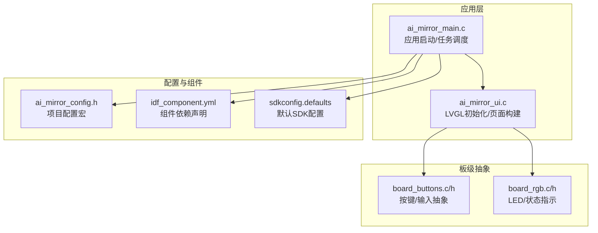
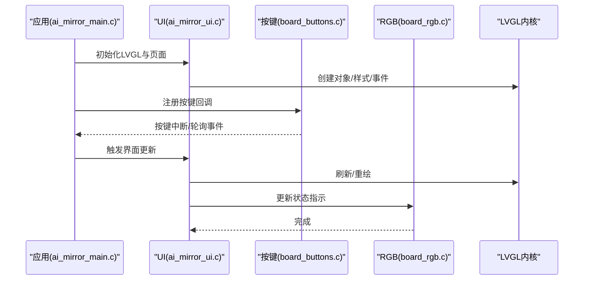
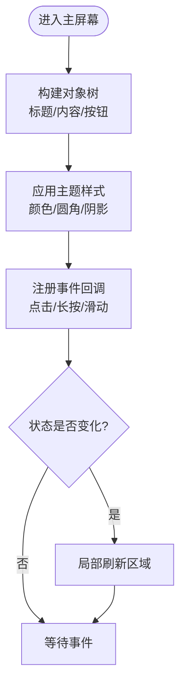
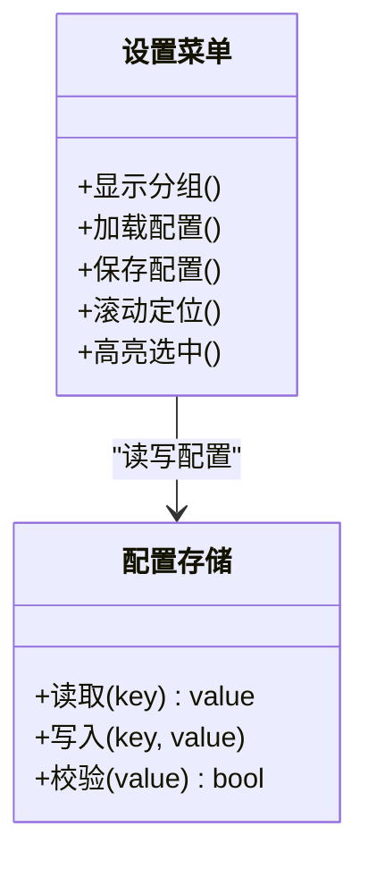
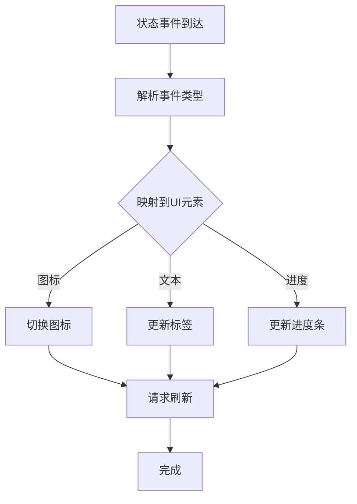
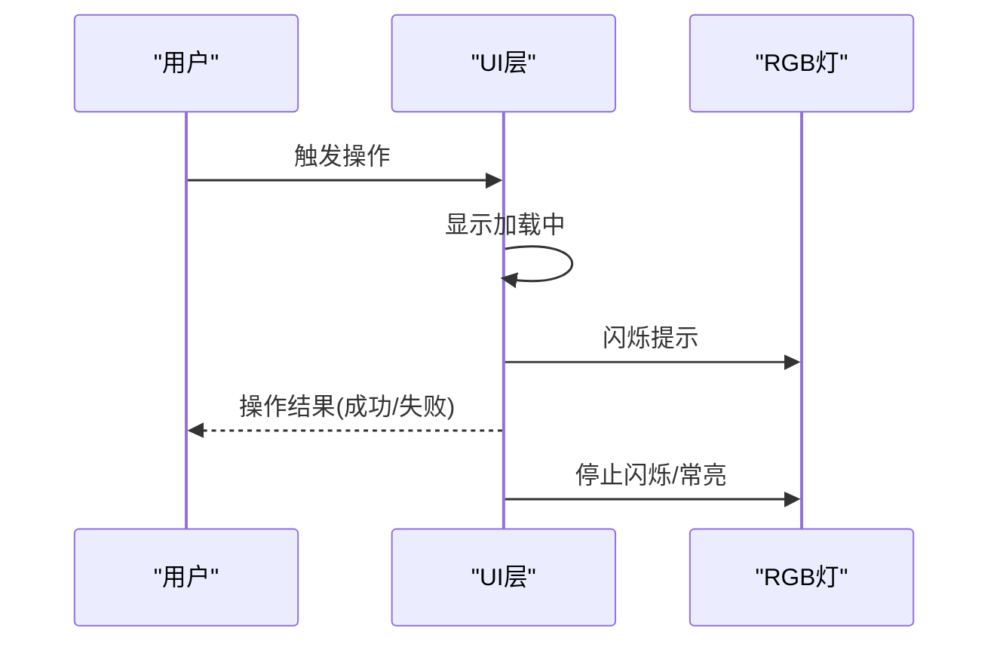
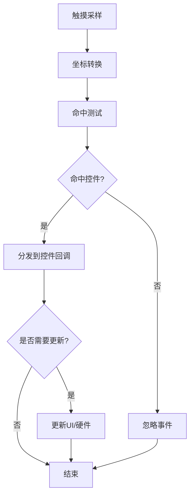
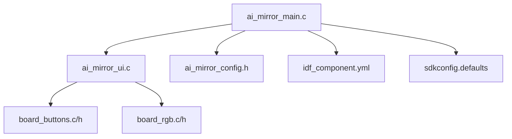

# 用户界面

<cite>
**本文引用的文件**   
- [ai_mirror_ui.c](file://Firmware/esp32_ai_mirror/main/ai_mirror_ui.c)
- [ai_mirror_main.c](file://Firmware/esp32_ai_mirror/main/ai_mirror_main.c)
- [board_buttons.c](file://Firmware/esp32_ai_mirror/main/board_buttons.c)
- [board_buttons.h](file://Firmware/esp32_ai_mirror/main/board_buttons.h)
- [board_rgb.c](file://Firmware/esp32_ai_mirror/main/board_rgb.c)
- [board_rgb.h](file://Firmware/esp32_ai_mirror/main/board_rgb.h)
- [ai_mirror_config.h](file://Firmware/esp32_ai_mirror/main/ai_mirror_config.h)
- [idf_component.yml](file://Firmware/esp32_ai_mirror/main/idf_component.yml)
- [sdkconfig.defaults](file://Firmware/esp32_ai_mirror/sdkconfig.defaults)
- [README.md](file://Firmware/esp32_ai_mirror/README.md)
</cite>

## 目录
1. [简介](#简介)
2. [项目结构](#项目结构)
3. [核心组件](#核心组件)
4. [架构总览](#架构总览)
5. [详细组件分析](#详细组件分析)
6. [依赖关系分析](#依赖关系分析)
7. [性能考虑](#性能考虑)
8. [故障排查指南](#故障排查指南)
9. [结论](#结论)
10. [附录](#附录)

## 简介
本文件面向AI镜子项目的用户界面，基于LVGL框架进行设计与实现。文档从系统架构、交互模式、主要界面组件（主屏幕、设置菜单、状态显示与用户反馈）、触摸事件处理机制、主题定制与动画过渡、多语言与字体配置，以及性能优化与内存使用建议等方面进行全面说明，帮助开发者快速理解并扩展UI功能。

## 项目结构
AI镜子的UI代码位于ESP-IDF工程的主应用目录中，围绕LVGL的初始化、页面构建、事件分发与硬件抽象展开。关键文件包括：
- UI入口与页面构建：ai_mirror_ui.c
- 应用启动与任务调度：ai_mirror_main.c
- 板级按键与输入抽象：board_buttons.c/h
- 板级RGB指示灯控制：board_rgb.c/h
- 项目配置与组件声明：ai_mirror_config.h、idf_component.yml、sdkconfig.defaults

图表来源 
- [ai_mirror_main.c](file://Firmware/esp32_ai_mirror/main/ai_mirror_main.c)
- [ai_mirror_ui.c](file://Firmware/esp32_ai_mirror/main/ai_mirror_ui.c)
- [board_buttons.c](file://Firmware/esp32_ai_mirror/main/board_buttons.c)
- [board_buttons.h](file://Firmware/esp32_ai_mirror/main/board_buttons.h)
- [board_rgb.c](file://Firmware/esp32_ai_mirror/main/board_rgb.c)
- [board_rgb.h](file://Firmware/esp32_ai_mirror/main/board_rgb.h)
- [ai_mirror_config.h](file://Firmware/esp32_ai_mirror/main/ai_mirror_config.h)
- [idf_component.yml](file://Firmware/esp32_ai_mirror/main/idf_component.yml)
- [sdkconfig.defaults](file://Firmware/esp32_ai_mirror/sdkconfig.defaults)

章节来源
- [README.md](file://Firmware/esp32_ai_mirror/README.md)

## 核心组件
- 主屏幕：作为应用的默认展示页，包含欢迎信息、状态图标与快捷入口按钮。通过LVGL对象树组织布局，支持响应式更新。
- 设置菜单：提供网络、音频、显示等可配置项的分组列表，支持滚动与选择高亮。
- 状态显示：集中呈现设备连接、语音识别、播放状态等，采用标签与进度条组合表达。
- 用户反馈：通过消息提示、指示灯闪烁与震动（若硬件支持）等方式向用户传达操作结果。

章节来源
- [ai_mirror_ui.c](file://Firmware/esp32_ai_mirror/main/ai_mirror_ui.c)
- [board_buttons.c](file://Firmware/esp32_ai_mirror/main/board_buttons.c)
- [board_buttons.h](file://Firmware/esp32_ai_mirror/main/board_buttons.h)
- [board_rgb.c](file://Firmware/esp32_ai_mirror/main/board_rgb.c)
- [board_rgb.h](file://Firmware/esp32_ai_mirror/main/board_rgb.h)

## 架构总览
UI架构遵循“应用驱动 + LVGL渲染 + 板级抽象”的分层设计：
- 应用层负责生命周期管理、任务调度与业务逻辑触发。
- UI层基于LVGL构建对象树、注册事件回调、管理页面切换与动画。
- 板级抽象封装按键、触摸、RGB灯等硬件访问，屏蔽底层差异。

图表来源 
- [ai_mirror_main.c](file://Firmware/esp32_ai_mirror/main/ai_mirror_main.c)
- [ai_mirror_ui.c](file://Firmware/esp32_ai_mirror/main/ai_mirror_ui.c)
- [board_buttons.c](file://Firmware/esp32_ai_mirror/main/board_buttons.c)
- [board_buttons.h](file://Firmware/esp32_ai_mirror/main/board_buttons.h)
- [board_rgb.c](file://Firmware/esp32_ai_mirror/main/board_rgb.c)
- [board_rgb.h](file://Firmware/esp32_ai_mirror/main/board_rgb.h)

## 详细组件分析

### 主屏幕
- 目标：提供清晰的入口与状态概览，减少认知负担。
- 布局：顶部标题区、中部内容区（文本/图片/状态）、底部操作区（按钮）。
- 交互：点击按钮进入设置菜单或执行快捷操作；长按返回主页。
- 更新策略：仅在状态变化时局部刷新，避免全量重绘。

章节来源
- [ai_mirror_ui.c](file://Firmware/esp32_ai_mirror/main/ai_mirror_ui.c)

### 设置菜单
- 目标：结构化展示可配置项，便于查找与修改。
- 布局：分组列表+右侧开关/数值控件；支持滚动与搜索（可选）。
- 交互：选中项高亮，确认保存；返回上一页保留上次位置。
- 数据流：读取配置 -> 填充控件 -> 用户修改 -> 写回配置 -> 持久化。

章节来源
- [ai_mirror_ui.c](file://Firmware/esp32_ai_mirror/main/ai_mirror_ui.c)
- [ai_mirror_config.h](file://Firmware/esp32_ai_mirror/main/ai_mirror_config.h)

### 状态显示
- 目标：以直观方式呈现设备运行状态（如网络、语音、播放）。
- 元素：状态图标、文本标签、进度条、环形指示器。
- 更新：事件驱动增量更新，避免频繁重建对象。

章节来源
- [ai_mirror_ui.c](file://Firmware/esp32_ai_mirror/main/ai_mirror_ui.c)

### 用户反馈
- 目标：对用户的操作给予即时、明确的反馈。
- 手段：消息提示框、RGB灯颜色/闪烁、短促振动（若可用）。
- 时机：成功、失败、进行中三种状态分别对应不同反馈。

章节来源
- [board_rgb.c](file://Firmware/esp32_ai_mirror/main/board_rgb.c)
- [board_rgb.h](file://Firmware/esp32_ai_mirror/main/board_rgb.h)
- [ai_mirror_ui.c](file://Firmware/esp32_ai_mirror/main/ai_mirror_ui.c)

### 触摸事件处理与响应机制
- 采集：通过LVGL的输入设备接口接入触摸/按键抽象层。
- 分发：LVGL将事件路由到当前活动页面的对象树，命中测试确定目标控件。
- 处理：控件回调函数执行业务逻辑，必要时触发UI更新或硬件动作。
- 防抖：对重复触发进行去抖与节流，避免误触与抖动。

章节来源
- [board_buttons.c](file://Firmware/esp32_ai_mirror/main/board_buttons.c)
- [board_buttons.h](file://Firmware/esp32_ai_mirror/main/board_buttons.h)
- [ai_mirror_ui.c](file://Firmware/esp32_ai_mirror/main/ai_mirror_ui.c)

### 界面主题定制
- 主题模型：基于LVGL样式系统，定义全局颜色、字体、圆角、阴影等。
- 动态切换：支持在运行时切换浅色/深色主题，保持控件一致性。
- 资源管理：图标与背景图统一路径与命名规范，便于替换与扩展。

章节来源
- [ai_mirror_ui.c](file://Firmware/esp32_ai_mirror/main/ai_mirror_ui.c)

### 动画效果与过渡
- 动画类型：淡入淡出、缩放、位移、旋转等，用于页面切换与状态提示。
- 性能：限制同时运行的动画数量，优先使用轻量级动画。
- 体验：合理设置时长与缓动曲线，避免过长等待与突兀跳转。

章节来源
- [ai_mirror_ui.c](file://Firmware/esp32_ai_mirror/main/ai_mirror_ui.c)

### 多语言支持与字体配置
- 多语言：通过键值表映射文本，运行时根据语言设置切换显示。
- 字体：按需加载字符集，避免全量字库占用过多内存；中文建议使用精简子集。
- 换行与对齐：根据语言长度调整布局，确保可读性。

章节来源
- [ai_mirror_ui.c](file://Firmware/esp32_ai_mirror/main/ai_mirror_ui.c)

### 界面元素使用示例与自定义方法
- 按钮：设置文本、图标、按下态、禁用态；绑定点击回调。
- 标签：设置字体、颜色、对齐、自动换行。
- 进度条：设置范围、步进、动画更新。
- 自定义控件：继承LVGL基础控件，封装业务逻辑与样式。

章节来源
- [ai_mirror_ui.c](file://Firmware/esp32_ai_mirror/main/ai_mirror_ui.c)

## 依赖关系分析
- 组件依赖：应用层依赖UI层，UI层依赖板级抽象与LVGL。
- 外部依赖：ESP-IDF组件管理器声明LVGL与LCD/Touch驱动。
- 配置依赖：sdkconfig.defaults与项目头文件决定编译选项与运行时行为。

图表来源 
- [ai_mirror_main.c](file://Firmware/esp32_ai_mirror/main/ai_mirror_main.c)
- [ai_mirror_ui.c](file://Firmware/esp32_ai_mirror/main/ai_mirror_ui.c)
- [board_buttons.c](file://Firmware/esp32_ai_mirror/main/board_buttons.c)
- [board_buttons.h](file://Firmware/esp32_ai_mirror/main/board_buttons.h)
- [board_rgb.c](file://Firmware/esp32_ai_mirror/main/board_rgb.c)
- [board_rgb.h](file://Firmware/esp32_ai_mirror/main/board_rgb.h)
- [ai_mirror_config.h](file://Firmware/esp32_ai_mirror/main/ai_mirror_config.h)
- [idf_component.yml](file://Firmware/esp32_ai_mirror/main/idf_component.yml)
- [sdkconfig.defaults](file://Firmware/esp32_ai_mirror/sdkconfig.defaults)

章节来源
- [idf_component.yml](file://Firmware/esp32_ai_mirror/main/idf_component.yml)
- [sdkconfig.defaults](file://Firmware/esp32_ai_mirror/sdkconfig.defaults)

## 性能考虑
- 渲染优化
  - 局部刷新：仅更新变化区域，避免整屏重绘。
  - 对象复用：重用控件实例，减少创建销毁开销。
  - 图像压缩：使用合适的图像格式与尺寸，降低显存占用。
- 事件处理
  - 去抖与节流：防止高频事件导致卡顿。
  - 异步更新：耗时操作放入后台任务，UI线程只负责展示。
- 内存管理
  - 字体按需加载：仅包含必要字符集。
  - 资源释放：页面退出时及时释放不再使用的对象与缓存。
- 动画与过渡
  - 控制并发：限制同时运行的动画数量。
  - 选择轻量动画：优先使用透明度与位移，避免复杂计算。

[本节为通用指导，不直接分析具体文件]

## 故障排查指南
- 常见问题
  - 触摸无响应：检查输入设备初始化与坐标转换是否正确。
  - 界面卡死：排查是否有阻塞调用在主线程执行。
  - 内存不足：检查字体与图像资源大小，启用压缩与按需加载。
  - 主题异常：确认样式变量与控件属性匹配。
- 调试技巧
  - 日志输出：在关键路径打印状态与错误码。
  - 断点与单步：定位事件回调与更新流程。
  - 硬件指示：利用RGB灯辅助判断状态流转。

章节来源
- [board_buttons.c](file://Firmware/esp32_ai_mirror/main/board_buttons.c)
- [board_buttons.h](file://Firmware/esp32_ai_mirror/main/board_buttons.h)
- [board_rgb.c](file://Firmware/esp32_ai_mirror/main/board_rgb.c)
- [board_rgb.h](file://Firmware/esp32_ai_mirror/main/board_rgb.h)
- [ai_mirror_ui.c](file://Firmware/esp32_ai_mirror/main/ai_mirror_ui.c)

## 结论
AI镜子的UI基于LVGL实现了清晰的分层架构与良好的交互体验。通过合理的对象组织、事件分发与板级抽象，系统在有限的资源下提供了流畅的界面与稳定的性能。后续可扩展更多控件与动画，完善多语言与主题体系，进一步提升用户体验。

## 附录
- 术语
  - LVGL：轻量级图形库，用于嵌入式GUI开发。
  - 板级抽象：对硬件接口的封装，屏蔽差异。
  - 主题：统一的视觉风格定义，包括颜色、字体、圆角等。
- 参考
  - ESP-IDF组件管理与配置：参见idf_component.yml与sdkconfig.defaults。
  - LVGL官方文档：了解控件、样式、事件与性能优化最佳实践。