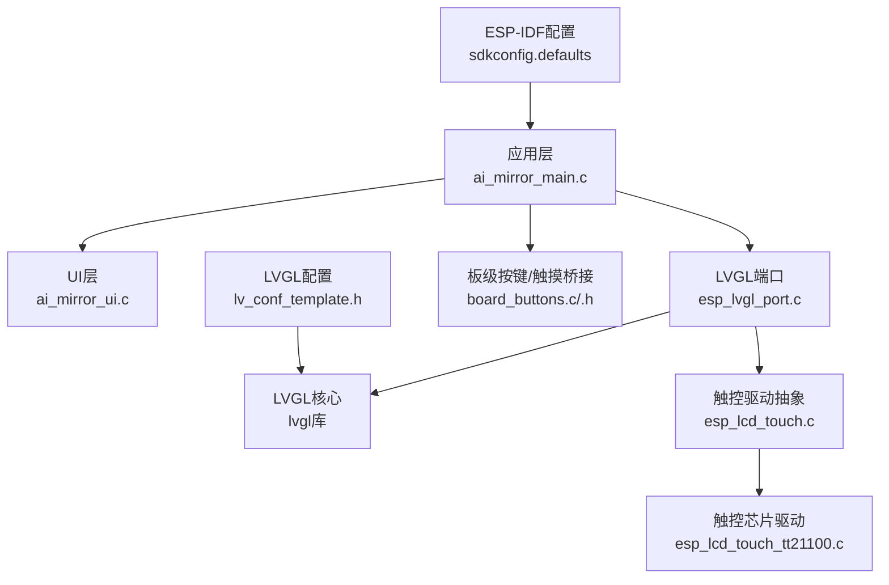
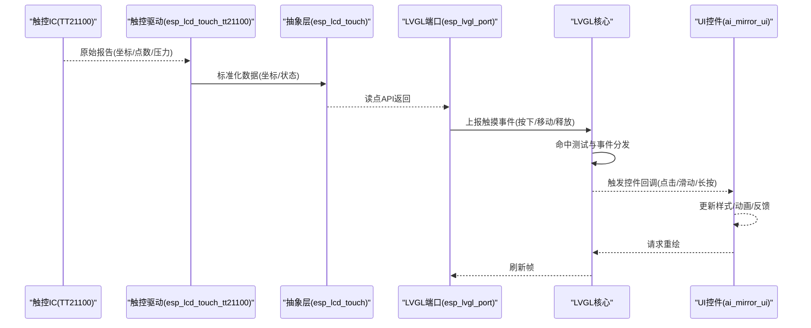
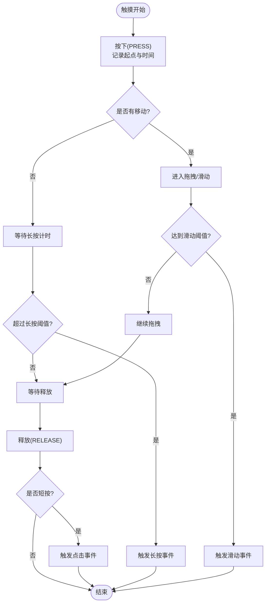
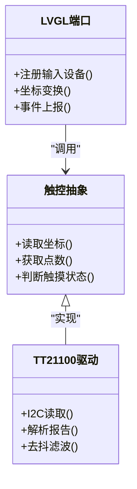
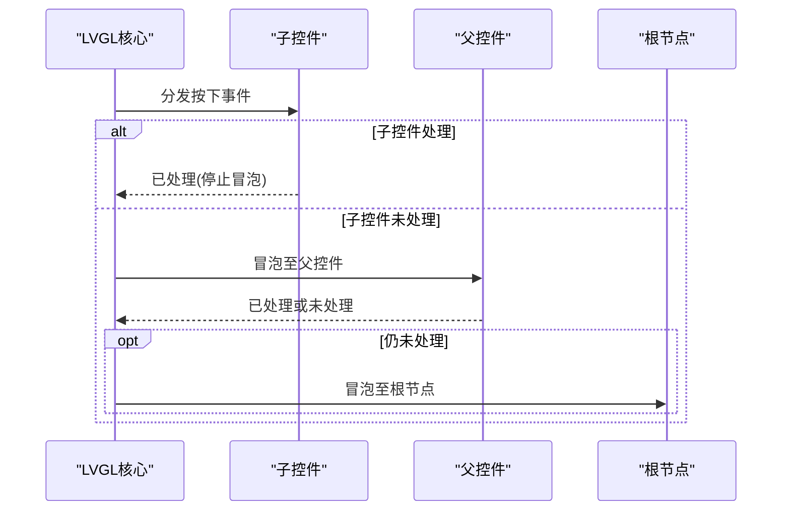
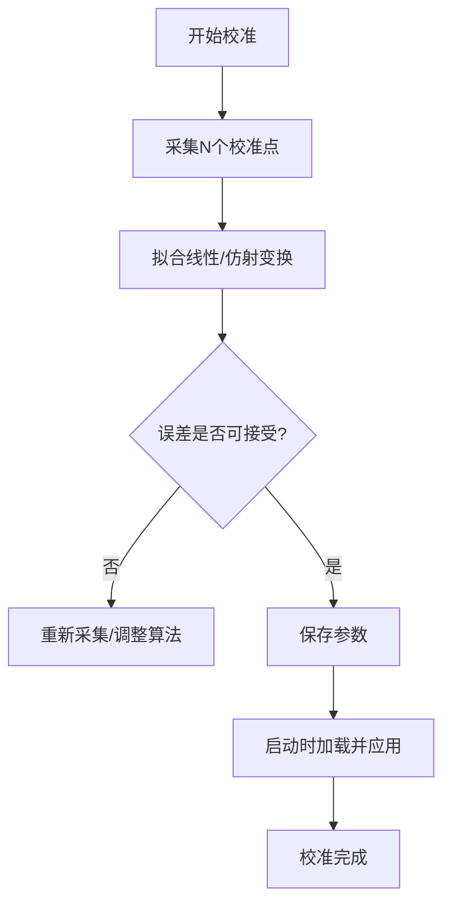
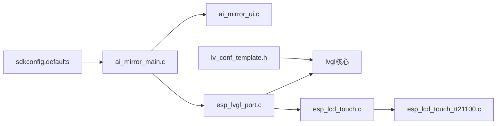

# 触摸交互处理

<cite>
**本文档引用的文件**
- [ai_mirror_main.c](file://Firmware/esp32_ai_mirror/main/ai_mirror_main.c)
- [ai_mirror_ui.c](file://Firmware/esp32_ai_mirror/main/ai_mirror_ui.c)
- [board_buttons.c](file://Firmware/esp32_ai_mirror/main/board_buttons.c)
- [board_buttons.h](file://Firmware/esp32_ai_mirror/main/board_buttons.h)
- [esp_lvgl_port.c](file://Firmware/esp32_ai_mirror/managed_components/espressif__esp_lvgl_port/esp_lvgl_port.c)
- [esp_lcd_touch.c](file://Firmware/esp32_ai_mirror/managed_components/espressif__esp_lcd_touch/esp_lcd_touch.c)
- [esp_lcd_touch_tt21100.c](file://Firmware/esp32_ai_mirror/managed_components/espressif__esp_lcd_touch_tt21100/esp_lcd_touch_tt21100.c)
- [lv_conf_template.h](file://Firmware/esp32_ai_mirror/managed_components/lvgl__lvgl/lv_conf_template.h)
- [sdkconfig.defaults](file://Firmware/esp32_ai_mirror/sdkconfig.defaults)
</cite>

## 目录
1. [简介](#简介)
2. [项目结构](#项目结构)
3. [核心组件](#核心组件)
4. [架构总览](#架构总览)
5. [详细组件分析](#详细组件分析)
6. [依赖关系分析](#依赖关系分析)
7. [性能考虑](#性能考虑)
8. [故障排查指南](#故障排查指南)
9. [结论](#结论)
10. [附录](#附录)

## 简介
本文件面向AI镜子项目的触摸交互子系统，系统性说明从底层触控驱动到LVGL事件分发、再到UI响应与反馈的完整链路。内容覆盖：
- 触摸事件生命周期：按下、释放、滑动、长按等手势识别
- 坐标转换与多点触控支持
- UI元素响应机制与事件冒泡
- 触摸反馈效果与视觉确认
- 灵敏度调节与校准方法
- 自定义手势识别实现指南
- 触摸性能优化与防抖处理

## 项目结构
触摸相关代码主要分布在应用层（main）与组件层（managed_components）：
- 应用层
  - ai_mirror_main.c：系统初始化、任务调度、外设与显示/触摸初始化入口
  - ai_mirror_ui.c：UI构建、控件注册、事件回调绑定
  - board_buttons.c/h：板级按键与触摸桥接（如有）
- 组件层
  - esp_lvgl_port.c：ESP-IDF与LVGL的桥接，含输入设备（触摸）注册与轮询
  - esp_lcd_touch.c / esp_lcd_touch_tt21100.c：触控驱动抽象与具体芯片实现
  - lv_conf_template.h：LVGL配置（触摸、事件、渲染等）
  - sdkconfig.defaults：ESP-IDF编译选项（I2C、SPI、中断、任务栈等）

**图表来源**
- [ai_mirror_main.c](file://Firmware/esp32_ai_mirror/main/ai_mirror_main.c)
- [ai_mirror_ui.c](file://Firmware/esp32_ai_mirror/main/ai_mirror_ui.c)
- [esp_lvgl_port.c](file://Firmware/esp32_ai_mirror/managed_components/espressif__esp_lvgl_port/esp_lvgl_port.c)
- [esp_lcd_touch.c](file://Firmware/esp32_ai_mirror/managed_components/espressif__esp_lcd_touch/esp_lcd_touch.c)
- [esp_lcd_touch_tt21100.c](file://Firmware/esp32_ai_mirror/managed_components/espressif__esp_lcd_touch_tt21100/esp_lcd_touch_tt21100.c)
- [lv_conf_template.h](file://Firmware/esp32_ai_mirror/managed_components/lvgl__lvgl/lv_conf_template.h)
- [sdkconfig.defaults](file://Firmware/esp32_ai_mirror/sdkconfig.defaults)

**章节来源**
- [ai_mirror_main.c](file://Firmware/esp32_ai_mirror/main/ai_mirror_main.c)
- [ai_mirror_ui.c](file://Firmware/esp32_ai_mirror/main/ai_mirror_ui.c)
- [esp_lvgl_port.c](file://Firmware/esp32_ai_mirror/managed_components/espressif__esp_lvgl_port/esp_lvgl_port.c)
- [esp_lcd_touch.c](file://Firmware/esp32_ai_mirror/managed_components/espressif__esp_lcd_touch/esp_lcd_touch.c)
- [esp_lcd_touch_tt21100.c](file://Firmware/esp32_ai_mirror/managed_components/espressif__esp_lcd_touch_tt21100/esp_lcd_touch_tt21100.c)
- [lv_conf_template.h](file://Firmware/esp32_ai_mirror/managed_components/lvgl__lvgl/lv_conf_template.h)
- [sdkconfig.defaults](file://Firmware/esp32_ai_mirror/sdkconfig.defaults)

## 核心组件
- 触控驱动抽象层（esp_lcd_touch）
  - 职责：统一触控数据读取接口、坐标获取、多点触控点数统计、压力值（可选）、时间戳等
  - 关键点：提供读点函数、初始化/反初始化、是否检测到触摸的判断
- 触控芯片驱动（TT21100）
  - 职责：通过I2C/SPI与触控IC通信，解析原始报告，转换为标准坐标与状态
  - 关键点：采样率、去抖阈值、坐标范围映射、多触点跟踪
- LVGL端口（esp_lvgl_port）
  - 职责：将触控驱动接入LVGL输入设备，负责轮询或中断触发的事件上报
  - 关键点：输入设备注册、坐标变换矩阵、多点触控事件转发、刷新节流
- LVGL核心与UI（lvgl + ai_mirror_ui）
  - 职责：事件分发、命中测试、控件回调、动画与反馈
  - 关键点：事件冒泡、手势识别器、样式与动画、渲染管线
- 应用初始化（ai_mirror_main）
  - 职责：外设初始化、任务创建、LVGL与触摸设备启动顺序控制
  - 关键点：初始化时序、错误回退、日志输出

**章节来源**
- [esp_lcd_touch.c](file://Firmware/esp32_ai_mirror/managed_components/espressif__esp_lcd_touch/esp_lcd_touch.c)
- [esp_lcd_touch_tt21100.c](file://Firmware/esp32_ai_mirror/managed_components/espressif__esp_lcd_touch_tt21100/esp_lcd_touch_tt21100.c)
- [esp_lvgl_port.c](file://Firmware/esp32_ai_mirror/managed_components/espressif__esp_lvgl_port/esp_lvgl_port.c)
- [ai_mirror_ui.c](file://Firmware/esp32_ai_mirror/main/ai_mirror_ui.c)
- [ai_mirror_main.c](file://Firmware/esp32_ai_mirror/main/ai_mirror_main.c)

## 架构总览
触摸事件从硬件到UI的整体流程如下：

**图表来源**
- [esp_lcd_touch_tt21100.c](file://Firmware/esp32_ai_mirror/managed_components/espressif__esp_lcd_touch_tt21100/esp_lcd_touch_tt21100.c)
- [esp_lcd_touch.c](file://Firmware/esp32_ai_mirror/managed_components/espressif__esp_lcd_touch/esp_lcd_touch.c)
- [esp_lvgl_port.c](file://Firmware/esp32_ai_mirror/managed_components/espressif__esp_lvgl_port/esp_lvgl_port.c)
- [ai_mirror_ui.c](file://Firmware/esp32_ai_mirror/main/ai_mirror_ui.c)

## 详细组件分析

### 触摸事件生命周期与手势识别
- 按下（PRESS）
  - 驱动层检测接触并上报初始坐标
  - LVGL进行命中测试，标记目标控件为“按下”状态
  - UI可立即给出按压反馈（高亮、缩放、阴影）
- 移动（MOVE）
  - 连续上报坐标变化，LVGL计算位移与速度
  - 若超过滑动阈值则进入滑动手势；否则视为拖拽
- 释放（RELEASE）
  - 结束当前手势，触发点击/选择回调
  - 恢复控件样式，播放退出动画
- 长按（LONG_PRESS）
  - 在按下后持续未释放超过设定时间触发
  - 常用于上下文菜单或二次操作

**图表来源**
- [esp_lvgl_port.c](file://Firmware/esp32_ai_mirror/managed_components/espressif__esp_lvgl_port/esp_lvgl_port.c)
- [lv_conf_template.h](file://Firmware/esp32_ai_mirror/managed_components/lvgl__lvgl/lv_conf_template.h)

**章节来源**
- [esp_lvgl_port.c](file://Firmware/esp32_ai_mirror/managed_components/espressif__esp_lvgl_port/esp_lvgl_port.c)
- [lv_conf_template.h](file://Firmware/esp32_ai_mirror/managed_components/lvgl__lvgl/lv_conf_template.h)

### 坐标转换与多点触控
- 坐标转换
  - 触控IC原始坐标需经线性映射或矩阵变换对齐屏幕分辨率与方向
  - 旋转与镜像场景下，需在LVGL输入设备中设置变换矩阵
- 多点触控
  - 驱动层返回多点坐标数组与有效点数
  - LVGL根据点数分别派发事件，避免冲突（如滚动容器与按钮点击）

**图表来源**
- [esp_lcd_touch.c](file://Firmware/esp32_ai_mirror/managed_components/espressif__esp_lcd_touch/esp_lcd_touch.c)
- [esp_lcd_touch_tt21100.c](file://Firmware/esp32_ai_mirror/managed_components/espressif__esp_lcd_touch_tt21100/esp_lcd_touch_tt21100.c)
- [esp_lvgl_port.c](file://Firmware/esp32_ai_mirror/managed_components/espressif__esp_lvgl_port/esp_lvgl_port.c)

**章节来源**
- [esp_lcd_touch.c](file://Firmware/esp32_ai_mirror/managed_components/espressif__esp_lcd_touch/esp_lcd_touch.c)
- [esp_lcd_touch_tt21100.c](file://Firmware/esp32_ai_mirror/managed_components/espressif__esp_lcd_touch_tt21100/esp_lcd_touch_tt21100.c)
- [esp_lvgl_port.c](file://Firmware/esp32_ai_mirror/managed_components/espressif__esp_lvgl_port/esp_lvgl_port.c)

### UI元素响应与事件冒泡
- 命中测试
  - LVGL自顶向下遍历控件树，找到最上层命中对象
- 事件冒泡
  - 子控件未处理时向父控件冒泡，直至根节点
  - 可通过事件标志阻止冒泡
- 控件回调
  - 点击、滑动、长按等事件绑定至控件回调函数
  - 回调内更新状态、触发动画或业务逻辑

**图表来源**
- [lv_conf_template.h](file://Firmware/esp32_ai_mirror/managed_components/lvgl__lvgl/lv_conf_template.h)
- [ai_mirror_ui.c](file://Firmware/esp32_ai_mirror/main/ai_mirror_ui.c)

**章节来源**
- [lv_conf_template.h](file://Firmware/esp32_ai_mirror/managed_components/lvgl__lvgl/lv_conf_template.h)
- [ai_mirror_ui.c](file://Firmware/esp32_ai_mirror/main/ai_mirror_ui.c)

### 触摸反馈与视觉确认
- 即时反馈
  - 按下态切换样式（颜色、边框、阴影）
  - 微动效（缩放、位移）增强触感
- 完成反馈
  - 点击后短暂高亮或弹出提示
  - 滑动结束播放收尾动画
- 禁用态
  - 灰度与不可点击样式，防止误操作

**章节来源**
- [ai_mirror_ui.c](file://Firmware/esp32_ai_mirror/main/ai_mirror_ui.c)
- [lv_conf_template.h](file://Firmware/esp32_ai_mirror/managed_components/lvgl__lvgl/lv_conf_template.h)

### 灵敏度调节与校准
- 灵敏度
  - 调整滑动阈值（距离/速度）以区分轻滑与误触
  - 长按时长阈值可调，适配不同用户习惯
- 校准
  - 四角或五点校准法，采集触控坐标与屏幕坐标映射
  - 存储校准参数，启动时加载并应用到坐标变换矩阵

**图表来源**
- [esp_lvgl_port.c](file://Firmware/esp32_ai_mirror/managed_components/espressif__esp_lvgl_port/esp_lvgl_port.c)
- [lv_conf_template.h](file://Firmware/esp32_ai_mirror/managed_components/lvgl__lvgl/lv_conf_template.h)

**章节来源**
- [esp_lvgl_port.c](file://Firmware/esp32_ai_mirror/managed_components/espressif__esp_lvgl_port/esp_lvgl_port.c)
- [lv_conf_template.h](file://Firmware/esp32_ai_mirror/managed_components/lvgl__lvgl/lv_conf_template.h)

### 自定义手势识别实现指南
- 步骤
  - 在LVGL中注册自定义手势识别器
  - 定义手势模板（路径、角度、速度、持续时间）
  - 匹配成功时触发回调，执行业务逻辑
- 要点
  - 合理设置容差与阈值，避免误判
  - 使用事件标志控制冒泡与优先级
  - 结合动画与样式提供明确反馈

**章节来源**
- [lv_conf_template.h](file://Firmware/esp32_ai_mirror/managed_components/lvgl__lvgl/lv_conf_template.h)
- [ai_mirror_ui.c](file://Firmware/esp32_ai_mirror/main/ai_mirror_ui.c)

### 触摸性能优化与防抖处理
- 驱动层
  - 提高采样率但限制上报频率，减少CPU占用
  - 启用去抖滤波（时间/空间），降低抖动噪声
- LVGL层
  - 开启增量刷新与脏矩形，减少全屏重绘
  - 合理设置事件队列长度与任务优先级
- 应用层
  - 对高频事件做节流（如滑动速率限制）
  - 长耗时操作放入后台任务，避免阻塞UI线程

**章节来源**
- [esp_lcd_touch_tt21100.c](file://Firmware/esp32_ai_mirror/managed_components/espressif__esp_lcd_touch_tt21100/esp_lcd_touch_tt21100.c)
- [esp_lvgl_port.c](file://Firmware/esp32_ai_mirror/managed_components/espressif__esp_lvgl_port/esp_lvgl_port.c)
- [lv_conf_template.h](file://Firmware/esp32_ai_mirror/managed_components/lvgl__lvgl/lv_conf_template.h)

## 依赖关系分析
触摸子系统依赖关系如下：

**图表来源**
- [ai_mirror_main.c](file://Firmware/esp32_ai_mirror/main/ai_mirror_main.c)
- [ai_mirror_ui.c](file://Firmware/esp32_ai_mirror/main/ai_mirror_ui.c)
- [esp_lvgl_port.c](file://Firmware/esp32_ai_mirror/managed_components/espressif__esp_lvgl_port/esp_lvgl_port.c)
- [esp_lcd_touch.c](file://Firmware/esp32_ai_mirror/managed_components/espressif__esp_lcd_touch/esp_lcd_touch.c)
- [esp_lcd_touch_tt21100.c](file://Firmware/esp32_ai_mirror/managed_components/espressif__esp_lcd_touch_tt21100/esp_lcd_touch_tt21100.c)
- [lv_conf_template.h](file://Firmware/esp32_ai_mirror/managed_components/lvgl__lvgl/lv_conf_template.h)
- [sdkconfig.defaults](file://Firmware/esp32_ai_mirror/sdkconfig.defaults)

**章节来源**
- [ai_mirror_main.c](file://Firmware/esp32_ai_mirror/main/ai_mirror_main.c)
- [ai_mirror_ui.c](file://Firmware/esp32_ai_mirror/main/ai_mirror_ui.c)
- [esp_lvgl_port.c](file://Firmware/esp32_ai_mirror/managed_components/espressif__esp_lvgl_port/esp_lvgl_port.c)
- [esp_lcd_touch.c](file://Firmware/esp32_ai_mirror/managed_components/espressif__esp_lcd_touch/esp_lcd_touch.c)
- [esp_lcd_touch_tt21100.c](file://Firmware/esp32_ai_mirror/managed_components/espressif__esp_lcd_touch_tt21100/esp_lcd_touch_tt21100.c)
- [lv_conf_template.h](file://Firmware/esp32_ai_mirror/managed_components/lvgl__lvgl/lv_conf_template.h)
- [sdkconfig.defaults](file://Firmware/esp32_ai_mirror/sdkconfig.defaults)

## 性能考虑
- 事件上报频率与刷新率平衡：过高导致CPU占用上升，过低影响流畅度
- 去抖与滤波策略：时间窗口与空间阈值需权衡稳定性与响应性
- 渲染优化：增量刷新、图层缓存、预渲染资源
- 任务调度：触摸处理任务优先级适中，避免抢占关键渲染任务

[本节为通用指导，不直接分析具体文件]

## 故障排查指南
- 无触摸响应
  - 检查I2C/SPI总线连接与地址配置
  - 确认触控驱动初始化成功与读点函数可用
  - 验证LVGL输入设备注册与轮询任务运行
- 坐标偏移或反向
  - 检查坐标变换矩阵与屏幕方向配置
  - 重新执行校准流程并保存参数
- 滑动误触或卡顿
  - 调整滑动阈值与去抖参数
  - 降低事件上报频率或增加滤波强度
- 长按不触发
  - 检查长按时长阈值与事件队列积压情况
  - 确保按下态未被其他控件拦截

**章节来源**
- [esp_lcd_touch_tt21100.c](file://Firmware/esp32_ai_mirror/managed_components/espressif__esp_lcd_touch_tt21100/esp_lcd_touch_tt21100.c)
- [esp_lvgl_port.c](file://Firmware/esp32_ai_mirror/managed_components/espressif__esp_lvgl_port/esp_lvgl_port.c)
- [lv_conf_template.h](file://Firmware/esp32_ai_mirror/managed_components/lvgl__lvgl/lv_conf_template.h)

## 结论
AI镜子的触摸交互由驱动抽象、芯片驱动、LVGL端口与UI层协同完成。通过合理的坐标变换、事件分发、手势识别与反馈机制，可实现稳定流畅的触摸体验。性能方面需关注上报频率、去抖滤波与渲染优化；可靠性方面应重视初始化顺序、错误回退与校准流程。

[本节为总结，不直接分析具体文件]

## 附录
- 常用配置项参考
  - LVGL触摸与事件相关宏定义（位于lv_conf_template.h）
  - ESP-IDF I2C/SPI与任务栈配置（位于sdkconfig.defaults）
- 调试建议
  - 打印触控原始数据与转换后坐标
  - 使用LVGL事件追踪工具定位冒泡与拦截问题
  - 分模块隔离测试（驱动、端口、UI）

[本节为补充信息，不直接分析具体文件]