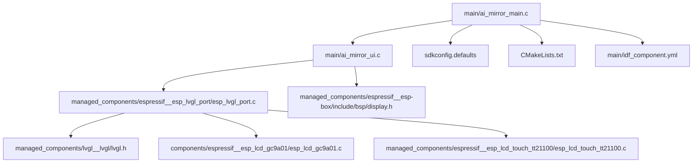
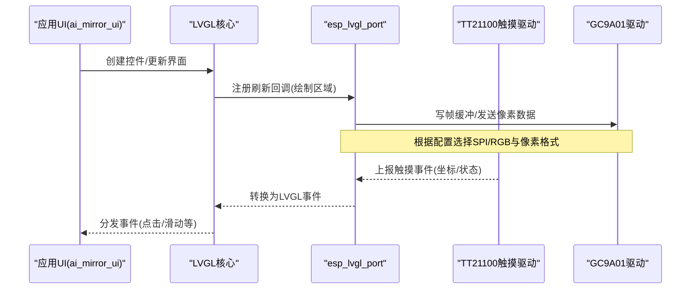
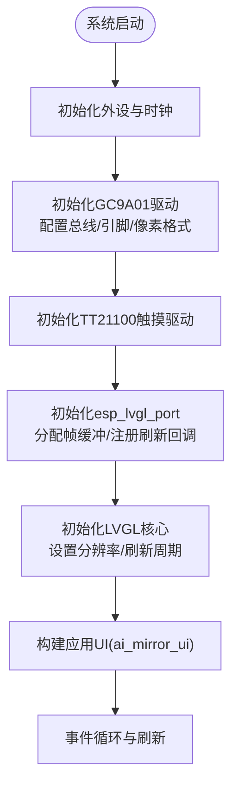
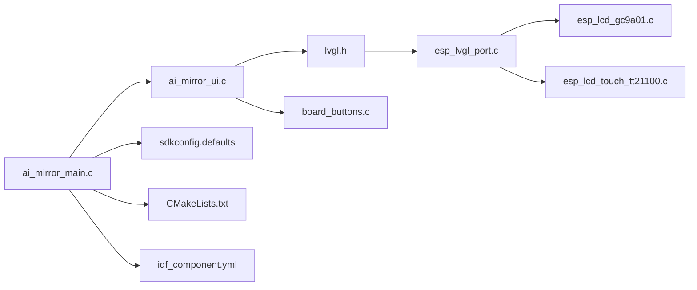

# 显示设置

<cite>
**本文引用的文件**   
- [ai_mirror_main.c](file://Firmware/esp32_ai_mirror/main/ai_mirror_main.c)
- [ai_mirror_ui.c](file://Firmware/esp32_ai_mirror/main/ai_mirror_ui.c)
- [board_buttons.c](file://Firmware/esp32_ai_mirror/main/board_buttons.c)
- [board_buttons.h](file://Firmware/esp32_ai_mirror/main/board_buttons.h)
- [sdkconfig.defaults](file://Firmware/esp32_ai_mirror/sdkconfig.defaults)
- [CMakeLists.txt](file://Firmware/esp32_ai_mirror/CMakeLists.txt)
- [idf_component.yml](file://Firmware/esp32_ai_mirror/main/idf_component.yml)
- [esp_lvgl_port.c](file://Firmware/esp32_ai_mirror/managed_components/espressif__esp_lvgl_port/esp_lvgl_port.c)
- [esp_lvgl_port.h](file://Firmware/esp32_ai_mirror/managed_components/espressif__esp_lvgl_port/include/esp_lvgl_port.h)
- [lv_conf_template.h](file://Firmware/esp32_ai_mirror/managed_components/lvgl__lvgl/lv_conf_template.h)
- [lvgl.h](file://Firmware/esp32_ai_mirror/managed_components/lvgl__lvgl/lvgl.h)
- [esp_lcd_gc9a01.c](file://Firmware/esp32_ai_mirror/components/espressif__esp_lcd_gc9a01/esp_lcd_gc9a01.c)
- [esp_lcd_touch_tt21100.c](file://Firmware/esp32_ai_mirror/managed_components/espressif__esp_lcd_touch_tt21100/esp_lcd_touch_tt21100.c)
- [display.h](file://Firmware/esp32_ai_mirror/managed_components/espressif__esp-box/include/bsp/display.h)
- [performance.md](file://Firmware/esp32_ai_mirror/managed_components/espressif__esp_lvgl_port/docs/performance.md)
</cite>

## 目录
1. [简介](#简介)
2. [项目结构](#项目结构)
3. [核心组件](#核心组件)
4. [架构总览](#架构总览)
5. [详细组件分析](#详细组件分析)
6. [依赖关系分析](#依赖关系分析)
7. [性能考虑](#性能考虑)
8. [故障排查指南](#故障排查指南)
9. [结论](#结论)
10. [附录](#附录)

## 简介
本文件围绕“显示设置”功能进行系统化说明，覆盖屏幕亮度调节、对比度设置、色彩模式配置、LVGL显示驱动的配置与初始化、显示旋转与缩放等高级能力、省电与自动休眠机制、显示效果测试工具与性能调优方法，以及不同分辨率屏幕的适配策略。文档面向具备基础嵌入式开发经验的读者，力求以循序渐进的方式呈现从硬件到框架再到应用层的完整链路。

## 项目结构
本项目基于 ESP-IDF 构建，使用 LVGL 作为图形界面库，并通过 esp_lvgl_port 桥接 LVGL 与底层 LCD 驱动。显示相关的关键位置如下：
- 主程序入口与 UI 初始化位于 main 目录
- LVGL 运行时与端口封装位于 managed_components 下的 esp_lvgl_port 与 lvgl 子模块
- LCD 控制器驱动位于 components 下的 esp_lcd_gc9a01
- 触摸驱动位于 managed_components 下的 esp_lcd_touch_tt21100
- BSP（板级支持）显示接口位于 espressif__esp-box 的 display.h

图表来源
- [ai_mirror_main.c](file://Firmware/esp32_ai_mirror/main/ai_mirror_main.c)
- [ai_mirror_ui.c](file://Firmware/esp32_ai_mirror/main/ai_mirror_ui.c)
- [esp_lvgl_port.c](file://Firmware/esp32_ai_mirror/managed_components/espressif__esp_lvgl_port/esp_lvgl_port.c)
- [lvgl.h](file://Firmware/esp32_ai_mirror/managed_components/lvgl__lvgl/lvgl.h)
- [esp_lcd_gc9a01.c](file://Firmware/esp32_ai_mirror/components/espressif__esp_lcd_gc9a01/esp_lcd_gc9a01.c)
- [esp_lcd_touch_tt21100.c](file://Firmware/esp32_ai_mirror/managed_components/espressif__esp_lcd_touch_tt21100/esp_lcd_touch_tt21100.c)
- [display.h](file://Firmware/esp32_ai_mirror/managed_components/espressif__esp-box/include/bsp/display.h)
- [sdkconfig.defaults](file://Firmware/esp32_ai_mirror/sdkconfig.defaults)
- [CMakeLists.txt](file://Firmware/esp32_ai_mirror/CMakeLists.txt)
- [idf_component.yml](file://Firmware/esp32_ai_mirror/main/idf_component.yml)

章节来源
- [ai_mirror_main.c](file://Firmware/esp32_ai_mirror/main/ai_mirror_main.c)
- [sdkconfig.defaults](file://Firmware/esp32_ai_mirror/sdkconfig.defaults)
- [CMakeLists.txt](file://Firmware/esp32_ai_mirror/CMakeLists.txt)
- [idf_component.yml](file://Firmware/esp32_ai_mirror/main/idf_component.yml)

## 核心组件
- 显示驱动层
  - GC9A01 LCD 控制器驱动：负责 SPI/RGB 时序、寄存器配置、显存写入等
  - TT21100 触摸驱动：提供触摸事件上报与坐标转换
- LVGL 集成层
  - esp_lvgl_port：将 LVGL 的刷新回调与底层 LCD 帧缓冲对接，管理任务调度、刷新区域、双缓冲等
  - LVGL 核心：UI 渲染、事件处理、主题与样式、内存管理
- 应用层
  - ai_mirror_ui：构建 UI 页面、控件布局、交互逻辑
  - board_buttons：按键输入映射，可能用于触发显示设置菜单或快捷操作
- 配置与构建
  - sdkconfig.defaults：编译期显示参数（分辨率、像素格式、总线宽度、刷新率等）
  - CMakeLists.txt 与 idf_component.yml：组件依赖与构建选项

章节来源
- [esp_lcd_gc9a01.c](file://Firmware/esp32_ai_mirror/components/espressif__esp_lcd_gc9a01/esp_lcd_gc9a01.c)
- [esp_lcd_touch_tt21100.c](file://Firmware/esp32_ai_mirror/managed_components/espressif__esp_lcd_touch_tt21100/esp_lcd_touch_tt21100.c)
- [esp_lvgl_port.c](file://Firmware/esp32_ai_mirror/managed_components/espressif__esp_lvgl_port/esp_lvgl_port.c)
- [lvgl.h](file://Firmware/esp32_ai_mirror/managed_components/lvgl__lvgl/lvgl.h)
- [ai_mirror_ui.c](file://Firmware/esp32_ai_mirror/main/ai_mirror_ui.c)
- [board_buttons.c](file://Firmware/esp32_ai_mirror/main/board_buttons.c)
- [sdkconfig.defaults](file://Firmware/esp32_ai_mirror/sdkconfig.defaults)
- [CMakeLists.txt](file://Firmware/esp32_ai_mirror/CMakeLists.txt)
- [idf_component.yml](file://Firmware/esp32_ai_mirror/main/idf_component.yml)

## 架构总览
下图展示了从应用 UI 到 LCD 驱动的调用链路与数据流向，包括 LVGL 刷新回调、LCD 控制器驱动、触摸事件回传路径。

图表来源
- [ai_mirror_ui.c](file://Firmware/esp32_ai_mirror/main/ai_mirror_ui.c)
- [esp_lvgl_port.c](file://Firmware/esp32_ai_mirror/managed_components/espressif__esp_lvgl_port/esp_lvgl_port.c)
- [esp_lcd_touch_tt21100.c](file://Firmware/esp32_ai_mirror/managed_components/espressif__esp_lcd_touch_tt21100/esp_lcd_touch_tt21100.c)
- [esp_lcd_gc9a01.c](file://Firmware/esp32_ai_mirror/components/espressif__esp_lcd_gc9a01/esp_lcd_gc9a01.c)

## 详细组件分析

### 显示驱动与初始化流程
- 初始化顺序
  - 系统启动后，main 入口完成外设与时钟配置
  - 加载 LCD 控制器驱动（GC9A01），配置总线、引脚、复位/背光控制、像素格式与刷新参数
  - 初始化触摸驱动（TT21100），配置中断与采样频率
  - 初始化 esp_lvgl_port，分配帧缓冲、设置刷新回调、启用双缓冲（可选）
  - 初始化 LVGL 核心，设置显示器尺寸、像素格式、刷新周期
  - 进入应用 UI 构建阶段（ai_mirror_ui）
- 关键要点
  - 分辨率与像素格式需与 sdkconfig.defaults 一致
  - 刷新回调中应仅拷贝脏矩形区域，避免全量刷新
  - 触摸事件需要与显示方向匹配（旋转后坐标变换）

图表来源
- [ai_mirror_main.c](file://Firmware/esp32_ai_mirror/main/ai_mirror_main.c)
- [esp_lcd_gc9a01.c](file://Firmware/esp32_ai_mirror/components/espressif__esp_lcd_gc9a01/esp_lcd_gc9a01.c)
- [esp_lcd_touch_tt21100.c](file://Firmware/esp32_ai_mirror/managed_components/espressif__esp_lcd_touch_tt21100/esp_lcd_touch_tt21100.c)
- [esp_lvgl_port.c](file://Firmware/esp32_ai_mirror/managed_components/espressif__esp_lvgl_port/esp_lvgl_port.c)
- [lvgl.h](file://Firmware/esp32_ai_mirror/managed_components/lvgl__lvgl/lvgl.h)

章节来源
- [ai_mirror_main.c](file://Firmware/esp32_ai_mirror/main/ai_mirror_main.c)
- [esp_lcd_gc9a01.c](file://Firmware/esp32_ai_mirror/components/espressif__esp_lcd_gc9a01/esp_lcd_gc9a01.c)
- [esp_lcd_touch_tt21100.c](file://Firmware/esp32_ai_mirror/managed_components/espressif__esp_lcd_touch_tt21100/esp_lcd_touch_tt21100.c)
- [esp_lvgl_port.c](file://Firmware/esp32_ai_mirror/managed_components/espressif__esp_lvgl_port/esp_lvgl_port.c)
- [lvgl.h](file://Firmware/esp32_ai_mirror/managed_components/lvgl__lvgl/lvgl.h)

### 屏幕亮度调节
- 实现方式
  - 通过 PWM 控制背光引脚占空比，或使用 GPIO 开关背光
  - 在 UI 中提供滑块/按钮，用户调整时更新背光寄存器或 PWM 值
  - 建议将亮度值持久化至 NVS，重启后恢复
- 注意事项
  - 避免频繁快速切换导致闪烁
  - 低亮度下注意灰阶表现与功耗平衡
  - 若使用 RGB 屏且无独立背光控制，可通过降低帧率或关闭部分区域刷新间接节能

章节来源
- [ai_mirror_ui.c](file://Firmware/esp32_ai_mirror/main/ai_mirror_ui.c)
- [board_buttons.c](file://Firmware/esp32_ai_mirror/main/board_buttons.c)
- [sdkconfig.defaults](file://Firmware/esp32_ai_mirror/sdkconfig.defaults)

### 对比度与色彩模式配置
- 对比度
  - 多数 LCD 控制器通过寄存器调整伽马曲线或对比度系数
  - 可在驱动初始化或运行时动态写入对应寄存器
- 色彩模式
  - 常见模式：RGB565、RGB888、RGB666、BGR 等
  - 需在 LVGL 与 LCD 驱动两端保持一致，否则出现颜色异常
  - 某些控制器支持调色板模式（索引色），适合低内存场景
- 建议
  - 提供预设主题（如“明亮/护眼/夜间”），一键切换伽马与对比度组合
  - 对图片资源进行预转换，减少运行时色彩转换开销

章节来源
- [esp_lcd_gc9a01.c](file://Firmware/esp32_ai_mirror/components/espressif__esp_lcd_gc9a01/esp_lcd_gc9a01.c)
- [lv_conf_template.h](file://Firmware/esp32_ai_mirror/managed_components/lvgl__lvgl/lv_conf_template.h)
- [sdkconfig.defaults](file://Firmware/esp32_ai_mirror/sdkconfig.defaults)

### 显示旋转与缩放
- 旋转
  - LVGL 支持 0°/90°/180°/270° 旋转，需在初始化时设置
  - 旋转后触摸坐标需相应变换，确保交互准确
- 缩放
  - LVGL 支持全局缩放与局部控件缩放
  - 高缩放比例会增加 CPU 与显存压力，需谨慎使用
- 最佳实践
  - 优先在 LVGL 层设置旋转，避免在驱动层做复杂变换
  - 对于固定方向设备，锁定旋转可减少不必要的计算

章节来源
- [esp_lvgl_port.c](file://Firmware/esp32_ai_mirror/managed_components/espressif__esp_lvgl_port/esp_lvgl_port.c)
- [lvgl.h](file://Firmware/esp32_ai_mirror/managed_components/lvgl__lvgl/lvgl.h)
- [esp_lcd_touch_tt21100.c](file://Firmware/esp32_ai_mirror/managed_components/espressif__esp_lcd_touch_tt21100/esp_lcd_touch_tt21100.c)

### 显示省电模式与自动休眠
- 策略
  - 空闲超时后降低刷新率或关闭背光
  - 进入深度睡眠前保存显示状态（亮度、主题、页面）
  - 唤醒时快速恢复显示，减少黑屏时间
- 实现要点
  - 使用定时器监测用户活动（触摸/按键）
  - 结合 LVGL 的 idle 回调与 esp_lvgl_port 的刷新节流
  - 合理设置休眠阈值，兼顾响应速度与功耗

章节来源
- [esp_lvgl_port.c](file://Firmware/esp32_ai_mirror/managed_components/espressif__esp_lvgl_port/esp_lvgl_port.c)
- [ai_mirror_ui.c](file://Firmware/esp32_ai_mirror/main/ai_mirror_ui.c)
- [sdkconfig.defaults](file://Firmware/esp32_ai_mirror/sdkconfig.defaults)

### 显示效果测试工具与性能调优
- 测试工具
  - 使用 LVGL 内置示例（benchmark/stress/widgets）验证刷新性能与稳定性
  - 自定义全屏渐变、滚动条、动画序列，观察卡顿与掉帧
- 性能调优
  - 启用双缓冲与 DMA 传输（若硬件支持）
  - 限制刷新区域为脏矩形，避免整屏刷新
  - 选择合适的像素格式（RGB565 更省带宽）
  - 优化字体与图片资源（压缩、缓存命中）
  - 监控 LVGL 统计信息（FPS、内存占用、绘制次数）

章节来源
- [performance.md](file://Firmware/esp32_ai_mirror/managed_components/espressif__esp_lvgl_port/docs/performance.md)
- [lvgl.h](file://Firmware/esp32_ai_mirror/managed_components/lvgl__lvgl/lvgl.h)
- [esp_lvgl_port.c](file://Firmware/esp32_ai_mirror/managed_components/espressif__esp_lvgl_port/esp_lvgl_port.c)

### 不同分辨率屏幕的适配配置
- 适配要点
  - 在 sdkconfig.defaults 中定义目标分辨率、像素格式、总线宽度
  - 确保 LVGL 配置与驱动初始化参数一致
  - 针对小屏可启用索引色模式节省 RAM
  - 大屏建议使用双缓冲与 DMA 提升流畅度
- 常见问题
  - 分辨率不匹配导致画面错位或拉伸
  - 像素格式不一致造成颜色异常
  - 刷新率过高导致 CPU 占用飙升

章节来源
- [sdkconfig.defaults](file://Firmware/esp32_ai_mirror/sdkconfig.defaults)
- [lv_conf_template.h](file://Firmware/esp32_ai_mirror/managed_components/lvgl__lvgl/lv_conf_template.h)
- [esp_lcd_gc9a01.c](file://Firmware/esp32_ai_mirror/components/espressif__esp_lcd_gc9a01/esp_lcd_gc9a01.c)

## 依赖关系分析
下图展示显示相关组件之间的依赖关系，便于理解模块耦合与扩展点。

图表来源
- [ai_mirror_main.c](file://Firmware/esp32_ai_mirror/main/ai_mirror_main.c)
- [ai_mirror_ui.c](file://Firmware/esp32_ai_mirror/main/ai_mirror_ui.c)
- [lvgl.h](file://Firmware/esp32_ai_mirror/managed_components/lvgl__lvgl/lvgl.h)
- [board_buttons.c](file://Firmware/esp32_ai_mirror/main/board_buttons.c)
- [esp_lvgl_port.c](file://Firmware/esp32_ai_mirror/managed_components/espressif__esp_lvgl_port/esp_lvgl_port.c)
- [esp_lcd_gc9a01.c](file://Firmware/esp32_ai_mirror/components/espressif__esp_lcd_gc9a01/esp_lcd_gc9a01.c)
- [esp_lcd_touch_tt21100.c](file://Firmware/esp32_ai_mirror/managed_components/espressif__esp_lcd_touch_tt21100/esp_lcd_touch_tt21100.c)
- [sdkconfig.defaults](file://Firmware/esp32_ai_mirror/sdkconfig.defaults)
- [CMakeLists.txt](file://Firmware/esp32_ai_mirror/CMakeLists.txt)
- [idf_component.yml](file://Firmware/esp32_ai_mirror/main/idf_component.yml)

章节来源
- [idf_component.yml](file://Firmware/esp32_ai_mirror/main/idf_component.yml)
- [CMakeLists.txt](file://Firmware/esp32_ai_mirror/CMakeLists.txt)

## 性能考虑
- 刷新策略
  - 使用脏矩形刷新，避免整屏重绘
  - 合理设置 LVGL 刷新周期，平衡流畅度与功耗
- 内存管理
  - 选择合适像素格式（RGB565 vs RGB888）
  - 启用 LVGL 内存池与缓存，减少碎片
- 传输优化
  - 启用 DMA 与双缓冲（硬件支持前提下）
  - 批量写入像素数据，减少总线开销
- 资源优化
  - 图片与字体压缩，按需加载
  - 避免运行时颜色转换，预生成目标格式资源

[本节为通用指导，不直接分析具体文件]

## 故障排查指南
- 显示花屏或颜色异常
  - 检查像素格式与分辨率配置是否一致
  - 确认 LCD 驱动初始化顺序与寄存器配置正确
- 触摸不准或方向错误
  - 校验旋转设置与触摸坐标变换逻辑
  - 检查中断触发与采样频率
- 刷新卡顿或掉帧
  - 查看 LVGL 统计信息，定位热点控件
  - 减少动画复杂度，优化绘制路径
- 功耗偏高
  - 降低刷新率与背光亮度
  - 启用自动休眠与空闲节流

章节来源
- [esp_lcd_gc9a01.c](file://Firmware/esp32_ai_mirror/components/espressif__esp_lcd_gc9a01/esp_lcd_gc9a01.c)
- [esp_lcd_touch_tt21100.c](file://Firmware/esp32_ai_mirror/managed_components/espressif__esp_lcd_touch_tt21100/esp_lcd_touch_tt21100.c)
- [esp_lvgl_port.c](file://Firmware/esp32_ai_mirror/managed_components/espressif__esp_lvgl_port/esp_lvgl_port.c)
- [performance.md](file://Firmware/esp32_ai_mirror/managed_components/espressif__esp_lvgl_port/docs/performance.md)

## 结论
显示设置功能涉及从硬件驱动到图形框架的多层协作。通过合理的初始化流程、参数配置与优化策略，可以在不同分辨率与像素格式下获得稳定、流畅且低功耗的显示体验。建议在开发过程中持续使用 LVGL 内置工具与性能文档进行验证与调优，并结合实际产品需求制定亮度、对比度与色彩模式的预设方案。

[本节为总结性内容，不直接分析具体文件]

## 附录
- 常用配置项参考
  - 分辨率与像素格式：在 sdkconfig.defaults 中定义
  - LVGL 刷新周期与内存池：在 lv_conf_template.h 中调整
  - 组件依赖与版本：在 idf_component.yml 中声明
- 推荐调试步骤
  - 先跑通最小显示（纯色填充）再逐步增加 UI 元素
  - 使用 benchmark 示例评估极限性能
  - 记录关键指标（FPS、RAM 占用、CPU 负载）

[本节为补充信息，不直接分析具体文件]