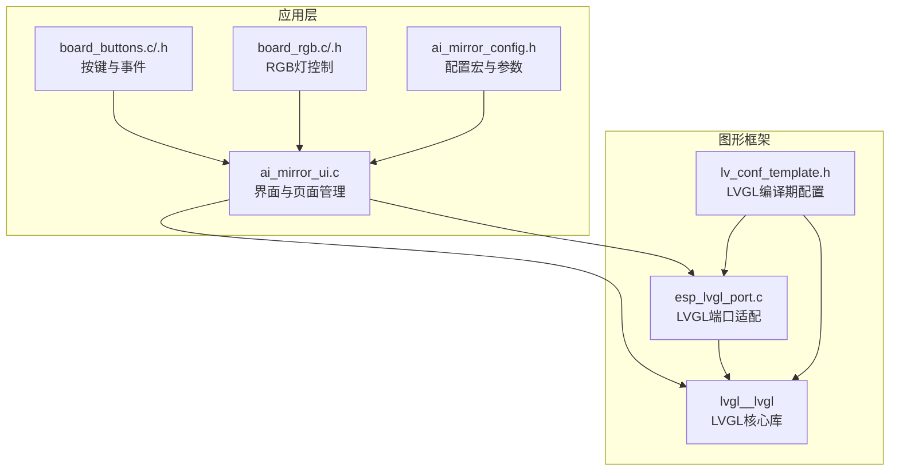
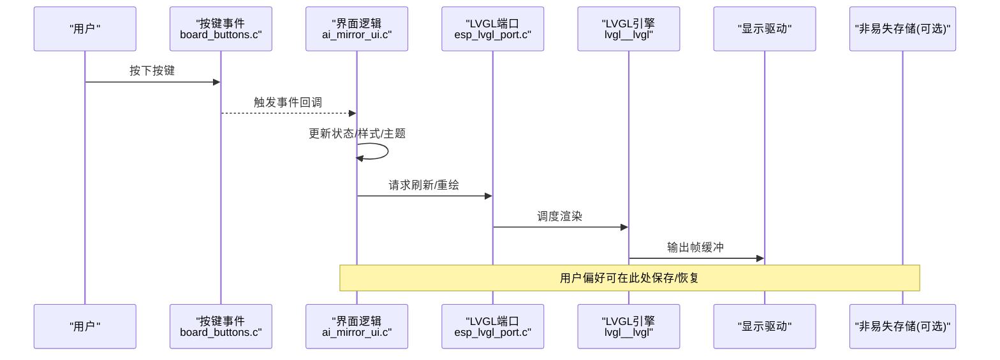
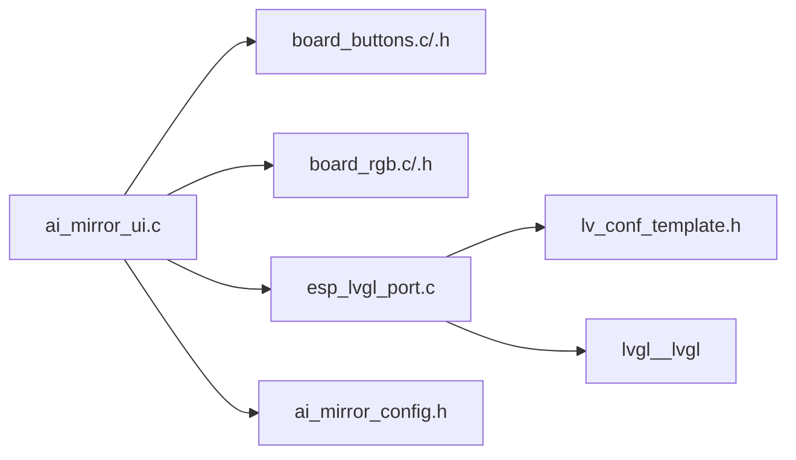

# 界面自定义

<cite>
**本文引用的文件**   
- [ai_mirror_ui.c](file://Firmware/esp32_ai_mirror/main/ai_mirror_ui.c)
- [ai_mirror_config.h](file://Firmware/esp32_ai_mirror/main/ai_mirror_config.h)
- [board_buttons.c](file://Firmware/esp32_ai_mirror/main/board_buttons.c)
- [board_buttons.h](file://Firmware/esp32_ai_mirror/main/board_buttons.h)
- [board_rgb.c](file://Firmware/esp32_ai_mirror/main/board_rgb.c)
- [board_rgb.h](file://Firmware/esp32_ai_mirror/main/board_rgb.h)
- [esp_lvgl_port.c](file://Firmware/esp32_ai_mirror/managed_components/espressif__esp_lvgl_port/esp_lvgl_port.c)
- [lv_conf_template.h](file://Firmware/esp32_ai_mirror/managed_components/lvgl__lvgl/lv_conf_template.h)
- [README.md](file://Firmware/esp32_ai_mirror/README.md)
</cite>

## 目录
1. [简介](#简介)
2. [项目结构](#项目结构)
3. [核心组件](#核心组件)
4. [架构总览](#架构总览)
5. [详细组件分析](#详细组件分析)
6. [依赖关系分析](#依赖关系分析)
7. [性能考虑](#性能考虑)
8. [故障排查指南](#故障排查指南)
9. [结论](#结论)
10. [附录](#附录)

## 简介
本文件面向ESP32 AI镜像项目的界面自定义能力，围绕LVGL样式系统、主题与颜色方案、字体设置、布局自适应与响应式、用户偏好持久化、动态修改与动画、以及多语言本地化等主题进行系统化说明。文档既提供高层概览，也给出代码级定位与参考路径，帮助开发者快速落地UI定制需求。

## 项目结构
本项目基于ESP-IDF与LVGL构建，界面相关代码主要位于main目录，LVGL与端口适配位于managed_components目录。关键文件包括：
- 应用UI入口与页面组织：ai_mirror_ui.c
- 配置与宏定义（含显示、输入、RGB灯等）：ai_mirror_config.h
- 板载按键与事件映射：board_buttons.c/.h
- RGB指示灯控制（可用于主题反馈）：board_rgb.c/.h
- LVGL端口适配与初始化：esp_lvgl_port.c
- LVGL配置模板（主题、颜色、字体、动画等开关与默认值）：lv_conf_template.h
- 项目说明与上下文：README.md

图表来源
- [ai_mirror_ui.c](file://Firmware/esp32_ai_mirror/main/ai_mirror_ui.c)
- [ai_mirror_config.h](file://Firmware/esp32_ai_mirror/main/ai_mirror_config.h)
- [board_buttons.c](file://Firmware/esp32_ai_mirror/main/board_buttons.c)
- [board_buttons.h](file://Firmware/esp32_ai_mirror/main/board_buttons.h)
- [board_rgb.c](file://Firmware/esp32_ai_mirror/main/board_rgb.c)
- [board_rgb.h](file://Firmware/esp32_ai_mirror/main/board_rgb.h)
- [esp_lvgl_port.c](file://Firmware/esp32_ai_mirror/managed_components/espressif__esp_lvgl_port/esp_lvgl_port.c)
- [lv_conf_template.h](file://Firmware/esp32_ai_mirror/managed_components/lvgl__lvgl/lv_conf_template.h)

章节来源
- [README.md](file://Firmware/esp32_ai_mirror/README.md)

## 核心组件
- 界面与页面管理（ai_mirror_ui.c）：负责创建LVGL对象、组织页面、处理交互逻辑与状态切换。
- 配置中心（ai_mirror_config.h）：集中定义分辨率、刷新率、输入设备、RGB引脚、功能开关等编译期参数。
- 输入事件（board_buttons.c/.h）：将硬件按键映射为LVGL事件，驱动界面行为。
- 视觉反馈（board_rgb.c/.h）：通过RGB灯实现主题或状态的可视化提示。
- LVGL端口（esp_lvgl_port.c）：桥接LVGL与底层显示/触摸驱动，完成缓冲区、刷新、事件分发。
- LVGL配置（lv_conf_template.h）：启用/禁用特性、设置默认主题、颜色、字体、动画与内存策略。

章节来源
- [ai_mirror_ui.c](file://Firmware/esp32_ai_mirror/main/ai_mirror_ui.c)
- [ai_mirror_config.h](file://Firmware/esp32_ai_mirror/main/ai_mirror_config.h)
- [board_buttons.c](file://Firmware/esp32_ai_mirror/main/board_buttons.c)
- [board_buttons.h](file://Firmware/esp32_ai_mirror/main/board_buttons.h)
- [board_rgb.c](file://Firmware/esp32_ai_mirror/main/board_rgb.c)
- [board_rgb.h](file://Firmware/esp32_ai_mirror/main/board_rgb.h)
- [esp_lvgl_port.c](file://Firmware/esp32_ai_mirror/managed_components/espressif__esp_lvgl_port/esp_lvgl_port.c)
- [lv_conf_template.h](file://Firmware/esp32_ai_mirror/managed_components/lvgl__lvgl/lv_conf_template.h)

## 架构总览
下图展示从用户输入到界面渲染的关键链路，以及主题与样式的生效位置。

图表来源
- [board_buttons.c](file://Firmware/esp32_ai_mirror/main/board_buttons.c)
- [ai_mirror_ui.c](file://Firmware/esp32_ai_mirror/main/ai_mirror_ui.c)
- [esp_lvgl_port.c](file://Firmware/esp32_ai_mirror/managed_components/espressif__esp_lvgl_port/esp_lvgl_port.c)
- [lv_conf_template.h](file://Firmware/esp32_ai_mirror/managed_components/lvgl__lvgl/lv_conf_template.h)

## 详细组件分析

### 主题切换与颜色方案
- 设计要点
  - 使用LVGL的“主题”概念，通过切换全局样式变量或应用不同样式表实现主题切换。
  - 颜色方案建议以“语义色”为中心（如背景、前景、强调、成功、警告），在运行时通过API统一替换。
  - 结合RGB灯提供即时视觉反馈，增强主题切换感知。
- 实现建议
  - 在界面逻辑中维护当前主题ID，并在切换时遍历关键控件重新应用样式。
  - 将颜色定义为集中常量或结构体，便于扩展暗色/亮色/高对比度等方案。
  - 利用LVGL的样式继承与覆盖机制，减少重复代码。
- 参考路径
  - 界面主题切换入口与样式应用：[ai_mirror_ui.c](file://Firmware/esp32_ai_mirror/main/ai_mirror_ui.c)
  - 颜色与主题宏定义位置（如有）：[ai_mirror_config.h](file://Firmware/esp32_ai_mirror/main/ai_mirror_config.h)
  - RGB灯反馈：[board_rgb.c](file://Firmware/esp32_ai_mirror/main/board_rgb.c), [board_rgb.h](file://Firmware/esp32_ai_mirror/main/board_rgb.h)

章节来源
- [ai_mirror_ui.c](file://Firmware/esp32_ai_mirror/main/ai_mirror_ui.c)
- [ai_mirror_config.h](file://Firmware/esp32_ai_mirror/main/ai_mirror_config.h)
- [board_rgb.c](file://Firmware/esp32_ai_mirror/main/board_rgb.c)
- [board_rgb.h](file://Firmware/esp32_ai_mirror/main/board_rgb.h)

### 字体设置与多语言支持
- 设计要点
  - 根据目标语言选择合适字体集，避免缺字与乱码。
  - 对中文等多字节字符集，需确保字体资源已包含所需字形并正确加载。
  - 多语言文本建议使用键值映射，运行时按语言包切换。
- 实现建议
  - 在LVGL配置中启用必要的字体与Unicode支持，按需裁剪以减少占用。
  - 在界面初始化阶段加载对应语言的字符串表，并提供切换接口。
  - 针对按钮、标签等常用控件，统一设置字体族与字号，保证一致性。
- 参考路径
  - LVGL字体与国际化相关配置项：[lv_conf_template.h](file://Firmware/esp32_ai_mirror/managed_components/lvgl__lvgl/lv_conf_template.h)
  - 界面文本与语言切换逻辑：[ai_mirror_ui.c](file://Firmware/esp32_ai_mirror/main/ai_mirror_ui.c)

章节来源
- [lv_conf_template.h](file://Firmware/esp32_ai_mirror/managed_components/lvgl__lvgl/lv_conf_template.h)
- [ai_mirror_ui.c](file://Firmware/esp32_ai_mirror/main/ai_mirror_ui.c)

### 布局自适应与响应式设计
- 设计要点
  - 使用LVGL的布局管理器（如Flex、Grid）与相对尺寸，使界面在不同分辨率下自动适配。
  - 针对横竖屏切换或不同屏幕尺寸，提供布局变体与断点策略。
- 实现建议
  - 在页面初始化时根据屏幕宽高计算比例，动态调整控件大小与间距。
  - 将固定像素改为百分比或相对单位，提升可移植性。
  - 对复杂页面采用容器+子布局的组合方式，降低耦合。
- 参考路径
  - 界面布局与尺寸计算：[ai_mirror_ui.c](file://Firmware/esp32_ai_mirror/main/ai_mirror_ui.c)
  - 显示分辨率与刷新相关配置：[ai_mirror_config.h](file://Firmware/esp32_ai_mirror/main/ai_mirror_config.h)

章节来源
- [ai_mirror_ui.c](file://Firmware/esp32_ai_mirror/main/ai_mirror_ui.c)
- [ai_mirror_config.h](file://Firmware/esp32_ai_mirror/main/ai_mirror_config.h)

### 用户偏好设置的保存与恢复
- 设计要点
  - 将主题、字体大小、语言、亮度等用户偏好保存在非易失存储中，重启后恢复。
  - 提供统一的读写接口，屏蔽底层存储细节。
- 实现建议
  - 在界面逻辑中封装“偏好管理器”，提供get/set接口。
  - 在切换主题/字体/语言等操作后调用保存；启动时先加载再初始化界面。
  - 若未找到持久化实现，可在界面层提供临时缓存并在必要时落盘。
- 参考路径
  - 偏好读写与持久化（如存在）：[ai_mirror_ui.c](file://Firmware/esp32_ai_mirror/main/ai_mirror_ui.c)
  - 配置项定义（如偏好字段）：[ai_mirror_config.h](file://Firmware/esp32_ai_mirror/main/ai_mirror_config.h)

章节来源
- [ai_mirror_ui.c](file://Firmware/esp32_ai_mirror/main/ai_mirror_ui.c)
- [ai_mirror_config.h](file://Firmware/esp32_ai_mirror/main/ai_mirror_config.h)

### 界面元素的动态修改与动画效果
- 设计要点
  - 使用LVGL的动画API对透明度、位移、缩放、颜色等进行平滑过渡。
  - 合理设置动画时长与缓动函数，避免卡顿与过度闪烁。
- 实现建议
  - 将常用动画封装为函数，例如淡入/淡出、滑入/滑出、脉冲等。
  - 在事件回调中触发动画，注意竞态条件与重复动画的处理。
  - 对频繁更新的控件（如图标、进度条）优化绘制区域与刷新频率。
- 参考路径
  - 动画与样式更新入口：[ai_mirror_ui.c](file://Firmware/esp32_ai_mirror/main/ai_mirror_ui.c)
  - LVGL动画与渲染管线：[lv_conf_template.h](file://Firmware/esp32_ai_mirror/managed_components/lvgl__lvgl/lv_conf_template.h)

章节来源
- [ai_mirror_ui.c](file://Firmware/esp32_ai_mirror/main/ai_mirror_ui.c)
- [lv_conf_template.h](file://Firmware/esp32_ai_mirror/managed_components/lvgl__lvgl/lv_conf_template.h)

### LVGL样式系统与自定义样式
- 设计要点
  - 样式是LVGL的核心抽象，通过样式属性（颜色、边框、阴影、圆角、字体等）组合形成外观。
  - 推荐使用“基础样式+覆盖样式”的模式，提高复用性与可维护性。
- 实现建议
  - 在应用初始化时创建全局样式对象，并在需要时应用到控件。
  - 使用LVGL提供的样式API批量设置属性，避免逐控件硬编码。
  - 将样式与主题绑定，切换主题时仅替换样式集合。
- 参考路径
  - 样式创建与应用：[ai_mirror_ui.c](file://Firmware/esp32_ai_mirror/main/ai_mirror_ui.c)
  - LVGL样式与主题配置：[lv_conf_template.h](file://Firmware/esp32_ai_mirror/managed_components/lvgl__lvgl/lv_conf_template.h)

章节来源
- [ai_mirror_ui.c](file://Firmware/esp32_ai_mirror/main/ai_mirror_ui.c)
- [lv_conf_template.h](file://Firmware/esp32_ai_mirror/managed_components/lvgl__lvgl/lv_conf_template.h)

### 输入事件与交互流程
- 设计要点
  - 将硬件按键映射为LVGL事件，保持UI层与硬件解耦。
  - 对长按、短按、双击等复合手势进行识别与分发。
- 实现建议
  - 在board_buttons中注册中断或轮询回调，转换为LVGL事件。
  - 在ui层订阅事件，执行状态机或页面跳转。
- 参考路径
  - 按键事件映射：[board_buttons.c](file://Firmware/esp32_ai_mirror/main/board_buttons.c), [board_buttons.h](file://Firmware/esp32_ai_mirror/main/board_buttons.h)
  - 事件消费与页面逻辑：[ai_mirror_ui.c](file://Firmware/esp32_ai_mirror/main/ai_mirror_ui.c)

章节来源
- [board_buttons.c](file://Firmware/esp32_ai_mirror/main/board_buttons.c)
- [board_buttons.h](file://Firmware/esp32_ai_mirror/main/board_buttons.h)
- [ai_mirror_ui.c](file://Firmware/esp32_ai_mirror/main/ai_mirror_ui.c)

### 显示与刷新管线
- 设计要点
  - LVGL通过端口适配层与显示驱动交互，管理帧缓冲与刷新周期。
  - 合理配置刷新区域与双缓冲，平衡流畅度与内存占用。
- 实现建议
  - 在端口适配中配置DMA、VSync、刷新回调等。
  - 在UI层避免全量重绘，尽量增量更新。
- 参考路径
  - LVGL端口适配：[esp_lvgl_port.c](file://Firmware/esp32_ai_mirror/managed_components/espressif__esp_lvgl_port/esp_lvgl_port.c)
  - 显示相关配置：[ai_mirror_config.h](file://Firmware/esp32_ai_mirror/main/ai_mirror_config.h)

章节来源
- [esp_lvgl_port.c](file://Firmware/esp32_ai_mirror/managed_components/espressif__esp_lvgl_port/esp_lvgl_port.c)
- [ai_mirror_config.h](file://Firmware/esp32_ai_mirror/main/ai_mirror_config.h)

## 依赖关系分析
- 模块内聚与耦合
  - ai_mirror_ui.c依赖board_buttons.c提供输入事件，依赖esp_lvgl_port.c进行渲染，依赖ai_mirror_config.h获取配置。
  - board_rgb.c作为辅助反馈模块，被ui层按需调用。
  - lv_conf_template.h影响LVGL与端口适配的行为，属于编译期依赖。
- 外部依赖
  - LVGL核心库提供样式、布局、动画、字体等能力。
  - ESP-IDF显示/触摸驱动由端口适配层对接。

图表来源
- [ai_mirror_ui.c](file://Firmware/esp32_ai_mirror/main/ai_mirror_ui.c)
- [board_buttons.c](file://Firmware/esp32_ai_mirror/main/board_buttons.c)
- [board_buttons.h](file://Firmware/esp32_ai_mirror/main/board_buttons.h)
- [board_rgb.c](file://Firmware/esp32_ai_mirror/main/board_rgb.c)
- [board_rgb.h](file://Firmware/esp32_ai_mirror/main/board_rgb.h)
- [esp_lvgl_port.c](file://Firmware/esp32_ai_mirror/managed_components/espressif__esp_lvgl_port/esp_lvgl_port.c)
- [lv_conf_template.h](file://Firmware/esp32_ai_mirror/managed_components/lvgl__lvgl/lv_conf_template.h)

## 性能考虑
- 渲染与内存
  - 合理设置LVGL缓冲区大小与刷新模式，避免频繁全量刷新。
  - 使用增量更新与局部重绘，减少CPU与总线压力。
- 动画与交互
  - 控制动画并发数量与时长，避免阻塞主循环。
  - 对高频事件做去抖与节流处理。
- 字体与资源
  - 按需裁剪字体集，减少Flash与RAM占用。
  - 图片与图标使用压缩格式，按需加载。

## 故障排查指南
- 主题不生效
  - 检查样式是否应用到目标控件，确认主题切换后是否触发重绘。
  - 参考路径：[ai_mirror_ui.c](file://Firmware/esp32_ai_mirror/main/ai_mirror_ui.c)
- 字体乱码或缺字
  - 确认LVGL配置中启用了相应字体与Unicode支持。
  - 参考路径：[lv_conf_template.h](file://Firmware/esp32_ai_mirror/managed_components/lvgl__lvgl/lv_conf_template.h)
- 按键无响应
  - 检查按键事件映射与回调注册是否正确。
  - 参考路径：[board_buttons.c](file://Firmware/esp32_ai_mirror/main/board_buttons.c), [board_buttons.h](file://Firmware/esp32_ai_mirror/main/board_buttons.h)
- 刷新卡顿或花屏
  - 检查端口适配的刷新回调与缓冲区配置。
  - 参考路径：[esp_lvgl_port.c](file://Firmware/esp32_ai_mirror/managed_components/espressif__esp_lvgl_port/esp_lvgl_port.c)
- 偏好未持久化
  - 确认偏好保存/恢复逻辑是否被调用，存储介质是否正常。
  - 参考路径：[ai_mirror_ui.c](file://Firmware/esp32_ai_mirror/main/ai_mirror_ui.c)

章节来源
- [ai_mirror_ui.c](file://Firmware/esp32_ai_mirror/main/ai_mirror_ui.c)
- [board_buttons.c](file://Firmware/esp32_ai_mirror/main/board_buttons.c)
- [board_buttons.h](file://Firmware/esp32_ai_mirror/main/board_buttons.h)
- [esp_lvgl_port.c](file://Firmware/esp32_ai_mirror/managed_components/espressif__esp_lvgl_port/esp_lvgl_port.c)
- [lv_conf_template.h](file://Firmware/esp32_ai_mirror/managed_components/lvgl__lvgl/lv_conf_template.h)

## 结论
通过LVGL样式系统与端口适配，本项目实现了主题切换、颜色方案、字体与多语言、布局自适应、动态动画与用户偏好持久化的完整能力。建议在开发中坚持“样式集中、主题分离、事件解耦、资源裁剪”的原则，以获得更好的可维护性与性能表现。

## 附录
- 术语对照
  - 主题：一组样式属性的集合，用于统一界面外观。
  - 颜色方案：语义化的颜色命名与取值，便于主题切换。
  - 布局自适应：根据屏幕尺寸与方向自动调整控件布局。
  - 响应式设计：在不同设备与分辨率下保持一致的用户体验。
  - 偏好持久化：将用户设置保存到非易失存储，重启后恢复。
- 实践清单
  - 定义语义色与主题枚举，集中管理样式对象。
  - 使用LVGL布局与相对尺寸，避免硬编码像素。
  - 为多语言准备字符串表与字体资源，运行时切换。
  - 封装偏好管理器，提供统一读写接口。
  - 将动画封装为可复用函数，避免重复代码。
  - 在端口适配中优化刷新策略，减少卡顿。