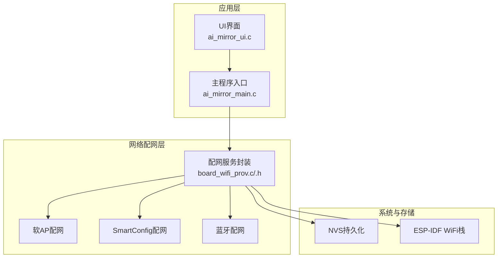
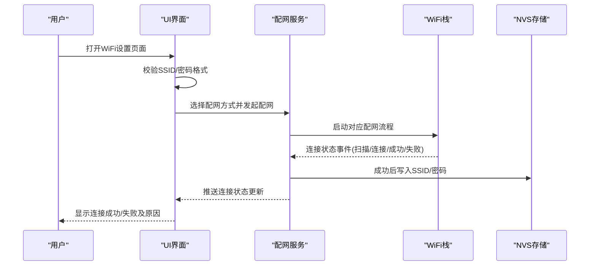
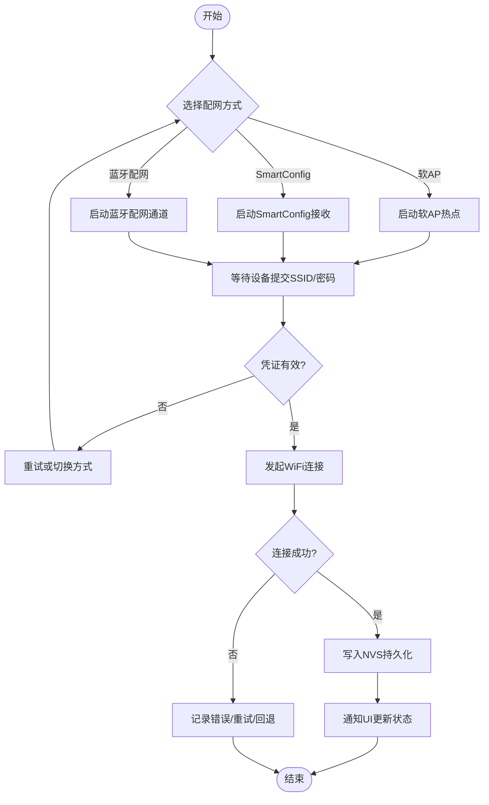
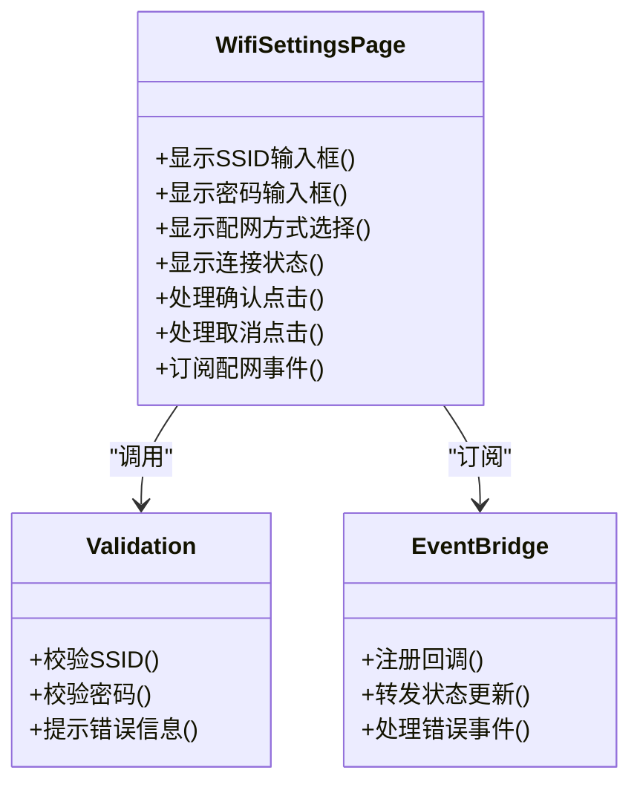
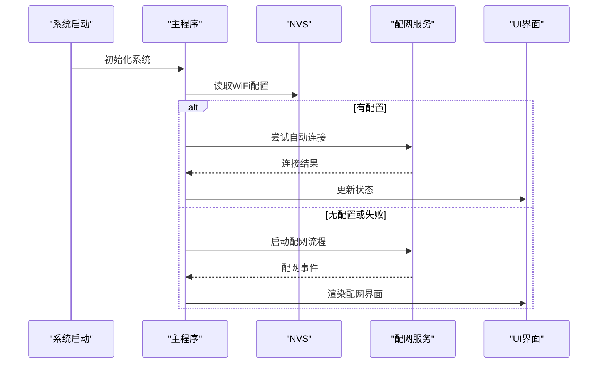
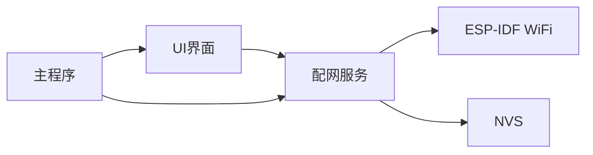

# 网络配置设置

<cite>
**本文引用的文件**   
- [board_wifi_prov.c](file://Firmware/esp32_ai_mirror/main/board_wifi_prov.c)
- [board_wifi_prov.h](file://Firmware/esp32_ai_mirror/main/board_wifi_prov.h)
- [ai_mirror_main.c](file://Firmware/esp32_ai_mirror/main/ai_mirror_main.c)
- [ai_mirror_ui.c](file://Firmware/esp32_ai_mirror/main/ai_mirror_ui.c)
- [WiFi配网功能计划书.md](file://Firmware/esp32_ai_mirror/WiFi配网功能计划书.md)
</cite>

## 目录
1. [简介](#简介)
2. [项目结构](#项目结构)
3. [核心组件](#核心组件)
4. [架构总览](#架构总览)
5. [详细组件分析](#详细组件分析)
6. [依赖关系分析](#依赖关系分析)
7. [性能考虑](#性能考虑)
8. [故障排查指南](#故障排查指南)
9. [结论](#结论)
10. [附录](#附录)

## 简介
本文件面向ESP32 AI镜像项目的网络配置设置，聚焦于WiFi连接配置界面与多种配网方式（软AP模式、SmartConfig、蓝牙配网）的实现说明。文档涵盖SSID输入与密码验证、连接状态显示、网络状态监控与错误处理、数据持久化与自动重连机制，以及界面自定义方法与扩展点，帮助开发者快速理解并扩展网络配置能力。

## 项目结构
本项目采用分层组织：应用层UI（LVGL）、网络配网服务（SoftAP/SmartConfig/蓝牙配网）、系统初始化与事件分发、以及持久化存储。关键目录与文件如下：
- main: 应用入口、UI实现、配网模块封装
- components: 第三方组件（如LVGL、LCD驱动等）
- 配置文件与计划文档：描述配网策略与交互流程

图表来源
- [ai_mirror_ui.c](file://Firmware/esp32_ai_mirror/main/ai_mirror_ui.c)
- [ai_mirror_main.c](file://Firmware/esp32_ai_mirror/main/ai_mirror_main.c)
- [board_wifi_prov.c](file://Firmware/esp32_ai_mirror/main/board_wifi_prov.c)
- [board_wifi_prov.h](file://Firmware/esp32_ai_mirror/main/board_wifi_prov.h)

章节来源
- [WiFi配网功能计划书.md](file://Firmware/esp32_ai_mirror/WiFi配网功能计划书.md)

## 核心组件
- 配网服务封装（board_wifi_prov）
  - 职责：统一对外暴露配网接口，管理SoftAP/SmartConfig/蓝牙配网的启动、状态回调、失败重试与结果上报。
  - 关键点：事件驱动的状态机、与NVS的读写接口、与WiFi栈的连接生命周期管理。
- UI界面（ai_mirror_ui）
  - 职责：提供SSID输入框、密码输入框、配网方式选择、连接状态提示、错误提示与操作按钮。
  - 关键点：输入校验（长度、字符集）、实时状态刷新、用户交互事件到配网服务的调用。
- 主程序（ai_mirror_main）
  - 职责：系统初始化、任务调度、事件分发、配网服务与UI的装配。
  - 关键点：在启动时检查NVS中保存的WiFi配置，决定是否进入配网流程或直连。

章节来源
- [board_wifi_prov.c](file://Firmware/esp32_ai_mirror/main/board_wifi_prov.c)
- [board_wifi_prov.h](file://Firmware/esp32_ai_mirror/main/board_wifi_prov.h)
- [ai_mirror_ui.c](file://Firmware/esp32_ai_mirror/main/ai_mirror_ui.c)
- [ai_mirror_main.c](file://Firmware/esp32_ai_mirror/main/ai_mirror_main.c)

## 架构总览
整体架构遵循“UI—配网服务—系统栈”的分层设计，通过事件与回调解耦各层职责。

图表来源
- [board_wifi_prov.c](file://Firmware/esp32_ai_mirror/main/board_wifi_prov.c)
- [board_wifi_prov.h](file://Firmware/esp32_ai_mirror/main/board_wifi_prov.h)
- [ai_mirror_ui.c](file://Firmware/esp32_ai_mirror/main/ai_mirror_ui.c)
- [ai_mirror_main.c](file://Firmware/esp32_ai_mirror/main/ai_mirror_main.c)

## 详细组件分析

### 配网服务（board_wifi_prov）
- 设计要点
  - 统一的配网入口函数，支持按策略选择SoftAP/SmartConfig/蓝牙配网。
  - 内部状态机维护：空闲、扫描、连接中、已连接、失败；失败包含重试计数与退避策略。
  - 事件回调：将WiFi栈事件转换为上层可消费的消息，供UI刷新与业务逻辑使用。
  - 持久化：连接成功后将SSID与密码写入NVS；重启后优先尝试自动重连。
- 关键流程
  - 启动配网：根据选择创建临时热点或监听配网包，等待设备端提交凭证。
  - 连接阶段：向目标AP发起连接，周期性上报状态。
  - 失败处理：记录错误码，触发重试或回退到其他配网方式。
  - 成功处理：保存凭证，切换为Station模式，通知UI。

图表来源
- [board_wifi_prov.c](file://Firmware/esp32_ai_mirror/main/board_wifi_prov.c)
- [board_wifi_prov.h](file://Firmware/esp32_ai_mirror/main/board_wifi_prov.h)

章节来源
- [board_wifi_prov.c](file://Firmware/esp32_ai_mirror/main/board_wifi_prov.c)
- [board_wifi_prov.h](file://Firmware/esp32_ai_mirror/main/board_wifi_prov.h)

### UI界面（ai_mirror_ui）
- 界面元素
  - SSID输入框：支持搜索列表展示与手动输入。
  - 密码输入框：掩码显示，支持可见性切换。
  - 配网方式选择：下拉或单选按钮（软AP/SmartConfig/蓝牙）。
  - 状态栏：显示“正在连接/连接成功/连接失败”，失败时附带错误原因。
  - 操作按钮：确认、取消、返回、清除缓存。
- 交互逻辑
  - 输入校验：SSID非空且长度合法，密码符合安全策略（最小长度、字符集）。
  - 事件绑定：点击确认后调用配网服务接口，订阅状态回调以刷新界面。
  - 错误提示：弹窗或Toast提示具体错误原因（如密码错误、无可用AP、超时）。
  - 自动刷新：后台定时查询连接状态，避免UI卡死。

图表来源
- [ai_mirror_ui.c](file://Firmware/esp32_ai_mirror/main/ai_mirror_ui.c)

章节来源
- [ai_mirror_ui.c](file://Firmware/esp32_ai_mirror/main/ai_mirror_ui.c)

### 主程序（ai_mirror_main）
- 启动流程
  - 初始化系统资源（日志、NVS、WiFi、UI框架）。
  - 读取NVS中的WiFi配置，若存在则尝试自动连接。
  - 若连接失败或未配置，进入配网流程（默认软AP或SmartConfig）。
- 事件分发
  - 监听配网服务事件，驱动UI状态更新。
  - 处理系统级事件（如按键、定时器），协调UI与配网服务。

图表来源
- [ai_mirror_main.c](file://Firmware/esp32_ai_mirror/main/ai_mirror_main.c)

章节来源
- [ai_mirror_main.c](file://Firmware/esp32_ai_mirror/main/ai_mirror_main.c)

## 依赖关系分析
- 组件耦合
  - UI依赖配网服务的事件接口，不直接操作WiFi栈。
  - 配网服务依赖ESP-IDF WiFi栈与NVS存储。
  - 主程序负责装配与调度，降低模块间耦合。
- 外部依赖
  - ESP-IDF WiFi与配网库（SoftAP/SmartConfig）。
  - LVGL用于UI渲染。
  - NVS用于持久化存储。

图表来源
- [board_wifi_prov.c](file://Firmware/esp32_ai_mirror/main/board_wifi_prov.c)
- [board_wifi_prov.h](file://Firmware/esp32_ai_mirror/main/board_wifi_prov.h)
- [ai_mirror_ui.c](file://Firmware/esp32_ai_mirror/main/ai_mirror_ui.c)
- [ai_mirror_main.c](file://Firmware/esp32_ai_mirror/main/ai_mirror_main.c)

章节来源
- [board_wifi_prov.c](file://Firmware/esp32_ai_mirror/main/board_wifi_prov.c)
- [board_wifi_prov.h](file://Firmware/esp32_ai_mirror/main/board_wifi_prov.h)
- [ai_mirror_ui.c](file://Firmware/esp32_ai_mirror/main/ai_mirror_ui.c)
- [ai_mirror_main.c](file://Firmware/esp32_ai_mirror/main/ai_mirror_main.c)

## 性能考虑
- 配网过程优化
  - 减少不必要的UI刷新频率，采用事件驱动更新。
  - 对频繁的网络探测进行节流，避免CPU占用过高。
- 内存与功耗
  - 合理分配缓冲区，避免大对象频繁创建。
  - 在无连接状态下降低扫描频率，延长电池寿命。
- 可靠性
  - 失败重试采用指数退避，避免雪崩效应。
  - 关键路径添加超时保护，防止阻塞。

[本节为通用指导，无需代码引用]

## 故障排查指南
- 常见问题
  - 无法发现AP：检查信号强度、频段兼容性、信道限制。
  - 连接失败：核对SSID/密码，确认AP认证类型（WPA2/WPA3）。
  - 配网超时：检查手机App与设备是否在同一局域网，关闭防火墙。
  - 自动重连失败：检查NVS是否损坏，必要时恢复出厂设置。
- 调试建议
  - 启用详细日志，观察配网事件流。
  - 使用抓包工具分析SmartConfig数据包。
  - 逐步隔离问题：先测试SoftAP，再切换到其他配网方式。

章节来源
- [board_wifi_prov.c](file://Firmware/esp32_ai_mirror/main/board_wifi_prov.c)
- [board_wifi_prov.h](file://Firmware/esp32_ai_mirror/main/board_wifi_prov.h)
- [ai_mirror_ui.c](file://Firmware/esp32_ai_mirror/main/ai_mirror_ui.c)
- [ai_mirror_main.c](file://Firmware/esp32_ai_mirror/main/ai_mirror_main.c)

## 结论
本项目通过清晰的层次结构与事件驱动模型，实现了灵活的WiFi配网能力。UI与配网服务解耦，便于扩展新的配网方式与界面定制。结合NVS持久化与自动重连机制，提升了用户体验与系统稳定性。建议在后续迭代中完善错误码体系与国际化提示，进一步增强可维护性与可用性。

[本节为总结性内容，无需代码引用]

## 附录
- 术语解释
  - 软AP模式：设备作为热点，等待手机App连接并提交WiFi凭证。
  - SmartConfig：通过UDP广播发送加密的WiFi凭证，设备接收并解析。
  - 蓝牙配网：利用BLE通道传输SSID与密码，适用于低功耗场景。
- 参考文档
  - [WiFi配网功能计划书.md](file://Firmware/esp32_ai_mirror/WiFi配网功能计划书.md)

[本节为补充信息，无需代码引用]