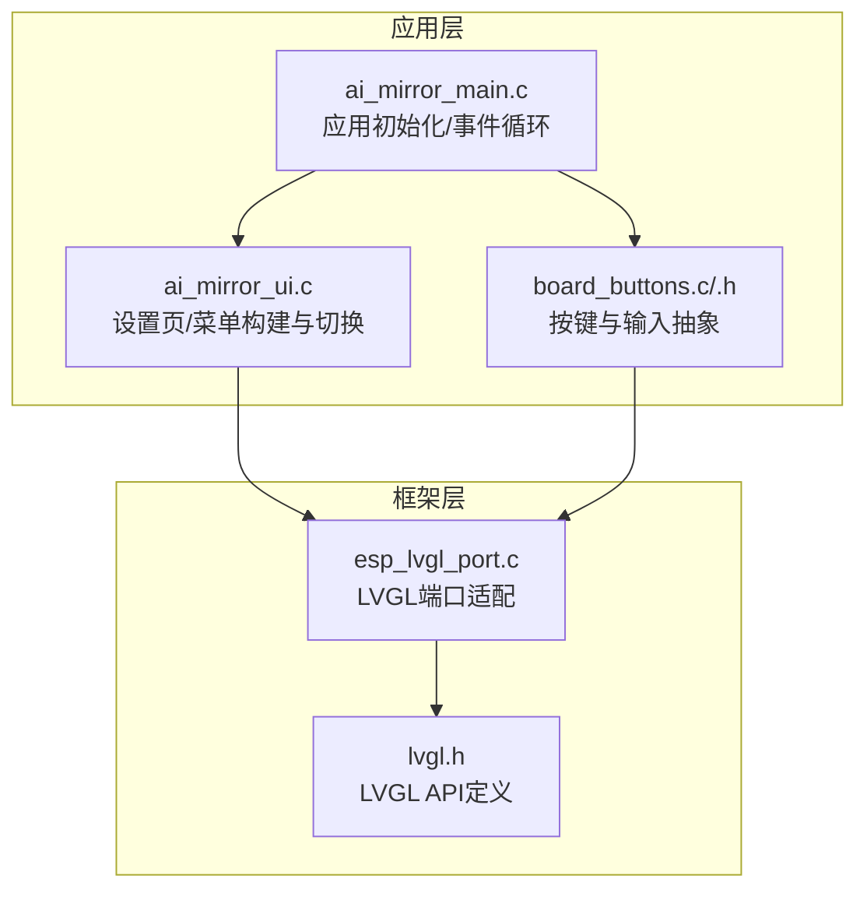
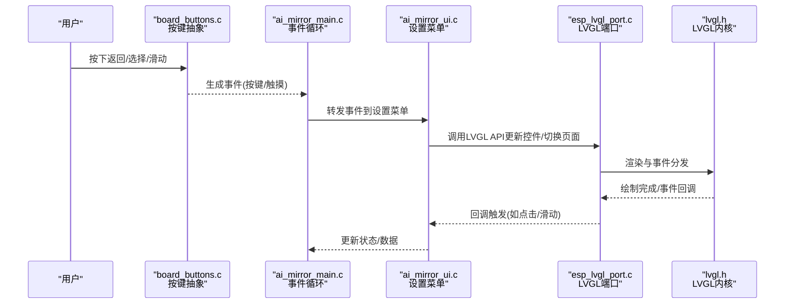
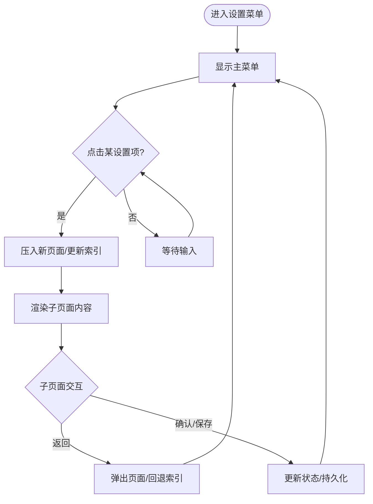
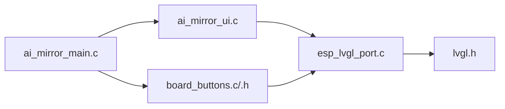
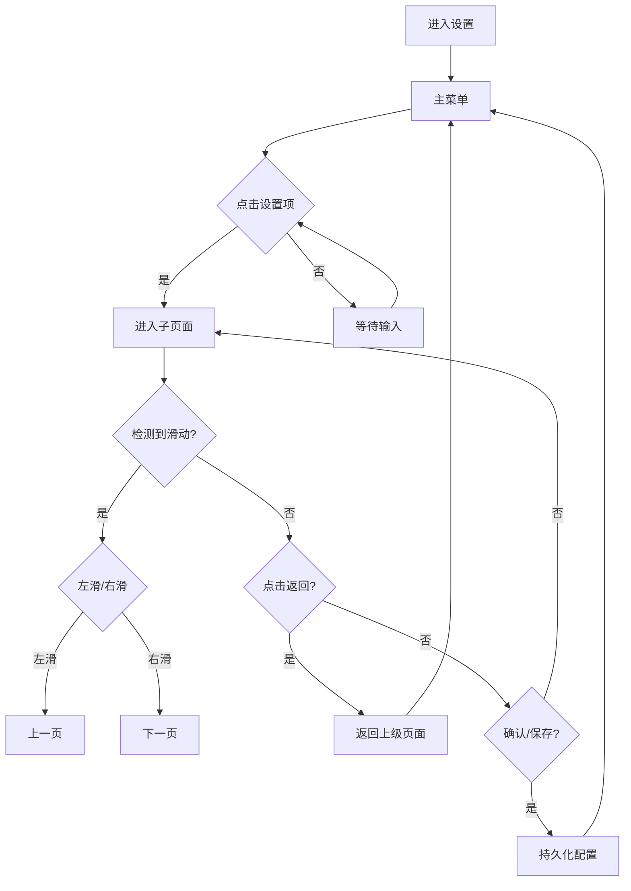

# 设置导航结构

<cite>
**本文档引用的文件**
- [ai_mirror_ui.c](file://Firmware/esp32_ai_mirror/main/ai_mirror_ui.c)
- [ai_mirror_main.c](file://Firmware/esp32_ai_mirror/main/ai_mirror_main.c)
- [board_buttons.c](file://Firmware/esp32_ai_mirror/main/board_buttons.c)
- [board_buttons.h](file://Firmware/esp32_ai_mirror/main/board_buttons.h)
- [esp_lvgl_port.c](file://Firmware/esp32_ai_mirror/managed_components/espressif__esp_lvgl_port/esp_lvgl_port.c)
- [lvgl.h](file://Firmware/esp32_ai_mirror/managed_components/lvgl__lvgl/src/lvgl.h)
</cite>

## 目录
1. [简介](#简介)
2. [项目结构](#项目结构)
3. [核心组件](#核心组件)
4. [架构总览](#架构总览)
5. [详细组件分析](#详细组件分析)
6. [依赖关系分析](#依赖关系分析)
7. [性能考虑](#性能考虑)
8. [故障排查指南](#故障排查指南)
9. [结论](#结论)
10. [附录](#附录)

## 简介
本文件面向ESP32 AI镜像项目中基于LVGL的设置菜单导航结构，系统性说明主菜单与子菜单的层级组织、页面切换机制、用户交互（点击返回、滑动等手势）处理、页面状态管理与数据传递方式，并给出自定义导航页面的实现示例与最佳实践。文档力求对非专业读者友好，同时为开发者提供可追溯的代码级依据与图示。

## 项目结构
本项目采用分层组织：UI逻辑集中在main目录下的C文件中，LVGL框架通过ESP-IDF组件集成到工程中。与设置导航相关的关键文件包括：
- UI入口与界面构建：ai_mirror_ui.c
- 应用初始化与事件循环：ai_mirror_main.c
- 板载按键与输入抽象：board_buttons.c/.h
- LVGL端口适配层：esp_lvgl_port.c
- LVGL核心头文件：lvgl.h

图表来源
- [ai_mirror_main.c](file://Firmware/esp32_ai_mirror/main/ai_mirror_main.c)
- [ai_mirror_ui.c](file://Firmware/esp32_ai_mirror/main/ai_mirror_ui.c)
- [board_buttons.c](file://Firmware/esp32_ai_mirror/main/board_buttons.c)
- [board_buttons.h](file://Firmware/esp32_ai_mirror/main/board_buttons.h)
- [esp_lvgl_port.c](file://Firmware/esp32_ai_mirror/managed_components/espressif__esp_lvgl_port/esp_lvgl_port.c)
- [lvgl.h](file://Firmware/esp32_ai_mirror/managed_components/lvgl__lvgl/src/lvgl.h)

章节来源
- [ai_mirror_ui.c](file://Firmware/esp32_ai_mirror/main/ai_mirror_ui.c)
- [ai_mirror_main.c](file://Firmware/esp32_ai_mirror/main/ai_mirror_main.c)
- [board_buttons.c](file://Firmware/esp32_ai_mirror/main/board_buttons.c)
- [board_buttons.h](file://Firmware/esp32_ai_mirror/main/board_buttons.h)
- [esp_lvgl_port.c](file://Firmware/esp32_ai_mirror/managed_components/espressif__esp_lvgl_port/esp_lvgl_port.c)
- [lvgl.h](file://Firmware/esp32_ai_mirror/managed_components/lvgl__lvgl/src/lvgl.h)

## 核心组件
- 设置页面与菜单管理（ai_mirror_ui.c）
  - 负责创建主菜单、子菜单及具体设置项的LVGL对象
  - 维护当前页面栈或索引，控制页面显示与切换动画
  - 注册按钮点击、列表选择、滑动等事件回调
- 应用生命周期与事件循环（ai_mirror_main.c）
  - 初始化LVGL、显示与触摸驱动
  - 启动任务/定时器刷新UI
  - 分发系统事件到UI层
- 输入与按键抽象（board_buttons.c/.h）
  - 将硬件按键映射为LVGL事件或应用事件
  - 支持长按、短按、组合键等策略
- LVGL端口适配（esp_lvgl_port.c）
  - 桥接ESP-IDF显示/触摸驱动与LVGL
  - 提供刷新、缓冲区配置、事件上报
- LVGL核心API（lvgl.h）
  - 定义控件、样式、事件、动画、屏幕管理等接口

章节来源
- [ai_mirror_ui.c](file://Firmware/esp32_ai_mirror/main/ai_mirror_ui.c)
- [ai_mirror_main.c](file://Firmware/esp32_ai_mirror/main/ai_mirror_main.c)
- [board_buttons.c](file://Firmware/esp32_ai_mirror/main/board_buttons.c)
- [board_buttons.h](file://Firmware/esp32_ai_mirror/main/board_buttons.h)
- [esp_lvgl_port.c](file://Firmware/esp32_ai_mirror/managed_components/espressif__esp_lvgl_port/esp_lvgl_port.c)
- [lvgl.h](file://Firmware/esp32_ai_mirror/managed_components/lvgl__lvgl/src/lvgl.h)

## 架构总览
设置导航的整体架构遵循“应用层—输入抽象—LVGL端口—LVGL内核”的分层模式。设置菜单作为应用层UI模块，通过LVGL提供的控件与事件机制完成页面构建与交互；输入抽象层屏蔽硬件差异，统一上报事件；LVGL端口负责底层显示与触摸驱动对接。

图表来源
- [board_buttons.c](file://Firmware/esp32_ai_mirror/main/board_buttons.c)
- [ai_mirror_main.c](file://Firmware/esp32_ai_mirror/main/ai_mirror_main.c)
- [ai_mirror_ui.c](file://Firmware/esp32_ai_mirror/main/ai_mirror_ui.c)
- [esp_lvgl_port.c](file://Firmware/esp32_ai_mirror/managed_components/espressif__esp_lvgl_port/esp_lvgl_port.c)
- [lvgl.h](file://Firmware/esp32_ai_mirror/managed_components/lvgl__lvgl/src/lvgl.h)

## 详细组件分析

### 设置菜单与页面切换（ai_mirror_ui.c）
- 页面模型
  - 使用LVGL的Screen/Page或Container作为页面容器
  - 主菜单包含若干设置项（如网络、音频、显示、语言等），每个设置项对应一个子页面
- 切换机制
  - 通过维护当前页面索引或页面栈实现前进/后退
  - 进入子页面时保存父页面上下文，返回时恢复
  - 可使用LVGL内置过渡动画（如slide/fade）提升体验
- 事件绑定
  - 为菜单项注册点击回调，触发页面切换
  - 为返回按钮注册回调，执行pop或index减一操作
- 数据传递
  - 使用全局或模块级结构体承载设置项值
  - 在页面间通过引用或消息队列传递变更后的配置

图表来源
- [ai_mirror_ui.c](file://Firmware/esp32_ai_mirror/main/ai_mirror_ui.c)

章节来源
- [ai_mirror_ui.c](file://Firmware/esp32_ai_mirror/main/ai_mirror_ui.c)

### 应用初始化与事件循环（ai_mirror_main.c）
- 初始化流程
  - 初始化LVGL与显示/触摸驱动
  - 创建设置菜单根页面
  - 启动UI刷新任务或定时器
- 事件循环
  - 从输入抽象层获取事件
  - 分发给UI层处理（菜单点击、滑动、长按等）
  - 根据业务逻辑更新状态并触发重绘

章节来源
- [ai_mirror_main.c](file://Firmware/esp32_ai_mirror/main/ai_mirror_main.c)

### 输入与按键抽象（board_buttons.c/.h）
- 按键映射
  - 将硬件GPIO映射为逻辑按键（返回、确认、上/下、左/右）
  - 支持去抖、长按检测、组合键
- 事件上报
  - 将按键事件转换为LVGL事件或直接回调UI层
  - 与触摸事件统一处理，保证交互一致性

章节来源
- [board_buttons.c](file://Firmware/esp32_ai_mirror/main/board_buttons.c)
- [board_buttons.h](file://Firmware/esp32_ai_mirror/main/board_buttons.h)

### LVGL端口适配（esp_lvgl_port.c）
- 显示与触摸桥接
  - 配置帧缓冲、刷新区域、DMA传输
  - 将触摸坐标转换到LVGL坐标系
- 事件通道
  - 将底层触摸/按键事件封装为LVGL事件类型
  - 确保事件时序与渲染同步

章节来源
- [esp_lvgl_port.c](file://Firmware/esp32_ai_mirror/managed_components/espressif__esp_lvgl_port/esp_lvgl_port.c)

### LVGL核心API（lvgl.h）
- 关键能力
  - 控件创建与管理（Label、Button、List、Switch、Slider等）
  - 事件系统与回调注册
  - 动画与过渡效果
  - 样式与主题管理
  - 屏幕/页面管理（screen/page/container）

章节来源
- [lvgl.h](file://Firmware/esp32_ai_mirror/managed_components/lvgl__lvgl/src/lvgl.h)

## 依赖关系分析
设置导航模块依赖输入抽象与LVGL端口，向上被应用事件循环调度，向下依赖LVGL内核。各层职责清晰，耦合度低，便于扩展与维护。

图表来源
- [ai_mirror_main.c](file://Firmware/esp32_ai_mirror/main/ai_mirror_main.c)
- [ai_mirror_ui.c](file://Firmware/esp32_ai_mirror/main/ai_mirror_ui.c)
- [board_buttons.c](file://Firmware/esp32_ai_mirror/main/board_buttons.c)
- [board_buttons.h](file://Firmware/esp32_ai_mirror/main/board_buttons.h)
- [esp_lvgl_port.c](file://Firmware/esp32_ai_mirror/managed_components/espressif__esp_lvgl_port/esp_lvgl_port.c)
- [lvgl.h](file://Firmware/esp32_ai_mirror/managed_components/lvgl__lvgl/src/lvgl.h)

章节来源
- [ai_mirror_main.c](file://Firmware/esp32_ai_mirror/main/ai_mirror_main.c)
- [ai_mirror_ui.c](file://Firmware/esp32_ai_mirror/main/ai_mirror_ui.c)
- [board_buttons.c](file://Firmware/esp32_ai_mirror/main/board_buttons.c)
- [board_buttons.h](file://Firmware/esp32_ai_mirror/main/board_buttons.h)
- [esp_lvgl_port.c](file://Firmware/esp32_ai_mirror/managed_components/espressif__esp_lvgl_port/esp_lvgl_port.c)
- [lvgl.h](file://Firmware/esp32_ai_mirror/managed_components/lvgl__lvgl/src/lvgl.h)

## 性能考虑
- 页面懒加载：仅在需要时创建子页面控件，减少内存占用
- 事件节流：对高频输入（如快速滑动）进行合并或限流
- 动画优化：避免复杂动画与频繁重绘，必要时禁用过渡
- 缓存策略：对静态资源（图标、字体）进行缓存复用
- 刷新区域：合理设置LVGL刷新区域，降低总线负载

[本节为通用指导，不直接分析具体文件]

## 故障排查指南
- 页面无法切换
  - 检查页面索引/栈是否正确更新
  - 确认事件回调是否注册成功
  - 查看LVGL渲染是否被阻塞
- 返回无效
  - 校验返回按钮事件映射
  - 检查页面栈是否为空
- 滑动无响应
  - 确认触摸驱动已启用且坐标转换正确
  - 检查滑动阈值与方向判定
- 数据未保存
  - 验证持久化写入流程
  - 检查跨页面数据传递路径

章节来源
- [ai_mirror_ui.c](file://Firmware/esp32_ai_mirror/main/ai_mirror_ui.c)
- [board_buttons.c](file://Firmware/esp32_ai_mirror/main/board_buttons.c)
- [esp_lvgl_port.c](file://Firmware/esp32_ai_mirror/managed_components/espressif__esp_lvgl_port/esp_lvgl_port.c)

## 结论
本项目的设置导航结构以LVGL为核心，结合输入抽象与端口适配，实现了清晰的页面层级与流畅的交互体验。通过合理的状态管理与数据传递机制，可在保持代码可维护性的同时，灵活扩展新的设置项与页面。建议遵循本文的最佳实践，持续优化性能与用户体验。

[本节为总结性内容，不直接分析具体文件]

## 附录

### 自定义导航页面实现示例（步骤指引）
- 新建页面容器
  - 在设置菜单模块中新增页面构建函数
  - 使用LVGL控件布局设置项
- 注册事件回调
  - 为返回按钮、确认按钮、开关/滑块等控件注册回调
  - 在回调中更新状态并触发必要的数据持久化
- 页面切换
  - 在主菜单点击项时调用页面切换函数
  - 使用页面栈或索引管理前进/后退
- 数据传递
  - 使用模块级结构体或消息队列传递参数
  - 在子页面修改后通知父页面刷新

章节来源
- [ai_mirror_ui.c](file://Firmware/esp32_ai_mirror/main/ai_mirror_ui.c)
- [lvgl.h](file://Firmware/esp32_ai_mirror/managed_components/lvgl__lvgl/src/lvgl.h)

### 用户交互导航流程图（手势与按键）

图表来源
- [ai_mirror_ui.c](file://Firmware/esp32_ai_mirror/main/ai_mirror_ui.c)
- [board_buttons.c](file://Firmware/esp32_ai_mirror/main/board_buttons.c)