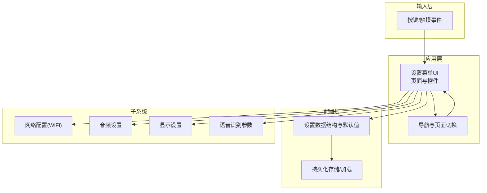
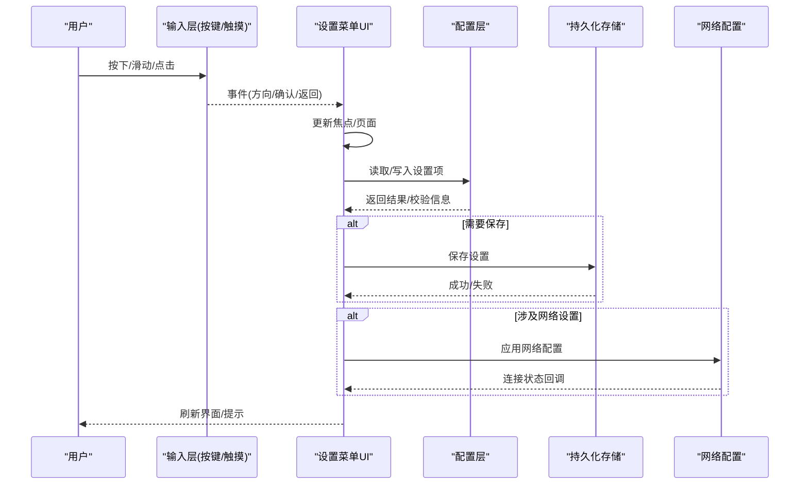
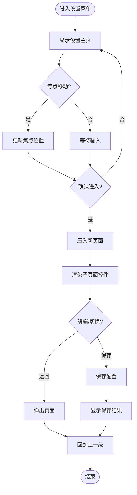
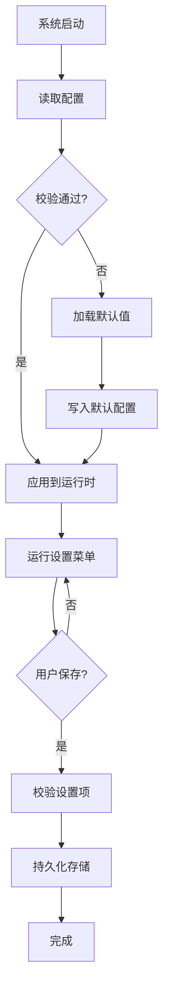
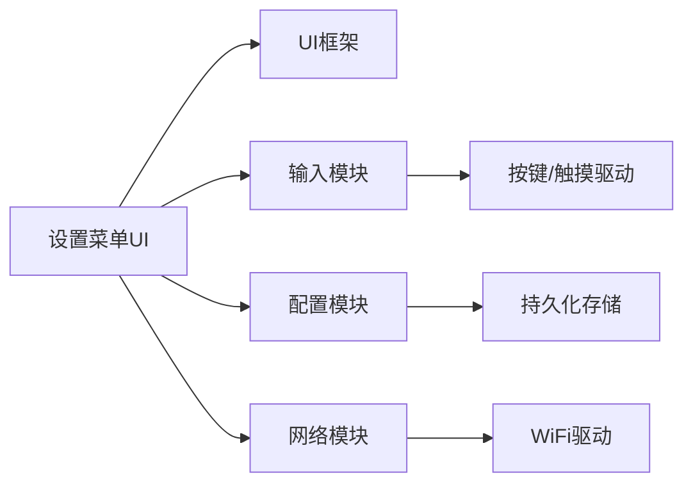

# 设置菜单系统

<cite>
**本文档引用的文件**   
- [ai_mirror_ui.c](file://Firmware/esp32_ai_mirror/main/ai_mirror_ui.c)
- [ai_mirror_config.h](file://Firmware/esp32_ai_mirror/main/ai_mirror_config.h)
- [board_buttons.c](file://Firmware/esp32_ai_mirror/main/board_buttons.c)
- [board_wifi_prov.c](file://Firmware/esp32_ai_mirror/main/board_wifi_prov.c)
- [sdkconfig.defaults](file://Firmware/esp32_ai_mirror/sdkconfig.defaults)
- [CMakeLists.txt](file://Firmware/esp32_ai_mirror/CMakeLists.txt)
</cite>

## 目录
1. [简介](#简介)
2. [项目结构](#项目结构)
3. [核心组件](#核心组件)
4. [架构总览](#架构总览)
5. [详细组件分析](#详细组件分析)
6. [依赖关系分析](#依赖关系分析)
7. [性能考量](#性能考量)
8. [故障排查指南](#故障排查指南)
9. [结论](#结论)
10. [附录](#附录)

## 简介
本文件面向AI镜子设备的“设置菜单系统”，围绕以下目标展开：
- 设置项分类组织：网络配置、音频设置、显示设置、语音识别参数等。
- 界面导航结构与页面切换逻辑。
- 表单控件使用：滑块、开关、下拉菜单等。
- 设置数据的持久化存储与加载机制。
- 自定义设置项的添加方法。
- 设置验证与错误处理机制。
- 界面动画效果与过渡动画实现。

本说明基于固件工程中的UI与配置相关文件进行梳理，帮助开发者快速理解并扩展设置菜单功能。

## 项目结构
设置菜单系统主要位于ESP32主程序模块中，关键文件包括：
- UI层：负责页面绘制、控件布局、事件处理与页面切换。
- 配置层：定义设置项的数据结构、默认值与持久化接口。
- 输入层：按键/触摸事件采集与分发。
- 网络配置：WiFi配网流程与状态管理。
- 构建与平台配置：编译选项与默认SDK配置。

图表来源
- [ai_mirror_ui.c](file://Firmware/esp32_ai_mirror/main/ai_mirror_ui.c)
- [ai_mirror_config.h](file://Firmware/esp32_ai_mirror/main/ai_mirror_config.h)
- [board_buttons.c](file://Firmware/esp32_ai_mirror/main/board_buttons.c)
- [board_wifi_prov.c](file://Firmware/esp32_ai_mirror/main/board_wifi_prov.c)

章节来源
- [ai_mirror_ui.c](file://Firmware/esp32_ai_mirror/main/ai_mirror_ui.c)
- [ai_mirror_config.h](file://Firmware/esp32_ai_mirror/main/ai_mirror_config.h)
- [board_buttons.c](file://Firmware/esp32_ai_mirror/main/board_buttons.c)
- [board_wifi_prov.c](file://Firmware/esp32_ai_mirror/main/board_wifi_prov.c)

## 核心组件
- 设置菜单UI（页面与控件）
  - 负责渲染设置分组（网络、音频、显示、语音识别），提供滑块、开关、下拉菜单等控件交互。
  - 维护当前页面索引与焦点位置，响应输入事件触发保存或返回。
- 配置数据模型与默认值
  - 集中定义各设置项的数据类型、取值范围、默认值与校验规则。
  - 提供读取/写入接口供UI层调用。
- 输入事件处理
  - 将物理按键/触摸事件转换为UI事件，驱动页面切换与控件更新。
- 网络配置模块
  - 提供WiFi连接、配网流程的状态回调，供设置页展示与操作。
- 持久化存储
  - 负责设置数据的序列化、校验、落盘与加载，保证重启后恢复。

章节来源
- [ai_mirror_ui.c](file://Firmware/esp32_ai_mirror/main/ai_mirror_ui.c)
- [ai_mirror_config.h](file://Firmware/esp32_ai_mirror/main/ai_mirror_config.h)
- [board_buttons.c](file://Firmware/esp32_ai_mirror/main/board_buttons.c)
- [board_wifi_prov.c](file://Firmware/esp32_ai_mirror/main/board_wifi_prov.c)

## 架构总览
设置菜单系统的整体交互流程如下：
- 用户通过按键/触摸触发事件。
- 输入层将事件分发给UI层。
- UI层根据当前页面与焦点决定动作（修改参数、切换页面、保存设置）。
- 修改参数时调用配置层读写接口，必要时触发校验。
- 保存成功后由持久化模块写入存储。
- 网络相关设置变更会联动网络配置模块。

图表来源
- [ai_mirror_ui.c](file://Firmware/esp32_ai_mirror/main/ai_mirror_ui.c)
- [ai_mirror_config.h](file://Firmware/esp32_ai_mirror/main/ai_mirror_config.h)
- [board_buttons.c](file://Firmware/esp32_ai_mirror/main/board_buttons.c)
- [board_wifi_prov.c](file://Firmware/esp32_ai_mirror/main/board_wifi_prov.c)

## 详细组件分析

### 设置项分类与组织
- 网络配置
  - 包含WiFi SSID、密码、连接模式、自动重连等。
  - 在设置页以分组形式呈现，支持进入子页面编辑。
- 音频设置
  - 包含音量、麦克风增益、回声消除、降噪等级等。
  - 常用参数以滑块呈现，便于微调。
- 显示设置
  - 包含亮度、对比度、色温、旋转角度等。
  - 部分参数可实时预览变化。
- 语音识别参数
  - 包含唤醒词阈值、识别灵敏度、语言包选择等。
  - 下拉菜单用于选择语言包或算法模式。

章节来源
- [ai_mirror_ui.c](file://Firmware/esp32_ai_mirror/main/ai_mirror_ui.c)
- [ai_mirror_config.h](file://Firmware/esp32_ai_mirror/main/ai_mirror_config.h)

### 界面导航结构与页面切换逻辑
- 页面层级
  - 一级页面：设置主页（分组入口）。
  - 二级页面：各分组详情（如网络、音频、显示、语音识别）。
- 导航方式
  - 方向键/滑动手势移动焦点；确认键进入子页面；返回键退出。
- 切换逻辑
  - 维护当前页面栈与焦点索引；进入子页面时压栈，返回时弹栈。
  - 切换时触发页面初始化与控件重建。

图表来源
- [ai_mirror_ui.c](file://Firmware/esp32_ai_mirror/main/ai_mirror_ui.c)
- [board_buttons.c](file://Firmware/esp32_ai_mirror/main/board_buttons.c)

章节来源
- [ai_mirror_ui.c](file://Firmware/esp32_ai_mirror/main/ai_mirror_ui.c)
- [board_buttons.c](file://Firmware/esp32_ai_mirror/main/board_buttons.c)

### 表单控件的使用
- 滑块（Slider）
  - 适用于连续数值调节（音量、亮度、阈值等）。
  - 支持最小/最大值与步进值配置。
- 开关（Switch/Toggle）
  - 适用于布尔型设置（自动重连、降噪开关等）。
  - 即时生效或下次启动生效。
- 下拉菜单（Dropdown/List）
  - 适用于离散选项（语言包、算法模式、设备角色等）。
  - 支持动态列表更新。
- 文本输入（Text Entry）
  - 适用于SSID、密码等字符串输入。
  - 支持掩码显示与长度限制。

章节来源
- [ai_mirror_ui.c](file://Firmware/esp32_ai_mirror/main/ai_mirror_ui.c)

### 设置数据的持久化存储与加载机制
- 数据结构
  - 统一的结构体封装所有设置项，包含版本字段以便迁移。
- 默认值
  - 启动时若未检测到有效配置，则加载默认值。
- 存储介质
  - 使用非易失存储分区（如SPIFFS/NVS）保存配置。
- 加载流程
  - 启动时尝试读取配置，校验完整性与版本兼容性。
  - 校验失败回退到默认值并重新写入。
- 保存流程
  - 用户确认后批量写入，避免频繁I/O。
  - 写入前进行二次校验，确保一致性。

图表来源
- [ai_mirror_config.h](file://Firmware/esp32_ai_mirror/main/ai_mirror_config.h)

章节来源
- [ai_mirror_config.h](file://Firmware/esp32_ai_mirror/main/ai_mirror_config.h)

### 自定义设置项的添加方法
- 步骤概览
  - 在配置结构体中添加新字段，设定默认值与取值范围。
  - 在UI层新增对应控件与事件处理。
  - 在保存流程中加入校验与持久化逻辑。
  - 可选：为网络/音频/显示等子系统增加联动回调。
- 注意事项
  - 保持向后兼容：新增字段需考虑旧版本配置加载。
  - 校验规则明确：防止非法值导致子系统异常。
  - UI反馈清晰：保存成功/失败提示与错误原因。

章节来源
- [ai_mirror_config.h](file://Firmware/esp32_ai_mirror/main/ai_mirror_config.h)
- [ai_mirror_ui.c](file://Firmware/esp32_ai_mirror/main/ai_mirror_ui.c)

### 设置验证与错误处理机制
- 校验维度
  - 类型校验：确保数据类型正确。
  - 范围校验：检查数值是否在允许区间。
  - 依赖校验：某些设置项之间存在约束关系。
- 错误处理
  - 前端提示：在控件附近显示错误信息。
  - 回滚策略：保存失败时回滚到上次有效值。
  - 日志记录：记录错误上下文便于定位问题。

章节来源
- [ai_mirror_ui.c](file://Firmware/esp32_ai_mirror/main/ai_mirror_ui.c)
- [ai_mirror_config.h](file://Firmware/esp32_ai_mirror/main/ai_mirror_config.h)

### 界面动画效果与过渡动画实现
- 动画类型
  - 页面切换：淡入淡出、滑动过渡。
  - 控件反馈：点击缩放、选中高亮。
- 实现要点
  - 使用UI框架提供的动画API，控制时长与缓动函数。
  - 避免在动画期间执行耗时操作，保证流畅性。
  - 针对低性能设备降级动画效果。

章节来源
- [ai_mirror_ui.c](file://Firmware/esp32_ai_mirror/main/ai_mirror_ui.c)

## 依赖关系分析
设置菜单系统依赖以下模块：
- UI框架：提供控件、布局与事件机制。
- 输入模块：按键/触摸驱动与事件分发。
- 配置模块：数据结构、默认值与持久化接口。
- 网络模块：WiFi配网与连接状态。
- 构建系统：CMake与SDK配置影响编译行为。

图表来源
- [ai_mirror_ui.c](file://Firmware/esp32_ai_mirror/main/ai_mirror_ui.c)
- [board_buttons.c](file://Firmware/esp32_ai_mirror/main/board_buttons.c)
- [board_wifi_prov.c](file://Firmware/esp32_ai_mirror/main/board_wifi_prov.c)
- [ai_mirror_config.h](file://Firmware/esp32_ai_mirror/main/ai_mirror_config.h)

章节来源
- [CMakeLists.txt](file://Firmware/esp32_ai_mirror/CMakeLists.txt)
- [sdkconfig.defaults](file://Firmware/esp32_ai_mirror/sdkconfig.defaults)

## 性能考量
- I/O优化
  - 批量保存配置，减少频繁写入。
  - 延迟加载大资源（如图标、字体）。
- UI渲染
  - 按需重绘，避免全量刷新。
  - 动画帧率与复杂度平衡。
- 内存管理
  - 合理分配控件对象，及时释放无用资源。
  - 避免全局大数组，采用静态常量表。

[本节为通用指导，不直接分析具体文件]

## 故障排查指南
- 常见问题
  - 设置无法保存：检查持久化分区权限与空间。
  - 页面卡顿：排查动画与渲染开销。
  - 网络配置无效：确认SSID/密码格式与路由器兼容性。
- 调试手段
  - 启用详细日志，定位错误堆栈。
  - 使用断点与变量监视，跟踪配置读写过程。
  - 模拟输入事件，复现交互问题。

章节来源
- [ai_mirror_ui.c](file://Firmware/esp32_ai_mirror/main/ai_mirror_ui.c)
- [ai_mirror_config.h](file://Firmware/esp32_ai_mirror/main/ai_mirror_config.h)

## 结论
AI镜子设置菜单系统以清晰的模块化设计实现了多类设置项的组织与管理，结合直观的控件与流畅的动画效果，提供了良好的用户体验。通过统一的配置数据模型与持久化机制，确保了设置的可靠性和可扩展性。开发者可依据本文档快速扩展新的设置项，并遵循最佳实践保障系统稳定性与性能。

[本节为总结性内容，不直接分析具体文件]

## 附录
- 术语表
  - 设置项：用户可配置的参数或选项。
  - 持久化：将数据保存到非易失存储中。
  - 校验：对输入数据进行合法性检查。
- 参考文件
  - UI实现：[ai_mirror_ui.c](file://Firmware/esp32_ai_mirror/main/ai_mirror_ui.c)
  - 配置定义：[ai_mirror_config.h](file://Firmware/esp32_ai_mirror/main/ai_mirror_config.h)
  - 输入处理：[board_buttons.c](file://Firmware/esp32_ai_mirror/main/board_buttons.c)
  - 网络配置：[board_wifi_prov.c](file://Firmware/esp32_ai_mirror/main/board_wifi_prov.c)
  - 构建配置：[CMakeLists.txt](file://Firmware/esp32_ai_mirror/CMakeLists.txt), [sdkconfig.defaults](file://Firmware/esp32_ai_mirror/sdkconfig.defaults)