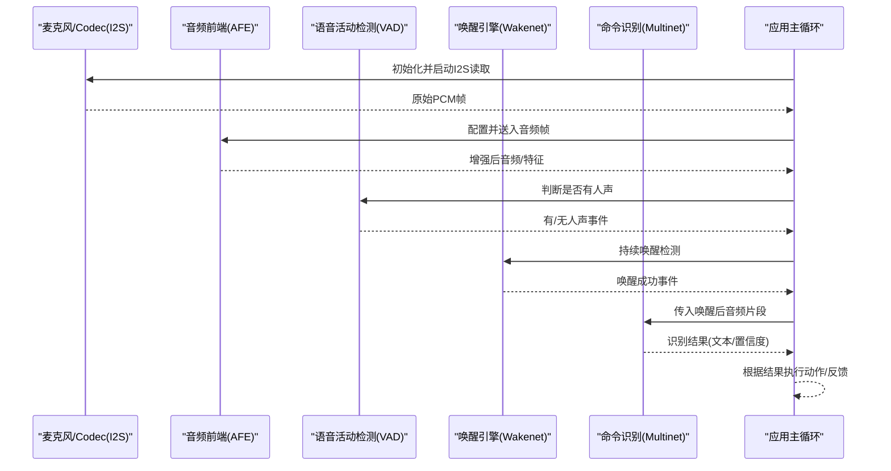
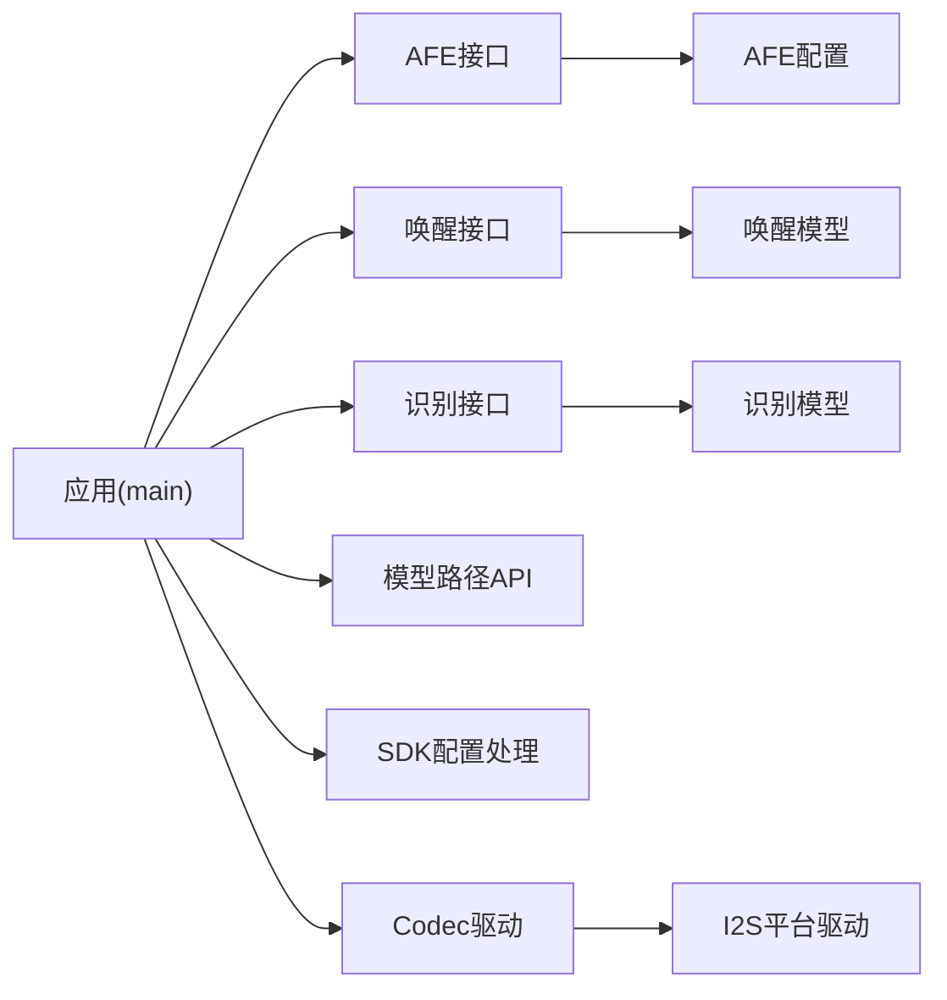

# 语音识别设置

<cite>
**本文引用的文件**   
- [ai_mirror_main.c](file://Firmware/esp32_ai_mirror/main/ai_mirror_main.c)
- [ai_mirror_config.h](file://Firmware/esp32_ai_mirror/main/ai_mirror_config.h)
- [Kconfig.projbuild](file://Firmware/esp32_ai_mirror/main/Kconfig.projbuild)
- [CMakeLists.txt](file://Firmware/esp32_ai_mirror/main/CMakeLists.txt)
- [idf_component.yml](file://Firmware/esp32_ai_mirror/main/idf_component.yml)
- [sdkconfig.defaults](file://Firmware/esp32_ai_mirror/sdkconfig.defaults)
- [esp_afe_config.h](file://Firmware/esp32_ai_mirror/components/espressif__esp-sr/include/esp32/esp_afe_config.h)
- [esp_afe_sr_iface.h](file://Firmware/esp32_ai_mirror/components/espressif__esp-sr/include/esp32/esp_afe_sr_iface.h)
- [esp_afe_sr_models.h](file://Firmware/esp32_ai_mirror/components/espressif__esp-sr/include/esp32/esp_afe_sr_models.h)
- [esp_wn_iface.h](file://Firmware/esp32_ai_mirror/components/espressif__esp-sr/include/esp32/esp_wn_iface.h)
- [esp_wn_models.h](file://Firmware/esp32_ai_mirror/components/espressif__esp-sr/include/esp32/esp_wn_models.h)
- [esp_mn_iface.h](file://Firmware/esp32_ai_mirror/components/espressif__esp-sr/include/esp32/esp_mn_iface.h)
- [esp_mn_models.h](file://Firmware/esp32_ai_mirror/components/espressif__esp-sr/include/esp32/esp_mn_models.h)
- [movemodel.py](file://Firmware/esp32_ai_mirror/components/espressif__esp-sr/model/movemodel.py)
- [pack_model.py](file://Firmware/esp32_ai_mirror/components/espressif__esp-sr/model/pack_model.py)
- [es8311.c](file://Firmware/esp32_ai_mirror/managed_components/espressif__es8311/es8311.c)
- [codec_dev_mirror.c](file://Firmware/esp32_ai_mirror/managed_components/espressif__esp_codec_dev/codec_dev_mirror.c)
- [audio_codec_data_i2s.c](file://Firmware/esp32_ai_mirror/managed_components/espressif__esp_codec_dev/platform/audio_codec_data_i2s.c)
- [esp_process_sdkconfig.c](file://Firmware/esp32_ai_mirror/components/espressif__esp-sr/src/esp_process_sdkconfig.c)
- [model_path.c](file://Firmware/esp32_ai_mirror/components/espressif__esp-sr/src/model_path.c)
</cite>

## 目录
1. [简介](#简介)
2. [项目结构](#项目结构)
3. [核心组件](#核心组件)
4. [架构总览](#架构总览)
5. [详细组件分析](#详细组件分析)
6. [依赖关系分析](#依赖关系分析)
7. [性能考虑](#性能考虑)
8. [故障排查指南](#故障排查指南)
9. [结论](#结论)
10. [附录](#附录)

## 简介
本文件面向在 ESP32-S3 平台上基于 esp-sr 的语音识别系统，聚焦“语音识别设置”主题，覆盖唤醒词灵敏度调节、识别阈值配置、降噪参数、音频前端处理（AFE）选项与优化策略、多模型加载与切换机制、实时测试与调试方法、自动调优思路以及多语言与方言适配。文档以仓库中的实际代码与组件为依据，提供可操作的配置指引与排障建议。

## 项目结构
本项目采用 ESP-IDF + esp-sr 组件化架构：
- 应用层位于 main 目录，负责初始化 AFE、VAD、唤醒引擎、识别引擎及音频链路。
- 语音能力由 components/espressif__esp-sr 提供，包含 AFE、唤醒（Wakenet）、命令识别（Multinet）等接口与模型管理。
- 音频编解码通过 managed_components 下的 es8311 与 esp_codec_dev 驱动 I2S 与 Codec 芯片。
- 构建与配置通过 CMake、Kconfig 与 sdkconfig.defaults 统一管理。

```mermaid
graph TB
subgraph "应用层"
APP["main/ai_mirror_main.c"]
CFG["main/ai_mirror_config.h"]
KCFG["main/Kconfig.projbuild"]
CMAKE["main/CMakeLists.txt"]
COMP_YML["main/idf_component.yml"]
end
subgraph "语音组件(esp-sr)"
AFE_IF["include/esp_afe_sr_iface.h"]
AFE_CFG["include/esp_afe_config.h"]
AFE_MODELS["include/esp_afe_sr_models.h"]
WN_IF["include/esp_wn_iface.h"]
WN_MODELS["include/esp_wn_models.h"]
MN_IF["include/esp_mn_iface.h"]
MN_MODELS["include/esp_mn_models.h"]
SRC_CFG["src/esp_process_sdkconfig.c"]
SRC_PATH["src/model_path.c"]
end
subgraph "音频子系统"
ES8311["managed_components/espressif__es8311/es8311.c"]
CODEC_DEV["managed_components/espressif__esp_codec_dev/codec_dev_mirror.c"]
I2S_DRV["managed_components/espressif__esp_codec_dev/platform/audio_codec_data_i2s.c"]
end
APP --> AFE_IF
APP --> WN_IF
APP --> MN_IF
APP --> CODEC_DEV
CODEC_DEV --> ES8311
CODEC_DEV --> I2S_DRV
AFE_IF --> AFE_CFG
AFE_IF --> AFE_MODELS
WN_IF --> WN_MODELS
MN_IF --> MN_MODELS
APP --> SRC_CFG
APP --> SRC_PATH
APP --> CMAKE
APP --> KCFG
APP --> COMP_YML
```

图表来源
- [ai_mirror_main.c](file://Firmware/esp32_ai_mirror/main/ai_mirror_main.c)
- [esp_afe_sr_iface.h](file://Firmware/esp32_ai_mirror/components/espressif__esp-sr/include/esp32/esp_afe_sr_iface.h)
- [esp_afe_config.h](file://Firmware/esp32_ai_mirror/components/espressif__esp-sr/include/esp32/esp_afe_config.h)
- [esp_afe_sr_models.h](file://Firmware/esp32_ai_mirror/components/espressif__esp-sr/include/esp32/esp_afe_sr_models.h)
- [esp_wn_iface.h](file://Firmware/esp32_ai_mirror/components/espressif__esp-sr/include/esp32/esp_wn_iface.h)
- [esp_wn_models.h](file://Firmware/esp32_ai_mirror/components/espressif__esp-sr/include/esp32/esp_wn_models.h)
- [esp_mn_iface.h](file://Firmware/esp32_ai_mirror/components/espressif__esp-sr/include/esp32/esp_mn_iface.h)
- [esp_mn_models.h](file://Firmware/esp32_ai_mirror/components/espressif__esp-sr/include/esp32/esp_mn_models.h)
- [es8311.c](file://Firmware/esp32_ai_mirror/managed_components/espressif__es8311/es8311.c)
- [codec_dev_mirror.c](file://Firmware/esp32_ai_mirror/managed_components/espressif__esp_codec_dev/codec_dev_mirror.c)
- [audio_codec_data_i2s.c](file://Firmware/esp32_ai_mirror/managed_components/espressif__esp_codec_dev/platform/audio_codec_data_i2s.c)
- [esp_process_sdkconfig.c](file://Firmware/esp32_ai_mirror/components/espressif__esp-sr/src/esp_process_sdkconfig.c)
- [model_path.c](file://Firmware/esp32_ai_mirror/components/espressif__esp-sr/src/model_path.c)

章节来源
- [CMakeLists.txt](file://Firmware/esp32_ai_mirror/main/CMakeLists.txt)
- [idf_component.yml](file://Firmware/esp32_ai_mirror/main/idf_component.yml)
- [sdkconfig.defaults](file://Firmware/esp32_ai_mirror/sdkconfig.defaults)

## 核心组件
- 音频前端（AFE）：负责麦克风采集、增益控制、AEC/NS/AGC、VAD 与特征提取，为唤醒与识别提供高质量音频流。
- 唤醒引擎（Wakenet）：低功耗持续监听，检测自定义或内置唤醒词，触发后续识别流程。
- 命令识别（Multinet）：对唤醒后的语音片段进行关键词/短语识别，支持中英文与多模型。
- 音频驱动（Codec/I2S）：通过 es8311 与 esp_codec_dev 抽象 I2S 数据通路，完成 ADC/DAC 与采样率、位宽、通道数配置。
- 配置与模型管理：通过 Kconfig、sdkconfig 与 model_path 管理编译期与运行期参数、模型路径与加载。

章节来源
- [esp_afe_sr_iface.h](file://Firmware/esp32_ai_mirror/components/espressif__esp-sr/include/esp32/esp_afe_sr_iface.h)
- [esp_afe_config.h](file://Firmware/esp32_ai_mirror/components/espressif__esp-sr/include/esp32/esp_afe_config.h)
- [esp_wn_iface.h](file://Firmware/esp32_ai_mirror/components/espressif__esp-sr/include/esp32/esp_wn_iface.h)
- [esp_mn_iface.h](file://Firmware/esp32_ai_mirror/components/espressif__esp-sr/include/esp32/esp_mn_iface.h)
- [es8311.c](file://Firmware/esp32_ai_mirror/managed_components/espressif__es8311/es8311.c)
- [codec_dev_mirror.c](file://Firmware/esp32_ai_mirror/managed_components/espressif__esp_codec_dev/codec_dev_mirror.c)
- [audio_codec_data_i2s.c](file://Firmware/esp32_ai_mirror/managed_components/espressif__esp_codec_dev/platform/audio_codec_data_i2s.c)

## 架构总览
下图展示从音频采集到唤醒与识别的关键调用链路与数据流向。

图表来源
- [ai_mirror_main.c](file://Firmware/esp32_ai_mirror/main/ai_mirror_main.c)
- [esp_afe_sr_iface.h](file://Firmware/esp32_ai_mirror/components/espressif__esp-sr/include/esp32/esp_afe_sr_iface.h)
- [esp_wn_iface.h](file://Firmware/esp32_ai_mirror/components/espressif__esp-sr/include/esp32/esp_wn_iface.h)
- [esp_mn_iface.h](file://Firmware/esp32_ai_mirror/components/espressif__esp-sr/include/esp32/esp_mn_iface.h)
- [audio_codec_data_i2s.c](file://Firmware/esp32_ai_mirror/managed_components/espressif__esp_codec_dev/platform/audio_codec_data_i2s.c)

## 详细组件分析

### 唤醒词灵敏度与阈值配置
- 灵敏度来源
  - 唤醒模型权重与训练集分布决定基础灵敏度。
  - 运行时可通过 VAD 门限与唤醒分数阈值共同影响触发概率。
- 可调参数
  - 唤醒分数阈值：提高阈值降低误触，降低阈值提升召回但增加误报。
  - VAD 能量/谱门限：过滤背景噪声，避免无效唤醒。
  - 窗口长度与滑动步长：影响响应延迟与稳定性。
- 实践建议
  - 先固定 AFE 参数，再微调唤醒阈值；在安静与嘈杂环境分别验证。
  - 结合 LED/串口日志输出唤醒分数，辅助定位阈值。

章节来源
- [esp_wn_iface.h](file://Firmware/esp32_ai_mirror/components/espressif__esp-sr/include/esp32/esp_wn_iface.h)
- [esp_wn_models.h](file://Firmware/esp32_ai_mirror/components/espressif__esp-sr/include/esp32/esp_wn_models.h)
- [esp_afe_config.h](file://Firmware/esp32_ai_mirror/components/espressif__esp-sr/include/esp32/esp_afe_config.h)

### 语音识别阈值与置信度
- 识别阈值
  - Multinet 返回识别结果与置信度，需设定最小置信度阈值过滤低质量结果。
- 动态调整
  - 依据历史成功率与环境噪声估计，自适应调整阈值。
- 评估指标
  - 误识率(FAR)、拒识率(FRR)、平均时延、CPU 占用。

章节来源
- [esp_mn_iface.h](file://Firmware/esp32_ai_mirror/components/espressif__esp-sr/include/esp32/esp_mn_iface.h)
- [esp_mn_models.h](file://Firmware/esp32_ai_mirror/components/espressif__esp-sr/include/esp32/esp_mn_models.h)

### 降噪与音频前端(AFE)参数
- AFE 模块
  - 支持 AEC（回声消除）、NS（降噪）、AGC（自动增益）、VAD（语音活动检测）。
  - 典型配置项包括滤波器阶数、窗函数、帧长、采样率、通道数、增益上限等。
- 优化策略
  - 在强混响环境增大 AEC 阶数与迭代次数；在稳态噪声下加强 NS 滤波强度。
  - 合理设置 AGC 目标电平，避免削波或过低信噪比。
  - 使用合适的 FFT 窗与帧移平衡频率分辨率与时域响应。
- 调试要点
  - 输出 AFE 前后波形对比，观察削波、底噪、回声残留。
  - 记录 VAD 开启/关闭比例，评估漏检与误检。

章节来源
- [esp_afe_config.h](file://Firmware/esp32_ai_mirror/components/espressif__esp-sr/include/esp32/esp_afe_config.h)
- [esp_afe_sr_iface.h](file://Firmware/esp32_ai_mirror/components/espressif__esp-sr/include/esp32/esp_afe_sr_iface.h)
- [esp_afe_sr_models.h](file://Firmware/esp32_ai_mirror/components/espressif__esp-sr/include/esp32/esp_afe_sr_models.h)

### 不同语音模型的加载与切换机制
- 模型类型
  - 唤醒模型（Wakenet）：用于低功耗唤醒词检测。
  - 识别模型（Multinet）：用于中文/英文关键词识别，支持 q8 量化版本以降低内存。
- 加载方式
  - 通过模型路径 API 指定 Flash/外部存储中的模型文件路径。
  - 构建期可选择默认模型，运行期可按场景切换。
- 切换策略
  - 按语言/方言选择对应 Multinet 模型。
  - 资源紧张时优先加载轻量模型，空闲时加载高精度模型。
- 工具链
  - 使用 pack_model.py 打包模型，movemodel.py 移动/替换模型文件。

章节来源
- [model_path.c](file://Firmware/esp32_ai_mirror/components/espressif__esp-sr/src/model_path.c)
- [movemodel.py](file://Firmware/esp32_ai_mirror/components/espressif__esp-sr/model/movemodel.py)
- [pack_model.py](file://Firmware/esp32_ai_mirror/components/espressif__esp-sr/model/pack_model.py)
- [esp_wn_models.h](file://Firmware/esp32_ai_mirror/components/espressif__esp-sr/include/esp32/esp_wn_models.h)
- [esp_mn_models.h](file://Firmware/esp32_ai_mirror/components/espressif__esp-sr/include/esp32/esp_mn_models.h)

### 实时测试与调试功能
- 测试点
  - 音频通路：I2S 数据流、Codec 寄存器、音量与静音状态。
  - AFE：AEC/NS/AGC/VAD 开关与参数效果。
  - 唤醒：分数曲线、触发时间、误报/漏报统计。
  - 识别：置信度分布、错误样本收集。
- 调试手段
  - 串口打印关键指标（VAD 状态、唤醒分数、识别结果）。
  - 录制 PCM 回放，定位声学问题。
  - 使用 LED/屏幕指示当前状态机阶段。

章节来源
- [audio_codec_data_i2s.c](file://Firmware/esp32_ai_mirror/managed_components/espressif__esp_codec_dev/platform/audio_codec_data_i2s.c)
- [es8311.c](file://Firmware/esp32_ai_mirror/managed_components/espressif__es8311/es8311.c)
- [codec_dev_mirror.c](file://Firmware/esp32_ai_mirror/managed_components/espressif__esp_codec_dev/codec_dev_mirror.c)
- [ai_mirror_main.c](file://Firmware/esp32_ai_mirror/main/ai_mirror_main.c)

### 自动调优算法（建议方案）
- 目标
  - 在用户环境中自动收敛到较优的唤醒阈值、VAD 门限与 AFE 参数组合。
- 步骤
  - 数据采集：记录环境噪声功率、VAD 激活率、唤醒分数分布、识别置信度。
  - 评分函数：综合误报率、漏报率、时延与 CPU 占用计算得分。
  - 搜索策略：网格搜索或贝叶斯优化，逐步缩小参数空间。
  - 在线更新：小步长平滑更新，避免频繁抖动；失败回滚。
- 约束
  - 离线训练为主，在线微调为辅；确保内存与算力预算内。

[本节为概念性指导，不直接分析具体文件]

### 多语言支持与方言适配
- 语言模型
  - 选择对应语言的 Multinet 模型（如中文/英文），必要时切换方言变体。
- 词典与 FST
  - 扩展词汇表与发音映射，提升特定领域识别准确率。
- 适配流程
  - 准备语料→训练/量化模型→打包→部署→在线评测与回归。

章节来源
- [esp_mn_models.h](file://Firmware/esp32_ai_mirror/components/espressif__esp-sr/include/esp32/esp_mn_models.h)
- [movemodel.py](file://Firmware/esp32_ai_mirror/components/espressif__esp-sr/model/movemodel.py)
- [pack_model.py](file://Firmware/esp32_ai_mirror/components/espressif__esp-sr/model/pack_model.py)

## 依赖关系分析
- 组件耦合
  - 应用层依赖 AFE/Wakenet/Multinet 接口，间接依赖模型路径与 SDK 配置。
  - 音频子系统通过 esp_codec_dev 统一 I2S/Codec 抽象，屏蔽硬件差异。
- 外部依赖
  - ESP-IDF 内核、ESP-DSP、ESP-TTS（可选）等。
- 潜在风险
  - 模型路径配置错误导致加载失败。
  - AFE 参数与硬件不匹配造成失真或卡顿。
  - 多模型同时驻留引发内存不足。

图表来源
- [ai_mirror_main.c](file://Firmware/esp32_ai_mirror/main/ai_mirror_main.c)
- [esp_afe_sr_iface.h](file://Firmware/esp32_ai_mirror/components/espressif__esp-sr/include/esp32/esp_afe_sr_iface.h)
- [esp_wn_iface.h](file://Firmware/esp32_ai_mirror/components/espressif__esp-sr/include/esp32/esp_wn_iface.h)
- [esp_mn_iface.h](file://Firmware/esp32_ai_mirror/components/espressif__esp-sr/include/esp32/esp_mn_iface.h)
- [model_path.c](file://Firmware/esp32_ai_mirror/components/espressif__esp-sr/src/model_path.c)
- [esp_process_sdkconfig.c](file://Firmware/esp32_ai_mirror/components/espressif__esp-sr/src/esp_process_sdkconfig.c)
- [audio_codec_data_i2s.c](file://Firmware/esp32_ai_mirror/managed_components/espressif__esp_codec_dev/platform/audio_codec_data_i2s.c)

章节来源
- [idf_component.yml](file://Firmware/esp32_ai_mirror/main/idf_component.yml)
- [CMakeLists.txt](file://Firmware/esp32_ai_mirror/main/CMakeLists.txt)

## 性能考虑
- 内存与算力
  - 优先选择 q8 量化模型，减少 SRAM/PSRAM 占用。
  - 合理设置帧长与批处理大小，平衡时延与吞吐。
- 功耗
  - 唤醒阶段保持低功耗模式，仅在检测到语音时唤醒识别。
  - 动态关闭不必要的 AFE 模块（如非必需 AEC）。
- 稳定性
  - 监控 CPU 使用率与堆栈水位，避免任务阻塞。
  - 对异常音频输入做保护（截断、重采样、限幅）。

[本节为通用指导，不直接分析具体文件]

## 故障排查指南
- 无法加载模型
  - 检查模型路径与文件系统挂载是否正确。
  - 确认模型文件格式与目标平台一致。
- 唤醒频繁误报/漏报
  - 调整唤醒阈值与 VAD 门限；改善 AEC/NS 参数。
  - 采集现场噪声样本，重新训练或更换模型。
- 识别准确率低
  - 扩大词汇表与口音样本；切换更匹配的 Multinet 模型。
  - 优化 AFE 参数，确保输入信噪比。
- 音频失真/爆音
  - 检查 Codec 增益与音量设置，避免削波。
  - 核对 I2S 采样率、位宽、通道数与硬件一致。

章节来源
- [model_path.c](file://Firmware/esp32_ai_mirror/components/espressif__esp-sr/src/model_path.c)
- [esp_afe_config.h](file://Firmware/esp32_ai_mirror/components/espressif__esp-sr/include/esp32/esp_afe_config.h)
- [es8311.c](file://Firmware/esp32_ai_mirror/managed_components/espressif__es8311/es8311.c)
- [audio_codec_data_i2s.c](file://Firmware/esp32_ai_mirror/managed_components/espressif__esp_codec_dev/platform/audio_codec_data_i2s.c)

## 结论
通过合理配置 AFE、VAD、唤醒与识别阈值，并结合模型管理与音频驱动的正确使用，可在资源受限的嵌入式设备上实现稳定高效的语音识别。建议以“离线训练+在线微调”的方式持续优化，建立完善的测试与回归流程，保障在不同环境与方言下的鲁棒性。

## 附录
- 常用配置入口
  - Kconfig 与 sdkconfig.defaults：编译期开关与默认值。
  - AFE 配置头文件：运行时 AEC/NS/AGC/VAD 参数。
  - 模型路径 API：运行期模型装载与切换。
- 参考脚本
  - pack_model.py：模型打包。
  - movemodel.py：模型文件管理。

章节来源
- [Kconfig.projbuild](file://Firmware/esp32_ai_mirror/main/Kconfig.projbuild)
- [sdkconfig.defaults](file://Firmware/esp32_ai_mirror/sdkconfig.defaults)
- [esp_afe_config.h](file://Firmware/esp32_ai_mirror/components/espressif__esp-sr/include/esp32/esp_afe_config.h)
- [model_path.c](file://Firmware/esp32_ai_mirror/components/espressif__esp-sr/src/model_path.c)
- [pack_model.py](file://Firmware/esp32_ai_mirror/components/espressif__esp-sr/model/pack_model.py)
- [movemodel.py](file://Firmware/esp32_ai_mirror/components/espressif__esp-sr/model/movemodel.py)