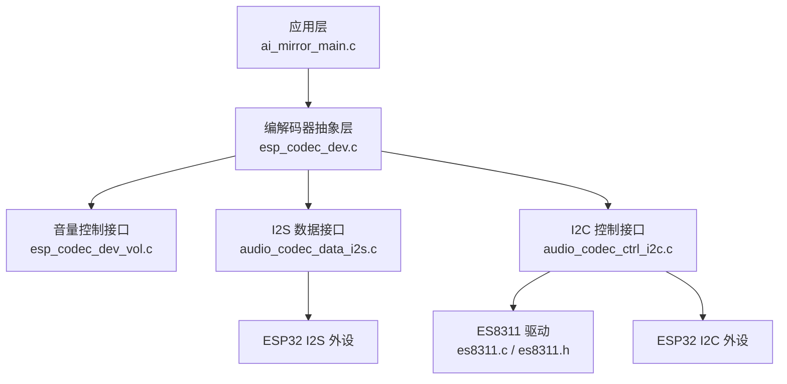
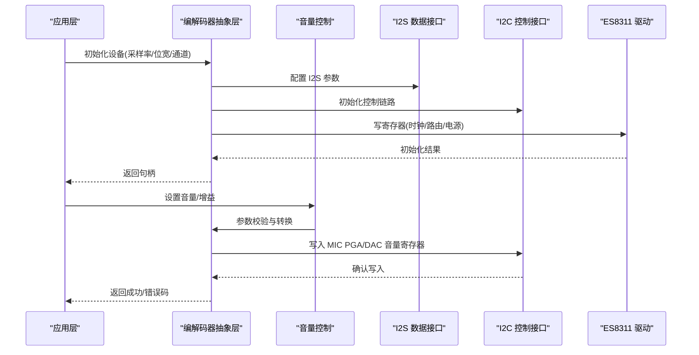
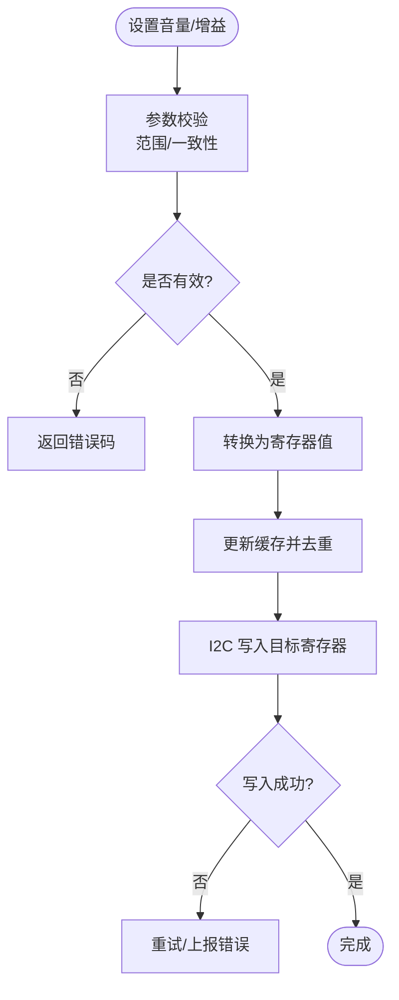
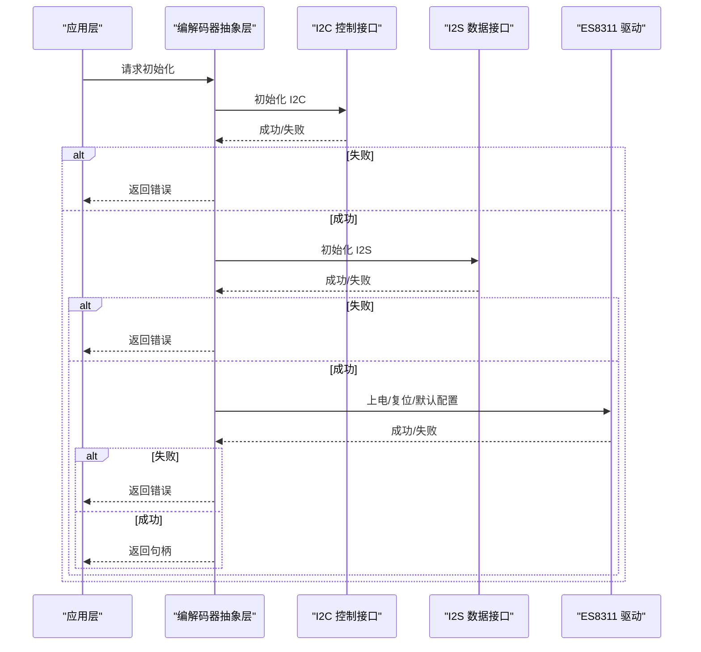
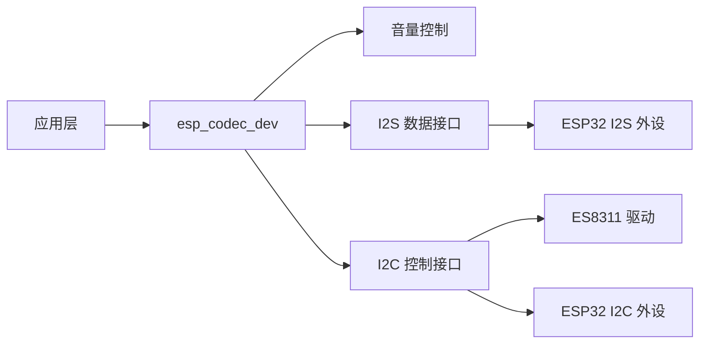

# 音频设置

<cite>
**本文引用的文件**   
- [ai_mirror_main.c](file://Firmware/esp32_ai_mirror/main/ai_mirror_main.c)
- [ai_mirror_config.h](file://Firmware/esp32_ai_mirror/main/ai_mirror_config.h)
- [es8311.c](file://Firmware/esp32_ai_mirror/managed_components/espressif__es8311/es8311.c)
- [es8311.h](file://Firmware/esp32_ai_mirror/managed_components/espressif__es8311/include/es8311.h)
- [esp_codec_dev.c](file://Firmware/esp32_ai_mirror/managed_components/espressif__esp_codec_dev/esp_codec_dev.c)
- [esp_codec_dev_vol.c](file://Firmware/esp32_ai_mirror/managed_components/espressif__esp_codec_dev/esp_codec_dev_vol.c)
- [audio_codec_data_i2s.c](file://Firmware/esp32_ai_mirror/managed_components/espressif__esp_codec_dev/platform/audio_codec_data_i2s.c)
- [audio_codec_ctrl_i2c.c](file://Firmware/esp32_ai_mirror/managed_components/espressif__esp_codec_dev/platform/audio_codec_ctrl_i2c.c)
- [audio_codec_if.h](file://Firmware/esp32_ai_mirror/managed_components/espressif__esp_codec_dev/interface/audio_codec_if.h)
- [audio_codec_vol_if.h](file://Firmware/esp32_ai_mirror/managed_components/espressif__esp_codec_dev/interface/audio_codec_vol_if.h)
- [sdkconfig.defaults](file://Firmware/esp32_ai_mirror/sdkconfig.defaults)
</cite>

## 目录
1. [简介](#简介)
2. [项目结构](#项目结构)
3. [核心组件](#核心组件)
4. [架构总览](#架构总览)
5. [详细组件分析](#详细组件分析)
6. [依赖关系分析](#依赖关系分析)
7. [性能考虑](#性能考虑)
8. [故障排查指南](#故障排查指南)
9. [结论](#结论)
10. [附录](#附录)

## 简介
本文件面向“音频设置”功能，覆盖音量调节、麦克风增益控制、扬声器输出配置等关键参数；阐述音频设备初始化流程与参数校验机制；说明实时音频参数调整的实现原理与性能优化策略；给出与硬件驱动（I2S/I2C）的接口定义；并提供音频效果调试工具与测试方法，以及不同音频设备的兼容性配置建议。文档力求在技术深度与可读性之间取得平衡，便于不同背景的读者理解和使用。

## 项目结构
本项目基于 ESP-IDF，音频子系统由应用层、编解码器抽象层（esp_codec_dev）、具体编解码器驱动（如 ES8311）和底层总线（I2S/I2C）组成。关键路径如下：
- 应用入口与配置：main 模块负责系统初始化与任务调度，包含音频相关配置项。
- 编解码器抽象：esp_codec_dev 提供统一的音频设备 API（音量、增益、采样率、通道数等）。
- 具体驱动：ES8311 作为 I2C 控制的音频编解码器，实现寄存器级配置。
- 数据通路：I2S 用于 PCM 数据流传输，I2C 用于寄存器配置。

图表来源
- [ai_mirror_main.c](file://Firmware/esp32_ai_mirror/main/ai_mirror_main.c)
- [esp_codec_dev.c](file://Firmware/esp32_ai_mirror/managed_components/espressif__esp_codec_dev/esp_codec_dev.c)
- [esp_codec_dev_vol.c](file://Firmware/esp32_ai_mirror/managed_components/espressif__esp_codec_dev/esp_codec_dev_vol.c)
- [audio_codec_data_i2s.c](file://Firmware/esp32_ai_mirror/managed_components/espressif__esp_codec_dev/platform/audio_codec_data_i2s.c)
- [audio_codec_ctrl_i2c.c](file://Firmware/esp32_ai_mirror/managed_components/espressif__esp_codec_dev/platform/audio_codec_ctrl_i2c.c)
- [es8311.c](file://Firmware/esp32_ai_mirror/managed_components/espressif__es8311/es8311.c)
- [es8311.h](file://Firmware/esp32_ai_mirror/managed_components/espressif__es8311/include/es8311.h)

章节来源
- [ai_mirror_main.c](file://Firmware/esp32_ai_mirror/main/ai_mirror_main.c)
- [sdkconfig.defaults](file://Firmware/esp32_ai_mirror/sdkconfig.defaults)

## 核心组件
- 应用配置与初始化
  - 通过配置文件与运行时参数决定音频设备类型、采样率、位宽、通道数、音量范围、AGC/NS/AEC 开关等。
  - 启动时按顺序完成 I2S 数据链路、I2C 控制链路、编解码器初始化与默认参数加载。
- 编解码器抽象层（esp_codec_dev）
  - 统一封装音量、增益、采样率、通道、静音、路由等能力，向上提供稳定 API。
  - 内部维护设备状态机与参数缓存，避免重复写入寄存器。
- 音量与增益控制
  - 数字音量：通过软件音量表或 DAC/ADC 增益寄存器进行调节。
  - 模拟增益：针对麦克风前端（MIC PGA）与线路输入进行增益设置。
- 数据与控制接口
  - I2S：PCM 数据流收发，支持多通道、不同位宽与采样率。
  - I2C：寄存器读写，完成时钟、路由、电源管理、AGC/NS/AEC 等配置。

章节来源
- [esp_codec_dev.c](file://Firmware/esp32_ai_mirror/managed_components/espressif__esp_codec_dev/esp_codec_dev.c)
- [esp_codec_dev_vol.c](file://Firmware/esp32_ai_mirror/managed_components/espressif__esp_codec_dev/esp_codec_dev_vol.c)
- [audio_codec_data_i2s.c](file://Firmware/esp32_ai_mirror/managed_components/espressif__esp_codec_dev/platform/audio_codec_data_i2s.c)
- [audio_codec_ctrl_i2c.c](file://Firmware/esp32_ai_mirror/managed_components/espressif__esp_codec_dev/platform/audio_codec_ctrl_i2c.c)
- [es8311.c](file://Firmware/esp32_ai_mirror/managed_components/espressif__es8311/es8311.c)
- [es8311.h](file://Firmware/esp32_ai_mirror/managed_components/espressif__es8311/include/es8311.h)

## 架构总览
下图展示从应用到硬件驱动的完整调用链，包括参数验证、设备初始化、数据通路建立与实时调节的关键步骤。

图表来源
- [ai_mirror_main.c](file://Firmware/esp32_ai_mirror/main/ai_mirror_main.c)
- [esp_codec_dev.c](file://Firmware/esp32_ai_mirror/managed_components/espressif__esp_codec_dev/esp_codec_dev.c)
- [esp_codec_dev_vol.c](file://Firmware/esp32_ai_mirror/managed_components/espressif__esp_codec_dev/esp_codec_dev_vol.c)
- [audio_codec_data_i2s.c](file://Firmware/esp32_ai_mirror/managed_components/espressif__esp_codec_dev/platform/audio_codec_data_i2s.c)
- [audio_codec_ctrl_i2c.c](file://Firmware/esp32_ai_mirror/managed_components/espressif__esp_codec_dev/platform/audio_codec_ctrl_i2c.c)
- [es8311.c](file://Firmware/esp32_ai_mirror/managed_components/espressif__es8311/es8311.c)

## 详细组件分析

### 音量调节与麦克风增益控制
- 数字音量
  - 通过 esp_codec_dev 的音量接口设置 DAC/ADC 的数字音量，单位通常为 dBFS，映射为寄存器值。
  - 支持左右声道独立控制与平滑过渡，避免突变噪声。
- 麦克风增益（MIC PGA）
  - 通过 I2C 写入 ES8311 的 MIC PGA 寄存器，实现 0–X dB 可调增益。
  - 结合 AGC（自动增益控制）可动态适应环境噪声。
- 参数验证
  - 边界检查：确保音量/增益在芯片支持范围内。
  - 一致性检查：采样率、位宽、通道数与路由匹配。
  - 幂等性：相同值不重复写寄存器，减少总线负载。

图表来源
- [esp_codec_dev_vol.c](file://Firmware/esp32_ai_mirror/managed_components/espressif__esp_codec_dev/esp_codec_dev_vol.c)
- [audio_codec_ctrl_i2c.c](file://Firmware/esp32_ai_mirror/managed_components/espressif__esp_codec_dev/platform/audio_codec_ctrl_i2c.c)
- [es8311.c](file://Firmware/esp32_ai_mirror/managed_components/espressif__es8311/es8311.c)

章节来源
- [esp_codec_dev_vol.c](file://Firmware/esp32_ai_mirror/managed_components/espressif__esp_codec_dev/esp_codec_dev_vol.c)
- [audio_codec_ctrl_i2c.c](file://Firmware/esp32_ai_mirror/managed_components/espressif__esp_codec_dev/platform/audio_codec_ctrl_i2c.c)
- [es8311.c](file://Firmware/esp32_ai_mirror/managed_components/espressif__es8311/es8311.c)

### 扬声器输出设置
- 输出路由
  - 选择 DAC 输出至耳机/线路输出，或启用内置功放（若存在）。
  - 配置输出模式（立体声/单声道）、混音与静音。
- 功率与时钟
  - 根据输出负载与功耗要求配置时钟分频与电源域。
- 同步与延迟
  - 保证 I2S 帧同步与 FIFO 水位，避免爆音与卡顿。

章节来源
- [es8311.c](file://Firmware/esp32_ai_mirror/managed_components/espressif__es8311/es8311.c)
- [audio_codec_data_i2s.c](file://Firmware/esp32_ai_mirror/managed_components/espressif__esp_codec_dev/platform/audio_codec_data_i2s.c)

### 音频设备初始化流程
- 初始化顺序
  1) I2C 控制链路初始化（引脚、频率、地址）。
  2) I2S 数据链路初始化（时钟、位宽、通道、DMA 缓冲）。
  3) 编解码器上电与复位，写入默认寄存器。
  4) 路由与采样率/位宽/通道配置。
  5) 音量/增益默认值加载。
- 错误处理
  - 各阶段返回错误码，失败时回滚已配置资源。
  - 日志记录关键节点，便于定位问题。

图表来源
- [ai_mirror_main.c](file://Firmware/esp32_ai_mirror/main/ai_mirror_main.c)
- [esp_codec_dev.c](file://Firmware/esp32_ai_mirror/managed_components/espressif__esp_codec_dev/esp_codec_dev.c)
- [audio_codec_ctrl_i2c.c](file://Firmware/esp32_ai_mirror/managed_components/espressif__esp_codec_dev/platform/audio_codec_ctrl_i2c.c)
- [audio_codec_data_i2s.c](file://Firmware/esp32_ai_mirror/managed_components/espressif__esp_codec_dev/platform/audio_codec_data_i2s.c)
- [es8311.c](file://Firmware/esp32_ai_mirror/managed_components/espressif__es8311/es8311.c)

章节来源
- [ai_mirror_main.c](file://Firmware/esp32_ai_mirror/main/ai_mirror_main.c)
- [esp_codec_dev.c](file://Firmware/esp32_ai_mirror/managed_components/espressif__esp_codec_dev/esp_codec_dev.c)

### 实时音频参数调整
- 触发方式
  - UI 事件（旋钮/按键/滑动条）或网络命令（OTA/远程配置）。
- 实现要点
  - 参数合并与去抖：对高频调整做平滑滤波。
  - 原子更新：使用临界区保护共享状态，避免竞态。
  - 异步回调：将耗时操作放入后台任务，UI 保持响应。
- 性能优化
  - 批量写入：合并多个寄存器写入，减少 I2C 事务。
  - 增量更新：仅变更必要寄存器，避免全量重配。
  - 预计算表：音量/dB 映射表加速查找。

章节来源
- [esp_codec_dev_vol.c](file://Firmware/esp32_ai_mirror/managed_components/espressif__esp_codec_dev/esp_codec_dev_vol.c)
- [audio_codec_ctrl_i2c.c](file://Firmware/esp32_ai_mirror/managed_components/espressif__esp_codec_dev/platform/audio_codec_ctrl_i2c.c)

### 与硬件驱动的接口定义
- 控制接口（I2C）
  - 读/写寄存器：用于配置时钟、路由、音量、AGC/NS/AEC 等。
  - 设备枚举：识别支持的编解码器型号与特性。
- 数据接口（I2S）
  - 配置采样率、位宽、通道数、MCLK/BCLK/LRCK 极性。
  - 数据缓冲区管理与 DMA 中断回调。
- 音量接口
  - 设置/获取音量、增益、静音状态，支持左右声道独立。

章节来源
- [audio_codec_ctrl_i2c.c](file://Firmware/esp32_ai_mirror/managed_components/espressif__esp_codec_dev/platform/audio_codec_ctrl_i2c.c)
- [audio_codec_data_i2s.c](file://Firmware/esp32_ai_mirror/managed_components/espressif__esp_codec_dev/platform/audio_codec_data_i2s.c)
- [audio_codec_if.h](file://Firmware/esp32_ai_mirror/managed_components/espressif__esp_codec_dev/interface/audio_codec_if.h)
- [audio_codec_vol_if.h](file://Firmware/esp32_ai_mirror/managed_components/espressif__esp_codec_dev/interface/audio_codec_vol_if.h)

### 参数验证机制
- 范围校验：音量/增益/采样率/位宽/通道数必须在芯片支持范围内。
- 组合校验：路由与采样率/位宽需兼容（例如某些模式不支持特定采样率）。
- 幂等校验：相同值不重复写寄存器，降低总线压力。
- 回滚策略：部分失败时回滚已配置项，保证设备处于一致状态。

章节来源
- [esp_codec_dev.c](file://Firmware/esp32_ai_mirror/managed_components/espressif__esp_codec_dev/esp_codec_dev.c)
- [audio_codec_ctrl_i2c.c](file://Firmware/esp32_ai_mirror/managed_components/espressif__esp_codec_dev/platform/audio_codec_ctrl_i2c.c)

### 调试工具与测试方法
- 静态测试
  - 单元测试：对参数映射、边界条件、错误码进行覆盖。
  - 回归测试：在不同采样率/位宽/通道组合下验证稳定性。
- 动态测试
  - 环路测试：录音回放闭环，检测延迟与失真。
  - 压力测试：长时间运行与频繁参数切换，观察内存与 CPU 占用。
- 工具建议
  - 示波器/逻辑分析仪：抓取 I2C/I2S 波形，验证时序与数据。
  - 频谱分析：评估底噪、THD、SNR。
  - 日志采集：开启关键路径日志，定位异常点。

[本节为通用指导，不直接分析具体文件]

### 不同音频设备的兼容性配置
- 设备识别
  - 通过 I2C 设备 ID 或探测序列识别编解码器型号。
- 特性协商
  - 查询支持的采样率、位宽、通道、AGC/NS/AEC 能力。
- 配置模板
  - 针对不同设备提供默认配置集，快速适配。
- 降级策略
  - 当高级特性不可用时，回退到基础模式（如关闭 AGC）。

章节来源
- [es8311.c](file://Firmware/esp32_ai_mirror/managed_components/espressif__es8311/es8311.c)
- [esp_codec_dev.c](file://Firmware/esp32_ai_mirror/managed_components/espressif__esp_codec_dev/esp_codec_dev.c)

## 依赖关系分析
- 组件耦合
  - 应用层依赖 esp_codec_dev 的统一 API，屏蔽底层差异。
  - esp_codec_dev 依赖 I2S/I2C 平台接口与具体编解码器驱动。
- 外部依赖
  - ESP-IDF 的 I2S/I2C 外设驱动。
  - ES8311 寄存器手册与特性表。
- 潜在循环依赖
  - 通过接口解耦，避免模块间直接循环引用。

图表来源
- [esp_codec_dev.c](file://Firmware/esp32_ai_mirror/managed_components/espressif__esp_codec_dev/esp_codec_dev.c)
- [audio_codec_data_i2s.c](file://Firmware/esp32_ai_mirror/managed_components/espressif__esp_codec_dev/platform/audio_codec_data_i2s.c)
- [audio_codec_ctrl_i2c.c](file://Firmware/esp32_ai_mirror/managed_components/espressif__esp_codec_dev/platform/audio_codec_ctrl_i2c.c)
- [es8311.c](file://Firmware/esp32_ai_mirror/managed_components/espressif__es8311/es8311.c)

章节来源
- [esp_codec_dev.c](file://Firmware/esp32_ai_mirror/managed_components/espressif__esp_codec_dev/esp_codec_dev.c)
- [audio_codec_if.h](file://Firmware/esp32_ai_mirror/managed_components/espressif__esp_codec_dev/interface/audio_codec_if.h)

## 性能考虑
- 总线效率
  - 合并 I2C 写入，减少事务次数。
  - 合理设置 I2C 时钟频率，平衡速度与可靠性。
- 内存与 CPU
  - 使用环形缓冲与 DMA，降低 CPU 参与。
  - 避免频繁分配/释放，复用缓冲区。
- 实时性
  - 中断优先级与任务优先级协调，确保音频流低延迟。
  - 参数调整采用增量更新与平滑过渡，避免抖动。
- 功耗
  - 空闲时关闭不必要模块，按需上电。
  - 根据负载动态调整时钟分频。

[本节为通用指导，不直接分析具体文件]

## 故障排查指南
- 常见问题
  - 无声音：检查路由、静音、DAC/ADC 使能、I2S 时钟。
  - 噪音/爆音：检查 I2S 同步、FIFO 水位、音量突变。
  - 麦克风无声：检查 MIC PGA、AGC、输入路由。
- 诊断步骤
  - 读取关键寄存器，确认配置生效。
  - 抓取 I2C/I2S 波形，验证时序。
  - 逐步缩小范围，隔离问题模块。
- 日志与工具
  - 开启详细日志，记录每次寄存器写入与错误码。
  - 使用频谱仪/示波器辅助定位。

章节来源
- [audio_codec_ctrl_i2c.c](file://Firmware/esp32_ai_mirror/managed_components/espressif__esp_codec_dev/platform/audio_codec_ctrl_i2c.c)
- [audio_codec_data_i2s.c](file://Firmware/esp32_ai_mirror/managed_components/espressif__esp_codec_dev/platform/audio_codec_data_i2s.c)
- [es8311.c](file://Firmware/esp32_ai_mirror/managed_components/espressif__es8311/es8311.c)

## 结论
本项目的音频设置功能以 esp_codec_dev 为核心抽象，结合 ES8311 驱动与 I2S/I2C 总线，实现了稳定的音量/增益控制与灵活的输出配置。通过完善的参数验证、幂等更新与错误回滚机制，保障了设备的一致性与鲁棒性。配合系统的调试方法与兼容性策略，可在多种硬件平台上获得一致的音频体验。

[本节为总结，不直接分析具体文件]

## 附录
- 配置参考
  - 采样率、位宽、通道数、音量范围、AGC/NS/AEC 开关等可通过配置文件与运行时参数设定。
- 最佳实践
  - 初始化顺序严格遵循：I2C → I2S → 编解码器 → 路由 → 音量。
  - 参数调整采用平滑过渡与批量写入，提升用户体验与系统稳定性。
  - 针对不同设备准备配置模板，简化适配工作。

[本节为补充信息，不直接分析具体文件]