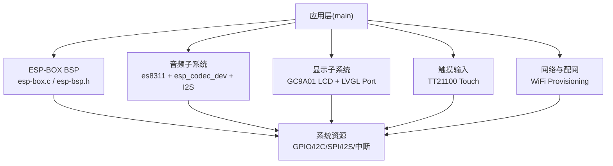
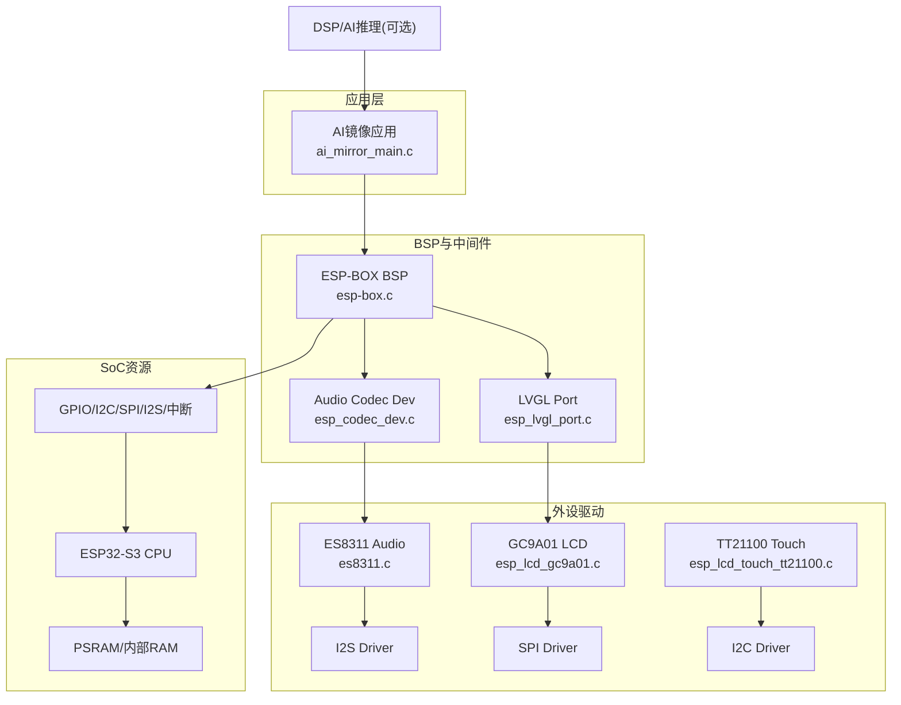
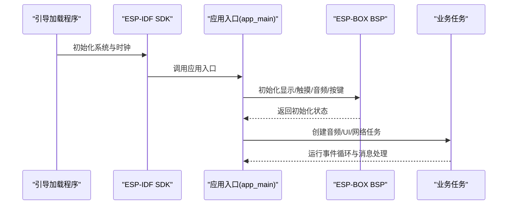
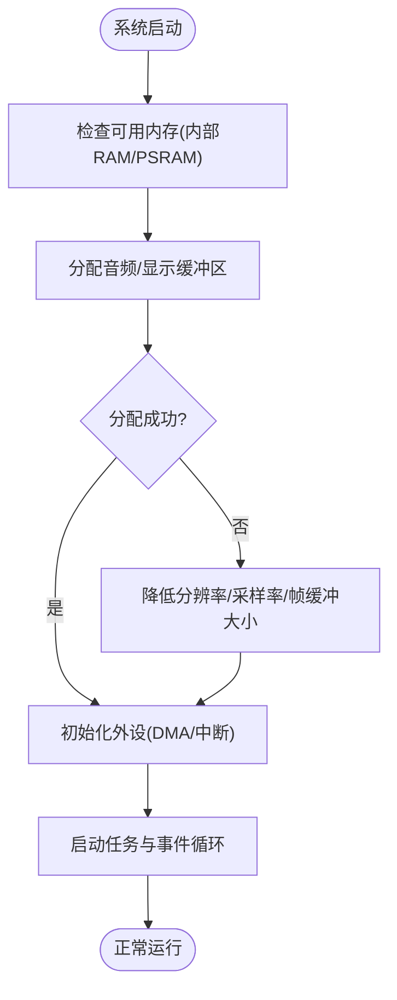
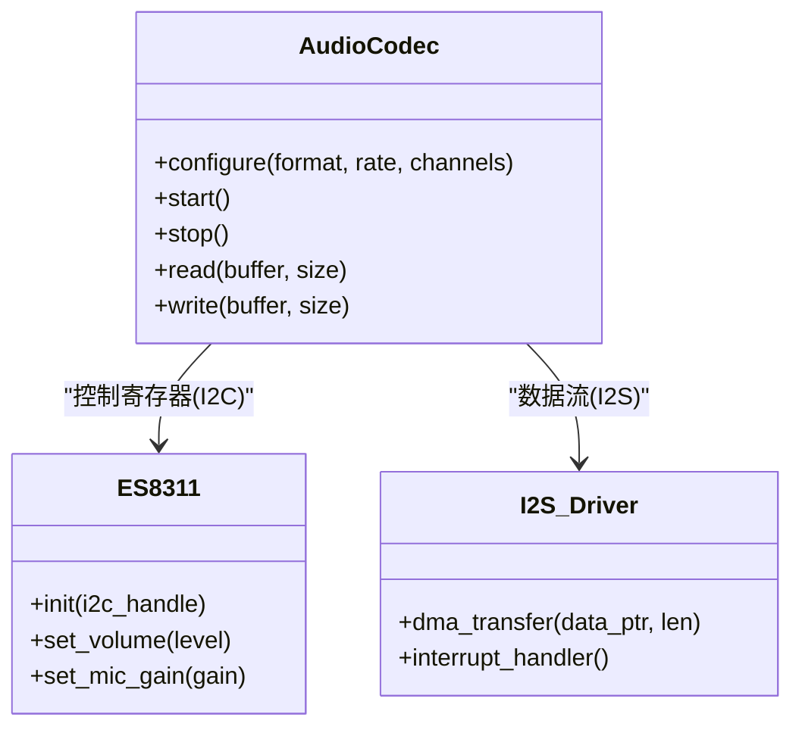
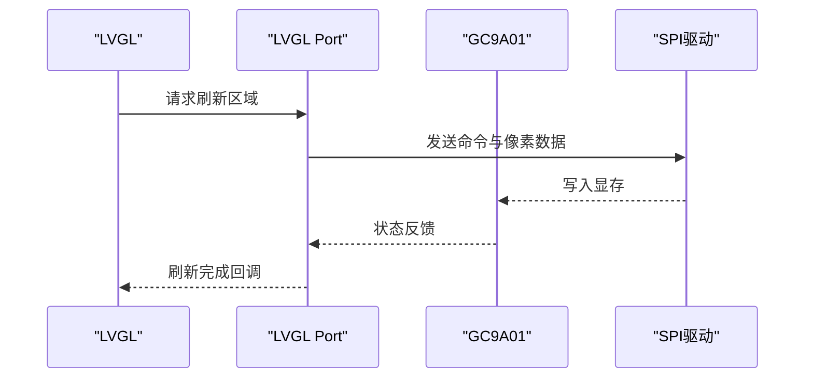
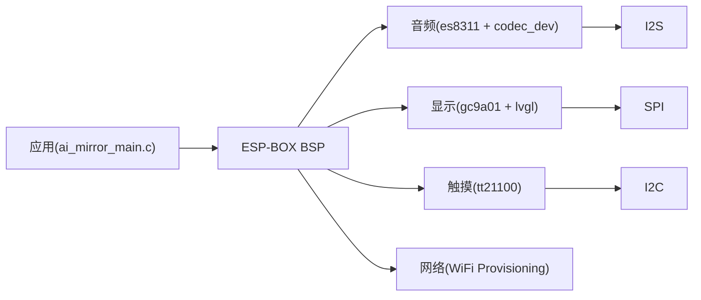

# 主控芯片

<cite>
**本文引用的文件**
- [CMakeLists.txt](file://Firmware/esp32_ai_mirror/CMakeLists.txt)
- [sdkconfig.defaults](file://Firmware/esp32_ai_mirror/sdkconfig.defaults)
- [partitions_n16r8.csv](file://Firmware/esp32_ai_mirror/partitions_n16r8.csv)
- [idf_component.yml](file://Firmware/esp32_ai_mirror/main/idf_component.yml)
- [ai_mirror_main.c](file://Firmware/esp32_ai_mirror/main/ai_mirror_main.c)
- [ai_mirror_config.h](file://Firmware/esp32_ai_mirror/main/ai_mirror_config.h)
- [board_buttons.c](file://Firmware/esp32_ai_mirror/main/board_buttons.c)
- [board_buttons.h](file://Firmware/esp32_ai_mirror/main/board_buttons.h)
- [board_rgb.c](file://Firmware/esp32_ai_mirror/main/board_rgb.c)
- [board_rgb.h](file://Firmware/esp32_ai_mirror/main/board_rgb.h)
- [board_wifi_prov.c](file://Firmware/esp32_ai_mirror/main/board_wifi_prov.c)
- [board_wifi_prov.h](file://Firmware/esp32_ai_mirror/main/board_wifi_prov.h)
- [esp-box.c](file://Firmware/esp32_ai_mirror/managed_components/espressif__esp-box/esp-box.c)
- [esp-bsp.h](file://Firmware/esp32_ai_mirror/managed_components/espressif__esp-box/include/bsp/esp-bsp.h)
- [display.h](file://Firmware/esp32_ai_mirror/managed_components/espressif__esp-box/include/bsp/display.h)
- [touch.h](file://Firmware/esp32_ai_mirror/managed_components/espressif__esp-box/include/bsp/touch.h)
- [es8311.c](file://Firmware/esp32_ai_mirror/managed_components/espressif__es8311/es8311.c)
- [es8311.h](file://Firmware/esp32_ai_mirror/managed_components/espressif__es8311/include/es8311.h)
- [esp_codec_dev.c](file://Firmware/esp32_ai_mirror/managed_components/espressif__esp_codec_dev/esp_codec_dev.c)
- [audio_codec_data_i2s.c](file://Firmware/esp32_ai_mirror/managed_components/espressif__esp_codec_dev/platform/audio_codec_data_i2s.c)
- [esp_lvgl_port.c](file://Firmware/esp32_ai_mirror/managed_components/espressif__esp_lvgl_port/esp_lvgl_port.c)
- [esp_lcd_gc9a01.c](file://Firmware/esp32_ai_mirror/managed_components/espressif__esp_lcd_gc9a01/esp_lcd_gc9a01.c)
- [esp_lcd_touch_tt21100.c](file://Firmware/esp32_ai_mirror/managed_components/espressif__esp_lcd_touch_tt21100/esp_lcd_touch_tt21100.c)
</cite>

## 目录
1. [简介](#简介)
2. [项目结构](#项目结构)
3. [核心组件](#核心组件)
4. [架构总览](#架构总览)
5. [详细组件分析](#详细组件分析)
6. [依赖关系分析](#依赖关系分析)
7. [性能考虑](#性能考虑)
8. [故障排查指南](#故障排查指南)
9. [结论](#结论)
10. [附录](#附录)

## 简介
本文件面向ESP32-S3主控芯片在该项目中的硬件特性、内存与时钟配置、引脚分配方案（GPIO、I2C、SPI、I2S等）、ESP-IDF框架配置与编译设置、启动流程、内存管理与任务调度机制，以及性能优化与功耗管理策略。同时说明与ESP-BOX BSP的集成方式与扩展接口，帮助开发者快速理解并高效开发基于ESP32-S3的智能交互设备。

## 项目结构
本项目采用ESP-IDF工程组织方式，核心应用位于main目录，外设驱动与BSP通过components与managed_components引入。关键目录与职责如下：
- main：应用入口、板级初始化、UI与网络配网逻辑
- components：第三方或自研组件（如语音识别、LCD驱动）
- managed_components：由ESP-IDF Component Manager管理的官方组件（ESP-BOX BSP、音频编解码、LVGL端口、LCD/Touch驱动等）
- 构建与分区：CMakeLists.txt、sdkconfig.defaults、partitions_n16r8.csv

图表来源
- [esp-box.c](file://Firmware/esp32_ai_mirror/managed_components/espressif__esp-box/esp-box.c)
- [esp-bsp.h](file://Firmware/esp32_ai_mirror/managed_components/espressif__esp-box/include/bsp/esp-bsp.h)
- [es8311.c](file://Firmware/esp32_ai_mirror/managed_components/espressif__es8311/es8311.c)
- [esp_codec_dev.c](file://Firmware/esp32_ai_mirror/managed_components/espressif__esp_codec_dev/esp_codec_dev.c)
- [audio_codec_data_i2s.c](file://Firmware/esp32_ai_mirror/managed_components/espressif__esp_codec_dev/platform/audio_codec_data_i2s.c)
- [esp_lcd_gc9a01.c](file://Firmware/esp32_ai_mirror/managed_components/espressif__esp_lcd_gc9a01/esp_lcd_gc9a01.c)
- [esp_lvgl_port.c](file://Firmware/esp32_ai_mirror/managed_components/espressif__esp_lvgl_port/esp_lvgl_port.c)
- [esp_lcd_touch_tt21100.c](file://Firmware/esp32_ai_mirror/managed_components/espressif__esp_lcd_touch_tt21100/esp_lcd_touch_tt21100.c)

章节来源
- [CMakeLists.txt](file://Firmware/esp32_ai_mirror/CMakeLists.txt)
- [sdkconfig.defaults](file://Firmware/esp32_ai_mirror/sdkconfig.defaults)
- [partitions_n16r8.csv](file://Firmware/esp32_ai_mirror/partitions_n16r8.csv)
- [idf_component.yml](file://Firmware/esp32_ai_mirror/main/idf_component.yml)

## 核心组件
- ESP-BOX BSP：封装ESP32-S3板级资源（显示、触摸、音频、按键、RGB LED），提供统一API供应用调用
- 音频子系统：ES8311音频编解码器 + esp_codec_dev抽象层 + I2S数据通路
- 显示子系统：GC9A01 SPI LCD + LVGL图形库 + esp_lvgl_port桥接
- 触摸子系统：TT21100 I2C触摸屏
- 网络与配网：WiFi Provisioning用于首次配网与参数持久化
- 应用主循环：任务划分、事件分发、UI刷新、音频采集/播放、模型推理

章节来源
- [esp-box.c](file://Firmware/esp32_ai_mirror/managed_components/espressif__esp-box/esp-box.c)
- [esp-bsp.h](file://Firmware/esp32_ai_mirror/managed_components/espressif__esp-box/include/bsp/esp-bsp.h)
- [es8311.c](file://Firmware/esp32_ai_mirror/managed_components/espressif__es8311/es8311.c)
- [esp_codec_dev.c](file://Firmware/esp32_ai_mirror/managed_components/espressif__esp_codec_dev/esp_codec_dev.c)
- [esp_lcd_gc9a01.c](file://Firmware/esp32_ai_mirror/managed_components/espressif__esp_lcd_gc9a01/esp_lcd_gc9a01.c)
- [esp_lvgl_port.c](file://Firmware/esp32_ai_mirror/managed_components/espressif__esp_lvgl_port/esp_lvgl_port.c)
- [esp_lcd_touch_tt21100.c](file://Firmware/esp32_ai_mirror/managed_components/espressif__esp_lcd_touch_tt21100/esp_lcd_touch_tt21100.c)

## 架构总览
下图展示从应用到硬件的层次结构与数据流：应用通过ESP-BOX BSP访问显示、触摸、音频；音频经I2S与ES8311通信；显示经SPI与GC9A01通信；触摸经I2C与TT21100通信；网络模块负责配网与OTA。

图表来源
- [ai_mirror_main.c](file://Firmware/esp32_ai_mirror/main/ai_mirror_main.c)
- [esp-box.c](file://Firmware/esp32_ai_mirror/managed_components/espressif__esp-box/esp-box.c)
- [esp_lvgl_port.c](file://Firmware/esp32_ai_mirror/managed_components/espressif__esp_lvgl_port/esp_lvgl_port.c)
- [esp_codec_dev.c](file://Firmware/esp32_ai_mirror/managed_components/espressif__esp_codec_dev/esp_codec_dev.c)
- [esp_lcd_gc9a01.c](file://Firmware/esp32_ai_mirror/managed_components/espressif__esp_lcd_gc9a01/esp_lcd_gc9a01.c)
- [esp_lcd_touch_tt21100.c](file://Firmware/esp32_ai_mirror/managed_components/espressif__esp_lcd_touch_tt21100/esp_lcd_touch_tt21100.c)
- [es8311.c](file://Firmware/esp32_ai_mirror/managed_components/espressif__es8311/es8311.c)

## 详细组件分析

### 启动流程与任务调度
- 启动路径：ESP-IDF引导加载程序完成ROM启动后进入SDK初始化，随后执行app_main（应用入口），进行BSP初始化、外设驱动初始化、网络与UI初始化，最后创建业务任务与事件循环
- 任务划分：建议将音频采集/播放、UI渲染、网络通信、模型推理分别放入独立任务，使用队列/信号量进行同步
- 中断与DMA：I2S、SPI、I2C尽量使用DMA传输，降低CPU占用；按键与触摸使用中断回调

图表来源
- [ai_mirror_main.c](file://Firmware/esp32_ai_mirror/main/ai_mirror_main.c)
- [esp-box.c](file://Firmware/esp32_ai_mirror/managed_components/espressif__esp-box/esp-box.c)

章节来源
- [ai_mirror_main.c](file://Firmware/esp32_ai_mirror/main/ai_mirror_main.c)
- [sdkconfig.defaults](file://Firmware/esp32_ai_mirror/sdkconfig.defaults)

### 内存管理与分区表
- 内存布局：内部SRAM与外部PSRAM协同，堆栈大小需根据任务复杂度调整；LVGL帧缓冲与音频缓冲区建议放置在PSRAM以降低内部RAM压力
- 分区表：根据Flash容量配置app、nvs、ota、spiffs等分区；确保模型与媒体资源分区足够大
- 动态分配：避免频繁malloc/free，建议使用对象池或静态分配；对高频路径进行内存对齐与缓存友好设计

图表来源
- [partitions_n16r8.csv](file://Firmware/esp32_ai_mirror/partitions_n16r8.csv)
- [sdkconfig.defaults](file://Firmware/esp32_ai_mirror/sdkconfig.defaults)

章节来源
- [partitions_n16r8.csv](file://Firmware/esp32_ai_mirror/partitions_n16r8.csv)
- [sdkconfig.defaults](file://Firmware/esp32_ai_mirror/sdkconfig.defaults)

### 时钟与性能配置
- 时钟源：启用Xtal与PLL，合理设置CPU频率与总线分频，平衡性能与功耗
- 指令/数据缓存：开启I/D Cache以提升代码与数据访问效率
- 协处理器：启用NEON或专用DSP加速音频与AI推理计算

章节来源
- [sdkconfig.defaults](file://Firmware/esp32_ai_mirror/sdkconfig.defaults)

### 引脚分配与接口使用
- GPIO：用于按键、LED控制、外设片选与复位
- I2C：连接ES8311寄存器控制、TT21100触摸控制器
- SPI：连接GC9A01 LCD面板，支持高速数据传输
- I2S：音频数据通路，连接ES8311的PCM/I2S接口
- 中断：按键与触摸中断，提升响应速度

章节来源
- [board_buttons.c](file://Firmware/esp32_ai_mirror/main/board_buttons.c)
- [board_buttons.h](file://Firmware/esp32_ai_mirror/main/board_buttons.h)
- [board_rgb.c](file://Firmware/esp32_ai_mirror/main/board_rgb.c)
- [board_rgb.h](file://Firmware/esp32_ai_mirror/main/board_rgb.h)
- [es8311.c](file://Firmware/esp32_ai_mirror/managed_components/espressif__es8311/es8311.c)
- [esp_lcd_gc9a01.c](file://Firmware/esp32_ai_mirror/managed_components/espressif__esp_lcd_gc9a01/esp_lcd_gc9a01.c)
- [esp_lcd_touch_tt21100.c](file://Firmware/esp32_ai_mirror/managed_components/espressif__esp_lcd_touch_tt21100/esp_lcd_touch_tt21100.c)

### 音频子系统（I2S + ES8311）
- 数据通路：I2S DMA传输音频样本至/从ES8311，esp_codec_dev提供统一的音频设备抽象
- 配置要点：采样率、位宽、通道数、时钟源与MCLK配置；AGC/NS/AEC参数调优
- 性能优化：双缓冲、环形缓冲区、低延迟路径；避免阻塞式API

图表来源
- [es8311.c](file://Firmware/esp32_ai_mirror/managed_components/espressif__es8311/es8311.c)
- [esp_codec_dev.c](file://Firmware/esp32_ai_mirror/managed_components/espressif__esp_codec_dev/esp_codec_dev.c)
- [audio_codec_data_i2s.c](file://Firmware/esp32_ai_mirror/managed_components/espressif__esp_codec_dev/platform/audio_codec_data_i2s.c)

章节来源
- [es8311.c](file://Firmware/esp32_ai_mirror/managed_components/espressif__es8311/es8311.c)
- [esp_codec_dev.c](file://Firmware/esp32_ai_mirror/managed_components/espressif__esp_codec_dev/esp_codec_dev.c)
- [audio_codec_data_i2s.c](file://Firmware/esp32_ai_mirror/managed_components/espressif__esp_codec_dev/platform/audio_codec_data_i2s.c)

### 显示子系统（SPI + GC9A01 + LVGL）
- 数据通路：SPI发送命令与像素数据至GC9A01，LVGL生成UI帧，esp_lvgl_port适配刷新
- 配置要点：分辨率、颜色深度、SPI时钟、DMA使能；双缓冲减少闪烁
- 性能优化：部分刷新、裁剪区域、异步绘制；字体与图片压缩存储

图表来源
- [esp_lvgl_port.c](file://Firmware/esp32_ai_mirror/managed_components/espressif__esp_lvgl_port/esp_lvgl_port.c)
- [esp_lcd_gc9a01.c](file://Firmware/esp32_ai_mirror/managed_components/espressif__esp_lcd_gc9a01/esp_lcd_gc9a01.c)

章节来源
- [esp_lvgl_port.c](file://Firmware/esp32_ai_mirror/managed_components/espressif__esp_lvgl_port/esp_lvgl_port.c)
- [esp_lcd_gc9a01.c](file://Firmware/esp32_ai_mirror/managed_components/espressif__esp_lcd_gc9a01/esp_lcd_gc9a01.c)

### 触摸子系统（I2C + TT21100）
- 数据通路：I2C读取触摸坐标与手势事件，上报至应用层
- 配置要点：I2C地址、采样率、去抖阈值；中断模式降低轮询开销
- 性能优化：事件过滤、多点触控处理、低功耗休眠唤醒

章节来源
- [esp_lcd_touch_tt21100.c](file://Firmware/esp32_ai_mirror/managed_components/espressif__esp_lcd_touch_tt21100/esp_lcd_touch_tt21100.c)

### 网络与配网（WiFi Provisioning）
- 功能：首次上电通过手机热点或二维码配置WiFi SSID/密码，持久化至NVS
- 流程：创建软AP/广播SSID -> 接收配网信息 -> 保存配置 -> 切换至STA模式联网
- 安全：WPA2加密，证书校验（可选）

章节来源
- [board_wifi_prov.c](file://Firmware/esp32_ai_mirror/main/board_wifi_prov.c)
- [board_wifi_prov.h](file://Firmware/esp32_ai_mirror/main/board_wifi_prov.h)

### 与ESP-BOX BSP的集成与扩展
- 集成方式：通过esp-box.c与esp-bsp.h提供的API初始化显示、触摸、音频、按键、RGB LED
- 扩展接口：新增外设时，在BSP中添加对应初始化函数与引脚映射，保持与应用解耦
- 兼容性：遵循ESP-IDF组件规范，便于跨平台移植

章节来源
- [esp-box.c](file://Firmware/esp32_ai_mirror/managed_components/espressif__esp-box/esp-box.c)
- [esp-bsp.h](file://Firmware/esp32_ai_mirror/managed_components/espressif__esp-box/include/bsp/esp-bsp.h)

## 依赖关系分析
- 组件耦合：应用依赖BSP，BSP依赖各外设驱动；音频与显示子系统相对独立
- 外部依赖：ESP-IDF核心库、LVGL、esp_codec_dev、es8311、gc9a01、tt21100
- 潜在循环：避免BSP与应用之间双向依赖，通过头文件与回调解耦

图表来源
- [ai_mirror_main.c](file://Firmware/esp32_ai_mirror/main/ai_mirror_main.c)
- [esp-box.c](file://Firmware/esp32_ai_mirror/managed_components/espressif__esp-box/esp-box.c)
- [es8311.c](file://Firmware/esp32_ai_mirror/managed_components/espressif__es8311/es8311.c)
- [esp_codec_dev.c](file://Firmware/esp32_ai_mirror/managed_components/espressif__esp_codec_dev/esp_codec_dev.c)
- [esp_lcd_gc9a01.c](file://Firmware/esp32_ai_mirror/managed_components/espressif__esp_lcd_gc9a01/esp_lcd_gc9a01.c)
- [esp_lvgl_port.c](file://Firmware/esp32_ai_mirror/managed_components/espressif__esp_lvgl_port/esp_lvgl_port.c)
- [esp_lcd_touch_tt21100.c](file://Firmware/esp32_ai_mirror/managed_components/espressif__esp_lcd_touch_tt21100/esp_lcd_touch_tt21100.c)

章节来源
- [idf_component.yml](file://Firmware/esp32_ai_mirror/main/idf_component.yml)

## 性能考虑
- 任务优先级：音频与UI高优先级，网络与推理低优先级，避免饥饿
- DMA与中断：I2S/SPI/I2C启用DMA，减少CPU负载；中断服务程序短小精悍
- 内存管理：预分配缓冲区，避免碎片；LVGL使用PSRAM存放帧缓冲
- 缓存与流水线：开启I/D Cache，利用NEON/DSP加速计算
- 显示优化：部分刷新、裁剪、异步绘制；字体与图片压缩
- 音频优化：双缓冲、低延迟路径、降噪与回声消除参数调优

## 故障排查指南
- 启动失败：检查分区表与sdkconfig配置；确认Flash容量与分区偏移
- 音频异常：验证I2S时钟与ES8311寄存器配置；检查DMA缓冲区大小与对齐
- 显示花屏：确认SPI时钟与GC9A01初始化序列；检查LVGL刷新区域与双缓冲
- 触摸无响应：检查I2C地址与上拉电阻；确认中断引脚配置
- 网络配网失败：查看NVS存储与WiFi配置；检查路由器兼容性与信号强度

章节来源
- [partitions_n16r8.csv](file://Firmware/esp32_ai_mirror/partitions_n16r8.csv)
- [sdkconfig.defaults](file://Firmware/esp32_ai_mirror/sdkconfig.defaults)
- [es8311.c](file://Firmware/esp32_ai_mirror/managed_components/espressif__es8311/es8311.c)
- [esp_lcd_gc9a01.c](file://Firmware/esp32_ai_mirror/managed_components/espressif__esp_lcd_gc9a01/esp_lcd_gc9a01.c)
- [esp_lcd_touch_tt21100.c](file://Firmware/esp32_ai_mirror/managed_components/espressif__esp_lcd_touch_tt21100/esp_lcd_touch_tt21100.c)

## 结论
本项目基于ESP32-S3构建了完整的智能交互系统，通过ESP-BOX BSP统一管理显示、触摸、音频与网络资源。合理的内存与任务设计、外设DMA与中断优化、以及LVGL与音频子系统的调优，确保了系统在性能与功耗之间的平衡。未来可进一步引入更多AI模型与传感器，扩展应用场景。

## 附录
- 构建与配置：参考CMakeLists.txt与sdkconfig.defaults进行编译选项与功能开关配置
- 分区表：根据Flash容量调整partitions_n16r8.csv，确保模型与媒体资源空间充足
- 组件管理：通过idf_component.yml管理第三方组件版本与依赖

章节来源
- [CMakeLists.txt](file://Firmware/esp32_ai_mirror/CMakeLists.txt)
- [sdkconfig.defaults](file://Firmware/esp32_ai_mirror/sdkconfig.defaults)
- [partitions_n16r8.csv](file://Firmware/esp32_ai_mirror/partitions_n16r8.csv)
- [idf_component.yml](file://Firmware/esp32_ai_mirror/main/idf_component.yml)