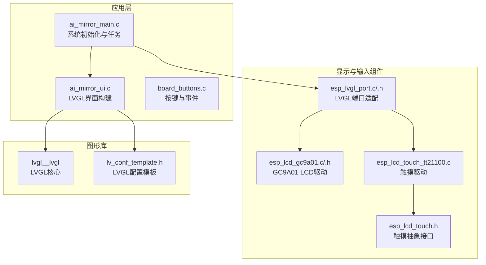
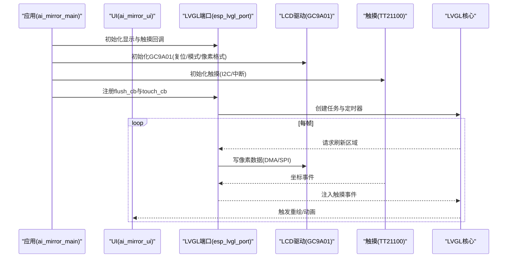
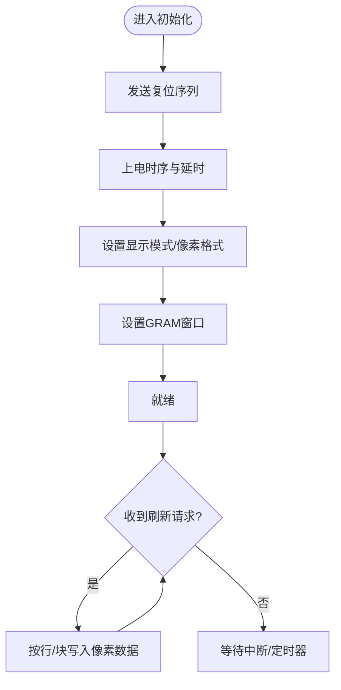
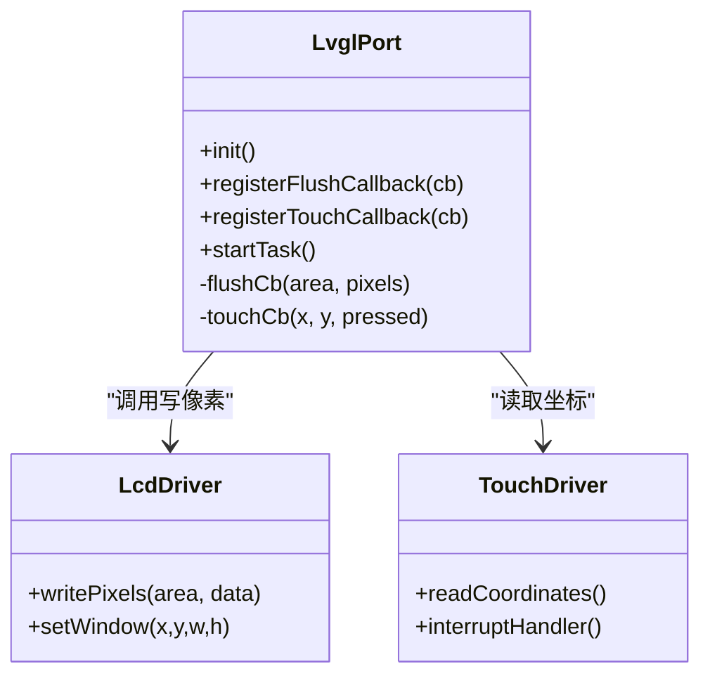
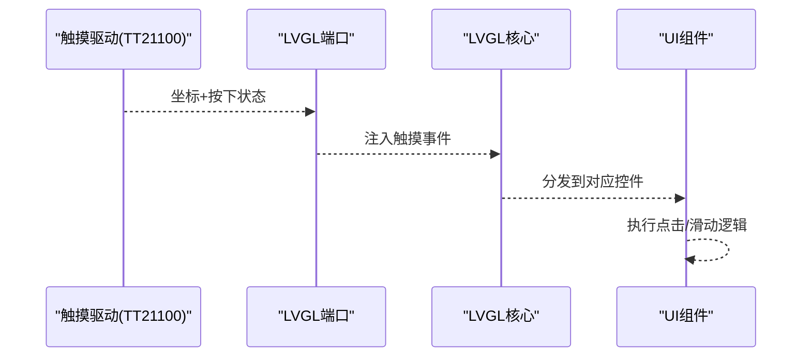
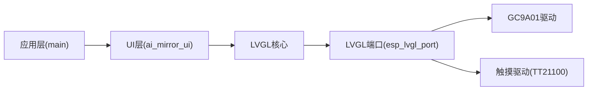

# 显示系统

<cite>
**本文档引用的文件**   
- [ai_mirror_main.c](file://Firmware/esp32_ai_mirror/main/ai_mirror_main.c)
- [ai_mirror_ui.c](file://Firmware/esp32_ai_mirror/main/ai_mirror_ui.c)
- [board_buttons.c](file://Firmware/esp32_ai_mirror/main/board_buttons.c)
- [board_buttons.h](file://Firmware/esp32_ai_mirror/main/board_buttons.h)
- [esp_lcd_gc9a01.c](file://Firmware/esp32_ai_mirror/components/espressif__esp-lcd_gc9a01/esp_lcd_gc9a01.c)
- [esp_lcd_gc9a01.h](file://Firmware/esp32_ai_mirror/components/espressif__esp-lcd_gc9a01/include/esp_lcd_gc9a01.h)
- [esp_lvgl_port.c](file://Firmware/esp32_ai_mirror/managed_components/espressif__esp_lvgl_port/esp_lvgl_port.c)
- [esp_lvgl_port.h](file://Firmware/esp32_ai_mirror/managed_components/espressif__esp_lvgl_port/include/esp_lvgl_port.h)
- [lv_conf_template.h](file://Firmware/esp32_ai_mirror/managed_components/lvgl__lvgl/lv_conf_template.h)
- [esp_lcd_touch_tt21100.c](file://Firmware/esp32_ai_mirror/managed_components/espressif__esp_lcd_touch_tt21100/esp_lcd_touch_tt21100.c)
- [esp_lcd_touch.h](file://Firmware/esp32_ai_mirror/managed_components/espressif__esp_lcd_touch/include/esp_lcd_touch.h)
- [sdkconfig.defaults](file://Firmware/esp32_ai_mirror/sdkconfig.defaults)
</cite>

## 目录
1. [简介](#简介)
2. [项目结构](#项目结构)
3. [核心组件](#核心组件)
4. [架构总览](#架构总览)
5. [详细组件分析](#详细组件分析)
6. [依赖关系分析](#依赖关系分析)
7. [性能考虑](#性能考虑)
8. [故障排查指南](#故障排查指南)
9. [结论](#结论)
10. [附录](#附录)

## 简介
本文件面向ESP32平台上的显示子系统，聚焦于GC9A01显示屏驱动、LVGL图形库集成与UI开发。内容涵盖：
- 屏幕初始化流程、像素格式与刷新机制
- LVGL端口适配、事件循环与渲染管线
- 触摸输入处理、手势识别与事件响应
- UI组件开发指南、图像资源管理与字体渲染
- 显示调试方法与常见问题解决方案

## 项目结构
本项目采用分层组织：
- 应用层（main）：负责系统初始化、LVGL UI构建、任务调度与事件分发
- 组件层（components/managed_components）：包含LCD驱动（GC9A01）、触摸驱动（TT21100）、LVGL端口适配与LVGL核心
- 配置层（sdkconfig.defaults等）：控制编译选项、内存分配、刷新策略与外设引脚

图表来源
- [ai_mirror_main.c](file://Firmware/esp32_ai_mirror/main/ai_mirror_main.c)
- [ai_mirror_ui.c](file://Firmware/esp32_ai_mirror/main/ai_mirror_ui.c)
- [esp_lcd_gc9a01.c](file://Firmware/esp32_ai_mirror/components/espressif__esp-lcd_gc9a01/esp_lcd_gc9a01.c)
- [esp_lvgl_port.c](file://Firmware/esp32_ai_mirror/managed_components/espressif__esp_lvgl_port/esp_lvgl_port.c)
- [esp_lcd_touch_tt21100.c](file://Firmware/esp32_ai_mirror/managed_components/espressif__esp_lcd_touch_tt21100/esp_lcd_touch_tt21100.c)
- [lv_conf_template.h](file://Firmware/esp32_ai_mirror/managed_components/lvgl__lvgl/lv_conf_template.h)

章节来源
- [ai_mirror_main.c](file://Firmware/esp32_ai_mirror/main/ai_mirror_main.c)
- [ai_mirror_ui.c](file://Firmware/esp32_ai_mirror/main/ai_mirror_ui.c)
- [sdkconfig.defaults](file://Firmware/esp32_ai_mirror/sdkconfig.defaults)

## 核心组件
- GC9A01 LCD驱动：提供底层寄存器配置、SPI/并行总线读写、帧缓冲与刷新命令序列
- LVGL端口适配：将LVGL的显示与触摸回调绑定到ESP-IDF的LCD与Touch驱动，管理刷新区与DMA传输
- LVGL核心：UI对象模型、布局、绘制、事件系统与动画
- 触摸驱动（TT21100）：I2C读取触点坐标，上报LVGL事件
- 应用层：初始化顺序、任务划分、UI构建与业务逻辑

章节来源
- [esp_lcd_gc9a01.c](file://Firmware/esp32_ai_mirror/components/espressif__esp-lcd_gc9a01/esp_lcd_gc9a01.c)
- [esp_lvgl_port.c](file://Firmware/esp32_ai_mirror/managed_components/espressif__esp_lvgl_port/esp_lvgl_port.c)
- [lv_conf_template.h](file://Firmware/esp32_ai_mirror/managed_components/lvgl__lvgl/lv_conf_template.h)
- [esp_lcd_touch_tt21100.c](file://Firmware/esp32_ai_mirror/managed_components/espressif__esp_lcd_touch_tt21100/esp_lcd_touch_tt21100.c)

## 架构总览
显示子系统的关键调用链如下：
- 启动阶段：系统初始化 → 初始化LCD驱动 → 初始化触摸驱动 → 初始化LVGL端口 → 创建LVGL任务
- 运行阶段：LVGL定时器驱动渲染 → 绘制缓冲区更新 → 通过LCD驱动刷新 → 触摸中断/轮询产生事件 → LVGL事件分发

图表来源
- [ai_mirror_main.c](file://Firmware/esp32_ai_mirror/main/ai_mirror_main.c)
- [ai_mirror_ui.c](file://Firmware/esp32_ai_mirror/main/ai_mirror_ui.c)
- [esp_lvgl_port.c](file://Firmware/esp32_ai_mirror/managed_components/espressif__esp_lvgl_port/esp_lvgl_port.c)
- [esp_lcd_gc9a01.c](file://Firmware/esp32_ai_mirror/components/espressif__esp-lcd_gc9a01/esp_lcd_gc9a01.c)
- [esp_lcd_touch_tt21100.c](file://Firmware/esp32_ai_mirror/managed_components/espressif__esp_lcd_touch_tt21100/esp_lcd_touch_tt21100.c)

## 详细组件分析

### GC9A01显示屏驱动
- 功能要点
  - 设备复位与初始化序列（电源、时钟、显示模式、伽马、像素格式）
  - 设置显示窗口与GRAM写入地址
  - 支持RGB565或RGB888像素格式（由LVGL配置决定）
  - 分块刷新（部分区域更新），降低带宽占用
- 关键接口
  - 初始化函数、写命令/数据、设置窗口、刷新回调
- 注意事项
  - SPI/并行总线时序与时钟配置需匹配硬件
  - 帧缓冲大小与DMA传输长度对齐
  - 刷新区域裁剪与边界检查

图表来源
- [esp_lcd_gc9a01.c](file://Firmware/esp32_ai_mirror/components/espressif__esp-lcd_gc9a01/esp_lcd_gc9a01.c)
- [esp_lcd_gc9a01.h](file://Firmware/esp32_ai_mirror/components/espressif__esp-lcd_gc9a01/include/esp_lcd_gc9a01.h)

章节来源
- [esp_lcd_gc9a01.c](file://Firmware/esp32_ai_mirror/components/espressif__esp-lcd_gc9a01/esp_lcd_gc9a01.c)
- [esp_lcd_gc9a01.h](file://Firmware/esp32_ai_mirror/components/espressif__esp-lcd_gc9a01/include/esp_lcd_gc9a01.h)

### LVGL端口适配与UI集成
- 功能要点
  - 将LVGL的显示刷新回调（flush_cb）绑定到LCD驱动的写像素接口
  - 将触摸输入回调（touch_cb）绑定到触摸驱动的事件上报
  - 管理LVGL任务、定时器与刷新区裁剪
- 关键接口
  - 初始化LVGL端口、注册显示与触摸回调、启动任务
- 像素格式与刷新
  - 根据LVGL配置选择RGB565/RGB888
  - 使用DMA加速传输，合理设置刷新区域以减少带宽

图表来源
- [esp_lvgl_port.c](file://Firmware/esp32_ai_mirror/managed_components/espressif__esp_lvgl_port/esp_lvgl_port.c)
- [esp_lvgl_port.h](file://Firmware/esp32_ai_mirror/managed_components/espressif__esp_lvgl_port/include/esp_lvgl_port.h)

章节来源
- [esp_lvgl_port.c](file://Firmware/esp32_ai_mirror/managed_components/espressif__esp_lvgl_port/esp_lvgl_port.c)
- [esp_lvgl_port.h](file://Firmware/esp32_ai_mirror/managed_components/espressif__esp_lvgl_port/include/esp_lvgl_port.h)

### 触摸输入处理与手势识别
- 触摸驱动（TT21100）
  - I2C读取触点坐标，支持多点触控
  - 中断或轮询方式获取事件
- LVGL事件注入
  - 将坐标与按下状态转换为LVGL触摸事件
  - 支持点击、滑动、长按等基本手势
- 应用层事件处理
  - 在UI中注册事件回调，实现交互逻辑

图表来源
- [esp_lcd_touch_tt21100.c](file://Firmware/esp32_ai_mirror/managed_components/espressif__esp_lcd_touch_tt21100/esp_lcd_touch_tt21100.c)
- [esp_lcd_touch.h](file://Firmware/esp32_ai_mirror/managed_components/espressif__esp_lcd_touch/include/esp_lcd_touch.h)
- [esp_lvgl_port.c](file://Firmware/esp32_ai_mirror/managed_components/espressif__esp_lvgl_port/esp_lvgl_port.c)

章节来源
- [esp_lcd_touch_tt21100.c](file://Firmware/esp32_ai_mirror/managed_components/espressif__esp_lcd_touch_tt21100/esp_lcd_touch_tt21100.c)
- [esp_lcd_touch.h](file://Firmware/esp32_ai_mirror/managed_components/espressif__esp_lcd_touch/include/esp_lcd_touch.h)

### 屏幕初始化、像素格式与刷新机制
- 初始化顺序
  - 初始化GPIO与外设时钟
  - 初始化GC9A01（复位、模式、像素格式）
  - 初始化触摸驱动（I2C、中断）
  - 初始化LVGL端口并注册回调
  - 创建LVGL任务与定时器
- 像素格式
  - RGB565（常用，节省带宽）或RGB888（色彩更丰富）
  - 与LVGL配置一致，避免颜色失真
- 刷新机制
  - 分块刷新（仅更新变化区域）
  - DMA传输优化，减少CPU占用
  - 刷新频率与任务优先级调优

章节来源
- [ai_mirror_main.c](file://Firmware/esp32_ai_mirror/main/ai_mirror_main.c)
- [ai_mirror_ui.c](file://Firmware/esp32_ai_mirror/main/ai_mirror_ui.c)
- [lv_conf_template.h](file://Firmware/esp32_ai_mirror/managed_components/lvgl__lvgl/lv_conf_template.h)

### UI组件开发与事件响应
- 组件构建
  - 使用LVGL提供的按钮、标签、进度条、列表等基础控件
  - 通过布局管理器（Flex/Grid）组织界面
- 事件处理
  - 注册控件事件回调（点击、滚动、焦点变化）
  - 结合触摸事件实现复杂交互
- 主题与样式
  - 定义全局样式与局部覆盖
  - 动态切换主题（明暗模式）

章节来源
- [ai_mirror_ui.c](file://Firmware/esp32_ai_mirror/main/ai_mirror_ui.c)

### 图像资源管理与字体渲染
- 图像资源
  - 静态图片以C数组形式嵌入（适合小图标）
  - 大图片建议外部存储（SPI Flash/SD卡）按需加载
  - 压缩格式（如SJPG）可减少Flash占用
- 字体渲染
  - 内置字体与自定义字体（ttf转二进制）
  - 多语言字体打包，按需启用字符集
  - 字体缓存与抗锯齿开关影响性能

章节来源
- [lv_conf_template.h](file://Firmware/esp32_ai_mirror/managed_components/lvgl__lvgl/lv_conf_template.h)

## 依赖关系分析
- 组件耦合
  - LVGL端口依赖LCD与触摸驱动
  - UI层依赖LVGL核心与端口适配
  - 应用层协调各模块初始化与任务调度
- 外部依赖
  - ESP-IDF外设（SPI/I2C/GPIO）
  - LVGL配置与示例代码

图表来源
- [ai_mirror_main.c](file://Firmware/esp32_ai_mirror/main/ai_mirror_main.c)
- [ai_mirror_ui.c](file://Firmware/esp32_ai_mirror/main/ai_mirror_ui.c)
- [esp_lvgl_port.c](file://Firmware/esp32_ai_mirror/managed_components/espressif__esp_lvgl_port/esp_lvgl_port.c)
- [esp_lcd_gc9a01.c](file://Firmware/esp32_ai_mirror/components/espressif__esp-lcd_gc9a01/esp_lcd_gc9a01.c)
- [esp_lcd_touch_tt21100.c](file://Firmware/esp32_ai_mirror/managed_components/espressif__esp_lcd_touch_tt21100/esp_lcd_touch_tt21100.c)

章节来源
- [ai_mirror_main.c](file://Firmware/esp32_ai_mirror/main/ai_mirror_main.c)
- [ai_mirror_ui.c](file://Firmware/esp32_ai_mirror/main/ai_mirror_ui.c)
- [esp_lvgl_port.c](file://Firmware/esp32_ai_mirror/managed_components/espressif__esp_lvgl_port/esp_lvgl_port.c)

## 性能考虑
- 刷新优化
  - 启用分块刷新，避免全屏刷新
  - 调整刷新区域裁剪阈值，减少无效传输
- 内存管理
  - 合理设置LVGL缓冲区大小与数量
  - 使用外部存储加载大图，避免堆碎片
- 传输加速
  - 启用DMA传输，提高SPI/并行总线吞吐
  - 批量写入像素数据，减少命令开销
- 任务调度
  - 提升LVGL任务优先级，保证流畅度
  - 分离UI渲染与业务逻辑任务

[本节为通用指导，不直接分析具体文件]

## 故障排查指南
- 屏幕无显示
  - 检查复位与初始化序列是否完整
  - 确认像素格式与LVGL配置一致
  - 验证SPI/并行总线引脚与时钟配置
- 花屏或颜色异常
  - 检查像素格式（RGB565/RGB888）与端序
  - 确认GRAM窗口设置正确
- 触摸无响应
  - 检查I2C通信与中断引脚
  - 确认触摸驱动初始化成功
- 卡顿或掉帧
  - 增大LVGL缓冲区或启用双缓冲
  - 减少一次性绘制区域，启用增量刷新
  - 优化图片加载与字体缓存

章节来源
- [esp_lcd_gc9a01.c](file://Firmware/esp32_ai_mirror/components/espressif__esp-lcd_gc9a01/esp_lcd_gc9a01.c)
- [esp_lvgl_port.c](file://Firmware/esp32_ai_mirror/managed_components/espressif__esp_lvgl_port/esp_lvgl_port.c)
- [esp_lcd_touch_tt21100.c](file://Firmware/esp32_ai_mirror/managed_components/espressif__esp_lcd_touch_tt21100/esp_lcd_touch_tt21100.c)

## 结论
本显示系统基于ESP32平台，采用GC9A01驱动与LVGL图形库，实现了高效的屏幕刷新与丰富的UI交互。通过合理的初始化流程、像素格式配置与刷新机制优化，结合触摸输入与事件处理，可构建流畅的用户界面。建议在资源受限场景下，优先优化内存与传输路径，确保稳定与性能。

[本节为总结性内容，不直接分析具体文件]

## 附录
- 参考配置
  - LVGL配置模板：用于调整缓冲区、字体、图片解码与性能选项
  - SDK默认配置：控制外设引脚、任务栈与编译选项
- 调试技巧
  - 打印LVGL统计信息（FPS、内存使用）
  - 使用逻辑分析仪抓取SPI/I2C波形
  - 逐步注释初始化步骤定位问题

章节来源
- [lv_conf_template.h](file://Firmware/esp32_ai_mirror/managed_components/lvgl__lvgl/lv_conf_template.h)
- [sdkconfig.defaults](file://Firmware/esp32_ai_mirror/sdkconfig.defaults)