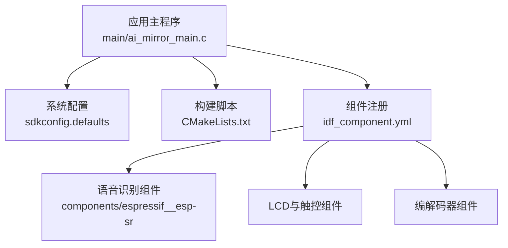
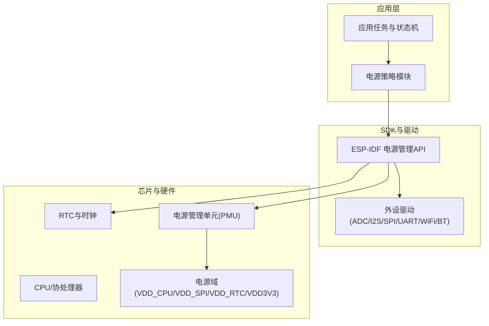
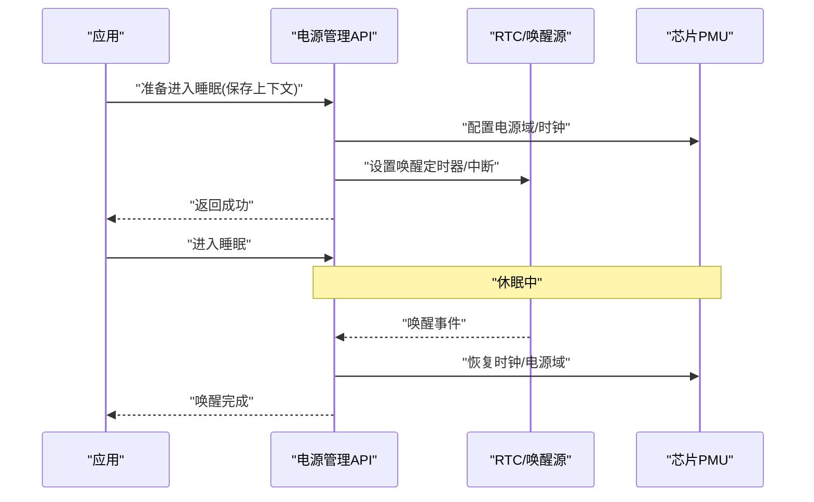
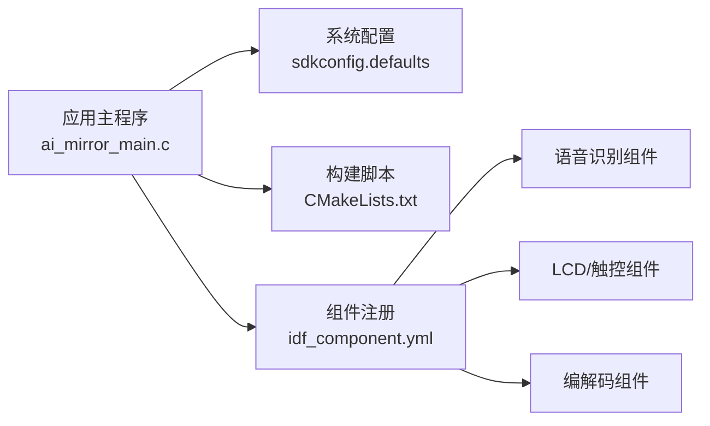

# 电源管理

<cite>
**本文引用的文件**   
- [ai_mirror_main.c](file://Firmware/esp32_ai_mirror/main/ai_mirror_main.c)
- [sdkconfig.defaults](file://Firmware/esp32_ai_mirror/sdkconfig.defaults)
- [CMakeLists.txt](file://Firmware/esp32_ai_mirror/CMakeLists.txt)
- [idf_component.yml](file://Firmware/esp32_ai_mirror/components/espressif__esp-sr/idf_component.yml)
- [README.md](file://Firmware/esp32_ai_mirror/README.md)
</cite>

## 目录
1. [简介](#简介)
2. [项目结构](#项目结构)
3. [核心组件](#核心组件)
4. [架构总览](#架构总览)
5. [详细组件分析](#详细组件分析)
6. [依赖关系分析](#依赖关系分析)
7. [性能与功耗考量](#性能与功耗考量)
8. [故障排查指南](#故障排查指南)
9. [结论](#结论)
10. [附录](#附录)

## 简介
本文件面向ESP32-S3平台的电源管理，结合本仓库的固件工程结构，系统性阐述：
- ESP32-S3的电源架构与电压域配置要点
- 低功耗模式（Light Sleep、Deep Sleep、Modem Sleep）的启用与切换机制
- 外设电源控制与动态频率调节策略
- 电池供电优化与能耗监控方法
- 睡眠唤醒策略与定时器配置
- 电源完整性设计与EMI防护建议
- 功耗测试方法与节能优化建议

说明：本仓库为AI镜像应用工程，包含语音识别、音频编解码、显示与触控等子系统。电源管理既涉及ESP-IDF底层能力，也与应用层任务调度、外设使用密切相关。本文在给出通用ESP32-S3电源知识的同时，尽量将内容映射到本工程的实际组织方式与可配置项。

## 项目结构
本工程采用ESP-IDF标准工程结构，关键目录与文件如下：
- main：应用主入口与板级功能（按钮、RGB、WiFi配网等）
- components：第三方或厂商组件（如esp-sr语音识别、LCD驱动、编解码器等）
- sdkconfig.defaults：默认构建配置，包含大量系统选项（含部分电源相关开关）
- CMakeLists.txt：顶层构建脚本，声明组件与链接顺序
- idf_component.yml：组件注册与版本约束

图表来源
- [ai_mirror_main.c](file://Firmware/esp32_ai_mirror/main/ai_mirror_main.c)
- [sdkconfig.defaults](file://Firmware/esp32_ai_mirror/sdkconfig.defaults)
- [CMakeLists.txt](file://Firmware/esp32_ai_mirror/CMakeLists.txt)
- [idf_component.yml](file://Firmware/esp32_ai_mirror/components/espressif__esp-sr/idf_component.yml)

章节来源
- [README.md](file://Firmware/esp32_ai_mirror/README.md)
- [CMakeLists.txt](file://Firmware/esp32_ai_mirror/CMakeLists.txt)
- [sdkconfig.defaults](file://Firmware/esp32_ai_mirror/sdkconfig.defaults)

## 核心组件
- 应用主循环与任务调度：负责业务逻辑与外设协同，是触发低功耗与唤醒的关键入口
- 系统配置（sdkconfig）：集中管理编译期电源相关选项（如CPU频率、Wi-Fi/BT功耗模式、调试输出影响等）
- 组件体系：语音识别、音频编解码、显示与触控等组件在运行时会显著影响功耗，需配合电源策略进行启停与降频

章节来源
- [ai_mirror_main.c](file://Firmware/esp32_ai_mirror/main/ai_mirror_main.c)
- [sdkconfig.defaults](file://Firmware/esp32_ai_mirror/sdkconfig.defaults)

## 架构总览
ESP32-S3的电源管理由“硬件电源域 + 芯片内部PMU + SDK电源API + 应用策略”四层构成：
- 硬件电源域：VDD_CPU、VDD_SPI、VDD_RTC、VDD3V3等，各域可独立关断或降压
- PMU与时钟树：支持Modem/Light/Deep Sleep，提供RTC时钟、Wakeup源管理
- SDK电源API：提供进入/退出睡眠、外设电源门控、频率切换接口
- 应用策略：根据任务状态机决定何时降频、关闭外设、进入何种睡眠模式

图表来源
- [ai_mirror_main.c](file://Firmware/esp32_ai_mirror/main/ai_mirror_main.c)
- [sdkconfig.defaults](file://Firmware/esp32_ai_mirror/sdkconfig.defaults)

## 详细组件分析

### 电源架构与电压域配置
- 典型电压域
  - VDD_CPU：CPU与主要数字逻辑供电
  - VDD_SPI：外部Flash/QSPI供电
  - VDD_RTC：RTC与低功耗区域供电
  - VDD3V3：系统3.3V域（I/O、外设）
- 配置要点
  - 通过PMU与电源域控制器协调各域上电/断电时序
  - 合理设置LDO/DCDC工作模式，平衡效率与噪声
  - 对不活跃的外设域（如VDD_SPI）可在空闲时关闭以降低静态功耗

章节来源
- [sdkconfig.defaults](file://Firmware/esp32_ai_mirror/sdkconfig.defaults)

### 低功耗模式启用与切换
- 支持的睡眠模式
  - Modem Sleep：关闭射频，保留CPU与必要外设
  - Light Sleep：降低CPU频率，关闭非必要总线，保留RTC与唤醒源
  - Deep Sleep：仅保留RTC与少量唤醒源，RAM可选保持
- 切换流程（概念性序列图）

章节来源
- [sdkconfig.defaults](file://Firmware/esp32_ai_mirror/sdkconfig.defaults)

### 外设电源控制与动态频率调节
- 外设电源门控
  - 对闲置外设（如I2S、SPI、I2C、UART）调用对应驱动提供的电源关闭接口
  - 关闭DMA与中断，避免后台唤醒
- 动态频率调节
  - 根据负载选择CPU频率档位（如高频处理突发任务，低频维持待机）
  - 结合Modem/Light Sleep实现“短时高频+长时低耗”的策略

章节来源
- [sdkconfig.defaults](file://Firmware/esp32_ai_mirror/sdkconfig.defaults)

### 电池供电优化与能耗监控
- 电池侧优化
  - 选择合适的LDO/DCDC方案，提高轻载效率
  - 限制峰值电流，避免电池压降导致复位
- 能耗监控
  - 利用ESP32-S3内置的电流测量通道（如通过ADC采样分压电阻）估算功耗
  - 统计不同模式的平均电流与占空比，建立功耗模型

章节来源
- [sdkconfig.defaults](file://Firmware/esp32_ai_mirror/sdkconfig.defaults)

### 睡眠唤醒策略与定时器配置
- 唤醒源选择
  - 定时器（RTC Timer）、GPIO、触摸、UART、I2C、Wi-Fi/BT事件等
- 策略建议
  - 短周期轮询：使用RTC定时器周期性唤醒执行轻量任务
  - 事件驱动：仅在必要时唤醒，减少无效唤醒
  - 组合唤醒：多源优先级排序，确保关键事件不被忽略

章节来源
- [sdkconfig.defaults](file://Firmware/esp32_ai_mirror/sdkconfig.defaults)

### 电源完整性设计与EMI防护
- 电源完整性
  - 去耦电容布局靠近IC引脚，分层走线保证回流路径最短
  - 区分模拟/数字地，单点接地避免地弹
- EMI防护
  - 控制信号边沿速率，必要时加串联电阻
  - 屏蔽敏感天线与RF走线，避免与高速数字线平行
  - 合理选择开关频率，避开敏感频段

章节来源
- [sdkconfig.defaults](file://Firmware/esp32_ai_mirror/sdkconfig.defaults)

### 功耗测试方法与节能优化建议
- 测试方法
  - 使用高精度电流表/功率分析仪记录不同模式下的电流曲线
  - 分段统计：启动、运行、空闲、睡眠各阶段功耗
- 优化建议
  - 减少不必要的打印与日志
  - 批量处理数据，缩短高功耗状态持续时间
  - 合理分配任务优先级，避免长时间占用CPU

章节来源
- [sdkconfig.defaults](file://Firmware/esp32_ai_mirror/sdkconfig.defaults)

## 依赖关系分析
- 应用主程序依赖系统配置与组件注册
- 组件间通过ESP-IDF框架与驱动接口交互
- 电源策略贯穿应用、驱动与SDK三层

图表来源
- [ai_mirror_main.c](file://Firmware/esp32_ai_mirror/main/ai_mirror_main.c)
- [sdkconfig.defaults](file://Firmware/esp32_ai_mirror/sdkconfig.defaults)
- [CMakeLists.txt](file://Firmware/esp32_ai_mirror/CMakeLists.txt)
- [idf_component.yml](file://Firmware/esp32_ai_mirror/components/espressif__esp-sr/idf_component.yml)

章节来源
- [idf_component.yml](file://Firmware/esp32_ai_mirror/components/espressif__esp-sr/idf_component.yml)
- [CMakeLists.txt](file://Firmware/esp32_ai_mirror/CMakeLists.txt)

## 性能与功耗考量
- 性能优先场景：提升CPU频率、开启更多外设并行处理，但会增加瞬时功耗
- 功耗优先场景：降低频率、关闭外设、进入更深睡眠，延长续航
- 折中策略：基于任务负载自适应调整频率与睡眠深度，结合事件驱动唤醒

[本节为通用指导，不直接分析具体文件]

## 故障排查指南
- 无法进入睡眠
  - 检查是否有未关闭的中断或外设活动
  - 确认唤醒源已正确配置且未被禁用
- 唤醒后异常
  - 检查上下文保存/恢复是否完整
  - 验证电源域与时钟恢复顺序
- 功耗偏高
  - 定位持续运行的任务或外设
  - 检查调试输出与日志级别

[本节为通用指导，不直接分析具体文件]

## 结论
ESP32-S3的电源管理需要软硬件协同：硬件层面保证电源完整性与EMI合规，软件层面通过SDK电源API与应用策略实现精细化的功耗控制。在本工程中，应结合语音识别、音频编解码与显示等子系统的特性，制定合理的频率与睡眠策略，并通过系统化测试不断优化。

[本节为总结性内容，不直接分析具体文件]

## 附录
- 术语
  - 电源域：芯片内按功能划分的供电区域
  - PMU：电源管理单元，负责电源与时钟控制
  - 睡眠模式：芯片低功耗运行状态的分类
- 参考
  - ESP-IDF电源管理与低功耗文档
  - ESP32-S3技术参考手册

[本节为补充信息，不直接分析具体文件]