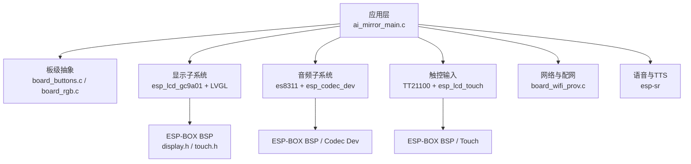
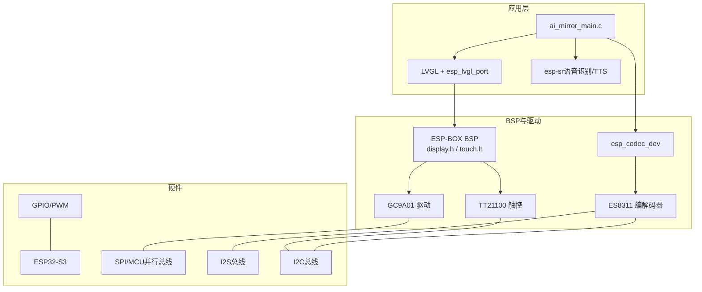
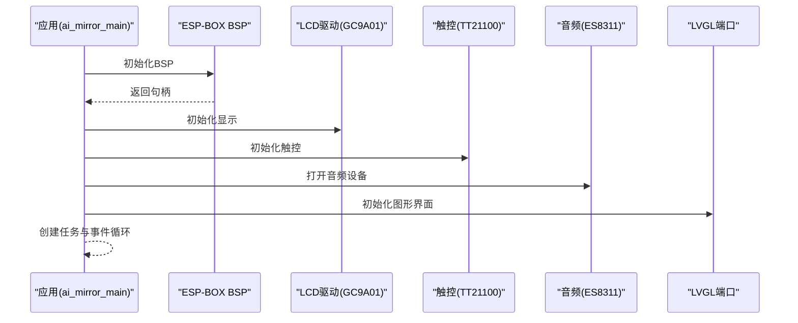
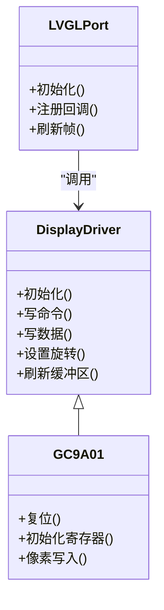
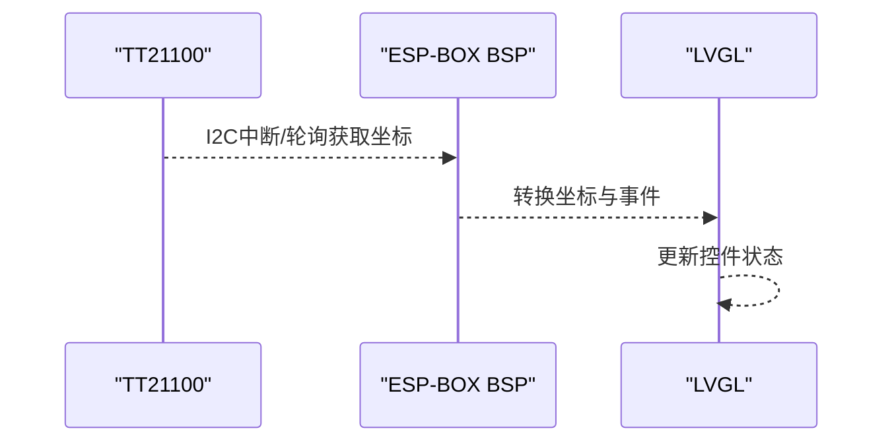
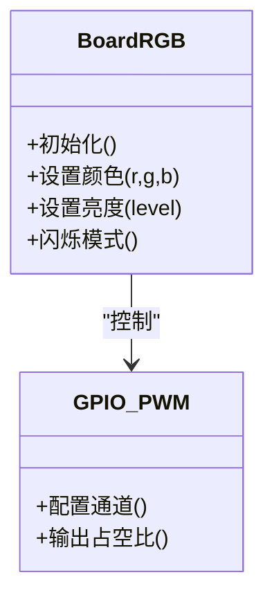
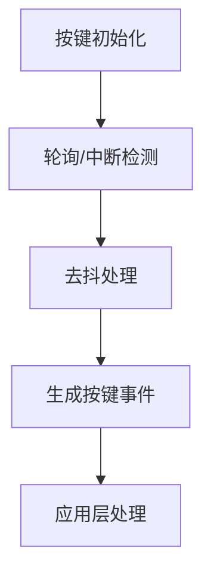
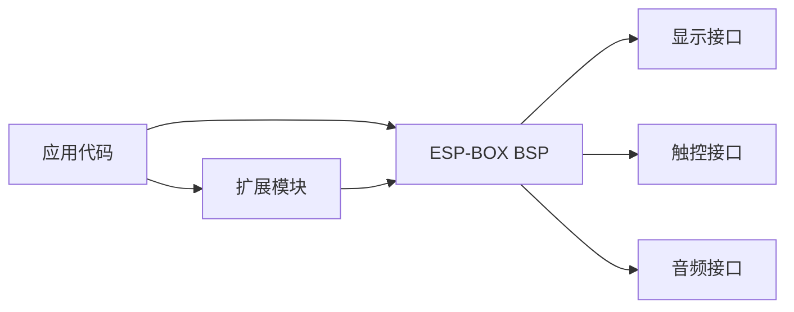
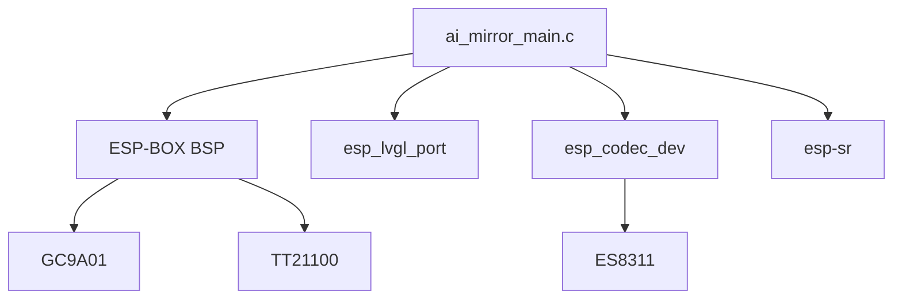

# 硬件架构

<cite>
**本文引用的文件**   
- [README.md](file://README.md)
- [CMakeLists.txt](file://Firmware/esp32_ai_mirror/CMakeLists.txt)
- [sdkconfig.defaults](file://Firmware/esp32_ai_mirror/sdkconfig.defaults)
- [ai_mirror_main.c](file://Firmware/esp32_ai_mirror/main/ai_mirror_main.c)
- [ai_mirror_config.h](file://Firmware/esp32_ai_mirror/main/ai_mirror_config.h)
- [board_buttons.c](file://Firmware/esp32_ai_mirror/main/board_buttons.c)
- [board_buttons.h](file://Firmware/esp32_ai_mirror/main/board_buttons.h)
- [board_rgb.c](file://Firmware/esp32_ai_mirror/main/board_rgb.c)
- [board_rgb.h](file://Firmware/esp32_ai_mirror/main/board_rgb.h)
- [idf_component.yml](file://Firmware/esp32_ai_mirror/main/idf_component.yml)
- [esp-box.c](file://Firmware/esp32_ai_mirror/managed_components/espressif__esp-box/esp-box.c)
- [display.h](file://Firmware/esp32_ai_mirror/managed_components/espressif__esp-box/include/bsp/display.h)
- [touch.h](file://Firmware/esp32_ai_mirror/managed_components/espressif__esp-box/include/bsp/touch.h)
- [es8311.c](file://Firmware/esp32_ai_mirror/managed_components/espressif__es8311/es8311.c)
- [es8311.h](file://Firmware/esp32_ai_mirror/managed_components/espressif__es8311/include/es8311.h)
- [esp_codec_dev.c](file://Firmware/esp32_ai_mirror/managed_components/espressif__esp_codec_dev/esp_codec_dev.c)
- [codec_dev_mirror.c](file://Firmware/esp32_ai_mirror/managed_components/espressif__esp_codec_dev/codec_dev_mirror.c)
- [esp_lcd_touch_tt21100.c](file://Firmware/esp32_ai_mirror/managed_components/espressif__esp_lcd_touch_tt21100/esp_lcd_touch_tt21100.c)
- [esp_lvgl_port.c](file://Firmware/esp32_ai_mirror/managed_components/espressif__esp_lvgl_port/esp_lvgl_port.c)
- [esp-sr CMakeLists.txt](file://Firmware/esp32_ai_mirror/components/espressif__esp-sr/CMakeLists.txt)
</cite>

## 目录
1. [简介](#简介)
2. [项目结构](#项目结构)
3. [核心组件](#核心组件)
4. [架构总览](#架构总览)
5. [详细组件分析](#详细组件分析)
6. [依赖关系分析](#依赖关系分析)
7. [性能与功耗考量](#性能与功耗考量)
8. [故障排查指南](#故障排查指南)
9. [结论](#结论)
10. [附录](#附录)

## 简介
本文件面向AI镜子硬件架构，围绕基于ESP32-S3的主控制器，系统性地阐述显示屏、音频子系统、触摸输入与LED指示器的电路连接方式、模块规格参数、引脚分配与电气特性；同时给出电源管理设计思路、功耗优化策略、PCB布局要点与硬件调试接口建议。文档还总结了硬件选型理由与技术规格对比，并说明与ESP-BOX BSP的集成方式和扩展能力，帮助读者快速理解与落地该硬件方案。

## 项目结构
本项目采用ESP-IDF工程组织，应用代码位于main目录，外设驱动与中间件通过components与managed_components引入，构建配置由CMakeLists与sdkconfig.defaults统一管理。关键目录与职责如下：
- main：应用入口、板级抽象（按钮、RGB）、WiFi配网、UI初始化与业务逻辑
- managed_components：ESP-BOX BSP、LVGL端口、LCD触控驱动、音频编解码器驱动等
- components：语音识别与TTS相关组件（esp-sr）
- 构建与配置：CMakeLists.txt、sdkconfig.defaults、idf_component.yml、分区表等



图表来源
- [ai_mirror_main.c:1-200](file://Firmware/esp32_ai_mirror/main/ai_mirror_main.c#L1-L200)
- [board_buttons.c:1-120](file://Firmware/esp32_ai_mirror/main/board_buttons.c#L1-L120)
- [board_rgb.c:1-120](file://Firmware/esp32_ai_mirror/main/board_rgb.c#L1-L120)
- [display.h:1-120](file://Firmware/esp32_ai_mirror/managed_components/espressif__esp-box/include/bsp/display.h#L1-L120)
- [touch.h:1-120](file://Firmware/esp32_ai_mirror/managed_components/espressif__esp-box/include/bsp/touch.h#L1-L120)
- [es8311.c:1-200](file://Firmware/esp32_ai_mirror/managed_components/espressif__es8311/es8311.c#L1-L200)
- [esp_codec_dev.c:1-200](file://Firmware/esp32_ai_mirror/managed_components/espressif__esp_codec_dev/esp_codec_dev.c#L1-L200)
- [esp_lcd_touch_tt21100.c:1-200](file://Firmware/esp32_ai_mirror/managed_components/espressif__esp_lcd_touch_tt21100/esp_lcd_touch_tt21100.c#L1-L200)
- [esp_lvgl_port.c:1-200](file://Firmware/esp32_ai_mirror/managed_components/espressif__esp_lvgl_port/esp_lvgl_port.c#L1-L200)

章节来源
- [CMakeLists.txt:1-120](file://Firmware/esp32_ai_mirror/CMakeLists.txt#L1-L120)
- [sdkconfig.defaults:1-200](file://Firmware/esp32_ai_mirror/sdkconfig.defaults#L1-L200)
- [idf_component.yml:1-120](file://Firmware/esp32_ai_mirror/main/idf_component.yml#L1-L120)

## 核心组件
- 主控制器：ESP32-S3（双核RISC-V，支持Wi-Fi/BLE，丰富的I/O与高速外设）
- 显示屏：GC9A01驱动的IPS屏（典型240x240或更高），通过SPI或MCU并行接口与ESP32-S3连接
- 音频子系统：ES8311编解码器（I2S数据+I2C控制），用于麦克风采集与扬声器播放
- 触摸输入：TT21100电容式触控IC（I2C），提供多点触控事件
- LED指示器：板载RGB LED（GPIO PWM控制），用于状态指示与交互反馈
- 电源管理：LDO/DC-DC降压与上电时序控制，保证各模块稳定供电与低功耗运行

章节来源
- [ai_mirror_config.h:1-120](file://Firmware/esp32_ai_mirror/main/ai_mirror_config.h#L1-L120)
- [display.h:1-120](file://Firmware/esp32_ai_mirror/managed_components/espressif__esp-box/include/bsp/display.h#L1-L120)
- [touch.h:1-120](file://Firmware/esp32_ai_mirror/managed_components/espressif__esp-box/include/bsp/touch.h#L1-L120)
- [es8311.h:1-120](file://Firmware/esp32_ai_mirror/managed_components/espressif__es8311/include/es8311.h#L1-L120)
- [esp_codec_dev.c:1-200](file://Firmware/esp32_ai_mirror/managed_components/espressif__esp_codec_dev/esp_codec_dev.c#L1-L200)
- [esp_lcd_touch_tt21100.c:1-200](file://Firmware/esp32_ai_mirror/managed_components/espressif__esp_lcd_touch_tt21100/esp_lcd_touch_tt21100.c#L1-L200)
- [board_rgb.c:1-120](file://Firmware/esp32_ai_mirror/main/board_rgb.c#L1-L120)

## 架构总览
下图展示AI镜子的系统架构与数据流：应用层通过ESP-BOX BSP统一抽象访问显示、触控与音频；LVGL负责UI渲染；ESP-SR提供语音唤醒与识别；音频链路通过I2S与ES8311交互；LED由GPIO/PWM驱动。



图表来源
- [ai_mirror_main.c:1-200](file://Firmware/esp32_ai_mirror/main/ai_mirror_main.c#L1-L200)
- [esp_lvgl_port.c:1-200](file://Firmware/esp32_ai_mirror/managed_components/espressif__esp_lvgl_port/esp_lvgl_port.c#L1-L200)
- [display.h:1-120](file://Firmware/esp32_ai_mirror/managed_components/espressif__esp-box/include/bsp/display.h#L1-L120)
- [touch.h:1-120](file://Firmware/esp32_ai_mirror/managed_components/espressif__esp-box/include/bsp/touch.h#L1-L120)
- [es8311.c:1-200](file://Firmware/esp32_ai_mirror/managed_components/espressif__es8311/es8311.c#L1-L200)
- [esp_codec_dev.c:1-200](file://Firmware/esp32_ai_mirror/managed_components/espressif__esp_codec_dev/esp_codec_dev.c#L1-L200)

## 详细组件分析

### 主控制器与系统初始化
- ESP32-S3作为主控，负责调度显示、音频、触控、网络与语音任务
- 应用入口完成BSP初始化、显示与触控初始化、音频设备打开、LVGL初始化与任务创建
- 按键与LED初始化用于用户交互与状态指示



图表来源
- [ai_mirror_main.c:1-200](file://Firmware/esp32_ai_mirror/main/ai_mirror_main.c#L1-L200)
- [esp-box.c:1-200](file://Firmware/esp32_ai_mirror/managed_components/espressif__esp-box/esp-box.c#L1-L200)
- [esp_lvgl_port.c:1-200](file://Firmware/esp32_ai_mirror/managed_components/espressif__esp_lvgl_port/esp_lvgl_port.c#L1-L200)

章节来源
- [ai_mirror_main.c:1-200](file://Firmware/esp32_ai_mirror/main/ai_mirror_main.c#L1-L200)
- [esp-box.c:1-200](file://Firmware/esp32_ai_mirror/managed_components/espressif__esp-box/esp-box.c#L1-L200)

### 显示屏子系统（GC9A01 + LVGL）
- 显示驱动通过ESP-BOX BSP封装，使用SPI或MCU并行接口与ESP32-S3通信
- LVGL负责UI绘制与事件处理，esp_lvgl_port提供与ESP-IDF的事件桥接
- 典型分辨率与刷新率需根据屏幕型号与总线带宽配置



图表来源
- [display.h:1-120](file://Firmware/esp32_ai_mirror/managed_components/espressif__esp-box/include/bsp/display.h#L1-L120)
- [esp_lvgl_port.c:1-200](file://Firmware/esp32_ai_mirror/managed_components/espressif__esp_lvgl_port/esp_lvgl_port.c#L1-L200)

章节来源
- [display.h:1-120](file://Firmware/esp32_ai_mirror/managed_components/espressif__esp-box/include/bsp/display.h#L1-L120)
- [esp_lvgl_port.c:1-200](file://Firmware/esp32_ai_mirror/managed_components/espressif__esp_lvgl_port/esp_lvgl_port.c#L1-L200)

### 音频子系统（ES8311 + esp_codec_dev）
- ES8311通过I2S传输PCM数据，I2C进行寄存器配置
- esp_codec_dev提供统一的音频设备抽象，支持ADC/DAC、音量控制与采样率切换
- 镜像模式（mirror）可用于回环测试与调试

```mermaid
flowchart TD
Start(["音频初始化"]) --> OpenDev["打开音频设备"]
OpenDev --> ConfigI2S["配置I2S参数"]
ConfigI2S --> ConfigCodec["I2C配置ES8311"]
ConfigCodec --> SetFmt["设置采样率/位宽/通道"]
SetFmt --> StartDMA["启动DMA传输"]
StartDMA --> StreamLoop{"数据流循环"}
StreamLoop --> |录制| MicCapture["麦克风采集"]
StreamLoop --> |播放| SpeakerPlay["扬声器播放"]
MicCapture --> Process["音频前处理(AEC/NS/VAD)]
SpeakerPlay --> Render["音频渲染/混音"]
Process --> StreamLoop
Render --> StreamLoop
```

图表来源
- [es8311.c:1-200](file://Firmware/esp32_ai_mirror/managed_components/espressif__es8311/es8311.c#L1-L200)
- [es8311.h:1-120](file://Firmware/esp32_ai_mirror/managed_components/espressif__es8311/include/es8311.h#L1-L120)
- [esp_codec_dev.c:1-200](file://Firmware/esp32_ai_mirror/managed_components/espressif__esp_codec_dev/esp_codec_dev.c#L1-L200)
- [codec_dev_mirror.c:1-200](file://Firmware/esp32_ai_mirror/managed_components/espressif__esp_codec_dev/codec_dev_mirror.c#L1-L200)

章节来源
- [es8311.c:1-200](file://Firmware/esp32_ai_mirror/managed_components/espressif__es8311/es8311.c#L1-L200)
- [esp_codec_dev.c:1-200](file://Firmware/esp32_ai_mirror/managed_components/espressif__esp_codec_dev/esp_codec_dev.c#L1-L200)
- [codec_dev_mirror.c:1-200](file://Firmware/esp32_ai_mirror/managed_components/espressif__esp_codec_dev/codec_dev_mirror.c#L1-L200)

### 触摸输入（TT21100）
- TT21100通过I2C上报触摸坐标与手势事件
- esp_lcd_touch提供通用触控抽象，适配不同触控IC
- 事件回调可映射到LVGL控件交互



图表来源
- [esp_lcd_touch_tt21100.c:1-200](file://Firmware/esp32_ai_mirror/managed_components/espressif__esp_lcd_touch_tt21100/esp_lcd_touch_tt21100.c#L1-L200)
- [touch.h:1-120](file://Firmware/esp32_ai_mirror/managed_components/espressif__esp-box/include/bsp/touch.h#L1-L120)

章节来源
- [esp_lcd_touch_tt21100.c:1-200](file://Firmware/esp32_ai_mirror/managed_components/espressif__esp_lcd_touch_tt21100/esp_lcd_touch_tt21100.c#L1-L200)
- [touch.h:1-120](file://Firmware/esp32_ai_mirror/managed_components/espressif__esp-box/include/bsp/touch.h#L1-L120)

### LED指示器（RGB）
- RGB LED通过GPIO/PWM控制亮度与颜色，用于系统状态、网络连接与交互反馈
- 板级抽象封装了开关与调色函数，便于上层调用



图表来源
- [board_rgb.c:1-120](file://Firmware/esp32_ai_mirror/main/board_rgb.c#L1-L120)
- [board_rgb.h:1-120](file://Firmware/esp32_ai_mirror/main/board_rgb.h#L1-L120)

章节来源
- [board_rgb.c:1-120](file://Firmware/esp32_ai_mirror/main/board_rgb.c#L1-L120)
- [board_rgb.h:1-120](file://Firmware/esp32_ai_mirror/main/board_rgb.h#L1-L120)

### 按键输入（Board Buttons）
- 板载按键用于开机、菜单选择与功能切换
- 通过GPIO中断或轮询读取电平变化，转换为事件



图表来源
- [board_buttons.c:1-120](file://Firmware/esp32_ai_mirror/main/board_buttons.c#L1-L120)
- [board_buttons.h:1-120](file://Firmware/esp32_ai_mirror/main/board_buttons.h#L1-L120)

章节来源
- [board_buttons.c:1-120](file://Firmware/esp32_ai_mirror/main/board_buttons.c#L1-L120)
- [board_buttons.h:1-120](file://Firmware/esp32_ai_mirror/main/board_buttons.h#L1-L120)

### 与ESP-BOX BSP的集成与扩展
- ESP-BOX BSP统一了显示、触控与音频的初始化与配置，屏蔽底层差异
- 通过idf_component.yml声明依赖，CMakeLists链接组件
- 扩展能力包括新增传感器、替换显示/触控IC、增加音频通道或外部存储



图表来源
- [idf_component.yml:1-120](file://Firmware/esp32_ai_mirror/main/idf_component.yml#L1-L120)
- [esp-box.c:1-200](file://Firmware/esp32_ai_mirror/managed_components/espressif__esp-box/esp-box.c#L1-L200)

章节来源
- [idf_component.yml:1-120](file://Firmware/esp32_ai_mirror/main/idf_component.yml#L1-L120)
- [esp-box.c:1-200](file://Firmware/esp32_ai_mirror/managed_components/espressif__esp-box/esp-box.c#L1-L200)

## 依赖关系分析
- 应用层依赖ESP-BOX BSP与LVGL端口，BSP再依赖具体驱动（GC9A01、TT21100、ES8311）
- esp_codec_dev为音频子系统提供统一API，屏蔽不同编解码器差异
- esp-sr组件通过CMakeLists引入，与音频链路协同工作



图表来源
- [ai_mirror_main.c:1-200](file://Firmware/esp32_ai_mirror/main/ai_mirror_main.c#L1-L200)
- [esp_lvgl_port.c:1-200](file://Firmware/esp32_ai_mirror/managed_components/espressif__esp_lvgl_port/esp_lvgl_port.c#L1-L200)
- [esp_codec_dev.c:1-200](file://Firmware/esp32_ai_mirror/managed_components/espressif__esp_codec_dev/esp_codec_dev.c#L1-L200)
- [esp-sr CMakeLists.txt:1-120](file://Firmware/esp32_ai_mirror/components/espressif__esp-sr/CMakeLists.txt#L1-L120)

章节来源
- [CMakeLists.txt:1-120](file://Firmware/esp32_ai_mirror/CMakeLists.txt#L1-L120)
- [idf_component.yml:1-120](file://Firmware/esp32_ai_mirror/main/idf_component.yml#L1-L120)

## 性能与功耗考量
- 显示性能：提高SPI时钟或改用MCU并行接口可降低刷新延迟；合理裁剪LVGL缓冲区与动画减少CPU占用
- 音频性能：I2S DMA缓冲大小与采样率影响时延与CPU负载；启用AEC/NS/VAD需权衡精度与算力
- 触控响应：降低I2C速率与轮询周期平衡功耗与实时性；必要时使用中断触发
- 功耗优化：关闭未使用外设、降低CPU频率与显示亮度、启用深度睡眠与按需唤醒
- 电源管理：使用高效LDO/DC-DC，确保上电顺序与掉电保护；关键节点加去耦电容

[本节为通用指导，不直接分析具体文件]

## 故障排查指南
- 显示无输出：检查SPI/MCU并行总线接线、复位与背光控制信号；确认驱动初始化序列与LVGL刷新回调
- 触控无响应：验证I2C地址与拉电阻；检查中断引脚与去抖逻辑；使用I2C扫描工具定位设备
- 音频无声或杂音：核对I2S引脚与时钟配置；检查ES8311寄存器设置与音量；确认DMA缓冲与采样率匹配
- LED异常：确认PWM通道与占空比范围；检查GPIO复用与电源路径
- 按键误触发：调整去抖阈值与采样周期；检查外部干扰与接地

章节来源
- [board_buttons.c:1-120](file://Firmware/esp32_ai_mirror/main/board_buttons.c#L1-L120)
- [board_rgb.c:1-120](file://Firmware/esp32_ai_mirror/main/board_rgb.c#L1-L120)
- [es8311.c:1-200](file://Firmware/esp32_ai_mirror/managed_components/espressif__es8311/es8311.c#L1-L200)
- [esp_lcd_touch_tt21100.c:1-200](file://Firmware/esp32_ai_mirror/managed_components/espressif__esp_lcd_touch_tt21100/esp_lcd_touch_tt21100.c#L1-L200)

## 结论
本AI镜子硬件架构以ESP32-S3为核心，结合ESP-BOX BSP与LVGL实现高内聚的显示与触控体验；音频子系统通过ES8311与esp_codec_dev提供稳定的录音与播放能力；LED与按键增强交互反馈。通过合理的电源管理与PCB布局，可在保证性能的同时优化功耗。借助ESP-BOX BSP的扩展能力，可灵活替换或增加外设，满足多样化产品需求。

[本节为总结，不直接分析具体文件]

## 附录
- 硬件选型理由与技术规格对比
  - ESP32-S3：双核RISC-V、丰富外设、低功耗与高算力，适合语音与UI并发处理
  - GC9A01：低成本IPS屏，SPI/MCU并行接口兼容性好，适合中小尺寸镜面显示
  - ES8311：集成ADC/DAC与耳机放大，I2C/I2S接口简洁，音质与功耗平衡良好
  - TT21100：多点触控、低功耗、I2C接口，易于与LVGL集成
- 电源与PCB布局要点
  - 电源路径短且粗，关键IC就近放置去耦电容
  - 模拟地与数字地单点汇接，避免噪声耦合
  - I2S与I2C走线尽量短，远离高频时钟与开关电源
  - 屏幕与触控IC靠近主控，减少信号反射与延迟
- 硬件调试接口建议
  - 预留UART调试口与SWD/JTAG下载接口
  - 提供I2C/SPI测试点与示波器探针位置
  - 按键与LED测试点便于快速验证IO功能

[本节为补充信息，不直接分析具体文件]