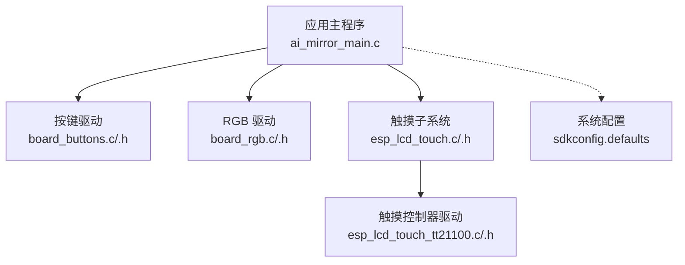
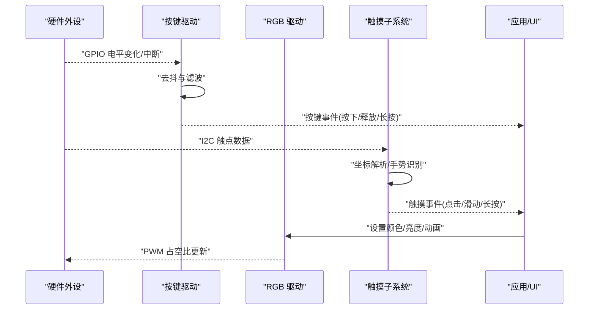
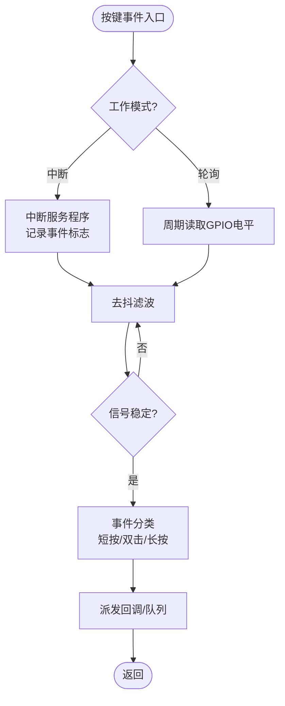
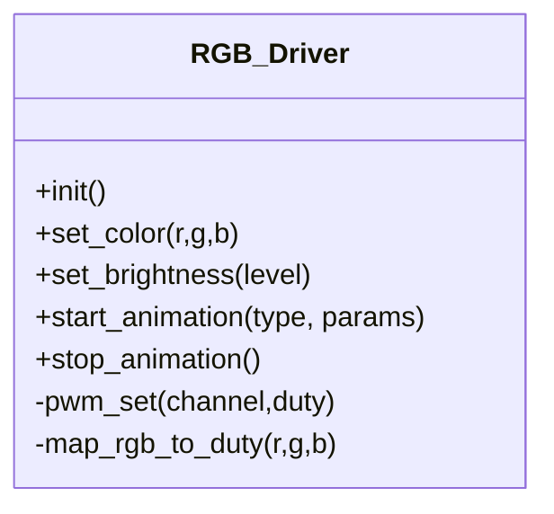
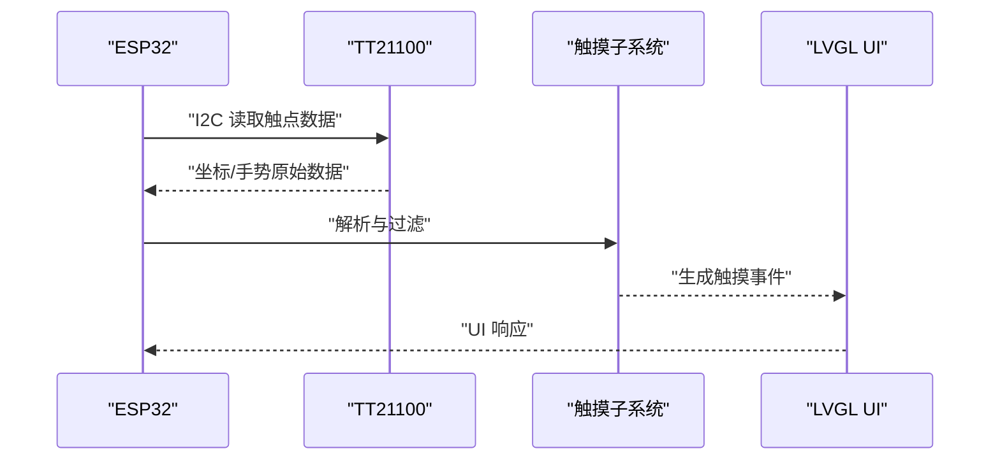

# 输入输出模块

<cite>
**本文引用的文件**   
- [ai_mirror_main.c](file://Firmware/esp32_ai_mirror/main/ai_mirror_main.c)
- [board_buttons.c](file://Firmware/esp32_ai_mirror/main/board_buttons.c)
- [board_buttons.h](file://Firmware/esp32_ai_mirror/main/board_buttons.h)
- [board_rgb.c](file://Firmware/esp32_ai_mirror/main/board_rgb.c)
- [board_rgb.h](file://Firmware/esp32_ai_mirror/main/board_rgb.h)
- [esp_lcd_touch_tt21100.c](file://Firmware/esp32_ai_mirror/managed_components/espressif__esp_lcd_touch_tt21100/esp_lcd_touch_tt21100.c)
- [esp_lcd_touch_tt21100.h](file://Firmware/esp32_ai_mirror/managed_components/espressif__esp_lcd_touch_tt21100/include/esp_lcd_touch_tt21100.h)
- [esp_lcd_touch.c](file://Firmware/esp32_ai_mirror/managed_components/espressif__esp_lcd_touch/esp_lcd_touch.c)
- [esp_lcd_touch.h](file://Firmware/esp32_ai_mirror/managed_components/espressif__esp_lcd_touch/include/esp_lcd_touch.h)
- [sdkconfig.defaults](file://Firmware/esp32_ai_mirror/sdkconfig.defaults)
</cite>

## 目录
1. [简介](#简介)
2. [项目结构](#项目结构)
3. [核心组件](#核心组件)
4. [架构总览](#架构总览)
5. [详细组件分析](#详细组件分析)
6. [依赖关系分析](#依赖关系分析)
7. [性能与功耗考量](#性能与功耗考量)
8. [故障排查指南](#故障排查指南)
9. [结论](#结论)
10. [附录：调试与测试](#附录：调试与测试)

## 简介
本文件聚焦 ESP32 AI Mirror 项目的输入输出（I/O）模块，覆盖按键输入、RGB LED 控制、触摸传感器集成与事件处理。文档从硬件电路到软件驱动进行系统化说明，包含 GPIO 配置、中断与轮询模式、输入消抖算法、响应优化策略、LED 亮度与颜色控制方法，以及调试与测试要点。目标是帮助开发者快速理解并扩展 I/O 功能。

## 项目结构
I/O 相关代码主要分布在 main 应用层与 managed_components 第三方组件中：
- 应用层
  - board_buttons.c/.h：按键驱动与事件抽象
  - board_rgb.c/.h：RGB LED 驱动与状态指示
  - ai_mirror_main.c：系统初始化与任务调度入口
- 组件层
  - esp_lcd_touch_tt21100：触摸控制器 TT21100 的底层驱动
  - esp_lcd_touch：触摸子系统通用接口与事件分发
  - sdkconfig.defaults：GPIO、I2C、中断等默认配置



图表来源
- [ai_mirror_main.c](file://Firmware/esp32_ai_mirror/main/ai_mirror_main.c)
- [board_buttons.c](file://Firmware/esp32_ai_mirror/main/board_buttons.c)
- [board_rgb.c](file://Firmware/esp32_ai_mirror/main/board_rgb.c)
- [esp_lcd_touch.c](file://Firmware/esp32_ai_mirror/managed_components/espressif__esp_lcd_touch/esp_lcd_touch.c)
- [esp_lcd_touch_tt21100.c](file://Firmware/esp32_ai_mirror/managed_components/espressif__esp_lcd_touch_tt21100/esp_lcd_touch_tt21100.c)
- [sdkconfig.defaults](file://Firmware/esp32_ai_mirror/sdkconfig.defaults)

章节来源
- [ai_mirror_main.c](file://Firmware/esp32_ai_mirror/main/ai_mirror_main.c)
- [board_buttons.c](file://Firmware/esp32_ai_mirror/main/board_buttons.c)
- [board_rgb.c](file://Firmware/esp32_ai_mirror/main/board_rgb.c)
- [esp_lcd_touch.c](file://Firmware/esp32_ai_mirror/managed_components/espressif__esp_lcd_touch/esp_lcd_touch.c)
- [esp_lcd_touch_tt21100.c](file://Firmware/esp32_ai_mirror/managed_components/espressif__esp_lcd_touch_tt21100/esp_lcd_touch_tt21100.c)
- [sdkconfig.defaults](file://Firmware/esp32_ai_mirror/sdkconfig.defaults)

## 核心组件
- 按键驱动（board_buttons）
  - 负责 GPIO 初始化、中断或轮询采集、去抖、事件封装与派发
  - 提供统一的按键事件类型与回调机制，供上层 UI 或业务逻辑使用
- RGB LED 驱动（board_rgb）
  - 基于 PWM 通道控制 R/G/B 三基色亮度
  - 支持颜色设置、渐变动画、呼吸灯、状态指示（如连接、错误、忙）
- 触摸子系统（esp_lcd_touch + tt21100）
  - TT21100 通过 I2C 上报触点坐标与手势事件
  - 触摸子系统将原始数据转换为 LVGL 可识别的事件流

章节来源
- [board_buttons.c](file://Firmware/esp32_ai_mirror/main/board_buttons.c)
- [board_buttons.h](file://Firmware/esp32_ai_mirror/main/board_buttons.h)
- [board_rgb.c](file://Firmware/esp32_ai_mirror/main/board_rgb.c)
- [board_rgb.h](file://Firmware/esp32_ai_mirror/main/board_rgb.h)
- [esp_lcd_touch.c](file://Firmware/esp32_ai_mirror/managed_components/espressif__esp_lcd_touch/esp_lcd_touch.c)
- [esp_lcd_touch_tt21100.c](file://Firmware/esp32_ai_mirror/managed_components/espressif__esp_lcd_touch_tt21100/esp_lcd_touch_tt21100.c)

## 架构总览
I/O 模块采用“硬件抽象 + 事件驱动”的分层设计：
- 硬件层：GPIO、PWM、I2C、中断控制器
- 驱动层：按键、RGB、触摸控制器驱动
- 子系统层：触摸事件聚合与分发
- 应用层：UI 与业务逻辑消费事件



图表来源
- [board_buttons.c](file://Firmware/esp32_ai_mirror/main/board_buttons.c)
- [board_rgb.c](file://Firmware/esp32_ai_mirror/main/board_rgb.c)
- [esp_lcd_touch.c](file://Firmware/esp32_ai_mirror/managed_components/espressif__esp_lcd_touch/esp_lcd_touch.c)
- [esp_lcd_touch_tt21100.c](file://Firmware/esp32_ai_mirror/managed_components/espressif__esp_lcd_touch_tt21100/esp_lcd_touch_tt21100.c)

## 详细组件分析

### 按键输入：硬件电路与软件驱动
- 硬件电路
  - 典型为外部上拉/下拉电阻 + 机械按键，引脚接入 ESP32 GPIO
  - 建议加入 RC 滤波以降低噪声
- 软件驱动
  - GPIO 配置：输入模式、上拉/下拉、中断触发边沿
  - 中断模式：低电平或下降沿触发，进入 ISR 后打标记，由任务线程处理
  - 轮询模式：周期性读取 GPIO 电平，适合资源受限场景
  - 去抖算法：时间窗口内连续采样稳定才判定有效；支持阈值与自适应
  - 事件封装：区分短按、双击、长按等，统一回调派发



图表来源
- [board_buttons.c](file://Firmware/esp32_ai_mirror/main/board_buttons.c)
- [board_buttons.h](file://Firmware/esp32_ai_mirror/main/board_buttons.h)

章节来源
- [board_buttons.c](file://Firmware/esp32_ai_mirror/main/board_buttons.c)
- [board_buttons.h](file://Firmware/esp32_ai_mirror/main/board_buttons.h)

### RGB LED：控制逻辑与状态指示
- 硬件接口
  - R/G/B 三路 PWM 输出，对应不同 GPIO
  - 可通过占空比调节亮度，组合三色实现全彩
- 软件驱动
  - PWM 通道初始化、频率与分辨率配置
  - 颜色设置：归一化 RGB 值映射至 PWM 占空比
  - 动画效果：渐变、呼吸、闪烁等，基于定时器或任务循环
  - 状态指示：空闲、连接中、错误、语音处理中等状态切换



图表来源
- [board_rgb.c](file://Firmware/esp32_ai_mirror/main/board_rgb.c)
- [board_rgb.h](file://Firmware/esp32_ai_mirror/main/board_rgb.h)

章节来源
- [board_rgb.c](file://Firmware/esp32_ai_mirror/main/board_rgb.c)
- [board_rgb.h](file://Firmware/esp32_ai_mirror/main/board_rgb.h)

### 触摸传感器：TT21100 集成与事件处理
- 硬件接口
  - I2C 总线连接，地址固定，支持多点触控
  - 中断引脚可选，用于高效事件上报
- 软件驱动
  - I2C 初始化、设备探测、寄存器配置
  - 数据读取：坐标、压力、手势（单击、双击、滑动、长按）
  - 事件转换：将原始数据转为 LVGL 触摸事件，注入 UI 框架
  - 过滤与校准：去噪、边界裁剪、坐标系变换



图表来源
- [esp_lcd_touch_tt21100.c](file://Firmware/esp32_ai_mirror/managed_components/espressif__esp_lcd_touch_tt21100/esp_lcd_touch_tt21100.c)
- [esp_lcd_touch.c](file://Firmware/esp32_ai_mirror/managed_components/espressif__esp_lcd_touch/esp_lcd_touch.c)

章节来源
- [esp_lcd_touch_tt21100.c](file://Firmware/esp32_ai_mirror/managed_components/espressif__esp_lcd_touch_tt21100/esp_lcd_touch_tt21100.c)
- [esp_lcd_touch_tt21100.h](file://Firmware/esp32_ai_mirror/managed_components/espressif__esp_lcd_touch_tt21100/include/esp_lcd_touch_tt21100.h)
- [esp_lcd_touch.c](file://Firmware/esp32_ai_mirror/managed_components/espressif__esp_lcd_touch/esp_lcd_touch.c)
- [esp_lcd_touch.h](file://Firmware/esp32_ai_mirror/managed_components/espressif__esp_lcd_touch/include/esp_lcd_touch.h)

### GPIO 配置、中断与轮询模式
- GPIO 配置
  - 按键：输入模式，上拉/下拉选择，根据硬件确定有效电平
  - RGB：PWM 输出，频率与分辨率需匹配 LED 特性
  - 触摸：I2C 时钟/数据线，可选中断引脚
- 中断模式
  - 适用于按键与触摸，降低 CPU 占用，提高实时性
  - ISR 中仅做最小化处理（置标志、入队），避免阻塞
- 轮询模式
  - 在低功耗或无中断可用时启用，注意采样周期与去抖配合

章节来源
- [sdkconfig.defaults](file://Firmware/esp32_ai_mirror/sdkconfig.defaults)
- [board_buttons.c](file://Firmware/esp32_ai_mirror/main/board_buttons.c)
- [esp_lcd_touch_tt21100.c](file://Firmware/esp32_ai_mirror/managed_components/espressif__esp_lcd_touch_tt21100/esp_lcd_touch_tt21100.c)

### 输入消抖算法与响应优化
- 去抖算法
  - 固定时间窗：连续 N 次采样一致则确认
  - 自适应阈值：根据环境噪声动态调整
  - 多级滤波：先硬件 RC，再软件数字滤波
- 响应优化
  - 中断优先路径：ISR 轻量处理，任务线程执行复杂逻辑
  - 事件合并：短时间内重复事件合并，减少抖动
  - 异步队列：事件入队，解耦采集与处理

章节来源
- [board_buttons.c](file://Firmware/esp32_ai_mirror/main/board_buttons.c)
- [esp_lcd_touch.c](file://Firmware/esp32_ai_mirror/managed_components/espressif__esp_lcd_touch/esp_lcd_touch.c)

### LED 亮度调节与颜色控制
- 亮度调节
  - 线性或非线性映射（对数曲线更贴近人眼感知）
  - 全局亮度与单通道独立控制
- 颜色控制
  - RGB 空间转换（HSV/HSL）便于平滑过渡
  - 动画插值：颜色渐变、呼吸灯、脉冲效果

章节来源
- [board_rgb.c](file://Firmware/esp32_ai_mirror/main/board_rgb.c)
- [board_rgb.h](file://Firmware/esp32_ai_mirror/main/board_rgb.h)

## 依赖关系分析
I/O 模块依赖 ESP-IDF 基础外设与 LVGL 事件体系：
- 外设：GPIO、PWM、I2C、中断
- 组件：esp_lcd_touch、tt21100 驱动
- 应用：UI 层消费按键与触摸事件，RGB 作为状态反馈

```mermaid
graph LR
SDK["ESP-IDF 外设<br/>GPIO/PWM/I2C"] --> BTN["按键驱动"]
SDK --> RGB["RGB 驱动"]
SDK --> TCH["触摸子系统"]
TCH --> TT["TT21100 驱动"]
BTN --> APP["应用/UI"]
TCH --> APP
RGB <- --> APP
```

图表来源
- [board_buttons.c](file://Firmware/esp32_ai_mirror/main/board_buttons.c)
- [board_rgb.c](file://Firmware/esp32_ai_mirror/main/board_rgb.c)
- [esp_lcd_touch.c](file://Firmware/esp32_ai_mirror/managed_components/espressif__esp_lcd_touch/esp_lcd_touch.c)
- [esp_lcd_touch_tt21100.c](file://Firmware/esp32_ai_mirror/managed_components/espressif__esp_lcd_touch_tt21100/esp_lcd_touch_tt21100.c)

章节来源
- [board_buttons.c](file://Firmware/esp32_ai_mirror/main/board_buttons.c)
- [board_rgb.c](file://Firmware/esp32_ai_mirror/main/board_rgb.c)
- [esp_lcd_touch.c](file://Firmware/esp32_ai_mirror/managed_components/espressif__esp_lcd_touch/esp_lcd_touch.c)
- [esp_lcd_touch_tt21100.c](file://Firmware/esp32_ai_mirror/managed_components/espressif__esp_lcd_touch_tt21100/esp_lcd_touch_tt21100.c)

## 性能与功耗考量
- 中断 vs 轮询
  - 高频事件优先中断，低频或批量数据可轮询
- 去抖与滤波
  - 合理的时间窗与采样率平衡延迟与稳定性
- PWM 刷新
  - 频率过高增加功耗，过低出现闪烁
- 触摸采样
  - 降低采样率或启用中断可减少 I2C 负载
- 任务调度
  - 将耗时操作放入后台任务，避免阻塞 UI

[本节为通用指导，不直接分析具体文件]

## 故障排查指南
- 按键无响应
  - 检查 GPIO 方向与上下拉配置
  - 验证中断触发边沿与去抖参数
  - 使用串口打印事件队列长度与回调调用次数
- RGB 不亮或颜色异常
  - 确认 PWM 通道绑定与频率/分辨率
  - 检查占空比映射范围与电源供电
- 触摸漂移或漏触
  - 校验 I2C 通信质量与地址
  - 调整去噪阈值与坐标校准参数
  - 观察事件频率与手势识别结果

章节来源
- [board_buttons.c](file://Firmware/esp32_ai_mirror/main/board_buttons.c)
- [board_rgb.c](file://Firmware/esp32_ai_mirror/main/board_rgb.c)
- [esp_lcd_touch_tt21100.c](file://Firmware/esp32_ai_mirror/managed_components/espressif__esp_lcd_touch_tt21100/esp_lcd_touch_tt21100.c)

## 结论
I/O 模块以模块化与事件驱动为核心，实现了按键、RGB LED 与触摸传感器的稳定集成。通过合理的 GPIO 配置、中断与轮询策略、去抖与滤波算法，以及 PWM 驱动的精细控制，系统在交互体验与功耗之间取得良好平衡。建议在开发中持续优化事件队列与动画渲染，确保 UI 流畅与响应及时。

[本节为总结性内容，不直接分析具体文件]

## 附录：调试与测试
- 调试方法
  - 按键：串口打印事件类型与时间戳，统计误触发率
  - RGB：分通道测试 PWM 占空比，验证颜色混合与动画
  - 触摸：导出原始坐标日志，绘制轨迹验证校准
- 测试用例
  - 按键：短按、双击、长按、抖动干扰、并发事件
  - RGB：全色阶扫描、渐变动画、呼吸灯、状态切换
  - 触摸：单点点击、多点触控、滑动速度、边界处理
- 工具与指标
  - 使用 ESP-IDF 监视器查看任务栈与内存
  - 示波器测量 PWM 波形与 I2C 时序
  - 关键指标：事件延迟、误触发率、CPU 占用、功耗

章节来源
- [ai_mirror_main.c](file://Firmware/esp32_ai_mirror/main/ai_mirror_main.c)
- [board_buttons.c](file://Firmware/esp32_ai_mirror/main/board_buttons.c)
- [board_rgb.c](file://Firmware/esp32_ai_mirror/main/board_rgb.c)
- [esp_lcd_touch_tt21100.c](file://Firmware/esp32_ai_mirror/managed_components/espressif__esp_lcd_touch_tt21100/esp_lcd_touch_tt21100.c)