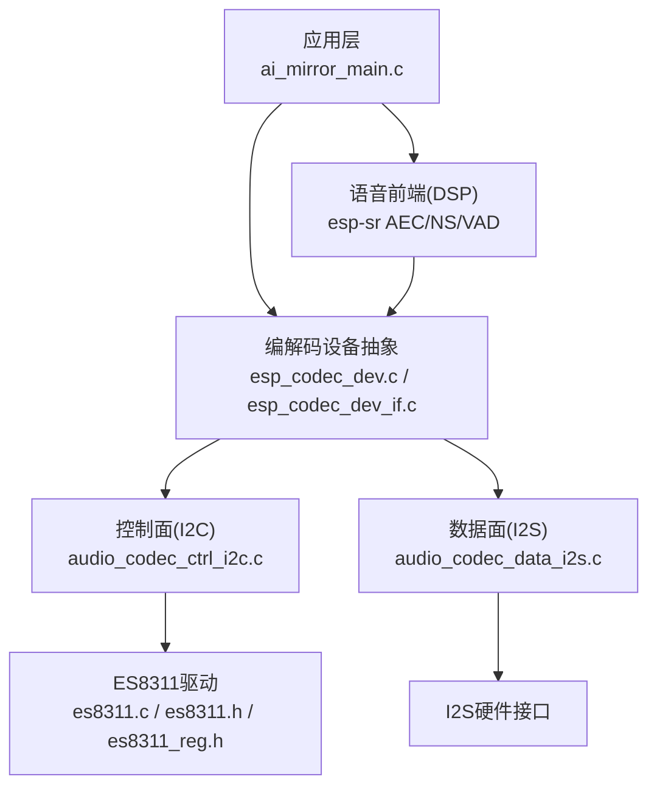
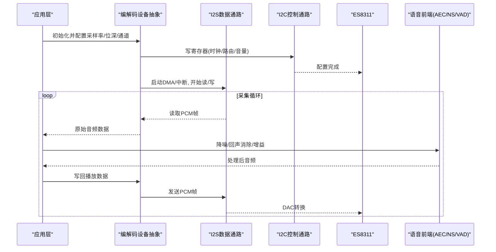
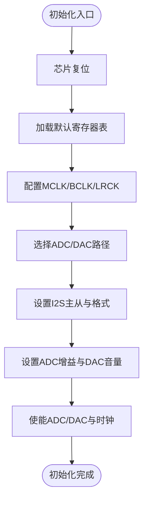
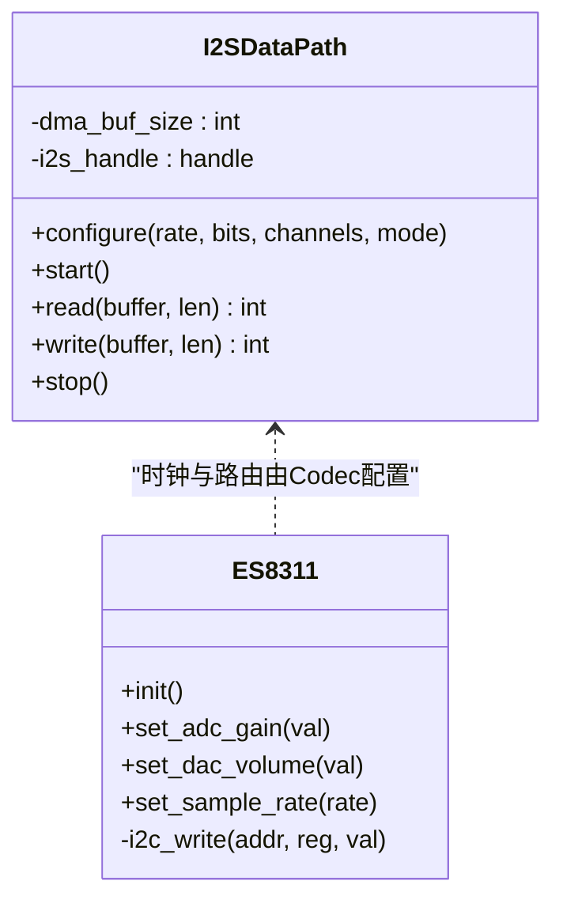
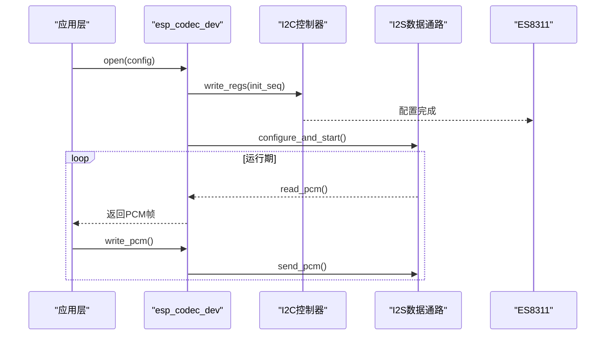
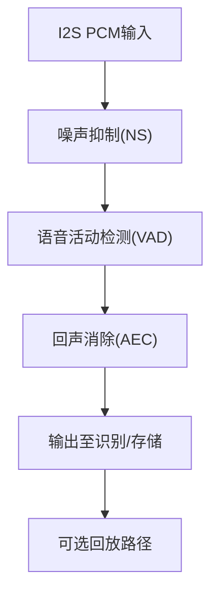
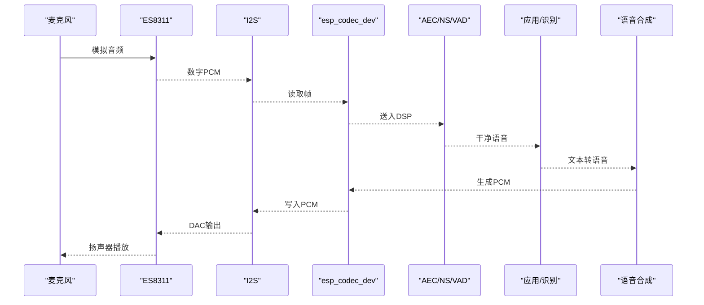
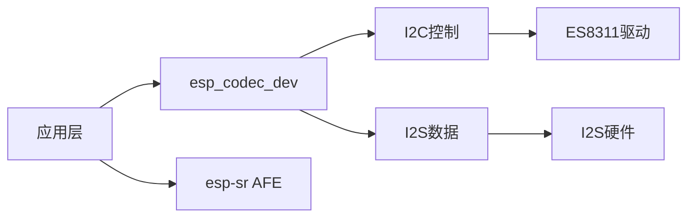

# 音频子系统

<cite>
**本文引用的文件**   
- [es8311.c](file://Firmware/esp32_ai_mirror/managed_components/espressif__es8311/es8311.c)
- [es8311.h](file://Firmware/esp32_ai_mirror/managed_components/espressif__es8311/include/es8311.h)
- [es8311_reg.h](file://Firmware/esp32_ai_mirror/managed_components/espressif__es8311/priv_include/es8311_reg.h)
- [audio_codec_data_i2s.c](file://Firmware/esp32_ai_mirror/managed_components/espressif__esp_codec_dev/platform/audio_codec_data_i2s.c)
- [audio_codec_ctrl_i2c.c](file://Firmware/esp32_ai_mirror/managed_components/espressif__esp_codec_dev/platform/audio_codec_ctrl_i2c.c)
- [esp_codec_dev.c](file://Firmware/esp32_ai_mirror/managed_components/espressif__esp_codec_dev/esp_codec_dev.c)
- [esp_codec_dev_if.c](file://Firmware/esp32_ai_mirror/managed_components/espressif__esp_codec_dev/esp_codec_dev_if.c)
- [esp_afe_sr_1mic.ref](file://Firmware/esp32_ai_mirror/components/espressif__esp-sr/src/esp_afe_sr_1mic.ref)
- [ai_mirror_main.c](file://Firmware/esp32_ai_mirror/main/ai_mirror_main.c)
- [sdkconfig.defaults](file://Firmware/esp32_ai_mirror/sdkconfig.defaults)
</cite>

## 目录
1. [简介](#简介)
2. [项目结构](#项目结构)
3. [核心组件](#核心组件)
4. [架构总览](#架构总览)
5. [详细组件分析](#详细组件分析)
6. [依赖关系分析](#依赖关系分析)
7. [性能考虑](#性能考虑)
8. [故障诊断指南](#故障诊断指南)
9. [结论](#结论)
10. [附录](#附录)

## 简介
本文件面向ESP32 AI镜像项目的音频子系统，聚焦ES8311音频编解码器的硬件连接与驱动实现，系统阐述I2S接口配置、数据流处理、采集/播放流程、DSP算法集成（噪声抑制、回声消除）、多通道同步机制、质量调优参数与性能监控方法，以及调试与排障要点。文档以代码级为依据，结合组件层与平台层抽象，帮助读者从原理到实现全面理解该音频链路。

## 项目结构
本项目采用分层组件化设计：
- 应用层：main入口与业务逻辑，负责初始化音频子系统、调度采集/播放任务、对接语音识别与合成。
- 编解码设备抽象层：esp_codec_dev提供统一的音频设备API，屏蔽底层I2C/I2S差异。
- 具体编解码器驱动：espressif__es8311提供ES8311寄存器操作与初始化序列。
- 平台数据通路：esp_codec_dev的platform层通过I2S与I2C分别完成数据与控制面通信。
- 语音前端与DSP：esp-sr提供AEC/NS/VAD等算法接口与模型，供上层调用。

图表来源 
- [esp_codec_dev.c](file://Firmware/esp32_ai_mirror/managed_components/espressif__esp_codec_dev/esp_codec_dev.c)
- [esp_codec_dev_if.c](file://Firmware/esp32_ai_mirror/managed_components/espressif__esp_codec_dev/esp_codec_dev_if.c)
- [audio_codec_ctrl_i2c.c](file://Firmware/esp32_ai_mirror/managed_components/espressif__esp_codec_dev/platform/audio_codec_ctrl_i2c.c)
- [audio_codec_data_i2s.c](file://Firmware/esp32_ai_mirror/managed_components/espressif__esp_codec_dev/platform/audio_codec_data_i2s.c)
- [es8311.c](file://Firmware/esp32_ai_mirror/managed_components/espressif__es8311/es8311.c)
- [es8311.h](file://Firmware/esp32_ai_mirror/managed_components/espressif__es8311/include/es8311.h)
- [es8311_reg.h](file://Firmware/esp32_ai_mirror/managed_components/espressif__es8311/priv_include/es8311_reg.h)
- [ai_mirror_main.c](file://Firmware/esp32_ai_mirror/main/ai_mirror_main.c)

章节来源
- [ai_mirror_main.c](file://Firmware/esp32_ai_mirror/main/ai_mirror_main.c)
- [sdkconfig.defaults](file://Firmware/esp32_ai_mirror/sdkconfig.defaults)

## 核心组件
- ES8311编解码器驱动
  - 负责I2C寄存器读写、时钟与电源管理、ADC/DAC路径选择、音量与增益设置、采样率与位宽配置。
  - 关键接口包括初始化、配置I2S模式、启用ADC/DAC、设置音量与AGC等。
- 编解码设备抽象(esp_codec_dev)
  - 统一API封装：打开/关闭、配置采样率/位深/通道数、读取/写入音频帧、音量控制、事件回调。
  - 将控制面(I2C)与数据面(I2S)解耦，便于替换不同Codec或总线。
- I2S数据通路
  - 基于ESP-IDF I2S外设，配置主从模式、位长、采样率、TDM/立体声格式、DMA缓冲与中断。
  - 提供环形缓冲区与零拷贝策略，降低CPU占用与延迟。
- 语音前端与DSP(esp-sr)
  - 提供AEC(回声消除)、NS(噪声抑制)、VAD(语音活动检测)、AGC(自动增益)等模块。
  - 通过AFE接口接入I2S数据流，进行实时处理并输出干净语音给识别引擎。

章节来源
- [es8311.c](file://Firmware/esp32_ai_mirror/managed_components/espressif__es8311/es8311.c)
- [es8311.h](file://Firmware/esp32_ai_mirror/managed_components/espressif__es8311/include/es8311.h)
- [es8311_reg.h](file://Firmware/esp32_ai_mirror/managed_components/espressif__es8311/priv_include/es8311_reg.h)
- [esp_codec_dev.c](file://Firmware/esp32_ai_mirror/managed_components/espressif__esp_codec_dev/esp_codec_dev.c)
- [esp_codec_dev_if.c](file://Firmware/esp32_ai_mirror/managed_components/espressif__esp_codec_dev/esp_codec_dev_if.c)
- [audio_codec_data_i2s.c](file://Firmware/esp32_ai_mirror/managed_components/espressif__esp_codec_dev/platform/audio_codec_data_i2s.c)
- [audio_codec_ctrl_i2c.c](file://Firmware/esp32_ai_mirror/managed_components/espressif__esp_codec_dev/platform/audio_codec_ctrl_i2c.c)
- [esp_afe_sr_1mic.ref](file://Firmware/esp32_ai_mirror/components/espressif__esp-sr/src/esp_afe_sr_1mic.ref)

## 架构总览
下图展示从麦克风输入到扬声器输出的完整链路，包含I2S数据流、ES8311寄存器配置、以及DSP处理阶段。

图表来源 
- [esp_codec_dev.c](file://Firmware/esp32_ai_mirror/managed_components/espressif__esp_codec_dev/esp_codec_dev.c)
- [audio_codec_data_i2s.c](file://Firmware/esp32_ai_mirror/managed_components/espressif__esp_codec_dev/platform/audio_codec_data_i2s.c)
- [audio_codec_ctrl_i2c.c](file://Firmware/esp32_ai_mirror/managed_components/espressif__esp_codec_dev/platform/audio_codec_ctrl_i2c.c)
- [es8311.c](file://Firmware/esp32_ai_mirror/managed_components/espressif__es8311/es8311.c)
- [esp_afe_sr_1mic.ref](file://Firmware/esp32_ai_mirror/components/espressif__esp-sr/src/esp_afe_sr_1mic.ref)

## 详细组件分析

### ES8311驱动与寄存器配置
- 初始化流程
  - 复位芯片、加载默认寄存器表、配置MCLK/BCLK/LRCK、选择I2S主从模式、设置ADC/DAC路径与采样率。
- 关键能力
  - ADC增益与高通滤波、DAC输出电平、内部AGC、静音控制、时钟分频。
- 典型错误处理
  - I2C读写失败重试、超时返回、状态寄存器校验。

图表来源 
- [es8311.c](file://Firmware/esp32_ai_mirror/managed_components/espressif__es8311/es8311.c)
- [es8311_reg.h](file://Firmware/esp32_ai_mirror/managed_components/espressif__es8311/priv_include/es8311_reg.h)

章节来源
- [es8311.c](file://Firmware/esp32_ai_mirror/managed_components/espressif__es8311/es8311.c)
- [es8311.h](file://Firmware/esp32_ai_mirror/managed_components/espressif__es8311/include/es8311.h)
- [es8311_reg.h](file://Firmware/esp32_ai_mirror/managed_components/espressif__es8311/priv_include/es8311_reg.h)

### I2S数据通路配置与数据流
- 配置要点
  - 采样率(如16kHz/48kHz)、位深(16bit)、通道数(单声道/立体声)、I2S格式(MSB/LSB/J型)、主从模式、DMA缓冲大小。
- 数据流
  - 采集：I2S DMA中断触发→读取PCM→复制到用户缓冲→可选DSP处理。
  - 播放：用户缓冲→I2S DMA写入→ES8311 DAC转换→模拟输出。
- 同步机制
  - 使用双缓冲/环形缓冲避免丢帧；采集与播放线程通过信号量或队列同步。

图表来源 
- [audio_codec_data_i2s.c](file://Firmware/esp32_ai_mirror/managed_components/espressif__esp_codec_dev/platform/audio_codec_data_i2s.c)
- [es8311.c](file://Firmware/esp32_ai_mirror/managed_components/espressif__es8311/es8311.c)

章节来源
- [audio_codec_data_i2s.c](file://Firmware/esp32_ai_mirror/managed_components/espressif__esp_codec_dev/platform/audio_codec_data_i2s.c)

### 编解码设备抽象层(esp_codec_dev)
- API职责
  - 打开/关闭设备、配置音频参数、读写音频帧、音量控制、事件回调注册。
- 与底层解耦
  - 控制面通过I2C/SPI访问寄存器，数据面通过I2S/ADC传输PCM。
- 错误与状态
  - 统一错误码、状态查询、日志输出、重试策略。

图表来源 
- [esp_codec_dev.c](file://Firmware/esp32_ai_mirror/managed_components/espressif__esp_codec_dev/esp_codec_dev.c)
- [esp_codec_dev_if.c](file://Firmware/esp32_ai_mirror/managed_components/espressif__esp_codec_dev/esp_codec_dev_if.c)
- [audio_codec_ctrl_i2c.c](file://Firmware/esp32_ai_mirror/managed_components/espressif__esp_codec_dev/platform/audio_codec_ctrl_i2c.c)
- [audio_codec_data_i2s.c](file://Firmware/esp32_ai_mirror/managed_components/espressif__esp_codec_dev/platform/audio_codec_data_i2s.c)

章节来源
- [esp_codec_dev.c](file://Firmware/esp32_ai_mirror/managed_components/espressif__esp_codec_dev/esp_codec_dev.c)
- [esp_codec_dev_if.c](file://Firmware/esp32_ai_mirror/managed_components/espressif__esp_codec_dev/esp_codec_dev_if.c)

### 语音前端与DSP集成(AEC/NS/VAD)
- 集成方式
  - 在采集路径中插入AEC/NS/VAD处理块，对每帧PCM进行实时处理。
- 参数调优
  - AEC延迟与收敛时间、NS阈值与衰减深度、VAD灵敏度与门限、AGC目标电平。
- 多通道与同步
  - 若使用多麦克风，需对齐相位与延迟，保证波束成形或AEC参考通道一致性。

图表来源 
- [esp_afe_sr_1mic.ref](file://Firmware/esp32_ai_mirror/components/espressif__esp-sr/src/esp_afe_sr_1mic.ref)

章节来源
- [esp_afe_sr_1mic.ref](file://Firmware/esp32_ai_mirror/components/espressif__esp-sr/src/esp_afe_sr_1mic.ref)

### 采集、处理与播放完整流程
- 采集
  - I2S DMA中断→读取PCM→可选预处理(滤波/增益)→DSP(AEC/NS/VAD)→识别引擎。
- 播放
  - 识别结果→语音合成→PCM缓冲→I2S DMA→ES8311 DAC→扬声器。
- 同步
  - 采集与播放线程通过队列/信号量协调，确保低延迟与无爆音。

图表来源 
- [audio_codec_data_i2s.c](file://Firmware/esp32_ai_mirror/managed_components/espressif__esp_codec_dev/platform/audio_codec_data_i2s.c)
- [esp_codec_dev.c](file://Firmware/esp32_ai_mirror/managed_components/espressif__esp_codec_dev/esp_codec_dev.c)
- [es8311.c](file://Firmware/esp32_ai_mirror/managed_components/espressif__es8311/es8311.c)
- [esp_afe_sr_1mic.ref](file://Firmware/esp32_ai_mirror/components/espressif__esp-sr/src/esp_afe_sr_1mic.ref)

章节来源
- [audio_codec_data_i2s.c](file://Firmware/esp32_ai_mirror/managed_components/espressif__esp_codec_dev/platform/audio_codec_data_i2s.c)
- [esp_codec_dev.c](file://Firmware/esp32_ai_mirror/managed_components/espressif__esp_codec_dev/esp_codec_dev.c)
- [es8311.c](file://Firmware/esp32_ai_mirror/managed_components/espressif__es8311/es8311.c)
- [esp_afe_sr_1mic.ref](file://Firmware/esp32_ai_mirror/components/espressif__esp-sr/src/esp_afe_sr_1mic.ref)

## 依赖关系分析
- 组件耦合
  - 应用层依赖esp_codec_dev统一API；esp_codec_dev依赖I2C/I2S平台实现；ES8311驱动仅暴露寄存器操作。
- 外部依赖
  - ESP-IDF I2S与I2C外设库；esp-sr语音前端库。
- 潜在环路
  - 通过抽象层避免循环依赖；确保数据面与控制面分离。

图表来源 
- [esp_codec_dev.c](file://Firmware/esp32_ai_mirror/managed_components/espressif__esp_codec_dev/esp_codec_dev.c)
- [audio_codec_ctrl_i2c.c](file://Firmware/esp32_ai_mirror/managed_components/espressif__esp_codec_dev/platform/audio_codec_ctrl_i2c.c)
- [audio_codec_data_i2s.c](file://Firmware/esp32_ai_mirror/managed_components/espressif__esp_codec_dev/platform/audio_codec_data_i2s.c)
- [es8311.c](file://Firmware/esp32_ai_mirror/managed_components/espressif__es8311/es8311.c)

章节来源
- [esp_codec_dev.c](file://Firmware/esp32_ai_mirror/managed_components/espressif__esp_codec_dev/esp_codec_dev.c)
- [esp_codec_dev_if.c](file://Firmware/esp32_ai_mirror/managed_components/espressif__esp_codec_dev/esp_codec_dev_if.c)
- [audio_codec_ctrl_i2c.c](file://Firmware/esp32_ai_mirror/managed_components/espressif__esp_codec_dev/platform/audio_codec_ctrl_i2c.c)
- [audio_codec_data_i2s.c](file://Firmware/esp32_ai_mirror/managed_components/espressif__esp_codec_dev/platform/audio_codec_data_i2s.c)
- [es8311.c](file://Firmware/esp32_ai_mirror/managed_components/espressif__es8311/es8311.c)

## 性能考虑
- 缓冲区与延迟
  - 合理设置I2S DMA缓冲大小，平衡延迟与稳定性；采集与播放使用双缓冲减少抖动。
- CPU占用
  - 尽量使用零拷贝与硬件DMA；DSP算法选择定点优化版本。
- 功耗
  - 空闲时关闭不必要的外设与时钟；动态调整采样率与位深。
- 吞吐与丢帧
  - 监控I2S FIFO水位与DMA剩余空间；必要时降级采样率或位深。

[本节为通用指导，不直接分析具体文件]

## 故障诊断指南
- 常见问题
  - 无声音：检查I2S配置、ES8311时钟与路由、音量与静音寄存器。
  - 噪音大：调整ADC增益、开启高通滤波、优化NS参数。
  - 回声严重：校准AEC参考通道、增加收敛时间、检查扬声器与麦克风距离。
  - 卡顿/爆音：增大DMA缓冲、检查CPU负载、避免阻塞式调用。
- 调试手段
  - 打印I2C寄存器快照、记录I2S DMA统计、抓取PCM片段进行离线分析。
  - 使用示波器观察BCLK/LRCK波形，确认时序正确。

章节来源
- [audio_codec_ctrl_i2c.c](file://Firmware/esp32_ai_mirror/managed_components/espressif__esp_codec_dev/platform/audio_codec_ctrl_i2c.c)
- [audio_codec_data_i2s.c](file://Firmware/esp32_ai_mirror/managed_components/espressif__esp_codec_dev/platform/audio_codec_data_i2s.c)
- [es8311.c](file://Firmware/esp32_ai_mirror/managed_components/espressif__es8311/es8311.c)

## 结论
本音频子系统以esp_codec_dev为抽象核心，结合ES8311驱动与I2S数据通路，实现了稳定高效的采集与播放链路。通过esp-sr的AEC/NS/VAD等DSP能力，显著提升语音质量。合理的缓冲区与参数调优是获得低延迟与高音质关键。建议在生产环境持续监控I2S与DSP指标，逐步优化参数以适应不同声学环境。

[本节为总结性内容，不直接分析具体文件]

## 附录
- 常用参数建议
  - 采样率：16kHz(语音识别)/48kHz(音乐)
  - 位深：16bit
  - 通道：单声道(采集)/立体声(播放)
  - I2S格式：MSB左对齐或I2S标准
  - AEC：参考通道与远端回放严格同步
  - NS：阈值根据环境噪声自适应
  - VAD：灵敏度按场景调节
- 监控指标
  - I2S FIFO水位、DMA剩余、CPU占用、DSP处理耗时、丢帧计数、SNR估计。

[本节为补充信息，不直接分析具体文件]