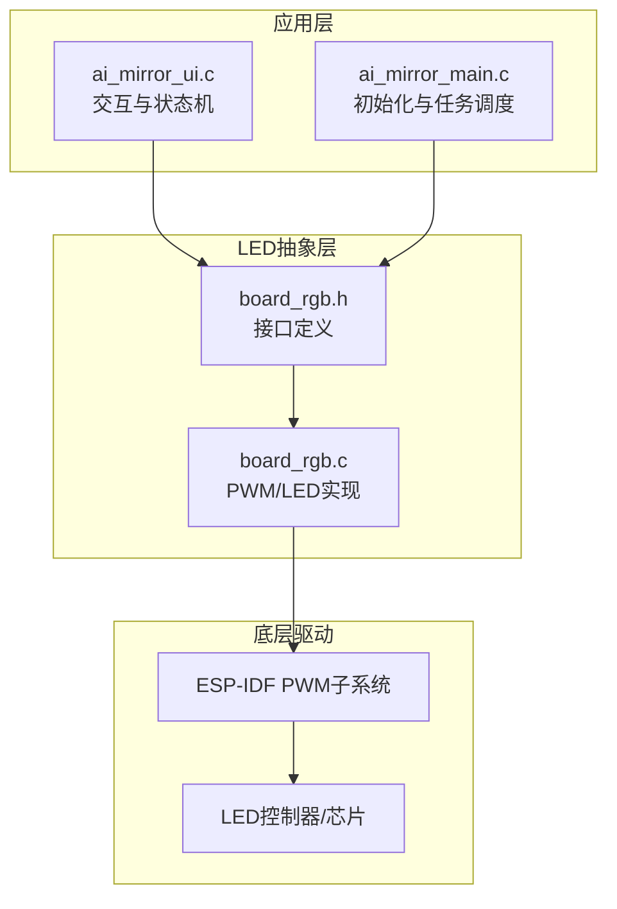
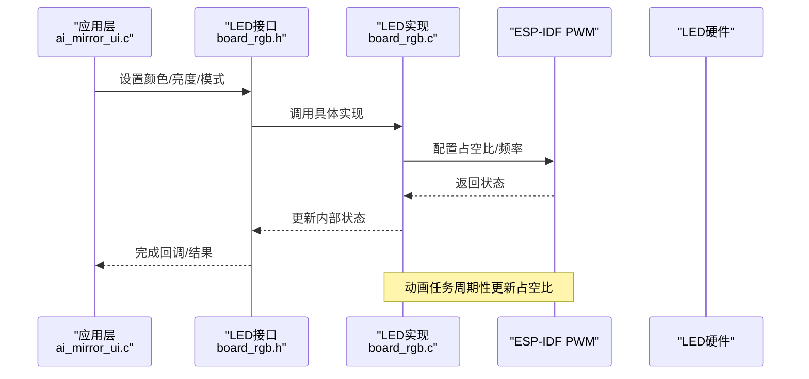
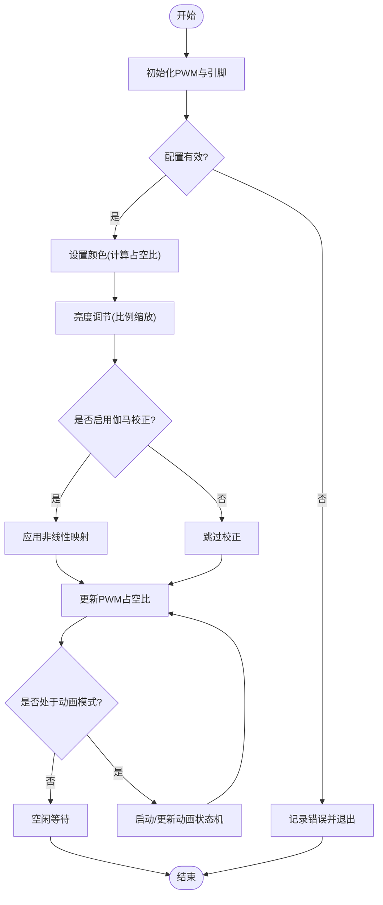
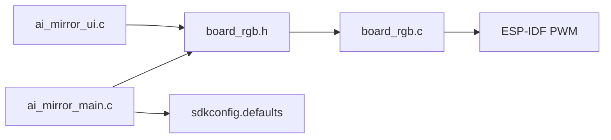

# LED控制模块

<cite>
**本文引用的文件**   
- [board_rgb.c](file://Firmware/esp32_ai_mirror/main/board_rgb.c)
- [board_rgb.h](file://Firmware/esp32_ai_mirror/main/board_rgb.h)
- [ai_mirror_main.c](file://Firmware/esp32_ai_mirror/main/ai_mirror_main.c)
- [ai_mirror_ui.c](file://Firmware/esp32_ai_mirror/main/ai_mirror_ui.c)
- [sdkconfig.defaults](file://Firmware/esp32_ai_mirror/sdkconfig.defaults)
</cite>

## 目录
1. [简介](#简介)
2. [项目结构](#项目结构)
3. [核心组件](#核心组件)
4. [架构总览](#架构总览)
5. [详细组件分析](#详细组件分析)
6. [依赖关系分析](#依赖关系分析)
7. [性能考虑](#性能考虑)
8. [故障排查指南](#故障排查指南)
9. [结论](#结论)
10. [附录](#附录)

## 简介
本文件面向LED控制模块，聚焦RGB LED的PWM配置、颜色与亮度控制算法、状态指示模式（系统状态、网络连接、用户交互）、动画效果（呼吸灯、闪烁、渐变），以及线程安全与性能优化策略。同时给出扩展自定义模式的API方法与硬件抽象层设计思路，帮助在不同LED类型与驱动方案间保持兼容。

## 项目结构
LED相关代码位于main目录下，采用“板级抽象 + 应用调用”的分层组织方式：
- board_rgb.h/.c：封装ESP-IDF PWM与LED驱动细节，提供统一接口
- ai_mirror_main.c：系统初始化与任务调度入口，负责启动LED服务与事件分发
- ai_mirror_ui.c：UI与交互逻辑，触发LED状态与动画
- sdkconfig.defaults：构建期开关，用于启用/禁用LED功能与默认参数

图表来源
- [ai_mirror_main.c](file://Firmware/esp32_ai_mirror/main/ai_mirror_main.c)
- [ai_mirror_ui.c](file://Firmware/esp32_ai_mirror/main/ai_mirror_ui.c)
- [board_rgb.h](file://Firmware/esp32_ai_mirror/main/board_rgb.h)
- [board_rgb.c](file://Firmware/esp32_ai_mirror/main/board_rgb.c)

章节来源
- [ai_mirror_main.c](file://Firmware/esp32_ai_mirror/main/ai_mirror_main.c)
- [ai_mirror_ui.c](file://Firmware/esp32_ai_mirror/main/ai_mirror_ui.c)
- [board_rgb.h](file://Firmware/esp32_ai_mirror/main/board_rgb.h)
- [board_rgb.c](file://Firmware/esp32_ai_mirror/main/board_rgb.c)

## 核心组件
- 板级LED抽象接口（board_rgb.h）
  - 定义LED初始化、颜色设置、亮度调节、动画启停等函数原型
  - 暴露枚举与常量，如颜色通道范围、模式类型、定时器周期等
- 具体实现（board_rgb.c）
  - 基于ESP-IDF PWM API配置R/G/B通道
  - 实现颜色合成、线性/对数亮度映射、平滑过渡算法
  - 管理动画状态机（呼吸、闪烁、渐变）与任务/定时器调度
- 上层集成（ai_mirror_main.c / ai_mirror_ui.c）
  - 在系统启动时初始化LED并注册回调
  - 根据网络状态、语音处理阶段、用户按键等事件切换LED模式

章节来源
- [board_rgb.h](file://Firmware/esp32_ai_mirror/main/board_rgb.h)
- [board_rgb.c](file://Firmware/esp32_ai_mirror/main/board_rgb.c)
- [ai_mirror_main.c](file://Firmware/esp32_ai_mirror/main/ai_mirror_main.c)
- [ai_mirror_ui.c](file://Firmware/esp32_ai_mirror/main/ai_mirror_ui.c)

## 架构总览
LED控制采用分层架构：应用层通过统一接口调用，LED抽象层屏蔽不同驱动差异，底层由ESP-IDF PWM子系统驱动硬件。

图表来源
- [ai_mirror_ui.c](file://Firmware/esp32_ai_mirror/main/ai_mirror_ui.c)
- [board_rgb.h](file://Firmware/esp32_ai_mirror/main/board_rgb.h)
- [board_rgb.c](file://Firmware/esp32_ai_mirror/main/board_rgb.c)

## 详细组件分析

### 组件A：board_rgb.h（接口定义）
- 职责
  - 定义LED初始化、颜色设置、亮度调节、动画启停等API
  - 定义颜色模型（如RGB分量范围）、模式枚举（系统状态、联网、交互反馈）
- 设计要点
  - 使用固定宽度整型表示通道值，便于跨平台移植
  - 将动画参数（周期、步长、缓动曲线）以结构体形式传入，提高可配置性
- 可扩展点
  - 新增模式或颜色空间（HSV/HSB）只需扩展枚举与转换函数
  - 支持多LED实例可通过句柄或索引区分

章节来源
- [board_rgb.h](file://Firmware/esp32_ai_mirror/main/board_rgb.h)

### 组件B：board_rgb.c（PWM与动画实现）
- 职责
  - 初始化ESP-IDF PWM，绑定R/G/B引脚，设置频率与分辨率
  - 实现颜色到占空比的映射、亮度调节与平滑过渡
  - 管理动画状态机，按周期更新各通道占空比
- 关键流程
  - 初始化：检查配置、申请资源、配置PWM通道
  - 颜色设置：输入RGB值，计算目标占空比，必要时进行伽马校正
  - 亮度调节：对三通道按比例缩放，避免溢出与死区
  - 动画：呼吸（正弦/余弦曲线）、闪烁（方波）、渐变（线性插值）
- 错误处理
  - 无效参数校验（越界、非法模式）
  - PWM初始化失败回退（关闭LED或进入安全模式）

图表来源
- [board_rgb.c](file://Firmware/esp32_ai_mirror/main/board_rgb.c)

章节来源
- [board_rgb.c](file://Firmware/esp32_ai_mirror/main/board_rgb.c)

### 组件C：ai_mirror_main.c（系统初始化与调度）
- 职责
  - 系统启动时初始化LED模块，注册事件回调
  - 创建任务或定时器驱动LED动画与状态更新
- 关键点
  - 确保LED初始化顺序正确，避免与其他外设冲突
  - 将网络状态、语音处理阶段等事件映射为LED模式

章节来源
- [ai_mirror_main.c](file://Firmware/esp32_ai_mirror/main/ai_mirror_main.c)

### 组件D：ai_mirror_ui.c（交互与状态机）
- 职责
  - 根据用户操作（按键、触摸）与系统事件（联网成功/失败、语音识别中）切换LED模式
  - 触发动画（如连接中闪烁、成功渐亮、错误快速闪烁）
- 关键点
  - 状态机清晰，避免模式竞争
  - 与LED接口解耦，仅通过API调用

章节来源
- [ai_mirror_ui.c](file://Firmware/esp32_ai_mirror/main/ai_mirror_ui.c)

## 依赖关系分析
- 直接依赖
  - board_rgb.c依赖ESP-IDF PWM子系统与GPIO配置
  - 上层模块依赖board_rgb.h提供的接口
- 间接依赖
  - 构建配置（sdkconfig.defaults）决定LED功能开关与默认参数
- 潜在循环依赖
  - 通过头文件隔离与接口抽象避免循环引用

图表来源
- [ai_mirror_ui.c](file://Firmware/esp32_ai_mirror/main/ai_mirror_ui.c)
- [ai_mirror_main.c](file://Firmware/esp32_ai_mirror/main/ai_mirror_main.c)
- [board_rgb.h](file://Firmware/esp32_ai_mirror/main/board_rgb.h)
- [board_rgb.c](file://Firmware/esp32_ai_mirror/main/board_rgb.c)
- [sdkconfig.defaults](file://Firmware/esp32_ai_mirror/sdkconfig.defaults)

章节来源
- [ai_mirror_ui.c](file://Firmware/esp32_ai_mirror/main/ai_mirror_ui.c)
- [ai_mirror_main.c](file://Firmware/esp32_ai_mirror/main/ai_mirror_main.c)
- [board_rgb.h](file://Firmware/esp32_ai_mirror/main/board_rgb.h)
- [board_rgb.c](file://Firmware/esp32_ai_mirror/main/board_rgb.c)
- [sdkconfig.defaults](file://Firmware/esp32_ai_mirror/sdkconfig.defaults)

## 性能考虑
- PWM频率与分辨率
  - 频率过高可能引入噪声，过低导致可见闪烁；建议根据人眼感知与硬件能力选择合适范围
  - 分辨率影响颜色精度与CPU开销，需权衡
- 亮度映射
  - 线性映射简单但视觉不均匀；对数或伽马校正更贴近人眼感知
- 动画更新频率
  - 呼吸/渐变通常10–60Hz即可满足平滑需求，避免频繁中断
- 内存与CPU占用
  - 动画状态机尽量使用轻量数据结构，减少动态分配
  - 批量更新占空比，降低总线访问次数
- 功耗优化
  - 空闲时降低刷新率或关闭非必要通道
  - 合理设置最小亮度阈值，避免长时间微亮耗电

[本节为通用指导，不直接分析具体文件]

## 故障排查指南
- 现象：LED不亮或颜色异常
  - 检查PWM引脚配置与初始化返回值
  - 确认颜色值范围与占空比映射是否正确
- 现象：动画卡顿或闪烁
  - 调整动画更新周期与优先级
  - 检查是否有高优先级任务抢占导致更新不及时
- 现象：亮度不可调或过暗
  - 验证亮度缩放算法与伽马校正开关
  - 检查最小亮度限制与死区处理
- 现象：模式切换混乱
  - 审查状态机逻辑与事件触发条件
  - 增加日志输出定位问题路径

章节来源
- [board_rgb.c](file://Firmware/esp32_ai_mirror/main/board_rgb.c)
- [ai_mirror_ui.c](file://Firmware/esp32_ai_mirror/main/ai_mirror_ui.c)

## 结论
本LED控制模块通过清晰的层次划分与统一的接口设计，实现了RGB LED的颜色控制、亮度调节与多种动画效果。借助ESP-IDF PWM子系统与合理的状态机管理，系统在性能与用户体验之间取得平衡。未来可通过扩展颜色空间、动画曲线与多实例支持进一步提升灵活性。

[本节为总结，不直接分析具体文件]

## 附录

### A. 颜色与亮度控制算法说明
- 颜色模型
  - 推荐采用归一化RGB（0–1或0–255），便于后续转换与映射
- 亮度调节
  - 线性缩放：适用于快速实现，但视觉不均匀
  - 对数/伽马校正：更接近人眼感知，提升观感
- 平滑过渡
  - 线性插值：简单稳定
  - 正弦/余弦曲线：适合呼吸灯
  - 缓动函数（ease-in/out）：增强动画质感

[本节为概念性内容，不直接分析具体文件]

### B. 状态指示模式设计
- 系统状态
  - 启动中：缓慢呼吸
  - 运行正常：常亮或慢闪
  - 错误：快速闪烁或红色提示
- 网络连接状态
  - 搜索网络：交替闪烁
  - 已连接：绿色常亮
  - 连接失败：红色闪烁
- 用户交互反馈
  - 按键按下：短暂亮起
  - 语音处理中：蓝色渐变
  - 播放中：随音频幅度变化

[本节为概念性内容，不直接分析具体文件]

### C. 线程安全与并发控制
- 共享资源保护
  - 使用互斥锁保护LED状态与配置更新
  - 中断上下文与任务上下文分离，避免竞态
- 异步更新
  - 通过定时器或队列异步更新占空比，避免阻塞主循环
- 幂等性
  - 重复设置相同颜色/模式应无副作用

[本节为概念性内容，不直接分析具体文件]

### D. 自定义扩展方法
- 新增模式
  - 在接口头文件中扩展模式枚举
  - 在实现中添加对应动画逻辑
- 自定义颜色空间
  - 添加HSV/HSB转换函数
  - 在设置颜色前进行空间转换
- 多LED支持
  - 通过句柄或索引区分不同LED实例
  - 扩展初始化与更新接口以支持数组或链表管理

[本节为概念性内容，不直接分析具体文件]

### E. 硬件抽象层设计与兼容性
- 抽象原则
  - 接口稳定，实现可变
  - 针对不同驱动（如WS2812、APA102、PWM直驱）提供适配层
- 兼容性处理
  - 检测硬件特性（通道数、最大亮度、时序要求）
  - 运行时选择最优实现
- 配置管理
  - 通过构建配置或运行时参数切换不同驱动

[本节为概念性内容，不直接分析具体文件]