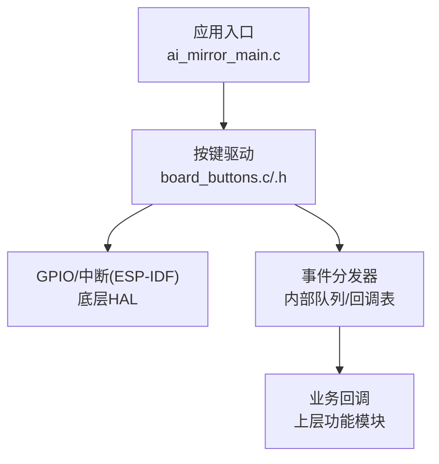
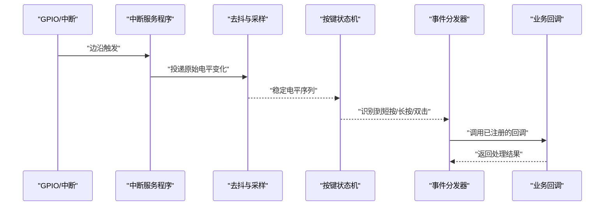
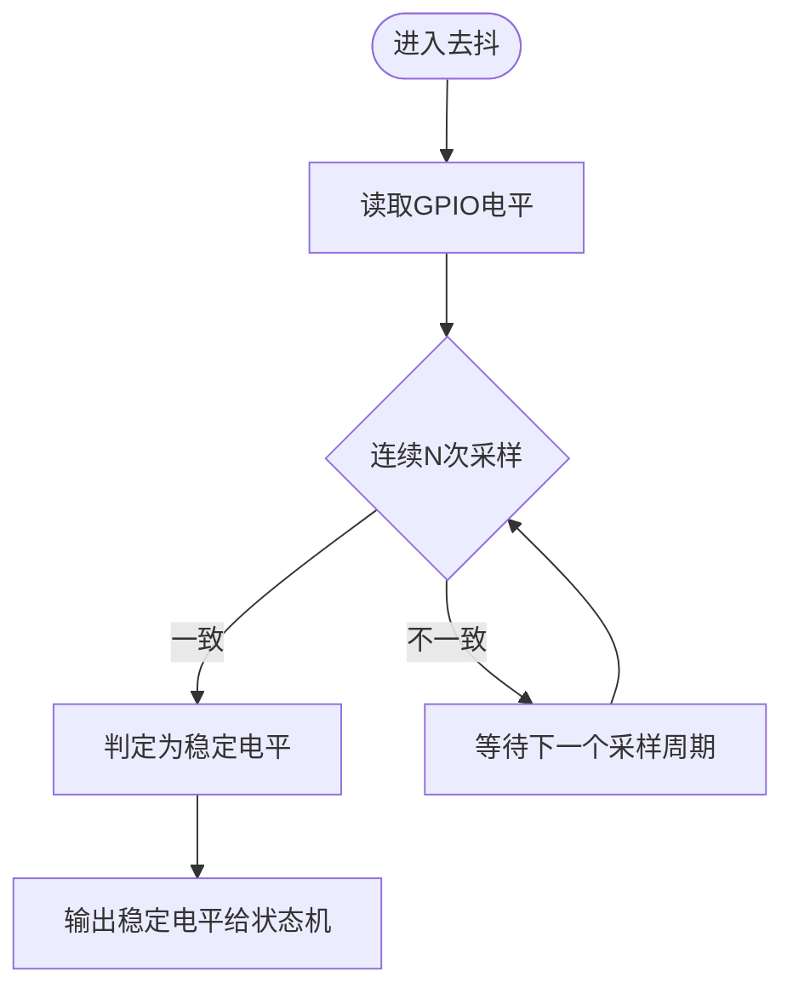
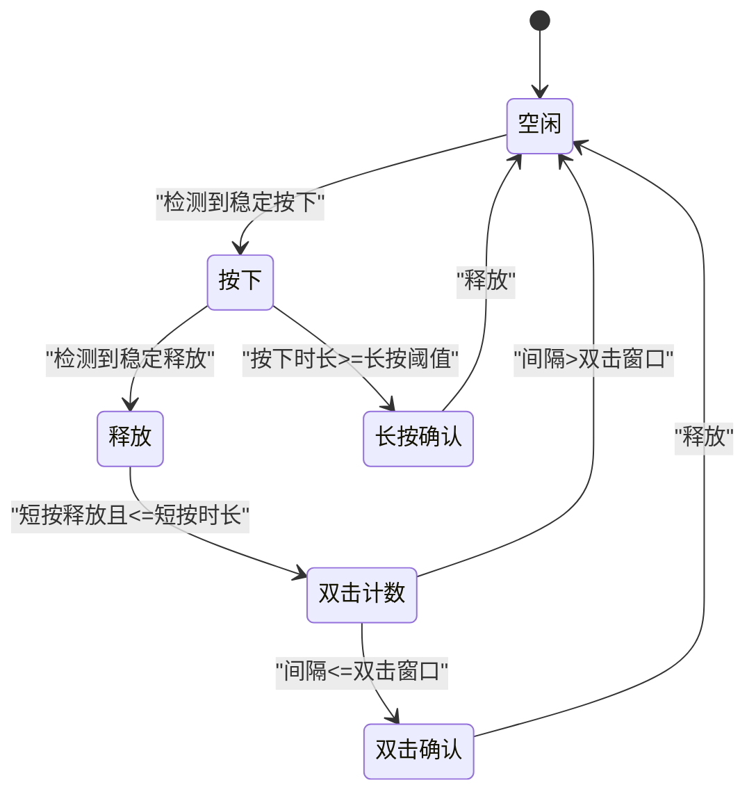
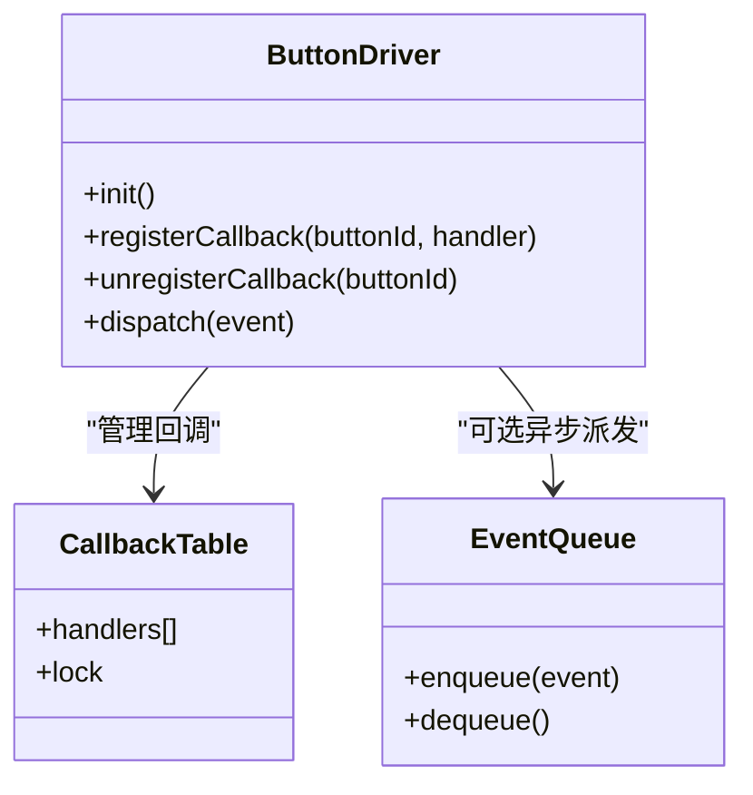
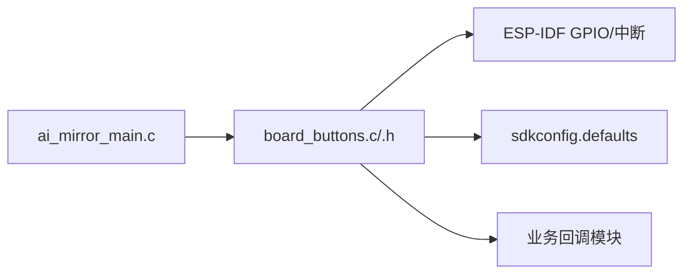

# 按键输入处理

<cite>
**本文引用的文件**   
- [board_buttons.c](file://Firmware/esp32_ai_mirror/main/board_buttons.c)
- [board_buttons.h](file://Firmware/esp32_ai_mirror/main/board_buttons.h)
- [ai_mirror_main.c](file://Firmware/esp32_ai_mirror/main/ai_mirror_main.c)
- [sdkconfig.defaults](file://Firmware/esp32_ai_mirror/sdkconfig.defaults)
</cite>

## 目录
1. [简介](#简介)
2. [项目结构](#项目结构)
3. [核心组件](#核心组件)
4. [架构总览](#架构总览)
5. [详细组件分析](#详细组件分析)
6. [依赖关系分析](#依赖关系分析)
7. [性能考虑](#性能考虑)
8. [故障排查指南](#故障排查指南)
9. [结论](#结论)
10. [附录](#附录)

## 简介
本文件面向ESP32 AI镜像项目的按键输入处理模块，系统性说明GPIO引脚配置、中断与事件分发机制，以及长按、短按、双击等按键检测算法的实现原理。文档还涵盖按键去抖逻辑、状态管理、回调注册机制、事件优先级与并发访问控制，并给出扩展新按键类型与处理逻辑的方法，以及硬件抽象层接口定义与测试方法。

## 项目结构
按键输入处理相关代码位于main目录下，主要包含：
- board_buttons.c/h：按键驱动与事件处理实现
- ai_mirror_main.c：应用入口，初始化按键子系统并注册回调
- sdkconfig.defaults：构建期配置（如按键去抖时间、超时阈值等）

图表来源 
- [ai_mirror_main.c](file://Firmware/esp32_ai_mirror/main/ai_mirror_main.c)
- [board_buttons.c](file://Firmware/esp32_ai_mirror/main/board_buttons.c)
- [board_buttons.h](file://Firmware/esp32_ai_mirror/main/board_buttons.h)

章节来源
- [board_buttons.c](file://Firmware/esp32_ai_mirror/main/board_buttons.c)
- [board_buttons.h](file://Firmware/esp32_ai_mirror/main/board_buttons.h)
- [ai_mirror_main.c](file://Firmware/esp32_ai_mirror/main/ai_mirror_main.c)
- [sdkconfig.defaults](file://Firmware/esp32_ai_mirror/sdkconfig.defaults)

## 核心组件
- GPIO与中断配置：为每个按键引脚配置输入模式、上拉/下拉、边沿触发中断，并在ISR中投递原始电平变化事件。
- 去抖与滤波：在定时器或任务中周期性采样，结合时间窗口过滤抖动，输出稳定电平。
- 状态机与识别：基于稳定电平序列识别短按、长按、双击等动作，维护各按键的状态变量。
- 事件分发：将识别到的按键事件通过回调表或消息队列分发给上层业务。
- 回调注册与管理：提供统一的注册/注销接口，支持多消费者订阅同一按键事件。
- 优先级与并发：对高优先级事件（如电源键）优先处理；使用互斥锁/临界区保护共享状态，避免竞态。

章节来源
- [board_buttons.c](file://Firmware/esp32_ai_mirror/main/board_buttons.c)
- [board_buttons.h](file://Firmware/esp32_ai_mirror/main/board_buttons.h)

## 架构总览
按键子系统采用“中断采集 + 软件去抖 + 状态机识别 + 事件分发”的分层架构。中断仅做最小化处理，去抖与识别在任务/定时器中完成，保证实时性与稳定性。

图表来源 
- [board_buttons.c](file://Firmware/esp32_ai_mirror/main/board_buttons.c)
- [board_buttons.h](file://Firmware/esp32_ai_mirror/main/board_buttons.h)

## 详细组件分析

### GPIO与中断配置
- 引脚方向与电气特性：配置为输入，启用内部上拉或外部上拉电阻，确保空闲电平稳定。
- 中断触发方式：根据硬件设计选择上升沿、下降沿或双边沿触发。
- ISR职责：读取引脚电平，记录时间戳，投递到去抖队列，避免阻塞。

章节来源
- [board_buttons.c](file://Firmware/esp32_ai_mirror/main/board_buttons.c)
- [board_buttons.h](file://Firmware/esp32_ai_mirror/main/board_buttons.h)

### 去抖与滤波
- 采样策略：在固定周期内多次采样，统计高/低电平占比，超过阈值判定为稳定。
- 时间窗口：可配置的去抖时长，兼顾响应速度与抗干扰能力。
- 异常处理：长时间未稳定视为噪声，丢弃该次事件。

图表来源 
- [board_buttons.c](file://Firmware/esp32_ai_mirror/main/board_buttons.c)

章节来源
- [board_buttons.c](file://Firmware/esp32_ai_mirror/main/board_buttons.c)
- [sdkconfig.defaults](file://Firmware/esp32_ai_mirror/sdkconfig.defaults)

### 按键识别状态机（短按、长按、双击）
- 状态定义：空闲、按下、释放、长按计时、双击间隔计数等。
- 转移条件：基于稳定电平的上升/下降沿与计时器判断。
- 识别规则：
  - 短按：按下后在阈值时间内释放。
  - 长按：按下持续时间超过阈值。
  - 双击：两次短按间隔小于双击窗口。

图表来源 
- [board_buttons.c](file://Firmware/esp32_ai_mirror/main/board_buttons.c)

章节来源
- [board_buttons.c](file://Firmware/esp32_ai_mirror/main/board_buttons.c)
- [board_buttons.h](file://Firmware/esp32_ai_mirror/main/board_buttons.h)

### 事件分发与回调注册
- 事件类型：短按、长按、双击、按住不放等。
- 回调表：以按键ID为索引的函数指针数组，支持动态注册/注销。
- 分发策略：同步调用或入队异步派发，避免ISR阻塞。
- 优先级：可为不同按键或事件类型设置优先级，高优先级先处理。

图表来源 
- [board_buttons.c](file://Firmware/esp32_ai_mirror/main/board_buttons.c)
- [board_buttons.h](file://Firmware/esp32_ai_mirror/main/board_buttons.h)

章节来源
- [board_buttons.c](file://Firmware/esp32_ai_mirror/main/board_buttons.c)
- [board_buttons.h](file://Firmware/esp32_ai_mirror/main/board_buttons.h)

### 并发访问控制与优先级
- 互斥保护：对共享状态（如状态机变量、回调表）加锁，防止多线程竞争。
- 临界区：在中断与任务之间切换时，使用关中断/开中断或RTOS互斥量。
- 优先级调度：高优先级事件（如电源键）优先入队或立即派发，低优先级延迟处理。

章节来源
- [board_buttons.c](file://Firmware/esp32_ai_mirror/main/board_buttons.c)
- [board_buttons.h](file://Firmware/esp32_ai_mirror/main/board_buttons.h)

### 硬件抽象层接口定义
- 统一接口：封装GPIO读写、中断配置、延时与定时器API，屏蔽平台差异。
- 扩展点：新增按键只需实现硬件抽象层的读引脚与配置中断接口。
- 配置项：去抖时长、长按阈值、双击窗口等通过配置文件集中管理。

章节来源
- [board_buttons.h](file://Firmware/esp32_ai_mirror/main/board_buttons.h)
- [sdkconfig.defaults](file://Firmware/esp32_ai_mirror/sdkconfig.defaults)

### 测试方法与验证
- 单元测试：模拟GPIO电平翻转，验证去抖与状态机识别正确性。
- 集成测试：连接真实按键，测量短按/长按/双击识别准确率与延迟。
- 压力测试：高频抖动与并发事件注入，验证鲁棒性与无死锁。
- 回归测试：修改阈值参数后复测，确保行为符合预期。

章节来源
- [board_buttons.c](file://Firmware/esp32_ai_mirror/main/board_buttons.c)
- [board_buttons.h](file://Firmware/esp32_ai_mirror/main/board_buttons.h)

## 依赖关系分析
按键子系统依赖ESP-IDF的GPIO与中断能力，并通过回调表与上层业务解耦。构建期配置影响运行时行为。

图表来源 
- [ai_mirror_main.c](file://Firmware/esp32_ai_mirror/main/ai_mirror_main.c)
- [board_buttons.c](file://Firmware/esp32_ai_mirror/main/board_buttons.c)
- [board_buttons.h](file://Firmware/esp32_ai_mirror/main/board_buttons.h)
- [sdkconfig.defaults](file://Firmware/esp32_ai_mirror/sdkconfig.defaults)

章节来源
- [ai_mirror_main.c](file://Firmware/esp32_ai_mirror/main/ai_mirror_main.c)
- [board_buttons.c](file://Firmware/esp32_ai_mirror/main/board_buttons.c)
- [board_buttons.h](file://Firmware/esp32_ai_mirror/main/board_buttons.h)
- [sdkconfig.defaults](file://Firmware/esp32_ai_mirror/sdkconfig.defaults)

## 性能考虑
- 中断轻量化：ISR只做最小工作，避免耗时操作。
- 去抖优化：合理设置采样频率与窗口长度，平衡功耗与响应速度。
- 事件合并：短时间内重复事件合并，减少CPU负载。
- 内存占用：回调表与事件队列大小按需配置，避免溢出。

[本节为通用指导，不直接分析具体文件]

## 故障排查指南
- 现象：按键误触发
  - 检查去抖时长是否过短，适当增加。
  - 检查上拉/下拉电阻配置是否正确。
- 现象：长按无法识别
  - 检查长按阈值配置与计时器精度。
  - 确认状态机转移条件未被其他事件覆盖。
- 现象：双击失效
  - 调整双击窗口，避免过宽或过窄。
  - 检查事件分发是否被阻塞。
- 现象：系统卡顿
  - 检查回调函数是否耗时过长，必要时改为异步派发。
  - 确认互斥锁持有时间是否过长。

章节来源
- [board_buttons.c](file://Firmware/esp32_ai_mirror/main/board_buttons.c)
- [board_buttons.h](file://Firmware/esp32_ai_mirror/main/board_buttons.h)

## 结论
按键输入处理模块通过分层设计与清晰的接口定义，实现了稳定可靠的短按、长按、双击识别。结合去抖、状态机与事件分发，既保证了实时性，又提升了可扩展性与可维护性。通过合理的并发控制与优先级策略，可在复杂系统中稳定运行。

[本节为总结性内容，不直接分析具体文件]

## 附录
- 扩展新按键类型：
  - 在硬件抽象层添加引脚配置与中断绑定。
  - 在状态机中新增对应识别规则。
  - 在回调表中注册新事件处理器。
- 配置项建议：
  - 去抖时长：根据硬件抖动特性设定。
  - 短按时长：区分点击与长按。
  - 长按阈值：满足用户感知需求。
  - 双击窗口：适配用户操作习惯。

[本节为补充信息，不直接分析具体文件]