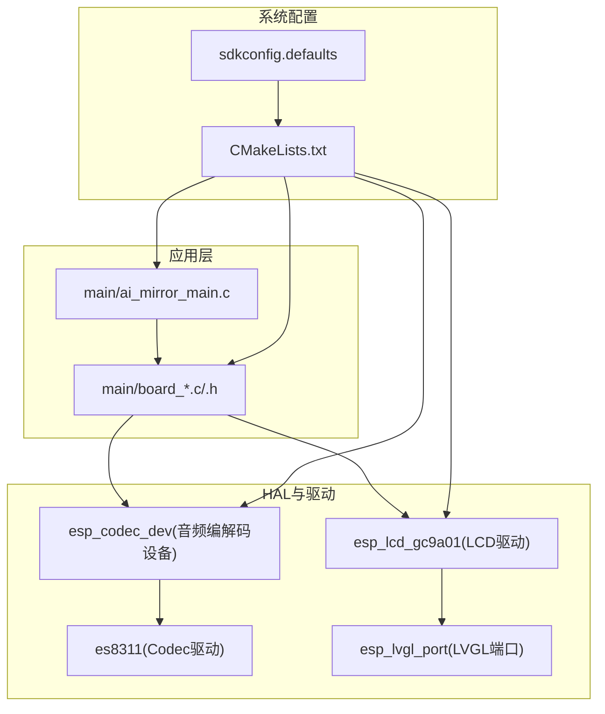
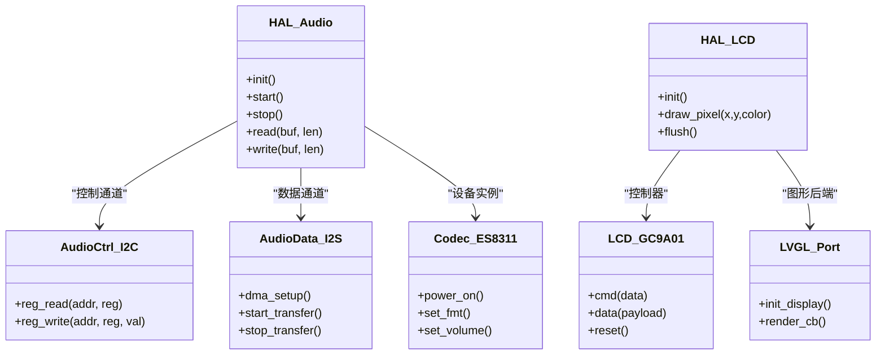
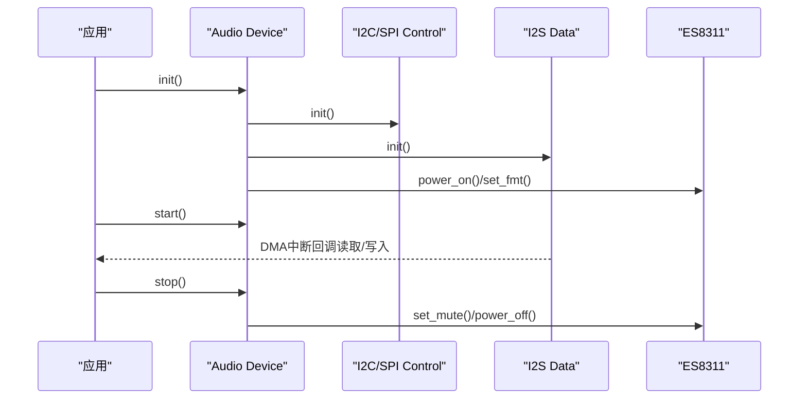
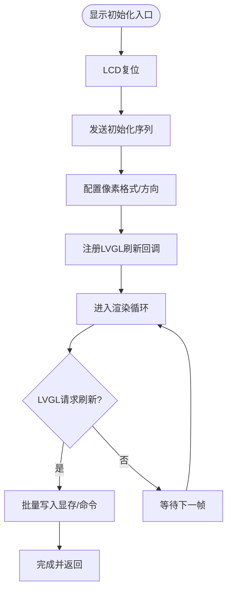
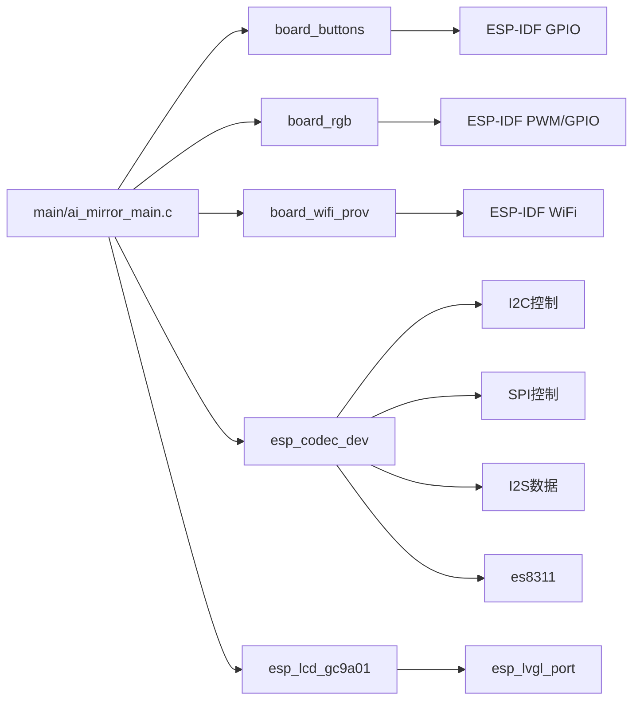

# 硬件抽象层

<cite>
**本文引用的文件**   
- [ai_mirror_main.c](file://Firmware/esp32_ai_mirror/main/ai_mirror_main.c)
- [board_buttons.c](file://Firmware/esp32_ai_mirror/main/board_buttons.c)
- [board_buttons.h](file://Firmware/esp32_ai_mirror/main/board_buttons.h)
- [board_rgb.c](file://Firmware/esp32_ai_mirror/main/board_rgb.c)
- [board_rgb.h](file://Firmware/esp32_ai_mirror/main/board_rgb.h)
- [board_wifi_prov.c](file://Firmware/esp32_ai_mirror/main/board_wifi_prov.c)
- [board_wifi_prov.h](file://Firmware/esp32_ai_mirror/main/board_wifi_prov.h)
- [esp_codec_dev.c](file://Firmware/esp32_ai_mirror/managed_components/espressif__esp_codec_dev/esp_codec_dev.c)
- [audio_codec_ctrl_i2c.c](file://Firmware/esp32_ai_mirror/managed_components/espressif__esp_codec_dev/platform/audio_codec_ctrl_i2c.c)
- [audio_codec_ctrl_spi.c](file://Firmware/esp32_ai_mirror/managed_components/espressif__esp_codec_dev/platform/audio_codec_ctrl_spi.c)
- [audio_codec_data_i2s.c](file://Firmware/esp32_ai_mirror/managed_components/espressif__esp_codec_dev/platform/audio_codec_data_i2s.c)
- [es8311.c](file://Firmware/esp32_ai_mirror/managed_components/espressif__es8311/es8311.c)
- [esp_lcd_gc9a01.c](file://Firmware/esp32_ai_mirror/managed_components/espressif__esp_lcd_gc9a01/esp_lcd_gc9a01.c)
- [esp_lvgl_port.c](file://Firmware/esp32_ai_mirror/managed_components/espressif__esp_lvgl_port/esp_lvgl_port.c)
- [CMakeLists.txt](file://Firmware/esp32_ai_mirror/CMakeLists.txt)
- [sdkconfig.defaults](file://Firmware/esp32_ai_mirror/sdkconfig.defaults)
</cite>

## 目录
1. [简介](#简介)
2. [项目结构](#项目结构)
3. [核心组件](#核心组件)
4. [架构总览](#架构总览)
5. [详细组件分析](#详细组件分析)
6. [依赖关系分析](#依赖关系分析)
7. [性能考量](#性能考量)
8. [故障检测与错误处理](#故障检测与错误处理)
9. [测试与模拟环境](#测试与模拟环境)
10. [结论](#结论)
11. [附录：移植指南](#附录移植指南)

## 简介
本文件面向ESP32 AI镜像项目的硬件抽象层（HAL），系统性阐述其设计原则、架构模式与实现要点，覆盖GPIO、I2C、SPI等底层接口的统一封装，以及音频编解码、显示驱动、触摸输入、板级资源管理等关键子系统。文档同时给出初始化顺序、资源管理与依赖处理策略，说明多平台适配与移植方法，并提供扩展接口、插件机制、故障检测与降级策略，以及测试方法与模拟环境搭建建议，帮助读者快速理解并高效扩展该HAL。

## 项目结构
本项目基于ESP-IDF构建，采用“应用层(main)”+“组件(managed_components)”的分层组织方式。HAL主要位于main目录的板级适配模块与managed_components中的外设驱动组件中，通过CMake与Kconfig进行配置与编译期选择。

图示来源
- [CMakeLists.txt](file://Firmware/esp32_ai_mirror/CMakeLists.txt)
- [sdkconfig.defaults](file://Firmware/esp32_ai_mirror/sdkconfig.defaults)

章节来源
- [CMakeLists.txt](file://Firmware/esp32_ai_mirror/CMakeLists.txt)
- [sdkconfig.defaults](file://Firmware/esp32_ai_mirror/sdkconfig.defaults)

## 核心组件
- 板级GPIO与按键：提供按键扫描、去抖、事件上报，屏蔽不同板子的引脚差异。
- RGB指示灯：统一的LED控制接口，支持颜色与状态指示。
- WiFi配网：封装WiFi配网流程，向上层暴露统一API。
- 音频子系统：基于esp_codec_dev抽象I2S数据通道与I2C/SPI控制通道，屏蔽具体Codec芯片差异。
- 显示子系统：基于esp_lcd_gc9a01驱动LCD，并通过esp_lvgl_port对接LVGL图形栈。

章节来源
- [board_buttons.c](file://Firmware/esp32_ai_mirror/main/board_buttons.c)
- [board_buttons.h](file://Firmware/esp32_ai_mirror/main/board_buttons.h)
- [board_rgb.c](file://Firmware/esp32_ai_mirror/main/board_rgb.c)
- [board_rgb.h](file://Firmware/esp32_ai_mirror/main/board_rgb.h)
- [board_wifi_prov.c](file://Firmware/esp32_ai_mirror/main/board_wifi_prov.c)
- [board_wifi_prov.h](file://Firmware/esp32_ai_mirror/main/board_wifi_prov.h)
- [esp_codec_dev.c](file://Firmware/esp32_ai_mirror/managed_components/espressif__esp_codec_dev/esp_codec_dev.c)
- [audio_codec_ctrl_i2c.c](file://Firmware/esp32_ai_mirror/managed_components/espressif__esp_codec_dev/platform/audio_codec_ctrl_i2c.c)
- [audio_codec_ctrl_spi.c](file://Firmware/esp32_ai_mirror/managed_components/espressif__esp_codec_dev/platform/audio_codec_ctrl_spi.c)
- [audio_codec_data_i2s.c](file://Firmware/esp32_ai_mirror/managed_components/espressif__esp_codec_dev/platform/audio_codec_data_i2s.c)
- [es8311.c](file://Firmware/esp32_ai_mirror/managed_components/espressif__es8311/es8311.c)
- [esp_lcd_gc9a01.c](file://Firmware/esp32_ai_mirror/managed_components/espressif__esp_lcd_gc9a01/esp_lcd_gc9a01.c)
- [esp_lvgl_port.c](file://Firmware/esp32_ai_mirror/managed_components/espressif__esp_lvgl_port/esp_lvgl_port.c)

## 架构总览
HAL采用“分层抽象 + 插件化”的架构：
- 抽象层：定义统一接口（如音频设备、LCD控制器、GPIO/按键、RGB、WiFi配网）。
- 适配层：针对具体芯片或板子实现上述接口（例如es8311、gc9a01、板级GPIO布局）。
- 调度层：管理初始化顺序、资源分配、依赖解析与错误恢复。
- 配置层：通过CMake/Kconfig在编译期选择功能与参数。

图示来源
- [esp_codec_dev.c](file://Firmware/esp32_ai_mirror/managed_components/espressif__esp_codec_dev/esp_codec_dev.c)
- [audio_codec_ctrl_i2c.c](file://Firmware/esp32_ai_mirror/managed_components/espressif__esp_codec_dev/platform/audio_codec_ctrl_i2c.c)
- [audio_codec_data_i2s.c](file://Firmware/esp32_ai_mirror/managed_components/espressif__esp_codec_dev/platform/audio_codec_data_i2s.c)
- [es8311.c](file://Firmware/esp32_ai_mirror/managed_components/espressif__es8311/es8311.c)
- [esp_lcd_gc9a01.c](file://Firmware/esp32_ai_mirror/managed_components/espressif__esp_lcd_gc9a01/esp_lcd_gc9a01.c)
- [esp_lvgl_port.c](file://Firmware/esp32_ai_mirror/managed_components/espressif__esp_lvgl_port/esp_lvgl_port.c)

## 详细组件分析

### 音频子系统（I2S + I2C/SPI + Codec）
- 抽象目标：将I2S数据流与I2C/SPI寄存器访问解耦，使上层仅依赖统一的音频设备接口。
- 关键路径：
  - 初始化：先完成I2C/SPI控制通道初始化，再初始化I2S数据通道，最后初始化Codec。
  - 运行：I2S DMA循环读写，I2C/SPI用于配置Codec寄存器。
  - 错误处理：对I2C/SPI读写失败、I2S DMA异常进行重试与降级（如降低采样率或关闭降噪）。
- 扩展点：新增Codec只需实现控制接口；新增数据通道需实现I2S相关回调。

图示来源
- [esp_codec_dev.c](file://Firmware/esp32_ai_mirror/managed_components/espressif__esp_codec_dev/esp_codec_dev.c)
- [audio_codec_ctrl_i2c.c](file://Firmware/esp32_ai_mirror/managed_components/espressif__esp_codec_dev/platform/audio_codec_ctrl_i2c.c)
- [audio_codec_ctrl_spi.c](file://Firmware/esp32_ai_mirror/managed_components/espressif__esp_codec_dev/platform/audio_codec_ctrl_spi.c)
- [audio_codec_data_i2s.c](file://Firmware/esp32_ai_mirror/managed_components/espressif__esp_codec_dev/platform/audio_codec_data_i2s.c)
- [es8311.c](file://Firmware/esp32_ai_mirror/managed_components/espressif__es8311/es8311.c)

章节来源
- [esp_codec_dev.c](file://Firmware/esp32_ai_mirror/managed_components/espressif__esp_codec_dev/esp_codec_dev.c)
- [audio_codec_ctrl_i2c.c](file://Firmware/esp32_ai_mirror/managed_components/espressif__esp_codec_dev/platform/audio_codec_ctrl_i2c.c)
- [audio_codec_ctrl_spi.c](file://Firmware/esp32_ai_mirror/managed_components/espressif__esp_codec_dev/platform/audio_codec_ctrl_spi.c)
- [audio_codec_data_i2s.c](file://Firmware/esp32_ai_mirror/managed_components/espressif__esp_codec_dev/platform/audio_codec_data_i2s.c)
- [es8311.c](file://Firmware/esp32_ai_mirror/managed_components/espressif__es8311/es8311.c)

### 显示子系统（LCD + LVGL）
- 抽象目标：屏蔽LCD控制器差异，为LVGL提供稳定的绘制与刷新接口。
- 关键路径：
  - 初始化：复位LCD -> 发送初始化序列 -> 配置像素格式与内存方向 -> 注册LVGL刷新回调。
  - 运行：LVGL调用刷新回调，底层通过SPI/I2C批量写显存或命令。
  - 错误处理：对通信超时进行重试，必要时回退到较低分辨率或帧率。
- 扩展点：新增LCD控制器需实现命令/数据发送与复位时序。

图示来源
- [esp_lcd_gc9a01.c](file://Firmware/esp32_ai_mirror/managed_components/espressif__esp_lcd_gc9a01/esp_lcd_gc9a01.c)
- [esp_lvgl_port.c](file://Firmware/esp32_ai_mirror/managed_components/espressif__esp_lvgl_port/esp_lvgl_port.c)

章节来源
- [esp_lcd_gc9a01.c](file://Firmware/esp32_ai_mirror/managed_components/espressif__esp_lcd_gc9a01/esp_lcd_gc9a01.c)
- [esp_lvgl_port.c](file://Firmware/esp32_ai_mirror/managed_components/espressif__esp_lvgl_port/esp_lvgl_port.c)

### GPIO与按键（板级抽象）
- 抽象目标：统一按键扫描、去抖、事件上报，屏蔽不同板子的引脚布局差异。
- 关键路径：
  - 初始化：配置GPIO输入上拉/下拉、中断或轮询。
  - 运行：周期性扫描，去抖后生成按键事件。
  - 错误处理：对无法读到的引脚进行告警，提供默认行为。
- 扩展点：新增按键只需在板级配置中声明引脚与映射。

章节来源
- [board_buttons.c](file://Firmware/esp32_ai_mirror/main/board_buttons.c)
- [board_buttons.h](file://Firmware/esp32_ai_mirror/main/board_buttons.h)

### RGB指示灯（板级抽象）
- 抽象目标：统一设置颜色与状态，屏蔽不同板子的LED驱动差异。
- 关键路径：
  - 初始化：配置PWM或GPIO输出。
  - 运行：根据系统状态更新颜色/闪烁频率。
  - 错误处理：若驱动不可用则回退到单色闪烁。
- 扩展点：新增LED类型需实现对应控制接口。

章节来源
- [board_rgb.c](file://Firmware/esp32_ai_mirror/main/board_rgb.c)
- [board_rgb.h](file://Firmware/esp32_ai_mirror/main/board_rgb.h)

### WiFi配网（板级抽象）
- 抽象目标：封装WiFi配网流程，向上层暴露统一API。
- 关键路径：
  - 初始化：启动配网服务与事件回调。
  - 运行：监听配网事件，成功后保存配置。
  - 错误处理：超时重试、网络不可达降级提示。
- 扩展点：新增配网方式（如BLE）可插拔接入。

章节来源
- [board_wifi_prov.c](file://Firmware/esp32_ai_mirror/main/board_wifi_prov.c)
- [board_wifi_prov.h](file://Firmware/esp32_ai_mirror/main/board_wifi_prov.h)

## 依赖关系分析
- 编译期依赖：CMakeLists.txt决定哪些组件参与构建；sdkconfig.defaults提供默认配置项。
- 运行时依赖：
  - 音频：I2C/SPI控制通道 -> I2S数据通道 -> Codec设备。
  - 显示：LCD控制器 -> LVGL端口。
  - 板级：GPIO/按键、RGB、WiFi配网由应用层按需初始化。
- 耦合度：HAL通过接口解耦，新增设备不影响既有模块；配置集中在CMake/Kconfig。

图示来源
- [CMakeLists.txt](file://Firmware/esp32_ai_mirror/CMakeLists.txt)
- [sdkconfig.defaults](file://Firmware/esp32_ai_mirror/sdkconfig.defaults)
- [esp_codec_dev.c](file://Firmware/esp32_ai_mirror/managed_components/espressif__esp_codec_dev/esp_codec_dev.c)
- [audio_codec_ctrl_i2c.c](file://Firmware/esp32_ai_mirror/managed_components/espressif__esp_codec_dev/platform/audio_codec_ctrl_i2c.c)
- [audio_codec_ctrl_spi.c](file://Firmware/esp32_ai_mirror/managed_components/espressif__esp_codec_dev/platform/audio_codec_ctrl_spi.c)
- [audio_codec_data_i2s.c](file://Firmware/esp32_ai_mirror/managed_components/espressif__esp_codec_dev/platform/audio_codec_data_i2s.c)
- [es8311.c](file://Firmware/esp32_ai_mirror/managed_components/espressif__es8311/es8311.c)
- [esp_lcd_gc9a01.c](file://Firmware/esp32_ai_mirror/managed_components/espressif__esp_lcd_gc9a01/esp_lcd_gc9a01.c)
- [esp_lvgl_port.c](file://Firmware/esp32_ai_mirror/managed_components/espressif__esp_lvgl_port/esp_lvgl_port.c)

章节来源
- [CMakeLists.txt](file://Firmware/esp32_ai_mirror/CMakeLists.txt)
- [sdkconfig.defaults](file://Firmware/esp32_ai_mirror/sdkconfig.defaults)

## 性能考量
- 音频：
  - 使用DMA传输减少CPU占用；合理设置缓冲区大小以降低延迟与丢包风险。
  - I2C/SPI寄存器访问批量合并，避免频繁总线操作。
- 显示：
  - 批量写入显存，减少命令次数；按区域刷新降低带宽压力。
  - 根据屏幕尺寸与帧率调整LVGL刷新频率。
- 功耗：
  - 空闲时关闭非必要外设电源；动态调节采样率与刷新率。

[本节为通用指导，不直接分析具体文件]

## 故障检测与错误处理
- 检测策略：
  - 通信层：I2C/SPI读写失败计数与超时阈值；I2S DMA异常回调。
  - 设备层：Codec寄存器校验、LCD初始化序列响应检查。
  - 系统层：资源耗尽告警（内存、句柄）、任务堆栈监控。
- 错误处理：
  - 重试与退避：指数退避重试，达到上限后降级。
  - 降级策略：降低音频采样率/位深、降低显示分辨率/帧率、关闭非关键功能。
  - 恢复策略：热重启特定子系统（如重新枚举I2C设备）、冷重启整机。
- 日志与诊断：
  - 分级日志（调试/信息/警告/错误）；关键路径打点统计耗时。
  - 导出健康状态（传感器在线、设备就绪、错误码）。

章节来源
- [esp_codec_dev.c](file://Firmware/esp32_ai_mirror/managed_components/espressif__esp_codec_dev/esp_codec_dev.c)
- [audio_codec_ctrl_i2c.c](file://Firmware/esp32_ai_mirror/managed_components/espressif__esp_codec_dev/platform/audio_codec_ctrl_i2c.c)
- [audio_codec_ctrl_spi.c](file://Firmware/esp32_ai_mirror/managed_components/espressif__esp_codec_dev/platform/audio_codec_ctrl_spi.c)
- [audio_codec_data_i2s.c](file://Firmware/esp32_ai_mirror/managed_components/espressif__esp_codec_dev/platform/audio_codec_data_i2s.c)
- [esp_lcd_gc9a01.c](file://Firmware/esp32_ai_mirror/managed_components/espressif__esp_lcd_gc9a01/esp_lcd_gc9a01.c)

## 测试与模拟环境
- 单元测试：
  - 对HAL接口编写Mock实现（如模拟I2C/SPI读写、I2S缓冲），验证逻辑分支与错误路径。
- 集成测试：
  - 在真实板子上执行端到端流程（按键->音频->显示），记录指标与日志。
- 模拟环境：
  - 使用QEMU或ESP-IDF仿真器运行部分逻辑；对通信层注入错误（超时、CRC错误）以验证健壮性。
- 自动化：
  - 结合pytest或CI脚本自动执行用例，收集覆盖率与性能数据。

[本节为通用指导，不直接分析具体文件]

## 结论
该HAL通过清晰的层次划分与插件化设计，有效屏蔽了底层硬件差异，提升了代码复用性与可维护性。音频与显示子系统分别围绕I2S/I2C/SPI与LCD控制器进行抽象，配合CMake/Kconfig的配置能力，实现了良好的跨平台适配。建议在后续迭代中完善错误恢复与性能监控，持续优化资源占用与稳定性。

[本节为总结，不直接分析具体文件]

## 附录：移植指南
- 新增板级GPIO/按键/RGB：
  - 在板级头文件中声明引脚映射，实现对应的初始化与控制函数。
- 新增Codec：
  - 实现控制接口（I2C/SPI寄存器读写），并在音频设备配置中注册。
- 新增LCD控制器：
  - 实现命令/数据发送与复位时序，注册LVGL刷新回调。
- 配置与构建：
  - 在CMakeLists.txt中添加新组件；在sdkconfig.defaults中补充默认配置项。
- 验证步骤：
  - 先跑通最小可用路径（如按键->LED），再逐步加入音频与显示。
  - 使用日志与诊断工具定位问题，确保错误路径健壮。

章节来源
- [CMakeLists.txt](file://Firmware/esp32_ai_mirror/CMakeLists.txt)
- [sdkconfig.defaults](file://Firmware/esp32_ai_mirror/sdkconfig.defaults)
- [board_buttons.c](file://Firmware/esp32_ai_mirror/main/board_buttons.c)
- [board_rgb.c](file://Firmware/esp32_ai_mirror/main/board_rgb.c)
- [es8311.c](file://Firmware/esp32_ai_mirror/managed_components/espressif__es8311/es8311.c)
- [esp_lcd_gc9a01.c](file://Firmware/esp32_ai_mirror/managed_components/espressif__esp_lcd_gc9a01/esp_lcd_gc9a01.c)