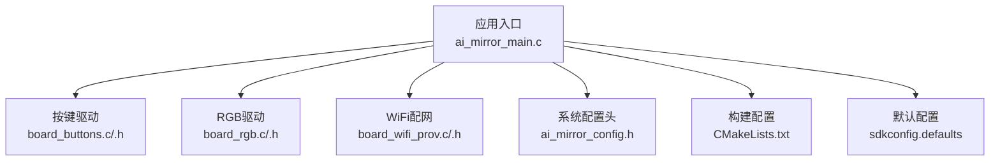
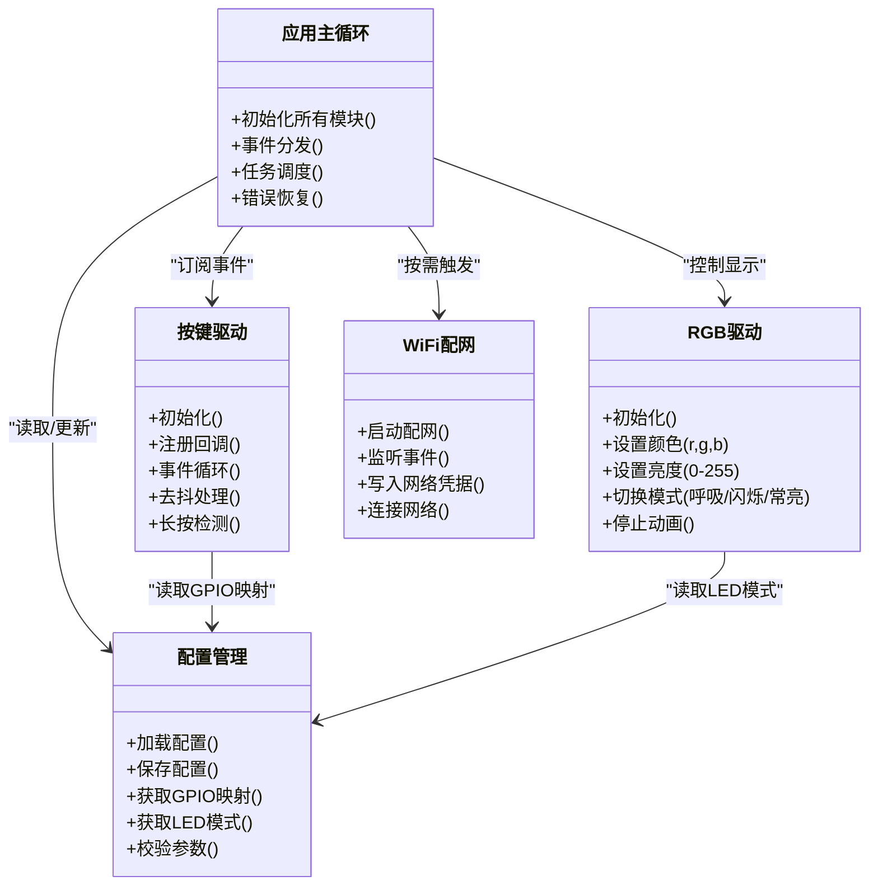
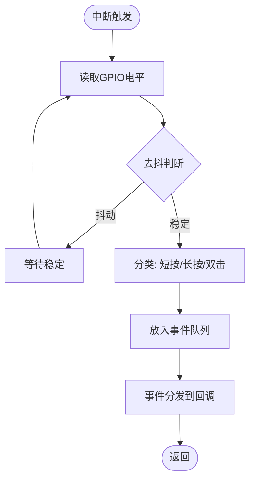
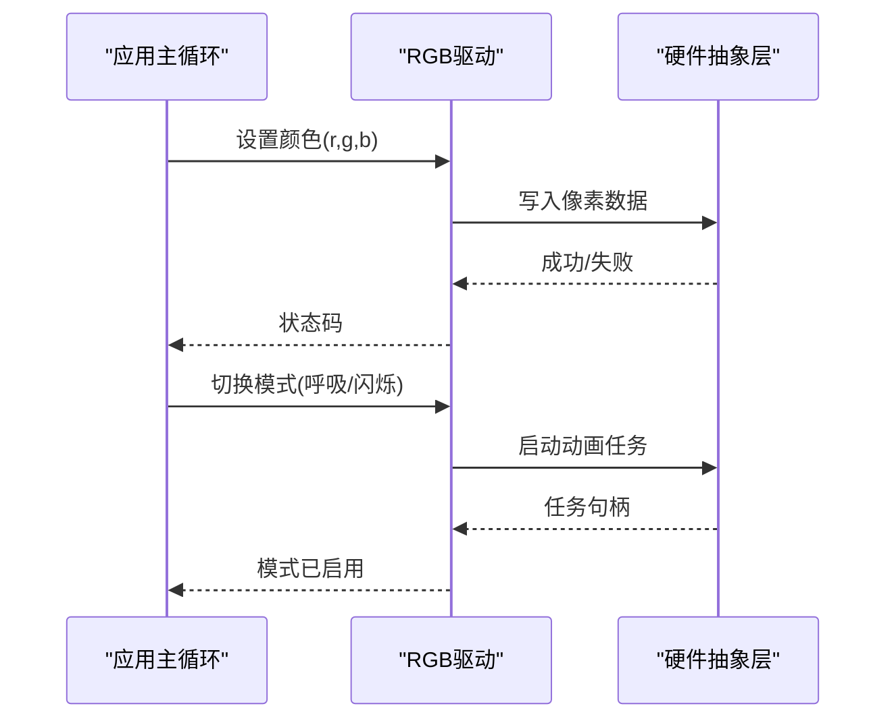
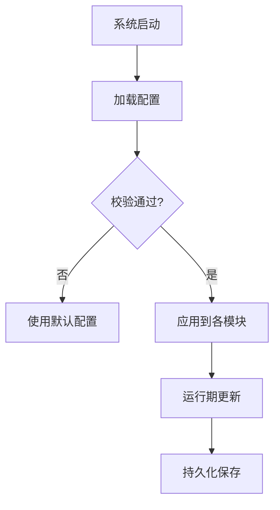
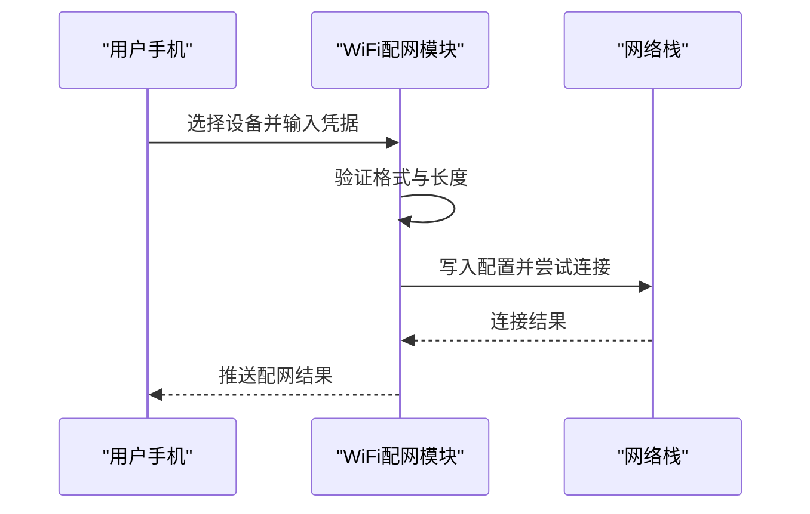
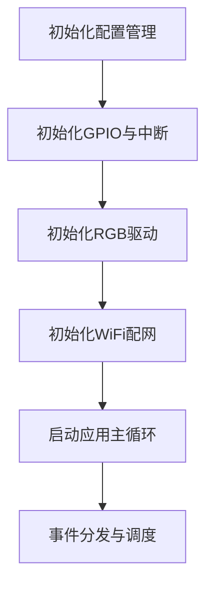
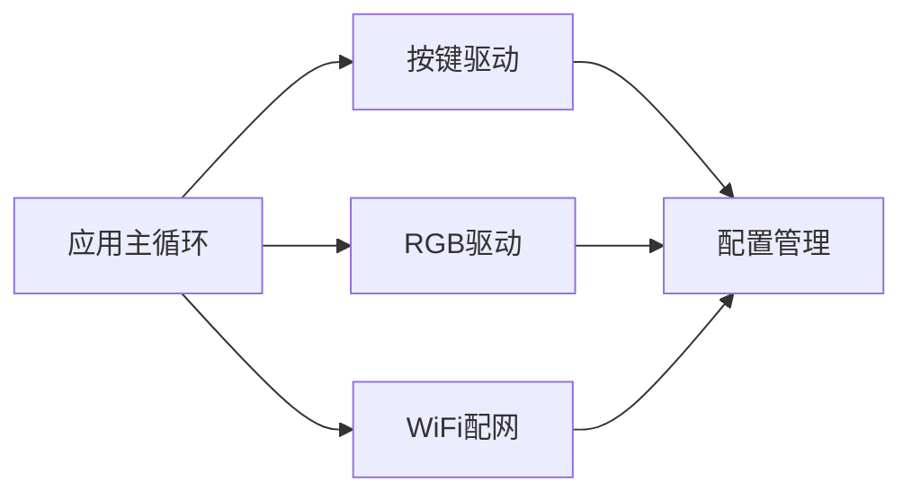

# 系统组件

<cite>
**本文引用的文件**   
- [ai_mirror_main.c](file://Firmware/esp32_ai_mirror/main/ai_mirror_main.c)
- [ai_mirror_config.h](file://Firmware/esp32_ai_mirror/main/ai_mirror_config.h)
- [board_buttons.c](file://Firmware/esp32_ai_mirror/main/board_buttons.c)
- [board_buttons.h](file://Firmware/esp32_ai_mirror/main/board_buttons.h)
- [board_rgb.c](file://Firmware/esp32_ai_mirror/main/board_rgb.c)
- [board_rgb.h](file://Firmware/esp32_ai_mirror/main/board_rgb.h)
- [board_wifi_prov.c](file://Firmware/esp32_ai_mirror/main/board_wifi_prov.c)
- [board_wifi_prov.h](file://Firmware/esp32_ai_mirror/main/board_wifi_prov.h)
- [CMakeLists.txt](file://Firmware/esp32_ai_mirror/CMakeLists.txt)
- [sdkconfig.defaults](file://Firmware/esp32_ai_mirror/sdkconfig.defaults)
</cite>

## 目录
1. [简介](#简介)
2. [项目结构](#项目结构)
3. [核心组件](#核心组件)
4. [架构总览](#架构总览)
5. [详细组件分析](#详细组件分析)
6. [依赖分析](#依赖分析)
7. [性能考虑](#性能考虑)
8. [故障排查指南](#故障排查指南)
9. [结论](#结论)
10. [附录](#附录)

## 简介
本文件面向AI镜子系统的嵌入式固件，聚焦以下目标：按键输入处理、RGB LED控制与系统配置管理；详细说明GPIO引脚配置、中断处理与事件分发机制；解释LED状态指示模式与用户反馈设计；给出系统配置文件结构与参数说明；提供硬件抽象层接口定义与扩展方法；说明组件间通信协议与数据同步机制；并梳理组件初始化顺序与资源依赖管理。文档力求在技术细节与可读性之间取得平衡，便于不同背景的读者理解与扩展。

## 项目结构
本项目基于ESP-IDF构建，核心应用位于main目录，包含主控入口、按键驱动、RGB驱动、WiFi配网模块以及系统配置头文件。构建系统与默认配置分别由CMakeLists.txt与sdkconfig.defaults管理。

图表来源
- [ai_mirror_main.c](file://Firmware/esp32_ai_mirror/main/ai_mirror_main.c)
- [board_buttons.c](file://Firmware/esp32_ai_mirror/main/board_buttons.c)
- [board_buttons.h](file://Firmware/esp32_ai_mirror/main/board_buttons.h)
- [board_rgb.c](file://Firmware/esp32_ai_mirror/main/board_rgb.c)
- [board_rgb.h](file://Firmware/esp32_ai_mirror/main/board_rgb.h)
- [board_wifi_prov.c](file://Firmware/esp32_ai_mirror/main/board_wifi_prov.c)
- [board_wifi_prov.h](file://Firmware/esp32_ai_mirror/main/board_wifi_prov.h)
- [ai_mirror_config.h](file://Firmware/esp32_ai_mirror/main/ai_mirror_config.h)
- [CMakeLists.txt](file://Firmware/esp32_ai_mirror/CMakeLists.txt)
- [sdkconfig.defaults](file://Firmware/esp32_ai_mirror/sdkconfig.defaults)

章节来源
- [CMakeLists.txt](file://Firmware/esp32_ai_mirror/CMakeLists.txt)
- [sdkconfig.defaults](file://Firmware/esp32_ai_mirror/sdkconfig.defaults)

## 核心组件
- 按键输入处理：负责GPIO扫描或中断采集、去抖、事件封装与分发，支持多键映射与长按/短按识别。
- RGB LED控制：通过PWM或WS2812等接口输出颜色与亮度，提供状态指示与动画效果，屏蔽底层差异。
- 系统配置管理：集中管理GPIO引脚、中断优先级、LED模式、网络与功能开关等参数，提供读写与持久化接口。
- WiFi配网：提供设备发现与临时热点配网流程，完成网络凭据下发与连接建立。

章节来源
- [board_buttons.c](file://Firmware/esp32_ai_mirror/main/board_buttons.c)
- [board_buttons.h](file://Firmware/esp32_ai_mirror/main/board_buttons.h)
- [board_rgb.c](file://Firmware/esp32_ai_mirror/main/board_rgb.c)
- [board_rgb.h](file://Firmware/esp32_ai_mirror/main/board_rgb.h)
- [ai_mirror_config.h](file://Firmware/esp32_ai_mirror/main/ai_mirror_config.h)
- [board_wifi_prov.c](file://Firmware/esp32_ai_mirror/main/board_wifi_prov.c)
- [board_wifi_prov.h](file://Firmware/esp32_ai_mirror/main/board_wifi_prov.h)

## 架构总览
整体采用“驱动层—抽象层—业务层”的分层架构。驱动层对接具体GPIO/PWM/中断等外设；抽象层统一API（如按键事件、LED状态）；业务层协调各模块并按需调度。

图表来源
- [ai_mirror_main.c](file://Firmware/esp32_ai_mirror/main/ai_mirror_main.c)
- [board_buttons.c](file://Firmware/esp32_ai_mirror/main/board_buttons.c)
- [board_buttons.h](file://Firmware/esp32_ai_mirror/main/board_buttons.h)
- [board_rgb.c](file://Firmware/esp32_ai_mirror/main/board_rgb.c)
- [board_rgb.h](file://Firmware/esp32_ai_mirror/main/board_rgb.h)
- [ai_mirror_config.h](file://Firmware/esp32_ai_mirror/main/ai_mirror_config.h)
- [board_wifi_prov.c](file://Firmware/esp32_ai_mirror/main/board_wifi_prov.c)
- [board_wifi_prov.h](file://Firmware/esp32_ai_mirror/main/board_wifi_prov.h)

## 详细组件分析

### 按键输入处理
- GPIO配置：根据配置头中的引脚映射初始化输入引脚，支持上拉/下拉与中断边沿触发。
- 中断与轮询：优先使用中断捕获边沿变化，结合定时器进行去抖与长按判定，降低CPU占用。
- 事件模型：将物理按键映射为逻辑事件（短按、长按、双击），通过回调或消息队列分发给上层。
- 扩展点：新增按键只需在配置中增加映射，并在驱动注册表中添加条目即可。

图表来源
- [board_buttons.c](file://Firmware/esp32_ai_mirror/main/board_buttons.c)
- [board_buttons.h](file://Firmware/esp32_ai_mirror/main/board_buttons.h)
- [ai_mirror_config.h](file://Firmware/esp32_ai_mirror/main/ai_mirror_config.h)

章节来源
- [board_buttons.c](file://Firmware/esp32_ai_mirror/main/board_buttons.c)
- [board_buttons.h](file://Firmware/esp32_ai_mirror/main/board_buttons.h)
- [ai_mirror_config.h](file://Firmware/esp32_ai_mirror/main/ai_mirror_config.h)

### RGB LED控制
- 接口抽象：提供统一的设置颜色、亮度与模式切换接口，屏蔽WS2812/PWM等实现差异。
- 状态指示：定义待机、工作、错误、配网等状态对应的颜色与动画，确保用户可感知系统行为。
- 动画与性能：动画在独立任务或定时器中执行，避免阻塞主循环；支持动态切换与平滑过渡。
- 扩展点：新增LED类型仅需实现底层写时序，并在抽象层注册新驱动。

图表来源
- [board_rgb.c](file://Firmware/esp32_ai_mirror/main/board_rgb.c)
- [board_rgb.h](file://Firmware/esp32_ai_mirror/main/board_rgb.h)

章节来源
- [board_rgb.c](file://Firmware/esp32_ai_mirror/main/board_rgb.c)
- [board_rgb.h](file://Firmware/esp32_ai_mirror/main/board_rgb.h)

### 系统配置管理
- 配置结构：集中定义GPIO映射、中断优先级、LED模式、网络参数与功能开关等字段。
- 加载与保存：启动时从非易失存储加载默认或用户配置；运行时允许热更新并持久化。
- 校验与回退：对非法值进行校验，必要时回退到安全默认值，保证系统稳定性。
- 访问接口：提供只读查询与受保护的写入接口，避免并发冲突。

图表来源
- [ai_mirror_config.h](file://Firmware/esp32_ai_mirror/main/ai_mirror_config.h)
- [sdkconfig.defaults](file://Firmware/esp32_ai_mirror/sdkconfig.defaults)

章节来源
- [ai_mirror_config.h](file://Firmware/esp32_ai_mirror/main/ai_mirror_config.h)
- [sdkconfig.defaults](file://Firmware/esp32_ai_mirror/sdkconfig.defaults)

### WiFi配网
- 流程概述：设备进入配网模式，广播临时热点或二维码，接收SSID与密码后保存并连接。
- 事件驱动：通过事件通知配网进度（开始、成功、失败），供UI与日志记录。
- 安全策略：限制配网时长与重试次数，防止资源耗尽。

图表来源
- [board_wifi_prov.c](file://Firmware/esp32_ai_mirror/main/board_wifi_prov.c)
- [board_wifi_prov.h](file://Firmware/esp32_ai_mirror/main/board_wifi_prov.h)

章节来源
- [board_wifi_prov.c](file://Firmware/esp32_ai_mirror/main/board_wifi_prov.c)
- [board_wifi_prov.h](file://Firmware/esp32_ai_mirror/main/board_wifi_prov.h)

### 组件初始化顺序与资源依赖
- 初始化顺序建议：先初始化配置管理，再初始化GPIO与中断，随后初始化LED与WiFi配网，最后启动应用主循环与事件分发。
- 资源依赖：按键与LED依赖GPIO与定时器；WiFi配网依赖网络栈与存储；应用主循环依赖以上模块就绪。
- 错误处理：任一关键模块初始化失败应回滚已分配资源并上报错误，避免部分就绪导致的不一致。

图表来源
- [ai_mirror_main.c](file://Firmware/esp32_ai_mirror/main/ai_mirror_main.c)
- [ai_mirror_config.h](file://Firmware/esp32_ai_mirror/main/ai_mirror_config.h)
- [board_buttons.c](file://Firmware/esp32_ai_mirror/main/board_buttons.c)
- [board_rgb.c](file://Firmware/esp32_ai_mirror/main/board_rgb.c)
- [board_wifi_prov.c](file://Firmware/esp32_ai_mirror/main/board_wifi_prov.c)

章节来源
- [ai_mirror_main.c](file://Firmware/esp32_ai_mirror/main/ai_mirror_main.c)

## 依赖分析
- 模块耦合：应用主循环作为协调者，低耦合地调用各驱动；驱动之间不直接依赖，通过配置与事件解耦。
- 外部依赖：ESP-IDF的GPIO、中断、定时器、网络栈与存储接口；第三方库（如LVGL、音频编解码）在本项目中未直接参与按键与LED路径。
- 潜在循环依赖：应避免驱动层反向依赖应用层，仅通过回调或事件总线通信。

图表来源
- [ai_mirror_main.c](file://Firmware/esp32_ai_mirror/main/ai_mirror_main.c)
- [board_buttons.c](file://Firmware/esp32_ai_mirror/main/board_buttons.c)
- [board_rgb.c](file://Firmware/esp32_ai_mirror/main/board_rgb.c)
- [board_wifi_prov.c](file://Firmware/esp32_ai_mirror/main/board_wifi_prov.c)
- [ai_mirror_config.h](file://Firmware/esp32_ai_mirror/main/ai_mirror_config.h)

章节来源
- [ai_mirror_main.c](file://Firmware/esp32_ai_mirror/main/ai_mirror_main.c)
- [ai_mirror_config.h](file://Firmware/esp32_ai_mirror/main/ai_mirror_config.h)

## 性能考虑
- 中断与去抖：使用硬件中断减少轮询开销，软件去抖阈值可调以平衡响应速度与误触发率。
- LED动画：在独立任务或定时器中执行，避免阻塞主循环；批量更新像素以减少总线占用。
- 配置读写：批量更新与最小化持久化频率，避免频繁擦写非易失存储。
- 内存与任务：合理划分任务栈大小，避免堆碎片；关键路径使用静态缓冲。

[本节为通用指导，不涉及具体文件分析]

## 故障排查指南
- 按键无响应：检查GPIO映射是否正确、中断是否启用、去抖时间是否过长；查看事件队列是否溢出。
- LED异常：确认驱动初始化成功、数据总线时序正确、亮度上限未超限；观察动画任务是否被抢占。
- 配网失败：检查网络凭据格式、路由器兼容性、信号强度；查看事件回调是否收到失败原因。
- 配置损坏：恢复默认配置并重新生成；校验校验和与版本兼容。

章节来源
- [board_buttons.c](file://Firmware/esp32_ai_mirror/main/board_buttons.c)
- [board_rgb.c](file://Firmware/esp32_ai_mirror/main/board_rgb.c)
- [board_wifi_prov.c](file://Firmware/esp32_ai_mirror/main/board_wifi_prov.c)
- [ai_mirror_config.h](file://Firmware/esp32_ai_mirror/main/ai_mirror_config.h)

## 结论
本AI镜子系统通过分层架构与清晰的抽象接口，实现了按键输入、RGB LED控制与系统配置的模块化与可扩展性。借助中断与事件机制，系统在保持低功耗的同时提供了良好的交互体验。合理的初始化顺序与资源依赖管理确保了稳定性与可维护性。未来可在驱动抽象层进一步扩展更多外设类型，并通过统一的事件总线增强模块间协作。

[本节为总结性内容，不涉及具体文件分析]

## 附录
- 硬件抽象层接口定义要点：
  - 按键：初始化、注册回调、事件循环、去抖与长按检测。
  - LED：初始化、设置颜色与亮度、切换模式、停止动画。
  - 配置：加载/保存、获取映射、校验参数。
  - WiFi配网：启动配网、监听事件、写入凭据、连接网络。
- 扩展方法：
  - 新增按键：在配置中添加映射，在驱动注册表登记，无需修改其他模块。
  - 新增LED类型：实现底层写时序，在抽象层注册新驱动，复用统一API。
  - 新增配置项：在配置头中扩展结构体，提供读写与校验逻辑。
- 数据同步机制：
  - 事件队列与回调：按键事件通过队列传递，避免竞态条件。
  - 任务隔离：LED动画与网络操作在独立任务中执行，主循环专注调度。
  - 配置一致性：读写加锁或临界区保护，确保多线程安全。

[本节为补充信息，不涉及具体文件分析]