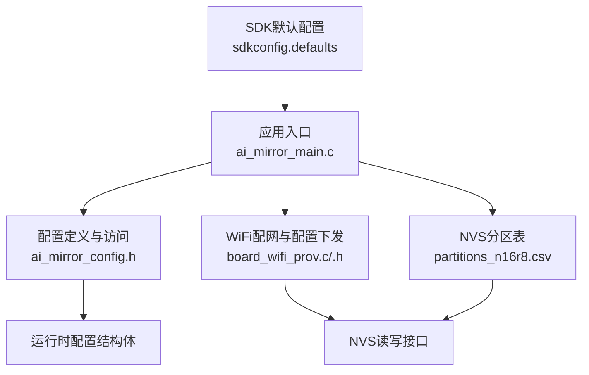
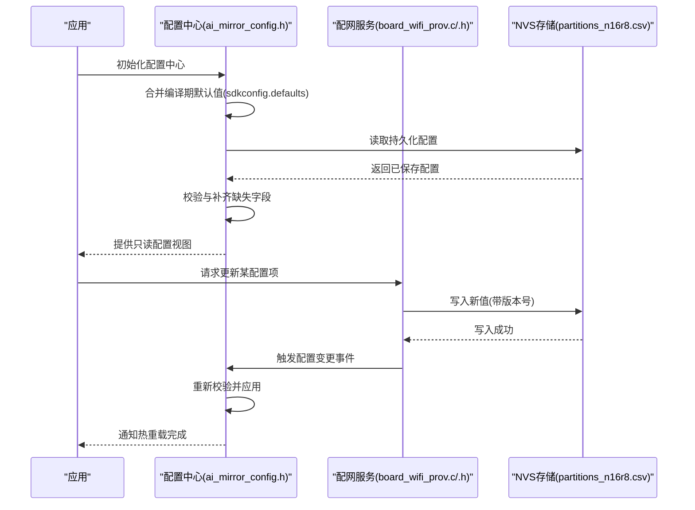
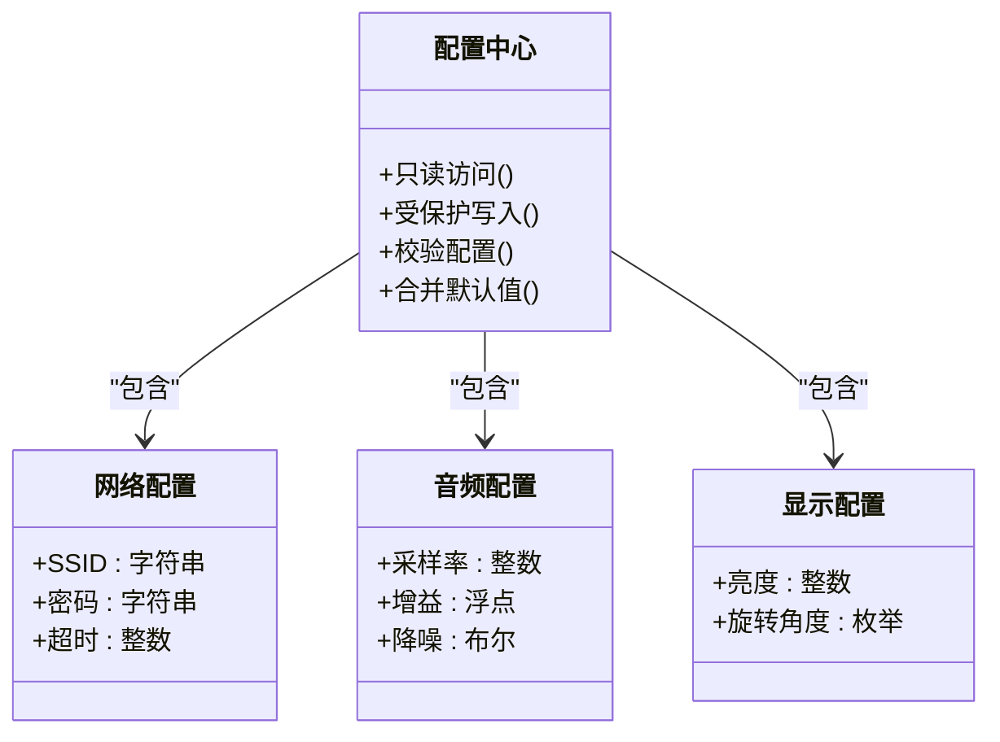
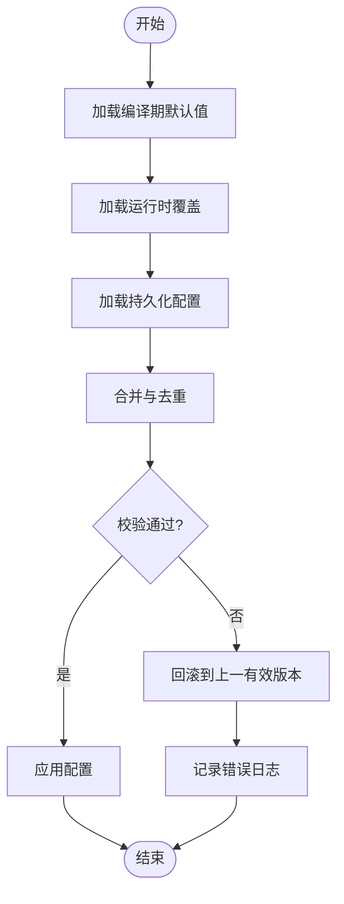
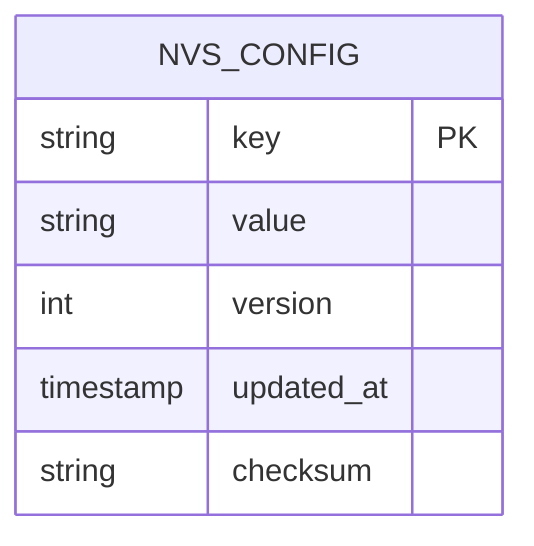
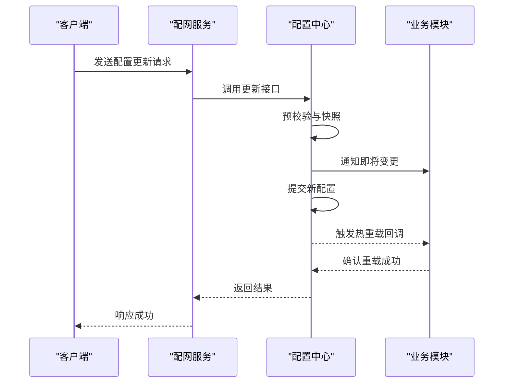
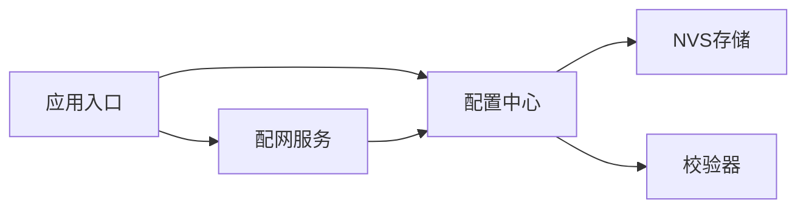

# 系统配置管理

<cite>
**本文引用的文件**   
- [ai_mirror_config.h](file://Firmware/esp32_ai_mirror/main/ai_mirror_config.h)
- [ai_mirror_main.c](file://Firmware/esp32_ai_mirror/main/ai_mirror_main.c)
- [board_wifi_prov.c](file://Firmware/esp32_ai_mirror/main/board_wifi_prov.c)
- [board_wifi_prov.h](file://Firmware/esp32_ai_mirror/main/board_wifi_prov.h)
- [sdkconfig.defaults](file://Firmware/esp32_ai_mirror/sdkconfig.defaults)
- [partitions_n16r8.csv](file://Firmware/esp32_ai_mirror/partitions_n16r8.csv)
</cite>

## 目录
1. [简介](#简介)
2. [项目结构](#项目结构)
3. [核心组件](#核心组件)
4. [架构总览](#架构总览)
5. [详细组件分析](#详细组件分析)
6. [依赖关系分析](#依赖关系分析)
7. [性能考虑](#性能考虑)
8. [故障排查指南](#故障排查指南)
9. [结论](#结论)
10. [附录](#附录)

## 简介
本章节概述系统配置管理模块的目标与范围。该模块负责：
- 定义并维护系统运行所需的各类配置项（编译期、运行时、持久化）
- 提供配置的加载、校验、默认值合并与优先级规则
- 实现配置的持久化存储与版本兼容迁移
- 支持动态更新与热重载，确保服务不中断
- 为新增配置项提供清晰的扩展点与验证规则

## 项目结构
本项目基于 ESP-IDF，配置来源包括：
- 编译期配置：Kconfig/sdconfig（由 sdkconfig.defaults 提供默认值）
- 运行时配置：C 结构体与头文件集中管理
- 持久化配置：NVS 分区（通过 partitions 表划分）

**图表来源** 
- [ai_mirror_main.c](file://Firmware/esp32_ai_mirror/main/ai_mirror_main.c)
- [ai_mirror_config.h](file://Firmware/esp32_ai_mirror/main/ai_mirror_config.h)
- [board_wifi_prov.c](file://Firmware/esp32_ai_mirror/main/board_wifi_prov.c)
- [board_wifi_prov.h](file://Firmware/esp32_ai_mirror/main/board_wifi_prov.h)
- [sdkconfig.defaults](file://Firmware/esp32_ai_mirror/sdkconfig.defaults)
- [partitions_n16r8.csv](file://Firmware/esp32_ai_mirror/partitions_n16r8.csv)

**章节来源**
- [ai_mirror_main.c](file://Firmware/esp32_ai_mirror/main/ai_mirror_main.c)
- [ai_mirror_config.h](file://Firmware/esp32_ai_mirror/main/ai_mirror_config.h)
- [board_wifi_prov.c](file://Firmware/esp32_ai_mirror/main/board_wifi_prov.c)
- [board_wifi_prov.h](file://Firmware/esp32_ai_mirror/main/board_wifi_prov.h)
- [sdkconfig.defaults](file://Firmware/esp32_ai_mirror/sdkconfig.defaults)
- [partitions_n16r8.csv](file://Firmware/esp32_ai_mirror/partitions_n16r8.csv)

## 核心组件
- 配置定义与访问层
  - 职责：集中声明配置项、类型、默认值、取值范围与注释说明；提供统一的读取/写入接口
  - 关键点：命名规范、作用域（全局/模块）、可见性控制
- 配置加载与校验层
  - 职责：从多源（编译期、运行时、持久化）合并配置，执行合法性校验，失败回退到默认值
  - 关键点：加载顺序、冲突解决、错误上报
- 持久化存储层
  - 职责：将运行时配置安全地写入 NVS，保证断电可恢复
  - 关键点：分区规划、键名设计、事务与原子性、版本标记
- 动态更新与热重载层
  - 职责：监听配置变更事件，触发局部或全局热重载，避免重启
  - 关键点：并发安全、回调机制、回滚策略

**章节来源**
- [ai_mirror_config.h](file://Firmware/esp32_ai_mirror/main/ai_mirror_config.h)
- [board_wifi_prov.c](file://Firmware/esp32_ai_mirror/main/board_wifi_prov.c)
- [board_wifi_prov.h](file://Firmware/esp32_ai_mirror/main/board_wifi_prov.h)

## 架构总览
下图展示配置在系统中的流转路径：启动时从多源加载并校验，运行时通过统一接口访问，持久化层负责落盘，动态更新通过事件驱动完成热重载。

**图表来源** 
- [ai_mirror_main.c](file://Firmware/esp32_ai_mirror/main/ai_mirror_main.c)
- [ai_mirror_config.h](file://Firmware/esp32_ai_mirror/main/ai_mirror_config.h)
- [board_wifi_prov.c](file://Firmware/esp32_ai_mirror/main/board_wifi_prov.c)
- [board_wifi_prov.h](file://Firmware/esp32_ai_mirror/main/board_wifi_prov.h)
- [sdkconfig.defaults](file://Firmware/esp32_ai_mirror/sdkconfig.defaults)
- [partitions_n16r8.csv](file://Firmware/esp32_ai_mirror/partitions_n16r8.csv)

## 详细组件分析

### 配置定义与访问层（ai_mirror_config.h）
- 设计要点
  - 使用结构体聚合相关配置项，按功能域分组（如网络、音频、显示等）
  - 每个字段附带默认值、取值范围、单位与注释
  - 提供只读访问接口与受保护的写入接口，防止非法修改
- 数据类型与约束
  - 基础类型：整型、浮点、布尔、字符串、枚举
  - 复合类型：数组、嵌套结构体
  - 约束：最小/最大值、必填项、格式校验（如IP、URL、MAC）
- 作用域与可见性
  - 全局配置：系统级参数，跨模块共享
  - 模块配置：限定于特定模块内部使用
  - 私有配置：仅对当前文件可见

**图表来源** 
- [ai_mirror_config.h](file://Firmware/esp32_ai_mirror/main/ai_mirror_config.h)

**章节来源**
- [ai_mirror_config.h](file://Firmware/esp32_ai_mirror/main/ai_mirror_config.h)

### 配置加载与校验流程
- 加载顺序
  1. 编译期默认值（来自 Kconfig/sdconfig.defaults）
  2. 运行时覆盖（命令行参数、环境变量或内存注入）
  3. 持久化配置（NVS）
  4. 最终合并结果进行校验
- 校验规则
  - 类型检查、范围检查、依赖关系检查（如开启某功能需满足最低硬件能力）
  - 失败处理：记录错误、回退到上一有效版本或默认值
- 错误恢复
  - 自动回滚到上次已知良好配置
  - 提供诊断信息便于定位问题

**图表来源** 
- [ai_mirror_main.c](file://Firmware/esp32_ai_mirror/main/ai_mirror_main.c)
- [ai_mirror_config.h](file://Firmware/esp32_ai_mirror/main/ai_mirror_config.h)

**章节来源**
- [ai_mirror_main.c](file://Firmware/esp32_ai_mirror/main/ai_mirror_main.c)
- [ai_mirror_config.h](file://Firmware/esp32_ai_mirror/main/ai_mirror_config.h)

### 持久化存储与版本兼容（partitions_n16r8.csv）
- 分区规划
  - 使用 NVS 分区存储用户配置，确保断电后配置不丢失
  - 分区大小根据配置项数量与字符串长度预估
- 键名设计
  - 采用层级命名：模块.子模块.配置项（如 network.wifi.ssid）
  - 保留元数据键：版本号、更新时间戳、校验和
- 版本兼容与迁移
  - 每次重大变更递增版本号
  - 启动时检测版本差异，执行迁移脚本（如字段重命名、默认值填充）
  - 迁移失败则回滚并告警

**图表来源** 
- [partitions_n16r8.csv](file://Firmware/esp32_ai_mirror/partitions_n16r8.csv)

**章节来源**
- [partitions_n16r8.csv](file://Firmware/esp32_ai_mirror/partitions_n16r8.csv)

### 动态配置更新与热重载（board_wifi_prov.c/.h）
- 更新入口
  - 通过 WiFi 配网服务接收云端或本地下发的配置变更
  - 提供 API 供应用主动调用更新
- 热重载机制
  - 配置变更后触发事件回调
  - 受影响模块按需重新初始化（如网络栈、音频设备）
  - 支持部分回滚与灰度生效
- 并发与安全
  - 读写锁保护配置结构体
  - 更新前预校验，失败不生效
  - 关键操作加事务边界，保证一致性

**图表来源** 
- [board_wifi_prov.c](file://Firmware/esp32_ai_mirror/main/board_wifi_prov.c)
- [board_wifi_prov.h](file://Firmware/esp32_ai_mirror/main/board_wifi_prov.h)
- [ai_mirror_config.h](file://Firmware/esp32_ai_mirror/main/ai_mirror_config.h)

**章节来源**
- [board_wifi_prov.c](file://Firmware/esp32_ai_mirror/main/board_wifi_prov.c)
- [board_wifi_prov.h](file://Firmware/esp32_ai_mirror/main/board_wifi_prov.h)
- [ai_mirror_config.h](file://Firmware/esp32_ai_mirror/main/ai_mirror_config.h)

### 默认配置管理（sdkconfig.defaults）
- 作用
  - 提供构建时的默认配置，确保无用户配置时系统仍可运行
  - 作为配置基线，便于测试与回归
- 管理策略
  - 区分开发/发布默认值
  - 敏感配置（如密钥）不在默认文件中硬编码
  - 定期审查默认值合理性

**章节来源**
- [sdkconfig.defaults](file://Firmware/esp32_ai_mirror/sdkconfig.defaults)

## 依赖关系分析
- 模块耦合
  - 应用入口依赖配置中心与配网服务
  - 配置中心依赖 NVS 存储与校验逻辑
  - 配网服务依赖配置中心的更新接口
- 外部依赖
  - ESP-IDF NVS 库用于持久化
  - WiFi 协议栈用于远程配置下发
- 潜在循环依赖
  - 通过事件解耦避免直接循环调用

**图表来源** 
- [ai_mirror_main.c](file://Firmware/esp32_ai_mirror/main/ai_mirror_main.c)
- [ai_mirror_config.h](file://Firmware/esp32_ai_mirror/main/ai_mirror_config.h)
- [board_wifi_prov.c](file://Firmware/esp32_ai_mirror/main/board_wifi_prov.c)
- [board_wifi_prov.h](file://Firmware/esp32_ai_mirror/main/board_wifi_prov.h)

**章节来源**
- [ai_mirror_main.c](file://Firmware/esp32_ai_mirror/main/ai_mirror_main.c)
- [ai_mirror_config.h](file://Firmware/esp32_ai_mirror/main/ai_mirror_config.h)
- [board_wifi_prov.c](file://Firmware/esp32_ai_mirror/main/board_wifi_prov.c)
- [board_wifi_prov.h](file://Firmware/esp32_ai_mirror/main/board_wifi_prov.h)

## 性能考虑
- 加载优化
  - 懒加载非关键配置，减少启动时间
  - 批量读取 NVS，减少 I/O 次数
- 校验优化
  - 增量校验，仅对变更字段验证
  - 缓存校验结果，避免重复计算
- 热重载优化
  - 局部重载而非全局重启
  - 异步执行耗时操作，阻塞主线程时间最小化

[本节为通用指导，无需代码引用]

## 故障排查指南
- 常见问题
  - 配置加载失败：检查 NVS 分区是否损坏、键名是否正确
  - 校验失败：核对字段类型与范围，查看错误日志
  - 热重载无效：确认回调是否注册，模块是否支持热重载
- 调试技巧
  - 启用详细日志，输出配置合并过程
  - 使用工具导出 NVS 内容进行分析
  - 模拟异常输入验证健壮性

**章节来源**
- [ai_mirror_config.h](file://Firmware/esp32_ai_mirror/main/ai_mirror_config.h)
- [board_wifi_prov.c](file://Firmware/esp32_ai_mirror/main/board_wifi_prov.c)

## 结论
本配置管理模块通过分层设计与严格校验，实现了安全、可靠且灵活的配置管理。结合 NVS 持久化与热重载机制，系统在保持高可用性的同时，支持动态调整与平滑升级。建议后续持续完善监控与审计能力，进一步提升运维效率。

[本节为总结性内容，无需代码引用]

## 附录
- 如何添加新配置项
  1. 在配置头文件中定义结构体字段，附带默认值与注释
  2. 在加载流程中纳入合并与校验逻辑
  3. 如需持久化，在 NVS 中添加对应键并处理迁移
  4. 在热重载回调中处理变更影响
  5. 编写单元测试验证正确性
- 最佳实践
  - 保持配置项语义清晰，避免歧义
  - 敏感信息加密存储
  - 定期清理废弃配置
  - 文档同步更新

[本节为操作性指导，无需代码引用]