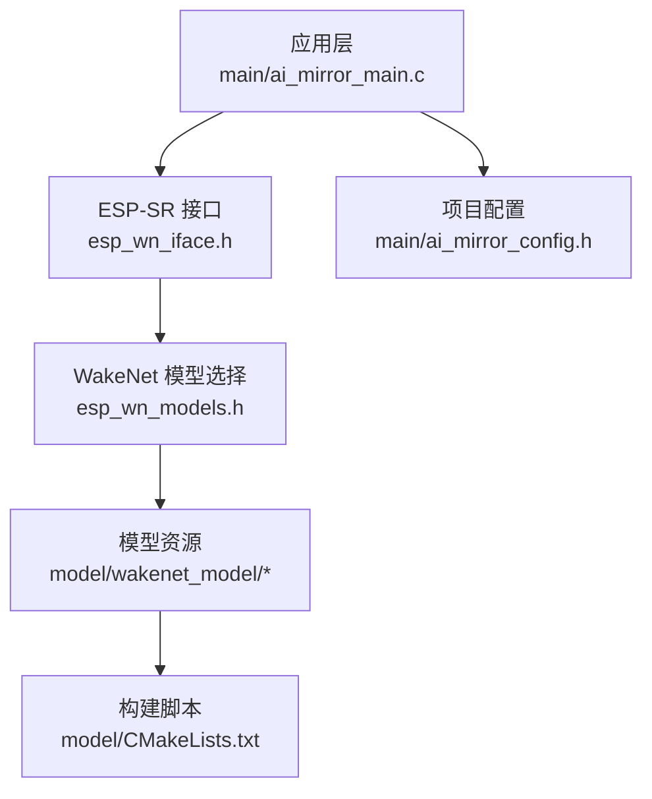
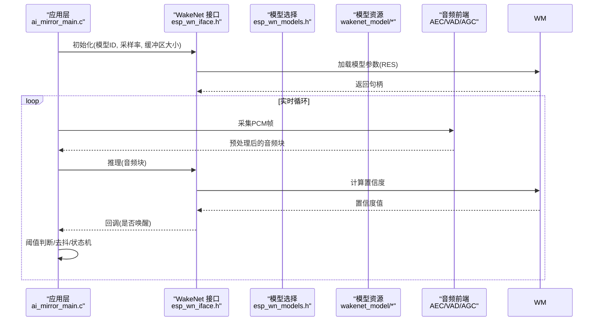
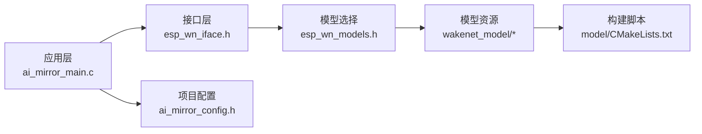

# 唤醒词检测

<cite>
**本文引用的文件**   
- [Firmware/esp32_ai_mirror/components/espressif__esp-sr/include/esp32/esp_wn_models.h](file://Firmware/esp32_ai_mirror/components/espressif__esp-sr/include/esp32/esp_wn_models.h)
- [Firmware/esp32_ai_mirror/components/espressif__esp-sr/include/esp32/esp_wn_iface.h](file://Firmware/esp32_ai_mirror/components/espressif__esp-sr/include/esp32/esp_wn_iface.h)
- [Firmware/esp32_ai_mirror/components/espressif__esp-sr/model/wakenet_model/wn9_nihaoxiaozhi/README.md](file://Firmware/esp32_ai_mirror/components/espressif__esp-sr/model/wakenet_model/wn9_nihaoxiaozhi/README.md)
- [Firmware/esp32_ai_mirror/components/espressif__esp-sr/model/wakenet_model/wn9_xiaoaitongxue/README.md](file://Firmware/esp32_ai_mirror/components/espressif__esp-sr/model/wakenet_model/wn9_xiaoaitongxue/README.md)
- [Firmware/esp32_ai_mirror/components/espressif__esp-sr/model/wakenet_model/wn9_customword/README.md](file://Firmware/esp32_ai_mirror/components/espressif__esp-sr/model/wakenet_model/wn9_customword/README.md)
- [Firmware/esp32_ai_mirror/components/espressif__esp-sr/model/CMakeLists.txt](file://Firmware/esp32_ai_mirror/components/espressif__esp-sr/model/CMakeLists.txt)
- [Firmware/esp32_ai_mirror/components/espressif__esp-sr/src/esp_mn_speech_commands.c](file://Firmware/esp32_ai_mirror/components/espressif__esp-sr/src/esp_mn_speech_commands.c)
- [Firmware/esp32_ai_mirror/main/ai_mirror_main.c](file://Firmware/esp32_ai_mirror/main/ai_mirror_main.c)
- [Firmware/esp32_ai_mirror/main/ai_mirror_config.h](file://Firmware/esp32_ai_mirror/main/ai_mirror_config.h)
</cite>

## 目录
1. [简介](#简介)
2. [项目结构](#项目结构)
3. [核心组件](#核心组件)
4. [架构总览](#架构总览)
5. [详细组件分析](#详细组件分析)
6. [依赖关系分析](#依赖关系分析)
7. [性能考量](#性能考量)
8. [故障排查指南](#故障排查指南)
9. [结论](#结论)
10. [附录](#附录)

## 简介
本文件围绕唤醒词检测功能，基于 WakeNet 模型在 ESP-SR（Espressif Speech Recognition）中的实现，系统阐述其原理、配置与使用方式。内容涵盖：
- 支持的唤醒词模型（如“小爱同学”“你好小智”等）及其性能特点
- 唤醒词模型的加载、初始化与运行流程
- 自定义唤醒词训练与部署指南（数据收集、训练、量化与优化）
- 唤醒准确率调优策略（阈值设置、噪声环境适配、硬件优化）
- 多唤醒词支持与动态切换机制
- 性能监控与调试工具使用方法

## 项目结构
本项目采用分层与模块化组织：
- 应用层：main 目录包含主程序入口与配置头文件，负责任务调度、音频采集与唤醒事件处理
- 语音识别组件：components/espressif__esp-sr 提供 WakeNet 接口、内置模型与构建脚本
- 模型资源：model/wakenet_model 下按版本与关键词组织模型包，含权重与说明文档
- 构建系统：CMakeLists.txt 控制模型编译与链接

图表来源
- [Firmware/esp32_ai_mirror/main/ai_mirror_main.c](file://Firmware/esp32_ai_mirror/main/ai_mirror_main.c)
- [Firmware/esp32_ai_mirror/components/espressif__esp-sr/include/esp32/esp_wn_iface.h](file://Firmware/esp32_ai_mirror/components/espressif__esp-sr/include/esp32/esp_wn_iface.h)
- [Firmware/esp32_ai_mirror/components/espressif__esp-sr/include/esp32/esp_wn_models.h](file://Firmware/esp32_ai_mirror/components/espressif__esp-sr/include/esp32/esp_wn_models.h)
- [Firmware/esp32_ai_mirror/components/espressif__esp-sr/model/CMakeLists.txt](file://Firmware/esp32_ai_mirror/components/espressif__esp-sr/model/CMakeLists.txt)

章节来源
- [Firmware/esp32_ai_mirror/main/ai_mirror_main.c](file://Firmware/esp32_ai_mirror/main/ai_mirror_main.c)
- [Firmware/esp32_ai_mirror/main/ai_mirror_config.h](file://Firmware/esp32_ai_mirror/main/ai_mirror_config.h)
- [Firmware/esp32_ai_mirror/components/espressif__esp-sr/model/CMakeLists.txt](file://Firmware/esp32_ai_mirror/components/espressif__esp-sr/model/CMakeLists.txt)

## 核心组件
- 唤醒词接口层（esp_wn_iface.h）
  - 定义 WakeNet 的初始化、推理、结果回调与生命周期管理 API
  - 提供统一的调用约定，屏蔽底层模型差异
- 模型选择层（esp_wn_models.h）
  - 集中声明可用的唤醒词模型标识与参数
  - 便于通过配置开关选择不同关键词或量化版本
- 模型资源（wakenet_model/*）
  - 每个子目录对应一个关键词与版本（如 wn9_nihaoxiaozhi、wn9_xiaoaitongxue、wn9_customword）
  - 包含权重文件与 README，描述模型规格、输入格式与性能指标
- 构建与打包（model/CMakeLists.txt）
  - 控制模型编译、链接与生成可嵌入的资源段
  - 支持选择特定模型参与最终固件构建

章节来源
- [Firmware/esp32_ai_mirror/components/espressif__esp-sr/include/esp32/esp_wn_iface.h](file://Firmware/esp32_ai_mirror/components/espressif__esp-sr/include/esp32/esp_wn_iface.h)
- [Firmware/esp32_ai_mirror/components/espressif__esp-sr/include/esp32/esp_wn_models.h](file://Firmware/esp32_ai_mirror/components/espressif__esp-sr/include/esp32/esp_wn_models.h)
- [Firmware/esp32_ai_mirror/components/espressif__esp-sr/model/wakenet_model/wn9_nihaoxiaozhi/README.md](file://Firmware/esp32_ai_mirror/components/espressif__esp-sr/model/wakenet_model/wn9_nihaoxiaozhi/README.md)
- [Firmware/esp32_ai_mirror/components/espressif__esp-sr/model/wakenet_model/wn9_xiaoaitongxue/README.md](file://Firmware/esp32_ai_mirror/components/espressif__esp-sr/model/wakenet_model/wn9_xiaoaitongxue/README.md)
- [Firmware/esp32_ai_mirror/components/espressif__esp-sr/model/wakenet_model/wn9_customword/README.md](file://Firmware/esp32_ai_mirror/components/espressif__esp-sr/model/wakenet_model/wn9_customword/README.md)
- [Firmware/esp32_ai_mirror/components/espressif__esp-sr/model/CMakeLists.txt](file://Firmware/esp32_ai_mirror/components/espressif__esp-sr/model/CMakeLists.txt)

## 架构总览
唤醒词检测的整体流程如下：
- 音频采集：由上层任务驱动 I2S/ADC 获取 PCM 流
- 预处理：VAD/AEC/AGC 等前端处理提升鲁棒性
- 推理：WakeNet 模型对特征进行滑动窗口推理，输出置信度
- 后处理：阈值判定与去抖逻辑触发唤醒事件
- 联动：唤醒后切换到 ASR/TTS 或其他业务逻辑

图表来源
- [Firmware/esp32_ai_mirror/main/ai_mirror_main.c](file://Firmware/esp32_ai_mirror/main/ai_mirror_main.c)
- [Firmware/esp32_ai_mirror/components/espressif__esp-sr/include/esp32/esp_wn_iface.h](file://Firmware/esp32_ai_mirror/components/espressif__esp-sr/include/esp32/esp_wn_iface.h)
- [Firmware/esp32_ai_mirror/components/espressif__esp-sr/include/esp32/esp_wn_models.h](file://Firmware/esp32_ai_mirror/components/espressif__esp-sr/include/esp32/esp_wn_models.h)
- [Firmware/esp32_ai_mirror/components/espressif__esp-sr/model/wakenet_model/wn9_nihaoxiaozhi/README.md](file://Firmware/esp32_ai_mirror/components/espressif__esp-sr/model/wakenet_model/wn9_nihaoxiaozhi/README.md)

## 详细组件分析

### 唤醒词接口层（esp_wn_iface.h）
- 职责
  - 封装 WakeNet 的生命周期：创建、配置、推理、销毁
  - 提供统一的数据格式与回调约定
- 关键要点
  - 初始化需指定模型 ID、采样率、帧长与缓冲区
  - 推理接口通常以固定长度的音频块为输入，返回置信度或布尔结果
  - 回调用于通知上层唤醒事件，避免阻塞推理路径

章节来源
- [Firmware/esp32_ai_mirror/components/espressif__esp-sr/include/esp32/esp_wn_iface.h](file://Firmware/esp32_ai_mirror/components/espressif__esp-sr/include/esp32/esp_wn_iface.h)

### 模型选择层（esp_wn_models.h）
- 职责
  - 集中声明可用唤醒词模型标识（如 nihaoxiaozhi、xiaoaitongxue、customword）
  - 暴露模型版本与量化类型（如 wn9、wn7q8）
- 关键要点
  - 通过宏或枚举选择模型，影响链接阶段资源注入
  - 量化版本（如 q8）降低内存与算力需求，适合低功耗设备

章节来源
- [Firmware/esp32_ai_mirror/components/espressif__esp-sr/include/esp32/esp_wn_models.h](file://Firmware/esp32_ai_mirror/components/espressif__esp-sr/include/esp32/esp_wn_models.h)

### 模型资源与说明（wakenet_model/*）
- 已支持关键词示例
  - 你好小智（nihaoxiaozhi）：面向中文场景，默认版本与量化版本并存
  - 小爱同学（xiaoaitongxue）：生态化关键词，提供多版本
  - 自定义词（customword）：用户自训练关键词模板
- 资源内容
  - 权重文件与元数据（采样率、帧长、特征维度）
  - README 描述模型规格、输入要求与性能指标（误报率、召回率、功耗）

章节来源
- [Firmware/esp32_ai_mirror/components/espressif__esp-sr/model/wakenet_model/wn9_nihaoxiaozhi/README.md](file://Firmware/esp32_ai_mirror/components/espressif__esp-sr/model/wakenet_model/wn9_nihaoxiaozhi/README.md)
- [Firmware/esp32_ai_mirror/components/espressif__esp-sr/model/wakenet_model/wn9_xiaoaitongxue/README.md](file://Firmware/esp32_ai_mirror/components/espressif__esp-sr/model/wakenet_model/wn9_xiaoaitongxue/README.md)
- [Firmware/esp32_ai_mirror/components/espressif__esp-sr/model/wakenet_model/wn9_customword/README.md](file://Firmware/esp32_ai_mirror/components/espressif__esp-sr/model/wakenet_model/wn9_customword/README.md)

### 构建与打包（model/CMakeLists.txt）
- 职责
  - 将选定的模型资源编译进固件
  - 根据配置决定链接哪些模型，减少体积
- 关键要点
  - 通过变量或 Kconfig 选项启用特定模型
  - 支持生成只读段，提高运行时访问效率

章节来源
- [Firmware/esp32_ai_mirror/components/espressif__esp-sr/model/CMakeLists.txt](file://Firmware/esp32_ai_mirror/components/espressif__esp-sr/model/CMakeLists.txt)

### 应用集成（ai_mirror_main.c）
- 职责
  - 启动音频采集任务
  - 初始化 WakeNet 并注册回调
  - 处理唤醒事件，切换至后续语音交互流程
- 关键要点
  - 合理设置帧长与采样率，匹配模型输入要求
  - 在回调中执行非阻塞操作，避免影响实时性

章节来源
- [Firmware/esp32_ai_mirror/main/ai_mirror_main.c](file://Firmware/esp32_ai_mirror/main/ai_mirror_main.c)

### 命令与事件映射（esp_mn_speech_commands.c）
- 职责
  - 将唤醒事件映射到具体命令或状态
  - 提供可扩展的命令表，便于新增关键词或动作
- 关键要点
  - 与上层状态机协作，确保唤醒后的行为一致性与可维护性

章节来源
- [Firmware/esp32_ai_mirror/components/espressif__esp-sr/src/esp_mn_speech_commands.c](file://Firmware/esp32_ai_mirror/components/espressif__esp-sr/src/esp_mn_speech_commands.c)

### 项目配置（ai_mirror_config.h）
- 职责
  - 集中管理唤醒词模型选择、阈值、采样率、缓冲区等关键参数
- 关键要点
  - 通过宏或配置项快速切换模型与量化版本
  - 调整阈值以平衡误报与漏报

章节来源
- [Firmware/esp32_ai_mirror/main/ai_mirror_config.h](file://Firmware/esp32_ai_mirror/main/ai_mirror_config.h)

## 依赖关系分析
- 组件耦合
  - 应用层依赖 esp_wn_iface.h 提供的统一接口
  - 接口层依赖 esp_wn_models.h 的模型标识
  - 模型资源通过 CMake 注入，避免运行时动态加载开销
- 外部依赖
  - 音频前端（AEC/VAD/AGC）提升抗噪能力
  - 平台 SDK（ESP-IDF）提供线程、内存与外设驱动

图表来源
- [Firmware/esp32_ai_mirror/main/ai_mirror_main.c](file://Firmware/esp32_ai_mirror/main/ai_mirror_main.c)
- [Firmware/esp32_ai_mirror/components/espressif__esp-sr/include/esp32/esp_wn_iface.h](file://Firmware/esp32_ai_mirror/components/espressif__esp-sr/include/esp32/esp_wn_iface.h)
- [Firmware/esp32_ai_mirror/components/espressif__esp-sr/include/esp32/esp_wn_models.h](file://Firmware/esp32_ai_mirror/components/espressif__esp-sr/include/esp32/esp_wn_models.h)
- [Firmware/esp32_ai_mirror/components/espressif__esp-sr/model/CMakeLists.txt](file://Firmware/esp32_ai_mirror/components/espressif__esp-sr/model/CMakeLists.txt)

章节来源
- [Firmware/esp32_ai_mirror/main/ai_mirror_main.c](file://Firmware/esp32_ai_mirror/main/ai_mirror_main.c)
- [Firmware/esp32_ai_mirror/components/espressif__esp-sr/include/esp32/esp_wn_iface.h](file://Firmware/esp32_ai_mirror/components/espressif__esp-sr/include/esp32/esp_wn_iface.h)
- [Firmware/esp32_ai_mirror/components/espressif__esp-sr/include/esp32/esp_wn_models.h](file://Firmware/esp32_ai_mirror/components/espressif__esp-sr/include/esp32/esp_wn_models.h)
- [Firmware/esp32_ai_mirror/components/espressif__esp-sr/model/CMakeLists.txt](file://Firmware/esp32_ai_mirror/components/espressif__esp-sr/model/CMakeLists.txt)

## 性能考量
- 模型选择与量化
  - 优先选用量化版本（如 q8）以降低内存占用与推理功耗
  - 根据场景复杂度选择合适版本（wn7/wn9），权衡精度与速度
- 音频前端优化
  - 合理配置 VAD 门限与 AEC 参数，抑制背景噪声与回声
  - 调整 AGC 增益，避免饱和与削波
- 推理参数
  - 帧长与采样率需与模型输入一致，避免重采样带来的失真
  - 滑动窗口长度与步长影响延迟与稳定性
- 硬件与内存
  - 利用 ESP32 的 DMA 与缓存特性，减少 CPU 占用
  - 合理分配堆栈，避免频繁分配导致的抖动

[本节为通用指导，不直接分析具体文件]

## 故障排查指南
- 常见问题
  - 无法唤醒：检查模型选择、采样率与帧长配置；确认音频前端未静音
  - 误报率高：适当提高阈值；增强 VAD/AEC 参数；增加负样本训练
  - 漏报率高：降低阈值；改善麦克风布局与环境声学
- 调试手段
  - 打印置信度曲线与触发次数，定位阈值问题
  - 录制真实场景音频回放，验证端到端链路
  - 使用 ESP-SR 提供的测试用例与基准脚本对比性能

章节来源
- [Firmware/esp32_ai_mirror/components/espressif__esp-sr/src/esp_mn_speech_commands.c](file://Firmware/esp32_ai_mirror/components/espressif__esp-sr/src/esp_mn_speech_commands.c)
- [Firmware/esp32_ai_mirror/main/ai_mirror_config.h](file://Firmware/esp32_ai_mirror/main/ai_mirror_config.h)

## 结论
WakeNet 在 ESP-SR 中提供了稳定、高效的唤醒词检测能力。通过合理的模型选择、前端优化与阈值调参，可在多种噪声环境下获得良好的唤醒体验。结合自定义训练与量化技术，可实现低成本、高可靠的多关键词支持方案。

[本节为总结性内容，不直接分析具体文件]

## 附录

### 支持的唤醒词模型与性能特点
- 你好小智（wn9_nihaoxiaozhi）
  - 中文场景优化，默认与量化版本并存
  - 典型误报率与召回率参考 README
- 小爱同学（wn9_xiaoaitongxue）
  - 生态化关键词，多版本可选
  - 适用于智能家居联动场景
- 自定义词（wn9_customword）
  - 用户自训练，灵活扩展
  - 需遵循数据规范与训练流程

章节来源
- [Firmware/esp32_ai_mirror/components/espressif__esp-sr/model/wakenet_model/wn9_nihaoxiaozhi/README.md](file://Firmware/esp32_ai_mirror/components/espressif__esp-sr/model/wakenet_model/wn9_nihaoxiaozhi/README.md)
- [Firmware/esp32_ai_mirror/components/espressif__esp-sr/model/wakenet_model/wn9_xiaoaitongxue/README.md](file://Firmware/esp32_ai_mirror/components/espressif__esp-sr/model/wakenet_model/wn9_xiaoaitongxue/README.md)
- [Firmware/esp32_ai_mirror/components/espressif__esp-sr/model/wakenet_model/wn9_customword/README.md](file://Firmware/esp32_ai_mirror/components/espressif__esp-sr/model/wakenet_model/wn9_customword/README.md)

### 唤醒词模型的加载、初始化与运行流程
- 加载
  - 通过模型选择层确定模型 ID 与量化版本
  - 构建阶段将权重资源注入固件
- 初始化
  - 调用接口层初始化函数，传入采样率、帧长与缓冲区
  - 注册唤醒回调，准备推理上下文
- 运行
  - 周期性采集音频块并进行预处理
  - 调用推理接口获取置信度，阈值判定后触发事件

章节来源
- [Firmware/esp32_ai_mirror/components/espressif__esp-sr/include/esp32/esp_wn_iface.h](file://Firmware/esp32_ai_mirror/components/espressif__esp-sr/include/esp32/esp_wn_iface.h)
- [Firmware/esp32_ai_mirror/components/espressif__esp-sr/include/esp32/esp_wn_models.h](file://Firmware/esp32_ai_mirror/components/espressif__esp-sr/include/esp32/esp_wn_models.h)
- [Firmware/esp32_ai_mirror/components/espressif__esp-sr/model/CMakeLists.txt](file://Firmware/esp32_ai_mirror/components/espressif__esp-sr/model/CMakeLists.txt)

### 自定义唤醒词训练与部署指南
- 数据收集
  - 采集正样本（目标关键词）与负样本（背景噪声、其他词汇）
  - 保证多样说话人、环境与语速
- 模型训练
  - 使用 ESP-SR 提供的训练脚本与模板
  - 调整超参数（学习率、批次大小、迭代轮数）
- 量化与优化
  - 转换为 q8 量化模型，减小体积与功耗
  - 验证量化前后性能一致性
- 部署
  - 将模型放入 wakenet_model/wn9_customword 目录
  - 更新构建配置，选择新模型参与链接

章节来源
- [Firmware/esp32_ai_mirror/components/espressif__esp-sr/model/wakenet_model/wn9_customword/README.md](file://Firmware/esp32_ai_mirror/components/espressif__esp-sr/model/wakenet_model/wn9_customword/README.md)
- [Firmware/esp32_ai_mirror/components/espressif__esp-sr/model/CMakeLists.txt](file://Firmware/esp32_ai_mirror/components/espressif__esp-sr/model/CMakeLists.txt)

### 唤醒准确率调优策略
- 阈值设置
  - 基于混淆矩阵与 ROC 曲线选取最佳阈值
  - 区分室内/室外场景，动态调整阈值
- 噪声环境适配
  - 增强 VAD/AEC 参数，抑制风扇、空调等稳态噪声
  - 引入频域滤波与谱减法
- 硬件优化
  - 优化麦克风阵列与外壳声学设计
  - 合理布线减少电磁干扰

[本节为通用指导，不直接分析具体文件]

### 多唤醒词支持与动态切换机制
- 多模型并行
  - 同时加载多个关键词模型，共享音频前端
  - 通过优先级与互斥策略避免冲突
- 动态切换
  - 运行时根据场景或用户偏好切换激活模型
  - 保持低延迟切换，避免中断推理流

章节来源
- [Firmware/esp32_ai_mirror/components/espressif__esp-sr/include/esp32/esp_wn_models.h](file://Firmware/esp32_ai_mirror/components/espressif__esp-sr/include/esp32/esp_wn_models.h)
- [Firmware/esp32_ai_mirror/components/espressif__esp-sr/include/esp32/esp_wn_iface.h](file://Firmware/esp32_ai_mirror/components/espressif__esp-sr/include/esp32/esp_wn_iface.h)

### 性能监控与调试工具使用方法
- 指标采集
  - 统计唤醒成功率、误报率、平均延迟与功耗
  - 记录置信度分布与触发时间戳
- 工具链
  - 使用 ESP-SR 基准脚本进行回归测试
  - 借助串口日志与示波器观察音频链路
- 持续优化
  - 建立自动化测试集，覆盖常见场景
  - 定期评估模型与参数变更的影响

章节来源
- [Firmware/esp32_ai_mirror/components/espressif__esp-sr/src/esp_mn_speech_commands.c](file://Firmware/esp32_ai_mirror/components/espressif__esp-sr/src/esp_mn_speech_commands.c)
- [Firmware/esp32_ai_mirror/main/ai_mirror_config.h](file://Firmware/esp32_ai_mirror/main/ai_mirror_config.h)