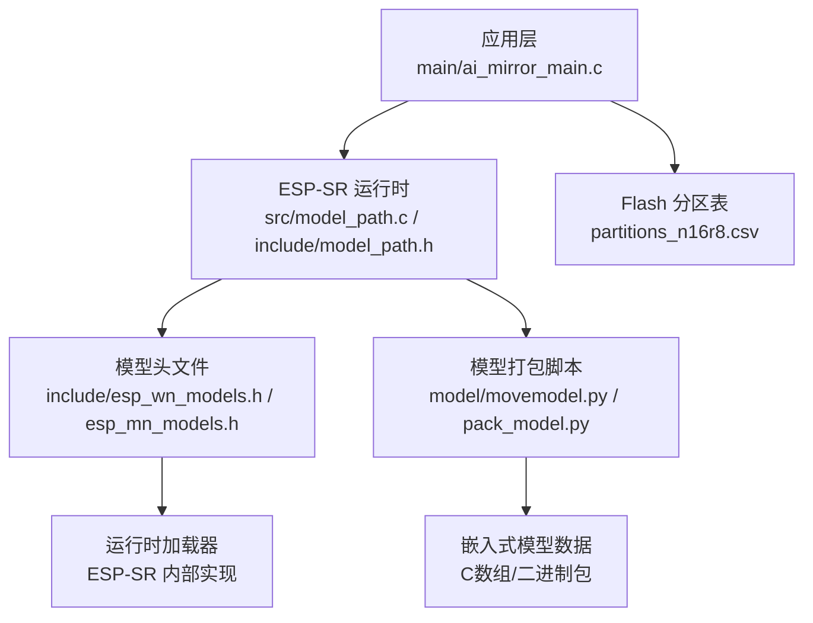
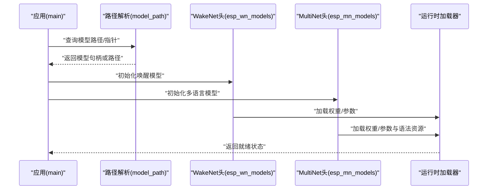
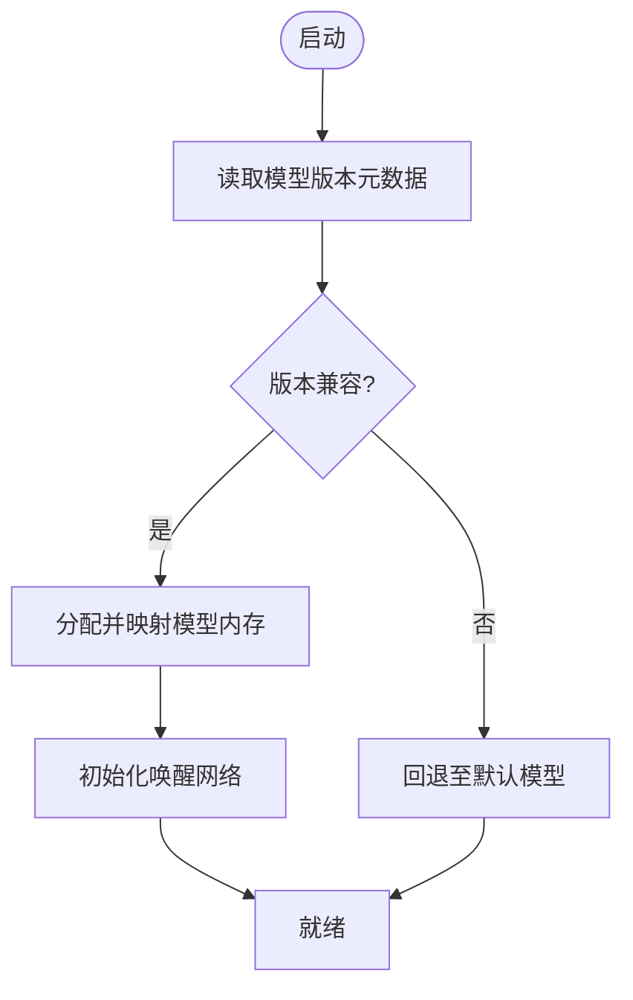
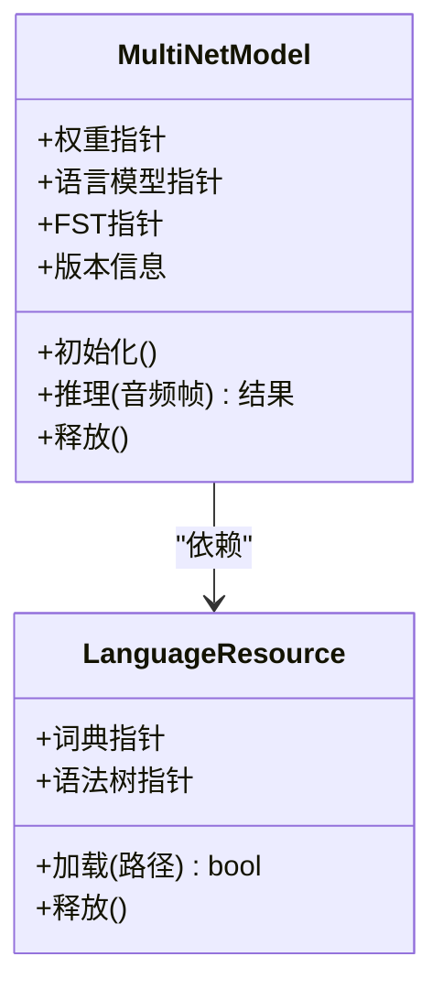
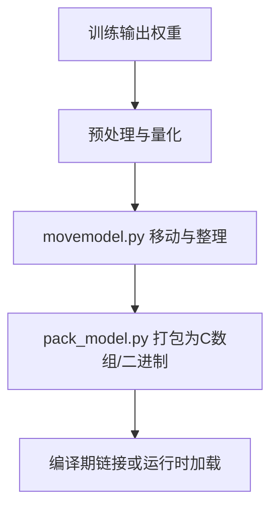
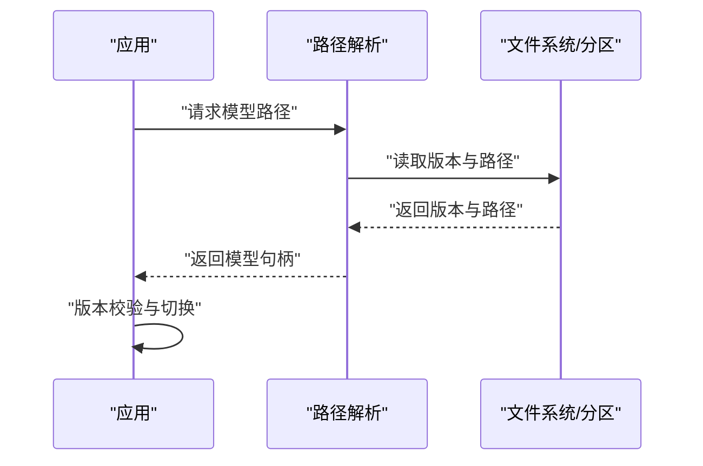
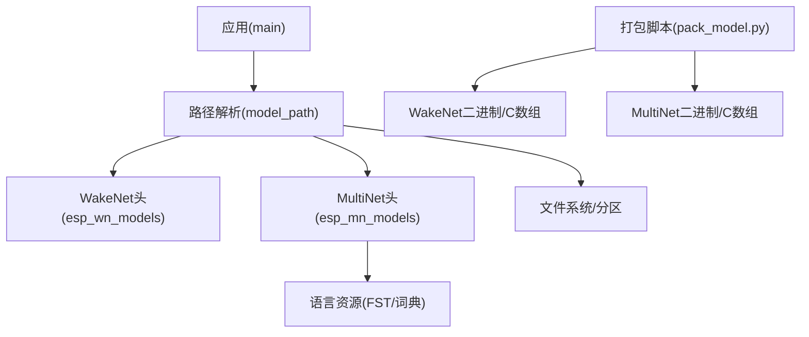

# 模型管理

<cite>
**本文引用的文件**   
- [Firmware/esp32_ai_mirror/components/espressif__esp-sr/include/esp_wn_models.h](file://Firmware/esp32_ai_mirror/components/espressif__esp-sr/include/esp_wn_models.h)
- [Firmware/esp32_ai_mirror/components/espressif__esp-sr/include/esp_mn_models.h](file://Firmware/esp32_ai_mirror/components/espressif__esp-sr/include/esp_mn_models.h)
- [Firmware/esp32_ai_mirror/components/espressif__esp-sr/model/movemodel.py](file://Firmware/esp32_ai_mirror/components/espressif__esp-sr/model/movemodel.py)
- [Firmware/esp32_ai_mirror/components/espressif__esp-sr/model/pack_model.py](file://Firmware/esp32_ai_mirror/components/espressif__esp-sr/model/pack_model.py)
- [Firmware/esp32_ai_mirror/components/espressif__esp-sr/src/model_path.c](file://Firmware/esp32_ai_mirror/components/espressif__esp-sr/src/model_path.c)
- [Firmware/esp32_ai_mirror/components/espressif__esp-sr/src/include/model_path.h](file://Firmware/esp32_ai_mirror/components/espressif__esp-sr/src/include/model_path.h)
- [Firmware/esp32_ai_mirror/components/espressif__esp-sr/test/unity_wakenet.c](file://Firmware/esp32_ai_mirror/components/espressif__esp-sr/test/unity_wakenet.c)
- [Firmware/esp32_ai_mirror/components/espressif__esp-sr/test/unity_multinet.c](file://Firmware/esp32_ai_mirror/components/espressif__esp-sr/test/unity_multinet.c)
- [Firmware/esp32_ai_mirror/main/ai_mirror_main.c](file://Firmware/esp32_ai_mirror/main/ai_mirror_main.c)
- [Firmware/esp32_ai_mirror/partitions_n16r8.csv](file://Firmware/esp32_ai_mirror/partitions_n16r8.csv)
</cite>

## 目录
1. [简介](#简介)
2. [项目结构](#项目结构)
3. [核心组件](#核心组件)
4. [架构总览](#架构总览)
5. [详细组件分析](#详细组件分析)
6. [依赖关系分析](#依赖关系分析)
7. [性能考量](#性能考量)
8. [故障排查指南](#故障排查指南)
9. [结论](#结论)
10. [附录](#附录)

## 简介
本文件面向语音模型管理系统，聚焦于 WakeNet（唤醒词检测）与 MultiNet（多语言语音识别）两类模型的格式、存储结构与加载机制。文档涵盖模型量化、压缩与优化技术，版本管理与动态更新、热切换策略，模型文件的组织与命名规范，以及从训练框架到嵌入式格式的转换工具链使用方法。同时给出性能评估、基准测试与兼容性检查建议，并说明内存占用优化与存储空间管理策略，最后提供故障恢复与降级处理机制。

## 项目结构
本项目基于 ESP-SR 组件构建，模型相关代码集中在 components/espressif__esp-sr 下，包含头文件定义、模型打包脚本、路径解析与测试用例；应用层位于 main 目录，分区表用于 Flash 布局。关键目录与职责：
- include/esp32 与 include/esp32s3：平台相关的头文件，声明 WakeNet/MultiNet 模型指针与接口
- model：模型打包与移动脚本，生成嵌入式 C 数组或二进制包
- src：运行时路径解析与配置桥接
- test：单元测试与集成测试，覆盖模型加载与推理流程
- main：应用入口，负责初始化与调度
- partitions_n16r8.csv：Flash 分区表，划分 OTA、模型区等

图表来源
- [Firmware/esp32_ai_mirror/components/espressif__esp-sr/src/model_path.c](file://Firmware/esp32_ai_mirror/components/espressif__esp-sr/src/model_path.c)
- [Firmware/esp32_ai_mirror/components/espressif__esp-sr/src/include/model_path.h](file://Firmware/esp32_ai_mirror/components/espressif__esp-sr/src/include/model_path.h)
- [Firmware/esp32_ai_mirror/components/espressif__esp-sr/include/esp_wn_models.h](file://Firmware/esp32_ai_mirror/components/espressif__esp-sr/include/esp_wn_models.h)
- [Firmware/esp32_ai_mirror/components/espressif__esp-sr/include/esp_mn_models.h](file://Firmware/esp32_ai_mirror/components/espressif__esp-sr/include/esp_mn_models.h)
- [Firmware/esp32_ai_mirror/components/espressif__esp-sr/model/movemodel.py](file://Firmware/esp32_ai_mirror/components/espressif__esp-sr/model/movemodel.py)
- [Firmware/esp32_ai_mirror/components/espressif__esp-sr/model/pack_model.py](file://Firmware/esp32_ai_mirror/components/espressif__esp-sr/model/pack_model.py)
- [Firmware/esp32_ai_mirror/partitions_n16r8.csv](file://Firmware/esp32_ai_mirror/partitions_n16r8.csv)

章节来源
- [Firmware/esp32_ai_mirror/components/espressif__esp-sr/include/esp_wn_models.h](file://Firmware/esp32_ai_mirror/components/espressif__esp-sr/include/esp_wn_models.h)
- [Firmware/esp32_ai_mirror/components/espressif__esp-sr/include/esp_mn_models.h](file://Firmware/esp32_ai_mirror/components/espressif__esp-sr/include/esp_mn_models.h)
- [Firmware/esp32_ai_mirror/components/espressif__esp-sr/src/model_path.c](file://Firmware/esp32_ai_mirror/components/espressif__esp-sr/src/model_path.c)
- [Firmware/esp32_ai_mirror/components/espressif__esp-sr/src/include/model_path.h](file://Firmware/esp32_ai_mirror/components/espressif__esp-sr/src/include/model_path.h)
- [Firmware/esp32_ai_mirror/components/espressif__esp-sr/model/movemodel.py](file://Firmware/esp32_ai_mirror/components/espressif__esp-sr/model/movemodel.py)
- [Firmware/esp32_ai_mirror/components/espressif__esp-sr/model/pack_model.py](file://Firmware/esp32_ai_mirror/components/espressif__esp-sr/model/pack_model.py)
- [Firmware/esp32_ai_mirror/partitions_n16r8.csv](file://Firmware/esp32_ai_mirror/partitions_n16r8.csv)

## 核心组件
- WakeNet 模型头与接口：定义唤醒模型指针、版本信息与加载所需的最小元数据
- MultiNet 模型头与接口：定义多语言识别模型指针、语言包与语法资源引用
- 模型路径解析：根据目标芯片与配置选择正确的模型路径与资源
- 模型打包与移动：将训练产出的权重转换为嵌入式 C 数组或二进制包，便于编译期链接或运行时加载
- 测试套件：验证模型加载、推理与边界条件

章节来源
- [Firmware/esp32_ai_mirror/components/espressif__esp-sr/include/esp_wn_models.h](file://Firmware/esp32_ai_mirror/components/espressif__esp-sr/include/esp_wn_models.h)
- [Firmware/esp32_ai_mirror/components/espressif__esp-sr/include/esp_mn_models.h](file://Firmware/esp32_ai_mirror/components/espressif__esp-sr/include/esp_mn_models.h)
- [Firmware/esp32_ai_mirror/components/espressif__esp-sr/src/model_path.c](file://Firmware/esp32_ai_mirror/components/espressif__esp-sr/src/model_path.c)
- [Firmware/esp32_ai_mirror/components/espressif__esp-sr/src/include/model_path.h](file://Firmware/esp32_ai_mirror/components/espressif__esp-sr/src/include/model_path.h)
- [Firmware/esp32_ai_mirror/components/espressif__esp-sr/model/movemodel.py](file://Firmware/esp32_ai_mirror/components/espressif__esp-sr/model/movemodel.py)
- [Firmware/esp32_ai_mirror/components/espressif__esp-sr/model/pack_model.py](file://Firmware/esp32_ai_mirror/components/espressif__esp-sr/model/pack_model.py)

## 架构总览
WakeNet 与 MultiNet 的加载流程遵循“头文件声明 + 路径解析 + 运行时加载”的模式。应用通过 ESP-SR 提供的接口请求模型，路径解析模块依据目标平台与配置返回模型指针或路径，随后由底层加载器完成内存映射或拷贝。

图表来源
- [Firmware/esp32_ai_mirror/components/espressif__esp-sr/src/model_path.c](file://Firmware/esp32_ai_mirror/components/espressif__esp-sr/src/model_path.c)
- [Firmware/esp32_ai_mirror/components/espressif__esp-sr/src/include/model_path.h](file://Firmware/esp32_ai_mirror/components/espressif__esp-sr/src/include/model_path.h)
- [Firmware/esp32_ai_mirror/components/espressif__esp-sr/include/esp_wn_models.h](file://Firmware/esp32_ai_mirror/components/espressif__esp-sr/include/esp_wn_models.h)
- [Firmware/esp32_ai_mirror/components/espressif__esp-sr/include/esp_mn_models.h](file://Firmware/esp32_ai_mirror/components/espressif__esp-sr/include/esp_mn_models.h)

## 详细组件分析

### WakeNet 模型格式与加载
- 模型格式：以嵌入式 C 数组形式嵌入固件，或通过二进制包在运行时加载；头文件中暴露模型指针与版本信息
- 存储结构：权重与偏置按层顺序排列，附带必要的元数据（如输入维度、量化步长）
- 加载机制：启动时调用初始化函数，路径解析模块返回模型地址，加载器校验元数据并完成内存分配与映射
- 量化与优化：支持 Q8/Q16 量化，减少内存占用与提升推理速度；可结合稀疏化与剪枝降低体积
- 版本管理：头文件内嵌版本号字段，便于运行时兼容检查与回滚

图表来源
- [Firmware/esp32_ai_mirror/components/espressif__esp-sr/include/esp_wn_models.h](file://Firmware/esp32_ai_mirror/components/espressif__esp-sr/include/esp_wn_models.h)
- [Firmware/esp32_ai_mirror/components/espressif__esp-sr/src/model_path.c](file://Firmware/esp32_ai_mirror/components/espressif__esp-sr/src/model_path.c)

章节来源
- [Firmware/esp32_ai_mirror/components/espressif__esp-sr/include/esp_wn_models.h](file://Firmware/esp32_ai_mirror/components/espressif__esp-sr/include/esp_wn_models.h)
- [Firmware/esp32_ai_mirror/components/espressif__esp-sr/test/unity_wakenet.c](file://Firmware/esp32_ai_mirror/components/espressif__esp-sr/test/unity_wakenet.c)

### MultiNet 模型格式与加载
- 模型格式：包含声学模型权重、语言模型与语法树（FST），支持多语言与自定义命令集
- 存储结构：权重按层组织，语言模型与 FST 作为独立资源文件，运行时按需加载
- 加载机制：先加载权重，再加载语言资源；路径解析模块根据语言配置选择对应资源
- 量化与优化：Q8/Q16 量化，FST 压缩与缓存，避免重复解析
- 版本管理：模型与语言资源均带版本标识，确保一致性

图表来源
- [Firmware/esp32_ai_mirror/components/espressif__esp-sr/include/esp_mn_models.h](file://Firmware/esp32_ai_mirror/components/espressif__esp-sr/include/esp_mn_models.h)
- [Firmware/esp32_ai_mirror/components/espressif__esp-sr/src/model_path.c](file://Firmware/esp32_ai_mirror/components/espressif__esp-sr/src/model_path.c)

章节来源
- [Firmware/esp32_ai_mirror/components/espressif__esp-sr/include/esp_mn_models.h](file://Firmware/esp32_ai_mirror/components/espressif__esp-sr/include/esp_mn_models.h)
- [Firmware/esp32_ai_mirror/components/espressif__esp-sr/test/unity_multinet.c](file://Firmware/esp32_ai_mirror/components/espressif__esp-sr/test/unity_multinet.c)

### 模型打包与转换工具链
- movemodel.py：将训练产出的权重文件移动到指定目录，生成嵌入式所需的中间文件
- pack_model.py：将权重与元数据打包为 C 数组或二进制包，供编译期链接或运行时加载
- 转换流程：训练输出 → 预处理（归一化/量化）→ 打包 → 生成头文件/二进制 → 链接或部署

图表来源
- [Firmware/esp32_ai_mirror/components/espressif__esp-sr/model/movemodel.py](file://Firmware/esp32_ai_mirror/components/espressif__esp-sr/model/movemodel.py)
- [Firmware/esp32_ai_mirror/components/espressif__esp-sr/model/pack_model.py](file://Firmware/esp32_ai_mirror/components/espressif__esp-sr/model/pack_model.py)

章节来源
- [Firmware/esp32_ai_mirror/components/espressif__esp-sr/model/movemodel.py](file://Firmware/esp32_ai_mirror/components/espressif__esp-sr/model/movemodel.py)
- [Firmware/esp32_ai_mirror/components/espressif__esp-sr/model/pack_model.py](file://Firmware/esp32_ai_mirror/components/espressif__esp-sr/model/pack_model.py)

### 模型路径解析与版本管理
- 路径解析：根据目标芯片（esp32/esp32s3）与配置选择模型路径，返回指针或路径字符串
- 版本管理：模型头文件包含版本字段，运行时进行兼容性检查，不匹配则触发回退
- 动态更新：支持 OTA 下载新模型，写入专用分区后重启切换

图表来源
- [Firmware/esp32_ai_mirror/components/espressif__esp-sr/src/model_path.c](file://Firmware/esp32_ai_mirror/components/espressif__esp-sr/src/model_path.c)
- [Firmware/esp32_ai_mirror/components/espressif__esp-sr/src/include/model_path.h](file://Firmware/esp32_ai_mirror/components/espressif__esp-sr/src/include/model_path.h)

章节来源
- [Firmware/esp32_ai_mirror/components/espressif__esp-sr/src/model_path.c](file://Firmware/esp32_ai_mirror/components/espressif__esp-sr/src/model_path.c)
- [Firmware/esp32_ai_mirror/components/espressif__esp-sr/src/include/model_path.h](file://Firmware/esp32_ai_mirror/components/espressif__esp-sr/src/include/model_path.h)

### 模型文件组织结构与命名规范
- 组织原则：按模型类型（WakeNet/MultiNet）与语言/命令集分目录存放，便于路径解析与版本管理
- 命名规范：文件名包含模型版本、量化精度与语言标识，例如 wn9_xiaoaitongxue_q8、mn5q8_cn
- 依赖关系：MultiNet 依赖语言资源与 FST，WakeNet 仅依赖权重与元数据

章节来源
- [Firmware/esp32_ai_mirror/components/espressif__esp-sr/include/esp_wn_models.h](file://Firmware/esp32_ai_mirror/components/espressif__esp-sr/include/esp_wn_models.h)
- [Firmware/esp32_ai_mirror/components/espressif__esp-sr/include/esp_mn_models.h](file://Firmware/esp32_ai_mirror/components/espressif__esp-sr/include/esp_mn_models.h)

### 模型性能评估与基准测试
- 评估指标：准确率、延迟、内存占用、功耗
- 基准测试：使用测试套件对 WakeNet 与 MultiNet 进行端到端推理测试，覆盖不同音频场景
- 兼容性检查：版本校验、量化精度对比、语言资源一致性验证

章节来源
- [Firmware/esp32_ai_mirror/components/espressif__esp-sr/test/unity_wakenet.c](file://Firmware/esp32_ai_mirror/components/espressif__esp-sr/test/unity_wakenet.c)
- [Firmware/esp32_ai_mirror/components/espressif__esp-sr/test/unity_multinet.c](file://Firmware/esp32_ai_mirror/components/espressif__esp-sr/test/unity_multinet.c)

### 内存占用优化与存储空间管理
- 内存优化：采用 Q8/Q16 量化，减少权重体积；按需加载语言资源，避免常驻内存
- 存储管理：使用 Flash 分区表划分模型区与 OTA 区，支持双备份与回滚
- 缓存策略：热点模型与语言资源缓存，减少重复 I/O

章节来源
- [Firmware/esp32_ai_mirror/partitions_n16r8.csv](file://Firmware/esp32_ai_mirror/partitions_n16r8.csv)

### 故障恢复与降级处理
- 故障检测：模型加载失败、版本不匹配、资源缺失
- 降级策略：回退至默认模型或上一稳定版本，保证基本功能可用
- 恢复机制：记录错误日志，触发 OTA 重新下载与校验

章节来源
- [Firmware/esp32_ai_mirror/components/espressif__esp-sr/src/model_path.c](file://Firmware/esp32_ai_mirror/components/espressif__esp-sr/src/model_path.c)
- [Firmware/esp32_ai_mirror/components/espressif__esp-sr/src/include/model_path.h](file://Firmware/esp32_ai_mirror/components/espressif__esp-sr/src/include/model_path.h)

## 依赖关系分析
- 应用层依赖路径解析模块，路径解析依赖模型头文件与文件系统
- MultiNet 依赖语言资源与 FST，WakeNet 依赖权重与元数据
- 打包脚本依赖训练输出与量化工具链

图表来源
- [Firmware/esp32_ai_mirror/components/espressif__esp-sr/src/model_path.c](file://Firmware/esp32_ai_mirror/components/espressif__esp-sr/src/model_path.c)
- [Firmware/esp32_ai_mirror/components/espressif__esp-sr/src/include/model_path.h](file://Firmware/esp32_ai_mirror/components/espressif__esp-sr/src/include/model_path.h)
- [Firmware/esp32_ai_mirror/components/espressif__esp-sr/include/esp_wn_models.h](file://Firmware/esp32_ai_mirror/components/espressif__esp-sr/include/esp_wn_models.h)
- [Firmware/esp32_ai_mirror/components/espressif__esp-sr/include/esp_mn_models.h](file://Firmware/esp32_ai_mirror/components/espressif__esp-sr/include/esp_mn_models.h)
- [Firmware/esp32_ai_mirror/components/espressif__esp-sr/model/pack_model.py](file://Firmware/esp32_ai_mirror/components/espressif__esp-sr/model/pack_model.py)

章节来源
- [Firmware/esp32_ai_mirror/components/espressif__esp-sr/src/model_path.c](file://Firmware/esp32_ai_mirror/components/espressif__esp-sr/src/model_path.c)
- [Firmware/esp32_ai_mirror/components/espressif__esp-sr/src/include/model_path.h](file://Firmware/esp32_ai_mirror/components/espressif__esp-sr/src/include/model_path.h)
- [Firmware/esp32_ai_mirror/components/espressif__esp-sr/include/esp_wn_models.h](file://Firmware/esp32_ai_mirror/components/espressif__esp-sr/include/esp_wn_models.h)
- [Firmware/esp32_ai_mirror/components/espressif__esp-sr/include/esp_mn_models.h](file://Firmware/esp32_ai_mirror/components/espressif__esp-sr/include/esp_mn_models.h)
- [Firmware/esp32_ai_mirror/components/espressif__esp-sr/model/pack_model.py](file://Firmware/esp32_ai_mirror/components/espressif__esp-sr/model/pack_model.py)

## 性能考量
- 量化精度选择：Q8 适合低功耗设备，Q16 平衡精度与体积
- 推理延迟优化：批处理音频帧，减少上下文切换
- 内存带宽：避免频繁 I/O，使用内存映射与缓存
- 功耗管理：休眠期间卸载非活跃模型，唤醒时快速加载

## 故障排查指南
- 常见问题：模型加载失败、版本不匹配、语言资源缺失
- 排查步骤：检查路径解析返回值、验证模型头文件版本、确认资源完整性
- 恢复措施：回退至默认模型、触发 OTA 重新下载、清理损坏文件

章节来源
- [Firmware/esp32_ai_mirror/components/espressif__esp-sr/src/model_path.c](file://Firmware/esp32_ai_mirror/components/espressif__esp-sr/src/model_path.c)
- [Firmware/esp32_ai_mirror/components/espressif__esp-sr/src/include/model_path.h](file://Firmware/esp32_ai_mirror/components/espressif__esp-sr/src/include/model_path.h)

## 结论
本系统通过标准化的模型格式、路径解析与打包工具链，实现了 WakeNet 与 MultiNet 的高效加载与管理。量化与压缩技术显著降低了内存与存储占用，版本管理与动态更新保障了系统的可维护性与可扩展性。性能评估与故障恢复机制确保了系统在复杂环境下的稳定性。

## 附录
- 术语表：WakeNet（唤醒词检测）、MultiNet（多语言语音识别）、Q8/Q16（量化精度）、FST（有限状态机）
- 参考文件：模型头文件、路径解析模块、打包脚本、分区表