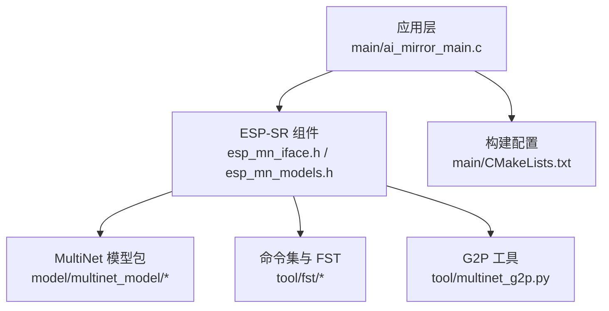
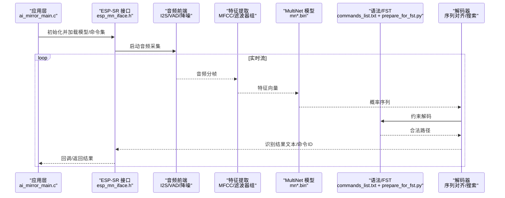
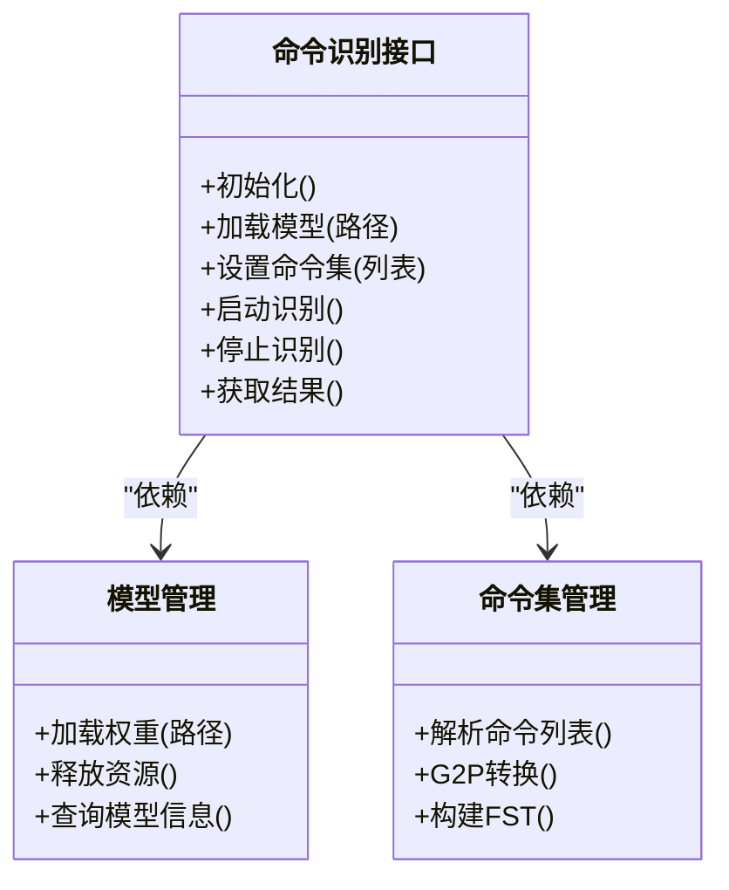
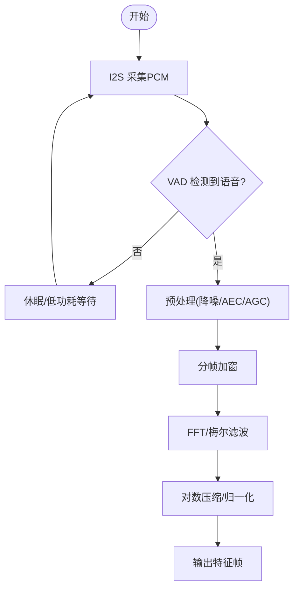
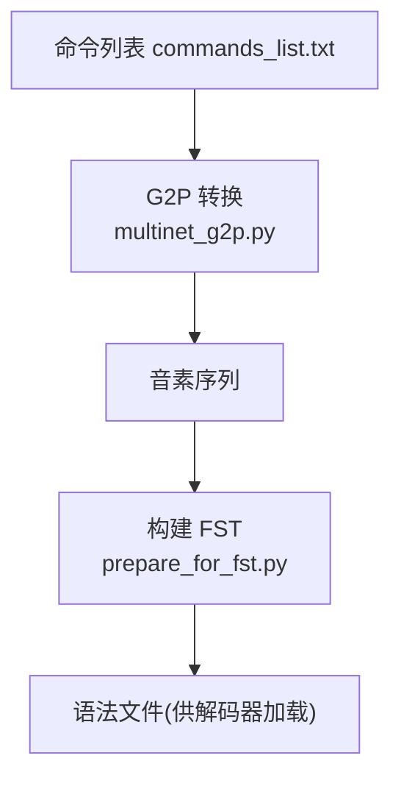
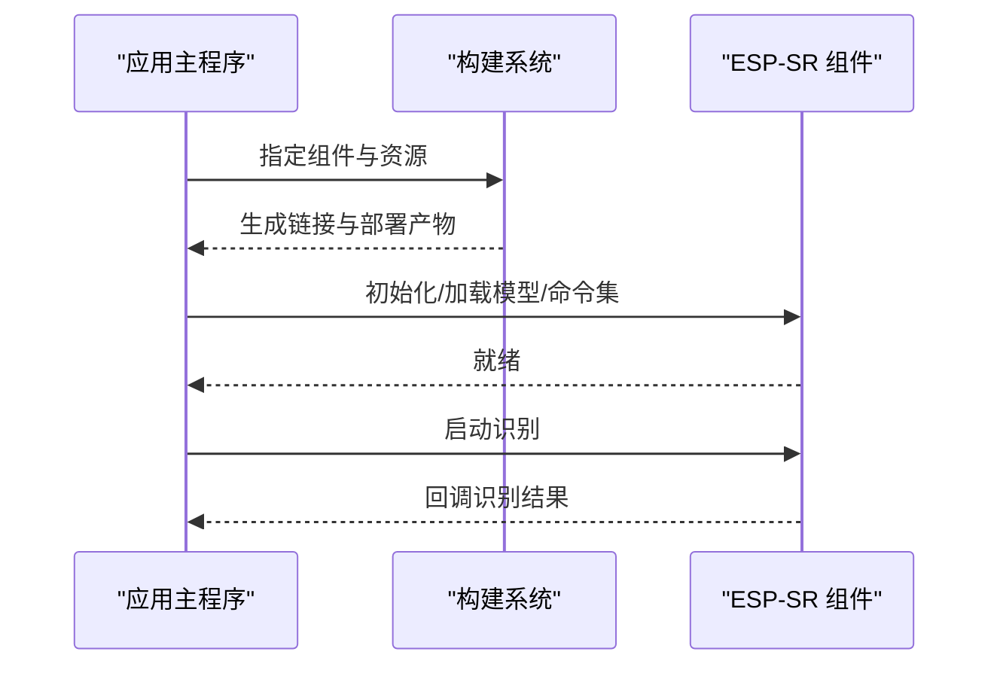
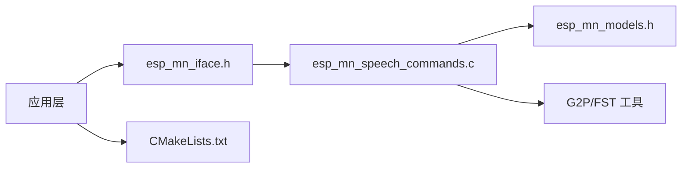

# 语音命令识别

<cite>
**本文引用的文件**   
- [README.md](file://README.md)
- [esp-sr/README.md](file://Firmware/esp32_ai_mirror/components/espressif__esp-sr/README.md)
- [esp_mn_speech_commands.c](file://Firmware/esp32_ai_mirror/components/espressif__esp-sr/src/esp_mn_speech_commands.c)
- [esp_mn_iface.h](file://Firmware/esp32_ai_mirror/components/espressif__esp-sr/include/esp32/esp_mn_iface.h)
- [esp_mn_models.h](file://Firmware/esp32_ai_mirror/components/espressif__esp-sr/include/esp32/esp_mn_models.h)
- [multinet_g2p.py](file://Firmware/esp32_ai_mirror/components/espressif__esp-sr/tool/multinet_g2p.py)
- [prepare_for_fst.py](file://Firmware/esp32_ai_mirror/components/espressif__esp-sr/tool/fst/prepare_for_fst.py)
- [commands_list.txt](file://Firmware/esp32_ai_mirror/components/espressif__esp-sr/tool/fst/commands_list.txt)
- [ai_mirror_main.c](file://Firmware/esp32_ai_mirror/main/ai_mirror_main.c)
- [CMakeLists.txt（main）](file://Firmware/esp32_ai_mirror/main/CMakeLists.txt)
</cite>

## 目录
1. [简介](#简介)
2. [项目结构](#项目结构)
3. [核心组件](#核心组件)
4. [架构总览](#架构总览)
5. [详细组件分析](#详细组件分析)
6. [依赖关系分析](#依赖关系分析)
7. [性能考量](#性能考量)
8. [故障排查指南](#故障排查指南)
9. [结论](#结论)
10. [附录](#附录)

## 简介
本文件面向在 ESP32 平台上基于 MultiNet 模型实现连续语音命令识别的开发者，系统阐述其原理、配置与扩展方法。内容涵盖：
- 连续语音识别的实现原理与关键流程（音频采集、前端处理、特征提取、声学解码、语言模型约束）
- 支持的语言模型与命令集扩展机制（中文、英文等）
- 实时识别的数据流与处理时序
- 自定义命令集定义、语法文件生成与模型训练要点
- 准确率优化策略（声学模型、语言模型、上下文理解）
- 多语言混合识别与方言支持方案
- 错误处理与结果后处理方法
- 性能基准测试与优化建议

## 项目结构
本项目以 ESP-IDF 工程组织，语音识别能力由 espressif__esp-sr 组件提供，应用层位于 main 目录。关键路径如下：
- 组件入口与文档：components/espressif__esp-sr/README.md
- 命令识别接口与模型头文件：include/esp32/esp_mn_iface.h, esp_mn_models.h
- 命令列表与工具链：tool/fst/* 与 tool/multinet_g2p.py
- 应用集成示例：main/ai_mirror_main.c, main/CMakeLists.txt

**图表来源** 
- [esp-sr/README.md](file://Firmware/esp32_ai_mirror/components/espressif__esp-sr/README.md)
- [esp_mn_iface.h](file://Firmware/esp32_ai_mirror/components/espressif__esp-sr/include/esp32/esp_mn_iface.h)
- [esp_mn_models.h](file://Firmware/esp32_ai_mirror/components/espressif__esp-sr/include/esp32/esp_mn_models.h)
- [prepare_for_fst.py](file://Firmware/esp32_ai_mirror/components/espressif__esp-sr/tool/fst/prepare_for_fst.py)
- [multinet_g2p.py](file://Firmware/esp32_ai_mirror/components/espressif__esp-sr/tool/multinet_g2p.py)
- [ai_mirror_main.c](file://Firmware/esp32_ai_mirror/main/ai_mirror_main.c)
- [CMakeLists.txt（main）](file://Firmware/esp32_ai_mirror/main/CMakeLists.txt)

**章节来源**
- [README.md](file://README.md)
- [esp-sr/README.md](file://Firmware/esp32_ai_mirror/components/espressif__esp-sr/README.md)

## 核心组件
- 命令识别接口层：提供初始化、加载模型、设置命令集、启动/停止识别、获取识别结果等 API。
- 模型与资源管理：封装 MultiNet 模型权重、FST 语法表、拼音/音素映射等资源加载与生命周期管理。
- 音频前端与流处理：负责 I2S 采集、VAD 检测、降噪/回声消除、分帧与特征提取（如 MFCC）。
- 解码器与语言模型：基于 MultiNet 的序列建模与 FST 约束解码，输出文本或命令 ID。
- 工具链：G2P 转换、FST 构建脚本、命令集管理与打包。

**章节来源**
- [esp_mn_iface.h](file://Firmware/esp32_ai_mirror/components/espressif__esp-sr/include/esp32/esp_mn_iface.h)
- [esp_mn_models.h](file://Firmware/esp32_ai_mirror/components/espressif__esp-sr/include/esp32/esp_mn_models.h)
- [esp_mn_speech_commands.c](file://Firmware/esp32_ai_mirror/components/espressif__esp-sr/src/esp_mn_speech_commands.c)

## 架构总览
下图展示从音频输入到识别输出的端到端数据流，以及 MultiNet 与 FST 的协同工作。

**图表来源** 
- [ai_mirror_main.c](file://Firmware/esp32_ai_mirror/main/ai_mirror_main.c)
- [esp_mn_iface.h](file://Firmware/esp32_ai_mirror/components/espressif__esp-sr/include/esp32/esp_mn_iface.h)
- [esp_mn_models.h](file://Firmware/esp32_ai_mirror/components/espressif__esp-sr/include/esp32/esp_mn_models.h)
- [prepare_for_fst.py](file://Firmware/esp32_ai_mirror/components/espressif__esp-sr/tool/fst/prepare_for_fst.py)
- [commands_list.txt](file://Firmware/esp32_ai_mirror/components/espressif__esp-sr/tool/fst/commands_list.txt)

## 详细组件分析

### 组件A：命令识别接口与模型管理
- 职责
  - 初始化与销毁识别引擎
  - 加载 MultiNet 模型与 FST 语法
  - 设置命令集、热词与置信度阈值
  - 启动/停止识别线程与事件回调
- 关键点
  - 模型选择：根据语言与目标设备选择对应 mn*.bin（如中文/英文、量化版本）
  - 命令集：通过命令列表与 G2P 生成音素序列，再构建 FST
  - 内存与缓存：合理分配缓冲区，避免频繁重分配
  - 线程安全：识别线程与 UI/业务线程解耦

**图表来源** 
- [esp_mn_iface.h](file://Firmware/esp32_ai_mirror/components/espressif__esp-sr/include/esp32/esp_mn_iface.h)
- [esp_mn_models.h](file://Firmware/esp32_ai_mirror/components/espressif__esp-sr/include/esp32/esp_mn_models.h)
- [esp_mn_speech_commands.c](file://Firmware/esp32_ai_mirror/components/espressif__esp-sr/src/esp_mn_speech_commands.c)

**章节来源**
- [esp_mn_iface.h](file://Firmware/esp32_ai_mirror/components/espressif__esp-sr/include/esp32/esp_mn_iface.h)
- [esp_mn_models.h](file://Firmware/esp32_ai_mirror/components/espressif__esp-sr/include/esp32/esp_mn_models.h)
- [esp_mn_speech_commands.c](file://Firmware/esp32_ai_mirror/components/espressif__esp-sr/src/esp_mn_speech_commands.c)

### 组件B：音频流处理与特征提取
- 职责
  - I2S 采集 PCM 音频
  - VAD 活动检测，降低无效计算
  - 降噪/回声消除（可选）
  - 分帧加窗、FFT、梅尔滤波、对数压缩得到特征
- 关键点
  - 采样率与帧长匹配模型输入要求
  - 特征归一化与通道维度对齐
  - 低延迟流水线设计（环形缓冲、双缓冲）

**图表来源** 
- [ai_mirror_main.c](file://Firmware/esp32_ai_mirror/main/ai_mirror_main.c)
- [esp_mn_iface.h](file://Firmware/esp32_ai_mirror/components/espressif__esp-sr/include/esp32/esp_mn_iface.h)

**章节来源**
- [ai_mirror_main.c](file://Firmware/esp32_ai_mirror/main/ai_mirror_main.c)

### 组件C：命令集扩展与语法文件生成
- 职责
  - 维护命令列表（中文/英文/混合）
  - 使用 G2P 将汉字转换为拼音/音素序列
  - 构建 FST 语法，约束解码空间
- 关键点
  - 命令命名规范与去歧义
  - 同音词处理与别名映射
  - FST 规模控制与编译时间平衡

**图表来源** 
- [commands_list.txt](file://Firmware/esp32_ai_mirror/components/espressif__esp-sr/tool/fst/commands_list.txt)
- [multinet_g2p.py](file://Firmware/esp32_ai_mirror/components/espressif__esp-sr/tool/multinet_g2p.py)
- [prepare_for_fst.py](file://Firmware/esp32_ai_mirror/components/espressif__esp-sr/tool/fst/prepare_for_fst.py)

**章节来源**
- [commands_list.txt](file://Firmware/esp32_ai_mirror/components/espressif__esp-sr/tool/fst/commands_list.txt)
- [multinet_g2p.py](file://Firmware/esp32_ai_mirror/components/espressif__esp-sr/tool/multinet_g2p.py)
- [prepare_for_fst.py](file://Firmware/esp32_ai_mirror/components/espressif__esp-sr/tool/fst/prepare_for_fst.py)

### 组件D：应用集成与构建配置
- 职责
  - 在应用中初始化 ESP-SR、加载模型与命令集
  - 注册识别回调，处理业务逻辑
  - 通过 CMake 链接组件与资源
- 关键点
  - 资源路径与分区表配置
  - 任务优先级与内存池配置
  - 调试日志与性能统计开关

**图表来源** 
- [ai_mirror_main.c](file://Firmware/esp32_ai_mirror/main/ai_mirror_main.c)
- [CMakeLists.txt（main）](file://Firmware/esp32_ai_mirror/main/CMakeLists.txt)

**章节来源**
- [ai_mirror_main.c](file://Firmware/esp32_ai_mirror/main/ai_mirror_main.c)
- [CMakeLists.txt（main）](file://Firmware/esp32_ai_mirror/main/CMakeLists.txt)

## 依赖关系分析
- 组件耦合
  - 应用层仅依赖 esp_mn_iface.h 暴露的接口，降低耦合
  - 模型与命令集通过资源管理器统一加载，便于替换与升级
- 外部依赖
  - ESP-IDF 音频栈（I2S、DMA、FreeRTOS）
  - 数学库（FFT、矩阵运算）
  - Python 工具链（G2P、FST 构建）
- 潜在循环依赖
  - 接口与实现分离，避免循环引用
  - 资源加载与解码器解耦

**图表来源** 
- [esp_mn_iface.h](file://Firmware/esp32_ai_mirror/components/espressif__esp-sr/include/esp32/esp_mn_iface.h)
- [esp_mn_speech_commands.c](file://Firmware/esp32_ai_mirror/components/espressif__esp-sr/src/esp_mn_speech_commands.c)
- [esp_mn_models.h](file://Firmware/esp32_ai_mirror/components/espressif__esp-sr/include/esp32/esp_mn_models.h)
- [CMakeLists.txt（main）](file://Firmware/esp32_ai_mirror/main/CMakeLists.txt)

**章节来源**
- [esp_mn_iface.h](file://Firmware/esp32_ai_mirror/components/espressif__esp-sr/include/esp32/esp_mn_iface.h)
- [esp_mn_speech_commands.c](file://Firmware/esp32_ai_mirror/components/espressif__esp-sr/src/esp_mn_speech_commands.c)
- [esp_mn_models.h](file://Firmware/esp32_ai_mirror/components/espressif__esp-sr/include/esp32/esp_mn_models.h)
- [CMakeLists.txt（main）](file://Firmware/esp32_ai_mirror/main/CMakeLists.txt)

## 性能考量
- 模型选择
  - 优先选用量化模型（如 q8/q16）以降低内存与算力需求
  - 根据场景选择合适大小的 MultiNet 版本（精度 vs 速度权衡）
- 前端优化
  - 合理设置 VAD 阈值与静音门限，减少无效推理
  - 使用硬件加速（DSP/NEON）进行 FFT 与卷积
- 解码优化
  - 限制 FST 规模，剔除低频/不常用命令
  - 动态裁剪搜索空间（热词、上下文窗口）
- 运行时优化
  - 任务优先级与调度策略
  - 内存池复用，避免碎片化
  - 批量处理与流水线并行

[本节为通用指导，无需特定文件来源]

## 故障排查指南
- 常见问题
  - 无法加载模型：检查路径、权限与分区表
  - 识别结果为空：确认 VAD 阈值、麦克风增益与环境噪声
  - 命令误识别：检查命令集是否包含同音词冲突，调整 FST 权重
  - 实时性不足：降低模型尺寸、关闭非必要前处理模块
- 诊断手段
  - 启用调试日志与性能计数器
  - 录制音频样本离线验证
  - 逐步隔离问题（前端、特征、模型、解码）

**章节来源**
- [esp_mn_speech_commands.c](file://Firmware/esp32_ai_mirror/components/espressif__esp-sr/src/esp_mn_speech_commands.c)

## 结论
通过在 ESP32 上集成 ESP-SR 与 MultiNet 模型，可实现稳定高效的连续语音命令识别。关键在于：
- 清晰的接口与资源管理
- 合理的命令集与 FST 构建
- 精细的前端与解码优化
- 完善的错误处理与性能监控

[本节为总结性内容，无需特定文件来源]

## 附录
- 支持语言与模型
  - 中文：mn*_cn 系列模型
  - 英文：mn*_en 系列模型
  - 量化版本：q8/q16 用于资源受限设备
- 命令集扩展步骤
  - 编辑 commands_list.txt
  - 运行 multinet_g2p.py 生成音素序列
  - 运行 prepare_for_fst.py 构建 FST
  - 重新编译并部署
- 准确率优化清单
  - 声学模型：增加领域语料、微调参数
  - 语言模型：引入领域词典、调整 N-gram 权重
  - 上下文理解：会话状态机、意图消歧
- 多语言与方言
  - 多语言：切换不同语言模型与命令集
  - 方言：收集方言语料，训练专用模型或适配 G2P 规则

[本节为补充说明，无需特定文件来源]