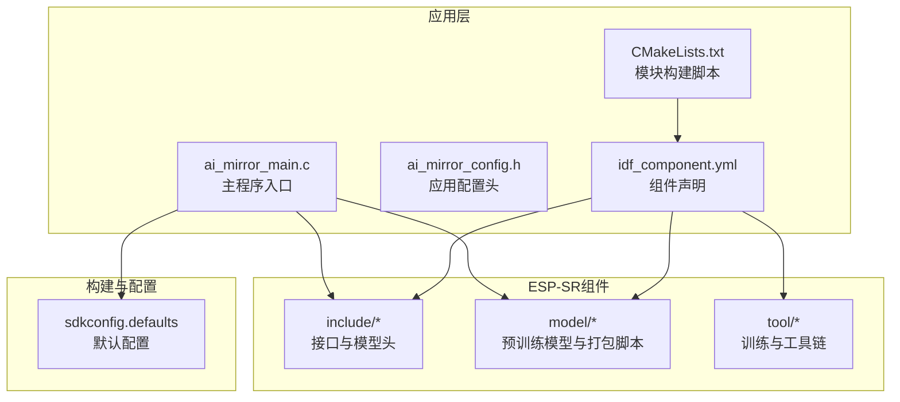
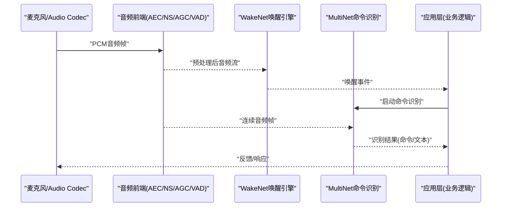
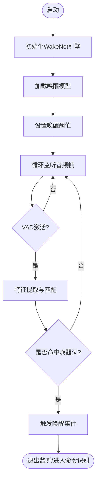
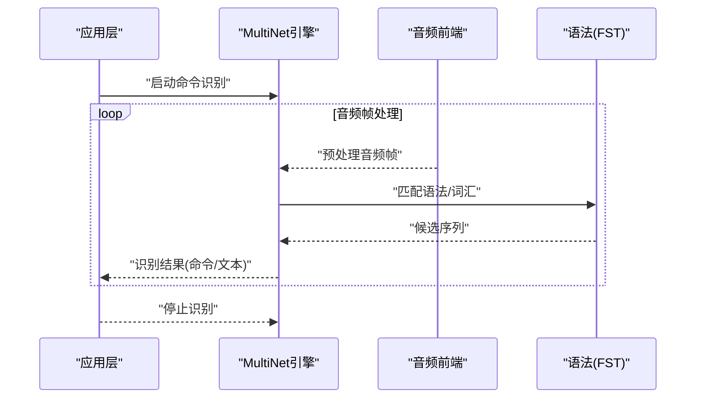
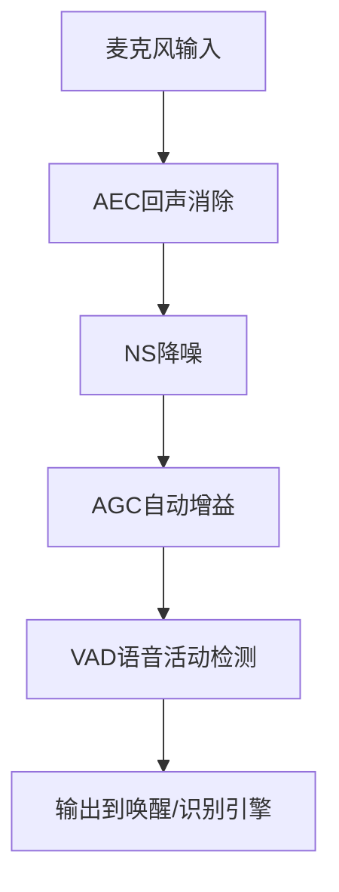
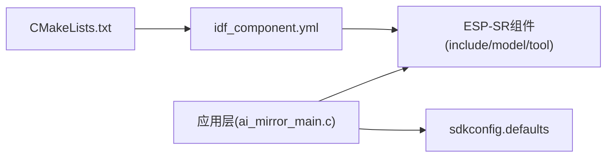

# 语音识别

<cite>
**本文引用的文件**   
- [ai_mirror_main.c](file://Firmware/esp32_ai_mirror/main/ai_mirror_main.c)
- [ai_mirror_config.h](file://Firmware/esp32_ai_mirror/main/ai_mirror_config.h)
- [CMakeLists.txt](file://Firmware/esp32_ai_mirror/main/CMakeLists.txt)
- [idf_component.yml](file://Firmware/esp32_ai_mirror/main/idf_component.yml)
- [sdkconfig.defaults](file://Firmware/esp32_ai_mirror/sdkconfig.defaults)
- [README.md](file://Firmware/esp32_ai_mirror/README.md)
- [esp_wn_models.h](file://Firmware/esp32_ai_mirror/components/espressif__esp-sr/include/esp_wn_models.h)
- [esp_mn_models.h](file://Firmware/esp32_ai_mirror/components/espressif__esp-sr/include/esp_mn_models.h)
- [esp_afe_sr_iface.h](file://Firmware/esp32_ai_mirror/components/espressif__esp-sr/include/esp_afe_sr_iface.h)
- [esp_vad.h](file://Firmware/esp32_ai_mirror/components/espressif__esp-sr/include/esp_vad.h)
- [esp_ns.h](file://Firmware/esp32_ai_mirror/components/espressif__esp-sr/include/esp_ns.h)
- [esp_agc.h](file://Firmware/esp32_ai_mirror/components/espressif__esp-sr/include/esp_agc.h)
- [multinet2_ch.h](file://Firmware/esp32_ai_mirror/components/espressif__esp-sr/include/multinet2_ch.h)
- [hilexin_wn5.h](file://Firmware/esp32_ai_mirror/components/espressif__esp-sr/include/hilexin_wn5.h)
- [nihaoxiaozhi_wn5.h](file://Firmware/esp32_ai_mirror/components/espressif__esp-sr/include/nihaoxiaozhi_wn5.h)
- [movemodel.py](file://Firmware/esp32_ai_mirror/components/espressif__esp-sr/model/movemodel.py)
- [pack_model.py](file://Firmware/esp32_ai_mirror/components/espressif__esp-sr/model/pack_model.py)
- [prepare_for_fst.py](file://Firmware/esp32_ai_mirror/components/espressif__esp-sr/tool/fst/prepare_for_fst.py)
- [multinet_g2p.py](file://Firmware/esp32_ai_mirror/components/espressif__esp-sr/tool/multinet_g2p.py)
- [multinet_pinyin.py](file://Firmware/esp32_ai_mirror/components/espressif__esp-sr/tool/multinet_pinyin.py)
- [commands_list.txt](file://Firmware/esp32_ai_mirror/components/espressif__esp-sr/tool/fst/commands_list.txt)
</cite>

## 目录
1. [简介](#简介)
2. [项目结构](#项目结构)
3. [核心组件](#核心组件)
4. [架构总览](#架构总览)
5. [详细组件分析](#详细组件分析)
6. [依赖关系分析](#依赖关系分析)
7. [性能与准确率优化](#性能与准确率优化)
8. [故障排查指南](#故障排查指南)
9. [结论](#结论)
10. [附录](#附录)

## 简介
本文件面向AI镜子设备的语音识别功能，基于ESP-SR库实现唤醒词检测与语音命令识别。文档围绕WakeNet唤醒模型与MultiNet命令识别模型的配置与使用展开，系统阐述语音前端处理（VAD、降噪、AEC、AGC）的流水线与参数调优方法，并提供自定义唤醒词训练、命令集扩展、多语言与方言适配、模型部署与更新管理策略等实践指南。目标是帮助开发者在资源受限的嵌入式平台上获得高可用、低延迟、高准确率的语音交互体验。

## 项目结构
本项目采用分层组织：应用层位于main目录，负责设备初始化、任务调度与业务逻辑；音频与语音能力由components中的ESP-SR组件提供，包含唤醒、命令识别、音频前端处理与模型打包工具；构建与配置通过CMake与Kconfig完成，运行时参数由sdkconfig.defaults集中管理。

图表来源 
- [ai_mirror_main.c](file://Firmware/esp32_ai_mirror/main/ai_mirror_main.c)
- [ai_mirror_config.h](file://Firmware/esp32_ai_mirror/main/ai_mirror_config.h)
- [CMakeLists.txt](file://Firmware/esp32_ai_mirror/main/CMakeLists.txt)
- [idf_component.yml](file://Firmware/esp32_ai_mirror/main/idf_component.yml)
- [sdkconfig.defaults](file://Firmware/esp32_ai_mirror/sdkconfig.defaults)

章节来源
- [README.md](file://Firmware/esp32_ai_mirror/README.md)
- [idf_component.yml](file://Firmware/esp32_ai_mirror/main/idf_component.yml)
- [sdkconfig.defaults](file://Firmware/esp32_ai_mirror/sdkconfig.defaults)

## 核心组件
- 唤醒引擎（WakeNet）
  - 用于低功耗持续监听，检测预设或自定义唤醒词，触发后续命令识别流程。
  - 关键头文件与模型定义参见 esp_wn_models.h、hilexin_wn5.h、nihaoxiaozhi_wn5.h。
- 命令识别（MultiNet）
  - 对唤醒后的语音片段进行关键词/短语识别，支持中文及多语言模型。
  - 关键头文件与模型定义参见 esp_mn_models.h、multinet2_ch.h。
- 音频前端（AFE）
  - 提供VAD（语音活动检测）、NS（降噪）、AEC（回声消除）、AGC（自动增益控制）等处理模块。
  - 接口与模型注册参见 esp_afe_sr_iface.h、esp_vad.h、esp_ns.h、esp_agc.h。
- 模型打包与部署
  - 将训练好的模型转换为可烧录格式，并生成对应头文件供运行时加载。
  - 脚本参见 model/movemodel.py、model/pack_model.py。
- 命令集与语法扩展
  - 通过工具链生成FST语法与拼音映射，便于扩展命令集与多语言支持。
  - 工具参见 tool/fst/prepare_for_fst.py、tool/multinet_g2p.py、tool/multinet_pinyin.py、commands_list.txt。

章节来源
- [esp_wn_models.h](file://Firmware/esp32_ai_mirror/components/espressif__esp-sr/include/esp_wn_models.h)
- [hilexin_wn5.h](file://Firmware/esp32_ai_mirror/components/espressif__esp-sr/include/hilexin_wn5.h)
- [nihaoxiaozhi_wn5.h](file://Firmware/esp32_ai_mirror/components/espressif__esp-sr/include/nihaoxiaozhi_wn5.h)
- [esp_mn_models.h](file://Firmware/esp32_ai_mirror/components/espressif__esp-sr/include/esp_mn_models.h)
- [multinet2_ch.h](file://Firmware/esp32_ai_mirror/components/espressif__esp-sr/include/multinet2_ch.h)
- [esp_afe_sr_iface.h](file://Firmware/esp32_ai_mirror/components/espressif__esp-sr/include/esp_afe_sr_iface.h)
- [esp_vad.h](file://Firmware/esp32_ai_mirror/components/espressif__esp-sr/include/esp_vad.h)
- [esp_ns.h](file://Firmware/esp32_ai_mirror/components/espressif__esp-sr/include/esp_ns.h)
- [esp_agc.h](file://Firmware/esp32_ai_mirror/components/espressif__esp-sr/include/esp_agc.h)
- [movemodel.py](file://Firmware/esp32_ai_mirror/components/espressif__esp-sr/model/movemodel.py)
- [pack_model.py](file://Firmware/esp32_ai_mirror/components/espressif__esp-sr/model/pack_model.py)
- [prepare_for_fst.py](file://Firmware/esp32_ai_mirror/components/espressif__esp-sr/tool/fst/prepare_for_fst.py)
- [multinet_g2p.py](file://Firmware/esp32_ai_mirror/components/espressif__esp-sr/tool/multinet_g2p.py)
- [multinet_pinyin.py](file://Firmware/esp32_ai_mirror/components/espressif__esp-sr/tool/multinet_pinyin.py)
- [commands_list.txt](file://Firmware/esp32_ai_mirror/components/espressif__esp-sr/tool/fst/commands_list.txt)

## 架构总览
整体数据流从麦克风采集开始，经过AEC/NS/AGC/VAD等前端处理后，送入WakeNet进行唤醒检测；唤醒成功后，进入MultiNet进行命令识别，最终将结果回传至应用层执行相应动作。

图表来源 
- [esp_afe_sr_iface.h](file://Firmware/esp32_ai_mirror/components/espressif__esp-sr/include/esp_afe_sr_iface.h)
- [esp_vad.h](file://Firmware/esp32_ai_mirror/components/espressif__esp-sr/include/esp_vad.h)
- [esp_ns.h](file://Firmware/esp32_ai_mirror/components/espressif__esp-sr/include/esp_ns.h)
- [esp_agc.h](file://Firmware/esp32_ai_mirror/components/espressif__esp-sr/include/esp_agc.h)
- [esp_wn_models.h](file://Firmware/esp32_ai_mirror/components/espressif__esp-sr/include/esp_wn_models.h)
- [esp_mn_models.h](file://Firmware/esp32_ai_mirror/components/espressif__esp-sr/include/esp_mn_models.h)

章节来源
- [ai_mirror_main.c](file://Firmware/esp32_ai_mirror/main/ai_mirror_main.c)
- [ai_mirror_config.h](file://Firmware/esp32_ai_mirror/main/ai_mirror_config.h)

## 详细组件分析

### WakeNet唤醒模型与配置
- 模型选择与加载
  - 通过头文件暴露的模型描述符选择内置唤醒词模型（如“小爱同学”、“你好小智”等），或在编译期替换为自定义模型头。
  - 典型头文件包括 hilexin_wn5.h、nihaoxiaozhi_wn5.h 以及通用模型接口 esp_wn_models.h。
- 运行模式与阈值
  - 设置唤醒阈值以平衡误唤醒与漏唤醒；结合VAD门限减少无效唤醒。
  - 在低功耗模式下循环监听，检测到唤醒后切换到命令识别阶段。
- 集成要点
  - 确保采样率、帧长与模型要求一致；正确初始化唤醒引擎实例。
  - 回调机制上报唤醒事件，应用层据此切换状态机。

图表来源 
- [esp_wn_models.h](file://Firmware/esp32_ai_mirror/components/espressif__esp-sr/include/esp_wn_models.h)
- [hilexin_wn5.h](file://Firmware/esp32_ai_mirror/components/espressif__esp-sr/include/hilexin_wn5.h)
- [nihaoxiaozhi_wn5.h](file://Firmware/esp32_ai_mirror/components/espressif__esp-sr/include/nihaoxiaozhi_wn5.h)

章节来源
- [esp_wn_models.h](file://Firmware/esp32_ai_mirror/components/espressif__esp-sr/include/esp_wn_models.h)
- [hilexin_wn5.h](file://Firmware/esp32_ai_mirror/components/espressif__esp-sr/include/hilexin_wn5.h)
- [nihaoxiaozhi_wn5.h](file://Firmware/esp32_ai_mirror/components/espressif__esp-sr/include/nihaoxiaozhi_wn5.h)

### MultiNet命令识别模型与配置
- 模型选择与语言
  - 中文命令识别模型通过 multinet2_ch.h 暴露；英文或其他语言模型可通过对应头文件引入。
  - 模型版本与量化（如q8）影响内存占用与推理速度，需根据硬件资源权衡。
- 语法与词汇表
  - 通过 commands_list.txt 维护命令集合，配合 prepare_for_fst.py 生成FST语法树。
  - 使用 multinet_g2p.py 与 multinet_pinyin.py 进行音素转换与拼音映射，提升识别鲁棒性。
- 运行流程
  - 接收唤醒事件后启动命令识别，持续读取音频帧直至静音结束或超时。
  - 输出结构化命令或文本，应用层解析并执行。

图表来源 
- [esp_mn_models.h](file://Firmware/esp32_ai_mirror/components/espressif__esp-sr/include/esp_mn_models.h)
- [multinet2_ch.h](file://Firmware/esp32_ai_mirror/components/espressif__esp-sr/include/multinet2_ch.h)
- [prepare_for_fst.py](file://Firmware/esp32_ai_mirror/components/espressif__esp-sr/tool/fst/prepare_for_fst.py)
- [multinet_g2p.py](file://Firmware/esp32_ai_mirror/components/espressif__esp-sr/tool/multinet_g2p.py)
- [multinet_pinyin.py](file://Firmware/esp32_ai_mirror/components/espressif__esp-sr/tool/multinet_pinyin.py)
- [commands_list.txt](file://Firmware/esp32_ai_mirror/components/espressif__esp-sr/tool/fst/commands_list.txt)

章节来源
- [esp_mn_models.h](file://Firmware/esp32_ai_mirror/components/espressif__esp-sr/include/esp_mn_models.h)
- [multinet2_ch.h](file://Firmware/esp32_ai_mirror/components/espressif__esp-sr/include/multinet2_ch.h)
- [prepare_for_fst.py](file://Firmware/esp32_ai_mirror/components/espressif__esp-sr/tool/fst/prepare_for_fst.py)
- [multinet_g2p.py](file://Firmware/esp32_ai_mirror/components/espressif__esp-sr/tool/multinet_g2p.py)
- [multinet_pinyin.py](file://Firmware/esp32_ai_mirror/components/espressif__esp-sr/tool/multinet_pinyin.py)
- [commands_list.txt](file://Firmware/esp32_ai_mirror/components/espressif__esp-sr/tool/fst/commands_list.txt)

### 语音预处理流程（VAD、降噪、AEC、AGC）
- AEC（回声消除）
  - 消除扬声器播放的回声，避免干扰唤醒与识别。
  - 需要参考音频输入（来自DAC/内部环路）与麦克风输入对齐。
- NS（降噪）
  - 抑制环境噪声，提高信噪比，改善唤醒与识别稳定性。
- AGC（自动增益控制）
  - 动态调整音量，保证输入信号幅度稳定，避免饱和或过低。
- VAD（语音活动检测）
  - 判断语音起止，降低唤醒引擎与命令识别的无效计算量。
- 流水线集成
  - 通过 esp_afe_sr_iface.h 统一接口串联各模块，按帧顺序处理。
  - 参数配置集中在 sdkconfig.defaults 或通过运行时API调整。

图表来源 
- [esp_afe_sr_iface.h](file://Firmware/esp32_ai_mirror/components/espressif__esp-sr/include/esp_afe_sr_iface.h)
- [esp_vad.h](file://Firmware/esp32_ai_mirror/components/espressif__esp-sr/include/esp_vad.h)
- [esp_ns.h](file://Firmware/esp32_ai_mirror/components/espressif__esp-sr/include/esp_ns.h)
- [esp_agc.h](file://Firmware/esp32_ai_mirror/components/espressif__esp-sr/include/esp_agc.h)

章节来源
- [esp_afe_sr_iface.h](file://Firmware/esp32_ai_mirror/components/espressif__esp-sr/include/esp_afe_sr_iface.h)
- [esp_vad.h](file://Firmware/esp32_ai_mirror/components/espressif__esp-sr/include/esp_vad.h)
- [esp_ns.h](file://Firmware/esp32_ai_mirror/components/espressif__esp-sr/include/esp_ns.h)
- [esp_agc.h](file://Firmware/esp32_ai_mirror/components/espressif__esp-sr/include/esp_agc.h)
- [sdkconfig.defaults](file://Firmware/esp32_ai_mirror/sdkconfig.defaults)

### 自定义唤醒词训练与命令集扩展
- 自定义唤醒词
  - 准备正负样本录音，使用ESP-SR训练工具链生成模型权重与头文件。
  - 替换内置模型头（如 hilexin_wn5.h、nihaoxiaozhi_wn5.h）为自定义模型头。
  - 重新打包模型（movemodel.py、pack_model.py）并烧录。
- 命令集扩展
  - 在 commands_list.txt 中新增命令条目，保持简洁明确。
  - 使用 prepare_for_fst.py 生成FST语法，确保与MultiNet兼容。
  - 通过 multinet_g2p.py 与 multinet_pinyin.py 完善音素映射，提升泛化能力。
- 验证与回归
  - 在目标设备上测试不同距离、噪声环境下的唤醒与识别效果。
  - 记录误唤醒率与漏识率，迭代阈值与模型参数。

章节来源
- [movemodel.py](file://Firmware/esp32_ai_mirror/components/espressif__esp-sr/model/movemodel.py)
- [pack_model.py](file://Firmware/esp32_ai_mirror/components/espressif__esp-sr/model/pack_model.py)
- [prepare_for_fst.py](file://Firmware/esp32_ai_mirror/components/espressif__esp-sr/tool/fst/prepare_for_fst.py)
- [multinet_g2p.py](file://Firmware/esp32_ai_mirror/components/espressif__esp-sr/tool/multinet_g2p.py)
- [multinet_pinyin.py](file://Firmware/esp32_ai_mirror/components/espressif__esp-sr/tool/multinet_pinyin.py)
- [commands_list.txt](file://Firmware/esp32_ai_mirror/components/espressif__esp-sr/tool/fst/commands_list.txt)

### 多语言支持与方言适配方案
- 多语言模型
  - 选择对应语言的MultiNet模型头（如英文mn5q8_en），并在应用中切换。
  - 注意采样率、帧长与模型要求的匹配。
- 方言适配
  - 扩充命令集与音素映射，针对口音差异增加样本覆盖。
  - 调整VAD与AGC参数以适应不同说话人特性。
- 切换策略
  - 运行时根据用户偏好或网络配置动态加载不同语言模型。
  - 缓存常用模型以减少切换开销。

章节来源
- [esp_mn_models.h](file://Firmware/esp32_ai_mirror/components/espressif__esp-sr/include/esp_mn_models.h)
- [multinet2_ch.h](file://Firmware/esp32_ai_mirror/components/espressif__esp-sr/include/multinet2_ch.h)
- [multinet_pinyin.py](file://Firmware/esp32_ai_mirror/components/espressif__esp-sr/tool/multinet_pinyin.py)

### 模型部署、更新与管理策略
- 模型打包与烧录
  - 使用 movemodel.py 与 pack_model.py 生成可烧录镜像与头文件。
  - 分区表与固件布局需预留足够空间存放模型。
- 在线更新
  - 通过OTA下载新模型包，校验完整性后替换旧模型。
  - 设计回滚机制，确保更新失败不影响基本功能。
- 版本管理
  - 为每个模型分配版本号与兼容性矩阵，避免不兼容升级。
  - 在应用层记录当前模型版本与生效时间，便于问题定位。

章节来源
- [movemodel.py](file://Firmware/esp32_ai_mirror/components/espressif__esp-sr/model/movemodel.py)
- [pack_model.py](file://Firmware/esp32_ai_mirror/components/espressif__esp-sr/model/pack_model.py)
- [CMakeLists.txt](file://Firmware/esp32_ai_mirror/main/CMakeLists.txt)
- [idf_component.yml](file://Firmware/esp32_ai_mirror/main/idf_component.yml)

## 依赖关系分析
ESP-SR组件通过idf_component.yml声明依赖，应用层在CMakeLists.txt中引用相关模块，运行时参数由sdkconfig.defaults提供默认值。

图表来源 
- [CMakeLists.txt](file://Firmware/esp32_ai_mirror/main/CMakeLists.txt)
- [idf_component.yml](file://Firmware/esp32_ai_mirror/main/idf_component.yml)
- [sdkconfig.defaults](file://Firmware/esp32_ai_mirror/sdkconfig.defaults)

章节来源
- [CMakeLists.txt](file://Firmware/esp32_ai_mirror/main/CMakeLists.txt)
- [idf_component.yml](file://Firmware/esp32_ai_mirror/main/idf_component.yml)
- [sdkconfig.defaults](file://Firmware/esp32_ai_mirror/sdkconfig.defaults)

## 性能与准确率优化
- 前端参数调优
  - 合理设置VAD门限与AGC增益，避免过激导致误判或失真。
  - 在强噪声环境下增强NS强度，但注意保留语音细节。
- 模型与量化
  - 选择合适版本的MultiNet（如q8量化）以平衡速度与精度。
  - 唤醒阈值微调，降低误唤醒同时保持高召回。
- 资源与延迟
  - 控制音频帧大小与处理周期，避免CPU峰值过高。
  - 使用DMA与双缓冲减少阻塞，提升吞吐。
- 场景适配
  - 针对不同房间声学特性校准AEC与NS参数。
  - 离线与在线混合策略，必要时回退云端以提升准确率。

[本节为通用指导，无需特定文件来源]

## 故障排查指南
- 无法唤醒
  - 检查唤醒模型是否正确加载与阈值设置。
  - 确认VAD门限与AGC增益是否合理。
- 识别错误率高
  - 核对命令集与FST语法一致性。
  - 检查音素映射与多语言模型匹配。
- 音频异常
  - 验证AEC参考音频路径与同步。
  - 检查麦克风驱动与采样率配置。
- 日志与调试
  - 启用ESP-SR调试开关，捕获中间状态与错误码。
  - 记录关键事件（唤醒、识别开始/结束、错误）。

章节来源
- [esp_vad.h](file://Firmware/esp32_ai_mirror/components/espressif__esp-sr/include/esp_vad.h)
- [esp_ns.h](file://Firmware/esp32_ai_mirror/components/espressif__esp-sr/include/esp_ns.h)
- [esp_agc.h](file://Firmware/esp32_ai_mirror/components/espressif__esp-sr/include/esp_agc.h)
- [esp_afe_sr_iface.h](file://Firmware/esp32_ai_mirror/components/espressif__esp-sr/include/esp_afe_sr_iface.h)

## 结论
通过ESP-SR提供的WakeNet与MultiNet模型，结合完善的音频前端处理能力，AI镜子可实现稳定高效的语音交互。合理的参数调优、科学的模型管理与持续的本地化适配是提升用户体验的关键。建议在生产环境中建立完整的测试与回归流程，确保在不同环境与用户群体下保持一致的性能与准确率。

[本节为总结性内容，无需特定文件来源]

## 附录
- 术语表
  - WakeNet：唤醒词检测模型
  - MultiNet：语音命令识别模型
  - AEC：回声消除
  - NS：降噪
  - AGC：自动增益控制
  - VAD：语音活动检测
  - FST：有限状态机（用于语法建模）
- 参考文件
  - 模型头与接口：esp_wn_models.h、esp_mn_models.h、multinet2_ch.h
  - 前端接口：esp_afe_sr_iface.h、esp_vad.h、esp_ns.h、esp_agc.h
  - 工具与脚本：movemodel.py、pack_model.py、prepare_for_fst.py、multinet_g2p.py、multinet_pinyin.py
  - 配置与构建：sdkconfig.defaults、CMakeLists.txt、idf_component.yml

[本节为补充信息，无需特定文件来源]