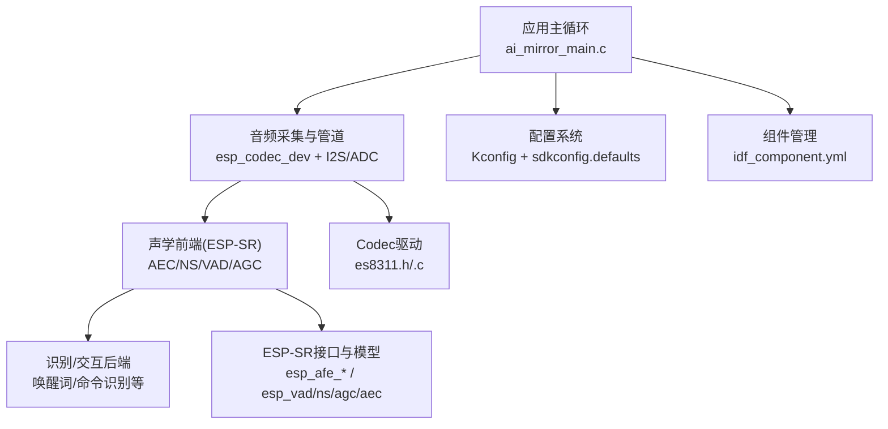
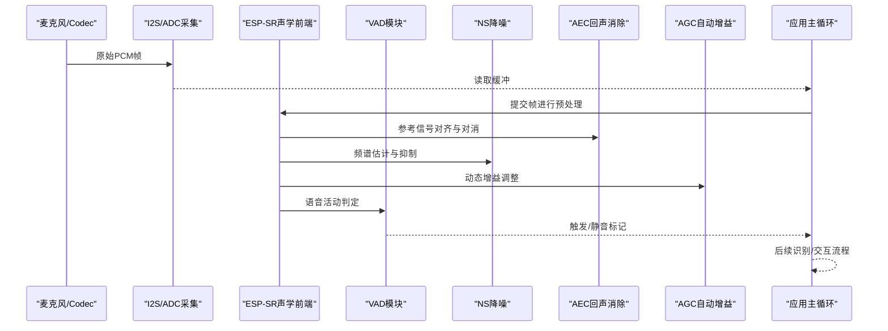
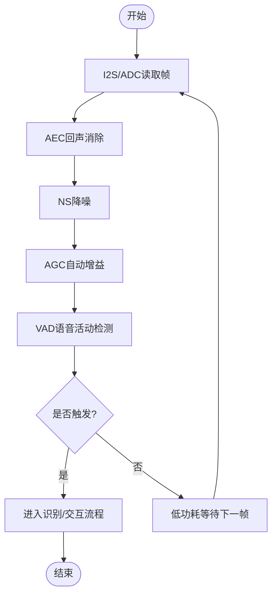
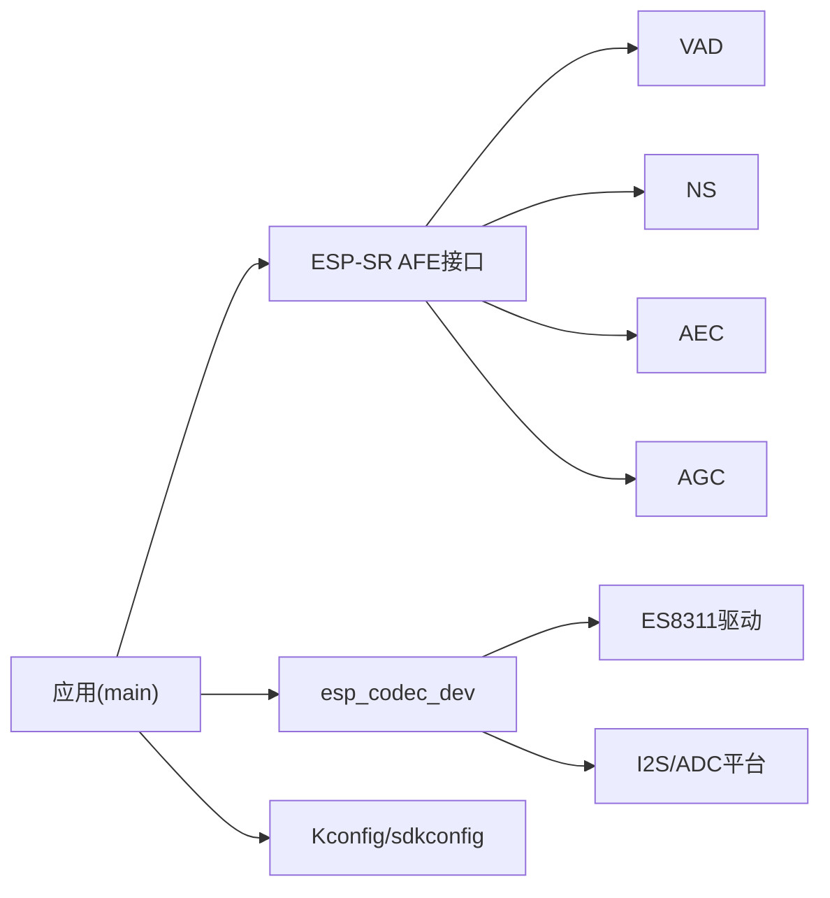

# 音频预处理

<cite>
**本文引用的文件**   
- [ai_mirror_main.c](file://Firmware/esp32_ai_mirror/main/ai_mirror_main.c)
- [ai_mirror_config.h](file://Firmware/esp32_ai_mirror/main/ai_mirror_config.h)
- [CMakeLists.txt](file://Firmware/esp32_ai_mirror/main/CMakeLists.txt)
- [Kconfig.projbuild](file://Firmware/esp32_ai_mirror/main/Kconfig.projbuild)
- [idf_component.yml](file://Firmware/esp32_ai_mirror/main/idf_component.yml)
- [sdkconfig.defaults](file://Firmware/esp32_ai_mirror/sdkconfig.defaults)
- [esp_afe_config.h](file://Firmware/esp32_ai_mirror/components/espressif__esp-sr/include/esp_afe_config.h)
- [esp_afe_sr_iface.h](file://Firmware/esp32_ai_mirror/components/espressif__esp-sr/include/esp_afe_sr_iface.h)
- [esp_afe_sr_models.h](file://Firmware/esp32_ai_mirror/components/espressif__esp-sr/include/esp_afe_sr_models.h)
- [esp_vad.h](file://Firmware/esp32_ai_mirror/components/espressif__esp-sr/include/esp_vad.h)
- [esp_ns.h](file://Firmware/esp32_ai_mirror/components/espressif__esp-sr/include/esp_ns.h)
- [esp_agc.h](file://Firmware/esp32_ai_mirror/components/espressif__esp-sr/include/esp_agc.h)
- [esp_aec.h](file://Firmware/esp32_ai_mirror/components/espressif__esp-sr/include/esp_aec.h)
- [es8311.h](file://Firmware/esp32_ai_mirror/managed_components/espressif__es8311/include/es8311.h)
- [es8311.c](file://Firmware/esp32_ai_mirror/managed_components/espressif__es8311/es8311.c)
- [audio_codec_dev_types.h](file://Firmware/esp32_ai_mirror/managed_components/espressif__esp_codec_dev/include/esp_codec_dev_types.h)
- [audio_codec_data_adc.c](file://Firmware/esp32_ai_mirror/managed_components/espressif__esp_codec_dev/platform/audio_codec_data_adc.c)
- [audio_codec_data_i2s.c](file://Firmware/esp32_ai_mirror/managed_components/espressif__esp_codec_dev/platform/audio_codec_data_i2s.c)
- [esp_codec_dev.c](file://Firmware/esp32_ai_mirror/managed_components/espressif__esp_codec_dev/esp_codec_dev.c)
- [README.md](file://Firmware/esp32_ai_mirror/README.md)
</cite>

## 目录
1. [简介](#简介)
2. [项目结构](#项目结构)
3. [核心组件](#核心组件)
4. [架构总览](#架构总览)
5. [详细组件分析](#详细组件分析)
6. [依赖关系分析](#依赖关系分析)
7. [性能与实时性优化](#性能与实时性优化)
8. [故障排查指南](#故障排查指南)
9. [结论](#结论)
10. [附录](#附录)

## 简介
本文件面向ESP32 AI镜像项目的音频预处理模块，系统性阐述VAD（语音活动检测）、NS（降噪）、AEC（回声消除）与AGC（自动增益控制）的实现原理、配置方法、参数影响与调优策略。文档同时覆盖麦克风阵列配置、声学前端优化、环境自适应策略、内存管理与实时处理优化技术，并给出音频质量评估方法与调试工具使用建议，以及与ESP-SR库的集成方式和最佳实践。

## 项目结构
本项目采用分层组织：应用层位于main目录，音频前端与算法通过ESP-SR组件提供，编解码与I2S驱动由esp_codec_dev与具体Codec驱动（如ES8311）实现。关键入口与配置集中在main/ai_mirror_main.c与相关头文件、Kconfig与sdkconfig中；ESP-SR的前端接口与模型声明在include目录下。

图表来源
- [ai_mirror_main.c](file://Firmware/esp32_ai_mirror/main/ai_mirror_main.c)
- [esp_afe_config.h](file://Firmware/esp32_ai_mirror/components/espressif__esp-sr/include/esp_afe_config.h)
- [esp_codec_dev.c](file://Firmware/esp32_ai_mirror/managed_components/espressif__esp_codec_dev/esp_codec_dev.c)
- [es8311.h](file://Firmware/esp32_ai_mirror/managed_components/espressif__es8311/include/es8311.h)

章节来源
- [README.md](file://Firmware/esp32_ai_mirror/README.md)
- [idf_component.yml](file://Firmware/esp32_ai_mirror/main/idf_component.yml)
- [sdkconfig.defaults](file://Firmware/esp32_ai_mirror/sdkconfig.defaults)

## 核心组件
- 声学前端（ESP-SR AFE）：封装AEC、NS、VAD、AGC等模块，提供统一初始化与数据流接口。
- 编解码子系统（esp_codec_dev）：负责I2S/ADC数据采集、通道切换、采样率与位深设置、音量控制。
- 硬件Codec（ES8311）：I2C寄存器配置、MIC/LineIn选择、PGA/HPF/LPF等模拟前端参数。
- 应用层（main）：任务调度、缓冲区管理、事件分发、与ESP-SR前端的对接。

章节来源
- [esp_afe_sr_iface.h](file://Firmware/esp32_ai_mirror/components/espressif__esp-sr/include/esp_afe_sr_iface.h)
- [esp_afe_sr_models.h](file://Firmware/esp32_ai_mirror/components/espressif__esp-sr/include/esp_afe_sr_models.h)
- [esp_codec_dev.c](file://Firmware/esp32_ai_mirror/managed_components/espressif__esp_codec_dev/esp_codec_dev.c)
- [es8311.h](file://Firmware/esp32_ai_mirror/managed_components/espressif__es8311/include/es8311.h)

## 架构总览
下图展示从麦克风到识别后端的完整数据流，以及各处理模块的顺序与作用。

图表来源
- [esp_afe_sr_iface.h](file://Firmware/esp32_ai_mirror/components/espressif__esp-sr/include/esp_afe_sr_iface.h)
- [esp_aec.h](file://Firmware/esp32_ai_mirror/components/espressif__esp-sr/include/esp_aec.h)
- [esp_ns.h](file://Firmware/esp32_ai_mirror/components/espressif__esp-sr/include/esp_ns.h)
- [esp_agc.h](file://Firmware/esp32_ai_mirror/components/espressif__esp-sr/include/esp_agc.h)
- [esp_vad.h](file://Firmware/esp32_ai_mirror/components/espressif__esp-sr/include/esp_vad.h)

## 详细组件分析

### VAD（语音活动检测）
- 作用原理：基于短时能量、过零率、谱特征或轻量级神经网络判断当前帧是否包含语音，输出激活/静音状态，用于触发后续处理或降低功耗。
- 典型参数：阈值、窗口长度、平滑系数、置信度更新速率。
- 性能影响：阈值过高导致漏检，过低引起误触发；窗口过长增加延迟但更稳定。
- 配置要点：根据噪声环境与目标语种调整敏感度；在多麦克风场景下可结合波束形成结果做联合判定。
- 集成方式：通过ESP-SR VAD接口初始化、设置参数、周期性调用获取状态。

章节来源
- [esp_vad.h](file://Firmware/esp32_ai_mirror/components/espressif__esp-sr/include/esp_vad.h)
- [esp_afe_sr_iface.h](file://Firmware/esp32_ai_mirror/components/espressif__esp-sr/include/esp_afe_sr_iface.h)

### NS（降噪）
- 作用原理：估计背景噪声谱，利用谱减法、维纳滤波或小波/深度学习等方法抑制非稳态与稳态噪声，保留语音成分。
- 典型参数：噪声跟踪时间常数、抑制强度、最小残留噪声底噪、频带权重。
- 性能影响：强抑制会引入音乐噪声或语音失真；弱抑制则降噪效果不足。
- 配置要点：在低信噪比环境下提高抑制强度并延长噪声估计时间；在安静室内适当降低以避免过度处理。
- 集成方式：在AEC之后、AGC之前执行，避免回声干扰噪声估计。

章节来源
- [esp_ns.h](file://Firmware/esp32_ai_mirror/components/espressif__esp-sr/include/esp_ns.h)
- [esp_afe_sr_iface.h](file://Firmware/esp32_ai_mirror/components/espressif__esp-sr/include/esp_afe_sr_iface.h)

### AEC（回声消除）
- 作用原理：利用扬声器播放的参考信号，建立声学路径模型，从麦克风输入中减去回声分量，解决近讲与远讲共存时的自激与回授问题。
- 典型参数：滤波器长度、步长/收敛速度、泄漏因子、非线性处理（NLP）阈值。
- 性能影响：滤波器过长提升精度但增加计算量；步长过大易发散，过小收敛慢；NLP阈值不当会导致语音截断或残余回声。
- 配置要点：确保参考信号与麦克风信号同步；在房间混响较强时适当增加滤波器长度与NLP余量。
- 集成方式：需同时输入参考信号与麦克风信号，顺序为AEC→NS→AGC→VAD。

章节来源
- [esp_aec.h](file://Firmware/esp32_ai_mirror/components/espressif__esp-sr/include/esp_aec.h)
- [esp_afe_sr_iface.h](file://Firmware/esp32_ai_mirror/components/espressif__esp-sr/include/esp_afe_sr_iface.h)

### AGC（自动增益控制）
- 作用原理：根据输入信号的统计特性动态调整增益，使输出幅度保持在合理范围，避免削波或过低电平。
- 典型参数：目标电平、压缩比、最大增益、启动/释放时间、峰值限制。
- 性能影响：过强的压缩会削弱动态范围；释放时间过长导致响应迟缓。
- 配置要点：在NS之后进行，避免将噪声放大；与VAD联动可在静音段降低增益以节能。
- 集成方式：作为前端最后一环，输出稳定幅度的语音帧给下游识别模块。

章节来源
- [esp_agc.h](file://Firmware/esp32_ai_mirror/components/espressif__esp-sr/include/esp_agc.h)
- [esp_afe_sr_iface.h](file://Firmware/esp32_ai_mirror/components/espressif__esp-sr/include/esp_afe_sr_iface.h)

### 音频流管道设计与数据处理流程
- 采集阶段：I2S/ADC按固定帧大小读取PCM，进入环形缓冲，保证低延迟与连续吞吐。
- 预处理阶段：依次执行AEC（需要参考信号）、NS、AGC，最后VAD判定是否触发。
- 输出阶段：将处理后的帧送入识别引擎或网络传输；VAD状态可用于事件驱动以降低CPU占用。
- 同步要求：参考信号与麦克风信号严格对齐，采样率一致，时钟源稳定。

图表来源
- [esp_afe_sr_iface.h](file://Firmware/esp32_ai_mirror/components/espressif__esp-sr/include/esp_afe_sr_iface.h)
- [audio_codec_data_i2s.c](file://Firmware/esp32_ai_mirror/managed_components/espressif__esp_codec_dev/platform/audio_codec_data_i2s.c)
- [audio_codec_data_adc.c](file://Firmware/esp32_ai_mirror/managed_components/espressif__esp_codec_dev/platform/audio_codec_data_adc.c)

章节来源
- [ai_mirror_main.c](file://Firmware/esp32_ai_mirror/main/ai_mirror_main.c)
- [esp_codec_dev.c](file://Firmware/esp32_ai_mirror/managed_components/espressif__esp_codec_dev/esp_codec_dev.c)

### 麦克风阵列配置与声学前端优化
- 单麦/多麦：单麦简化链路，多麦可利用波束形成提升指向性与抗噪能力。
- 布局与间距：遵循半波长约束，避免空间混叠；靠近声源位置优先。
- 模拟前端：合理设置MIC PGA、HPF/LPF，抑制低频风噪与高频干扰。
- 校准：通道间增益与相位一致性校准，减少波束形成误差。

章节来源
- [es8311.h](file://Firmware/esp32_ai_mirror/managed_components/espressif__es8311/include/es8311.h)
- [es8311.c](file://Firmware/esp32_ai_mirror/managed_components/espressif__es8311/es8311.c)
- [esp_afe_config.h](file://Firmware/esp32_ai_mirror/components/espressif__esp-sr/include/esp_afe_config.h)

### 环境自适应策略
- 噪声估计更新：在静音段加速噪声谱更新，有语音时冻结或慢速更新。
- 增益自适应：根据环境声压级动态调整AGC目标电平。
- 阈值自适应：VAD阈值随噪声水平与语音能量分布在线调整。
- 反馈监控：记录SNR、增益变化、VAD命中率，用于离线分析与在线调节。

章节来源
- [esp_ns.h](file://Firmware/esp32_ai_mirror/components/espressif__esp-sr/include/esp_ns.h)
- [esp_agc.h](file://Firmware/esp32_ai_mirror/components/espressif__esp-sr/include/esp_agc.h)
- [esp_vad.h](file://Firmware/esp32_ai_mirror/components/espressif__esp-sr/include/esp_vad.h)

### 不同噪声环境下的参数调优指南
- 安静室内：降低NS抑制强度，适度放宽VAD阈值，缩短AEC滤波器长度。
- 办公室/咖啡厅：中等NS抑制，提高VAD置信度，增强AEC NLP阈值以防残余回声。
- 交通/户外：提高NS抑制与AGC目标电平，增大VAD窗口与平滑系数，必要时启用多麦波束形成。
- 高混响房间：增加AEC滤波器长度与NLP余量，降低NS过度抑制以避免语音失真。

[本节为通用指导，不直接分析具体文件]

### 内存管理与实时处理优化
- 缓冲区设计：使用双缓冲或环形缓冲，避免频繁分配；帧大小与中断周期匹配。
- 零拷贝：尽量在已有缓冲上就地处理，减少数据搬运。
- 并行化：将AEC/NS/AGC拆分到独立任务或DMA流水线，利用空闲核或DSP指令集。
- 量化与定点：在资源受限平台使用定点运算与Q格式，降低浮点开销。
- 功耗管理：VAD静音时关闭非必要模块，进入低功耗模式。

[本节为通用指导，不直接分析具体文件]

### 音频质量评估方法与调试工具
- 客观指标：SNR、PESQ、STOI、回声衰减（ERLE）、VAD准确率（召回/精确率）。
- 主观听感：自然度、清晰度、音乐噪声、语音截断感知。
- 调试手段：抓取前后端PCM对比、绘制频谱图、记录VAD事件时间戳、导出日志分析。
- 工具链：示波器/逻辑分析仪查看I2S波形，录音回放验证AEC/NS效果，脚本自动化测试。

[本节为通用指导，不直接分析具体文件]

### 与ESP-SR库的集成方式与最佳实践
- 初始化顺序：先配置Codec与I2S，再初始化ESP-SR AFE，加载所需模型与参数。
- 数据流对接：确保采样率、位深、通道数一致；参考信号与麦克风信号同步。
- 参数持久化：将常用配置写入sdkconfig或外部存储，支持运行时热更新。
- 错误处理：捕获初始化失败、缓冲区溢出、时钟失锁等异常，提供降级策略。
- 版本兼容：关注ESP-SR接口变更，保持头文件与模型版本一致。

章节来源
- [esp_afe_sr_iface.h](file://Firmware/esp32_ai_mirror/components/espressif__esp-sr/include/esp_afe_sr_iface.h)
- [esp_afe_sr_models.h](file://Firmware/esp32_ai_mirror/components/espressif__esp-sr/include/esp_afe_sr_models.h)
- [idf_component.yml](file://Firmware/esp32_ai_mirror/main/idf_component.yml)
- [sdkconfig.defaults](file://Firmware/esp32_ai_mirror/sdkconfig.defaults)

## 依赖关系分析
- 应用层依赖ESP-SR AFE接口与模型声明，间接依赖VAD/NS/AEC/AGC实现。
- 编解码子系统依赖具体Codec驱动（ES8311），并通过I2S/ADC与硬件交互。
- 配置系统通过Kconfig与sdkconfig统一管理编译期选项与默认参数。

图表来源
- [ai_mirror_main.c](file://Firmware/esp32_ai_mirror/main/ai_mirror_main.c)
- [esp_afe_sr_iface.h](file://Firmware/esp32_ai_mirror/components/espressif__esp-sr/include/esp_afe_sr_iface.h)
- [esp_codec_dev.c](file://Firmware/esp32_ai_mirror/managed_components/espressif__esp_codec_dev/esp_codec_dev.c)
- [es8311.h](file://Firmware/esp32_ai_mirror/managed_components/espressif__es8311/include/es8311.h)

章节来源
- [CMakeLists.txt](file://Firmware/esp32_ai_mirror/main/CMakeLists.txt)
- [Kconfig.projbuild](file://Firmware/esp32_ai_mirror/main/Kconfig.projbuild)
- [idf_component.yml](file://Firmware/esp32_ai_mirror/main/idf_component.yml)

## 性能与实时性优化
- 帧大小与延迟：平衡帧大小与端到端延迟，通常10–20ms为宜。
- 计算负载：优先在空闲核运行重计算模块，使用SIMD/NEON指令加速。
- 内存带宽：减少跨核/跨设备拷贝，使用共享缓冲与零拷贝策略。
- 时钟稳定性：确保I2S与参考信号同源，避免漂移导致的AEC失效。
- 功耗优化：VAD静音时关闭NS/AGC，降低采样率或进入休眠。

[本节为通用指导，不直接分析具体文件]

## 故障排查指南
- 无声音/声音极小：检查Mic PGA、I2S通道、采样率与位深配置；确认AGC未过度压缩。
- 回声严重：核对参考信号连接与同步；增大AEC滤波器长度与NLP阈值；检查房间混响。
- 噪音大：调整NS抑制强度与噪声跟踪时间；检查模拟前端HPF/LPF设置。
- VAD不稳定：调整阈值与平滑系数；观察SNR与能量分布；避免在强噪声下使用过低阈值。
- 卡顿/丢帧：检查缓冲区大小与任务优先级；确认I2S DMA与中断频率；避免阻塞操作。

章节来源
- [es8311.c](file://Firmware/esp32_ai_mirror/managed_components/espressif__es8311/es8311.c)
- [audio_codec_data_i2s.c](file://Firmware/esp32_ai_mirror/managed_components/espressif__esp_codec_dev/platform/audio_codec_data_i2s.c)
- [audio_codec_data_adc.c](file://Firmware/esp32_ai_mirror/managed_components/espressif__esp_codec_dev/platform/audio_codec_data_adc.c)

## 结论
本模块通过ESP-SR提供的AEC、NS、VAD、AGC构建稳健的音频前端，配合esp_codec_dev与ES8311完成高质量采集与处理。合理的参数配置与环境自适应策略可显著提升在不同噪声条件下的识别体验。通过严格的内存与实时优化、完善的评估与调试流程，可实现低延迟、低功耗、高鲁棒性的语音交互系统。

[本节为总结，不直接分析具体文件]

## 附录
- 推荐配置清单：采样率、位深、帧大小、VAD阈值、NS抑制强度、AEC滤波器长度与NLP阈值、AGC目标电平与压缩比。
- 测试用例：安静/嘈杂环境、强混响房间、近讲/远讲场景、持续噪声与突发噪声。
- 日志模板：VAD事件、增益变化、噪声估计值、SNR趋势、错误码与恢复动作。

[本节为补充信息，不直接分析具体文件]