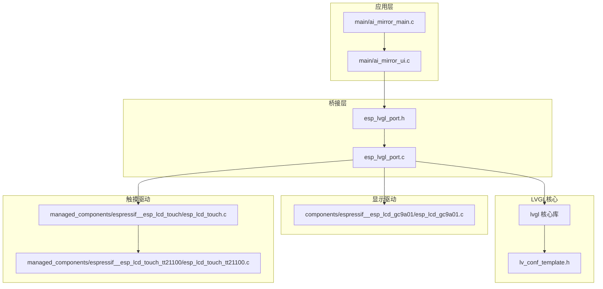
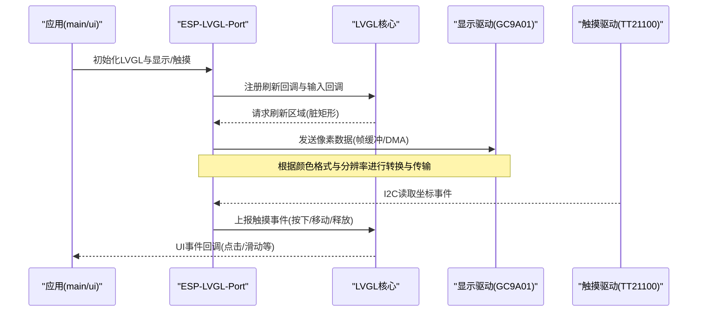
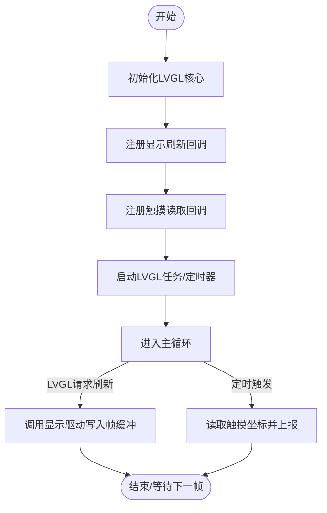
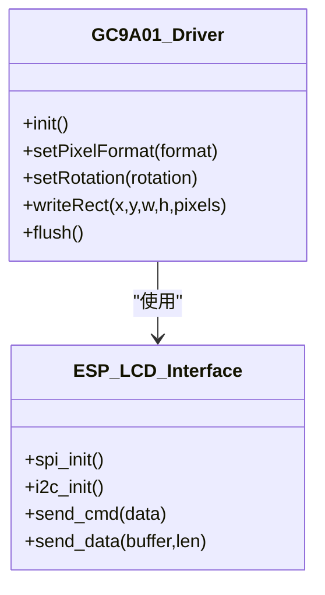
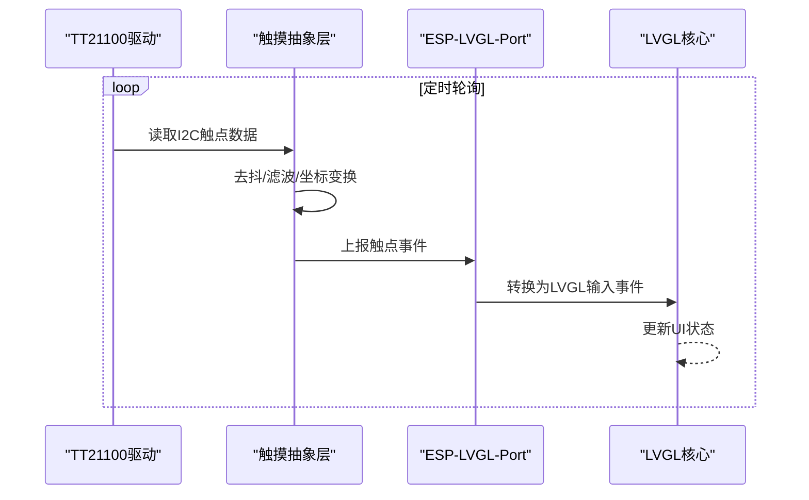
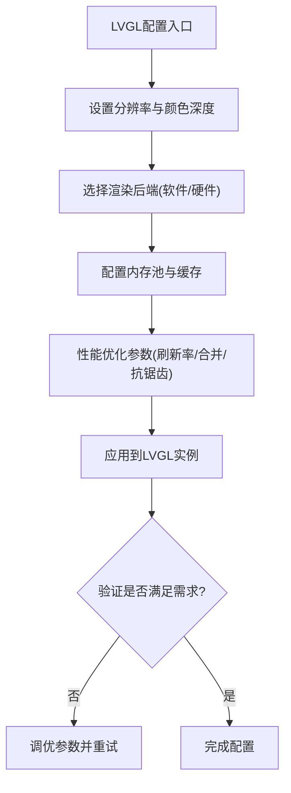
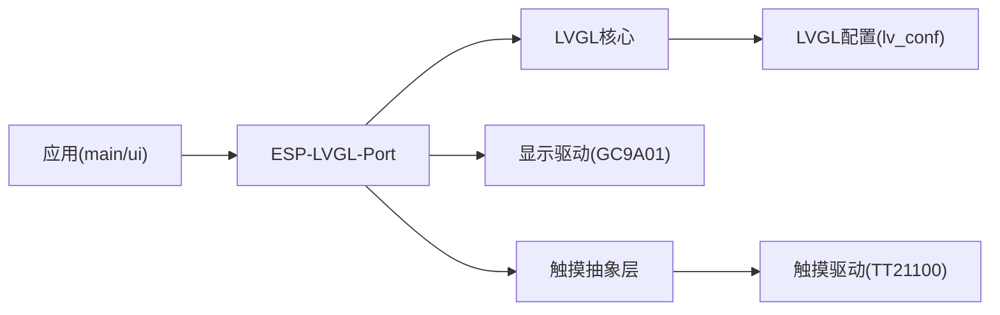

# LVGL集成配置

<cite>
**本文引用的文件**   
- [esp_lvgl_port.c](file://Firmware/esp32_ai_mirror/managed_components/espressif__esp_lvgl_port/esp_lvgl_port.c)
- [esp_lvgl_port.h](file://Firmware/esp32_ai_mirror/managed_components/espressif__esp_lvgl_port/include/esp_lvgl_port.h)
- [idf_component.yml（esp_lvgl_port）](file://Firmware/esp32_ai_mirror/managed_components/espressif__esp_lvgl_port/idf_component.yml)
- [README.md（esp_lvgl_port）](file://Firmware/esp32_ai_mirror/managed_components/espressif__esp_lvgl_port/README.md)
- [performance.md（esp_lvgl_port）](file://Firmware/esp32_ai_mirror/managed_components/espressif__esp_lvgl_port/docs/performance.md)
- [CMakeLists.txt（main）](file://Firmware/esp32_ai_mirror/main/CMakeLists.txt)
- [ai_mirror_main.c](file://Firmware/esp32_ai_mirror/main/ai_mirror_main.c)
- [ai_mirror_ui.c](file://Firmware/esp32_ai_mirror/main/ai_mirror_ui.c)
- [sdkconfig.defaults](file://Firmware/esp32_ai_mirror/sdkconfig.defaults)
- [esp_lcd_gc9a01.c](file://Firmware/esp32_ai_mirror/components/espressif__esp_lcd_gc9a01/esp_lcd_gc9a01.c)
- [esp_lcd_touch.c](file://Firmware/esp32_ai_mirror/managed_components/espressif__esp_lcd_touch/esp_lcd_touch.c)
- [esp_lcd_touch_tt21100.c](file://Firmware/esp32_ai_mirror/managed_components/espressif__esp_lcd_touch_tt21100/esp_lcd_touch_tt21100.c)
- [lv_conf_template.h](file://Firmware/esp32_ai_mirror/managed_components/lvgl__lvgl/lv_conf_template.h)
</cite>

## 目录
1. [简介](#简介)
2. [项目结构](#项目结构)
3. [核心组件](#核心组件)
4. [架构总览](#架构总览)
5. [详细组件分析](#详细组件分析)
6. [依赖关系分析](#依赖关系分析)
7. [性能考虑](#性能考虑)
8. [故障排查指南](#故障排查指南)
9. [结论](#结论)
10. [附录](#附录)

## 简介
本文件面向在ESP-IDF平台上集成LVGL图形框架的工程实践，围绕ESP-LVGL-Port的初始化配置、显示驱动设置与触摸输入处理展开。内容涵盖屏幕分辨率与颜色格式配置、内存分配策略、LVGL核心库配置选项、渲染后端选择与性能优化参数，以及显示设备驱动集成（I2C/SPI）、帧缓冲区管理与常见问题排查方法，帮助读者构建稳定高效的图形界面系统。

## 项目结构
本项目采用ESP-IDF组件化组织方式，LVGL相关代码主要分布在以下位置：
- esp_lvgl_port：提供ESP-IDF与LVGL之间的桥接层，封装显示刷新、触摸事件上报、任务调度等能力
- lvgl：LVGL核心库与示例、文档
- main：应用入口与UI逻辑，负责初始化LVGL、注册显示与触摸驱动、创建UI
- components：具体显示控制器驱动（如GC9A01）
- managed_components：触摸驱动（如TT21100）与通用触摸抽象层

图表来源
- [esp_lvgl_port.c](file://Firmware/esp32_ai_mirror/managed_components/espressif__esp_lvgl_port/esp_lvgl_port.c)
- [esp_lvgl_port.h](file://Firmware/esp32_ai_mirror/managed_components/espressif__esp_lvgl_port/include/esp_lvgl_port.h)
- [ai_mirror_main.c](file://Firmware/esp32_ai_mirror/main/ai_mirror_main.c)
- [ai_mirror_ui.c](file://Firmware/esp32_ai_mirror/main/ai_mirror_ui.c)
- [esp_lcd_gc9a01.c](file://Firmware/esp32_ai_mirror/components/espressif__esp_lcd_gc9a01/esp_lcd_gc9a01.c)
- [esp_lcd_touch.c](file://Firmware/esp32_ai_mirror/managed_components/espressif__esp_lcd_touch/esp_lcd_touch.c)
- [esp_lcd_touch_tt21100.c](file://Firmware/esp32_ai_mirror/managed_components/espressif__esp_lcd_touch_tt21100/esp_lcd_touch_tt21100.c)
- [lv_conf_template.h](file://Firmware/esp32_ai_mirror/managed_components/lvgl__lvgl/lv_conf_template.h)

章节来源
- [CMakeLists.txt（main）](file://Firmware/esp32_ai_mirror/main/CMakeLists.txt)
- [idf_component.yml（esp_lvgl_port）](file://Firmware/esp32_ai_mirror/managed_components/espressif__esp_lvgl_port/idf_component.yml)

## 核心组件
- ESP-LVGL-Port桥接层
  - 职责：将ESP-IDF的LCD/Touch驱动适配到LVGL的刷新与输入回调；管理LVGL任务与定时器；协调帧缓冲与DMA传输
  - 关键接口：显示刷新回调、触摸读取回调、LVGL初始化与周期任务启动
- LVGL核心库
  - 职责：UI渲染、事件分发、布局与动画；通过HAL接口与底层显示/输入交互
  - 配置项：分辨率、颜色深度、渲染后端、内存池、字体与图片缓存等
- 显示驱动（以GC9A01为例）
  - 职责：SPI/I2C通信、寄存器配置、帧缓冲写入、旋转与色彩格式设置
- 触摸驱动（以TT21100为例）
  - 职责：I2C读取触点坐标、去抖与多点支持、坐标变换与事件上报

章节来源
- [esp_lvgl_port.c](file://Firmware/esp32_ai_mirror/managed_components/espressif__esp_lvgl_port/esp_lvgl_port.c)
- [esp_lvgl_port.h](file://Firmware/esp32_ai_mirror/managed_components/espressif__esp_lvgl_port/include/esp_lvgl_port.h)
- [esp_lcd_gc9a01.c](file://Firmware/esp32_ai_mirror/components/espressif__esp_lcd_gc9a01/esp_lcd_gc9a01.c)
- [esp_lcd_touch.c](file://Firmware/esp32_ai_mirror/managed_components/espressif__esp_lcd_touch/esp_lcd_touch.c)
- [esp_lcd_touch_tt21100.c](file://Firmware/esp32_ai_mirror/managed_components/espressif__esp_lcd_touch_tt21100/esp_lcd_touch_tt21100.c)

## 架构总览
下图展示从应用层到硬件驱动的调用链路与数据流，包括LVGL任务循环、显示刷新与触摸事件上报的关键路径。

图表来源
- [esp_lvgl_port.c](file://Firmware/esp32_ai_mirror/managed_components/espressif__esp_lvgl_port/esp_lvgl_port.c)
- [esp_lvgl_port.h](file://Firmware/esp32_ai_mirror/managed_components/espressif__esp_lvgl_port/include/esp_lvgl_port.h)
- [esp_lcd_gc9a01.c](file://Firmware/esp32_ai_mirror/components/espressif__esp_lcd_gc9a01/esp_lcd_gc9a01.c)
- [esp_lcd_touch_tt21100.c](file://Firmware/esp32_ai_mirror/managed_components/espressif__esp_lcd_touch_tt21100/esp_lcd_touch_tt21100.c)

## 详细组件分析

### ESP-LVGL-Port初始化与生命周期
- 初始化流程要点
  - 配置LVGL基本参数（分辨率、颜色深度、刷新频率）
  - 注册显示刷新回调：接收LVGL脏矩形并调用LCD驱动写入
  - 注册触摸读取回调：周期性读取触点坐标并转换为LVGL事件
  - 启动LVGL任务与定时器，确保UI流畅更新
- 关键实现位置
  - 头文件定义接口与数据结构
  - 源文件实现初始化、回调注册、任务调度与错误处理

图表来源
- [esp_lvgl_port.c](file://Firmware/esp32_ai_mirror/managed_components/espressif__esp_lvgl_port/esp_lvgl_port.c)
- [esp_lvgl_port.h](file://Firmware/esp32_ai_mirror/managed_components/espressif__esp_lvgl_port/include/esp_lvgl_port.h)

章节来源
- [esp_lvgl_port.c](file://Firmware/esp32_ai_mirror/managed_components/espressif__esp_lvgl_port/esp_lvgl_port.c)
- [esp_lvgl_port.h](file://Firmware/esp32_ai_mirror/managed_components/espressif__esp_lvgl_port/include/esp_lvgl_port.h)

### 显示驱动集成（GC9A01）
- 通信接口
  - 通常使用SPI或并行接口，需配置时钟极性、相位、片选与复位引脚
- 初始化步骤
  - 复位面板、发送初始化序列、设置像素格式（如RGB565/RGB888）
  - 配置显示方向、裁剪区域、内存访问控制
- 帧缓冲与刷新
  - 分配帧缓冲内存，按LVGL脏矩形区域批量写入
  - 启用DMA传输以降低CPU占用，提升刷新效率

图表来源
- [esp_lcd_gc9a01.c](file://Firmware/esp32_ai_mirror/components/espressif__esp_lcd_gc9a01/esp_lcd_gc9a01.c)

章节来源
- [esp_lcd_gc9a01.c](file://Firmware/esp32_ai_mirror/components/espressif__esp_lcd_gc9a01/esp_lcd_gc9a01.c)

### 触摸输入处理（TT21100）
- 通信接口
  - 通过I2C读取触点状态与坐标，支持多点触控
- 数据处理
  - 读取原始坐标并进行去抖、滤波与坐标变换（旋转/镜像）
  - 将触点事件转换为LVGL输入事件（按下、移动、释放）
- 事件上报
  - 周期性轮询或中断触发读取，避免阻塞LVGL任务

图表来源
- [esp_lcd_touch_tt21100.c](file://Firmware/esp32_ai_mirror/managed_components/espressif__esp_lcd_touch_tt21100/esp_lcd_touch_tt21100.c)
- [esp_lcd_touch.c](file://Firmware/esp32_ai_mirror/managed_components/espressif__esp_lcd_touch/esp_lcd_touch.c)

章节来源
- [esp_lcd_touch_tt21100.c](file://Firmware/esp32_ai_mirror/managed_components/espressif__esp_lcd_touch_tt21100/esp_lcd_touch_tt21100.c)
- [esp_lcd_touch.c](file://Firmware/esp32_ai_mirror/managed_components/espressif__esp_lcd_touch/esp_lcd_touch.c)

### LVGL核心库配置与渲染后端
- 分辨率与颜色格式
  - 在配置文件中设置屏幕宽度、高度、颜色深度（如RGB565/RGB888）
  - 选择合适的像素格式以平衡画质与内存占用
- 渲染后端
  - 可选择软件渲染或硬件加速（如DMA/PSRAM），依据目标平台能力决定
- 内存分配策略
  - 配置LVGL内存池大小、堆分配器、图片与字体缓存
  - 合理划分帧缓冲与UI对象内存，避免碎片化
- 性能优化参数
  - 调整刷新频率、脏矩形合并、抗锯齿开关、字体子集化

图表来源
- [lv_conf_template.h](file://Firmware/esp32_ai_mirror/managed_components/lvgl__lvgl/lv_conf_template.h)

章节来源
- [lv_conf_template.h](file://Firmware/esp32_ai_mirror/managed_components/lvgl__lvgl/lv_conf_template.h)

### 应用层集成（main与ui）
- 初始化顺序
  - 先初始化显示与触摸驱动，再初始化LVGL并注册回调
  - 创建UI界面与事件处理逻辑
- 运行循环
  - 保持LVGL任务持续运行，处理UI刷新与输入事件
- 常见扩展点
  - 添加新页面、控件与动画；接入传感器或网络数据更新UI

章节来源
- [ai_mirror_main.c](file://Firmware/esp32_ai_mirror/main/ai_mirror_main.c)
- [ai_mirror_ui.c](file://Firmware/esp32_ai_mirror/main/ai_mirror_ui.c)
- [CMakeLists.txt（main）](file://Firmware/esp32_ai_mirror/main/CMakeLists.txt)

## 依赖关系分析
- 组件耦合
  - esp_lvgl_port依赖LVGL核心与显示/触摸驱动抽象
  - 应用层依赖esp_lvgl_port提供的初始化与回调接口
- 外部依赖
  - ESP-IDF HAL（SPI/I2C/GPIO）
  - LVGL核心库与配置文件
- 潜在循环依赖
  - 确保回调注册与事件上报单向流动，避免模块间互相调用造成死锁

图表来源
- [esp_lvgl_port.c](file://Firmware/esp32_ai_mirror/managed_components/espressif__esp_lvgl_port/esp_lvgl_port.c)
- [esp_lvgl_port.h](file://Firmware/esp32_ai_mirror/managed_components/espressif__esp_lvgl_port/include/esp_lvgl_port.h)
- [esp_lcd_gc9a01.c](file://Firmware/esp32_ai_mirror/components/espressif__esp_lcd_gc9a01/esp_lcd_gc9a01.c)
- [esp_lcd_touch.c](file://Firmware/esp32_ai_mirror/managed_components/espressif__esp_lcd_touch/esp_lcd_touch.c)
- [esp_lcd_touch_tt21100.c](file://Firmware/esp32_ai_mirror/managed_components/espressif__esp_lcd_touch_tt21100/esp_lcd_touch_tt21100.c)
- [lv_conf_template.h](file://Firmware/esp32_ai_mirror/managed_components/lvgl__lvgl/lv_conf_template.h)

章节来源
- [idf_component.yml（esp_lvgl_port）](file://Firmware/esp32_ai_mirror/managed_components/espressif__esp_lvgl_port/idf_component.yml)

## 性能考虑
- 刷新效率
  - 使用DMA传输减少CPU占用；合理设置脏矩形以减少不必要刷新
  - 降低颜色深度（如RGB565）可显著减少带宽与内存压力
- 内存管理
  - 合理分配帧缓冲与LVGL内存池，避免频繁动态分配
  - 启用图片与字体缓存，提高重复元素渲染速度
- 任务调度
  - 将触摸读取与UI更新分离到不同任务，避免阻塞
  - 调整LVGL任务优先级与时基，保证响应性与流畅度
- 参考文档
  - 性能优化建议与参数调优指南

章节来源
- [performance.md（esp_lvgl_port）](file://Firmware/esp32_ai_mirror/managed_components/espressif__esp_lvgl_port/docs/performance.md)
- [README.md（esp_lvgl_port）](file://Firmware/esp32_ai_mirror/managed_components/espressif__esp_lvgl_port/README.md)

## 故障排查指南
- 显示无输出或花屏
  - 检查SPI/I2C引脚配置与电平匹配
  - 确认初始化序列与像素格式设置正确
  - 验证帧缓冲地址对齐与内存分配成功
- 触摸无响应或漂移
  - 检查I2C通信时序与上拉电阻
  - 校准坐标映射与旋转设置
  - 增加去抖与滤波参数
- LVGL卡顿或崩溃
  - 调整LVGL任务优先级与时基
  - 减小UI复杂度与动画频率
  - 监控内存使用，避免溢出与碎片化
- 调试技巧
  - 启用LVGL日志与统计信息
  - 使用示波器或逻辑分析仪抓取总线波形
  - 逐步注释UI代码定位问题模块

章节来源
- [esp_lvgl_port.c](file://Firmware/esp32_ai_mirror/managed_components/espressif__esp_lvgl_port/esp_lvgl_port.c)
- [esp_lcd_gc9a01.c](file://Firmware/esp32_ai_mirror/components/espressif__esp_lcd_gc9a01/esp_lcd_gc9a01.c)
- [esp_lcd_touch_tt21100.c](file://Firmware/esp32_ai_mirror/managed_components/espressif__esp_lcd_touch_tt21100/esp_lcd_touch_tt21100.c)

## 结论
通过在ESP-IDF中集成ESP-LVGL-Port，开发者可以快速搭建稳定的图形界面系统。关键在于正确配置显示与触摸驱动、合理设置LVGL核心参数与内存策略，并结合性能优化手段确保流畅体验。遵循本文档的步骤与最佳实践，可有效降低集成难度并提升系统稳定性。

## 附录
- 常用配置项速查
  - 分辨率与颜色深度：在LVGL配置文件中设置
  - 刷新频率与任务优先级：在ESP-LVGL-Port初始化时配置
  - 帧缓冲大小与内存池：根据屏幕尺寸与UI复杂度估算
- 参考资源
  - ESP-LVGL-Port官方文档与示例
  - LVGL核心库文档与示例工程
  - 显示与触摸驱动Datasheet