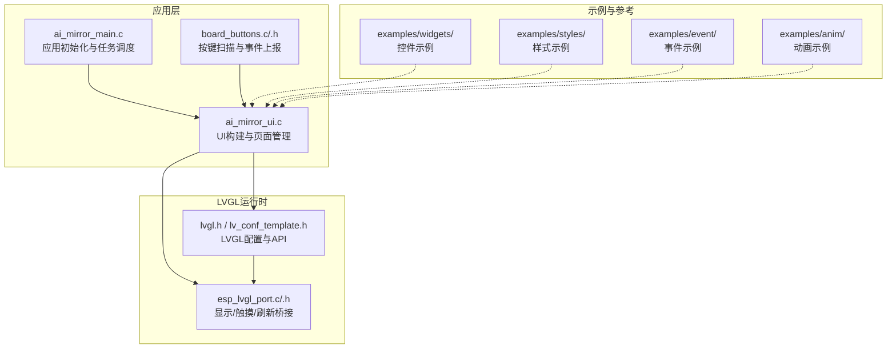
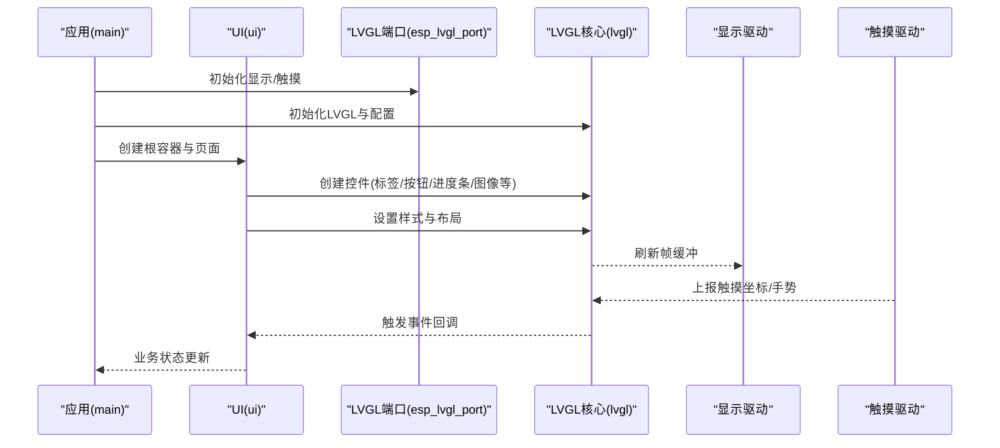
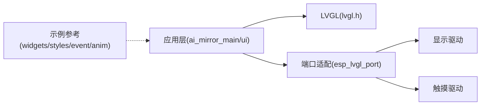

# UI控件系统

<cite>
**本文引用的文件**   
- [ai_mirror_ui.c](file://Firmware/esp32_ai_mirror/main/ai_mirror_ui.c)
- [ai_mirror_main.c](file://Firmware/esp32_ai_mirror/main/ai_mirror_main.c)
- [board_buttons.c](file://Firmware/esp32_ai_mirror/main/board_buttons.c)
- [board_buttons.h](file://Firmware/esp32_ai_mirror/main/board_buttons.h)
- [esp_lvgl_port.c](file://Firmware/esp32_ai_mirror/managed_components/espressif__esp_lvgl_port/esp_lvgl_port.c)
- [esp_lvgl_port.h](file://Firmware/esp32_ai_mirror/managed_components/espressif__esp_lvgl_port/include/esp_lvgl_port.h)
- [lv_conf_template.h](file://Firmware/esp32_ai_mirror/managed_components/lvgl__lvgl/lv_conf_template.h)
- [lvgl.h](file://Firmware/esp32_ai_mirror/managed_components/lvgl__lvgl/lvgl.h)
- [widgets目录（LVGL内置控件示例）](file://Firmware/esp32_ai_mirror/managed_components/lvgl__lvgl/examples/widgets/)
- [styles目录（LVGL样式示例）](file://Firmware/esp32_ai_mirror/managed_components/lvgl__lvgl/examples/styles/)
- [event目录（LVGL事件示例）](file://Firmware/esp32_ai_mirror/managed_components/lvgl__lvgl/examples/event/)
- [anim目录（LVGL动画示例）](file://Firmware/esp32_ai_mirror/managed_components/lvgl__lvgl/examples/anim/)
</cite>

## 目录
1. [简介](#简介)
2. [项目结构](#项目结构)
3. [核心组件](#核心组件)
4. [架构总览](#架构总览)
5. [详细组件分析](#详细组件分析)
6. [依赖关系分析](#依赖关系分析)
7. [性能考虑](#性能考虑)
8. [故障排查指南](#故障排查指南)
9. [结论](#结论)
10. [附录](#附录)

## 简介
本文件面向ESP32 AI镜像项目的UI子系统，系统性梳理基于LVGL的控件体系与工程实践。内容覆盖：
- LVGL基础控件（标签、按钮、进度条、图像等）在项目中的使用方式与扩展方法
- 属性配置、样式定制与事件绑定机制
- 控件生命周期管理、内存优化与性能调优
- 自定义控件开发指南、组合模式与复用策略
- 动画效果实现与交互反馈最佳实践

本项目在ESP-IDF框架下集成LVGL，并通过espressif__esp_lvgl_port进行显示与触摸驱动桥接，业务UI逻辑集中在main模块中。

## 项目结构
UI相关代码主要分布在以下位置：
- 应用层UI入口与页面构建：main/ai_mirror_ui.c、main/ai_mirror_main.c
- 板级输入（按键）与UI联动：main/board_buttons.c/.h
- LVGL运行时与端口适配：managed_components/espressif__esp_lvgl_port/*
- LVGL库与示例参考：managed_components/lvgl__lvgl/*

图表来源
- [ai_mirror_main.c](file://Firmware/esp32_ai_mirror/main/ai_mirror_main.c)
- [ai_mirror_ui.c](file://Firmware/esp32_ai_mirror/main/ai_mirror_ui.c)
- [board_buttons.c](file://Firmware/esp32_ai_mirror/main/board_buttons.c)
- [esp_lvgl_port.c](file://Firmware/esp32_ai_mirror/managed_components/espressif__esp_lvgl_port/esp_lvgl_port.c)
- [esp_lvgl_port.h](file://Firmware/esp32_ai_mirror/managed_components/espressif__esp_lvgl_port/include/esp_lvgl_port.h)
- [lvgl.h](file://Firmware/esp32_ai_mirror/managed_components/lvgl__lvgl/lvgl.h)
- [lv_conf_template.h](file://Firmware/esp32_ai_mirror/managed_components/lvgl__lvgl/lv_conf_template.h)

章节来源
- [ai_mirror_main.c](file://Firmware/esp32_ai_mirror/main/ai_mirror_main.c)
- [ai_mirror_ui.c](file://Firmware/esp32_ai_mirror/main/ai_mirror_ui.c)
- [board_buttons.c](file://Firmware/esp32_ai_mirror/main/board_buttons.c)
- [board_buttons.h](file://Firmware/esp32_ai_mirror/main/board_buttons.h)
- [esp_lvgl_port.c](file://Firmware/esp32_ai_mirror/managed_components/espressif__esp_lvgl_port/esp_lvgl_port.c)
- [esp_lvgl_port.h](file://Firmware/esp32_ai_mirror/managed_components/espressif__esp_lvgl_port/include/esp_lvgl_port.h)
- [lvgl.h](file://Firmware/esp32_ai_mirror/managed_components/lvgl__lvgl/lvgl.h)
- [lv_conf_template.h](file://Firmware/esp32_ai_mirror/managed_components/lvgl__lvgl/lv_conf_template.h)

## 核心组件
- LVGL运行时与配置
  - lvgl.h提供统一的控件API与对象模型；lv_conf_template.h用于裁剪功能、分辨率、颜色深度、字体与内存池等关键参数。
- ESP-LVGL端口适配
  - esp_lvgl_port.c/.h负责将LVGL与ESP-IDF的显示驱动、触摸驱动和刷新机制对接，屏蔽底层差异。
- 应用UI层
  - ai_mirror_ui.c组织页面与控件树，处理业务数据到UI状态的映射。
  - ai_mirror_main.c负责系统初始化、任务创建与主循环调度。
- 输入与事件
  - board_buttons.c/.h采集按键状态并转换为LVGL可消费的事件或状态更新。

章节来源
- [lvgl.h](file://Firmware/esp32_ai_mirror/managed_components/lvgl__lvgl/lvgl.h)
- [lv_conf_template.h](file://Firmware/esp32_ai_mirror/managed_components/lvgl__lvgl/lv_conf_template.h)
- [esp_lvgl_port.c](file://Firmware/esp32_ai_mirror/managed_components/espressif__esp_lvgl_port/esp_lvgl_port.c)
- [esp_lvgl_port.h](file://Firmware/esp32_ai_mirror/managed_components/espressif__esp_lvgl_port/include/esp_lvgl_port.h)
- [ai_mirror_ui.c](file://Firmware/esp32_ai_mirror/main/ai_mirror_ui.c)
- [ai_mirror_main.c](file://Firmware/esp32_ai_mirror/main/ai_mirror_main.c)
- [board_buttons.c](file://Firmware/esp32_ai_mirror/main/board_buttons.c)
- [board_buttons.h](file://Firmware/esp32_ai_mirror/main/board_buttons.h)

## 架构总览
下图展示从应用初始化到控件渲染的关键路径：应用启动→LVGL初始化→显示/触摸驱动注册→UI构建→事件分发→刷新绘制。

图表来源
- [ai_mirror_main.c](file://Firmware/esp32_ai_mirror/main/ai_mirror_main.c)
- [ai_mirror_ui.c](file://Firmware/esp32_ai_mirror/main/ai_mirror_ui.c)
- [esp_lvgl_port.c](file://Firmware/esp32_ai_mirror/managed_components/espressif__esp_lvgl_port/esp_lvgl_port.c)
- [lvgl.h](file://Firmware/esp32_ai_mirror/managed_components/lvgl__lvgl/lvgl.h)

## 详细组件分析

### LVGL基础控件使用与扩展
- 标签(label)
  - 用途：文本显示、多行/富文本、对齐与截断控制
  - 常用属性：文本内容、字体、对齐、行高、最大宽度、滚动行为
  - 样式定制：文本颜色、背景、边框、阴影、透明度
  - 事件：点击、长按、选中、文本变化（通过父容器转发）
  - 扩展：自定义绘制回调、动态换行与省略号
- 按钮(button)
  - 用途：用户交互触发、图标+文本组合
  - 常用属性：状态（按下/聚焦/禁用）、边框、圆角、内边距
  - 样式定制：按下态、焦点态、禁用态的多套样式切换
  - 事件：点击、释放、长按、进入/离开
  - 扩展：复合控件（如带图标的开关按钮）
- 进度条(progressbar)
  - 用途：加载指示、数值可视化
  - 常用属性：值、范围、方向、动画时长、动画类型
  - 样式定制：背景、前景、刻度、圆角、渐变
  - 事件：值变化回调
  - 扩展：环形进度、分段进度
- 图像(image)
  - 用途：位图/矢量图显示、缩放与裁剪
  - 常用属性：源指针、缩放比例、旋转、对齐、混合模式
  - 样式定制：背景色、边框、圆角、遮罩
  - 事件：点击、拖拽（配合手势）
  - 扩展：图片缓存、懒加载、占位符

章节来源
- [lvgl.h](file://Firmware/esp32_ai_mirror/managed_components/lvgl__lvgl/lvgl.h)
- [widgets目录（LVGL内置控件示例）](file://Firmware/esp32_ai_mirror/managed_components/lvgl__lvgl/examples/widgets/)

### 属性配置与样式定制
- 属性配置
  - 统一通过LVGL API设置控件属性，支持运行时动态修改
  - 布局属性（宽/高/边距/对齐）与外观属性（颜色/边框/阴影）分离
- 样式定制
  - 使用样式对象与选择器（默认态、按下态、焦点态、禁用态）
  - 推荐集中管理主题样式，按页面/控件族分层定义
  - 资源优化：共享样式对象、减少重复分配

章节来源
- [styles目录（LVGL样式示例）](file://Firmware/esp32_ai_mirror/managed_components/lvgl__lvgl/examples/styles/)

### 事件绑定机制
- 事件流
  - 输入源（触摸/按键）→ LVGL事件队列 → 目标控件 → 回调函数
- 常见事件
  - 点击、释放、长按、进入/离开、值变化、绘制前/后
- 最佳实践
  - 避免在回调中进行耗时操作，采用消息队列或任务派发
  - 合理去抖与防重入，保证UI响应性

章节来源
- [event目录（LVGL事件示例）](file://Firmware/esp32_ai_mirror/managed_components/lvgl__lvgl/examples/event/)
- [board_buttons.c](file://Firmware/esp32_ai_mirror/main/board_buttons.c)
- [board_buttons.h](file://Firmware/esp32_ai_mirror/main/board_buttons.h)

### 控件生命周期管理
- 创建阶段
  - 父容器创建→子控件创建→属性设置→样式绑定→布局计算
- 运行阶段
  - 事件驱动更新→样式重绘→增量刷新
- 销毁阶段
  - 移除事件回调→释放资源→从父容器删除→内存回收

章节来源
- [lvgl.h](file://Firmware/esp32_ai_mirror/managed_components/lvgl__lvgl/lvgl.h)
- [ai_mirror_ui.c](file://Firmware/esp32_ai_mirror/main/ai_mirror_ui.c)

### 内存优化与性能调优
- 内存池与对象缓存
  - 调整LVGL内存池大小与块数，启用对象缓存减少频繁分配
- 刷新策略
  - 启用脏矩形与部分刷新，限制重绘区域
- 资源管理
  - 图片压缩与按需加载，字体子集化
- 渲染优化
  - 减少透明叠加与复杂阴影，优先使用纯色与简单形状

章节来源
- [lv_conf_template.h](file://Firmware/esp32_ai_mirror/managed_components/lvgl__lvgl/lv_conf_template.h)
- [esp_lvgl_port.c](file://Firmware/esp32_ai_mirror/managed_components/espressif__esp_lvgl_port/esp_lvgl_port.c)

### 自定义控件开发指南
- 设计原则
  - 单一职责、可组合、可复用、可测试
- 开发步骤
  - 定义数据结构与接口→实现绘制回调→封装属性API→提供样式模板→编写单元测试
- 组合模式
  - 以容器为基类，组合多个基础控件形成复合控件
- 复用策略
  - 抽象公共样式与行为，提供工厂函数快速实例化

章节来源
- [lvgl.h](file://Firmware/esp32_ai_mirror/managed_components/lvgl__lvgl/lvgl.h)
- [ai_mirror_ui.c](file://Firmware/esp32_ai_mirror/main/ai_mirror_ui.c)

### 控件组合模式与复用策略
- 组合模式
  - 容器控件作为“面板”，内部嵌套多个子控件，统一管理布局与样式
- 模板化
  - 将常用界面片段封装为模板，通过参数注入数据
- 主题化
  - 通过样式变量与选择器实现全局主题切换

章节来源
- [styles目录（LVGL样式示例）](file://Firmware/esp32_ai_mirror/managed_components/lvgl__lvgl/examples/styles/)
- [ai_mirror_ui.c](file://Firmware/esp32_ai_mirror/main/ai_mirror_ui.c)

### 动画效果与交互反馈
- 动画类型
  - 属性动画（位置/大小/透明度）、过渡动画（页面切换）、缓动曲线
- 实现要点
  - 控制动画时长与曲线，避免阻塞主循环
  - 结合事件触发，提供即时反馈（按下态、加载态）
- 最佳实践
  - 小幅度动画提升体验，大幅度动画注意性能开销

章节来源
- [anim目录（LVGL动画示例）](file://Firmware/esp32_ai_mirror/managed_components/lvgl__lvgl/examples/anim/)
- [event目录（LVGL事件示例）](file://Firmware/esp32_ai_mirror/managed_components/lvgl__lvgl/examples/event/)

## 依赖关系分析
- 应用层依赖LVGL与端口适配
- 端口适配依赖ESP-IDF显示/触摸驱动
- 示例与参考代码不直接参与运行，但指导实现

图表来源
- [ai_mirror_main.c](file://Firmware/esp32_ai_mirror/main/ai_mirror_main.c)
- [ai_mirror_ui.c](file://Firmware/esp32_ai_mirror/main/ai_mirror_ui.c)
- [esp_lvgl_port.c](file://Firmware/esp32_ai_mirror/managed_components/espressif__esp_lvgl_port/esp_lvgl_port.c)
- [lvgl.h](file://Firmware/esp32_ai_mirror/managed_components/lvgl__lvgl/lvgl.h)

章节来源
- [ai_mirror_main.c](file://Firmware/esp32_ai_mirror/main/ai_mirror_main.c)
- [ai_mirror_ui.c](file://Firmware/esp32_ai_mirror/main/ai_mirror_ui.c)
- [esp_lvgl_port.c](file://Firmware/esp32_ai_mirror/managed_components/espressif__esp_lvgl_port/esp_lvgl_port.c)
- [lvgl.h](file://Firmware/esp32_ai_mirror/managed_components/lvgl__lvgl/lvgl.h)

## 性能考虑
- 渲染性能
  - 启用增量刷新，限制重绘区域
  - 避免过度透明与复杂阴影
- 内存占用
  - 合理配置LVGL内存池，启用对象缓存
  - 图片与字体按需加载与子集化
- 事件处理
  - 回调轻量，耗时操作异步化
  - 按键去抖与事件合并
- 刷新频率
  - 根据场景调整刷新周期，平衡流畅度与功耗

[本节为通用指导，不直接分析具体文件]

## 故障排查指南
- 常见问题
  - 屏幕无显示：检查显示驱动初始化与LVGL刷新回调
  - 触摸无效：确认触摸驱动注册与坐标映射
  - 卡顿明显：定位重绘热点，减少复杂样式与动画
  - 内存不足：调整LVGL内存池与对象缓存参数
- 调试建议
  - 打印关键事件与状态变更
  - 使用LVGL内置调试工具（若启用）
  - 分模块隔离问题，逐步验证

章节来源
- [esp_lvgl_port.c](file://Firmware/esp32_ai_mirror/managed_components/espressif__esp_lvgl_port/esp_lvgl_port.c)
- [lv_conf_template.h](file://Firmware/esp32_ai_mirror/managed_components/lvgl__lvgl/lv_conf_template.h)
- [board_buttons.c](file://Firmware/esp32_ai_mirror/main/board_buttons.c)

## 结论
本项目基于LVGL构建了稳定高效的UI子系统，通过清晰的层次划分与良好的工程实践，实现了基础控件的灵活使用、样式定制与事件绑定。在内存与性能方面，借助LVGL配置与端口适配优化，满足嵌入式设备的资源约束。未来可进一步引入更丰富的自定义控件与动画效果，提升用户体验。

[本节为总结，不直接分析具体文件]

## 附录
- 参考示例路径
  - 控件示例：examples/widgets/
  - 样式示例：examples/styles/
  - 事件示例：examples/event/
  - 动画示例：examples/anim/
- 关键配置文件
  - LVGL配置：lv_conf_template.h
  - 端口适配：esp_lvgl_port.c/.h

[本节为补充信息，不直接分析具体文件]