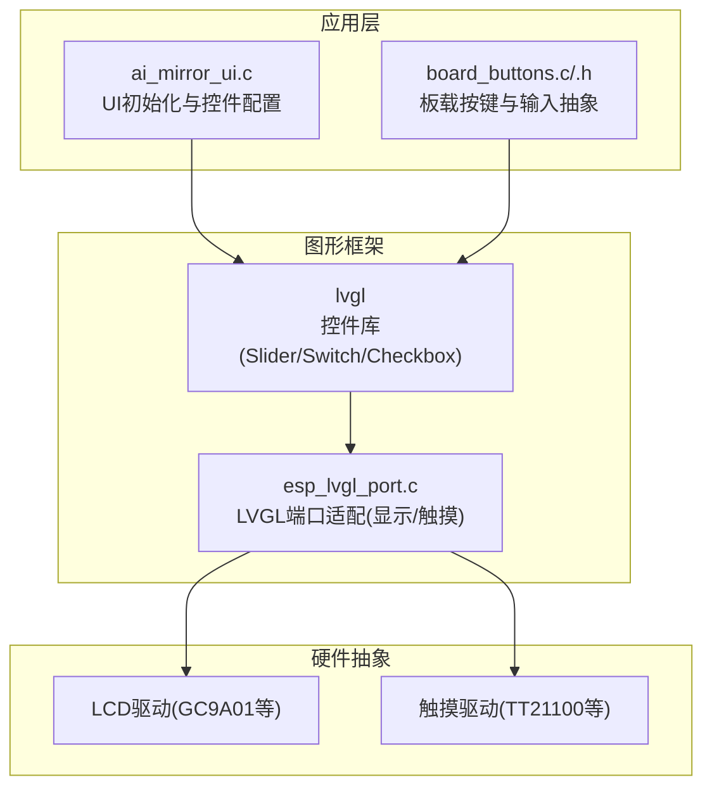
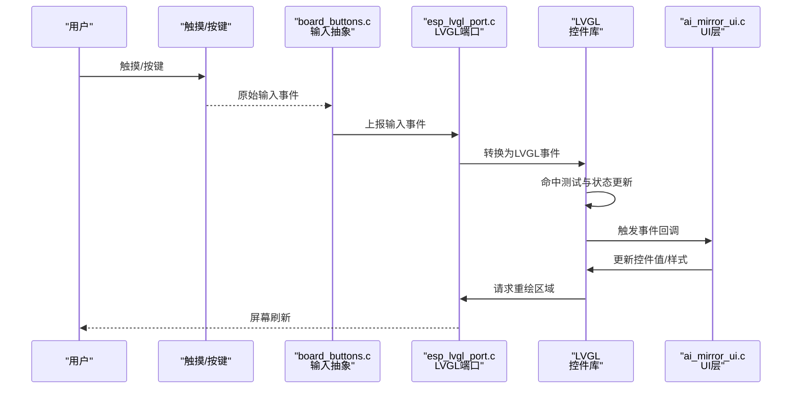
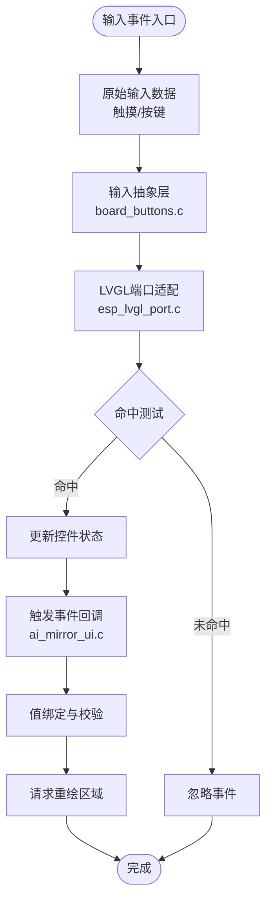
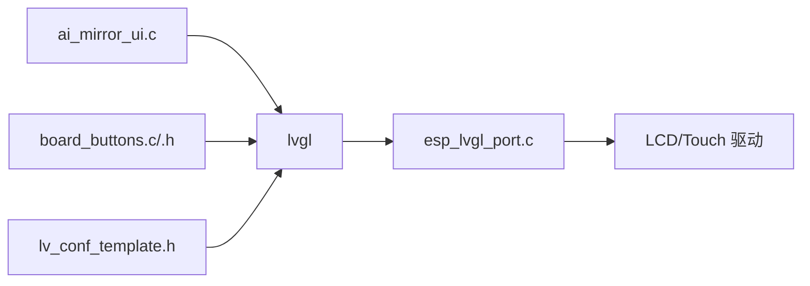

# 交互控件

<cite>
**本文档引用的文件**   
- [ai_mirror_ui.c](file://Firmware/esp32_ai_mirror/main/ai_mirror_ui.c)
- [board_buttons.c](file://Firmware/esp32_ai_mirror/main/board_buttons.c)
- [board_buttons.h](file://Firmware/esp32_ai_mirror/main/board_buttons.h)
- [esp_lvgl_port.c](file://Firmware/esp32_ai_mirror/managed_components/espressif__esp_lvgl_port/esp_lvgl_port.c)
- [lv_conf_template.h](file://Firmware/esp32_ai_mirror/managed_components/lvgl__lvgl/lv_conf_template.h)
- [README.md](file://Firmware/esp32_ai_mirror/README.md)
</cite>

## 目录
1. [简介](#简介)
2. [项目结构](#项目结构)
3. [核心组件](#核心组件)
4. [架构总览](#架构总览)
5. [详细组件分析](#详细组件分析)
6. [依赖关系分析](#依赖关系分析)
7. [性能考量](#性能考量)
8. [故障排查指南](#故障排查指南)
9. [结论](#结论)
10. [附录](#附录)

## 简介
本文件聚焦于ESP32 AI镜像项目中用户交互控件的实现与最佳实践，重点覆盖滑块（Slider）、开关（Switch）、复选框（Checkbox）等常用控件。文档从状态管理、值绑定、事件回调、动画效果、触摸输入处理、响应式设计与用户体验优化等方面展开，并结合嵌入式资源受限环境给出可操作的建议。同时涵盖可访问性支持、键盘导航与多语言适配的实践要点，帮助在有限资源下实现流畅的交互体验。

## 项目结构
本项目基于 ESP-IDF + LVGL 构建图形界面，UI 逻辑位于 main 目录，LVGL 运行时与端口适配位于 managed_components 下的 lvgl 与 esp_lvgl_port 组件中。交互控件由 LVGL 提供，应用层通过 UI 初始化与事件回调进行配置与行为控制；底层通过 esp_lvgl_port 将 LVGL 与显示/触摸驱动对接。

图表来源
- [ai_mirror_ui.c](file://Firmware/esp32_ai_mirror/main/ai_mirror_ui.c)
- [board_buttons.c](file://Firmware/esp32_ai_mirror/main/board_buttons.c)
- [board_buttons.h](file://Firmware/esp32_ai_mirror/main/board_buttons.h)
- [esp_lvgl_port.c](file://Firmware/esp32_ai_mirror/managed_components/espressif__esp_lvgl_port/esp_lvgl_port.c)

章节来源
- [README.md](file://Firmware/esp32_ai_mirror/README.md)

## 核心组件
- 控件库（LVGL）：提供 Slider、Switch、Checkbox 等控件的绘制、事件、动画与样式能力。
- UI 层（ai_mirror_ui.c）：负责创建控件实例、设置属性、绑定值与事件回调、组织布局。
- 输入抽象（board_buttons.c/.h）：封装板载按键与输入设备，统一事件上报到 LVGL。
- LVGL 端口（esp_lvgl_port.c）：桥接 LVGL 与显示/触摸驱动，完成刷新与坐标转换。

章节来源
- [ai_mirror_ui.c](file://Firmware/esp32_ai_mirror/main/ai_mirror_ui.c)
- [board_buttons.c](file://Firmware/esp32_ai_mirror/main/board_buttons.c)
- [board_buttons.h](file://Firmware/esp32_ai_mirror/main/board_buttons.h)
- [esp_lvgl_port.c](file://Firmware/esp32_ai_mirror/managed_components/espressif__esp_lvgl_port/esp_lvgl_port.c)

## 架构总览
下图展示从用户输入到控件更新与渲染的整体流程，适用于 Slider、Switch、Checkbox 等控件。

图表来源
- [board_buttons.c](file://Firmware/esp32_ai_mirror/main/board_buttons.c)
- [esp_lvgl_port.c](file://Firmware/esp32_ai_mirror/managed_components/espressif__esp_lvgl_port/esp_lvgl_port.c)
- [ai_mirror_ui.c](file://Firmware/esp32_ai_mirror/main/ai_mirror_ui.c)

## 详细组件分析

### 滑块（Slider）
- 状态管理
  - 值域与步长：定义最小/最大值与步进，确保数值映射合理。
  - 焦点与选择态：支持键盘/触摸焦点切换，选中时高亮。
  - 禁用态：禁用后不可交互且视觉灰化。
- 值绑定
  - 双向绑定：滑动时更新业务变量，业务变量变化时同步回显。
  - 格式化显示：根据单位或精度格式化标签文本。
- 事件回调
  - 值改变事件：拖动结束或实时拖动时触发，用于即时反馈。
  - 焦点事件：进入/离开焦点时执行辅助动作（如提示音）。
- 动画效果
  - 过渡动画：短时长缓动提升顺滑感，避免卡顿。
  - 进度指示：可选刻度线或背景渐变增强可读性。
- 触摸输入处理
  - 命中区域：增大触控热区，提高易用性。
  - 防抖与节流：高频拖动时限制回调频率，降低CPU占用。
- 响应式设计
  - 自适应宽度：按屏幕尺寸调整滑块长度与刻度密度。
  - 字体缩放：在大屏设备上放大数字与标签。
- 可访问性与键盘导航
  - 方向键增减：左右/上下键步进调节。
  - 读屏支持：为控件添加描述文本与当前值播报。
- 多语言适配
  - 动态文案：单位与提示语通过本地化表切换。
- 嵌入式优化
  - 减少重绘：仅更新变化区域，合并多次更新。
  - 内存友好：复用样式对象，避免频繁分配。

章节来源
- [ai_mirror_ui.c](file://Firmware/esp32_ai_mirror/main/ai_mirror_ui.c)
- [esp_lvgl_port.c](file://Firmware/esp32_ai_mirror/managed_components/espressif__esp_lvgl_port/esp_lvgl_port.c)

### 开关（Switch）
- 状态管理
  - 开/关双态：明确状态语义，禁用态不可切换。
  - 焦点态：键盘导航时高亮边框或阴影。
- 值绑定
  - 布尔绑定：与业务布尔变量双向同步。
  - 图标/文案：开启/关闭时切换图标或文字说明。
- 事件回调
  - 状态变更事件：切换成功时触发，用于持久化或联动控制。
- 动画效果
  - 滑杆移动：短促平滑动画，配合颜色变化。
- 触摸输入处理
  - 点击区域：整块区域可点击，避免误触。
  - 长按确认：可选长按二次确认防止误操作。
- 响应式设计
  - 尺寸比例：随屏幕密度调整轨道与圆点大小。
- 可访问性与键盘导航
  - 空格/回车切换：标准键盘快捷键。
  - 无障碍标签：描述功能与当前状态。
- 多语言适配
  - 标签与提示：根据语言切换显示内容。
- 嵌入式优化
  - 轻量绘制：使用纯色与简单几何，减少矢量开销。
  - 批量更新：多个开关同屏时合并刷新。

章节来源
- [ai_mirror_ui.c](file://Firmware/esp32_ai_mirror/main/ai_mirror_ui.c)
- [esp_lvgl_port.c](file://Firmware/esp32_ai_mirror/managed_components/espressif__esp_lvgl_port/esp_lvgl_port.c)

### 复选框（Checkbox）
- 状态管理
  - 三态支持：可选“未选/已选/不确定”，按需启用。
  - 禁用态：不可勾选且视觉弱化。
- 值绑定
  - 布尔/枚举绑定：与配置项或选项列表关联。
  - 组合校验：多选互斥或最少选择数校验。
- 事件回调
  - 勾选事件：勾选/取消时触发，用于批量操作或筛选。
- 动画效果
  - 打勾动画：简短的填充动画增强反馈。
- 触摸输入处理
  - 点击区域：扩大可点击范围，便于手指操作。
- 响应式设计
  - 行间距：多列布局时保持对齐与可读性。
- 可访问性与键盘导航
  - 方向键遍历：Tab/方向键在多个复选框间移动。
  - 读屏：播报选中状态与数量。
- 多语言适配
  - 文案国际化：标题、说明与错误提示本地化。
- 嵌入式优化
  - 位图缓存：重复图标缓存减少内存碎片。
  - 延迟渲染：滚动时跳过非可视区域绘制。

章节来源
- [ai_mirror_ui.c](file://Firmware/esp32_ai_mirror/main/ai_mirror_ui.c)
- [esp_lvgl_port.c](file://Firmware/esp32_ai_mirror/managed_components/espressif__esp_lvgl_port/esp_lvgl_port.c)

### 输入与事件流（通用）

图表来源
- [board_buttons.c](file://Firmware/esp32_ai_mirror/main/board_buttons.c)
- [esp_lvgl_port.c](file://Firmware/esp32_ai_mirror/managed_components/espressif__esp_lvgl_port/esp_lvgl_port.c)
- [ai_mirror_ui.c](file://Firmware/esp32_ai_mirror/main/ai_mirror_ui.c)

## 依赖关系分析
- 应用层依赖 LVGL 控件 API 与事件模型。
- LVGL 依赖 esp_lvgl_port 提供的显示与触摸接口。
- board_buttons 作为输入抽象，屏蔽不同硬件差异，统一上报给 LVGL。
- 配置文件（如 lv_conf_template.h）决定 LVGL 特性开关与资源上限。

图表来源
- [ai_mirror_ui.c](file://Firmware/esp32_ai_mirror/main/ai_mirror_ui.c)
- [board_buttons.c](file://Firmware/esp32_ai_mirror/main/board_buttons.c)
- [board_buttons.h](file://Firmware/esp32_ai_mirror/main/board_buttons.h)
- [esp_lvgl_port.c](file://Firmware/esp32_ai_mirror/managed_components/espressif__esp_lvgl_port/esp_lvgl_port.c)
- [lv_conf_template.h](file://Firmware/esp32_ai_mirror/managed_components/lvgl__lvgl/lv_conf_template.h)

章节来源
- [lv_conf_template.h](file://Firmware/esp32_ai_mirror/managed_components/lvgl__lvgl/lv_conf_template.h)

## 性能考量
- 渲染优化
  - 增量刷新：仅重绘变化区域，减少总线带宽占用。
  - 图层与缓存：对静态背景与图标使用缓存，避免重复绘制。
- 事件处理
  - 节流与去抖：对高频事件（如拖动）进行限流，降低CPU峰值。
  - 批量更新：合并多次状态变更，一次性提交刷新。
- 内存管理
  - 对象复用：样式、字体与图片对象尽量复用。
  - 字符串池：多语言文案集中管理，避免重复拷贝。
- 动画策略
  - 短时长缓动：保证流畅的同时降低计算量。
  - 降级策略：低电量或高负载时关闭复杂动画。
- 输入采样
  - 降采样：触摸坐标滤波与去噪，减少无效事件。
  - 热点检测：优先命中测试，快速丢弃无关事件。

[本节为通用指导，不直接分析具体文件]

## 故障排查指南
- 无触摸响应
  - 检查 esp_lvgl_port 的触摸驱动初始化与坐标映射是否正确。
  - 验证 board_buttons 的事件上报路径是否连通。
- 控件状态不同步
  - 确认值绑定是否为双向，业务侧修改后是否调用更新接口。
  - 检查事件回调是否被正确注册与触发。
- 动画卡顿
  - 评估动画时长与复杂度，必要时降级为静态切换。
  - 查看是否有大量重绘区域导致刷新压力过大。
- 多语言显示异常
  - 确认本地化表加载与字符编码设置。
  - 检查字体是否包含所需字符集。
- 可访问性问题
  - 为控件补充标签与状态描述，确保读屏工具能正确播报。
  - 验证键盘导航顺序与焦点管理是否符合预期。

章节来源
- [esp_lvgl_port.c](file://Firmware/esp32_ai_mirror/managed_components/espressif__esp_lvgl_port/esp_lvgl_port.c)
- [board_buttons.c](file://Firmware/esp32_ai_mirror/main/board_buttons.c)
- [ai_mirror_ui.c](file://Firmware/esp32_ai_mirror/main/ai_mirror_ui.c)

## 结论
在 ESP32 资源受限环境下，借助 LVGL 与 esp_lvgl_port 可实现高效、流畅的交互控件体验。通过合理的状态管理、值绑定、事件回调与动画策略，结合触摸输入优化与响应式设计，可以在保证可用性的同时兼顾性能与功耗。可访问性与多语言适配则进一步提升产品的包容性与全球化能力。建议在实际项目中遵循本文的最佳实践，持续监控性能指标并迭代优化。

[本节为总结性内容，不直接分析具体文件]

## 附录
- 使用场景示例
  - 音量调节：Slider 绑定音频输出音量，实时回调更新混音器参数。
  - 功能开关：Switch 控制蓝牙/WiFi 模块启停，切换后触发系统状态同步。
  - 模式选择：Checkbox 组合实现多模式筛选，提交前进行合法性校验。
- 最佳实践清单
  - 统一事件命名与回调签名，便于维护与扩展。
  - 为所有交互控件提供清晰的视觉反馈与无障碍标签。
  - 针对低端设备关闭非必要动画，保留关键反馈。
  - 使用本地化表管理文案，避免硬编码字符串。
  - 定期压测内存与CPU占用，定位瓶颈并优化。

[本节为补充信息，不直接分析具体文件]