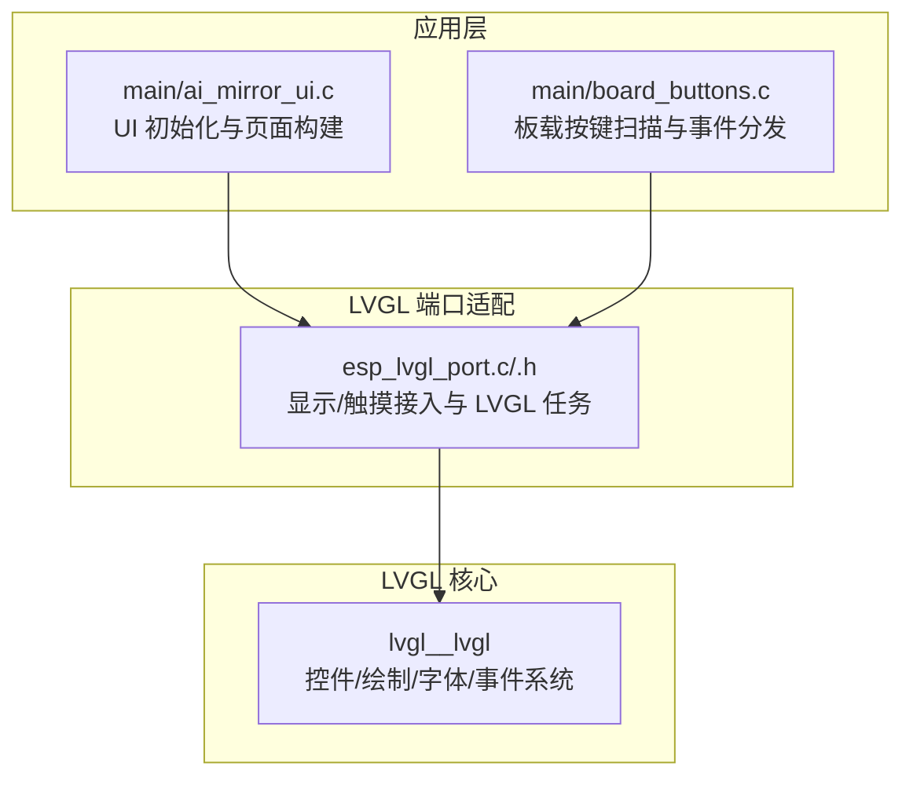
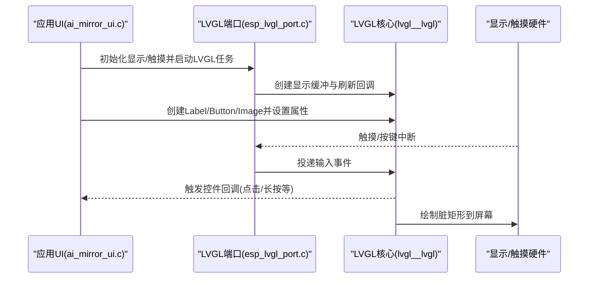
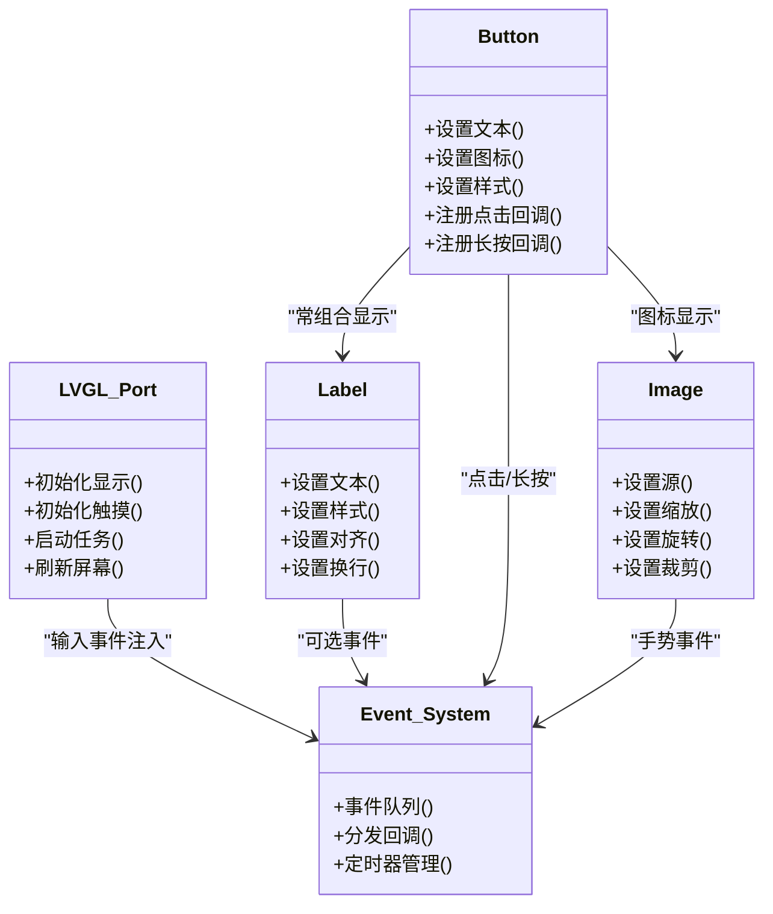
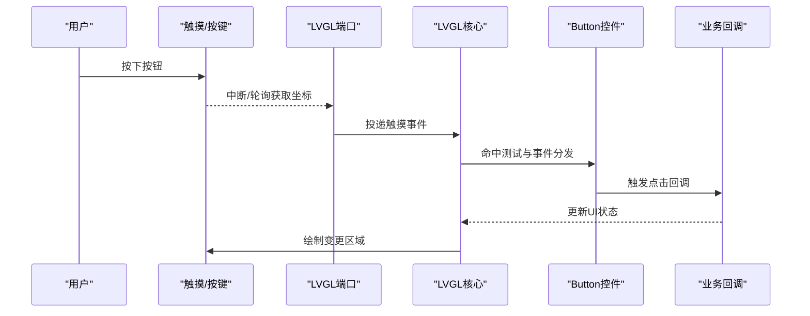
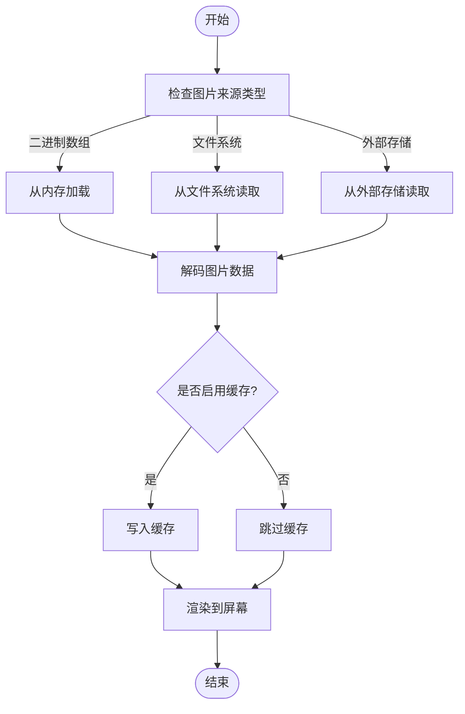
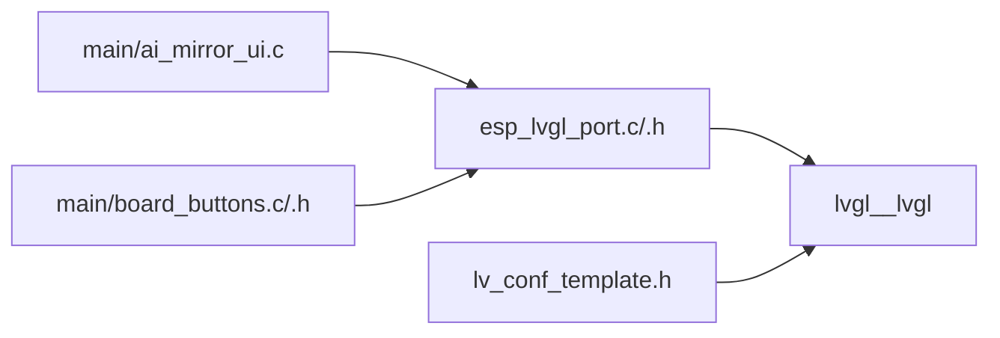

# 基础控件

<cite>
**本文引用的文件**   
- [ai_mirror_ui.c](file://Firmware/esp32_ai_mirror/main/ai_mirror_ui.c)
- [board_buttons.c](file://Firmware/esp32_ai_mirror/main/board_buttons.c)
- [board_buttons.h](file://Firmware/esp32_ai_mirror/main/board_buttons.h)
- [esp_lvgl_port.c](file://Firmware/esp32_ai_mirror/managed_components/espressif__esp_lvgl_port/esp_lvgl_port.c)
- [esp_lvgl_port.h](file://Firmware/esp32_ai_mirror/managed_components/espressif__esp_lvgl_port/include/esp_lvgl_port.h)
- [lv_conf_template.h](file://Firmware/esp32_ai_mirror/managed_components/lvgl__lvgl/lv_conf_template.h)
- [README.md](file://Firmware/esp32_ai_mirror/README.md)
</cite>

## 目录
1. [简介](#简介)
2. [项目结构](#项目结构)
3. [核心组件](#核心组件)
4. [架构总览](#架构总览)
5. [详细组件分析](#详细组件分析)
6. [依赖关系分析](#依赖关系分析)
7. [性能与内存优化](#性能与内存优化)
8. [故障排查指南](#故障排查指南)
9. [结论](#结论)
10. [附录：ESP32 上基础控件使用示例（路径指引）](#附录esp32-上基础控件使用示例路径指引)

## 简介
本文件面向在 ESP32 平台上基于 LVGL 开发 UI 的工程师，聚焦三大基础控件：标签(Label)、按钮(Button)、图像(Image)。文档覆盖控件的创建、属性配置、样式定制、事件处理机制，以及生命周期管理、内存优化与性能调优最佳实践。同时提供在 ESP32 环境中的高效使用要点与代码片段路径指引，帮助快速实现文本显示、用户交互和图片渲染。

## 项目结构
本项目采用 ESP-IDF + LVGL 的典型嵌入式 GUI 架构：
- 应用层 UI 逻辑位于 main 目录，负责页面布局、控件实例化与事件回调。
- LVGL 端口适配由 espressif__esp_lvgl_port 提供，封装了显示驱动、输入设备与 LVGL 任务调度。
- LVGL 核心库位于 lvgl__lvgl，包含控件实现、绘制管线与配置模板。

图表来源
- [ai_mirror_ui.c](file://Firmware/esp32_ai_mirror/main/ai_mirror_ui.c)
- [board_buttons.c](file://Firmware/esp32_ai_mirror/main/board_buttons.c)
- [esp_lvgl_port.c](file://Firmware/esp32_ai_mirror/managed_components/espressif__esp_lvgl_port/esp_lvgl_port.c)
- [esp_lvgl_port.h](file://Firmware/esp32_ai_mirror/managed_components/espressif__esp_lvgl_port/include/esp_lvgl_port.h)
- [lv_conf_template.h](file://Firmware/esp32_ai_mirror/managed_components/lvgl__lvgl/lv_conf_template.h)

章节来源
- [README.md](file://Firmware/esp32_ai_mirror/README.md)

## 核心组件
- 标签(Label)
  - 用途：显示静态或动态文本，支持多行、对齐、换行与富文本样式。
  - 关键能力：文本设置、字体选择、颜色/背景样式、自动换行、截断模式、滚动条。
  - 典型场景：状态提示、标题、参数值展示。
- 按钮(Button)
  - 用途：接收用户点击/长按等交互，触发业务逻辑。
  - 关键能力：文本/图标组合、按下态/禁用态样式、边框与圆角、事件回调注册。
  - 典型场景：确认/取消、切换开关、菜单项。
- 图像(Image)
  - 用途：显示位图、图标或图片资源，支持缩放、旋转、着色与缓存。
  - 关键能力：源类型(二进制数组/文件系统/外部存储)、格式解码、抗锯齿、裁剪区域。
  - 典型场景：Logo、状态图标、照片墙。

章节来源
- [lv_conf_template.h](file://Firmware/esp32_ai_mirror/managed_components/lvgl__lvgl/lv_conf_template.h)

## 架构总览
ESP32 上的 LVGL UI 运行流程如下：
- 启动阶段：初始化 LVGL、注册显示驱动与触摸驱动、创建 LVGL 任务。
- 页面构建：创建 Label/Button/Image 控件，设置属性与样式，加入父容器。
- 事件循环：触摸/按键事件经端口适配进入 LVGL 事件队列，分发给控件回调。
- 渲染管线：LVGL 计算脏矩形，调用底层绘制接口刷新屏幕。

图表来源
- [esp_lvgl_port.c](file://Firmware/esp32_ai_mirror/managed_components/espressif__esp_lvgl_port/esp_lvgl_port.c)
- [esp_lvgl_port.h](file://Firmware/esp32_ai_mirror/managed_components/espressif__esp_lvgl_port/include/esp_lvgl_port.h)
- [lv_conf_template.h](file://Firmware/esp32_ai_mirror/managed_components/lvgl__lvgl/lv_conf_template.h)

## 详细组件分析

### 标签(Label)
- 创建与添加
  - 通过 LVGL 提供的 API 创建 Label 对象，并将其添加到页面或容器中。
  - 建议为长文本启用自动换行与合适的对齐方式，避免溢出。
- 属性与样式
  - 文本内容：支持 UTF-8，注意字体编码与字重。
  - 样式：前景色、背景色、边框、阴影、圆角、透明度。
  - 行为：换行模式、截断模式、滚动方向。
- 事件处理
  - Label 通常不直接响应事件，但可配合 Button 或作为提示文本更新。
- 生命周期与内存
  - 页面销毁时释放 Label，避免内存泄漏。
  - 大段文本建议使用静态缓冲区或预分配内存，减少频繁分配。
- 性能要点
  - 减少频繁 setText 导致的重绘；批量更新后统一刷新。
  - 合理设置字体大小与行高，降低绘制开销。

章节来源
- [lv_conf_template.h](file://Firmware/esp32_ai_mirror/managed_components/lvgl__lvgl/lv_conf_template.h)

### 按钮(Button)
- 创建与添加
  - 创建 Button 并设置文本或图标，必要时添加子控件进行布局。
- 属性与样式
  - 外观：边框、圆角、背景渐变、按下态高亮、禁用态灰度。
  - 布局：内边距、对齐、图标位置。
- 事件处理
  - 注册点击、长按、释放等回调，执行业务逻辑。
  - 可在回调中更新其他控件状态或导航页面。
- 生命周期与内存
  - 按钮持有文本/图标引用，确保资源生命周期大于控件。
  - 页面退出时移除并释放按钮，防止悬空指针。
- 性能要点
  - 避免在回调中进行耗时操作，必要时放入后台任务或延时处理。
  - 合理使用动画与过渡效果，控制帧率与刷新频率。

章节来源
- [board_buttons.c](file://Firmware/esp32_ai_mirror/main/board_buttons.c)
- [board_buttons.h](file://Firmware/esp32_ai_mirror/main/board_buttons.h)

### 图像(Image)
- 创建与添加
  - 根据图片来源选择合适的数据类型：二进制数组、文件系统、SPIFFS/LittleFS 或外部存储。
- 属性与样式
  - 缩放比例、旋转角度、着色、裁剪区域、抗锯齿。
  - 背景透明与混合模式。
- 事件处理
  - 可与手势识别结合，实现滑动、缩放等交互。
- 生命周期与内存
  - 图片数据尽量常驻内存或使用流式读取，避免重复解码。
  - 大图使用压缩格式与按需解码，降低 RAM 占用。
- 性能要点
  - 预解码或缓存缩略图，减少实时解码压力。
  - 合理设置刷新区域，避免全屏重绘。

章节来源
- [lv_conf_template.h](file://Firmware/esp32_ai_mirror/managed_components/lvgl__lvgl/lv_conf_template.h)

### 控件生命周期与事件流（类图）

图表来源
- [lv_conf_template.h](file://Firmware/esp32_ai_mirror/managed_components/lvgl__lvgl/lv_conf_template.h)
- [esp_lvgl_port.c](file://Firmware/esp32_ai_mirror/managed_components/espressif__esp_lvgl_port/esp_lvgl_port.c)

### 事件处理时序（序列图）

图表来源
- [esp_lvgl_port.c](file://Firmware/esp32_ai_mirror/managed_components/espressif__esp_lvgl_port/esp_lvgl_port.c)
- [board_buttons.c](file://Firmware/esp32_ai_mirror/main/board_buttons.c)

### 复杂逻辑流程图（以图片加载为例）

图表来源
- [lv_conf_template.h](file://Firmware/esp32_ai_mirror/managed_components/lvgl__lvgl/lv_conf_template.h)

## 依赖关系分析
- 应用层(main)依赖 LVGL 端口适配，用于显示与输入设备的抽象。
- LVGL 端口适配依赖 LVGL 核心库，提供统一的控件与绘制接口。
- 配置文件(lv_conf_template.h)决定功能开关、内存模型与性能选项。

图表来源
- [ai_mirror_ui.c](file://Firmware/esp32_ai_mirror/main/ai_mirror_ui.c)
- [board_buttons.c](file://Firmware/esp32_ai_mirror/main/board_buttons.c)
- [esp_lvgl_port.c](file://Firmware/esp32_ai_mirror/managed_components/espressif__esp_lvgl_port/esp_lvgl_port.c)
- [lv_conf_template.h](file://Firmware/esp32_ai_mirror/managed_components/lvgl__lvgl/lv_conf_template.h)

章节来源
- [esp_lvgl_port.h](file://Firmware/esp32_ai_mirror/managed_components/espressif__esp_lvgl_port/include/esp_lvgl_port.h)
- [lv_conf_template.h](file://Firmware/esp32_ai_mirror/managed_components/lvgl__lvgl/lv_conf_template.h)

## 性能与内存优化
- 显示与刷新
  - 合理设置双缓冲与刷新区域，减少全屏重绘。
  - 使用增量更新与脏矩形合并，降低总线带宽占用。
- 内存管理
  - 预分配常用控件与字体，避免运行时频繁分配。
  - 图片资源按分辨率分级，小屏优先使用低分辨率版本。
- 事件与任务
  - 将耗时操作放入后台任务，避免阻塞 LVGL 主循环。
  - 使用事件节流与去抖，减少高频事件带来的抖动。
- 字体与文本
  - 仅启用需要的字符集，减小字体表体积。
  - 对长文本使用静态缓冲区，避免重复分配。
- 电源与功耗
  - 在无交互时降低刷新频率或进入低功耗模式。
  - 关闭不必要的动画与特效。

[本节为通用指导，不直接分析具体文件]

## 故障排查指南
- 屏幕无显示
  - 检查 LVGL 端口初始化顺序与显示驱动配置。
  - 确认刷新回调已正确注册且缓冲区有效。
- 触摸无效
  - 验证触摸驱动初始化与坐标映射。
  - 检查事件队列是否被阻塞或任务优先级不当。
- 控件不响应
  - 确认事件回调已注册且未被覆盖。
  - 检查控件层级与命中测试区域。
- 卡顿与掉帧
  - 定位耗时回调，拆分任务或使用异步处理。
  - 减少复杂样式与大量动画。
- 内存不足
  - 统计控件与图片占用，优化资源大小。
  - 调整 LVGL 内存池与缓存策略。

章节来源
- [esp_lvgl_port.c](file://Firmware/esp32_ai_mirror/managed_components/espressif__esp_lvgl_port/esp_lvgl_port.c)
- [board_buttons.c](file://Firmware/esp32_ai_mirror/main/board_buttons.c)

## 结论
在 ESP32 上使用 LVGL 的基础控件，关键在于合理的初始化流程、清晰的控件生命周期管理与高效的资源利用。通过规范的事件处理与性能优化策略，可以在有限的资源下实现流畅的用户界面。建议在开发过程中持续监控内存与 CPU 占用，逐步迭代优化。

[本节为总结性内容，不直接分析具体文件]

## 附录：ESP32 上基础控件使用示例（路径指引）
- 标签(Label)
  - 创建与设置文本：参考 [ai_mirror_ui.c](file://Firmware/esp32_ai_mirror/main/ai_mirror_ui.c)
  - 样式与对齐：参考 [lv_conf_template.h](file://Firmware/esp32_ai_mirror/managed_components/lvgl__lvgl/lv_conf_template.h)
- 按钮(Button)
  - 创建与事件回调：参考 [board_buttons.c](file://Firmware/esp32_ai_mirror/main/board_buttons.c)
  - 样式配置：参考 [lv_conf_template.h](file://Firmware/esp32_ai_mirror/managed_components/lvgl__lvgl/lv_conf_template.h)
- 图像(Image)
  - 图片源与解码：参考 [lv_conf_template.h](file://Firmware/esp32_ai_mirror/managed_components/lvgl__lvgl/lv_conf_template.h)
  - 显示与缓存：参考 [esp_lvgl_port.c](file://Firmware/esp32_ai_mirror/managed_components/espressif__esp_lvgl_port/esp_lvgl_port.c)

[本节为路径指引，不直接分析具体文件]