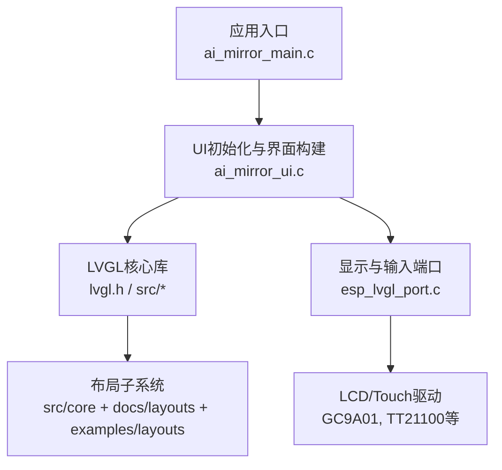
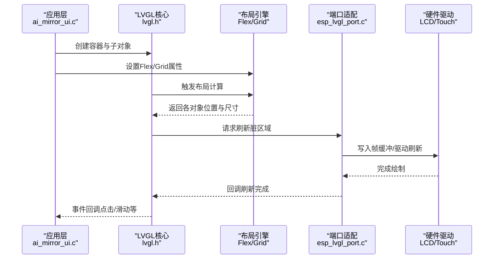
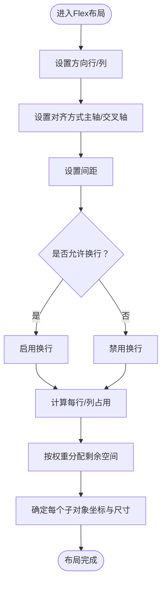
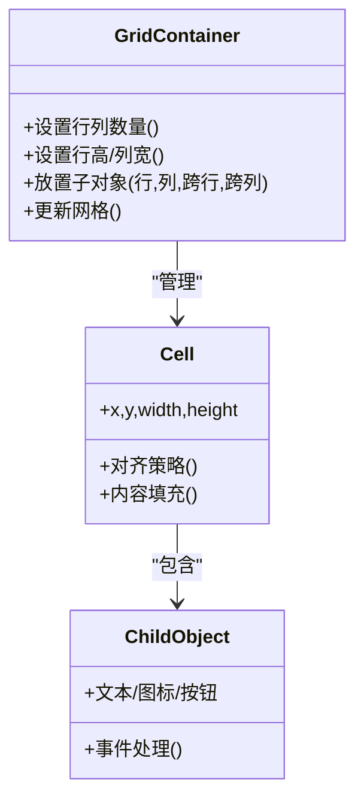
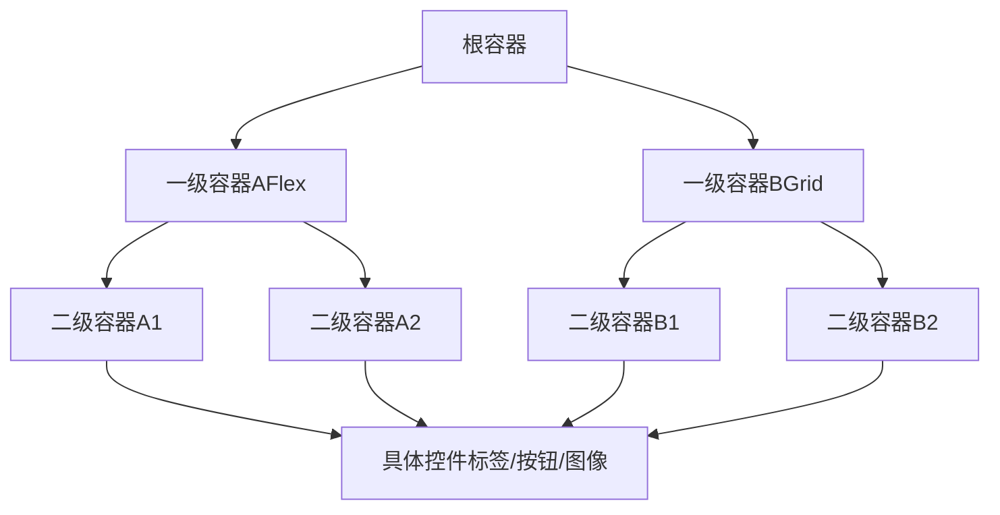
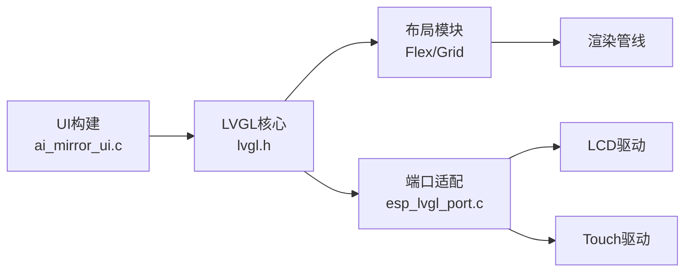

# 布局容器

<cite>
**本文引用的文件**   
- [ai_mirror_ui.c](file://Firmware/esp32_ai_mirror/main/ai_mirror_ui.c)
- [lvgl.h](file://Firmware/esp32_ai_mirror/managed_components/lvgl__lvgl/lvgl.h)
- [layouts目录文档](file://Firmware/esp32_ai_mirror/managed_components/lvgl__lvgl/docs/layouts/)
- [examples/layouts示例](file://Firmware/esp32_ai_mirror/managed_components/lvgl__lvgl/examples/layouts/)
- [esp_lvgl_port.c](file://Firmware/esp32_ai_mirror/managed_components/espressif__esp_lvgl_port/esp_lvgl_port.c)
- [performance.md](file://Firmware/esp32_ai_mirror/managed_components/espressif__esp_lvgl_port/docs/performance.md)
</cite>

## 目录
1. [简介](#简介)
2. [项目结构](#项目结构)
3. [核心组件](#核心组件)
4. [架构总览](#架构总览)
5. [详细组件分析](#详细组件分析)
6. [依赖关系分析](#依赖关系分析)
7. [性能考虑](#性能考虑)
8. [故障排查指南](#故障排查指南)
9. [结论](#结论)
10. [附录](#附录)

## 简介
本文件面向ESP32设备上基于LVGL的UI开发，聚焦“布局容器”主题：系统讲解Flex与Grid两种布局模式、容器的嵌套策略、子控件定位算法与自适应布局方法；并结合ESP32资源受限环境，给出响应式设计原则、屏幕适配方案、多分辨率支持策略，以及布局性能优化、内存使用分析与渲染效率提升的实践建议。目标是帮助开发者构建可维护、可扩展且跨设备尺寸一致的UI架构。

## 项目结构
本项目在ESP-IDF工程中使用LVGL作为图形库，并通过espressif提供的esp_lvgl_port进行端口适配。UI逻辑集中在main目录下，LVGL源码位于managed_components/lvgl__lvgl中，布局相关文档与示例亦在该路径下。

图表来源 
- [ai_mirror_ui.c](file://Firmware/esp32_ai_mirror/main/ai_mirror_ui.c)
- [lvgl.h](file://Firmware/esp32_ai_mirror/managed_components/lvgl__lvgl/lvgl.h)
- [esp_lvgl_port.c](file://Firmware/esp32_ai_mirror/managed_components/espressif__esp_lvgl_port/esp_lvgl_port.c)

章节来源
- [ai_mirror_ui.c](file://Firmware/esp32_ai_mirror/main/ai_mirror_ui.c)
- [lvgl.h](file://Firmware/esp32_ai_mirror/managed_components/lvgl__lvgl/lvgl.h)
- [esp_lvgl_port.c](file://Firmware/esp32_ai_mirror/managed_components/espressif__esp_lvgl_port/esp_lvgl_port.c)

## 核心组件
- LVGL容器与对象模型：所有UI元素均为对象，容器是承载子对象的父对象，提供布局、样式、事件等能力。
- Flex布局：线性方向（行/列）上的弹性排列，支持对齐、间距、换行、权重分配等。
- Grid布局：二维网格划分，单元格内放置控件，支持行列跨度、对齐与自适应列宽。
- 显示与输入端口：通过esp_lvgl_port将LVGL与ESP32的LCD/Touch驱动对接，完成刷新与触摸事件上报。

章节来源
- [lvgl.h](file://Firmware/esp32_ai_mirror/managed_components/lvgl__lvgl/lvgl.h)
- [esp_lvgl_port.c](file://Firmware/esp32_ai_mirror/managed_components/espressif__esp_lvgl_port/esp_lvgl_port.c)

## 架构总览
下图展示从应用到LVGL布局系统的调用链与数据流，强调UI构建、布局计算与渲染刷新的关键阶段。

图表来源 
- [ai_mirror_ui.c](file://Firmware/esp32_ai_mirror/main/ai_mirror_ui.c)
- [lvgl.h](file://Firmware/esp32_ai_mirror/managed_components/lvgl__lvgl/lvgl.h)
- [esp_lvgl_port.c](file://Firmware/esp32_ai_mirror/managed_components/espressif__esp_lvgl_port/esp_lvgl_port.c)

## 详细组件分析

### Flex布局详解
Flex布局适用于一维线性排列场景，适合导航栏、列表项、卡片组等。其核心概念包括：
- 主轴与交叉轴：根据方向（水平/垂直）决定排列主序。
- 对齐与分布：主轴对齐、交叉轴对齐、空间分布（均匀、两端对齐等）。
- 间距与换行：控制子对象间距与自动换行行为。
- 权重与伸缩：通过权重让子对象按比例填充剩余空间。

图表来源 
- [layouts目录文档](file://Firmware/esp32_ai_mirror/managed_components/lvgl__lvgl/docs/layouts/)
- [examples/layouts示例](file://Firmware/esp32_ai_mirror/managed_components/lvgl__lvgl/examples/layouts/)

章节来源
- [layouts目录文档](file://Firmware/esp32_ai_mirror/managed_components/lvgl__lvgl/docs/layouts/)
- [examples/layouts示例](file://Firmware/esp32_ai_mirror/managed_components/lvgl__lvgl/examples/layouts/)

### Grid布局详解
Grid布局适用于二维表格化界面，如仪表盘、控制面板、媒体播放器等。关键点包括：
- 行列定义：定义网格的行高与列宽，支持固定值、比例或自适应。
- 单元格放置：指定子对象所在的行列范围，支持跨行/跨列。
- 对齐与填充：单元格内部的对齐与内容填充策略。
- 响应式调整：在不同屏幕宽度下动态调整列数与行高。

图表来源 
- [layouts目录文档](file://Firmware/esp32_ai_mirror/managed_components/lvgl__lvgl/docs/layouts/)
- [examples/layouts示例](file://Firmware/esp32_ai_mirror/managed_components/lvgl__lvgl/examples/layouts/)

章节来源
- [layouts目录文档](file://Firmware/esp32_ai_mirror/managed_components/lvgl__lvgl/docs/layouts/)
- [examples/layouts示例](file://Firmware/esp32_ai_mirror/managed_components/lvgl__lvgl/examples/layouts/)

### 容器嵌套与子控件定位算法
- 嵌套策略：外层容器负责整体结构（如顶部导航+中部内容+底部状态），内层容器负责局部布局（如内容区采用Grid，状态栏采用Flex）。
- 定位算法：LVGL在布局阶段递归遍历子树，先计算父容器可用空间，再依据布局规则计算子对象位置与尺寸，最后标记需要重绘的区域。
- 自适应策略：结合屏幕尺寸变化（横竖屏切换、不同分辨率）动态调整布局参数（如列数、间距、权重）。

图表来源 
- [ai_mirror_ui.c](file://Firmware/esp32_ai_mirror/main/ai_mirror_ui.c)
- [lvgl.h](file://Firmware/esp32_ai_mirror/managed_components/lvgl__lvgl/lvgl.h)

章节来源
- [ai_mirror_ui.c](file://Firmware/esp32_ai_mirror/main/ai_mirror_ui.c)
- [lvgl.h](file://Firmware/esp32_ai_mirror/managed_components/lvgl__lvgl/lvgl.h)

### 响应式设计与屏幕适配
- 断点策略：根据屏幕宽度划分小屏、中屏、大屏，分别配置Flex方向、Grid列数、字体大小与间距。
- 单位选择：优先使用相对单位（百分比、比例）而非绝对像素，确保在不同分辨率下保持一致的比例关系。
- 动态重建：在屏幕旋转或分辨率变化时，重新计算布局并触发刷新，避免静态布局导致的错位。

章节来源
- [layouts目录文档](file://Firmware/esp32_ai_mirror/managed_components/lvgl__lvgl/docs/layouts/)
- [examples/layouts示例](file://Firmware/esp32_ai_mirror/managed_components/lvgl__lvgl/examples/layouts/)

### 复杂界面布局案例
以“AI镜像面板”为例：
- 顶部导航：Flex横向排列，左侧Logo、中间标题、右侧操作按钮，权重分配保证标题居中。
- 中部内容：Grid两列布局，左列为信息卡片（文本+进度条），右列为媒体控制（播放/暂停/音量滑块）。
- 底部状态：Flex纵向排列，显示网络状态、电量、时间等信息。
- 响应式：在小屏设备上，Grid自动切换为单列，顶部导航改为纵向堆叠。

章节来源
- [ai_mirror_ui.c](file://Firmware/esp32_ai_mirror/main/ai_mirror_ui.c)
- [examples/layouts示例](file://Firmware/esp32_ai_mirror/managed_components/lvgl__lvgl/examples/layouts/)

## 依赖关系分析
LVGL布局系统依赖于核心对象模型、样式系统与渲染管线，同时通过esp_lvgl_port与底层驱动交互。

图表来源 
- [ai_mirror_ui.c](file://Firmware/esp32_ai_mirror/main/ai_mirror_ui.c)
- [lvgl.h](file://Firmware/esp32_ai_mirror/managed_components/lvgl__lvgl/lvgl.h)
- [esp_lvgl_port.c](file://Firmware/esp32_ai_mirror/managed_components/espressif__esp_lvgl_port/esp_lvgl_port.c)

章节来源
- [ai_mirror_ui.c](file://Firmware/esp32_ai_mirror/main/ai_mirror_ui.c)
- [lvgl.h](file://Firmware/esp32_ai_mirror/managed_components/lvgl__lvgl/lvgl.h)
- [esp_lvgl_port.c](file://Firmware/esp32_ai_mirror/managed_components/espressif__esp_lvgl_port/esp_lvgl_port.c)

## 性能考虑
- 布局缓存：避免频繁重建布局，仅在必要时触发重新计算。
- 增量刷新：利用LVGL的脏矩形机制，仅刷新变化区域。
- 对象复用：减少对象创建与销毁，提高内存利用率。
- 字体与图像优化：使用压缩字体与图像格式，降低RAM占用。
- 渲染线程：将耗时操作放入后台任务，避免阻塞UI主循环。

章节来源
- [performance.md](file://Firmware/esp32_ai_mirror/managed_components/espressif__esp_lvgl_port/docs/performance.md)

## 故障排查指南
- 布局错乱：检查Flex/Grid属性是否正确设置，确认子对象尺寸未超出容器边界。
- 刷新异常：确认esp_lvgl_port配置正确，LCD/Touch驱动初始化成功。
- 内存不足：减少对象数量，优化字体与图像资源，启用内存池管理。
- 触摸无响应：检查触摸坐标映射与屏幕分辨率设置是否一致。

章节来源
- [esp_lvgl_port.c](file://Firmware/esp32_ai_mirror/managed_components/espressif__esp_lvgl_port/esp_lvgl_port.c)
- [performance.md](file://Firmware/esp32_ai_mirror/managed_components/espressif__esp_lvgl_port/docs/performance.md)

## 结论
通过合理运用LVGL的Flex与Grid布局，结合响应式设计策略与性能优化技巧，可以在ESP32等资源受限设备上构建出美观、高效且易于维护的UI界面。关键在于理解布局算法、合理规划容器嵌套结构，并在不同屏幕尺寸下进行充分测试与调优。

## 附录
- 参考文档：LVGL官方布局文档与示例代码。
- 最佳实践：优先使用相对单位、避免过度嵌套、定期清理无用对象。
- 工具推荐：使用LVGL Simulator进行布局调试与性能分析。