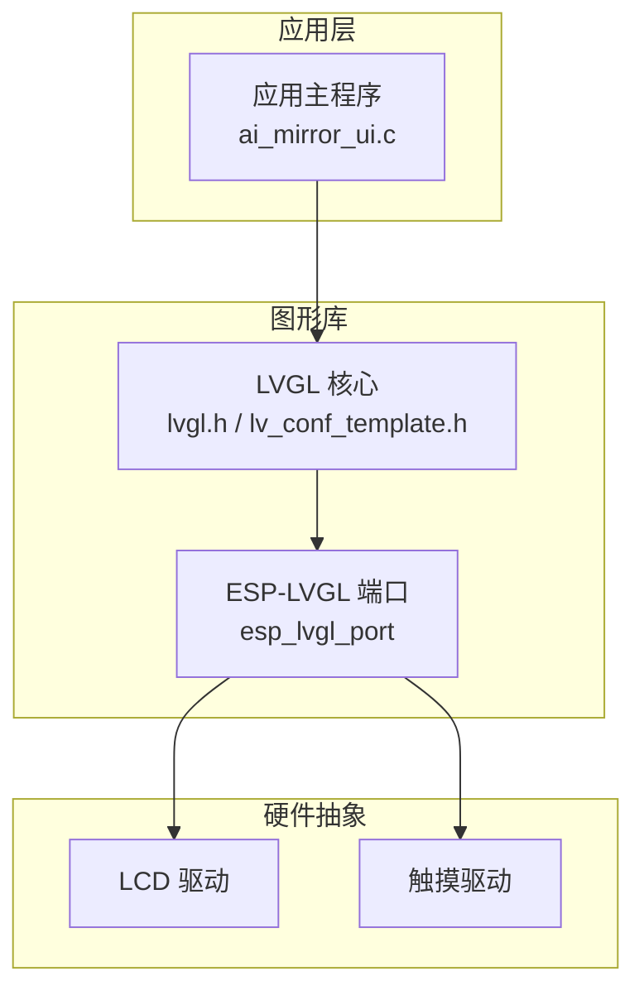
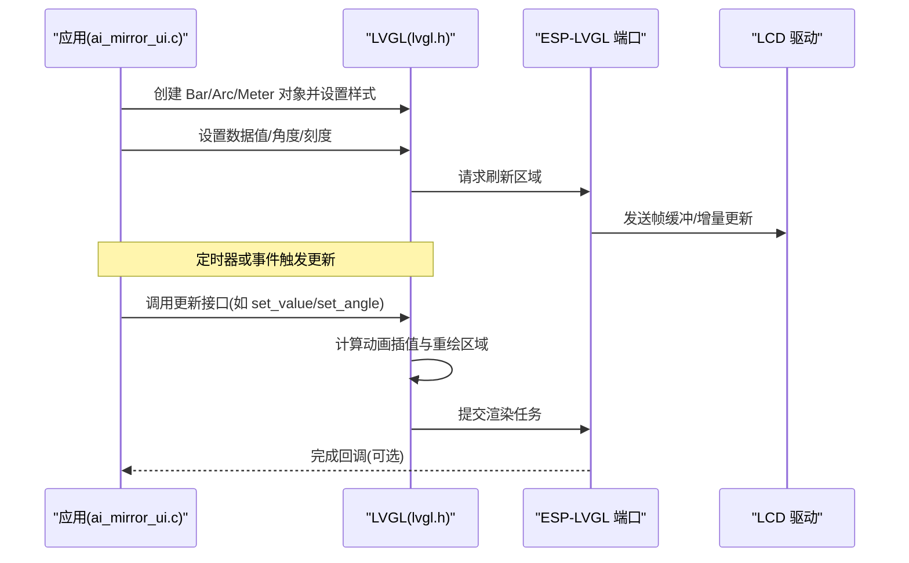
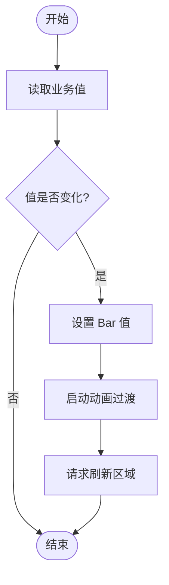
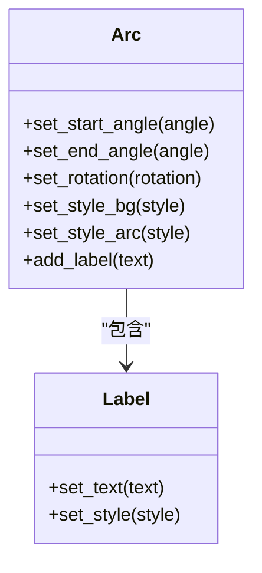
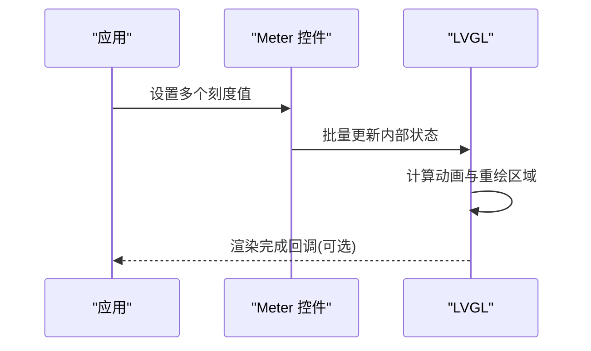
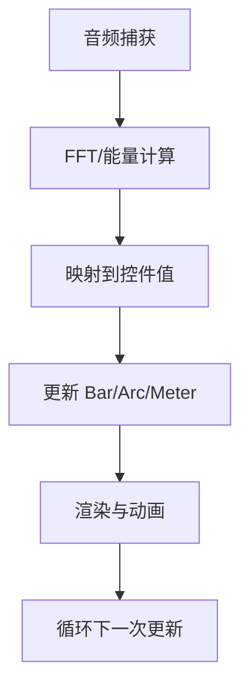
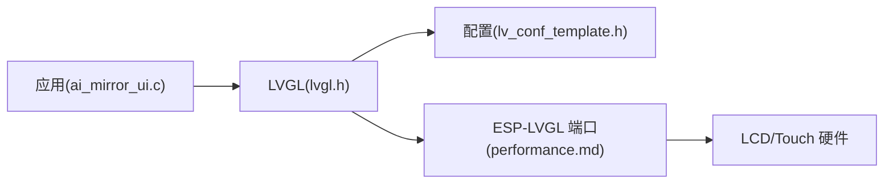

# 显示控件

<cite>
**本文引用的文件**   
- [ai_mirror_ui.c](file://Firmware/esp32_ai_mirror/main/ai_mirror_ui.c)
- [lvgl.h](file://Firmware/esp32_ai_mirror/managed_components/lvgl__lvgl/lvgl.h)
- [lv_conf_template.h](file://Firmware/esp32_ai_mirror/managed_components/lvgl__lvgl/lv_conf_template.h)
- [performance.md](file://Firmware/esp32_ai_mirror/managed_components/espressif__esp_lvgl_port/docs/performance.md)
- [lv_examples.h](file://Firmware/esp32_ai_mirror/managed_components/lvgl__lvgl/examples/lv_examples.h)
- [music_demo.c](file://Firmware/esp32_ai_mirror/managed_components/lvgl__lvgl/demos/music/main.c)
- [widgets_demo.c](file://Firmware/esp32_ai_mirror/managed_components/lvgl__lvgl/demos/widgets/main.c)
- [benchmark_demo.c](file://Firmware/esp32_ai_mirror/managed_components/lvgl__lvgl/demos/benchmark/main.c)
</cite>

## 目录
1. [简介](#简介)
2. [项目结构](#项目结构)
3. [核心组件](#核心组件)
4. [架构总览](#架构总览)
5. [详细组件分析](#详细组件分析)
6. [依赖关系分析](#依赖关系分析)
7. [性能考虑](#性能考虑)
8. [故障排查指南](#故障排查指南)
9. [结论](#结论)
10. [附录](#附录)

## 简介
本文件面向在 ESP32 平台上使用 LVGL 构建数据可视化界面的开发者，聚焦进度条(Bar)、弧形(Arc)、仪表(Meter)等显示控件的使用与优化。内容涵盖：
- 数据绑定与实时更新策略
- 动画过渡与刷新频率控制
- 样式定制与主题切换
- 不同显示模式下的内存管理与渲染优化
- 自定义绘制函数实现与复杂图表构建技巧
- 音频可视化、系统状态监控等实际应用场景与调优实践

## 项目结构
本项目基于 ESP-IDF + LVGL 的嵌入式 GUI 方案，UI 逻辑集中在应用层 main 模块中，LVGL 作为图形库通过 espressif__esp_lvgl_port 集成到 ESP32 平台。关键目录与职责：
- main: 应用入口与 UI 初始化、事件处理、业务逻辑与 LVGL 对象创建
- managed_components/lvgl__lvgl: LVGL 核心库与示例、演示
- managed_components/espressif__esp_lvgl_port: LVGL 与 ESP-IDF 的桥接（显示驱动、输入设备、性能文档）

**图示来源** 
- [ai_mirror_ui.c](file://Firmware/esp32_ai_mirror/main/ai_mirror_ui.c)
- [lvgl.h](file://Firmware/esp32_ai_mirror/managed_components/lvgl__lvgl/lvgl.h)
- [lv_conf_template.h](file://Firmware/esp32_ai_mirror/managed_components/lvgl__lvgl/lv_conf_template.h)
- [performance.md](file://Firmware/esp32_ai_mirror/managed_components/espressif__esp_lvgl_port/docs/performance.md)

**章节来源**
- [ai_mirror_ui.c](file://Firmware/esp32_ai_mirror/main/ai_mirror_ui.c)
- [lvgl.h](file://Firmware/esp32_ai_mirror/managed_components/lvgl__lvgl/lvgl.h)
- [lv_conf_template.h](file://Firmware/esp32_ai_mirror/managed_components/lvgl__lvgl/lv_conf_template.h)
- [performance.md](file://Firmware/esp32_ai_mirror/managed_components/espressif__esp_lvgl_port/docs/performance.md)

## 核心组件
- 进度条(Bar): 用于线性数值展示，支持范围、颜色渐变、动画更新
- 弧形(Arc): 用于环形进度或角度指示，支持起始角、结束角、旋转方向
- 仪表(Meter): 用于多指标仪表盘，支持刻度、指针、背景色、标签

这些控件均基于 LVGL 的对象模型，具备事件回调、样式属性、动画能力，适合在资源受限的嵌入式环境中高效运行。

**章节来源**
- [lvgl.h](file://Firmware/esp32_ai_mirror/managed_components/lvgl__lvgl/lvgl.h)
- [lv_conf_template.h](file://Firmware/esp32_ai_mirror/managed_components/lvgl__lvgl/lv_conf_template.h)

## 架构总览
下图展示了从应用层到 LVGL 渲染管线的关键路径，以及控件更新与刷新的时序。

**图示来源** 
- [ai_mirror_ui.c](file://Firmware/esp32_ai_mirror/main/ai_mirror_ui.c)
- [lvgl.h](file://Firmware/esp32_ai_mirror/managed_components/lvgl__lvgl/lvgl.h)
- [performance.md](file://Firmware/esp32_ai_mirror/managed_components/espressif__esp_lvgl_port/docs/performance.md)

## 详细组件分析

### 进度条(Bar)
- 数据绑定
  - 将业务变量映射为 Bar 的值，通过 LVGL 的 set_value 接口进行更新
  - 建议采用“值变化检测”避免重复渲染
- 实时更新
  - 使用定时器或事件回调周期性更新，结合动画过渡提升视觉体验
  - 高频更新时启用增量刷新与局部重绘
- 动画过渡
  - 配置动画时长与缓动曲线，减少卡顿感
- 样式定制
  - 设置背景色、前景色、边框、圆角、渐变填充
  - 使用主题或样式表统一风格

**图示来源** 
- [ai_mirror_ui.c](file://Firmware/esp32_ai_mirror/main/ai_mirror_ui.c)
- [lvgl.h](file://Firmware/esp32_ai_mirror/managed_components/lvgl__lvgl/lvgl.h)

**章节来源**
- [ai_mirror_ui.c](file://Firmware/esp32_ai_mirror/main/ai_mirror_ui.c)
- [lvgl.h](file://Firmware/esp32_ai_mirror/managed_components/lvgl__lvgl/lvgl.h)

### 弧形(Arc)
- 数据绑定
  - 将角度或百分比映射为 Arc 的起始角与结束角
  - 支持顺时针/逆时针绘制
- 实时更新
  - 适用于旋转指示器、音量环、电量环等场景
  - 配合动画实现平滑过渡
- 动画过渡
  - 调整动画时长与插值方式，避免快速跳变
- 样式定制
  - 设置弧线宽度、颜色、阴影、背景盘
  - 可叠加文本标签显示当前值

**图示来源** 
- [lvgl.h](file://Firmware/esp32_ai_mirror/managed_components/lvgl__lvgl/lvgl.h)

**章节来源**
- [lvgl.h](file://Firmware/esp32_ai_mirror/managed_components/lvgl__lvgl/lvgl.h)

### 仪表(Meter)
- 数据绑定
  - 为多个刻度设置值，支持指针位置与刻度颜色
- 实时更新
  - 多指标同时更新时，批量设置后一次性刷新
  - 使用动画降低频繁更新的闪烁
- 动画过渡
  - 指针移动动画、刻度颜色渐变
- 样式定制
  - 背景、刻度线、指针、标签、中心图标
  - 支持主题化与动态换肤

**图示来源** 
- [lvgl.h](file://Firmware/esp32_ai_mirror/managed_components/lvgl__lvgl/lvgl.h)

**章节来源**
- [lvgl.h](file://Firmware/esp32_ai_mirror/managed_components/lvgl__lvgl/lvgl.h)

### 自定义绘制与复杂图表
- 自定义绘制
  - 使用 LVGL 的自定义绘制回调，在控件上绘制额外图形
  - 注意裁剪区域与性能开销，尽量复用缓冲区
- 复杂图表
  - 组合多个 Bar/Arc/Meter 形成仪表盘或统计图
  - 使用布局管理器对齐元素，提高可维护性
- 示例参考
  - 音乐可视化演示：频谱柱状图与波形绘制
  - 部件演示：各类控件的组合与交互
  - 基准测试：渲染压力与帧率评估

**章节来源**
- [music_demo.c](file://Firmware/esp32_ai_mirror/managed_components/lvgl__lvgl/demos/music/main.c)
- [widgets_demo.c](file://Firmware/esp32_ai_mirror/managed_components/lvgl__lvgl/demos/widgets/main.c)
- [benchmark_demo.c](file://Firmware/esp32_ai_mirror/managed_components/lvgl__lvgl/demos/benchmark/main.c)

### 实际应用场景

#### 音频可视化
- 采集音频数据，进行 FFT 或能量计算
- 将频域结果映射为 Bar 高度或 Arc 弧度
- 使用定时器按固定间隔更新，确保流畅度

**图示来源** 
- [music_demo.c](file://Firmware/esp32_ai_mirror/managed_components/lvgl__lvgl/demos/music/main.c)
- [lvgl.h](file://Firmware/esp32_ai_mirror/managed_components/lvgl__lvgl/lvgl.h)

**章节来源**
- [music_demo.c](file://Firmware/esp32_ai_mirror/managed_components/lvgl__lvgl/demos/music/main.c)
- [lvgl.h](file://Firmware/esp32_ai_mirror/managed_components/lvgl__lvgl/lvgl.h)

#### 系统状态监控
- CPU 温度、内存占用、网络信号强度等指标
- 使用 Meter 展示多指标，Bar 展示单项指标
- 定时轮询传感器数据，阈值告警与样式切换

**章节来源**
- [lvgl.h](file://Firmware/esp32_ai_mirror/managed_components/lvgl__lvgl/lvgl.h)

## 依赖关系分析
- 应用层依赖 LVGL API 创建与更新控件
- LVGL 通过 esp_lvgl_port 与底层显示/输入设备交互
- 配置文件 lv_conf_template.h 决定功能开关与内存分配

**图示来源** 
- [ai_mirror_ui.c](file://Firmware/esp32_ai_mirror/main/ai_mirror_ui.c)
- [lvgl.h](file://Firmware/esp32_ai_mirror/managed_components/lvgl__lvgl/lvgl.h)
- [lv_conf_template.h](file://Firmware/esp32_ai_mirror/managed_components/lvgl__lvgl/lv_conf_template.h)
- [performance.md](file://Firmware/esp32_ai_mirror/managed_components/espressif__esp_lvgl_port/docs/performance.md)

**章节来源**
- [ai_mirror_ui.c](file://Firmware/esp32_ai_mirror/main/ai_mirror_ui.c)
- [lvgl.h](file://Firmware/esp32_ai_mirror/managed_components/lvgl__lvgl/lvgl.h)
- [lv_conf_template.h](file://Firmware/esp32_ai_mirror/managed_components/lvgl__lvgl/lv_conf_template.h)
- [performance.md](file://Firmware/esp32_ai_mirror/managed_components/espressif__esp_lvgl_port/docs/performance.md)

## 性能考虑
- 内存管理
  - 合理配置 LVGL 缓冲区大小，避免频繁分配
  - 复用样式与图片资源，减少内存碎片
- 刷新频率控制
  - 根据数据变化频率设定更新周期，避免过度刷新
  - 使用增量刷新与局部重绘，降低带宽消耗
- 动画与渲染
  - 控制动画时长与复杂度，避免高负载场景掉帧
  - 关闭不必要的特效（阴影、模糊）以提升性能
- 参考文档
  - esp_lvgl_port 的性能文档提供具体优化建议与参数说明

**章节来源**
- [performance.md](file://Firmware/esp32_ai_mirror/managed_components/espressif__esp_lvgl_port/docs/performance.md)
- [lv_conf_template.h](file://Firmware/esp32_ai_mirror/managed_components/lvgl__lvgl/lv_conf_template.h)

## 故障排查指南
- 常见问题
  - 控件不更新：检查值变化检测与刷新调用是否正确
  - 动画卡顿：缩短动画时长或降低复杂度
  - 内存不足：减小缓冲区与图片尺寸，释放未用资源
- 调试方法
  - 使用基准测试评估渲染压力
  - 查看日志与回调，定位更新链路问题
- 示例参考
  - 基准测试演示：测量帧率与内存占用
  - 部件演示：验证控件行为与样式

**章节来源**
- [benchmark_demo.c](file://Firmware/esp32_ai_mirror/managed_components/lvgl__lvgl/demos/benchmark/main.c)
- [widgets_demo.c](file://Firmware/esp32_ai_mirror/managed_components/lvgl__lvgl/demos/widgets/main.c)

## 结论
通过 LVGL 提供的 Bar、Arc、Meter 等控件，可以在 ESP32 平台上高效构建数据可视化界面。关键在于：
- 合理的值变化检测与刷新策略
- 合适的动画与样式配置
- 针对嵌入式环境的内存与渲染优化
- 结合实际场景（音频可视化、系统监控）进行定制化开发

## 附录
- 示例与参考
  - 音乐可视化演示：[music_demo.c](file://Firmware/esp32_ai_mirror/managed_components/lvgl__lvgl/demos/music/main.c)
  - 部件演示：[widgets_demo.c](file://Firmware/esp32_ai_mirror/managed_components/lvgl__lvgl/demos/widgets/main.c)
  - 基准测试：[benchmark_demo.c](file://Firmware/esp32_ai_mirror/managed_components/lvgl__lvgl/demos/benchmark/main.c)
  - LVGL 头文件与配置：[lvgl.h](file://Firmware/esp32_ai_mirror/managed_components/lvgl__lvgl/lvgl.h), [lv_conf_template.h](file://Firmware/esp32_ai_mirror/managed_components/lvgl__lvgl/lv_conf_template.h)
  - 性能文档：[performance.md](file://Firmware/esp32_ai_mirror/managed_components/espressif__esp_lvgl_port/docs/performance.md)
  - 应用 UI 入口：[ai_mirror_ui.c](file://Firmware/esp32_ai_mirror/main/ai_mirror_ui.c)