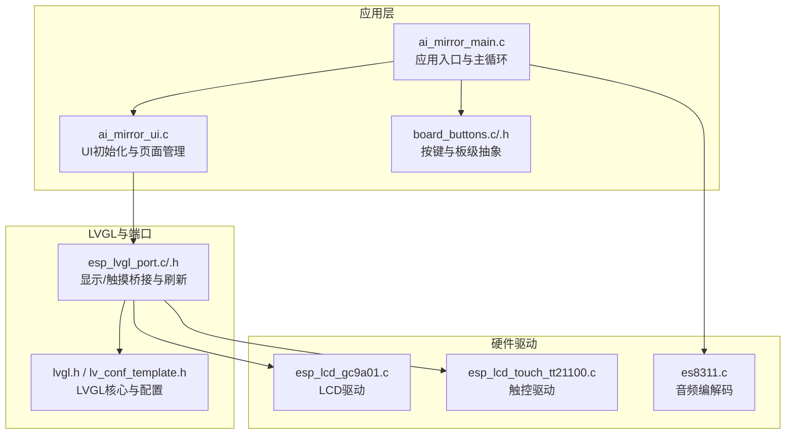
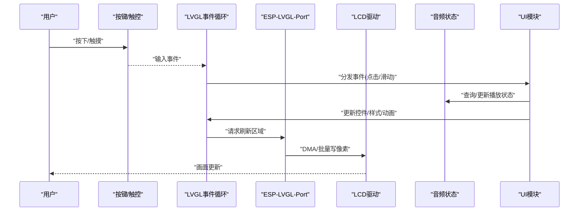
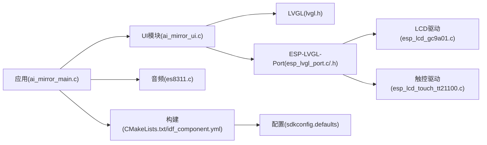

# UI框架

<cite>
**本文引用的文件**   
- [ai_mirror_main.c](file://Firmware/esp32_ai_mirror/main/ai_mirror_main.c)
- [ai_mirror_ui.c](file://Firmware/esp32_ai_mirror/main/ai_mirror_ui.c)
- [board_buttons.c](file://Firmware/esp32_ai_mirror/main/board_buttons.c)
- [board_buttons.h](file://Firmware/esp32_ai_mirror/main/board_buttons.h)
- [esp_lvgl_port.c](file://Firmware/esp32_ai_mirror/managed_components/espressif__esp_lvgl_port/esp_lvgl_port.c)
- [esp_lvgl_port.h](file://Firmware/esp32_ai_mirror/managed_components/espressif__esp_lvgl_port/include/esp_lvgl_port.h)
- [README.md](file://Firmware/esp32_ai_mirror/managed_components/espressif__esp_lvgl_port/README.md)
- [performance.md](file://Firmware/esp32_ai_mirror/managed_components/espressif__esp_lvgl_port/docs/performance.md)
- [lv_conf_template.h](file://Firmware/esp32_ai_mirror/managed_components/lvgl__lvgl/lv_conf_template.h)
- [lvgl.h](file://Firmware/esp32_ai_mirror/managed_components/lvgl__lvgl/lvgl.h)
- [CMakeLists.txt](file://Firmware/esp32_ai_mirror/CMakeLists.txt)
- [idf_component.yml](file://Firmware/esp32_ai_mirror/main/idf_component.yml)
- [sdkconfig.defaults](file://Firmware/esp32_ai_mirror/sdkconfig.defaults)
- [esp_lcd_gc9a01.c](file://Firmware/esp32_ai_mirror/managed_components/espressif__esp_lcd_gc9a01/esp_lcd_gc9a01.c)
- [esp_lcd_touch_tt21100.c](file://Firmware/esp32_ai_mirror/managed_components/espressif__esp_lcd_touch_tt21100/esp_lcd_touch_tt21100.c)
- [es8311.c](file://Firmware/esp32_ai_mirror/managed_components/espressif__es8311/es8311.c)
</cite>

## 目录
1. [简介](#简介)
2. [项目结构](#项目结构)
3. [核心组件](#核心组件)
4. [架构总览](#架构总览)
5. [详细组件分析](#详细组件分析)
6. [依赖关系分析](#依赖关系分析)
7. [性能考虑](#性能考虑)
8. [故障排查指南](#故障排查指南)
9. [结论](#结论)
10. [附录](#附录)

## 简介
本文件面向基于ESP32与LVGL的图形界面系统，系统性阐述UI框架的设计与实现，包括界面布局、控件管理、事件处理机制；详细说明ESP-LVGL-Port集成方式与显示驱动配置；解释触摸输入处理、屏幕刷新优化与内存管理策略；并给出自定义控件开发、主题定制、动画效果实现的最佳实践。同时涵盖与音频状态同步和用户交互逻辑的实现要点，帮助开发者快速构建高性能、可维护的嵌入式UI应用。

## 项目结构
本项目采用分层组织：
- 应用层（main）：包含UI初始化、主循环、按键与板级外设抽象、与LVGL集成的入口点。
- LVGL与端口适配：通过esp_lvgl_port提供显示/触摸桥接、任务调度与刷新策略；LVGL核心库提供控件、渲染、事件等能力。
- 硬件驱动：LCD控制器（如GC9A01）、触控芯片（如TT21100）、音频编解码器（如ES8311）。
- 构建与配置：CMake与Kconfig/sdconfig用于组件选择、内存与性能参数调优。

图表来源
- [ai_mirror_main.c](file://Firmware/esp32_ai_mirror/main/ai_mirror_main.c)
- [ai_mirror_ui.c](file://Firmware/esp32_ai_mirror/main/ai_mirror_ui.c)
- [esp_lvgl_port.c](file://Firmware/esp32_ai_mirror/managed_components/espressif__esp_lvgl_port/esp_lvgl_port.c)
- [esp_lvgl_port.h](file://Firmware/esp32_ai_mirror/managed_components/espressif__esp_lvgl_port/include/esp_lvgl_port.h)
- [lvgl.h](file://Firmware/esp32_ai_mirror/managed_components/lvgl__lvgl/lvgl.h)
- [lv_conf_template.h](file://Firmware/esp32_ai_mirror/managed_components/lvgl__lvgl/lv_conf_template.h)
- [esp_lcd_gc9a01.c](file://Firmware/esp32_ai_mirror/managed_components/espressif__esp_lcd_gc9a01/esp_lcd_gc9a01.c)
- [esp_lcd_touch_tt21100.c](file://Firmware/esp32_ai_mirror/managed_components/espressif__esp_lcd_touch_tt21100/esp_lcd_touch_tt21100.c)
- [es8311.c](file://Firmware/esp32_ai_mirror/managed_components/espressif__es8311/es8311.c)

章节来源
- [CMakeLists.txt](file://Firmware/esp32_ai_mirror/CMakeLists.txt)
- [idf_component.yml](file://Firmware/esp32_ai_mirror/main/idf_component.yml)
- [sdkconfig.defaults](file://Firmware/esp32_ai_mirror/sdkconfig.defaults)

## 核心组件
- 应用入口与主循环：负责系统初始化、各子系统启动、LVGL任务注册与运行、事件分发与业务状态机协调。
- UI模块：封装LVGL场景创建、控件树构建、样式与主题、动画与过渡、页面切换逻辑。
- 板级抽象：统一按键、LED、WiFi配网等板级资源访问，向上提供稳定接口。
- ESP-LVGL-Port：屏蔽底层显示/触摸差异，提供刷新回调、缓冲区管理、任务调度与性能优化开关。
- 显示与触控驱动：对接具体LCD控制器与触控IC，完成像素写入与坐标上报。
- 音频子系统：与语音识别/合成联动，驱动音频编解码器，更新UI状态指示。

章节来源
- [ai_mirror_main.c](file://Firmware/esp32_ai_mirror/main/ai_mirror_main.c)
- [ai_mirror_ui.c](file://Firmware/esp32_ai_mirror/main/ai_mirror_ui.c)
- [board_buttons.c](file://Firmware/esp32_ai_mirror/main/board_buttons.c)
- [board_buttons.h](file://Firmware/esp32_ai_mirror/main/board_buttons.h)
- [esp_lvgl_port.c](file://Firmware/esp32_ai_mirror/managed_components/espressif__esp_lvgl_port/esp_lvgl_port.c)
- [esp_lvgl_port.h](file://Firmware/esp32_ai_mirror/managed_components/espressif__esp_lvgl_port/include/esp_lvgl_port.h)

## 架构总览
下图展示从用户输入到屏幕刷新的关键路径，以及音频状态对UI的影响。

图表来源
- [ai_mirror_ui.c](file://Firmware/esp32_ai_mirror/main/ai_mirror_ui.c)
- [esp_lvgl_port.c](file://Firmware/esp32_ai_mirror/managed_components/espressif__esp_lvgl_port/esp_lvgl_port.c)
- [esp_lcd_gc9a01.c](file://Firmware/esp32_ai_mirror/managed_components/espressif__esp_lcd_gc9a01/esp_lcd_gc9a01.c)
- [esp_lcd_touch_tt21100.c](file://Firmware/esp32_ai_mirror/managed_components/espressif__esp_lcd_touch_tt21100/esp_lcd_touch_tt21100.c)
- [es8311.c](file://Firmware/esp32_ai_mirror/managed_components/espressif__es8311/es8311.c)

## 详细组件分析

### 应用入口与主循环（ai_mirror_main.c）
- 职责：初始化系统时钟、外设、LVGL与端口、注册任务与定时器、进入事件循环。
- 关键点：
  - 在启动阶段完成显示与触控驱动的初始化，并将刷新回调注册到LVGL。
  - 将按键与触控事件转换为LVGL事件模型，确保UI响应一致性。
  - 与音频状态保持同步，避免阻塞UI线程。
- 建议：
  - 使用独立任务运行LVGL tick与刷新，降低主循环抖动。
  - 将耗时操作放入队列或后台任务，通过信号量/消息通知UI更新。

章节来源
- [ai_mirror_main.c](file://Firmware/esp32_ai_mirror/main/ai_mirror_main.c)

### UI模块（ai_mirror_ui.c）
- 职责：构建LVGL控件树、设置主题与样式、处理页面切换与动画、维护业务状态映射。
- 关键点：
  - 使用LVGL容器与布局管理器（如flex/grid）组织界面，提高可维护性。
  - 通过样式对象集中管理颜色、字体、圆角、阴影等视觉属性。
  - 动画与过渡应控制帧率与目标区域，减少重绘范围。
- 最佳实践：
  - 将静态资源（图片/字体）使用压缩格式与按需加载。
  - 使用“脏矩形”与局部刷新，避免整屏重绘。
  - 为复杂控件建立缓存位图，提升滚动与动画流畅度。

章节来源
- [ai_mirror_ui.c](file://Firmware/esp32_ai_mirror/main/ai_mirror_ui.c)

### 板级按键与抽象（board_buttons.c/.h）
- 职责：封装按键扫描、去抖、长按/短按识别，向上暴露统一API。
- 关键点：
  - 使用定时器或中断采集按键状态，避免轮询阻塞。
  - 将物理按键映射为LVGL事件或直接触发UI动作。
- 建议：
  - 支持多键组合与动态映射，便于不同板型复用。
  - 提供调试钩子输出按键事件流，辅助定位交互问题。

章节来源
- [board_buttons.c](file://Firmware/esp32_ai_mirror/main/board_buttons.c)
- [board_buttons.h](file://Firmware/esp32_ai_mirror/main/board_buttons.h)

### ESP-LVGL-Port集成（esp_lvgl_port.c/.h）
- 职责：桥接LVGL与底层显示/触摸驱动，管理刷新缓冲区、任务调度与性能优化。
- 关键点：
  - 注册显示刷新回调，将LVGL脏矩形转化为DMA批量写入。
  - 配置双缓冲/三缓冲以平衡内存与卡顿。
  - 提供触摸读取回调，将坐标事件注入LVGL输入子系统。
- 性能优化：
  - 启用部分刷新与增量更新，限制每帧绘制面积。
  - 合理设置LVGL tick周期与刷新频率，匹配CPU与总线带宽。
  - 使用GPU/DMA加速（若可用），减少CPU占用。

章节来源
- [esp_lvgl_port.c](file://Firmware/esp32_ai_mirror/managed_components/espressif__esp_lvgl_port/esp_lvgl_port.c)
- [esp_lvgl_port.h](file://Firmware/esp32_ai_mirror/managed_components/espressif__esp_lvgl_port/include/esp_lvgl_port.h)
- [README.md](file://Firmware/esp32_ai_mirror/managed_components/espressif__esp_lvgl_port/README.md)
- [performance.md](file://Firmware/esp32_ai_mirror/managed_components/espressif__esp_lvgl_port/docs/performance.md)

### 显示驱动配置（esp_lcd_gc9a01.c）
- 职责：初始化GC9A01控制器、配置分辨率/色彩深度/时序、提供像素写入接口。
- 关键点：
  - 根据硬件走线与时序要求配置SPI/I2C/并行总线参数。
  - 开启硬件特性（如Gamma校正、低功耗模式）以提升显示质量与功耗表现。
  - 与LVGL刷新回调对接，确保数据正确传输。
- 建议：
  - 使用DMA传输大批量像素，降低CPU负载。
  - 针对频繁更新区域使用窗口化写入，减少总线压力。

章节来源
- [esp_lcd_gc9a01.c](file://Firmware/esp32_ai_mirror/managed_components/espressif__esp_lcd_gc9a01/esp_lcd_gc9a01.c)

### 触摸输入处理（esp_lcd_touch_tt21100.c）
- 职责：读取触控IC坐标、去噪与滤波、上报多点触控事件。
- 关键点：
  - 配置采样率与阈值，平衡灵敏度与误触。
  - 将原始坐标转换为LVGL坐标系，处理旋转与镜像。
  - 与LVGL输入事件系统集成，保证手势识别准确。
- 建议：
  - 增加滑动速度过滤与边界检测，提升交互体验。
  - 提供校准流程，适配不同安装角度与面板偏差。

章节来源
- [esp_lcd_touch_tt21100.c](file://Firmware/esp32_ai_mirror/managed_components/espressif__esp_lcd_touch_tt21100/esp_lcd_touch_tt21100.c)

### 音频状态同步（es8311.c）
- 职责：驱动音频编解码器，提供音量、播放状态、错误码等接口。
- 关键点：
  - 与LVGL UI共享状态变量，避免竞态条件。
  - 通过事件或回调通知UI更新播放指示、进度条等控件。
- 建议：
  - 使用环形缓冲与异步I/O，避免阻塞UI线程。
  - 在低电量或高负载时降级UI刷新频率，保障音频稳定性。

章节来源
- [es8311.c](file://Firmware/esp32_ai_mirror/managed_components/espressif__es8311/es8311.c)

### LVGL核心与配置（lvgl.h / lv_conf_template.h）
- 职责：定义LVGL API、控件类型、事件模型与全局配置项。
- 关键点：
  - 通过配置文件调整内存池大小、最大控件数、动画帧率、字体与图片后端。
  - 选择合适的渲染后端（软件/硬件加速）与显示接口。
- 建议：
  - 根据目标设备内存与性能裁剪功能，减少ROM/RAM占用。
  - 启用必要的调试宏，定位渲染瓶颈与内存泄漏。

章节来源
- [lvgl.h](file://Firmware/esp32_ai_mirror/managed_components/lvgl__lvgl/lvgl.h)
- [lv_conf_template.h](file://Firmware/esp32_ai_mirror/managed_components/lvgl__lvgl/lv_conf_template.h)

## 依赖关系分析
- 应用层依赖LVGL与esp_lvgl_port，后者依赖具体显示/触控驱动。
- UI模块依赖LVGL控件与样式系统，并通过事件总线与音频状态解耦。
- 构建系统通过CMake与idf_component.yml声明组件依赖，sdkconfig.defaults提供默认配置。

图表来源
- [ai_mirror_main.c](file://Firmware/esp32_ai_mirror/main/ai_mirror_main.c)
- [ai_mirror_ui.c](file://Firmware/esp32_ai_mirror/main/ai_mirror_ui.c)
- [esp_lvgl_port.c](file://Firmware/esp32_ai_mirror/managed_components/espressif__esp_lvgl_port/esp_lvgl_port.c)
- [esp_lcd_gc9a01.c](file://Firmware/esp32_ai_mirror/managed_components/espressif__esp_lcd_gc9a01/esp_lcd_gc9a01.c)
- [esp_lcd_touch_tt21100.c](file://Firmware/esp32_ai_mirror/managed_components/espressif__esp_lcd_touch_tt21100/esp_lcd_touch_tt21100.c)
- [es8311.c](file://Firmware/esp32_ai_mirror/managed_components/espressif__es8311/es8311.c)
- [CMakeLists.txt](file://Firmware/esp32_ai_mirror/CMakeLists.txt)
- [idf_component.yml](file://Firmware/esp32_ai_mirror/main/idf_component.yml)
- [sdkconfig.defaults](file://Firmware/esp32_ai_mirror/sdkconfig.defaults)

章节来源
- [CMakeLists.txt](file://Firmware/esp32_ai_mirror/CMakeLists.txt)
- [idf_component.yml](file://Firmware/esp32_ai_mirror/main/idf_component.yml)
- [sdkconfig.defaults](file://Firmware/esp32_ai_mirror/sdkconfig.defaults)

## 性能考虑
- 刷新优化
  - 使用部分刷新与脏矩形，限制每帧绘制面积。
  - 启用双缓冲/三缓冲，避免撕裂与卡顿。
  - 利用DMA/GPU批量写入，降低CPU占用。
- 内存管理
  - 合理配置LVGL内存池与图片缓存，避免频繁分配释放。
  - 使用静态资源与只读段，减少RAM消耗。
  - 监控内存碎片，必要时进行合并与回收。
- 事件与动画
  - 控制动画帧率与目标区域，避免过度重绘。
  - 将复杂计算卸载至后台任务，通过消息队列通知UI。
- 显示与触控
  - 优化总线带宽与时序，减少传输开销。
  - 触控采样率与滤波参数需权衡灵敏度与功耗。

[本节为通用指导，不直接分析具体文件]

## 故障排查指南
- 显示异常
  - 检查LCD驱动初始化顺序与时序参数是否正确。
  - 确认刷新回调已注册且缓冲区地址有效。
  - 观察DMA传输是否成功，必要时回退到非DMA模式验证。
- 触控失灵
  - 校验I2C/SPI通信与引脚配置。
  - 检查坐标转换矩阵与旋转设置。
  - 增加日志输出原始坐标，定位漂移或噪声问题。
- UI卡顿
  - 分析LVGL tick与刷新频率是否匹配CPU能力。
  - 减少每帧绘制面积，启用局部刷新。
  - 检查是否存在阻塞调用或长时间任务在主线程执行。
- 音频不同步
  - 确认音频状态变更通过事件或回调通知UI。
  - 避免在音频中断中执行UI更新。
  - 使用环形缓冲与异步I/O，降低延迟与抖动。

章节来源
- [esp_lvgl_port.c](file://Firmware/esp32_ai_mirror/managed_components/espressif__esp_lvgl_port/esp_lvgl_port.c)
- [esp_lcd_gc9a01.c](file://Firmware/esp32_ai_mirror/managed_components/espressif__esp_lcd_gc9a01/esp_lcd_gc9a01.c)
- [esp_lcd_touch_tt21100.c](file://Firmware/esp32_ai_mirror/managed_components/espressif__esp_lcd_touch_tt21100/esp_lcd_touch_tt21100.c)
- [es8311.c](file://Firmware/esp32_ai_mirror/managed_components/espressif__es8311/es8311.c)

## 结论
本UI框架以LVGL为核心，结合ESP-LVGL-Port与具体显示/触控驱动，构建了高效、可扩展的嵌入式图形界面系统。通过合理的分层设计、事件驱动与异步处理，实现了良好的交互体验与性能表现。遵循本文的最佳实践与优化技巧，可进一步提升系统的稳定性、可维护性与用户体验。

[本节为总结性内容，不直接分析具体文件]

## 附录
- 自定义控件开发
  - 继承LVGL基础控件，重写绘制与事件处理函数。
  - 使用样式对象统一管理外观，便于主题切换。
  - 提供配置接口与回调，增强可复用性。
- 主题定制
  - 集中定义颜色、字体、间距等主题变量。
  - 支持明暗主题与动态切换，注意资源加载时机。
- 动画效果实现
  - 使用LVGL动画API，控制持续时间、缓动曲线与目标值。
  - 限制动画区域与帧率，避免过度重绘。
- 界面设计最佳实践
  - 使用布局管理器组织控件，提高自适应能力。
  - 控制控件层级与绘制顺序，减少遮挡与重绘。
  - 提供无障碍支持与反馈，提升易用性。

[本节为概念性内容，不直接分析具体文件]