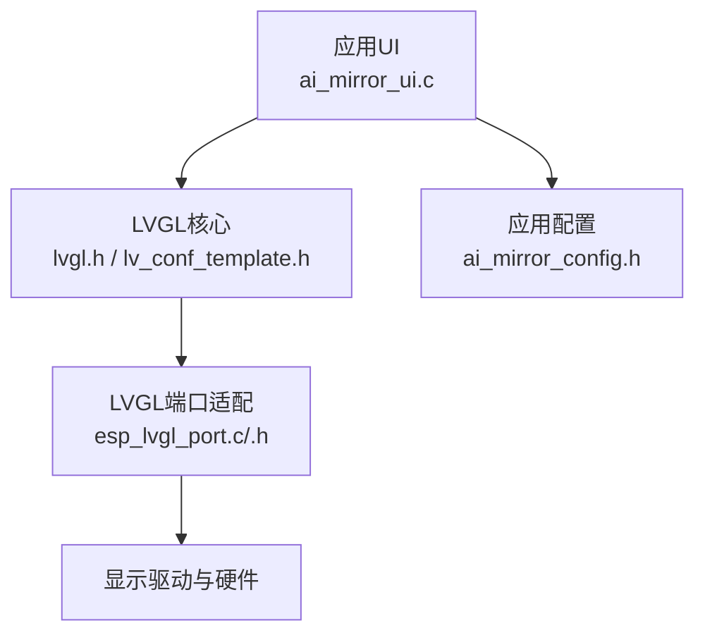
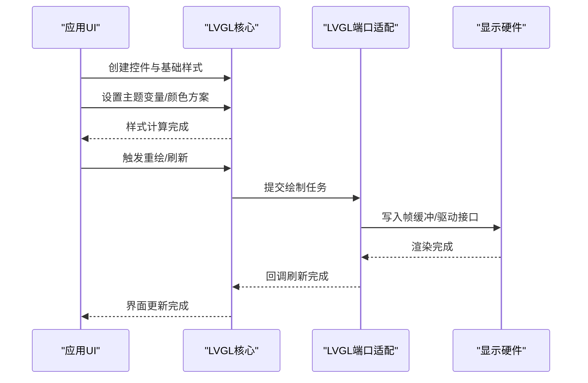
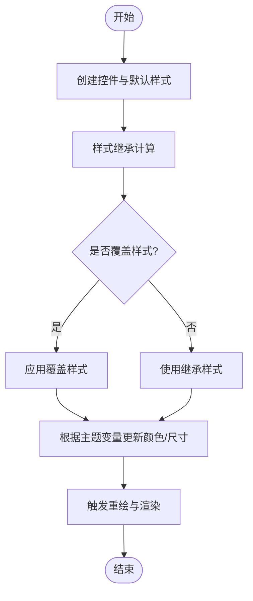
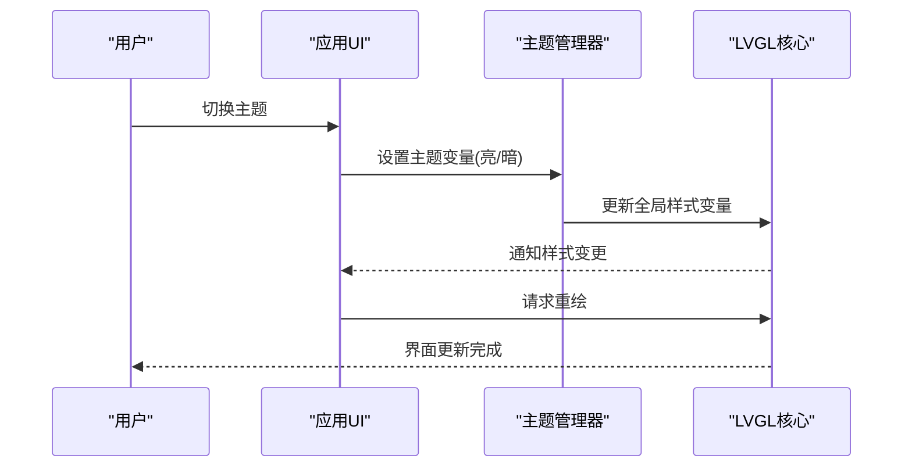
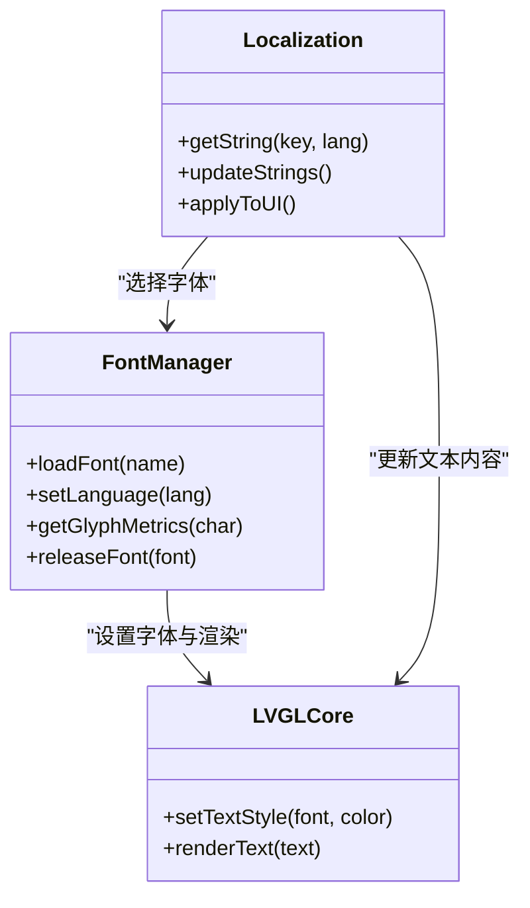
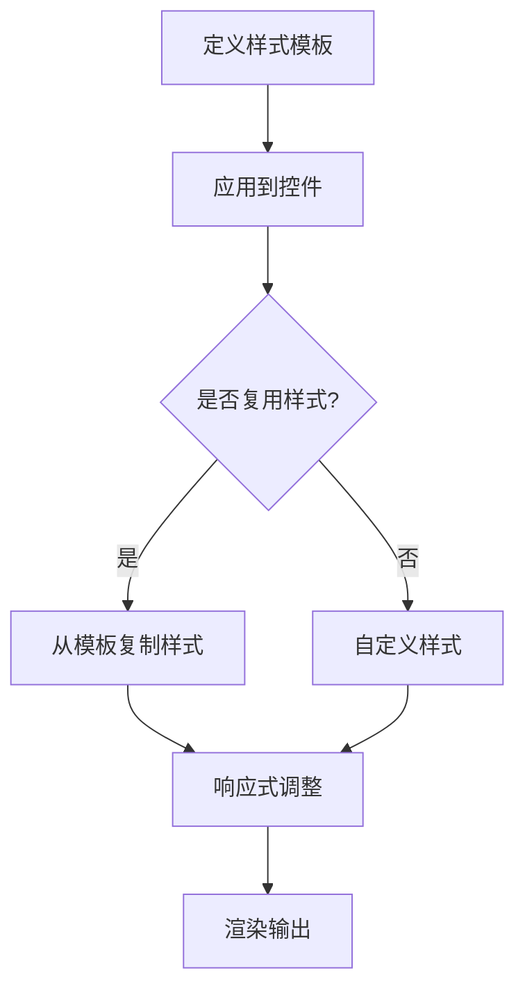
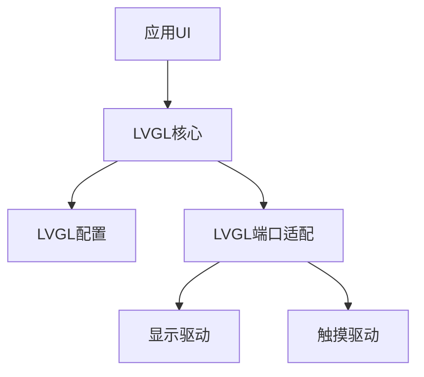

# 主题定制

<cite>
**本文引用的文件**   
- [ai_mirror_ui.c](file://Firmware/esp32_ai_mirror/main/ai_mirror_ui.c)
- [ai_mirror_config.h](file://Firmware/esp32_ai_mirror/main/ai_mirror_config.h)
- [lv_conf_template.h](file://Firmware/esp32_ai_mirror/managed_components/lvgl__lvgl/lv_conf_template.h)
- [lvgl.h](file://Firmware/esp32_ai_mirror/managed_components/lvgl__lvgl/lvgl.h)
- [esp_lvgl_port.c](file://Firmware/esp32_ai_mirror/managed_components/espressif__esp_lvgl_port/esp_lvgl_port.c)
- [esp_lvgl_port.h](file://Firmware/esp32_ai_mirror/managed_components/espressif__esp_lvgl_port/include/esp_lvgl_port.h)
- [README.md](file://Firmware/esp32_ai_mirror/README.md)
</cite>

## 目录
1. [简介](#简介)
2. [项目结构](#项目结构)
3. [核心组件](#核心组件)
4. [架构总览](#架构总览)
5. [详细组件分析](#详细组件分析)
6. [依赖关系分析](#依赖关系分析)
7. [性能考虑](#性能考虑)
8. [故障排查指南](#故障排查指南)
9. [结论](#结论)
10. [附录](#附录)

## 简介
本文件面向ESP32 AI镜像项目中基于LVGL的主题定制系统，系统性阐述样式属性定义、继承机制与动态切换；颜色方案管理、字体配置与控件外观定制方法；主题文件的组织结构、样式复用策略与响应式设计实现；暗色模式支持、多语言界面适配与可访问性优化；以及主题开发工具链、样式调试技巧与性能优化建议。文档力求在工程实践与理论说明之间取得平衡，帮助读者快速上手并深入掌握主题定制能力。

## 项目结构
本项目采用分层组织：应用层UI逻辑位于main目录，LVGL核心库位于managed_components/lvgl__lvgl，ESP-IDF与LVGL的桥接封装位于managed_components/espressif__esp_lvgl_port。主题相关的关键点包括：
- UI初始化与主题入口：应用侧负责创建页面、控件与主题切换逻辑。
- LVGL配置：通过配置文件启用或关闭主题相关特性（如样式缓存、动画、字体子集等）。
- 端口适配：esp_lvgl_port提供显示、触摸与渲染管线对接，确保主题在不同硬件上稳定运行。

图表来源
- [ai_mirror_ui.c](file://Firmware/esp32_ai_mirror/main/ai_mirror_ui.c)
- [lv_conf_template.h](file://Firmware/esp32_ai_mirror/managed_components/lvgl__lvgl/lv_conf_template.h)
- [lvgl.h](file://Firmware/esp32_ai_mirror/managed_components/lvgl__lvgl/lvgl.h)
- [esp_lvgl_port.c](file://Firmware/esp32_ai_mirror/managed_components/espressif__esp_lvgl_port/esp_lvgl_port.c)
- [esp_lvgl_port.h](file://Firmware/esp32_ai_mirror/managed_components/espressif__esp_lvgl_port/include/esp_lvgl_port.h)

章节来源
- [README.md](file://Firmware/esp32_ai_mirror/README.md)

## 核心组件
- 应用UI模块：负责构建界面元素、绑定事件、触发主题切换与状态更新。
- LVGL核心：提供样式系统、布局引擎、绘制管线与资源管理。
- 端口适配层：将LVGL与ESP-IDF显示/触摸子系统对接，处理刷新与输入事件。
- 配置头文件：集中控制LVGL功能开关、内存分配、字体与图片资源加载策略。

章节来源
- [ai_mirror_ui.c](file://Firmware/esp32_ai_mirror/main/ai_mirror_ui.c)
- [lv_conf_template.h](file://Firmware/esp32_ai_mirror/managed_components/lvgl__lvgl/lv_conf_template.h)
- [esp_lvgl_port.c](file://Firmware/esp32_ai_mirror/managed_components/espressif__esp_lvgl_port/esp_lvgl_port.c)
- [esp_lvgl_port.h](file://Firmware/esp32_ai_mirror/managed_components/espressif__esp_lvgl_port/include/esp_lvgl_port.h)

## 架构总览
下图展示主题定制在系统中的数据流与控制流：应用层调用LVGL API设置样式与主题变量，端口层负责将样式结果提交到显示驱动，完成像素级渲染。

图表来源
- [ai_mirror_ui.c](file://Firmware/esp32_ai_mirror/main/ai_mirror_ui.c)
- [lvgl.h](file://Firmware/esp32_ai_mirror/managed_components/lvgl__lvgl/lvgl.h)
- [esp_lvgl_port.c](file://Firmware/esp32_ai_mirror/managed_components/espressif__esp_lvgl_port/esp_lvgl_port.c)

## 详细组件分析

### LVGL样式系统与主题工作原理
- 样式属性定义：LVGL为每个控件提供丰富的样式属性（如背景色、边框、阴影、文本颜色、字体、对齐、间距等），可通过API进行设置与覆盖。
- 继承机制：样式按层级继承，父容器样式会向下传递至子控件，除非子控件显式覆盖。LVGL内部维护样式树与优先级，确保最终渲染效果符合预期。
- 动态切换：通过修改主题变量或控件样式，可在运行时即时切换主题（如亮色/暗色），无需重建界面。

章节来源
- [lv_conf_template.h](file://Firmware/esp32_ai_mirror/managed_components/lvgl__lvgl/lv_conf_template.h)
- [lvgl.h](file://Firmware/esp32_ai_mirror/managed_components/lvgl__lvgl/lvgl.h)

### 颜色方案管理与主题变量
- 颜色方案：通过主题变量统一管理全局颜色（如背景、前景、强调色、禁用态等），便于一键切换亮/暗主题。
- 主题变量作用域：支持全局与应用级主题变量，避免冲突并保持一致性。
- 动态切换流程：应用层监听用户操作或系统事件，更新主题变量后触发界面刷新。

章节来源
- [ai_mirror_ui.c](file://Firmware/esp32_ai_mirror/main/ai_mirror_ui.c)
- [lv_conf_template.h](file://Firmware/esp32_ai_mirror/managed_components/lvgl__lvgl/lv_conf_template.h)

### 字体配置与多语言界面适配
- 字体配置：LVGL支持多种字体格式与子集化，按需加载以减少内存占用。
- 多语言适配：通过本地化字符串表与字体映射，实现不同语言的界面显示。
- 动态字体切换：可根据当前语言或用户偏好选择合适字体，保证可读性与美观性。

章节来源
- [lv_conf_template.h](file://Firmware/esp32_ai_mirror/managed_components/lvgl__lvgl/lv_conf_template.h)
- [lvgl.h](file://Firmware/esp32_ai_mirror/managed_components/lvgl__lvgl/lvgl.h)

### 控件外观定制与样式复用
- 控件外观：通过样式属性组合实现按钮、标签、进度条等控件的自定义外观。
- 样式复用：定义通用样式模板，在不同控件间复用，减少重复代码与维护成本。
- 响应式设计：结合布局与样式，实现不同屏幕尺寸下的自适应显示。

章节来源
- [ai_mirror_ui.c](file://Firmware/esp32_ai_mirror/main/ai_mirror_ui.c)
- [lv_conf_template.h](file://Firmware/esp32_ai_mirror/managed_components/lvgl__lvgl/lv_conf_template.h)

### 暗色模式支持与可访问性优化
- 暗色模式：通过主题变量切换深色背景与浅色文字，提升夜间使用体验。
- 可访问性：提供高对比度主题、大字体选项与键盘导航支持，满足特殊需求用户。
- 自动检测：可结合系统设置自动切换主题，提升用户体验。

章节来源
- [ai_mirror_ui.c](file://Firmware/esp32_ai_mirror/main/ai_mirror_ui.c)
- [lv_conf_template.h](file://Firmware/esp32_ai_mirror/managed_components/lvgl__lvgl/lv_conf_template.h)

### 主题文件组织结构与样式复用策略
- 文件组织：主题相关文件可按功能模块划分，如颜色定义、字体配置、控件样式等。
- 样式复用：通过宏定义或结构体统一管理样式常量，提高代码可读性与可维护性。
- 版本管理：主题文件应纳入版本控制，便于团队协作与回溯。

章节来源
- [ai_mirror_ui.c](file://Firmware/esp32_ai_mirror/main/ai_mirror_ui.c)
- [ai_mirror_config.h](file://Firmware/esp32_ai_mirror/main/ai_mirror_config.h)

## 依赖关系分析
LVGL主题系统依赖于底层配置与端口适配，确保在不同硬件平台上的一致性表现。

图表来源
- [lvgl.h](file://Firmware/esp32_ai_mirror/managed_components/lvgl__lvgl/lvgl.h)
- [lv_conf_template.h](file://Firmware/esp32_ai_mirror/managed_components/lvgl__lvgl/lv_conf_template.h)
- [esp_lvgl_port.c](file://Firmware/esp32_ai_mirror/managed_components/espressif__esp_lvgl_port/esp_lvgl_port.c)

章节来源
- [lvgl.h](file://Firmware/esp32_ai_mirror/managed_components/lvgl__lvgl/lvgl.h)
- [lv_conf_template.h](file://Firmware/esp32_ai_mirror/managed_components/lvgl__lvgl/lv_conf_template.h)
- [esp_lvgl_port.c](file://Firmware/esp32_ai_mirror/managed_components/espressif__esp_lvgl_port/esp_lvgl_port.c)

## 性能考虑
- 样式缓存：启用LVGL样式缓存以减少重复计算开销。
- 字体子集：仅加载所需字符集，降低内存占用。
- 增量刷新：只更新变化区域，避免全屏重绘。
- 动画优化：合理设置动画时长与帧率，平衡流畅性与功耗。

[本节为通用指导，不直接分析具体文件]

## 故障排查指南
- 样式不生效：检查样式优先级与继承关系，确认是否有覆盖冲突。
- 主题切换卡顿：分析重绘范围与动画复杂度，优化刷新策略。
- 字体显示异常：验证字体编码与字符集匹配，检查字体加载路径。
- 内存不足：减少图片资源大小，启用压缩与懒加载。

章节来源
- [ai_mirror_ui.c](file://Firmware/esp32_ai_mirror/main/ai_mirror_ui.c)
- [lv_conf_template.h](file://Firmware/esp32_ai_mirror/managed_components/lvgl__lvgl/lv_conf_template.h)

## 结论
通过系统化的主题定制方案，ESP32 AI镜像项目实现了灵活、高效且可维护的LVGL样式系统。结合颜色方案管理、字体配置与控件外观定制，开发者可以快速构建高质量的界面体验。同时，暗色模式、多语言支持与可访问性优化进一步提升了产品的可用性与包容性。在实际开发中，建议遵循样式复用策略与性能优化原则，确保主题系统的稳定性与扩展性。

[本节为总结性内容，不直接分析具体文件]

## 附录
- 主题开发工具链：建议使用LVGL官方工具进行样式设计与预览，结合IDE插件提高开发效率。
- 样式调试技巧：利用日志输出与可视化调试工具，快速定位样式问题。
- 最佳实践：保持样式命名规范，模块化组织主题文件，定期审查与重构代码。

[本节为补充信息，不直接分析具体文件]