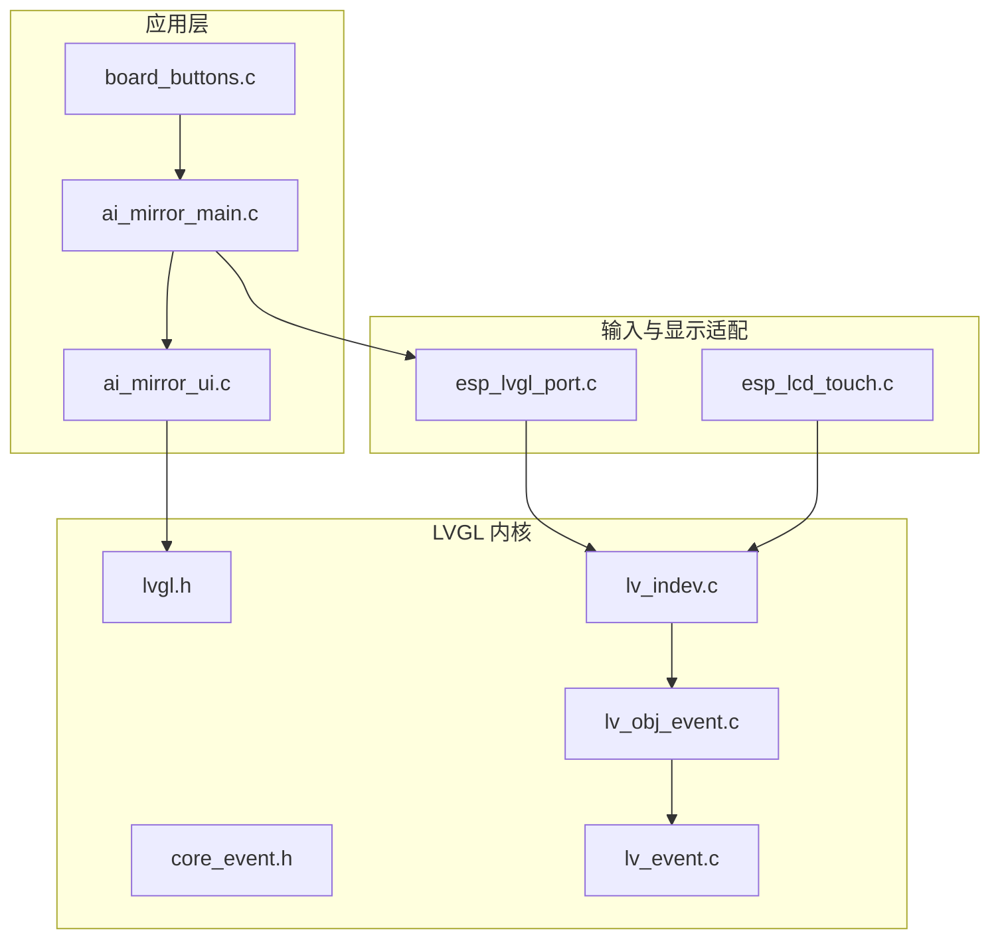
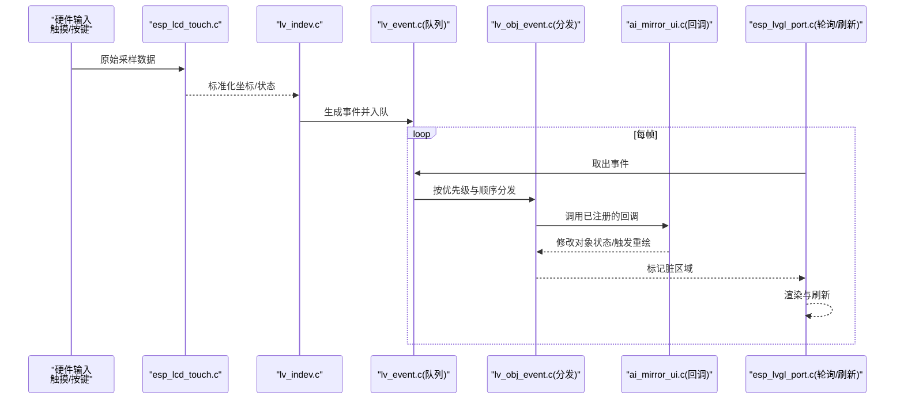
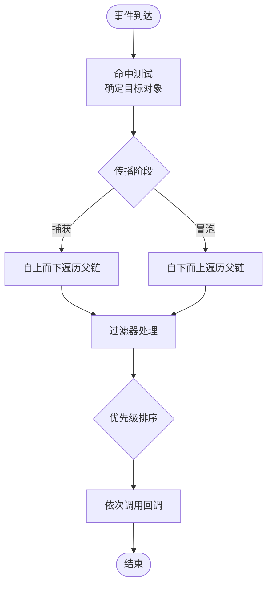
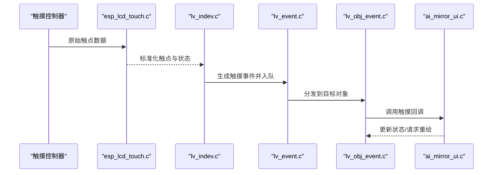
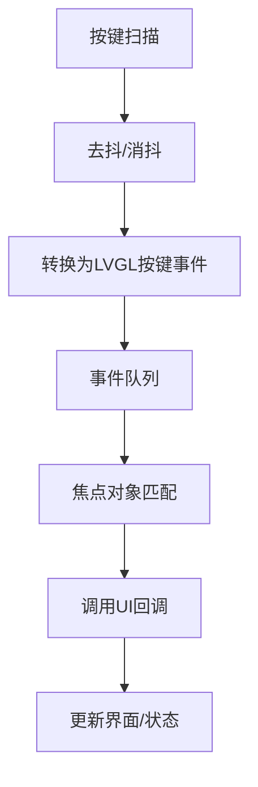
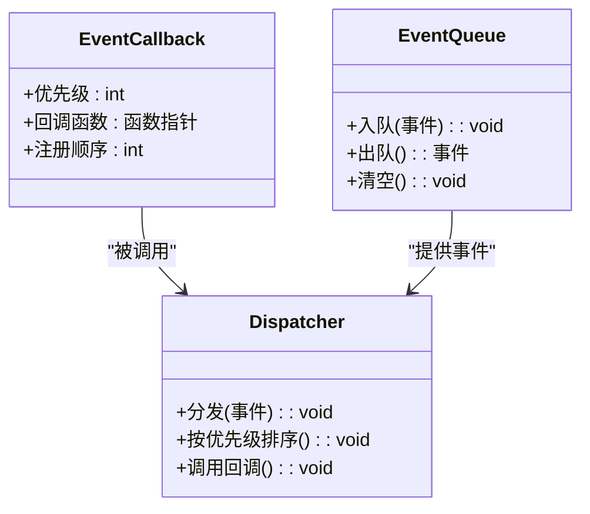
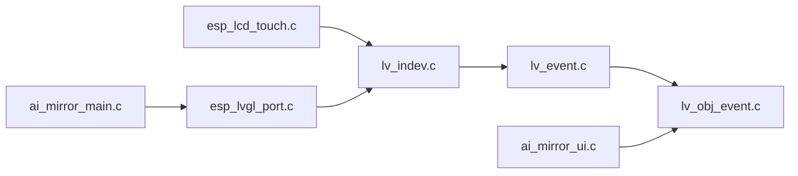

# 事件处理机制

<cite>
**本文引用的文件**   
- [ai_mirror_main.c](file://Firmware/esp32_ai_mirror/main/ai_mirror_main.c)
- [ai_mirror_ui.c](file://Firmware/esp32_ai_mirror/main/ai_mirror_ui.c)
- [board_buttons.c](file://Firmware/esp32_ai_mirror/main/board_buttons.c)
- [board_buttons.h](file://Firmware/esp32_ai_mirror/main/board_buttons.h)
- [lvgl.h](file://Firmware/esp32_ai_mirror/managed_components/lvgl__lvgl/lvgl.h)
- [core_event.h](file://Firmware/esp32_ai_mirror/managed_components/lvgl__lvgl/src/core/event.h)
- [lv_indev.c](file://Firmware/esp32_ai_mirror/managed_components/lvgl__lvgl/src/core/lv_indev.c)
- [lv_obj_event.c](file://Firmware/esp32_ai_mirror/managed_components/lvgl__lvgl/src/core/lv_obj_event.c)
- [lv_event.c](file://Firmware/esp32_ai_mirror/managed_components/lvgl__lvgl/src/misc/lv_event.c)
- [esp_lvgl_port.c](file://Firmware/esp32_ai_mirror/managed_components/espressif__esp_lvgl_port/esp_lvgl_port.c)
- [esp_lvgl_port.h](file://Firmware/esp32_ai_mirror/managed_components/espressif__esp_lvgl_port/include/esp_lvgl_port.h)
- [esp_lcd_touch.c](file://Firmware/esp32_ai_mirror/managed_components/espressif__esp_lcd_touch/esp_lcd_touch.c)
- [esp_lcd_touch.h](file://Firmware/esp32_ai_mirror/managed_components/espressif__esp_lcd_touch/include/esp_lcd_touch.h)
</cite>

## 目录
1. [简介](#简介)
2. [项目结构](#项目结构)
3. [核心组件](#核心组件)
4. [架构总览](#架构总览)
5. [详细组件分析](#详细组件分析)
6. [依赖关系分析](#依赖关系分析)
7. [性能考虑](#性能考虑)
8. [故障排查指南](#故障排查指南)
9. [结论](#结论)
10. [附录](#附录)

## 简介
本文件围绕 LVGL 事件系统在本工程中的落地与扩展，系统性阐述事件类型、传播机制、回调注册、触摸与按键交互流程、优先级管理、异步事件与队列机制，以及自定义事件、过滤器与性能优化策略。文档面向不同技术背景的读者，既提供高层概览，也给出代码级分析与图示。

## 项目结构
本项目基于 ESP-IDF 构建，UI 层采用 LVGL，输入设备通过 esp-lcd-touch 抽象，LVGL 端口适配由 esp_lvgl_port 提供。应用主循环在 main 中初始化并驱动 UI 刷新与事件处理；UI 逻辑集中在 ai_mirror_ui.c；板载按键与 LED 等硬件相关逻辑位于 board_*.c/h。

图表来源 
- [ai_mirror_main.c](file://Firmware/esp32_ai_mirror/main/ai_mirror_main.c)
- [ai_mirror_ui.c](file://Firmware/esp32_ai_mirror/main/ai_mirror_ui.c)
- [board_buttons.c](file://Firmware/esp32_ai_mirror/main/board_buttons.c)
- [lvgl.h](file://Firmware/esp32_ai_mirror/managed_components/lvgl__lvgl/lvgl.h)
- [core_event.h](file://Firmware/esp32_ai_mirror/managed_components/lvgl__lvgl/src/core/event.h)
- [lv_indev.c](file://Firmware/esp32_ai_mirror/managed_components/lvgl__lvgl/src/core/lv_indev.c)
- [lv_obj_event.c](file://Firmware/esp32_ai_mirror/managed_components/lvgl__lvgl/src/core/lv_obj_event.c)
- [lv_event.c](file://Firmware/esp32_ai_mirror/managed_components/lvgl__lvgl/src/misc/lv_event.c)
- [esp_lvgl_port.c](file://Firmware/esp32_ai_mirror/managed_components/espressif__esp_lvgl_port/esp_lvgl_port.c)
- [esp_lcd_touch.c](file://Firmware/esp32_ai_mirror/managed_components/espressif__esp_lcd_touch/esp_lcd_touch.c)

章节来源
- [ai_mirror_main.c](file://Firmware/esp32_ai_mirror/main/ai_mirror_main.c)
- [ai_mirror_ui.c](file://Firmware/esp32_ai_mirror/main/ai_mirror_ui.c)
- [board_buttons.c](file://Firmware/esp32_ai_mirror/main/board_buttons.c)
- [esp_lvgl_port.c](file://Firmware/esp32_ai_mirror/managed_components/espressif__esp_lvgl_port/esp_lvgl_port.c)
- [esp_lcd_touch.c](file://Firmware/esp32_ai_mirror/managed_components/espressif__esp_lcd_touch/esp_lcd_touch.c)

## 核心组件
- 事件定义与数据结构：LVGL 在 core_event.h 中定义事件类型、事件对象与回调签名，统一封装坐标、键值、时间戳等上下文。
- 输入设备驱动：lv_indev.c 负责将底层输入（触摸、按键）转换为 LVGL 事件，并进行去抖、过滤与分发。
- 对象事件分发：lv_obj_event.c 实现事件在对象树中的冒泡/捕获、目标判定与回调执行。
- 事件系统与队列：lv_event.c 提供事件注册、优先级、过滤器与任务内调度。
- 平台适配：esp_lvgl_port.c 将 LVGL 的 tick、输入读取与显示刷新接入 ESP-IDF 任务与定时器；esp_lcd_touch.c 提供触摸采样接口。
- 应用集成：ai_mirror_ui.c 注册 UI 控件的事件回调；board_buttons.c 将按键扫描结果上报为 LVGL 输入事件。

章节来源
- [core_event.h](file://Firmware/esp32_ai_mirror/managed_components/lvgl__lvgl/src/core/event.h)
- [lv_indev.c](file://Firmware/esp32_ai_mirror/managed_components/lvgl__lvgl/src/core/lv_indev.c)
- [lv_obj_event.c](file://Firmware/esp32_ai_mirror/managed_components/lvgl__lvgl/src/core/lv_obj_event.c)
- [lv_event.c](file://Firmware/esp32_ai_mirror/managed_components/lvgl__lvgl/src/misc/lv_event.c)
- [esp_lvgl_port.c](file://Firmware/esp32_ai_mirror/managed_components/espressif__esp_lvgl_port/esp_lvgl_port.c)
- [esp_lcd_touch.c](file://Firmware/esp32_ai_mirror/managed_components/espressif__esp_lcd_touch/esp_lcd_touch.c)

## 架构总览
下图展示从输入到 UI 响应的完整链路：输入设备采集 -> 输入设备驱动转换 -> LVGL 事件队列 -> 对象树分发 -> 用户回调执行 -> 界面更新。

图表来源 
- [esp_lcd_touch.c](file://Firmware/esp32_ai_mirror/managed_components/espressif__esp_lcd_touch/esp_lcd_touch.c)
- [lv_indev.c](file://Firmware/esp32_ai_mirror/managed_components/lvgl__lvgl/src/core/lv_indev.c)
- [lv_event.c](file://Firmware/esp32_ai_mirror/managed_components/lvgl__lvgl/src/misc/lv_event.c)
- [lv_obj_event.c](file://Firmware/esp32_ai_mirror/managed_components/lvgl__lvgl/src/core/lv_obj_event.c)
- [ai_mirror_ui.c](file://Firmware/esp32_ai_mirror/main/ai_mirror_ui.c)
- [esp_lvgl_port.c](file://Firmware/esp32_ai_mirror/managed_components/espressif__esp_lvgl_port/esp_lvgl_port.c)

## 详细组件分析

### 事件类型与数据结构
- 事件类型：包括触摸按下/释放/移动、按键按下/释放、焦点变化、动画完成、自定义事件等。
- 事件对象：包含事件类型、目标对象指针、参数（如坐标、键值）、时间戳与标志位。
- 回调签名：统一的回调函数原型，便于注册到任意对象或全局处理器。

章节来源
- [core_event.h](file://Firmware/esp32_ai_mirror/managed_components/lvgl__lvgl/src/core/event.h)
- [lv_event.c](file://Firmware/esp32_ai_mirror/managed_components/lvgl__lvgl/src/misc/lv_event.c)

### 事件传播机制
- 传播方向：默认自下而上冒泡，也可配置捕获阶段自上而下。
- 目标判定：根据坐标命中测试确定最深层对象为目标。
- 过滤与拦截：可在分发前通过过滤器对事件进行改写、丢弃或转发。
- 优先级：同层级内按注册顺序与优先级决定回调执行次序。

图表来源 
- [lv_obj_event.c](file://Firmware/esp32_ai_mirror/managed_components/lvgl__lvgl/src/core/lv_obj_event.c)
- [lv_event.c](file://Firmware/esp32_ai_mirror/managed_components/lvgl__lvgl/src/misc/lv_event.c)

章节来源
- [lv_obj_event.c](file://Firmware/esp32_ai_mirror/managed_components/lvgl__lvgl/src/core/lv_obj_event.c)
- [lv_event.c](file://Firmware/esp32_ai_mirror/managed_components/lvgl__lvgl/src/misc/lv_event.c)

### 触摸事件处理
- 采集：esp_lcd_touch.c 周期性读取触摸控制器数据，输出标准化点集与状态。
- 转换：lv_indev.c 将点集转换为 LVGL 触摸事件（按下、移动、释放），并进行去抖与多点触控处理。
- 分发：进入事件队列后，由 lv_obj_event.c 命中测试与冒泡分发至对应控件。
- 应用：ai_mirror_ui.c 在控件上注册触摸回调，实现点击、滑动、长按等交互。

图表来源 
- [esp_lcd_touch.c](file://Firmware/esp32_ai_mirror/managed_components/espressif__esp_lcd_touch/esp_lcd_touch.c)
- [lv_indev.c](file://Firmware/esp32_ai_mirror/managed_components/lvgl__lvgl/src/core/lv_indev.c)
- [lv_event.c](file://Firmware/esp32_ai_mirror/managed_components/lvgl__lvgl/src/misc/lv_event.c)
- [lv_obj_event.c](file://Firmware/esp32_ai_mirror/managed_components/lvgl__lvgl/src/core/lv_obj_event.c)
- [ai_mirror_ui.c](file://Firmware/esp32_ai_mirror/main/ai_mirror_ui.c)

章节来源
- [esp_lcd_touch.c](file://Firmware/esp32_ai_mirror/managed_components/espressif__esp_lcd_touch/esp_lcd_touch.c)
- [lv_indev.c](file://Firmware/esp32_ai_mirror/managed_components/lvgl__lvgl/src/core/lv_indev.c)
- [ai_mirror_ui.c](file://Firmware/esp32_ai_mirror/main/ai_mirror_ui.c)

### 按键响应与用户交互
- 按键扫描：board_buttons.c 扫描物理按键，产生按下/释放事件。
- 上报：将按键事件转换为 LVGL 键盘事件，经 lv_indev.c 入队。
- 处理：lv_obj_event.c 将事件分发给具有焦点的对象，ui 层可据此实现快捷键、导航等。

图表来源 
- [board_buttons.c](file://Firmware/esp32_ai_mirror/main/board_buttons.c)
- [lv_indev.c](file://Firmware/esp32_ai_mirror/managed_components/lvgl__lvgl/src/core/lv_indev.c)
- [lv_obj_event.c](file://Firmware/esp32_ai_mirror/managed_components/lvgl__lvgl/src/core/lv_obj_event.c)

章节来源
- [board_buttons.c](file://Firmware/esp32_ai_mirror/main/board_buttons.c)
- [board_buttons.h](file://Firmware/esp32_ai_mirror/main/board_buttons.h)
- [lv_indev.c](file://Firmware/esp32_ai_mirror/managed_components/lvgl__lvgl/src/core/lv_indev.c)

### 事件优先级管理与异步处理
- 优先级：同一对象上的多个回调可通过优先级参数控制执行顺序，确保关键逻辑优先执行。
- 异步：长耗时操作应在回调中提交到后台任务或队列，避免阻塞事件循环；LVGL 支持在安全时机触发 UI 更新。
- 队列：事件在 lv_event.c 中以队列形式缓冲，保证高吞吐与稳定性。

图表来源 
- [lv_event.c](file://Firmware/esp32_ai_mirror/managed_components/lvgl__lvgl/src/misc/lv_event.c)
- [lv_obj_event.c](file://Firmware/esp32_ai_mirror/managed_components/lvgl__lvgl/src/core/lv_obj_event.c)

章节来源
- [lv_event.c](file://Firmware/esp32_ai_mirror/managed_components/lvgl__lvgl/src/misc/lv_event.c)
- [lv_obj_event.c](file://Firmware/esp32_ai_mirror/managed_components/lvgl__lvgl/src/core/lv_obj_event.c)

### 自定义事件类型与过滤器
- 自定义事件：通过扩展事件类型与参数结构体，实现业务特定事件（如语音识别完成、网络状态变更）。
- 过滤器：在事件分发前对事件进行改写、合并或丢弃，常用于节流、批处理与权限校验。
- 最佳实践：自定义事件应明确语义与生命周期，避免与内置事件冲突；过滤器应保持幂等与低开销。

章节来源
- [core_event.h](file://Firmware/esp32_ai_mirror/managed_components/lvgl__lvgl/src/core/event.h)
- [lv_event.c](file://Firmware/esp32_ai_mirror/managed_components/lvgl__lvgl/src/misc/lv_event.c)

### 平台适配与主循环
- esp_lvgl_port.c 提供 LVGL 的 tick、输入读取与显示刷新接口，通常以任务或定时器方式周期调用。
- ai_mirror_main.c 初始化 LVGL、输入与显示，并在主循环中驱动 UI 刷新与事件处理。
- 建议将耗时任务与 UI 更新解耦，使用队列或信号量协调。

章节来源
- [esp_lvgl_port.c](file://Firmware/esp32_ai_mirror/managed_components/espressif__esp_lvgl_port/esp_lvgl_port.c)
- [esp_lvgl_port.h](file://Firmware/esp32_ai_mirror/managed_components/espressif__esp_lvgl_port/include/esp_lvgl_port.h)
- [ai_mirror_main.c](file://Firmware/esp32_ai_mirror/main/ai_mirror_main.c)

## 依赖关系分析
- 输入子系统：esp_lcd_touch.c -> lv_indev.c -> lv_event.c -> lv_obj_event.c
- UI 层：ai_mirror_ui.c 依赖 LVGL 事件 API 与对象模型
- 平台适配：esp_lvgl_port.c 桥接 ESP-IDF 任务/定时与 LVGL 循环
- 应用入口：ai_mirror_main.c 初始化并驱动整体流程

图表来源 
- [esp_lcd_touch.c](file://Firmware/esp32_ai_mirror/managed_components/espressif__esp_lcd_touch/esp_lcd_touch.c)
- [lv_indev.c](file://Firmware/esp32_ai_mirror/managed_components/lvgl__lvgl/src/core/lv_indev.c)
- [lv_event.c](file://Firmware/esp32_ai_mirror/managed_components/lvgl__lvgl/src/misc/lv_event.c)
- [lv_obj_event.c](file://Firmware/esp32_ai_mirror/managed_components/lvgl__lvgl/src/core/lv_obj_event.c)
- [ai_mirror_ui.c](file://Firmware/esp32_ai_mirror/main/ai_mirror_ui.c)
- [esp_lvgl_port.c](file://Firmware/esp32_ai_mirror/managed_components/espressif__esp_lvgl_port/esp_lvgl_port.c)
- [ai_mirror_main.c](file://Firmware/esp32_ai_mirror/main/ai_mirror_main.c)

章节来源
- [lv_indev.c](file://Firmware/esp32_ai_mirror/managed_components/lvgl__lvgl/src/core/lv_indev.c)
- [lv_event.c](file://Firmware/esp32_ai_mirror/managed_components/lvgl__lvgl/src/misc/lv_event.c)
- [lv_obj_event.c](file://Firmware/esp32_ai_mirror/managed_components/lvgl__lvgl/src/core/lv_obj_event.c)
- [esp_lvgl_port.c](file://Firmware/esp32_ai_mirror/managed_components/espressif__esp_lvgl_port/esp_lvgl_port.c)
- [ai_mirror_main.c](file://Firmware/esp32_ai_mirror/main/ai_mirror_main.c)

## 性能考虑
- 事件节流与合并：在触摸高频移动时合并相邻事件，减少回调频率。
- 过滤器优化：避免在过滤器中进行复杂计算，必要时批量处理。
- 异步化：将网络、音频、AI 推理等耗时操作放入后台任务，仅回传轻量结果到 UI。
- 渲染优化：仅在必要区域标记脏区，减少全屏刷新；合理设置 LVGL 刷新模式与双缓冲。
- 输入去抖：在 lv_indev.c 层启用去抖与阈值过滤，降低抖动导致的误触。

[本节为通用指导，不直接分析具体文件]

## 故障排查指南
- 无事件响应：检查输入设备初始化与 esp_lvgl_port 的 tick/输入读取是否正常运行；确认对象是否可见且可交互。
- 回调未触发：核对事件类型与回调注册是否正确；检查过滤器是否丢弃了事件。
- 卡顿与掉帧：定位耗时回调，将其异步化；减少重绘范围；优化 LVGL 刷新策略。
- 按键误触发：调整去抖参数与阈值；检查按键扫描频率与中断优先级。
- 内存不足：减少事件队列长度与对象数量；避免在回调中分配大对象。

章节来源
- [esp_lvgl_port.c](file://Firmware/esp32_ai_mirror/managed_components/espressif__esp_lvgl_port/esp_lvgl_port.c)
- [lv_indev.c](file://Firmware/esp32_ai_mirror/managed_components/lvgl__lvgl/src/core/lv_indev.c)
- [lv_event.c](file://Firmware/esp32_ai_mirror/managed_components/lvgl__lvgl/src/misc/lv_event.c)
- [lv_obj_event.c](file://Firmware/esp32_ai_mirror/managed_components/lvgl__lvgl/src/core/lv_obj_event.c)

## 结论
本项目的 LVGL 事件系统通过清晰的层次划分与平台适配，实现了从输入采集到 UI 响应的稳定链路。借助事件队列、优先级与过滤器，能够高效处理复杂交互场景。结合异步化与性能优化策略，可在资源受限的嵌入式平台上获得流畅的用户体验。

[本节为总结性内容，不直接分析具体文件]

## 附录
- 常见事件类型参考：触摸按下/移动/释放、按键按下/释放、焦点变化、动画完成、自定义事件。
- 推荐实践：
  - 在回调中只做轻量逻辑，耗时任务走异步。
  - 使用过滤器做节流与批处理。
  - 合理设置事件优先级，确保关键路径优先。
  - 保持事件语义清晰，避免与内置事件冲突。
  - 针对触摸与按键启用去抖与阈值过滤。

[本节为补充信息，不直接分析具体文件]