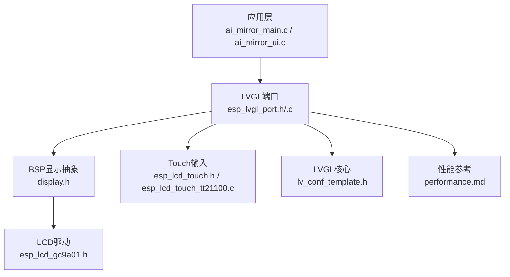
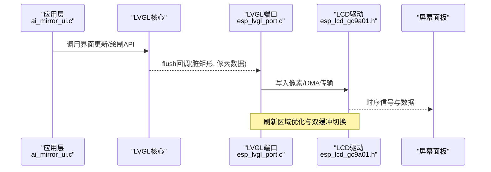
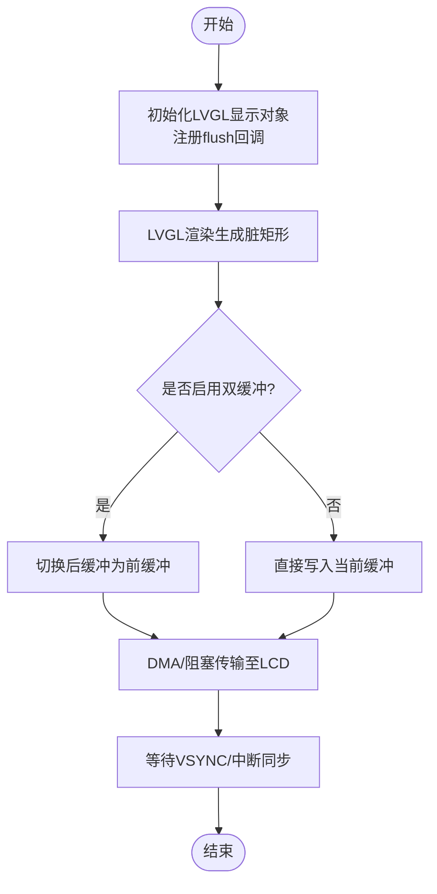
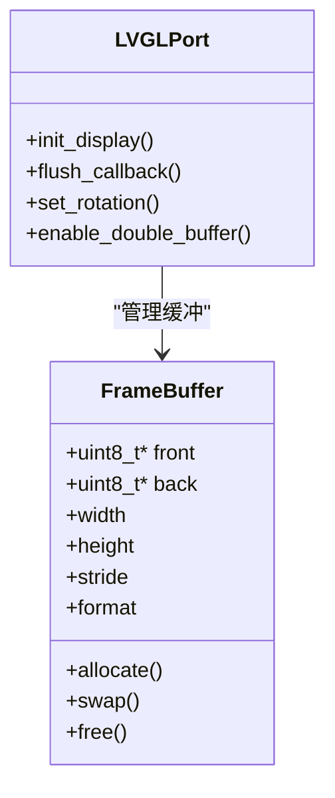
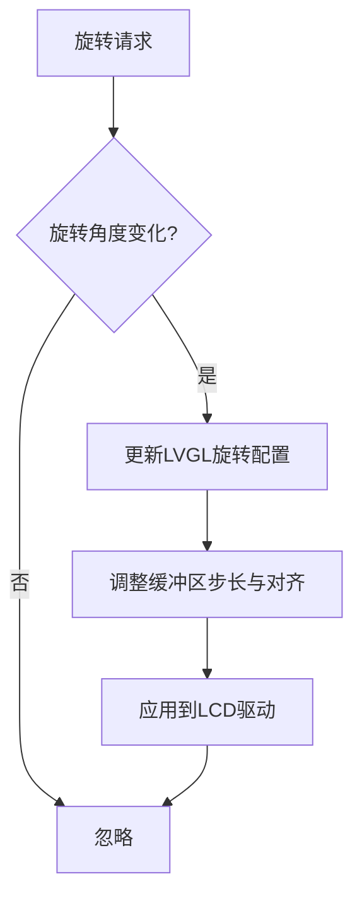
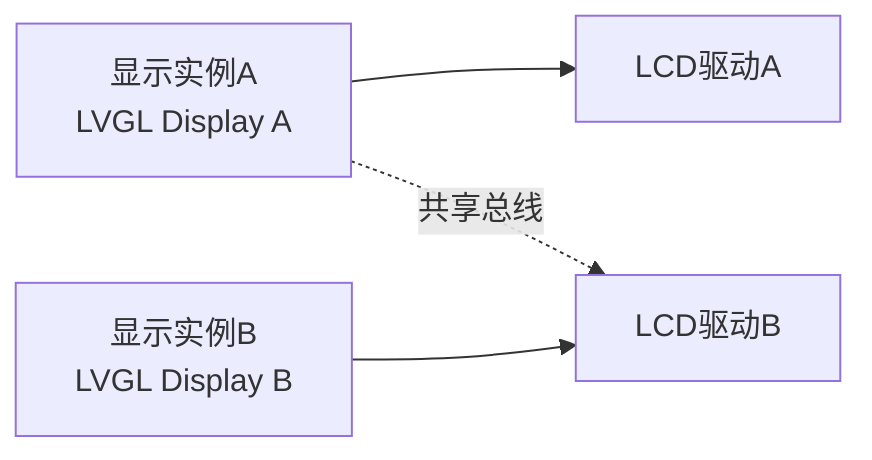
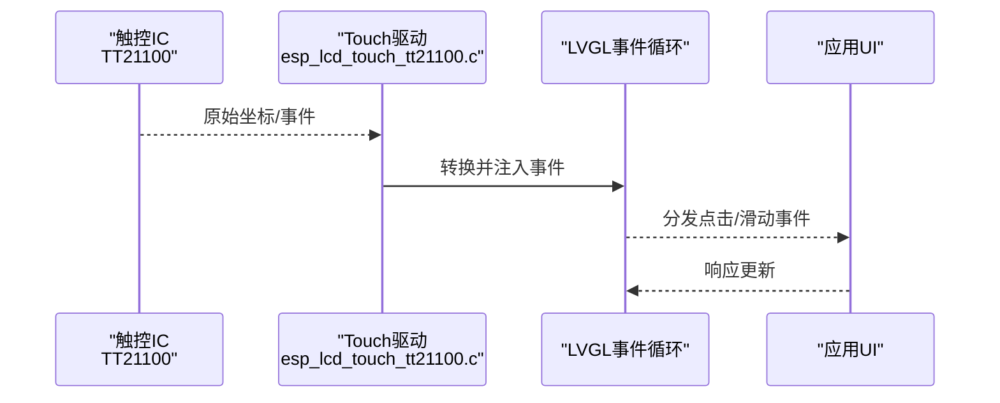
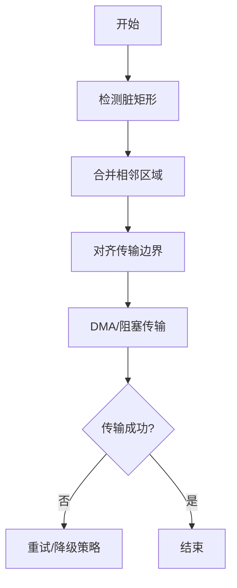
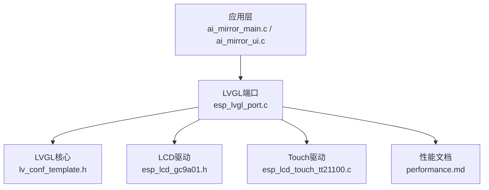

# 显示管理

<cite>
**本文档引用的文件**   
- [ai_mirror_main.c](file://Firmware/esp32_ai_mirror/main/ai_mirror_main.c)
- [ai_mirror_ui.c](file://Firmware/esp32_ai_mirror/main/ai_mirror_ui.c)
- [esp_lvgl_port.h](file://Firmware/esp32_ai_mirror/managed_components/espressif__esp_lvgl_port/include/esp_lvgl_port.h)
- [esp_lvgl_port.c](file://Firmware/esp32_ai_mirror/managed_components/espressif__esp_lvgl_port/esp_lvgl_port.c)
- [display.h](file://Firmware/esp32_ai_mirror/managed_components/espressif__esp-box/include/bsp/display.h)
- [esp_lcd_gc9a01.h](file://Firmware/esp32_ai_mirror/managed_components/espressif__esp_lcd_gc9a01/include/esp_lcd_gc9a01.h)
- [esp_lcd_touch.h](file://Firmware/esp32_ai_mirror/managed_components/espressif__esp_lcd_touch/include/esp_lcd_touch.h)
- [esp_lcd_touch_tt21100.c](file://Firmware/esp32_ai_mirror/managed_components/espressif__esp_lcd_touch_tt21100/esp_lcd_touch_tt21100.c)
- [lv_conf_template.h](file://Firmware/esp32_ai_mirror/managed_components/lvgl__lvgl/lv_conf_template.h)
- [performance.md](file://Firmware/esp32_ai_mirror/managed_components/espressif__esp_lvgl_port/docs/performance.md)
</cite>

## 目录
1. [简介](#简介)
2. [项目结构](#项目结构)
3. [核心组件](#核心组件)
4. [架构总览](#架构总览)
5. [详细组件分析](#详细组件分析)
6. [依赖关系分析](#依赖关系分析)
7. [性能考量](#性能考量)
8. [故障排查指南](#故障排查指南)
9. [结论](#结论)
10. [附录](#附录)

## 简介
本文件面向ESP32 AI镜像项目的显示子系统，系统性阐述屏幕刷新机制、帧缓冲管理与显示同步策略；详细说明LVGL显示驱动的集成方式、刷新区域优化与双缓冲技术实现；解释屏幕旋转处理、分辨率适配与多显示器支持；并给出显示性能监控、内存使用优化与功耗管理策略。同时提供显示异常处理、重绘优化与实时渲染的最佳实践，帮助开发者在资源受限的嵌入式平台上获得稳定、流畅且低功耗的显示体验。

## 项目结构
本项目采用分层设计：应用层（main）负责UI初始化与业务逻辑；中间层通过ESP LVGL Port桥接LVGL与底层LCD驱动；底层由ESP-IDF LCD/Touch驱动与具体屏驱（如GC9A01）组成。关键路径如下：
- 应用入口与UI初始化：ai_mirror_main.c、ai_mirror_ui.c
- LVGL端口封装：esp_lvgl_port.h/.c
- BSP显示抽象：display.h
- 具体LCD驱动：esp_lcd_gc9a01.h
- Touch输入：esp_lcd_touch.h、esp_lcd_touch_tt21100.c
- LVGL配置：lv_conf_template.h
- 性能文档：performance.md

图表来源 
- [ai_mirror_main.c](file://Firmware/esp32_ai_mirror/main/ai_mirror_main.c)
- [ai_mirror_ui.c](file://Firmware/esp32_ai_mirror/main/ai_mirror_ui.c)
- [esp_lvgl_port.h](file://Firmware/esp32_ai_mirror/managed_components/espressif__esp_lvgl_port/include/esp_lvgl_port.h)
- [esp_lvgl_port.c](file://Firmware/esp32_ai_mirror/managed_components/espressif__esp_lvgl_port/esp_lvgl_port.c)
- [display.h](file://Firmware/esp32_ai_mirror/managed_components/espressif__esp-box/include/bsp/display.h)
- [esp_lcd_gc9a01.h](file://Firmware/esp32_ai_mirror/managed_components/espressif__esp_lcd_gc9a01/include/esp_lcd_gc9a01.h)
- [esp_lcd_touch.h](file://Firmware/esp32_ai_mirror/managed_components/espressif__esp_lcd_touch/include/esp_lcd_touch.h)
- [esp_lcd_touch_tt21100.c](file://Firmware/esp32_ai_mirror/managed_components/espressif__esp_lcd_touch_tt21100/esp_lcd_touch_tt21100.c)
- [lv_conf_template.h](file://Firmware/esp32_ai_mirror/managed_components/lvgl__lvgl/lv_conf_template.h)
- [performance.md](file://Firmware/esp32_ai_mirror/managed_components/espressif__esp_lvgl_port/docs/performance.md)

章节来源
- [ai_mirror_main.c](file://Firmware/esp32_ai_mirror/main/ai_mirror_main.c)
- [ai_mirror_ui.c](file://Firmware/esp32_ai_mirror/main/ai_mirror_ui.c)
- [esp_lvgl_port.h](file://Firmware/esp32_ai_mirror/managed_components/espressif__esp_lvgl_port/include/esp_lvgl_port.h)
- [esp_lvgl_port.c](file://Firmware/esp32_ai_mirror/managed_components/espressif__esp_lvgl_port/esp_lvgl_port.c)
- [display.h](file://Firmware/esp32_ai_mirror/managed_components/espressif__esp-box/include/bsp/display.h)
- [esp_lcd_gc9a01.h](file://Firmware/esp32_ai_mirror/managed_components/espressif__esp_lcd_gc9a01/include/esp_lcd_gc9a01.h)
- [esp_lcd_touch.h](file://Firmware/esp32_ai_mirror/managed_components/espressif__esp_lcd_touch/include/esp_lcd_touch.h)
- [esp_lcd_touch_tt21100.c](file://Firmware/esp32_ai_mirror/managed_components/espressif__esp_lcd_touch_tt21100/esp_lcd_touch_tt21100.c)
- [lv_conf_template.h](file://Firmware/esp32_ai_mirror/managed_components/lvgl__lvgl/lv_conf_template.h)
- [performance.md](file://Firmware/esp32_ai_mirror/managed_components/espressif__esp_lvgl_port/docs/performance.md)

## 核心组件
- LVGL显示驱动集成：通过esp_lvgl_port将LVGL的flush回调与底层LCD写像素接口对接，完成帧缓冲到显存的传输。
- 刷新区域优化：基于LVGL脏矩形与增量更新，仅对变更区域进行绘制与传输，降低总线带宽与CPU占用。
- 双缓冲技术：启用双缓冲或半缓冲模式，避免撕裂与闪烁，提升动画与滚动流畅度。
- 屏幕旋转与分辨率适配：在LVGL与LCD驱动层协同设置旋转矩阵与分辨率参数，保证坐标映射正确。
- 多显示器支持：通过多个LVGL显示实例与独立flush回调，分别管理不同物理屏。
- 触摸输入：通过esp_lcd_touch与具体触控IC驱动（如TT21100）采集坐标，注入LVGL事件循环。
- 性能监控：利用LVGL内置统计与esp_lvgl_port性能文档指标，评估FPS、刷新率与内存占用。

章节来源
- [esp_lvgl_port.h](file://Firmware/esp32_ai_mirror/managed_components/espressif__esp_lvgl_port/include/esp_lvgl_port.h)
- [esp_lvgl_port.c](file://Firmware/esp32_ai_mirror/managed_components/espressif__esp_lvgl_port/esp_lvgl_port.c)
- [lv_conf_template.h](file://Firmware/esp32_ai_mirror/managed_components/lvgl__lvgl/lv_conf_template.h)
- [esp_lcd_touch.h](file://Firmware/esp32_ai_mirror/managed_components/espressif__esp_lcd_touch/include/esp_lcd_touch.h)
- [esp_lcd_touch_tt21100.c](file://Firmware/esp32_ai_mirror/managed_components/espressif__esp_lcd_touch_tt21100/esp_lcd_touch_tt21100.c)
- [performance.md](file://Firmware/esp32_ai_mirror/managed_components/espressif__esp_lvgl_port/docs/performance.md)

## 架构总览
下图展示从应用到硬件的完整显示链路，包括LVGL渲染、端口封装、LCD驱动与屏幕设备。

图表来源 
- [ai_mirror_ui.c](file://Firmware/esp32_ai_mirror/main/ai_mirror_ui.c)
- [esp_lvgl_port.c](file://Firmware/esp32_ai_mirror/managed_components/espressif__esp_lvgl_port/esp_lvgl_port.c)
- [esp_lcd_gc9a01.h](file://Firmware/esp32_ai_mirror/managed_components/espressif__esp_lcd_gc9a01/include/esp_lcd_gc9a01.h)

章节来源
- [ai_mirror_ui.c](file://Firmware/esp32_ai_mirror/main/ai_mirror_ui.c)
- [esp_lvgl_port.c](file://Firmware/esp32_ai_mirror/managed_components/espressif__esp_lvgl_port/esp_lvgl_port.c)
- [esp_lcd_gc9a01.h](file://Firmware/esp32_ai_mirror/managed_components/espressif__esp_lcd_gc9a01/include/esp_lcd_gc9a01.h)

## 详细组件分析

### LVGL显示驱动集成与刷新流程
- 初始化阶段：创建LVGL显示对象，注册flush回调，配置分辨率、颜色格式与缓冲区大小。
- 渲染阶段：LVGL计算脏矩形，调用flush回调传递像素数据；端口层根据配置选择DMA或阻塞传输。
- 同步策略：依据硬件VSYNC或LCD控制器中断进行帧同步，避免撕裂；必要时启用双缓冲。
- 刷新区域优化：仅传输脏矩形区域，减少总线负载；结合裁剪与对齐策略提升吞吐。

图表来源 
- [esp_lvgl_port.c](file://Firmware/esp32_ai_mirror/managed_components/espressif__esp_lvgl_port/esp_lvgl_port.c)
- [lv_conf_template.h](file://Firmware/esp32_ai_mirror/managed_components/lvgl__lvgl/lv_conf_template.h)

章节来源
- [esp_lvgl_port.c](file://Firmware/esp32_ai_mirror/managed_components/espressif__esp_lvgl_port/esp_lvgl_port.c)
- [lv_conf_template.h](file://Firmware/esp32_ai_mirror/managed_components/lvgl__lvgl/lv_conf_template.h)

### 帧缓冲管理与双缓冲技术
- 单缓冲：节省内存，但可能出现撕裂；适用于静态或少量动态内容。
- 双缓冲：前后缓冲交替，避免撕裂；需要双倍显存，适合动画与高频更新。
- 半缓冲：行级缓冲，折中方案；需驱动支持行扫描输出。
- 内存布局：按行对齐与DMA友好格式组织，提高传输效率。
- 生命周期：分配、释放与复用策略需与任务调度配合，避免碎片化。

图表来源 
- [esp_lvgl_port.h](file://Firmware/esp32_ai_mirror/managed_components/espressif__esp_lvgl_port/include/esp_lvgl_port.h)
- [esp_lvgl_port.c](file://Firmware/esp32_ai_mirror/managed_components/espressif__esp_lvgl_port/esp_lvgl_port.c)

章节来源
- [esp_lvgl_port.h](file://Firmware/esp32_ai_mirror/managed_components/espressif__esp_lvgl_port/include/esp_lvgl_port.h)
- [esp_lvgl_port.c](file://Firmware/esp32_ai_mirror/managed_components/espressif__esp_lvgl_port/esp_lvgl_port.c)

### 屏幕旋转与分辨率适配
- 旋转处理：在LVGL层设置旋转角度，坐标变换由LVGL内部矩阵完成；LCD驱动层可配合硬件旋转以减少软件开销。
- 分辨率适配：根据实际面板分辨率调整LVGL配置与缓冲区尺寸；确保宽高比与像素格式一致。
- 多方向支持：横竖屏切换时重新计算脏矩形与传输步长，避免越界与错位。

图表来源 
- [lv_conf_template.h](file://Firmware/esp32_ai_mirror/managed_components/lvgl__lvgl/lv_conf_template.h)
- [esp_lcd_gc9a01.h](file://Firmware/esp32_ai_mirror/managed_components/espressif__esp_lcd_gc9a01/include/esp_lcd_gc9a01.h)

章节来源
- [lv_conf_template.h](file://Firmware/esp32_ai_mirror/managed_components/lvgl__lvgl/lv_conf_template.h)
- [esp_lcd_gc9a01.h](file://Firmware/esp32_ai_mirror/managed_components/espressif__esp_lcd_gc9a01/include/esp_lcd_gc9a01.h)

### 多显示器支持
- 多实例：每个物理屏创建独立的LVGL显示对象与flush回调，隔离渲染与传输。
- 资源分配：为每屏分配独立缓冲区与DMA通道，避免竞争。
- 同步策略：按屏独立VSYNC同步，必要时在主循环中协调刷新顺序。
- 配置要点：分辨率、颜色格式、旋转角度与刷新频率分别配置。

图表来源 
- [esp_lvgl_port.c](file://Firmware/esp32_ai_mirror/managed_components/espressif__esp_lvgl_port/esp_lvgl_port.c)
- [esp_lcd_gc9a01.h](file://Firmware/esp32_ai_mirror/managed_components/espressif__esp_lcd_gc9a01/include/esp_lcd_gc9a01.h)

章节来源
- [esp_lvgl_port.c](file://Firmware/esp32_ai_mirror/managed_components/espressif__esp_lvgl_port/esp_lvgl_port.c)
- [esp_lcd_gc9a01.h](file://Firmware/esp32_ai_mirror/managed_components/espressif__esp_lcd_gc9a01/include/esp_lcd_gc9a01.h)

### 触摸输入与事件注入
- 采集：通过esp_lcd_touch与具体触控IC（如TT21100）读取坐标与按键状态。
- 注入：将触摸事件转换为LVGL事件，进入事件循环处理。
- 校准：支持多点触控与坐标映射，适配不同面板布局。
- 性能：批量读取与去抖，降低CPU占用与抖动。

图表来源 
- [esp_lcd_touch.h](file://Firmware/esp32_ai_mirror/managed_components/espressif__esp_lcd_touch/include/esp_lcd_touch.h)
- [esp_lcd_touch_tt21100.c](file://Firmware/esp32_ai_mirror/managed_components/espressif__esp_lcd_touch_tt21100/esp_lcd_touch_tt21100.c)

章节来源
- [esp_lcd_touch.h](file://Firmware/esp32_ai_mirror/managed_components/espressif__esp_lcd_touch/include/esp_lcd_touch.h)
- [esp_lcd_touch_tt21100.c](file://Firmware/esp32_ai_mirror/managed_components/espressif__esp_lcd_touch_tt21100/esp_lcd_touch_tt21100.c)

### 刷新区域优化与重绘策略
- 脏矩形：LVGL自动计算变更区域，端口层仅传输该区域，降低带宽。
- 裁剪与对齐：按行或块对齐传输，提升DMA效率。
- 增量更新：避免全屏刷新，优先局部重绘。
- 合并策略：相邻脏矩形合并，减少传输次数。

图表来源 
- [esp_lvgl_port.c](file://Firmware/esp32_ai_mirror/managed_components/espressif__esp_lvgl_port/esp_lvgl_port.c)
- [lv_conf_template.h](file://Firmware/esp32_ai_mirror/managed_components/lvgl__lvgl/lv_conf_template.h)

章节来源
- [esp_lvgl_port.c](file://Firmware/esp32_ai_mirror/managed_components/espressif__esp_lvgl_port/esp_lvgl_port.c)
- [lv_conf_template.h](file://Firmware/esp32_ai_mirror/managed_components/lvgl__lvgl/lv_conf_template.h)

## 依赖关系分析
显示子系统依赖关系清晰：应用层依赖LVGL端口，端口依赖LCD驱动与Touch驱动，LVGL核心通过配置文件控制行为。

图表来源 
- [ai_mirror_main.c](file://Firmware/esp32_ai_mirror/main/ai_mirror_main.c)
- [ai_mirror_ui.c](file://Firmware/esp32_ai_mirror/main/ai_mirror_ui.c)
- [esp_lvgl_port.c](file://Firmware/esp32_ai_mirror/managed_components/espressif__esp_lvgl_port/esp_lvgl_port.c)
- [lv_conf_template.h](file://Firmware/esp32_ai_mirror/managed_components/lvgl__lvgl/lv_conf_template.h)
- [esp_lcd_gc9a01.h](file://Firmware/esp32_ai_mirror/managed_components/espressif__esp_lcd_gc9a01/include/esp_lcd_gc9a01.h)
- [esp_lcd_touch_tt21100.c](file://Firmware/esp32_ai_mirror/managed_components/espressif__esp_lcd_touch_tt21100/esp_lcd_touch_tt21100.c)
- [performance.md](file://Firmware/esp32_ai_mirror/managed_components/espressif__esp_lvgl_port/docs/performance.md)

章节来源
- [ai_mirror_main.c](file://Firmware/esp32_ai_mirror/main/ai_mirror_main.c)
- [ai_mirror_ui.c](file://Firmware/esp32_ai_mirror/main/ai_mirror_ui.c)
- [esp_lvgl_port.c](file://Firmware/esp32_ai_mirror/managed_components/espressif__esp_lvgl_port/esp_lvgl_port.c)
- [lv_conf_template.h](file://Firmware/esp32_ai_mirror/managed_components/lvgl__lvgl/lv_conf_template.h)
- [esp_lcd_gc9a01.h](file://Firmware/esp32_ai_mirror/managed_components/espressif__esp_lcd_gc9a01/include/esp_lcd_gc9a01.h)
- [esp_lcd_touch_tt21100.c](file://Firmware/esp32_ai_mirror/managed_components/espressif__esp_lcd_touch_tt21100/esp_lcd_touch_tt21100.c)
- [performance.md](file://Firmware/esp32_ai_mirror/managed_components/espressif__esp_lvgl_port/docs/performance.md)

## 性能考量
- FPS与刷新率：监控LVGL帧率与LCD刷新频率，避免瓶颈；合理设置刷新周期与任务优先级。
- 内存使用：优化缓冲区大小与数量，避免溢出；使用半缓冲或行缓冲降低峰值内存。
- 传输效率：启用DMA与批量传输，减少CPU占用；对齐传输边界与合并脏矩形。
- 功耗管理：在无更新时降低刷新频率或关闭背光；合理使用休眠与唤醒策略。
- 监控指标：参考esp_lvgl_port性能文档，收集关键指标并进行趋势分析。

章节来源
- [performance.md](file://Firmware/esp32_ai_mirror/managed_components/espressif__esp_lvgl_port/docs/performance.md)
- [lv_conf_template.h](file://Firmware/esp32_ai_mirror/managed_components/lvgl__lvgl/lv_conf_template.h)
- [esp_lvgl_port.c](file://Firmware/esp32_ai_mirror/managed_components/espressif__esp_lvgl_port/esp_lvgl_port.c)

## 故障排查指南
- 显示黑屏或花屏：检查LCD初始化序列、引脚配置与时序参数；确认电源与复位信号正常。
- 撕裂与闪烁：启用双缓冲或半缓冲；调整VSYNC同步策略与刷新时机。
- 卡顿与掉帧：分析脏矩形大小与传输耗时；优化渲染路径与减少全屏刷新。
- 触摸无响应：校验I2C/SPI通信与地址；检查坐标映射与校准参数。
- 内存不足：减小缓冲区尺寸或启用行缓冲；释放未用资源与图片缓存。
- 日志与调试：启用LVGL调试宏与端口日志，定位问题阶段。

章节来源
- [esp_lvgl_port.c](file://Firmware/esp32_ai_mirror/managed_components/espressif__esp_lvgl_port/esp_lvgl_port.c)
- [esp_lcd_gc9a01.h](file://Firmware/esp32_ai_mirror/managed_components/espressif__esp_lcd_gc9a01/include/esp_lcd_gc9a01.h)
- [esp_lcd_touch_tt21100.c](file://Firmware/esp32_ai_mirror/managed_components/espressif__esp_lcd_touch_tt21100/esp_lcd_touch_tt21100.c)
- [lv_conf_template.h](file://Firmware/esp32_ai_mirror/managed_components/lvgl__lvgl/lv_conf_template.h)

## 结论
通过合理的LVGL显示驱动集成、刷新区域优化与双缓冲技术，可在ESP32平台上实现稳定、流畅且低功耗的显示效果。结合屏幕旋转、分辨率适配与多显示器支持，满足多样化应用场景。持续的性能监控与内存优化，以及完善的异常处理与重绘策略，是保障实时渲染质量的关键。建议在实际项目中结合硬件特性与业务需求，灵活调整配置与策略，以获得最佳用户体验。

## 附录
- 最佳实践清单：
  - 启用双缓冲用于动画与高频更新场景
  - 使用脏矩形与增量更新减少传输负载
  - 对齐传输边界以提升DMA效率
  - 合理设置LVGL刷新周期与任务优先级
  - 在无更新时降低刷新频率或关闭背光以省电
  - 针对多显示器独立配置与同步
  - 定期收集性能指标并进行调优

[本节为概念性总结，不直接分析具体文件]