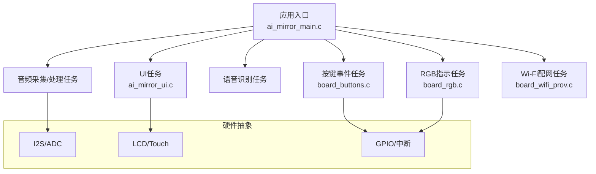
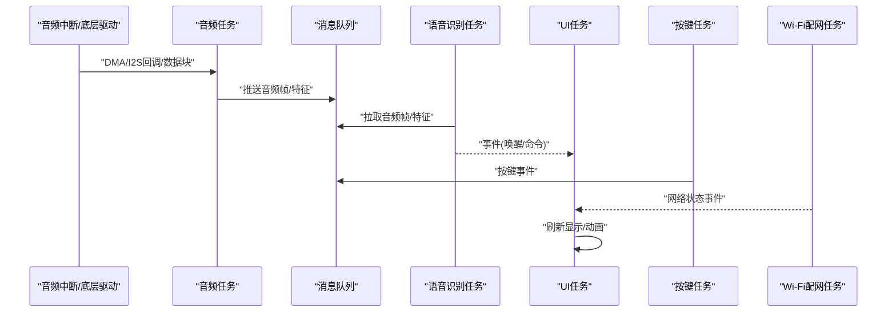
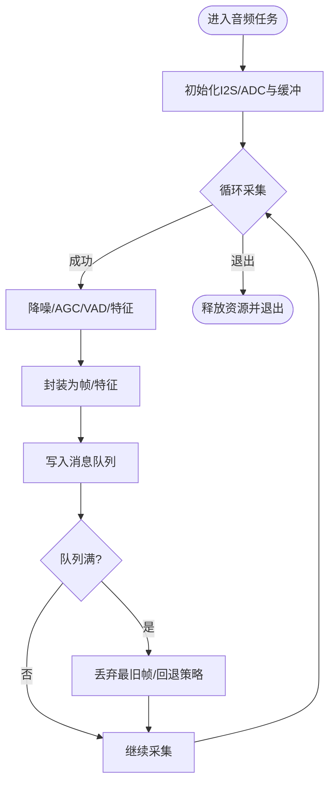
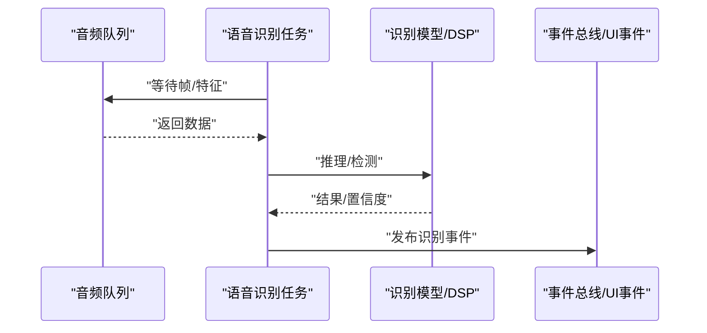
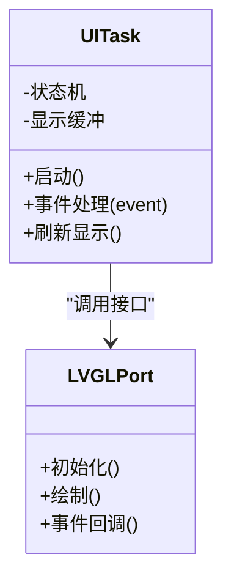
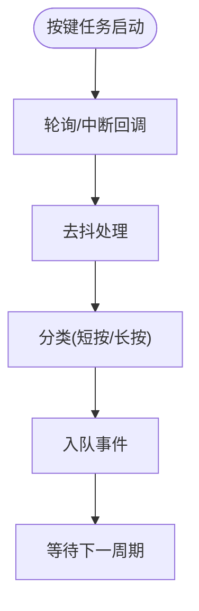
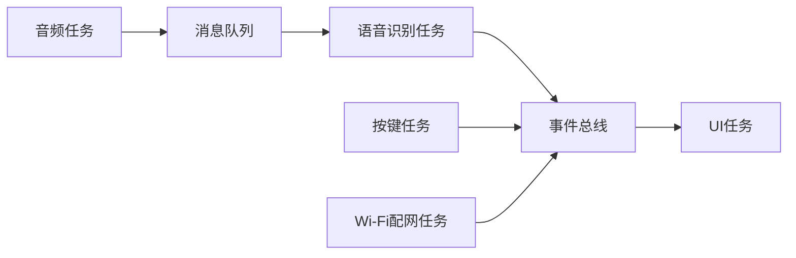

# 任务调度

<cite>
**本文引用的文件**   
- [ai_mirror_main.c](file://Firmware/esp32_ai_mirror/main/ai_mirror_main.c)
- [ai_mirror_ui.c](file://Firmware/esp32_ai_mirror/main/ai_mirror_ui.c)
- [board_buttons.c](file://Firmware/esp32_ai_mirror/main/board_buttons.c)
- [board_buttons.h](file://Firmware/esp32_ai_mirror/main/board_buttons.h)
- [board_rgb.c](file://Firmware/esp32_ai_mirror/main/board_rgb.c)
- [board_wifi_prov.c](file://Firmware/esp32_ai_mirror/main/board_wifi_prov.c)
- [CMakeLists.txt](file://Firmware/esp32_ai_mirror/CMakeLists.txt)
- [sdkconfig.defaults](file://Firmware/esp32_ai_mirror/sdkconfig.defaults)
- [README.md](file://Firmware/esp32_ai_mirror/README.md)
</cite>

## 目录
1. [简介](#简介)
2. [项目结构](#项目结构)
3. [核心组件](#核心组件)
4. [架构总览](#架构总览)
5. [详细组件分析](#详细组件分析)
6. [依赖关系分析](#依赖关系分析)
7. [性能与实时性考虑](#性能与实时性考虑)
8. [故障排查指南](#故障排查指南)
9. [结论](#结论)
10. [附录](#附录)

## 简介
本文件围绕FreeRTOS任务调度机制，结合ESP32 AI镜像项目的代码组织，系统性阐述音频处理、UI更新与语音识别任务的并发设计、优先级策略、资源分配与同步通信。文档面向不同技术背景的读者，既提供高层概览，也给出可落地的实现要点、优化建议与调试方法。

## 项目结构
本项目基于ESP-IDF构建，应用入口位于main目录，关键任务与外设驱动分布在多个源文件中：
- 应用主流程与任务创建：ai_mirror_main.c
- UI渲染与交互：ai_mirror_ui.c
- 按键输入与事件：board_buttons.c/h
- RGB指示灯控制：board_rgb.c
- Wi-Fi配网服务：board_wifi_prov.c
- 构建配置：CMakeLists.txt、sdkconfig.defaults
- 项目说明：README.md

图表来源
- [ai_mirror_main.c](file://Firmware/esp32_ai_mirror/main/ai_mirror_main.c)
- [ai_mirror_ui.c](file://Firmware/esp32_ai_mirror/main/ai_mirror_ui.c)
- [board_buttons.c](file://Firmware/esp32_ai_mirror/main/board_buttons.c)
- [board_buttons.h](file://Firmware/esp32_ai_mirror/main/board_buttons.h)
- [board_rgb.c](file://Firmware/esp32_ai_mirror/main/board_rgb.c)
- [board_wifi_prov.c](file://Firmware/esp32_ai_mirror/main/board_wifi_prov.c)

章节来源
- [README.md](file://Firmware/esp32_ai_mirror/README.md)
- [CMakeLists.txt](file://Firmware/esp32_ai_mirror/CMakeLists.txt)
- [sdkconfig.defaults](file://Firmware/esp32_ai_mirror/sdkconfig.defaults)

## 核心组件
- 任务划分
  - 音频采集与预处理任务：负责I2S/ADC采样、降噪、VAD检测、特征提取等，通常高优先级以保证低延迟。
  - 语音识别任务：接收音频特征或帧，执行唤醒词检测与命令识别，可能调用DSP/模型推理库。
  - UI更新任务：刷新显示、动画与交互反馈，需保证流畅度但允许一定抖动。
  - 按键事件任务：读取按键中断或轮询，生成事件并投递到消息队列。
  - RGB指示任务：根据系统状态切换LED模式，低开销。
  - Wi-Fi配网任务：网络握手与服务发现，中低优先级。
- 优先级与抢占
  - 音频路径优先于UI与网络任务，避免卡顿与爆音。
  - UI任务使用中等优先级，配合定时器或信号量触发刷新，降低CPU占用。
  - 网络任务最低优先级，避免阻塞实时路径。
- 资源分配
  - 堆栈大小按任务峰值估算，音频任务需较大缓冲；UI任务适中；网络任务较小。
  - 共享资源（如音频缓冲区、显示缓冲区）通过互斥锁保护，临界区尽量短。
- 同步与通信
  - 消息队列用于音频帧/特征传递、UI事件分发。
  - 信号量用于资源访问与事件同步（如“新帧可用”“缓冲区空闲”）。
  - 互斥量用于保护共享数据结构（如全局状态、配置表）。

章节来源
- [ai_mirror_main.c](file://Firmware/esp32_ai_mirror/main/ai_mirror_main.c)
- [ai_mirror_ui.c](file://Firmware/esp32_ai_mirror/main/ai_mirror_ui.c)
- [board_buttons.c](file://Firmware/esp32_ai_mirror/main/board_buttons.c)
- [board_buttons.h](file://Firmware/esp32_ai_mirror/main/board_buttons.h)
- [board_rgb.c](file://Firmware/esp32_ai_mirror/main/board_rgb.c)
- [board_wifi_prov.c](file://Firmware/esp32_ai_mirror/main/board_wifi_prov.c)

## 架构总览
下图展示典型的数据流与控制流：音频ISR/任务将数据推入队列，识别任务消费并输出结果，UI任务订阅事件进行界面更新，按键与网络事件作为旁路输入。

图表来源
- [ai_mirror_main.c](file://Firmware/esp32_ai_mirror/main/ai_mirror_main.c)
- [ai_mirror_ui.c](file://Firmware/esp32_ai_mirror/main/ai_mirror_ui.c)
- [board_buttons.c](file://Firmware/esp32_ai_mirror/main/board_buttons.c)
- [board_wifi_prov.c](file://Firmware/esp32_ai_mirror/main/board_wifi_prov.c)

## 详细组件分析

### 音频处理任务
- 职责
  - 从I2S/ADC获取音频数据，进行降噪、AGC、VAD检测与特征提取。
  - 将处理后的数据打包为帧或特征向量，写入消息队列。
- 实时性与内存
  - 使用环形缓冲与双缓冲减少拷贝；队列长度足够容纳突发负载。
  - 堆栈预留足够空间以容纳DSP中间态；避免在临界区内做复杂计算。
- 同步
  - 使用二值信号量通知“有数据可用”，或使用带超时的队列接收避免忙等。
- 异常处理
  - 捕获DMA/I2S错误，回退到静音帧或丢弃部分数据，保持系统稳定。

章节来源
- [ai_mirror_main.c](file://Firmware/esp32_ai_mirror/main/ai_mirror_main.c)

### 语音识别任务
- 职责
  - 消费音频队列中的帧/特征，执行唤醒词检测与命令识别。
  - 将识别结果转换为UI事件或系统动作。
- 并发设计
  - 与音频任务解耦，通过队列异步通信，避免阻塞采集路径。
  - 推理过程可分片处理，必要时使用较低优先级让出CPU给音频。
- 资源管理
  - 模型加载与参数缓存，避免重复初始化；推理时最小化动态分配。
- 异常处理
  - 超时重试、降级到轻量模型或返回默认结果。

章节来源
- [ai_mirror_main.c](file://Firmware/esp32_ai_mirror/main/ai_mirror_main.c)

### UI更新任务
- 职责
  - 响应识别结果、按键与网络事件，刷新屏幕、播放动画与提示。
  - 维护界面状态机，确保一致性与可恢复性。
- 刷新策略
  - 采用事件驱动+定时刷新混合模式，避免频繁重绘。
  - 使用LVGL端口适配，合理设置刷新区域与帧率。
- 同步
  - 通过信号量或队列接收外部事件；对共享显示缓冲加互斥锁。
- 性能
  - 批量更新、增量绘制；避免在UI线程中进行耗时计算。

章节来源
- [ai_mirror_ui.c](file://Firmware/esp32_ai_mirror/main/ai_mirror_ui.c)

### 按键事件任务
- 职责
  - 读取按键中断或轮询GPIO，去抖后生成事件并投递到队列。
- 设计要点
  - 中断仅置标志位，实际处理在任务中完成，避免长中断。
  - 事件包含键码、时间戳与长按/短按类型。

章节来源
- [board_buttons.c](file://Firmware/esp32_ai_mirror/main/board_buttons.c)
- [board_buttons.h](file://Firmware/esp32_ai_mirror/main/board_buttons.h)

### RGB指示任务
- 职责
  - 根据系统状态切换LED模式（呼吸、闪烁、常亮），提供直观反馈。
- 设计要点
  - 低优先级、低功耗；使用定时器或延时避免阻塞。

章节来源
- [board_rgb.c](file://Firmware/esp32_ai_mirror/main/board_rgb.c)

### Wi-Fi配网任务
- 职责
  - 处理配网流程、连接管理与状态上报，向UI与主控发送事件。
- 设计要点
  - 非实时任务，低优先级；失败重试与超时处理完善。

章节来源
- [board_wifi_prov.c](file://Firmware/esp32_ai_mirror/main/board_wifi_prov.c)

## 依赖关系分析
- 模块耦合
  - 音频与识别通过队列解耦；UI与识别通过事件解耦；按键与UI通过事件解耦。
- 外部依赖
  - ESP-IDF FreeRTOS API（任务、队列、信号量、互斥量）。
  - 音频驱动（I2S/ADC）、显示驱动（LCD/LVGL）、GPIO中断。
- 潜在环路
  - 避免UI直接依赖音频任务内部状态，统一通过事件/队列传递。

图表来源
- [ai_mirror_main.c](file://Firmware/esp32_ai_mirror/main/ai_mirror_main.c)
- [ai_mirror_ui.c](file://Firmware/esp32_ai_mirror/main/ai_mirror_ui.c)
- [board_buttons.c](file://Firmware/esp32_ai_mirror/main/board_buttons.c)
- [board_wifi_prov.c](file://Firmware/esp32_ai_mirror/main/board_wifi_prov.c)

章节来源
- [CMakeLists.txt](file://Firmware/esp32_ai_mirror/CMakeLists.txt)

## 性能与实时性考虑
- 任务切换开销
  - 减少上下文切换频率：合并小任务、批处理数据、避免频繁睡眠/唤醒。
  - 使用无锁队列或环形缓冲降低竞争。
- 内存使用优化
  - 预分配固定大小缓冲，避免运行时频繁malloc/free。
  - 音频与识别共享静态缓冲，减少拷贝。
- 实时性保证
  - 音频路径最高优先级；UI与网络任务使用中等/低优先级。
  - 临界区最小化，禁止在临界区进行阻塞操作。
- 多核CPU与负载均衡
  - 将CPU密集型任务（如识别推理）绑定到特定核，避免抢占音频任务所在核。
  - 使用FreeRTOS的CPU亲和与任务绑定API，结合功耗与热设计权衡。
- 监控与调优
  - 启用任务统计、堆栈水位检测、队列长度监控。
  - 使用性能计数器测量端到端延迟与丢帧率。

[本节为通用指导，不直接分析具体文件]

## 故障排查指南
- 常见问题
  - 音频爆音/卡顿：检查队列长度、采样率匹配、缓冲区大小与优先级。
  - UI掉帧：减少UI线程耗时操作，拆分绘制任务，增加刷新节流。
  - 识别延迟：优化推理分片、减少内存分配、提升队列吞吐。
  - 死锁/饥饿：检查互斥锁顺序、避免嵌套锁、缩短临界区。
- 调试工具
  - FreeRTOS任务列表与堆栈水位：查看各任务运行状态与剩余堆栈。
  - 队列长度与阻塞时间：定位瓶颈与拥塞点。
  - 日志与断点：在关键路径打印时间戳与状态码。
- 恢复策略
  - 看门狗复位与任务自愈；异常时回退到安全模式（如关闭UI动画）。

章节来源
- [ai_mirror_main.c](file://Firmware/esp32_ai_mirror/main/ai_mirror_main.c)
- [ai_mirror_ui.c](file://Firmware/esp32_ai_mirror/main/ai_mirror_ui.c)
- [board_buttons.c](file://Firmware/esp32_ai_mirror/main/board_buttons.c)
- [board_wifi_prov.c](file://Firmware/esp32_ai_mirror/main/board_wifi_prov.c)

## 结论
通过将音频、识别与UI解耦为独立任务并以队列/事件串联，项目在ESP32平台上实现了稳定的实时音频路径与流畅的交互体验。合理的优先级与资源分配、严格的同步策略以及完善的异常处理，是保障系统鲁棒性的关键。在多核环境下，进一步利用任务绑定与负载均衡可提升整体吞吐与时延表现。

[本节为总结性内容，不直接分析具体文件]

## 附录
- 构建与配置
  - CMakeLists.txt：定义组件与链接选项。
  - sdkconfig.defaults：FreeRTOS与外设默认配置（任务数、队列长度、堆大小等）。
- 参考文档
  - README.md：项目背景与使用说明。

章节来源
- [CMakeLists.txt](file://Firmware/esp32_ai_mirror/CMakeLists.txt)
- [sdkconfig.defaults](file://Firmware/esp32_ai_mirror/sdkconfig.defaults)
- [README.md](file://Firmware/esp32_ai_mirror/README.md)