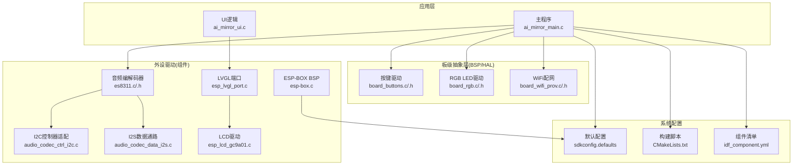
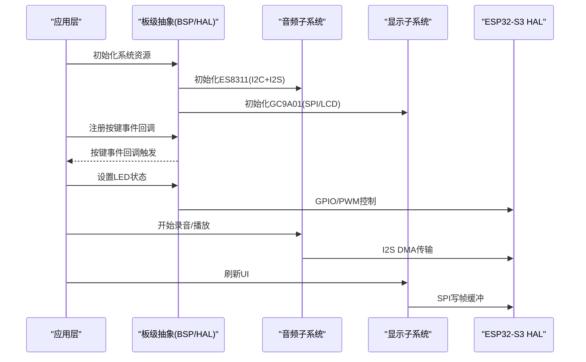
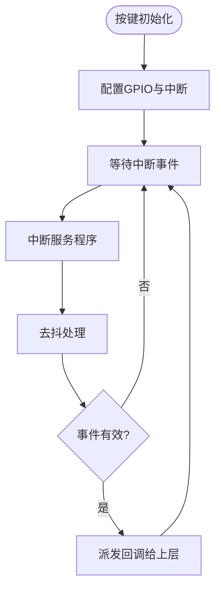
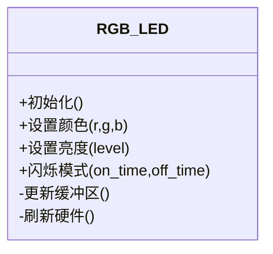
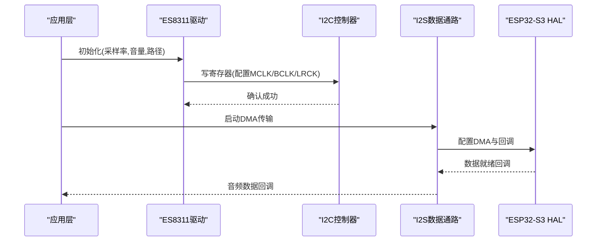
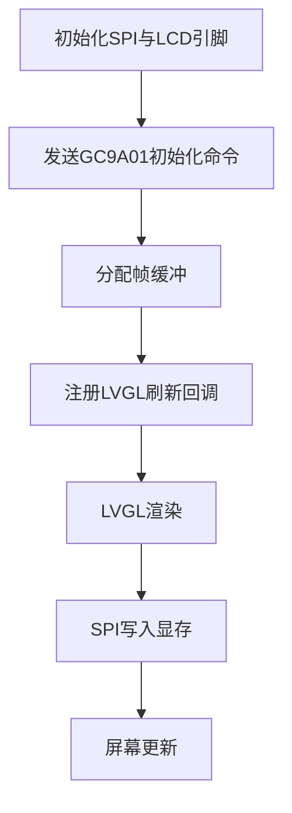
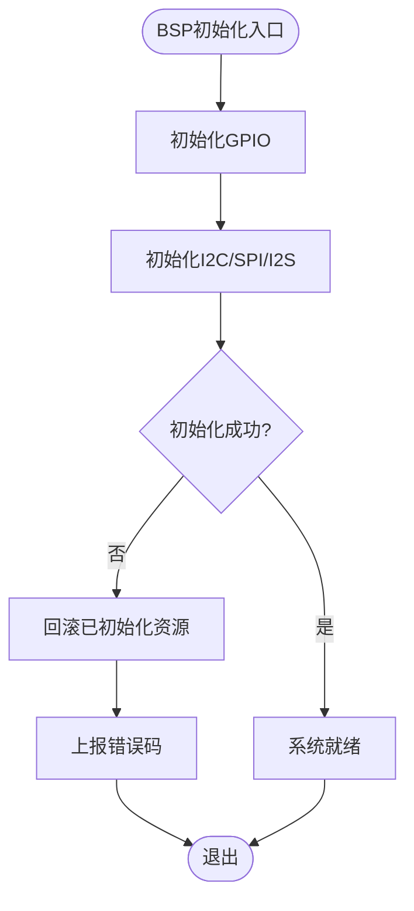
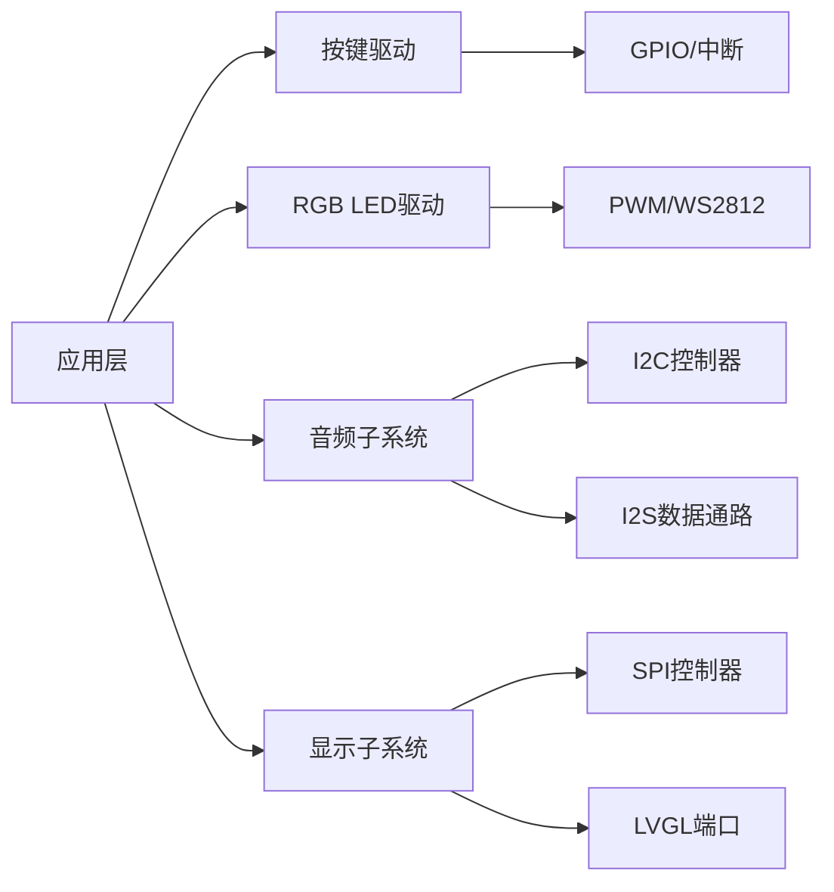

# 硬件抽象层

<cite>
**本文引用的文件**   
- [ai_mirror_main.c](file://Firmware/esp32_ai_mirror/main/ai_mirror_main.c)
- [board_buttons.c](file://Firmware/esp32_ai_mirror/main/board_buttons.c)
- [board_buttons.h](file://Firmware/esp32_ai_mirror/main/board_buttons.h)
- [board_rgb.c](file://Firmware/esp32_ai_mirror/main/board_rgb.c)
- [board_rgb.h](file://Firmware/esp32_ai_mirror/main/board_rgb.h)
- [sdkconfig.defaults](file://Firmware/esp32_ai_mirror/sdkconfig.defaults)
- [CMakeLists.txt](file://Firmware/esp32_ai_mirror/CMakeLists.txt)
- [idf_component.yml](file://Firmware/esp32_ai_mirror/main/idf_component.yml)
- [es8311.c](file://Firmware/esp32_ai_mirror/managed_components/espressif__es8311/es8311.c)
- [es8311.h](file://Firmware/esp32_ai_mirror/managed_components/espressif__es8311/include/es8311.h)
- [audio_codec_ctrl_i2c.c](file://Firmware/esp32_ai_mirror/managed_components/espressif__esp_codec_dev/platform/audio_codec_ctrl_i2c.c)
- [audio_codec_data_i2s.c](file://Firmware/esp32_ai_mirror/managed_components/espressif__esp_codec_dev/platform/audio_codec_data_i2s.c)
- [esp_lcd_gc9a01.c](file://Firmware/esp32_ai_mirror/managed_components/espressif__esp_lcd_gc9a01/esp_lcd_gc9a01.c)
- [esp_lvgl_port.c](file://Firmware/esp32_ai_mirror/managed_components/espressif__esp_lvgl_port/esp_lvgl_port.c)
- [esp-box.c](file://Firmware/esp32_ai_mirror/managed_components/espressif__esp-box/esp-box.c)
- [bsp_err_check.h](file://Firmware/esp32_ai_mirror/managed_components/espressif__esp-box/priv_include/bsp_err_check.h)
</cite>

## 目录
1. [引言](#引言)
2. [项目结构](#项目结构)
3. [核心组件](#核心组件)
4. [架构总览](#架构总览)
5. [详细组件分析](#详细组件分析)
6. [依赖关系分析](#依赖关系分析)
7. [性能考量](#性能考量)
8. [故障排查指南](#故障排查指南)
9. [结论](#结论)
10. [附录](#附录)

## 引言
本文件面向ESP32-S3平台的硬件抽象层（HAL）与板级支持包（BSP），系统性梳理GPIO、I2C、SPI、中断等底层驱动的封装方式，以及按键检测、LED控制、传感器读取的统一接口设计。同时覆盖电源管理、时钟配置、内存映射的底层实现要点，并给出硬件兼容性与平台移植指南，说明如何与上层应用解耦及扩展点定义。文档以代码仓库中的main工程与managed_components组件为依据，确保内容与实际实现一致。

## 项目结构
本项目采用ESP-IDF工程组织方式：
- main目录包含应用入口、板级驱动（按键、RGB LED）、WiFi配网等模块。
- managed_components目录集成官方与第三方组件，如音频编解码器（ES8311）、LCD驱动（GC9A01）、LVGL端口、ESP-BOX BSP等。
- sdkconfig.defaults与CMakeLists.txt负责构建与默认配置。

图表来源
- [ai_mirror_main.c](file://Firmware/esp32_ai_mirror/main/ai_mirror_main.c)
- [board_buttons.c](file://Firmware/esp32_ai_mirror/main/board_buttons.c)
- [board_rgb.c](file://Firmware/esp32_ai_mirror/main/board_rgb.c)
- [es8311.c](file://Firmware/esp32_ai_mirror/managed_components/espressif__es8311/es8311.c)
- [audio_codec_ctrl_i2c.c](file://Firmware/esp32_ai_mirror/managed_components/espressif__esp_codec_dev/platform/audio_codec_ctrl_i2c.c)
- [audio_codec_data_i2s.c](file://Firmware/esp32_ai_mirror/managed_components/espressif__esp_codec_dev/platform/audio_codec_data_i2s.c)
- [esp_lcd_gc9a01.c](file://Firmware/esp32_ai_mirror/managed_components/espressif__esp_lcd_gc9a01/esp_lcd_gc9a01.c)
- [esp_lvgl_port.c](file://Firmware/esp32_ai_mirror/managed_components/espressif__esp_lvgl_port/esp_lvgl_port.c)
- [esp-box.c](file://Firmware/esp32_ai_mirror/managed_components/espressif__esp-box/esp-box.c)
- [sdkconfig.defaults](file://Firmware/esp32_ai_mirror/sdkconfig.defaults)
- [CMakeLists.txt](file://Firmware/esp32_ai_mirror/CMakeLists.txt)
- [idf_component.yml](file://Firmware/esp32_ai_mirror/main/idf_component.yml)

章节来源
- [CMakeLists.txt](file://Firmware/esp32_ai_mirror/CMakeLists.txt)
- [sdkconfig.defaults](file://Firmware/esp32_ai_mirror/sdkconfig.defaults)
- [idf_component.yml](file://Firmware/esp32_ai_mirror/main/idf_component.yml)

## 核心组件
- 板级输入输出抽象
  - 按键驱动：统一按键扫描与事件上报，屏蔽GPIO轮询/中断差异。
  - RGB LED驱动：统一颜色设置与状态指示，封装PWM或WS2812等具体实现。
- 音频子系统
  - ES8311编解码器：通过I2C进行寄存器配置，I2S传输音频数据。
  - 音频控制与数据路径分离：I2C用于控制面，I2S用于数据面。
- 显示子系统
  - GC9A01 LCD驱动：通过SPI或并行总线初始化与帧缓冲写入。
  - LVGL端口：将显示驱动接入LVGL图形栈，提供刷新回调。
- BSP与错误处理
  - ESP-BOX BSP：为特定开发板提供统一的初始化流程与资源分配。
  - 错误检查宏：统一错误码与日志输出，便于定位问题。

章节来源
- [board_buttons.c](file://Firmware/esp32_ai_mirror/main/board_buttons.c)
- [board_buttons.h](file://Firmware/esp32_ai_mirror/main/board_buttons.h)
- [board_rgb.c](file://Firmware/esp32_ai_mirror/main/board_rgb.c)
- [board_rgb.h](file://Firmware/esp32_ai_mirror/main/board_rgb.h)
- [es8311.c](file://Firmware/esp32_ai_mirror/managed_components/espressif__es8311/es8311.c)
- [es8311.h](file://Firmware/esp32_ai_mirror/managed_components/espressif__es8311/include/es8311.h)
- [audio_codec_ctrl_i2c.c](file://Firmware/esp32_ai_mirror/managed_components/espressif__esp_codec_dev/platform/audio_codec_ctrl_i2c.c)
- [audio_codec_data_i2s.c](file://Firmware/esp32_ai_mirror/managed_components/espressif__esp_codec_dev/platform/audio_codec_data_i2s.c)
- [esp_lcd_gc9a01.c](file://Firmware/esp32_ai_mirror/managed_components/espressif__esp_lcd_gc9a01/esp_lcd_gc9a01.c)
- [esp_lvgl_port.c](file://Firmware/esp32_ai_mirror/managed_components/espressif__esp_lvgl_port/esp_lvgl_port.c)
- [esp-box.c](file://Firmware/esp32_ai_mirror/managed_components/espressif__esp-box/esp-box.c)
- [bsp_err_check.h](file://Firmware/esp32_ai_mirror/managed_components/espressif__esp-box/priv_include/bsp_err_check.h)

## 架构总览
整体架构遵循“应用层—板级抽象—外设驱动—SoC HAL”的分层模式：
- 应用层调用板级抽象接口（按键、LED、音频、显示）。
- 板级抽象屏蔽不同外设的具体实现细节，向上提供稳定API。
- 外设驱动对接ESP-IDF HAL（I2C、SPI、I2S、GPIO、中断等）。
- 系统配置通过sdkconfig.defaults与组件清单决定功能开关与引脚映射。

图表来源
- [ai_mirror_main.c](file://Firmware/esp32_ai_mirror/main/ai_mirror_main.c)
- [board_buttons.c](file://Firmware/esp32_ai_mirror/main/board_buttons.c)
- [board_rgb.c](file://Firmware/esp32_ai_mirror/main/board_rgb.c)
- [es8311.c](file://Firmware/esp32_ai_mirror/managed_components/espressif__es8311/es8311.c)
- [audio_codec_ctrl_i2c.c](file://Firmware/esp32_ai_mirror/managed_components/espressif__esp_codec_dev/platform/audio_codec_ctrl_i2c.c)
- [audio_codec_data_i2s.c](file://Firmware/esp32_ai_mirror/managed_components/espressif__esp_codec_dev/platform/audio_codec_data_i2s.c)
- [esp_lcd_gc9a01.c](file://Firmware/esp32_ai_mirror/managed_components/espressif__esp_lcd_gc9a01/esp_lcd_gc9a01.c)
- [esp_lvgl_port.c](file://Firmware/esp32_ai_mirror/managed_components/espressif__esp_lvgl_port/esp_lvgl_port.c)

## 详细组件分析

### 按键检测抽象
- 设计目标：统一按键扫描策略（轮询/中断），屏蔽GPIO配置差异，提供事件回调机制。
- 关键职责：
  - 初始化GPIO方向、上拉/下拉、中断触发边沿。
  - 去抖与状态机管理，避免误触发。
  - 事件分发到上层回调，支持多按键并发。
- 典型流程：
  - 启动时完成GPIO与中断配置。
  - 中断服务程序置位事件标志。
  - 任务或定时器周期处理去抖与事件派发。

图表来源
- [board_buttons.c](file://Firmware/esp32_ai_mirror/main/board_buttons.c)
- [board_buttons.h](file://Firmware/esp32_ai_mirror/main/board_buttons.h)

章节来源
- [board_buttons.c](file://Firmware/esp32_ai_mirror/main/board_buttons.c)
- [board_buttons.h](file://Firmware/esp32_ai_mirror/main/board_buttons.h)

### RGB LED控制抽象
- 设计目标：统一颜色与亮度控制接口，屏蔽具体驱动（PWM或WS2812）。
- 关键职责：
  - 初始化LED通道与时钟/数据引脚。
  - 提供设置颜色、亮度、闪烁模式的API。
  - 在后台任务中更新波形或数据流。
- 典型流程：
  - 初始化阶段配置引脚与DMA/PWM。
  - 上层调用设置函数，更新缓冲区。
  - 定时任务刷新至硬件。

图表来源
- [board_rgb.c](file://Firmware/esp32_ai_mirror/main/board_rgb.c)
- [board_rgb.h](file://Firmware/esp32_ai_mirror/main/board_rgb.h)

章节来源
- [board_rgb.c](file://Firmware/esp32_ai_mirror/main/board_rgb.c)
- [board_rgb.h](file://Firmware/esp32_ai_mirror/main/board_rgb.h)

### 音频子系统（ES8311 + I2C/I2S）
- 设计目标：将音频控制面（I2C寄存器配置）与数据面（I2S DMA传输）解耦，提供统一初始化与流控接口。
- 关键职责：
  - I2C控制器适配：读写ES8311寄存器，完成采样率、音量、ADC/DAC路径配置。
  - I2S数据通路：配置采样率、位宽、DMA缓冲，实现录音与播放。
  - 错误处理与状态同步：确保控制面与数据面一致性。
- 典型流程：
  - 初始化I2C与I2S外设。
  - 配置ES8311寄存器（MCLK/BCLK/LRCK等）。
  - 启动I2S DMA循环，回调处理音频数据。

图表来源
- [es8311.c](file://Firmware/esp32_ai_mirror/managed_components/espressif__es8311/es8311.c)
- [es8311.h](file://Firmware/esp32_ai_mirror/managed_components/espressif__es8311/include/es8311.h)
- [audio_codec_ctrl_i2c.c](file://Firmware/esp32_ai_mirror/managed_components/espressif__esp_codec_dev/platform/audio_codec_ctrl_i2c.c)
- [audio_codec_data_i2s.c](file://Firmware/esp32_ai_mirror/managed_components/espressif__esp_codec_dev/platform/audio_codec_data_i2s.c)

章节来源
- [es8311.c](file://Firmware/esp32_ai_mirror/managed_components/espressif__es8311/es8311.c)
- [es8311.h](file://Firmware/esp32_ai_mirror/managed_components/espressif__es8311/include/es8311.h)
- [audio_codec_ctrl_i2c.c](file://Firmware/esp32_ai_mirror/managed_components/espressif__esp_codec_dev/platform/audio_codec_ctrl_i2c.c)
- [audio_codec_data_i2s.c](file://Firmware/esp32_ai_mirror/managed_components/espressif__esp_codec_dev/platform/audio_codec_data_i2s.c)

### 显示子系统（GC9A01 + LVGL）
- 设计目标：将LCD驱动与图形库解耦，提供帧缓冲刷新接口。
- 关键职责：
  - GC9A01初始化：复位、命令序列、像素格式、旋转等。
  - LVGL端口：注册刷新回调，将LVGL渲染结果写入显存并通过SPI发送。
- 典型流程：
  - 初始化SPI与LCD引脚。
  - 发送GC9A01初始化命令。
  - 注册LVGL刷新回调，周期性刷新屏幕。

图表来源
- [esp_lcd_gc9a01.c](file://Firmware/esp32_ai_mirror/managed_components/espressif__esp_lcd_gc9a01/esp_lcd_gc9a01.c)
- [esp_lvgl_port.c](file://Firmware/esp32_ai_mirror/managed_components/espressif__esp_lvgl_port/esp_lvgl_port.c)

章节来源
- [esp_lcd_gc9a01.c](file://Firmware/esp32_ai_mirror/managed_components/espressif__esp_lcd_gc9a01/esp_lcd_gc9a01.c)
- [esp_lvgl_port.c](file://Firmware/esp32_ai_mirror/managed_components/espressif__esp_lvgl_port/esp_lvgl_port.c)

### BSP与错误处理
- 设计目标：为特定开发板提供统一初始化流程与错误处理机制。
- 关键职责：
  - 集中初始化GPIO、I2C、SPI、I2S等资源。
  - 使用错误检查宏统一返回码与日志输出。
  - 暴露板级配置项（引脚映射、外设使能）。
- 典型流程：
  - 调用BSP初始化函数。
  - 各外设按序初始化，失败则回滚并上报错误。
  - 上层根据错误码进行恢复或降级运行。

图表来源
- [esp-box.c](file://Firmware/esp32_ai_mirror/managed_components/espressif__esp-box/esp-box.c)
- [bsp_err_check.h](file://Firmware/esp32_ai_mirror/managed_components/espressif__esp-box/priv_include/bsp_err_check.h)

章节来源
- [esp-box.c](file://Firmware/esp32_ai_mirror/managed_components/espressif__esp-box/esp-box.c)
- [bsp_err_check.h](file://Firmware/esp32_ai_mirror/managed_components/espressif__esp-box/priv_include/bsp_err_check.h)

## 依赖关系分析
- 组件耦合度
  - 音频子系统对I2C与I2S存在强依赖，需保证时钟与DMA配置一致。
  - 显示子系统对SPI与LVGL端口存在依赖，刷新回调需与帧率匹配。
  - 按键与LED对GPIO与中断/PWM存在依赖，需避免资源冲突。
- 外部依赖
  - ESP-IDF HAL提供I2C、SPI、I2S、GPIO、中断等基础能力。
  - 组件清单与构建脚本决定功能开关与编译选项。

图表来源
- [ai_mirror_main.c](file://Firmware/esp32_ai_mirror/main/ai_mirror_main.c)
- [board_buttons.c](file://Firmware/esp32_ai_mirror/main/board_buttons.c)
- [board_rgb.c](file://Firmware/esp32_ai_mirror/main/board_rgb.c)
- [es8311.c](file://Firmware/esp32_ai_mirror/managed_components/espressif__es8311/es8311.c)
- [audio_codec_ctrl_i2c.c](file://Firmware/esp32_ai_mirror/managed_components/espressif__esp_codec_dev/platform/audio_codec_ctrl_i2c.c)
- [audio_codec_data_i2s.c](file://Firmware/esp32_ai_mirror/managed_components/espressif__esp_codec_dev/platform/audio_codec_data_i2s.c)
- [esp_lcd_gc9a01.c](file://Firmware/esp32_ai_mirror/managed_components/espressif__esp_lcd_gc9a01/esp_lcd_gc9a01.c)
- [esp_lvgl_port.c](file://Firmware/esp32_ai_mirror/managed_components/espressif__esp_lvgl_port/esp_lvgl_port.c)

章节来源
- [idf_component.yml](file://Firmware/esp32_ai_mirror/main/idf_component.yml)
- [CMakeLists.txt](file://Firmware/esp32_ai_mirror/CMakeLists.txt)

## 性能考量
- 音频路径
  - I2S DMA双缓冲减少CPU占用，合理设置缓冲区大小以降低延迟与溢出风险。
  - MCLK/BCLK/LRCK时钟配置需满足采样率要求，避免抖动。
- 显示路径
  - 帧缓冲大小与刷新频率平衡，避免频繁SPI传输导致卡顿。
  - 使用部分刷新与裁剪区域提升UI响应速度。
- 按键与LED
  - 中断+去抖策略降低轮询开销，LED更新使用后台任务避免阻塞。
- 内存与功耗
  - 合理分配堆与静态内存，避免碎片化。
  - 关闭未使用外设与降频策略降低功耗。

[本节为通用指导，不直接分析具体文件]

## 故障排查指南
- 常见问题定位
  - I2C通信失败：检查地址、上拉电阻、时钟频率与寄存器值。
  - I2S无声音：确认MCLK/BCLK/LRCK极性与时序，DMA回调是否触发。
  - 屏幕不亮：验证SPI时序、CS/DC引脚与初始化命令序列。
  - 按键误触发：调整去抖阈值与中断边沿配置。
- 错误处理建议
  - 使用统一错误码与日志输出，记录关键步骤返回值。
  - 初始化失败时执行资源回滚，避免半初始化状态。
  - 提供降级模式（如无屏/无声）保障基本功能可用。

章节来源
- [bsp_err_check.h](file://Firmware/esp32_ai_mirror/managed_components/espressif__esp-box/priv_include/bsp_err_check.h)
- [es8311.c](file://Firmware/esp32_ai_mirror/managed_components/espressif__es8311/es8311.c)
- [esp_lcd_gc9a01.c](file://Firmware/esp32_ai_mirror/managed_components/espressif__esp_lcd_gc9a01/esp_lcd_gc9a01.c)

## 结论
本硬件抽象层通过分层设计与统一接口，将ESP32-S3的外设驱动与上层应用解耦，提升了可维护性与可移植性。按键、LED、音频、显示等模块均提供清晰的API与错误处理机制，配合BSP与配置系统，能够快速适配不同硬件平台。建议在后续迭代中进一步完善中断优先级管理、功耗优化与跨平台兼容性测试。

[本节为总结性内容，不直接分析具体文件]

## 附录
- 平台移植指南
  - 修改引脚映射：在BSP与sdkconfig.defaults中更新GPIO与外设引脚定义。
  - 新增外设：在板级抽象层添加驱动模块，并在BSP初始化中注册。
  - 组件替换：通过idf_component.yml替换组件版本或供应商实现。
- 扩展点定义
  - 事件回调：按键、音频、显示均可通过回调机制扩展行为。
  - 配置项：通过Kconfig与sdkconfig.defaults暴露可配置参数。
  - 错误码：统一错误码体系便于跨模块诊断。

[本节为补充信息，不直接分析具体文件]