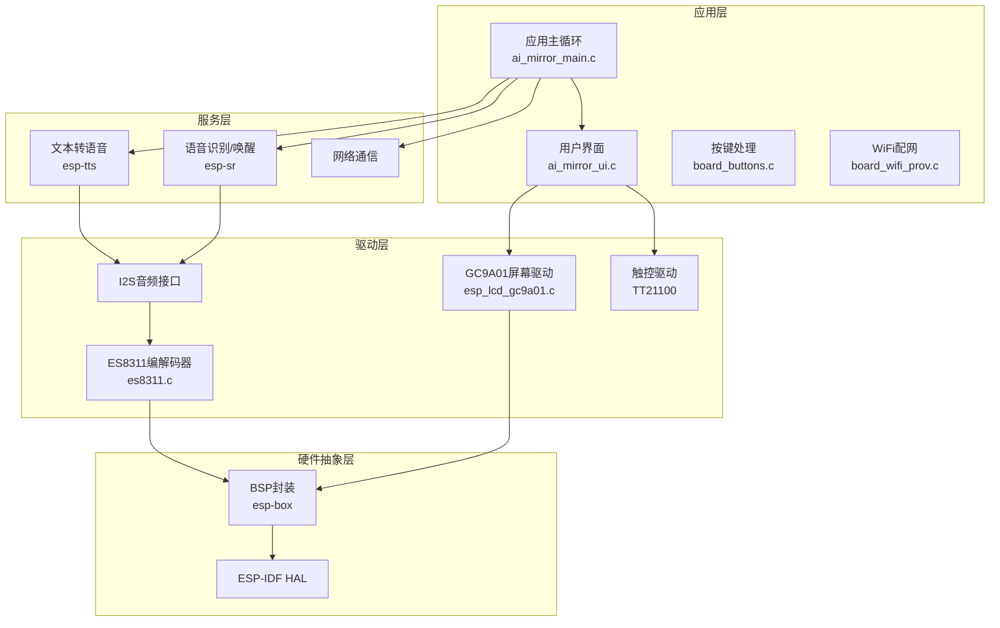
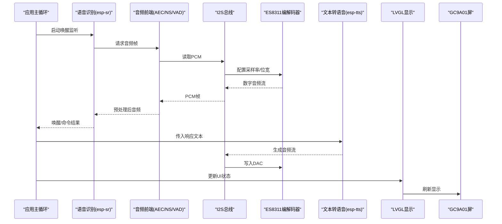
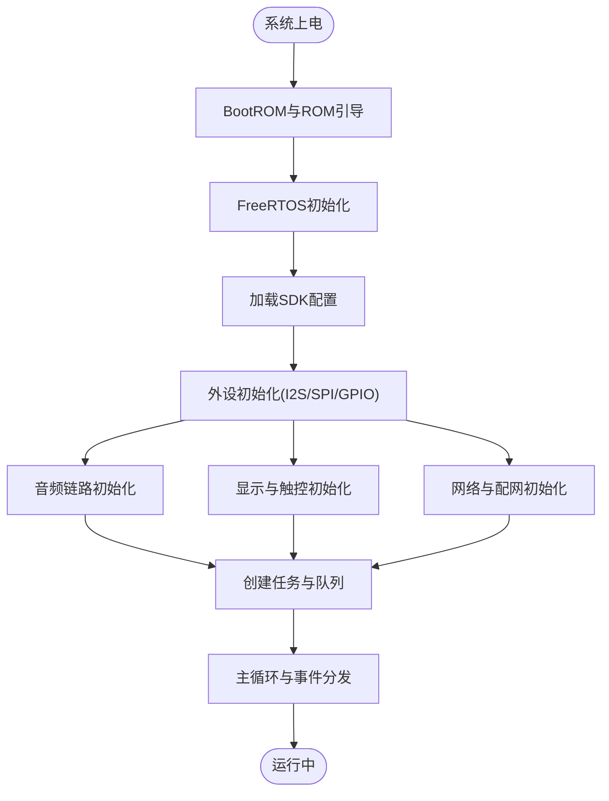
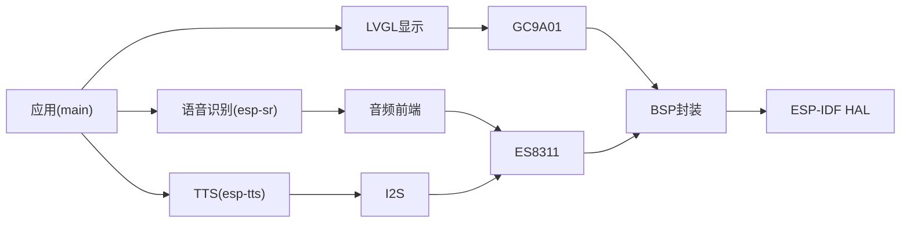

# 系统概览

<cite>
**本文档引用的文件**   
- [ai_mirror_main.c](file://Firmware/esp32_ai_mirror/main/ai_mirror_main.c)
- [ai_mirror_config.h](file://Firmware/esp32_ai_mirror/main/ai_mirror_config.h)
- [CMakeLists.txt](file://Firmware/esp32_ai_mirror/CMakeLists.txt)
- [sdkconfig.defaults](file://Firmware/esp32_ai_mirror/sdkconfig.defaults)
- [partitions_n16r8.csv](file://Firmware/esp32_ai_mirror/partitions_n16r8.csv)
- [idf_component.yml](file://Firmware/esp32_ai_mirror/components/espressif__esp-sr/idf_component.yml)
- [esp_lvgl_port.c](file://Firmware/esp32_ai_mirror/managed_components/espressif__esp-lvgl_port/esp_lvgl_port.c)
- [es8311.c](file://Firmware/esp32_ai_mirror/managed_components/espressif__es8311/es8311.c)
- [esp_codec_dev.c](file://Firmware/esp32_ai_mirror/managed_components/espressif__esp_codec_dev/esp_codec_dev.c)
- [esp_lcd_gc9a01.c](file://Firmware/esp32_ai_mirror/components/espressif__esp_lcd_gc9a01/esp_lcd_gc9a01.c)
</cite>

## 目录
1. [简介](#简介)
2. [项目结构](#项目结构)
3. [核心组件](#核心组件)
4. [架构总览](#架构总览)
5. [详细组件分析](#详细组件分析)
6. [依赖关系分析](#依赖关系分析)
7. [性能考量](#性能考量)
8. [故障排查指南](#故障排查指南)
9. [结论](#结论)
10. [附录](#附录)

## 简介
本文件面向AI镜子系统的嵌入式实现，基于ESP-IDF与ESP32-S3芯片，提供从系统启动、资源管理到各功能模块交互的完整概览。文档重点阐述：
- 整体设计思路与模块化分层（硬件抽象层、驱动层、服务层、应用层）
- ESP32-S3的资源利用策略（内存分配、任务调度、外设管理）
- 系统初始化顺序与关键配置参数
- 音频采集与播放、显示与触控、语音识别与TTS、网络配网等核心能力
- 架构图与数据流，帮助读者快速理解组件间的交互关系

## 项目结构
项目采用ESP-IDF标准工程结构，核心代码位于main目录，第三方组件通过components与managed_components组织。关键目录与职责如下：
- main：应用入口、UI、板级驱动封装、WiFi配网等
- components：项目自研或集成的组件（如esp-sr语音套件、GC9A01屏驱动）
- managed_components：由ESP-IDF组件管理器引入的官方库（LVGL端口、ES8311编解码器、Codec Dev框架、LCD Touch等）
- 构建与配置：CMakeLists.txt、sdkconfig.defaults、分区表等

图表来源
- [ai_mirror_main.c](file://Firmware/esp32_ai_mirror/main/ai_mirror_main.c)
- [esp_lvgl_port.c](file://Firmware/esp32_ai_mirror/managed_components/espressif__esp-lvgl_port/esp_lvgl_port.c)
- [es8311.c](file://Firmware/esp32_ai_mirror/managed_components/espressif__es8311/es8311.c)
- [esp_lcd_gc9a01.c](file://Firmware/esp32_ai_mirror/components/espressif__esp_lcd_gc9a01/esp_lcd_gc9a01.c)

章节来源
- [CMakeLists.txt](file://Firmware/esp32_ai_mirror/CMakeLists.txt)
- [sdkconfig.defaults](file://Firmware/esp32_ai_mirror/sdkconfig.defaults)
- [partitions_n16r8.csv](file://Firmware/esp32_ai_mirror/partitions_n16r8.csv)

## 核心组件
- 应用主程序：负责系统初始化、任务创建、事件分发与业务编排
- 语音识别与唤醒：基于esp-sr，包含唤醒词检测、命令识别与多模型支持
- 文本转语音：基于esp-tts，将服务端返回文本转换为本地音频流
- 音频子系统：I2S + ES8311编解码器，完成ADC/DAC与音频链路控制
- 显示与触控：LVGL图形库 + GC9A01屏驱动 + TT21100触控
- 网络与配网：WiFi Provisioning用于首次配网与连接管理
- 构建与配置：CMake与Kconfig/sdconfig管理编译选项与运行时配置

章节来源
- [ai_mirror_main.c](file://Firmware/esp32_ai_mirror/main/ai_mirror_main.c)
- [idf_component.yml](file://Firmware/esp32_ai_mirror/components/espressif__esp-sr/idf_component.yml)
- [esp_lvgl_port.c](file://Firmware/esp32_ai_mirror/managed_components/espressif__esp-lvgl_port/esp_lvgl_port.c)
- [es8311.c](file://Firmware/esp32_ai_mirror/managed_components/espressif__es8311/es8311.c)
- [esp_codec_dev.c](file://Firmware/esp32_ai_mirror/managed_components/espressif__esp_codec_dev/esp_codec_dev.c)
- [esp_lcd_gc9a01.c](file://Firmware/esp32_ai_mirror/components/espressif__esp_lcd_gc9a01/esp_lcd_gc9a01.c)

## 架构总览
系统采用分层架构，自上而下为应用层、服务层、驱动层与硬件抽象层。数据流遵循“输入采集→处理→输出呈现”的闭环：
- 音频路径：麦克风→I2S→ES8311→DSP/AEC/NS/VAD→SR识别→TTS合成→DAC→扬声器
- 显示路径：LVGL渲染→GC9A01控制器→屏幕；触控中断→LVGL事件→UI更新
- 控制路径：按键/WiFi事件→应用主循环→任务调度→外设控制

图表来源
- [ai_mirror_main.c](file://Firmware/esp32_ai_mirror/main/ai_mirror_main.c)
- [es8311.c](file://Firmware/esp32_ai_mirror/managed_components/espressif__es8311/es8311.c)
- [esp_codec_dev.c](file://Firmware/esp32_ai_mirror/managed_components/espressif__esp_codec_dev/esp_codec_dev.c)
- [esp_lvgl_port.c](file://Firmware/esp32_ai_mirror/managed_components/espressif__esp-lvgl_port/esp_lvgl_port.c)
- [esp_lcd_gc9a01.c](file://Firmware/esp32_ai_mirror/components/espressif__esp_lcd_gc9a01/esp_lcd_gc9a01.c)

## 详细组件分析

### 系统启动与初始化流程
- 启动阶段：BootROM→ESP-IDF ROM引导→FreeRTOS初始化→SDK配置加载→组件初始化
- 应用初始化：外设时钟与GPIO配置、I2S与编解码器初始化、显示与触控初始化、网络栈与配网服务启动
- 任务创建：音频采集任务、语音识别任务、TTS播放任务、UI刷新任务、网络任务
- 关键配置：采样率、缓冲区大小、堆栈大小、队列长度、I2S DMA通道、SPI频率等

章节来源
- [ai_mirror_main.c](file://Firmware/esp32_ai_mirror/main/ai_mirror_main.c)
- [sdkconfig.defaults](file://Firmware/esp32_ai_mirror/sdkconfig.defaults)

### ESP32-S3资源利用策略
- 内存分配
  - 使用PSRAM扩展堆空间，降低内部RAM压力
  - 合理划分静态与动态内存，避免碎片化
  - 音频与显示缓冲采用环形缓冲与双缓冲策略
- 任务调度
  - 按优先级划分任务：音频采集/播放高优先级，UI刷新低优先级
  - 使用队列与事件组进行线程间通信，减少锁竞争
  - 使用DMA传输I2S与SPI数据，释放CPU占用
- 外设管理
  - I2S与SPI共享DMA通道时进行仲裁与复用
  - 编解码器通过I2C配置寄存器，避免频繁访问
  - 触控中断与显示刷新解耦，降低抖动

章节来源
- [sdkconfig.defaults](file://Firmware/esp32_ai_mirror/sdkconfig.defaults)
- [esp_codec_dev.c](file://Firmware/esp32_ai_mirror/managed_components/espressif__esp_codec_dev/esp_codec_dev.c)
- [esp_lvgl_port.c](file://Firmware/esp32_ai_mirror/managed_components/espressif__esp-lvgl_port/esp_lvgl_port.c)

### 音频子系统（I2S + ES8311）
- 数据路径：麦克风→ADC→I2S→DSP→SR/TTS→DAC→扬声器
- 关键配置：采样率（如16kHz）、位宽（16bit）、通道数（单声道）、DMA缓冲区大小
- 错误处理：I2S传输超时、DMA溢出、编解码器寄存器写失败的回退与重试机制

章节来源
- [es8311.c](file://Firmware/esp32_ai_mirror/managed_components/espressif__es8311/es8311.c)
- [esp_codec_dev.c](file://Firmware/esp32_ai_mirror/managed_components/espressif__esp_codec_dev/esp_codec_dev.c)

### 显示与触控（LVGL + GC9A01 + TT21100）
- 显示路径：LVGL对象树→帧缓冲→SPI→GC9A01控制器→屏幕
- 触控路径：TT21100中断→LVGL事件→控件回调→UI状态更新
- 优化策略：部分刷新、双缓冲、压缩字体与图片、降低刷新频率

章节来源
- [esp_lvgl_port.c](file://Firmware/esp32_ai_mirror/managed_components/espressif__esp-lvgl_port/esp_lvgl_port.c)
- [esp_lcd_gc9a01.c](file://Firmware/esp32_ai_mirror/components/espressif__esp_lcd_gc9a01/esp_lcd_gc9a01.c)

### 语音识别与TTS（esp-sr + esp-tts）
- 唤醒与识别：WakeNet唤醒→MNet命令识别→结果上报
- TTS合成：文本分词→音素转换→声码器合成→音频流输出
- 资源管理：模型加载至Flash/PSRAM，按需卸载以节省内存

章节来源
- [idf_component.yml](file://Firmware/esp32_ai_mirror/components/espressif__esp-sr/idf_component.yml)

### 网络与配网（WiFi Provisioning）
- 首次配网：AP模式广播SSID→手机APP连接→下发STA配置→自动重连
- 运行态：心跳保活、断线重连、OTA升级通道预留

章节来源
- [ai_mirror_main.c](file://Firmware/esp32_ai_mirror/main/ai_mirror_main.c)

## 依赖关系分析
- 组件依赖
  - 应用层依赖服务层（SR/TTS/NET），服务层依赖驱动层（I2S/CODEC/LCD/TOUCH）
  - 驱动层依赖HAL（ESP-IDF外设驱动）
- 构建依赖
  - CMakeLists.txt声明组件与源文件
  - sdkconfig.defaults提供默认配置项
  - partitions_n16r8.csv定义分区布局（固件、OTA、文件系统、模型等）

图表来源
- [CMakeLists.txt](file://Firmware/esp32_ai_mirror/CMakeLists.txt)
- [sdkconfig.defaults](file://Firmware/esp32_ai_mirror/sdkconfig.defaults)
- [partitions_n16r8.csv](file://Firmware/esp32_ai_mirror/partitions_n16r8.csv)

章节来源
- [CMakeLists.txt](file://Firmware/esp32_ai_mirror/CMakeLists.txt)
- [sdkconfig.defaults](file://Firmware/esp32_ai_mirror/sdkconfig.defaults)
- [partitions_n16r8.csv](file://Firmware/esp32_ai_mirror/partitions_n16r8.csv)

## 性能考量
- 音频链路
  - 使用DMA与中断结合，降低CPU占用
  - 合理设置缓冲区大小，平衡延迟与稳定性
  - 启用AEC/NS/VAD提升识别鲁棒性
- 显示渲染
  - 使用部分刷新与双缓冲减少闪烁
  - 压缩资源与懒加载降低内存峰值
- 任务调度
  - 高优先级任务短临界区，避免阻塞
  - 使用队列与事件组替代轮询
- 内存管理
  - 优先使用PSRAM存放大对象（模型、图片）
  - 避免频繁malloc/free，采用对象池

[本节为通用指导，不直接分析具体文件]

## 故障排查指南
- 音频问题
  - 检查I2S引脚与时钟配置，确认ES8311寄存器读写成功
  - 查看DMA传输状态与缓冲区溢出标志
- 显示问题
  - 验证SPI频率与时序，确认GC9A01初始化序列正确
  - 检查LVGL刷新回调是否被调用
- 网络问题
  - 确认WiFi配网流程与证书配置
  - 查看断线重连日志与DNS解析结果
- 调试建议
  - 启用ESP-IDF日志级别与时间戳
  - 使用CoreSight或JTAG抓取崩溃回溯

章节来源
- [es8311.c](file://Firmware/esp32_ai_mirror/managed_components/espressif__es8311/es8311.c)
- [esp_lvgl_port.c](file://Firmware/esp32_ai_mirror/managed_components/espressif__esp-lvgl_port/esp_lvgl_port.c)
- [ai_mirror_main.c](file://Firmware/esp32_ai_mirror/main/ai_mirror_main.c)

## 结论
本系统以ESP-IDF为基础，围绕ESP32-S3构建了模块化、可扩展的AI镜子平台。通过清晰的层次划分与合理的资源利用策略，实现了音频采集与播放、语音识别与TTS、显示与触控、网络配网等核心功能。后续可在此基础上扩展更多AI能力与交互形态。

[本节为总结，不直接分析具体文件]

## 附录
- 关键配置参数
  - 音频：采样率、位宽、通道数、DMA缓冲区大小
  - 显示：SPI频率、分辨率、颜色格式、刷新模式
  - 网络：WiFi SSID/密码、服务器地址、超时时间
- 分区表说明
  - 固件分区、OTA分区、文件系统分区、模型分区
- 参考文档
  - ESP-IDF官方文档、LVGL文档、ES8311数据手册、GC9A01数据手册

[本节为补充信息，不直接分析具体文件]