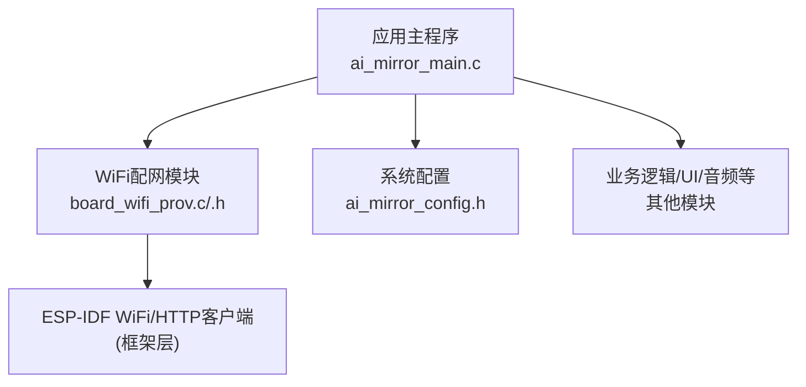
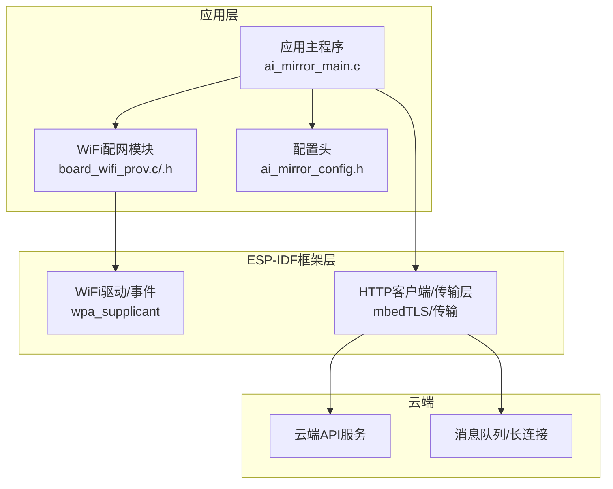
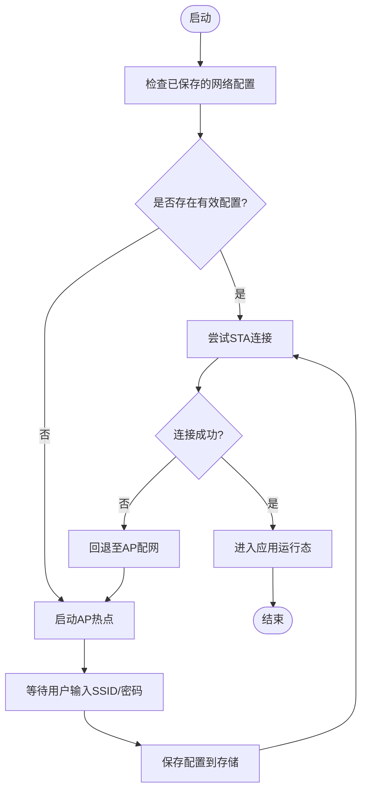
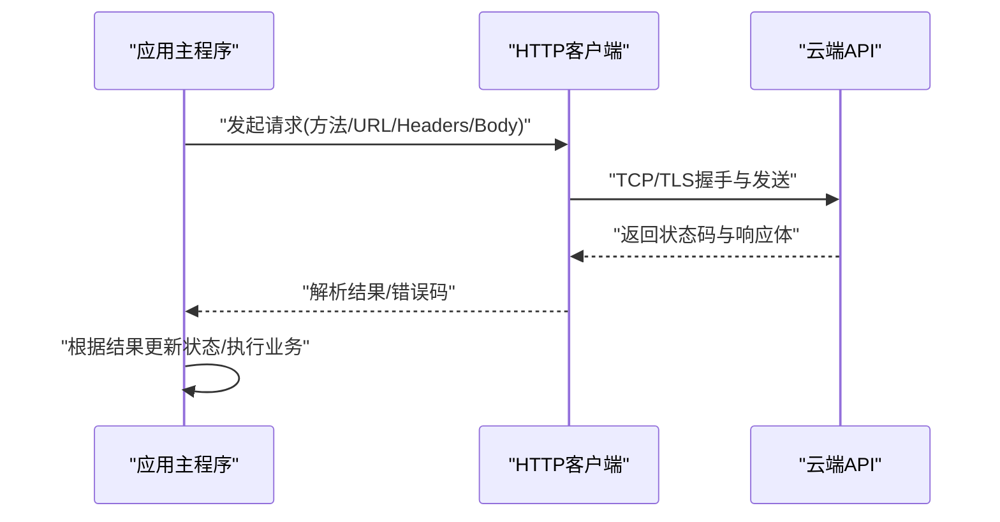
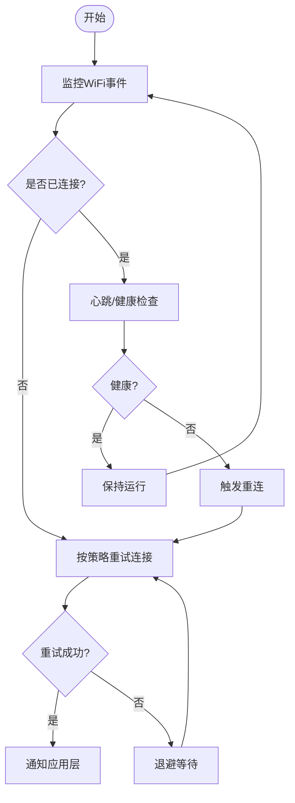
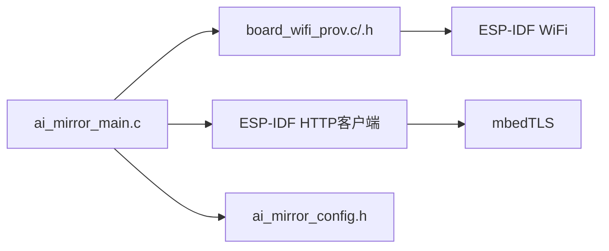

# 网络通信

<cite>
**本文引用的文件**   
- [Firmware/esp32_ai_mirror/main/board_wifi_prov.c](file://Firmware/esp32_ai_mirror/main/board_wifi_prov.c)
- [Firmware/esp32_ai_mirror/main/board_wifi_prov.h](file://Firmware/esp32_ai_mirror/main/board_wifi_prov.h)
- [Firmware/esp32_ai_mirror/main/ai_mirror_main.c](file://Firmware/esp32_ai_mirror/main/ai_mirror_main.c)
- [Firmware/esp32_ai_mirror/main/ai_mirror_config.h](file://Firmware/esp32_ai_mirror/main/ai_mirror_config.h)
- [Firmware/esp32_ai_mirror/WiFi配网功能计划书.md](file://Firmware/esp32_ai_mirror/WiFi配网功能计划书.md)
</cite>

## 目录
1. [简介](#简介)
2. [项目结构](#项目结构)
3. [核心组件](#核心组件)
4. [架构总览](#架构总览)
5. [详细组件分析](#详细组件分析)
6. [依赖关系分析](#依赖关系分析)
7. [性能考虑](#性能考虑)
8. [故障排查指南](#故障排查指南)
9. [结论](#结论)
10. [附录](#附录)

## 简介
本文件面向ESP32 AI镜像项目的网络通信子系统，聚焦WiFi连接管理、网络配置与远程通信能力。内容涵盖：
- WiFi Provisioning（配网）流程、AP模式与STA模式切换
- HTTP客户端实现要点、API调用与数据交换协议
- 网络状态监控、断线重连机制与错误处理策略
- 安全通信、证书管理与数据加密方案
- 云端服务集成方式与消息队列机制

说明：本项目以ESP-IDF为基础，使用官方WiFi与HTTP客户端栈，结合应用层模块完成设备配网、联网与云端交互。

## 项目结构
与网络通信相关的代码主要位于main目录，其中board_wifi_prov.*负责WiFi配网与模式控制，ai_mirror_main.c为应用入口并协调各子系统，ai_mirror_config.h提供编译期配置项。此外，项目根目录下包含“WiFi配网功能计划书”，用于指导配网流程设计与验收标准。

图表来源
- [Firmware/esp32_ai_mirror/main/ai_mirror_main.c](file://Firmware/esp32_ai_mirror/main/ai_mirror_main.c)
- [Firmware/esp32_ai_mirror/main/board_wifi_prov.c](file://Firmware/esp32_ai_mirror/main/board_wifi_prov.c)
- [Firmware/esp32_ai_mirror/main/board_wifi_prov.h](file://Firmware/esp32_ai_mirror/main/board_wifi_prov.h)
- [Firmware/esp32_ai_mirror/main/ai_mirror_config.h](file://Firmware/esp32_ai_mirror/main/ai_mirror_config.h)

章节来源
- [Firmware/esp32_ai_mirror/main/ai_mirror_main.c](file://Firmware/esp32_ai_mirror/main/ai_mirror_main.c)
- [Firmware/esp32_ai_mirror/main/board_wifi_prov.c](file://Firmware/esp32_ai_mirror/main/board_wifi_prov.c)
- [Firmware/esp32_ai_mirror/main/board_wifi_prov.h](file://Firmware/esp32_ai_mirror/main/board_wifi_prov.h)
- [Firmware/esp32_ai_mirror/main/ai_mirror_config.h](file://Firmware/esp32_ai_mirror/main/ai_mirror_config.h)
- [Firmware/esp32_ai_mirror/WiFi配网功能计划书.md](file://Firmware/esp32_ai_mirror/WiFi配网功能计划书.md)

## 核心组件
- WiFi配网模块（board_wifi_prov）
  - 职责：提供AP模式热点创建、二维码/口令配网、STA模式连接、连接状态上报与事件回调。
  - 关键接口：初始化、启动配网、停止配网、查询连接状态、获取IP/SSID等。
- 应用主程序（ai_mirror_main）
  - 职责：系统初始化、任务调度、事件分发；在WiFi就绪后触发HTTP客户端初始化与业务逻辑。
- 配置头（ai_mirror_config.h）
  - 职责：集中定义网络相关宏（如超时、重试次数、默认域名、端口、TLS开关等）。

章节来源
- [Firmware/esp32_ai_mirror/main/board_wifi_prov.c](file://Firmware/esp32_ai_mirror/main/board_wifi_prov.c)
- [Firmware/esp32_ai_mirror/main/board_wifi_prov.h](file://Firmware/esp32_ai_mirror/main/board_wifi_prov.h)
- [Firmware/esp32_ai_mirror/main/ai_mirror_main.c](file://Firmware/esp32_ai_mirror/main/ai_mirror_main.c)
- [Firmware/esp32_ai_mirror/main/ai_mirror_config.h](file://Firmware/esp32_ai_mirror/main/ai_mirror_config.h)

## 架构总览
整体采用分层设计：应用层通过WiFi配网模块接入ESP-IDF的WiFi与HTTP客户端栈，完成设备配网、联网与云端通信。

图表来源
- [Firmware/esp32_ai_mirror/main/ai_mirror_main.c](file://Firmware/esp32_ai_mirror/main/ai_mirror_main.c)
- [Firmware/esp32_ai_mirror/main/board_wifi_prov.c](file://Firmware/esp32_ai_mirror/main/board_wifi_prov.c)
- [Firmware/esp32_ai_mirror/main/board_wifi_prov.h](file://Firmware/esp32_ai_mirror/main/board_wifi_prov.h)
- [Firmware/esp32_ai_mirror/main/ai_mirror_config.h](file://Firmware/esp32_ai_mirror/main/ai_mirror_config.h)

## 详细组件分析

### WiFi配网模块（AP+STA）
- AP模式
  - 启动热点，承载配网页面或二维码信息，接收用户输入的SSID/密码。
  - 将凭据持久化到NVS/Flash，以便后续重启自动连接。
- STA模式
  - 使用保存的凭据连接目标路由器，成功后进入业务运行态。
  - 监听WiFi事件（连接成功、断开、DHCP失败等），向上层通知。
- 配网流程（典型）
  - 上电检测是否已有可用网络配置 → 若无则进入AP配网 → 用户通过手机App/小程序输入SSID/密码 → 写入配置 → 切换到STA连接 → 连接成功后返回应用层。

图表来源
- [Firmware/esp32_ai_mirror/main/board_wifi_prov.c](file://Firmware/esp32_ai_mirror/main/board_wifi_prov.c)
- [Firmware/esp32_ai_mirror/main/board_wifi_prov.h](file://Firmware/esp32_ai_mirror/main/board_wifi_prov.h)

章节来源
- [Firmware/esp32_ai_mirror/main/board_wifi_prov.c](file://Firmware/esp32_ai_mirror/main/board_wifi_prov.c)
- [Firmware/esp32_ai_mirror/main/board_wifi_prov.h](file://Firmware/esp32_ai_mirror/main/board_wifi_prov.h)
- [Firmware/esp32_ai_mirror/WiFi配网功能计划书.md](file://Firmware/esp32_ai_mirror/WiFi配网功能计划书.md)

### 应用主程序与事件协调
- 系统初始化阶段加载配置、初始化外设与网络栈。
- 订阅WiFi事件，当检测到连接建立后，初始化HTTP客户端与业务任务。
- 对配网模块进行启停控制，并在异常时执行恢复策略。

章节来源
- [Firmware/esp32_ai_mirror/main/ai_mirror_main.c](file://Firmware/esp32_ai_mirror/main/ai_mirror_main.c)
- [Firmware/esp32_ai_mirror/main/ai_mirror_config.h](file://Firmware/esp32_ai_mirror/main/ai_mirror_config.h)

### HTTP客户端与API调用
- 基于ESP-IDF HTTP客户端封装，支持GET/POST/PUT等常用方法。
- 请求构建：URL拼接、Header设置（鉴权、Content-Type）、Body序列化（JSON/表单）。
- 响应处理：状态码判断、JSON解析、错误码映射、超时与重试。
- 典型调用序列如下：

图表来源
- [Firmware/esp32_ai_mirror/main/ai_mirror_main.c](file://Firmware/esp32_ai_mirror/main/ai_mirror_main.c)
- [Firmware/esp32_ai_mirror/main/ai_mirror_config.h](file://Firmware/esp32_ai_mirror/main/ai_mirror_config.h)

章节来源
- [Firmware/esp32_ai_mirror/main/ai_mirror_main.c](file://Firmware/esp32_ai_mirror/main/ai_mirror_main.c)
- [Firmware/esp32_ai_mirror/main/ai_mirror_config.h](file://Firmware/esp32_ai_mirror/main/ai_mirror_config.h)

### 网络状态监控与重连机制
- 状态监控
  - 监听WiFi事件（连接、断开、DHCP分配、信号强度变化）。
  - 维护连接状态机（未连接/AP模式/连接中/已连接/认证失败/DHCP失败）。
- 重连策略
  - 指数退避重试，限制最大重试次数与重试间隔。
  - 失败回退：若多次失败则回到AP配网，提示用户重新输入。
  - 心跳保活：周期性Ping或轻量API探测，快速发现断线。

图表来源
- [Firmware/esp32_ai_mirror/main/board_wifi_prov.c](file://Firmware/esp32_ai_mirror/main/board_wifi_prov.c)
- [Firmware/esp32_ai_mirror/main/ai_mirror_main.c](file://Firmware/esp32_ai_mirror/main/ai_mirror_main.c)

章节来源
- [Firmware/esp32_ai_mirror/main/board_wifi_prov.c](file://Firmware/esp32_ai_mirror/main/board_wifi_prov.c)
- [Firmware/esp32_ai_mirror/main/ai_mirror_main.c](file://Firmware/esp32_ai_mirror/main/ai_mirror_main.c)

### 安全通信、证书管理与数据加密
- TLS启用与证书校验
  - 在HTTP客户端初始化时启用TLS，加载CA证书或服务器证书。
  - 支持自定义证书注入与过期时间检查。
- 密钥与凭据管理
  - 敏感信息（如Token、私钥）建议存储在安全区域（NVS加密分区或外部安全元件）。
  - 避免硬编码，使用运行时配置或安全下载。
- 传输加密
  - 强制HTTPS，禁用弱加密套件，启用前向保密（如ECDHE）。
- 防重放与完整性
  - 请求签名、时间戳与随机数，服务端校验防止重放。

章节来源
- [Firmware/esp32_ai_mirror/main/ai_mirror_config.h](file://Firmware/esp32_ai_mirror/main/ai_mirror_config.h)
- [Firmware/esp32_ai_mirror/main/ai_mirror_main.c](file://Firmware/esp32_ai_mirror/main/ai_mirror_main.c)

### 云端服务集成与消息队列
- 集成方式
  - RESTful API：用于配置下发、指令控制、状态上报。
  - 长连接（WebSocket/MQTT）：用于实时消息推送与双向通信。
- 消息队列机制
  - 本地队列缓冲上行消息，网络恢复后批量上报。
  - 下行消息消费优先级与去重，避免重复处理。
- 幂等与一致性
  - 请求ID与幂等键，确保重复提交不产生副作用。
  - 事务性操作在服务端保证最终一致。

章节来源
- [Firmware/esp32_ai_mirror/main/ai_mirror_main.c](file://Firmware/esp32_ai_mirror/main/ai_mirror_main.c)
- [Firmware/esp32_ai_mirror/main/ai_mirror_config.h](file://Firmware/esp32_ai_mirror/main/ai_mirror_config.h)

## 依赖关系分析
- 模块耦合
  - 应用主程序依赖WiFi配网模块与HTTP客户端。
  - WiFi配网模块依赖ESP-IDF WiFi事件与存储接口。
- 外部依赖
  - ESP-IDF的WiFi、HTTP客户端、TLS库（mbedTLS）。
  - 可选：NVS加密、外部安全元件。
- 潜在循环依赖
  - 应避免应用层与配网模块互相直接调用，通过事件/回调解耦。

图表来源
- [Firmware/esp32_ai_mirror/main/ai_mirror_main.c](file://Firmware/esp32_ai_mirror/main/ai_mirror_main.c)
- [Firmware/esp32_ai_mirror/main/board_wifi_prov.c](file://Firmware/esp32_ai_mirror/main/board_wifi_prov.c)
- [Firmware/esp32_ai_mirror/main/board_wifi_prov.h](file://Firmware/esp32_ai_mirror/main/board_wifi_prov.h)
- [Firmware/esp32_ai_mirror/main/ai_mirror_config.h](file://Firmware/esp32_ai_mirror/main/ai_mirror_config.h)

章节来源
- [Firmware/esp32_ai_mirror/main/ai_mirror_main.c](file://Firmware/esp32_ai_mirror/main/ai_mirror_main.c)
- [Firmware/esp32_ai_mirror/main/board_wifi_prov.c](file://Firmware/esp32_ai_mirror/main/board_wifi_prov.c)
- [Firmware/esp32_ai_mirror/main/board_wifi_prov.h](file://Firmware/esp32_ai_mirror/main/board_wifi_prov.h)
- [Firmware/esp32_ai_mirror/main/ai_mirror_config.h](file://Firmware/esp32_ai_mirror/main/ai_mirror_config.h)

## 性能考虑
- 连接与会话
  - 复用HTTP连接，减少握手开销。
  - 合理设置超时与Keep-Alive，避免频繁重建连接。
- 内存与CPU
  - JSON解析使用流式解析，降低峰值内存占用。
  - 大文件分块上传/下载，避免阻塞。
- 功耗
  - 空闲时关闭不必要的射频活动，按需唤醒。
  - 心跳间隔自适应，根据网络质量动态调整。

[本节为通用指导，不直接分析具体文件]

## 故障排查指南
- 常见问题定位
  - 无法连接WiFi：检查SSID/密码、路由器设置、信号强度与DHCP分配。
  - HTTPS失败：确认证书链完整、时间同步正确、TLS套件兼容。
  - API调用失败：核对URL、Header、Body格式与服务端状态码。
- 日志与调试
  - 开启WiFi与HTTP客户端调试日志，记录握手与报文摘要。
  - 打印连接状态机变化与重试计数，辅助定位问题。
- 恢复策略
  - 自动回退到AP配网，引导用户重新输入。
  - 清理无效缓存与临时会话，避免脏状态影响。

章节来源
- [Firmware/esp32_ai_mirror/main/board_wifi_prov.c](file://Firmware/esp32_ai_mirror/main/board_wifi_prov.c)
- [Firmware/esp32_ai_mirror/main/ai_mirror_main.c](file://Firmware/esp32_ai_mirror/main/ai_mirror_main.c)

## 结论
本项目的网络通信子系统围绕ESP-IDF的WiFi与HTTP栈，结合应用层配网模块实现了可靠的设备联网与云端交互。通过清晰的分层与事件驱动设计，系统在稳定性、安全性与可维护性方面具备良好基础。建议在后续迭代中强化证书管理、消息幂等性与性能监控，以提升用户体验与运维效率。

[本节为总结性内容，不直接分析具体文件]

## 附录
- 术语
  - AP模式：设备作为热点，供手机等设备连接并输入网络配置。
  - STA模式：设备作为站点，连接现有路由器上网。
  - Provisioning：配网，指将网络凭据写入设备的过程。
- 参考文档
  - WiFi配网功能计划书：用于指导配网流程设计与验收标准。

章节来源
- [Firmware/esp32_ai_mirror/WiFi配网功能计划书.md](file://Firmware/esp32_ai_mirror/WiFi配网功能计划书.md)