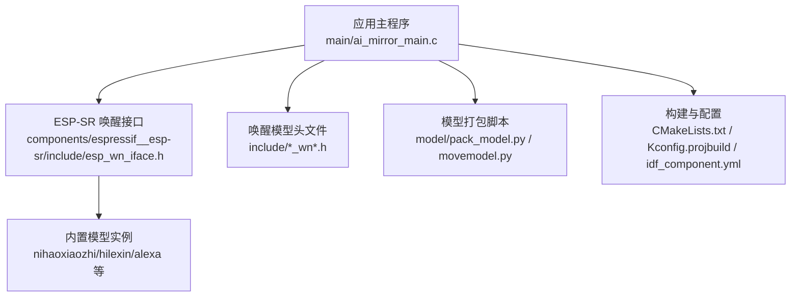
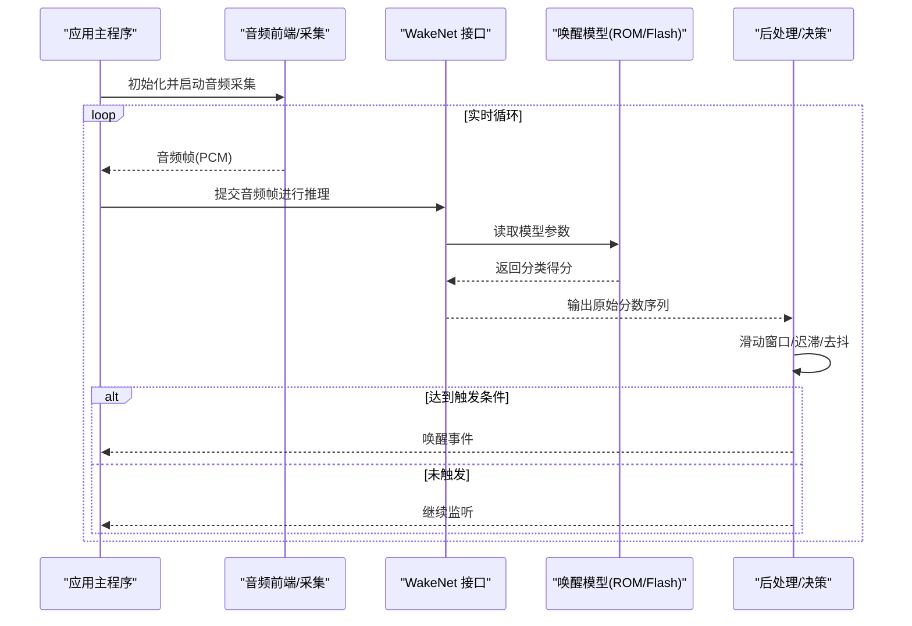
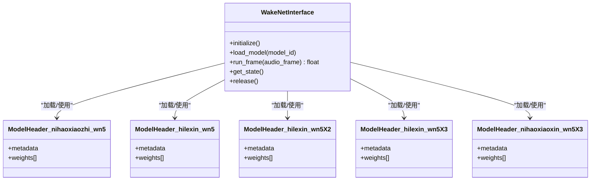
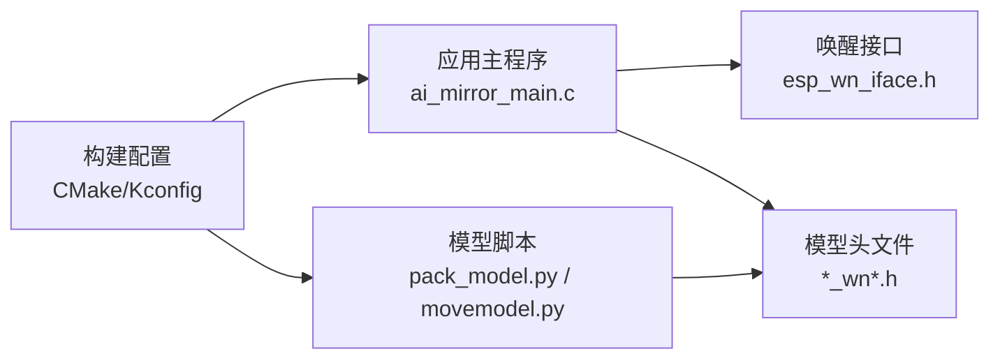

# 唤醒词检测

<cite>
**本文引用的文件**   
- [ai_mirror_main.c](file://Firmware/esp32_ai_mirror/main/ai_mirror_main.c)
- [ai_mirror_config.h](file://Firmware/esp32_ai_mirror/main/ai_mirror_config.h)
- [CMakeLists.txt](file://Firmware/esp32_ai_mirror/main/CMakeLists.txt)
- [Kconfig.projbuild](file://Firmware/esp32_ai_mirror/main/Kconfig.projbuild)
- [idf_component.yml](file://Firmware/esp32_ai_mirror/main/idf_component.yml)
- [esp_wn_iface.h](file://Firmware/esp32_ai_mirror/components/espressif__esp-sr/include/esp_wn_iface.h)
- [esp_wn_models.h](file://Firmware/esp32_ai_mirror/components/espressif__esp-sr/include/esp_wn_models.h)
- [nihaoxiaozhi_wn5.h](file://Firmware/esp32_ai_mirror/components/espressif__esp-sr/include/nihaoxiaozhi_wn5.h)
- [hilexin_wn5.h](file://Firmware/esp32_ai_mirror/components/espressif__esp-sr/include/hilexin_wn5.h)
- [hilexin_wn5X2.h](file://Firmware/esp32_ai_mirror/components/espressif__esp-sr/include/hilexin_wn5X2.h)
- [hilexin_wn5X3.h](file://Firmware/esp32_ai_mirror/components/espressif__esp-sr/include/hilexin_wn5X3.h)
- [nihaoxiaoxin_wn5X3.h](file://Firmware/esp32_ai_mirror/components/espressif__esp-sr/include/nihaoxiaoxin_wn5X3.h)
- [movemodel.py](file://Firmware/esp32_ai_mirror/components/espressif__esp-sr/model/movemodel.py)
- [pack_model.py](file://Firmware/esp32_ai_mirror/components/espressif__esp-sr/model/pack_model.py)
- [unity_wakenet.c](file://Firmware/esp32_ai_mirror/components/espressif__esp-sr/test/unity_wakenet.c)
- [README.md](file://Firmware/esp32_ai_mirror/components/espressif__esp-sr/README.md)
</cite>

## 目录
1. [简介](#简介)
2. [项目结构](#项目结构)
3. [核心组件](#核心组件)
4. [架构总览](#架构总览)
5. [详细组件分析](#详细组件分析)
6. [依赖关系分析](#依赖关系分析)
7. [性能与实时性优化](#性能与实时性优化)
8. [故障排查指南](#故障排查指南)
9. [结论](#结论)
10. [附录：自定义唤醒词训练与部署](#附录自定义唤醒词训练与部署)

## 简介
本文件围绕“唤醒词检测”功能，系统性阐述 WakeNet 唤醒模型在 ESP32 平台上的工作原理、集成方式与调优方法。内容涵盖：
- WakeNet 的算法流程与关键阶段（音频采集、预处理、特征提取、模型推理、后处理）
- 支持的唤醒词模型（如 nihaoxiaozhi、hilexin、alexa 等）及其配置要点
- 唤醒阈值设置、误触发率控制与响应时间优化策略
- 自定义唤醒词的训练、模型转换与部署步骤
- 与音频采集模块的集成方式和实时检测性能调优实践

## 项目结构
本项目基于 ESP-IDF，唤醒词检测能力由 esp-sr 组件提供，应用层通过 main 工程进行集成与调度。关键目录与职责如下：
- Firmware/esp32_ai_mirror/main：应用主程序与配置入口，负责初始化音频、加载唤醒模型、启动检测任务
- components/espressif__esp-sr：ESP-SR 组件，包含 WakeNet 接口、内置唤醒词模型头文件、模型打包脚本与测试用例
- managed_components：第三方组件（如 LVGL、Codec 驱动等），与唤醒链路间接相关

图表来源 
- [ai_mirror_main.c](file://Firmware/esp32_ai_mirror/main/ai_mirror_main.c)
- [esp_wn_iface.h](file://Firmware/esp32_ai_mirror/components/espressif__esp-sr/include/esp_wn_iface.h)
- [nihaoxiaozhi_wn5.h](file://Firmware/esp32_ai_mirror/components/espressif__esp-sr/include/nihaoxiaozhi_wn5.h)
- [hilexin_wn5.h](file://Firmware/esp32_ai_mirror/components/espressif__esp-sr/include/hilexin_wn5.h)
- [pack_model.py](file://Firmware/esp32_ai_mirror/components/espressif__esp-sr/model/pack_model.py)
- [movemodel.py](file://Firmware/esp32_ai_mirror/components/espressif__esp-sr/model/movemodel.py)
- [CMakeLists.txt](file://Firmware/esp32_ai_mirror/main/CMakeLists.txt)
- [Kconfig.projbuild](file://Firmware/esp32_ai_mirror/main/Kconfig.projbuild)
- [idf_component.yml](file://Firmware/esp32_ai_mirror/main/idf_component.yml)

章节来源
- [ai_mirror_main.c](file://Firmware/esp32_ai_mirror/main/ai_mirror_main.c)
- [idf_component.yml](file://Firmware/esp32_ai_mirror/main/idf_component.yml)
- [CMakeLists.txt](file://Firmware/esp32_ai_mirror/main/CMakeLists.txt)
- [Kconfig.projbuild](file://Firmware/esp32_ai_mirror/main/Kconfig.projbuild)

## 核心组件
- 唤醒接口与模型管理
  - 唤醒接口定义与生命周期管理位于 esp_wn_iface.h，提供模型加载、帧级推理、结果聚合等能力
  - 模型头文件集中声明各唤醒词模型的权重与元数据，便于编译期嵌入与运行时选择
- 应用集成
  - 主程序负责初始化音频采集、创建并运行唤醒检测任务、调用唤醒接口进行推理与后处理
- 模型工具链
  - pack_model.py 与 movemodel.py 用于将训练得到的模型转换为可在 ESP32 上直接使用的嵌入式格式

章节来源
- [esp_wn_iface.h](file://Firmware/esp32_ai_mirror/components/espressif__esp-sr/include/esp_wn_iface.h)
- [esp_wn_models.h](file://Firmware/esp32_ai_mirror/components/espressif__esp-sr/include/esp_wn_models.h)
- [nihaoxiaozhi_wn5.h](file://Firmware/esp32_ai_mirror/components/espressif__esp-sr/include/nihaoxiaozhi_wn5.h)
- [hilexin_wn5.h](file://Firmware/esp32_ai_mirror/components/espressif__esp-sr/include/hilexin_wn5.h)
- [hilexin_wn5X2.h](file://Firmware/esp32_ai_mirror/components/espressif__esp-sr/include/hilexin_wn5X2.h)
- [hilexin_wn5X3.h](file://Firmware/esp32_ai_mirror/components/espressif__esp-sr/include/hilexin_wn5X3.h)
- [nihaoxiaoxin_wn5X3.h](file://Firmware/esp32_ai_mirror/components/espressif__esp-sr/include/nihaoxiaoxin_wn5X3.h)
- [pack_model.py](file://Firmware/esp32_ai_mirror/components/espressif__esp-sr/model/pack_model.py)
- [movemodel.py](file://Firmware/esp32_ai_mirror/components/espressif__esp-sr/model/movemodel.py)

## 架构总览
WakeNet 唤醒链路从音频采集到触发事件的整体流程如下：

图表来源 
- [ai_mirror_main.c](file://Firmware/esp32_ai_mirror/main/ai_mirror_main.c)
- [esp_wn_iface.h](file://Firmware/esp32_ai_mirror/components/espressif__esp-sr/include/esp_wn_iface.h)
- [nihaoxiaozhi_wn5.h](file://Firmware/esp32_ai_mirror/components/espressif__esp-sr/include/nihaoxiaozhi_wn5.h)
- [hilexin_wn5.h](file://Firmware/esp32_ai_mirror/components/espressif__esp-sr/include/hilexin_wn5.h)

## 详细组件分析

### 唤醒接口与模型头文件
- esp_wn_iface.h：定义唤醒引擎的初始化、模型加载、帧推理、状态查询等 API；是应用与模型之间的契约
- esp_wn_models.h：统一暴露可用模型类型与枚举，便于上层按名称或索引选择模型
- 具体模型头文件（如 nihaoxiaozhi_wn5.h、hilexin_wn5.h 等）：内嵌模型权重与元数据，供运行时直接映射到内存

图表来源 
- [esp_wn_iface.h](file://Firmware/esp32_ai_mirror/components/espressif__esp-sr/include/esp_wn_iface.h)
- [esp_wn_models.h](file://Firmware/esp32_ai_mirror/components/espressif__esp-sr/include/esp_wn_models.h)
- [nihaoxiaozhi_wn5.h](file://Firmware/esp32_ai_mirror/components/espressif__esp-sr/include/nihaoxiaozhi_wn5.h)
- [hilexin_wn5.h](file://Firmware/esp32_ai_mirror/components/espressif__esp-sr/include/hilexin_wn5.h)
- [hilexin_wn5X2.h](file://Firmware/esp32_ai_mirror/components/espressif__esp-sr/include/hilexin_wn5X2.h)
- [hilexin_wn5X3.h](file://Firmware/esp32_ai_mirror/components/espressif__esp-sr/include/hilexin_wn5X3.h)
- [nihaoxiaoxin_wn5X3.h](file://Firmware/esp32_ai_mirror/components/espressif__esp-sr/include/nihaoxiaoxin_wn5X3.h)

章节来源
- [esp_wn_iface.h](file://Firmware/esp32_ai_mirror/components/espressif__esp-sr/include/esp_wn_iface.h)
- [esp_wn_models.h](file://Firmware/esp32_ai_mirror/components/espressif__esp-sr/include/esp_wn_models.h)
- [nihaoxiaozhi_wn5.h](file://Firmware/esp32_ai_mirror/components/espressif__esp-sr/include/nihaoxiaozhi_wn5.h)
- [hilexin_wn5.h](file://Firmware/esp32_ai_mirror/components/espressif__esp-sr/include/hilexin_wn5.h)
- [hilexin_wn5X2.h](file://Firmware/esp32_ai_mirror/components/espressif__esp-sr/include/hilexin_wn5X2.h)
- [hilexin_wn5X3.h](file://Firmware/esp32_ai_mirror/components/espressif__esp-sr/include/hilexin_wn5X3.h)
- [nihaoxiaoxin_wn5X3.h](file://Firmware/esp32_ai_mirror/components/espressif__esp-sr/include/nihaoxiaoxin_wn5X3.h)

### 应用集成与任务调度
- 主程序负责：
  - 初始化音频采集（I2S/Codec 驱动）
  - 根据配置选择并加载对应唤醒模型
  - 创建后台任务周期性获取音频帧并调用唤醒接口
  - 对唤醒结果进行后处理（阈值、迟滞、去抖）并上报事件
- 构建系统：
  - CMakeLists.txt 指定组件依赖与源文件
  - Kconfig.projbuild 暴露可配置项（如模型选择、采样率、缓冲区大小等）
  - idf_component.yml 声明外部组件版本与来源

章节来源
- [ai_mirror_main.c](file://Firmware/esp32_ai_mirror/main/ai_mirror_main.c)
- [CMakeLists.txt](file://Firmware/esp32_ai_mirror/main/CMakeLists.txt)
- [Kconfig.projbuild](file://Firmware/esp32_ai_mirror/main/Kconfig.projbuild)
- [idf_component.yml](file://Firmware/esp32_ai_mirror/main/idf_component.yml)

### 模型打包与转换
- pack_model.py：将训练产出的模型权重与配置文件打包为可直接嵌入固件的二进制/头文件
- movemodel.py：协助移动/重命名/组织模型文件，便于不同目标平台适配

章节来源
- [pack_model.py](file://Firmware/esp32_ai_mirror/components/espressif__esp-sr/model/pack_model.py)
- [movemodel.py](file://Firmware/esp32_ai_mirror/components/espressif__esp-sr/model/movemodel.py)

### 测试与验证
- unity_wakenet.c：提供唤醒引擎的单元测试样例，可用于验证接口行为与基本流程

章节来源
- [unity_wakenet.c](file://Firmware/esp32_ai_mirror/components/espressif__esp-sr/test/unity_wakenet.c)

## 依赖关系分析
- 应用层依赖 esp-sr 组件提供的唤醒接口与模型头文件
- 构建系统通过 CMake/Kconfig 将模型头文件与脚本产物链接进固件
- 运行时模型以只读形式驻留于 ROM/Flash，避免频繁 I/O

图表来源 
- [ai_mirror_main.c](file://Firmware/esp32_ai_mirror/main/ai_mirror_main.c)
- [esp_wn_iface.h](file://Firmware/esp32_ai_mirror/components/espressif__esp-sr/include/esp_wn_iface.h)
- [nihaoxiaozhi_wn5.h](file://Firmware/esp32_ai_mirror/components/espressif__esp-sr/include/nihaoxiaozhi_wn5.h)
- [hilexin_wn5.h](file://Firmware/esp32_ai_mirror/components/espressif__esp-sr/include/hilexin_wn5.h)
- [pack_model.py](file://Firmware/esp32_ai_mirror/components/espressif__esp-sr/model/pack_model.py)
- [movemodel.py](file://Firmware/esp32_ai_mirror/components/espressif__esp-sr/model/movemodel.py)
- [CMakeLists.txt](file://Firmware/esp32_ai_mirror/main/CMakeLists.txt)
- [Kconfig.projbuild](file://Firmware/esp32_ai_mirror/main/Kconfig.projbuild)

章节来源
- [CMakeLists.txt](file://Firmware/esp32_ai_mirror/main/CMakeLists.txt)
- [Kconfig.projbuild](file://Firmware/esp32_ai_mirror/main/Kconfig.projbuild)
- [idf_component.yml](file://Firmware/esp32_ai_mirror/main/idf_component.yml)

## 性能与实时性优化
- 音频采集
  - 合理设置采样率与帧长，平衡特征分辨率与计算开销
  - 使用 DMA 与环形缓冲降低 CPU 占用与丢帧风险
- 特征与推理
  - 采用定点化/量化模型以降低运算量与内存带宽
  - 批处理多帧推理时注意缓存命中与内存对齐
- 后处理
  - 滑动窗口长度与迟滞阈值需结合场景噪声水平调参
  - 引入静音段检测与能量门限减少无效推理
- 资源与功耗
  - 空闲时降低任务优先级或进入低功耗模式
  - 动态切换模型复杂度（如 X2/X3）以适应不同设备

[本节为通用指导，不直接分析具体文件]

## 故障排查指南
- 无法加载模型
  - 检查模型头文件是否被正确包含与链接
  - 确认构建配置启用了相应模型选项
- 误触发率高
  - 调整后处理阈值与窗口长度
  - 增加环境噪声样本参与训练或增强
- 漏触发或延迟大
  - 增大输入帧长度或提高采样率
  - 优化推理路径（启用 SIMD/并行）
- 音频异常
  - 校验 I2S/Codec 驱动初始化顺序与时钟配置
  - 检查缓冲区大小与中断优先级

章节来源
- [README.md](file://Firmware/esp32_ai_mirror/components/espressif__esp-sr/README.md)
- [unity_wakenet.c](file://Firmware/esp32_ai_mirror/components/espressif__esp-sr/test/unity_wakenet.c)

## 结论
WakeNet 在 ESP32 平台上通过标准化接口与内嵌模型实现了低延迟、低功耗的唤醒词检测。通过合理的音频前端设计、模型量化与后处理策略，可以在保证误触发率的同时获得稳定的响应时间。借助 esp-sr 提供的模型头文件与打包脚本，开发者可快速集成官方模型或部署自定义唤醒词。

[本节为总结性内容，不直接分析具体文件]

## 附录：自定义唤醒词训练与部署
- 训练准备
  - 收集正负样本（唤醒词与非唤醒词），确保覆盖多样环境与说话人
  - 数据增强（加噪、混响、变速变调）提升鲁棒性
- 模型训练
  - 使用 esp-sr 训练管线生成初始模型权重与配置文件
  - 针对目标硬件进行量化/剪枝，得到 wnX 系列模型
- 模型转换与打包
  - 使用 pack_model.py 将权重与配置打包为嵌入式头文件或二进制
  - 使用 movemodel.py 整理模型文件结构，便于多目标平台复用
- 集成与验证
  - 将生成的模型头文件加入 include 目录并在构建系统中启用
  - 在主程序中加载模型并接入音频采集链路
  - 通过 unity_wakenet.c 的测试用例验证接口行为
- 部署与调优
  - 根据现场噪声与功耗约束调整阈值、窗口长度与模型复杂度
  - 持续收集误触发/漏触发样本，迭代训练与量化

章节来源
- [pack_model.py](file://Firmware/esp32_ai_mirror/components/espressif__esp-sr/model/pack_model.py)
- [movemodel.py](file://Firmware/esp32_ai_mirror/components/espressif__esp-sr/model/movemodel.py)
- [unity_wakenet.c](file://Firmware/esp32_ai_mirror/components/espressif__esp-sr/test/unity_wakenet.c)
- [README.md](file://Firmware/esp32_ai_mirror/components/espressif__esp-sr/README.md)