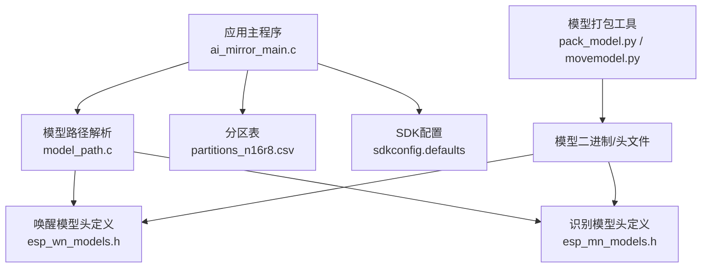
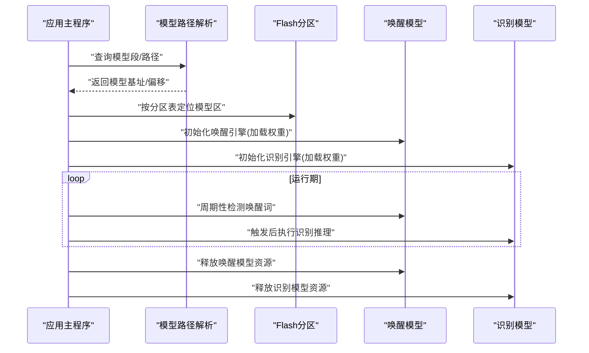
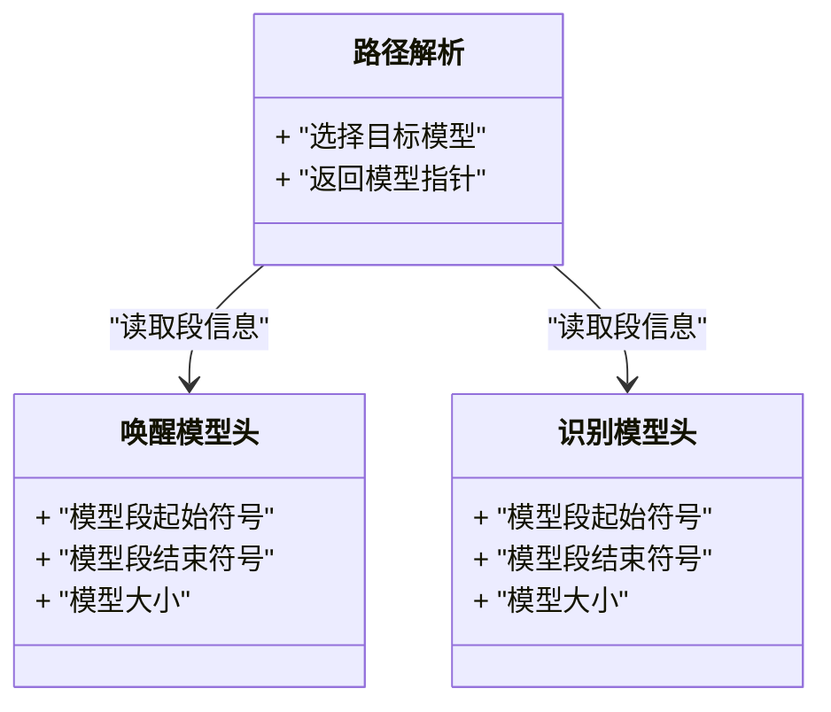
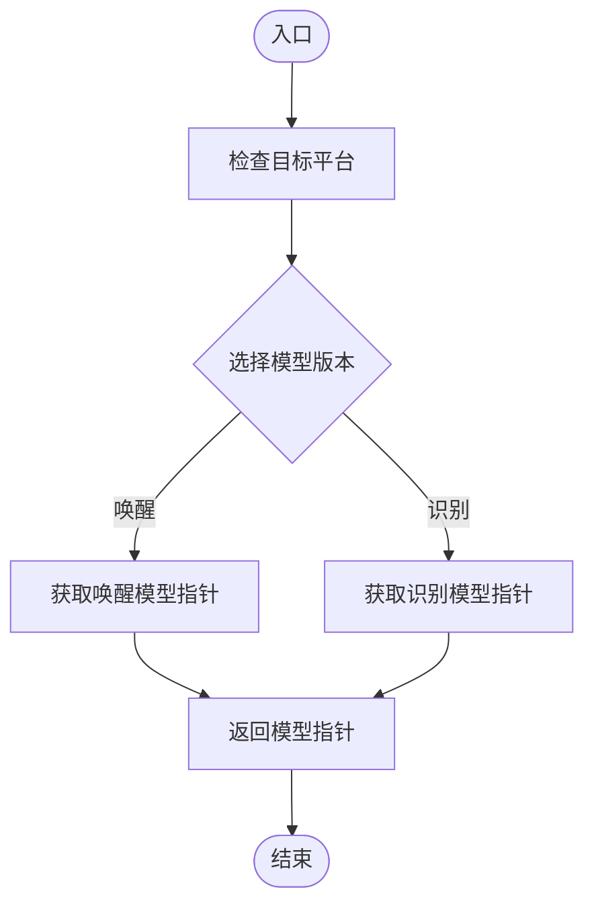
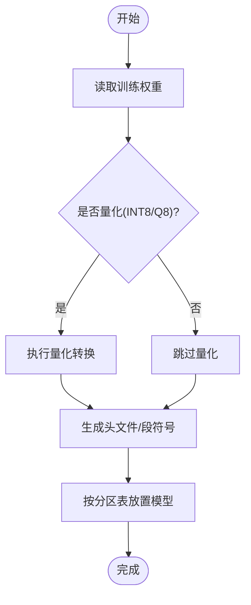
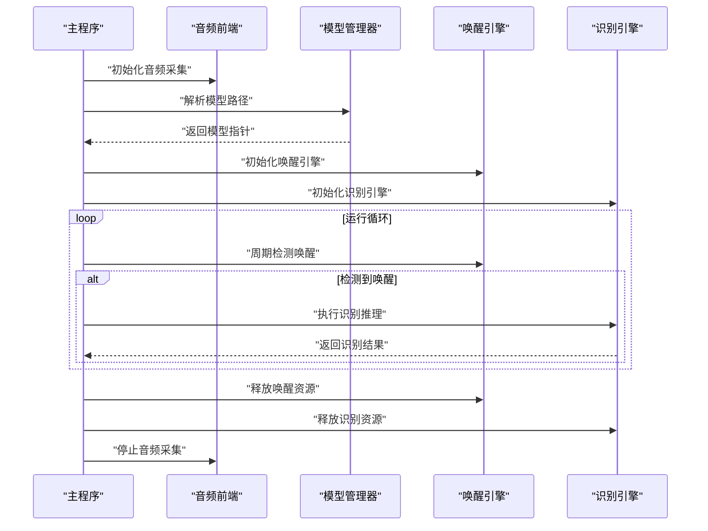
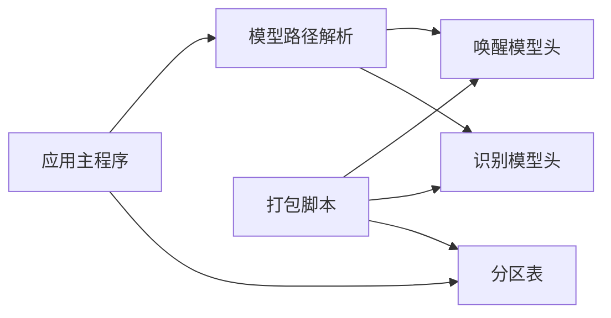

# 模型管理

<cite>
**本文引用的文件**   
- [Firmware/esp32_ai_mirror/components/espressif__esp-sr/model/pack_model.py](file://Firmware/esp32_ai_mirror/components/espressif__esp-sr/model/pack_model.py)
- [Firmware/esp32_ai_mirror/components/espressif__esp-sr/model/movemodel.py](file://Firmware/esp32_ai_mirror/components/espressif__esp-sr/model/movemodel.py)
- [Firmware/esp32_ai_mirror/components/espressif__esp-sr/include/esp32/esp_wn_models.h](file://Firmware/esp32_ai_mirror/components/espressif__esp-sr/include/esp32/esp_wn_models.h)
- [Firmware/esp32_ai_mirror/components/espressif__esp-sr/include/esp32/esp_mn_models.h](file://Firmware/esp32_ai_mirror/components/espressif__esp-sr/include/esp32/esp_mn_models.h)
- [Firmware/esp32_ai_mirror/components/espressif__esp-sr/src/model_path.c](file://Firmware/esp32_ai_mirror/components/espressif__esp-sr/src/model_path.c)
- [Firmware/esp32_ai_mirror/main/ai_mirror_main.c](file://Firmware/esp32_ai_mirror/main/ai_mirror_main.c)
- [Firmware/esp32_ai_mirror/partitions_n16r8.csv](file://Firmware/esp32_ai_mirror/partitions_n16r8.csv)
- [Firmware/esp32_ai_mirror/sdkconfig.defaults](file://Firmware/esp32_ai_mirror/sdkconfig.defaults)
</cite>

## 目录
1. [简介](#简介)
2. [项目结构](#项目结构)
3. [核心组件](#核心组件)
4. [架构总览](#架构总览)
5. [详细组件分析](#详细组件分析)
6. [依赖关系分析](#依赖关系分析)
7. [性能考量](#性能考量)
8. [故障排查指南](#故障排查指南)
9. [结论](#结论)
10. [附录](#附录)

## 简介
本文件面向“AI镜像”项目中与语音识别相关的模型管理功能，覆盖唤醒模型与识别模型的加载、初始化与生命周期管理；说明模型文件格式、存储位置与内存分配策略；解释量化（INT8/Q8）与压缩的应用；阐述模型更新机制、动态加载与多模型切换；提供性能监控、内存分析与调试方法；并说明与Flash存储的交互及OTA升级支持。

## 项目结构
本项目基于ESP-IDF构建，模型相关代码主要位于：
- esp-sr组件：包含唤醒模型与识别模型的头文件定义、打包脚本与路径解析实现
- main应用：负责系统启动流程、分区表配置与运行时资源调度
- 分区表与SDK配置：决定模型在Flash中的布局与编译期选项

图表来源 
- [Firmware/esp32_ai_mirror/main/ai_mirror_main.c](file://Firmware/esp32_ai_mirror/main/ai_mirror_main.c)
- [Firmware/esp32_ai_mirror/components/espressif__esp-sr/src/model_path.c](file://Firmware/esp32_ai_mirror/components/espressif__esp-sr/src/model_path.c)
- [Firmware/esp32_ai_mirror/components/espressif__esp-sr/include/esp32/esp_wn_models.h](file://Firmware/esp32_ai_mirror/components/espressif__esp-sr/include/esp32/esp_wn_models.h)
- [Firmware/esp32_ai_mirror/components/espressif__esp-sr/include/esp32/esp_mn_models.h](file://Firmware/esp32_ai_mirror/components/espressif__esp-sr/include/esp32/esp_mn_models.h)
- [Firmware/esp32_ai_mirror/components/espressif__esp-sr/model/pack_model.py](file://Firmware/esp32_ai_mirror/components/espressif__esp-sr/model/pack_model.py)
- [Firmware/esp32_ai_mirror/components/espressif__esp-sr/model/movemodel.py](file://Firmware/esp32_ai_mirror/components/espressif__esp-sr/model/movemodel.py)
- [Firmware/esp32_ai_mirror/partitions_n16r8.csv](file://Firmware/esp32_ai_mirror/partitions_n16r8.csv)
- [Firmware/esp32_ai_mirror/sdkconfig.defaults](file://Firmware/esp32_ai_mirror/sdkconfig.defaults)

章节来源
- [Firmware/esp32_ai_mirror/main/ai_mirror_main.c](file://Firmware/esp32_ai_mirror/main/ai_mirror_main.c)
- [Firmware/esp32_ai_mirror/components/espressif__esp-sr/src/model_path.c](file://Firmware/esp32_ai_mirror/components/espressif__esp-sr/src/model_path.c)
- [Firmware/esp32_ai_mirror/components/espressif__esp-sr/include/esp32/esp_wn_models.h](file://Firmware/esp32_ai_mirror/components/espressif__esp-sr/include/esp32/esp_wn_models.h)
- [Firmware/esp32_ai_mirror/components/espressif__esp-sr/include/esp32/esp_mn_models.h](file://Firmware/esp32_ai_mirror/components/espressif__esp-sr/include/esp32/esp_mn_models.h)
- [Firmware/esp32_ai_mirror/components/espressif__esp-sr/model/pack_model.py](file://Firmware/esp32_ai_mirror/components/espressif__esp-sr/model/pack_model.py)
- [Firmware/esp32_ai_mirror/components/espressif__esp-sr/model/movemodel.py](file://Firmware/esp32_ai_mirror/components/espressif__esp-sr/model/movemodel.py)
- [Firmware/esp32_ai_mirror/partitions_n16r8.csv](file://Firmware/esp32_ai_mirror/partitions_n16r8.csv)
- [Firmware/esp32_ai_mirror/sdkconfig.defaults](file://Firmware/esp32_ai_mirror/sdkconfig.defaults)

## 核心组件
- 模型头文件与符号导出：用于声明唤醒与识别模型的段起始/结束地址或指针，供运行时查找与映射
- 模型路径解析：根据目标平台与配置选择正确的模型段或路径
- 模型打包与移动：将训练好的权重转换为嵌入式可用的二进制/头文件，并按分区表布局放置
- 应用启动与生命周期：初始化音频前端、加载模型、进入推理循环、释放资源

章节来源
- [Firmware/esp32_ai_mirror/components/espressif__esp-sr/include/esp32/esp_wn_models.h](file://Firmware/esp32_ai_mirror/components/espressif__esp-sr/include/esp32/esp_wn_models.h)
- [Firmware/esp32_ai_mirror/components/espressif__esp-sr/include/esp32/esp_mn_models.h](file://Firmware/esp32_ai_mirror/components/espressif__esp-sr/include/esp32/esp_mn_models.h)
- [Firmware/esp32_ai_mirror/components/espressif__esp-sr/src/model_path.c](file://Firmware/esp32_ai_mirror/components/espressif__esp-sr/src/model_path.c)
- [Firmware/esp32_ai_mirror/components/espressif__esp-sr/model/pack_model.py](file://Firmware/esp32_ai_mirror/components/espressif__esp-sr/model/pack_model.py)
- [Firmware/esp32_ai_mirror/components/espressif__esp-sr/model/movemodel.py](file://Firmware/esp32_ai_mirror/components/espressif__esp-sr/model/movemodel.py)
- [Firmware/esp32_ai_mirror/main/ai_mirror_main.c](file://Firmware/esp32_ai_mirror/main/ai_mirror_main.c)

## 架构总览
下图展示从应用启动到模型加载、推理与释放的整体流程，以及Flash分区与模型数据的关系。

图表来源 
- [Firmware/esp32_ai_mirror/main/ai_mirror_main.c](file://Firmware/esp32_ai_mirror/main/ai_mirror_main.c)
- [Firmware/esp32_ai_mirror/components/espressif__esp-sr/src/model_path.c](file://Firmware/esp32_ai_mirror/components/espressif__esp-sr/src/model_path.c)
- [Firmware/esp32_ai_mirror/partitions_n16r8.csv](file://Firmware/esp32_ai_mirror/partitions_n16r8.csv)

## 详细组件分析

### 模型头文件与符号导出（唤醒与识别）
- 作用：为链接器与应用暴露模型段的边界或指针，便于运行时直接访问Flash中的模型数据
- 关键内容：
  - 唤醒模型符号：定义不同唤醒模型的段名与大小
  - 识别模型符号：定义多语言/多版本的识别模型段信息
- 使用方式：通过路径解析模块获取具体模型段指针，再交给对应引擎初始化

图表来源 
- [Firmware/esp32_ai_mirror/components/espressif__esp-sr/include/esp32/esp_wn_models.h](file://Firmware/esp32_ai_mirror/components/espressif__esp-sr/include/esp32/esp_wn_models.h)
- [Firmware/esp32_ai_mirror/components/espressif__esp-sr/include/esp32/esp_mn_models.h](file://Firmware/esp32_ai_mirror/components/espressif__esp-sr/include/esp32/esp_mn_models.h)
- [Firmware/esp32_ai_mirror/components/espressif__esp-sr/src/model_path.c](file://Firmware/esp32_ai_mirror/components/espressif__esp-sr/src/model_path.c)

章节来源
- [Firmware/esp32_ai_mirror/components/espressif__esp-sr/include/esp32/esp_wn_models.h](file://Firmware/esp32_ai_mirror/components/espressif__esp-sr/include/esp32/esp_wn_models.h)
- [Firmware/esp32_ai_mirror/components/espressif__esp-sr/include/esp32/esp_mn_models.h](file://Firmware/esp32_ai_mirror/components/espressif__esp-sr/include/esp32/esp_mn_models.h)
- [Firmware/esp32_ai_mirror/components/espressif__esp-sr/src/model_path.c](file://Firmware/esp32_ai_mirror/components/espressif__esp-sr/src/model_path.c)

### 模型路径解析与选择
- 作用：根据编译配置与目标平台，确定应使用的模型段或路径
- 关键点：
  - 平台差异：不同芯片的内存/Flash布局影响模型映射
  - 配置开关：启用/禁用特定模型以优化体积与功耗
  - 返回值：指向模型数据的常量指针或偏移

图表来源 
- [Firmware/esp32_ai_mirror/components/espressif__esp-sr/src/model_path.c](file://Firmware/esp32_ai_mirror/components/espressif__esp-sr/src/model_path.c)

章节来源
- [Firmware/esp32_ai_mirror/components/espressif__esp-sr/src/model_path.c](file://Firmware/esp32_ai_mirror/components/espressif__esp-sr/src/model_path.c)

### 模型打包与移动（构建期）
- pack_model.py：将训练权重转换为嵌入式可用格式（如C数组或二进制），生成头文件以便链接
- movemodel.py：根据分区表调整模型在固件中的位置，确保与Flash布局一致
- 输出产物：模型头文件与二进制段，被链接进最终固件

图表来源 
- [Firmware/esp32_ai_mirror/components/espressif__esp-sr/model/pack_model.py](file://Firmware/esp32_ai_mirror/components/espressif__esp-sr/model/pack_model.py)
- [Firmware/esp32_ai_mirror/components/espressif__esp-sr/model/movemodel.py](file://Firmware/esp32_ai_mirror/components/espressif__esp-sr/model/movemodel.py)

章节来源
- [Firmware/esp32_ai_mirror/components/espressif__esp-sr/model/pack_model.py](file://Firmware/esp32_ai_mirror/components/espressif__esp-sr/model/pack_model.py)
- [Firmware/esp32_ai_mirror/components/espressif__esp-sr/model/movemodel.py](file://Firmware/esp32_ai_mirror/components/espressif__esp-sr/model/movemodel.py)

### 应用启动与生命周期管理
- 启动阶段：初始化系统、音频前端、Flash分区；调用路径解析获取模型指针
- 初始化阶段：分别初始化唤醒与识别引擎，分配必要的运行时缓冲区
- 运行阶段：周期性唤醒检测；触发后执行识别推理；处理结果与UI交互
- 释放阶段：停止音频采集、释放模型资源、关闭引擎

图表来源 
- [Firmware/esp32_ai_mirror/main/ai_mirror_main.c](file://Firmware/esp32_ai_mirror/main/ai_mirror_main.c)

章节来源
- [Firmware/esp32_ai_mirror/main/ai_mirror_main.c](file://Firmware/esp32_ai_mirror/main/ai_mirror_main.c)

### 模型文件格式、存储位置与内存分配
- 文件格式：
  - 构建期生成的C数组/二进制段，嵌入固件或通过分区表映射到Flash
  - 头文件提供段符号与大小，供运行时访问
- 存储位置：
  - 由分区表定义模型分区（如ota、factory、自定义模型分区）
  - 打包脚本根据分区表调整模型偏移与长度
- 内存分配策略：
  - 模型权重通常驻留Flash，运行时按需映射或直接读取
  - 推理缓冲在SRAM分配，需控制峰值内存占用
  - 量化模型可减少Flash体积与带宽，提升推理速度

章节来源
- [Firmware/esp32_ai_mirror/partitions_n16r8.csv](file://Firmware/esp32_ai_mirror/partitions_n16r8.csv)
- [Firmware/esp32_ai_mirror/components/espressif__esp-sr/model/pack_model.py](file://Firmware/esp32_ai_mirror/components/espressif__esp-sr/model/pack_model.py)
- [Firmware/esp32_ai_mirror/components/espressif__esp-sr/model/movemodel.py](file://Firmware/esp32_ai_mirror/components/espressif__esp-sr/model/movemodel.py)

### 模型量化技术（INT8、Q8）与压缩
- INT8量化：将浮点权重转换为8位整数，显著降低模型体积与内存带宽需求
- Q8量化：ESP-SR中常见的定点量化格式，兼顾精度与效率
- 压缩算法：结合打包脚本对模型数据进行压缩，减少Flash占用
- 适用场景：资源受限设备（如ESP32系列）上部署大模型

章节来源
- [Firmware/esp32_ai_mirror/components/espressif__esp-sr/model/pack_model.py](file://Firmware/esp32_ai_mirror/components/espressif__esp-sr/model/pack_model.py)

### 模型更新机制、动态加载与多模型切换
- 更新机制：
  - 通过OTA或烧录工具写入新的模型分区
  - 校验新模型完整性后再切换
- 动态加载：
  - 运行时根据配置或事件切换模型指针
  - 避免重启即可更换模型
- 多模型切换：
  - 支持多种唤醒词或识别模型共存
  - 根据用户选择或场景自动切换

章节来源
- [Firmware/esp32_ai_mirror/partitions_n16r8.csv](file://Firmware/esp32_ai_mirror/partitions_n16r8.csv)
- [Firmware/esp32_ai_mirror/components/espressif__esp-sr/src/model_path.c](file://Firmware/esp32_ai_mirror/components/espressif__esp-sr/src/model_path.c)

### 与Flash存储的交互与OTA升级支持
- Flash交互：
  - 通过分区表访问模型分区
  - 使用ESP-IDF的SPIFFS/NVS或自定义分区读写API
- OTA支持：
  - 双分区设计（A/B）保证升级回滚
  - 下载新模型至备用分区，验证后切换引导

章节来源
- [Firmware/esp32_ai_mirror/partitions_n16r8.csv](file://Firmware/esp32_ai_mirror/partitions_n16r8.csv)
- [Firmware/esp32_ai_mirror/sdkconfig.defaults](file://Firmware/esp32_ai_mirror/sdkconfig.defaults)

## 依赖关系分析
模型管理涉及的组件与依赖如下：

图表来源 
- [Firmware/esp32_ai_mirror/main/ai_mirror_main.c](file://Firmware/esp32_ai_mirror/main/ai_mirror_main.c)
- [Firmware/esp32_ai_mirror/components/espressif__esp-sr/src/model_path.c](file://Firmware/esp32_ai_mirror/components/espressif__esp-sr/src/model_path.c)
- [Firmware/esp32_ai_mirror/components/espressif__esp-sr/include/esp32/esp_wn_models.h](file://Firmware/esp32_ai_mirror/components/espressif__esp-sr/include/esp32/esp_wn_models.h)
- [Firmware/esp32_ai_mirror/components/espressif__esp-sr/include/esp32/esp_mn_models.h](file://Firmware/esp32_ai_mirror/components/espressif__esp-sr/include/esp32/esp_mn_models.h)
- [Firmware/esp32_ai_mirror/components/espressif__esp-sr/model/pack_model.py](file://Firmware/esp32_ai_mirror/components/espressif__esp-sr/model/pack_model.py)
- [Firmware/esp32_ai_mirror/components/espressif__esp-sr/model/movemodel.py](file://Firmware/esp32_ai_mirror/components/espressif__esp-sr/model/movemodel.py)
- [Firmware/esp32_ai_mirror/partitions_n16r8.csv](file://Firmware/esp32_ai_mirror/partitions_n16r8.csv)

章节来源
- [Firmware/esp32_ai_mirror/main/ai_mirror_main.c](file://Firmware/esp32_ai_mirror/main/ai_mirror_main.c)
- [Firmware/esp32_ai_mirror/components/espressif__esp-sr/src/model_path.c](file://Firmware/esp32_ai_mirror/components/espressif__esp-sr/src/model_path.c)
- [Firmware/esp32_ai_mirror/components/espressif__esp-sr/include/esp32/esp_wn_models.h](file://Firmware/esp32_ai_mirror/components/espressif__esp-sr/include/esp32/esp_wn_models.h)
- [Firmware/esp32_ai_mirror/components/espressif__esp-sr/include/esp32/esp_mn_models.h](file://Firmware/esp32_ai_mirror/components/espressif__esp-sr/include/esp32/esp_mn_models.h)
- [Firmware/esp32_ai_mirror/components/espressif__esp-sr/model/pack_model.py](file://Firmware/esp32_ai_mirror/components/espressif__esp-sr/model/pack_model.py)
- [Firmware/esp32_ai_mirror/components/espressif__esp-sr/model/movemodel.py](file://Firmware/esp32_ai_mirror/components/espressif__esp-sr/model/movemodel.py)
- [Firmware/esp32_ai_mirror/partitions_n16r8.csv](file://Firmware/esp32_ai_mirror/partitions_n16r8.csv)

## 性能考量
- 量化优先：优先使用INT8/Q8量化模型以降低内存与带宽压力
- 分区优化：合理划分Flash分区，避免模型碎片化
- 内存峰值：监控推理过程中的SRAM峰值，避免溢出
- I/O优化：批量读取模型数据，减少Flash访问次数
- 功耗控制：降低唤醒检测频率与推理频率以延长续航

[本节为通用指导，不直接分析具体文件]

## 故障排查指南
- 模型加载失败：
  - 检查分区表是否正确定义模型分区
  - 确认打包脚本生成的头文件与分段符号一致
- 推理异常：
  - 验证模型量化参数与运行时配置匹配
  - 检查音频前端采样率与模型输入要求
- 内存不足：
  - 减少推理缓冲大小或切换到更小模型
  - 使用内存分析工具定位泄漏或峰值
- OTA升级问题：
  - 校验新模型签名与完整性
  - 确保回滚分区有效

章节来源
- [Firmware/esp32_ai_mirror/partitions_n16r8.csv](file://Firmware/esp32_ai_mirror/partitions_n16r8.csv)
- [Firmware/esp32_ai_mirror/components/espressif__esp-sr/model/pack_model.py](file://Firmware/esp32_ai_mirror/components/espressif__esp-sr/model/pack_model.py)

## 结论
本项目通过清晰的模型头文件定义、路径解析与打包脚本，实现了唤醒与识别模型的高效管理与生命周期控制。结合量化与分区优化，可在资源受限设备上稳定运行。建议持续监控内存与性能指标，完善OTA与动态切换能力，以提升用户体验与可维护性。

[本节为总结，不直接分析具体文件]

## 附录
- 术语表：
  - 唤醒模型：用于检测特定唤醒词的轻量级模型
  - 识别模型：用于将语音转换为文本的模型
  - 量化：将高精度数值转换为低精度表示以减少资源占用
  - OTA：空中升级，允许远程更新固件或模型
- 参考文件：
  - 分区表：定义Flash布局与模型分区
  - SDK配置：控制编译期行为与功能开关

[本节为补充信息，不直接分析具体文件]