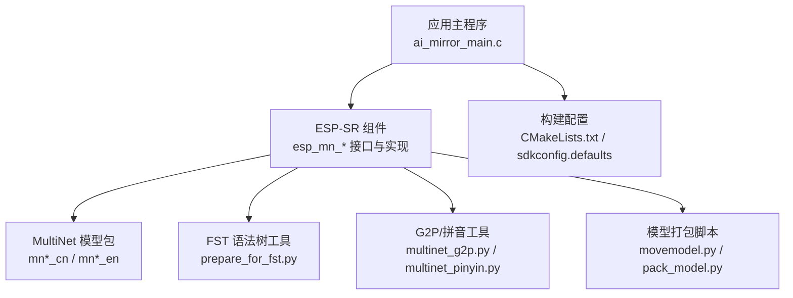
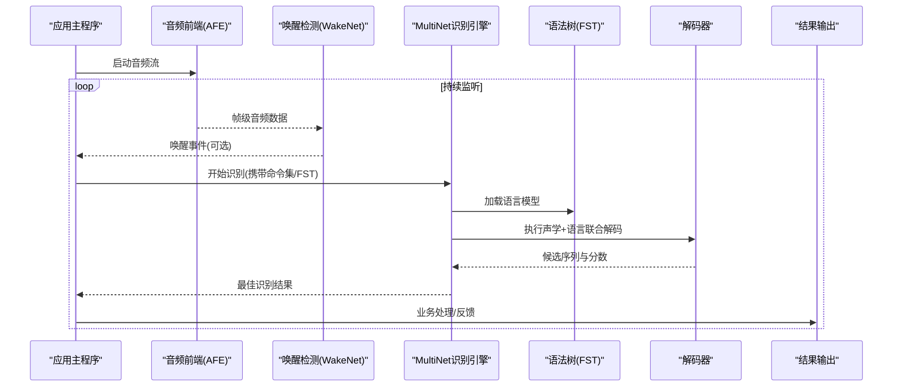
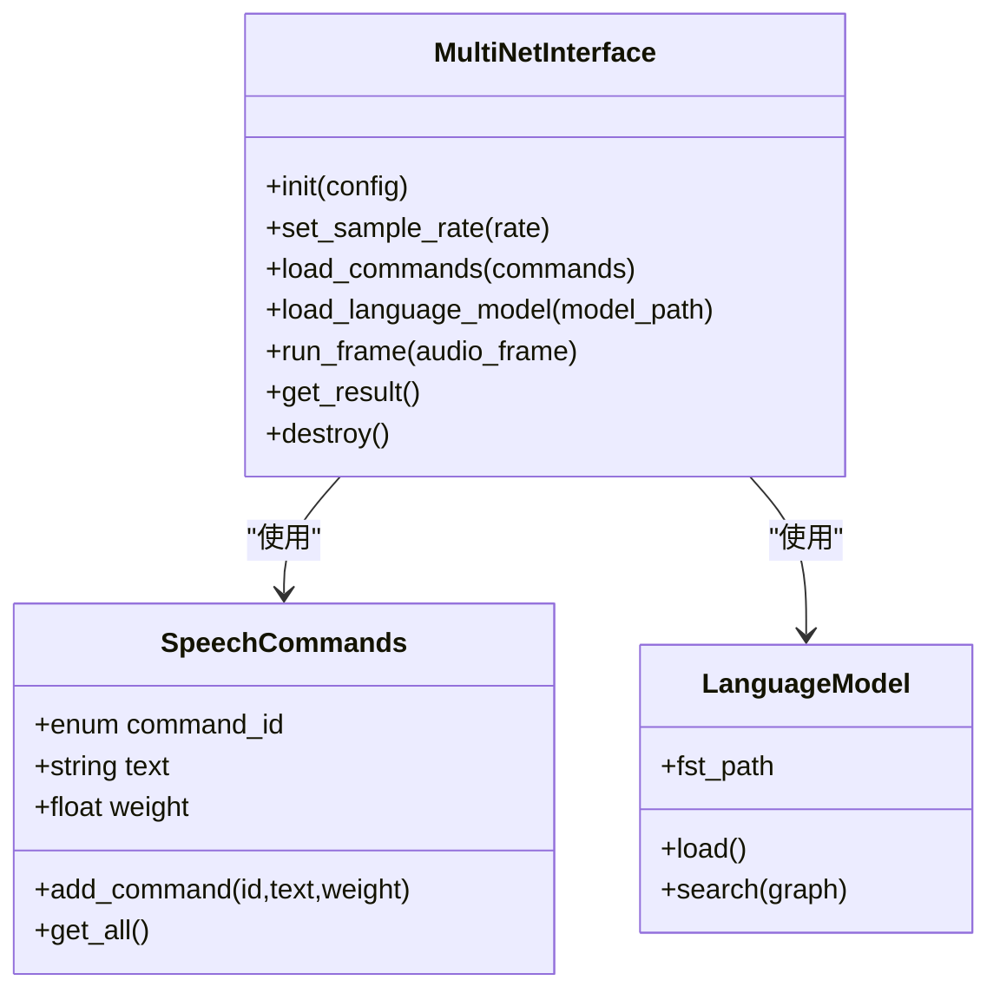
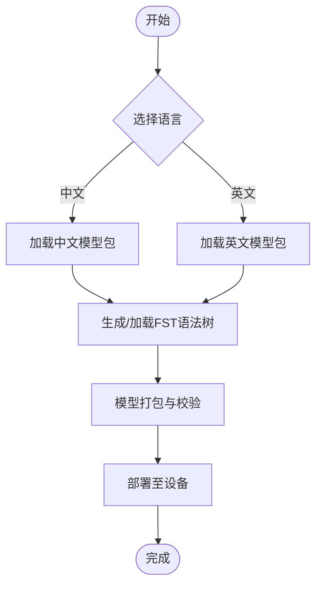
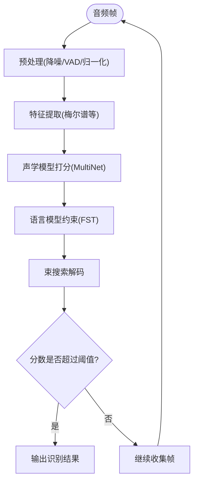
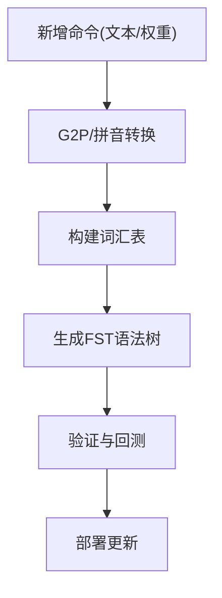
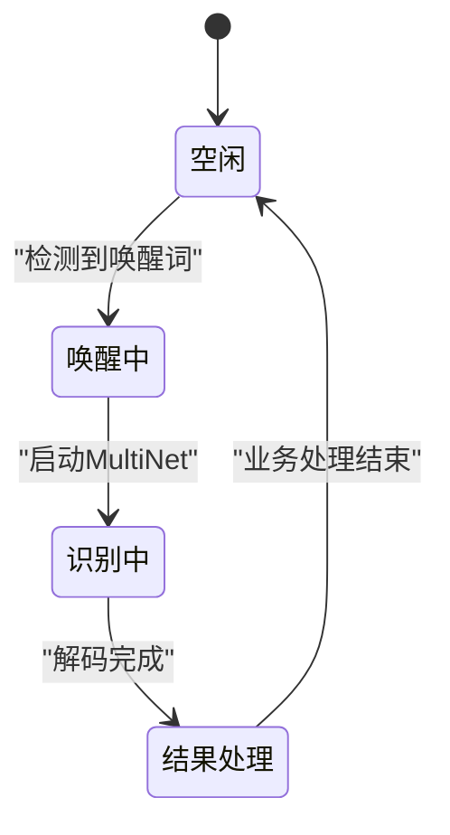
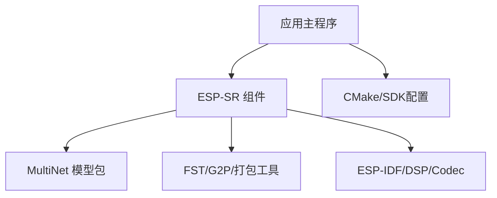

# 语音命令识别

<cite>
**本文档引用的文件**   
- [ai_mirror_main.c](file://Firmware/esp32_ai_mirror/main/ai_mirror_main.c)
- [esp_mn_speech_commands.h](file://Firmware/esp32_ai_mirror/components/espressif__esp-sr/include/esp_mn_speech_commands.h)
- [esp_mn_speech_commands.c](file://Firmware/esp32_ai_mirror/components/espressif__esp-sr/src/esp_mn_speech_commands.c)
- [esp_mn_iface.h](file://Firmware/esp32_ai_mirror/components/espressif__esp-sr/include/esp_mn_iface.h)
- [esp_mn_models.h](file://Firmware/esp32_ai_mirror/components/espressif__esp-sr/include/esp_mn_models.h)
- [multinet_model/CMakeLists.txt](file://Firmware/esp32_ai_mirror/components/espressif__esp-sr/model/multinet_model/CMakeLists.txt)
- [prepare_for_fst.py](file://Firmware/esp32_ai_mirror/components/espressif__esp-sr/tool/fst/prepare_for_fst.py)
- [commands_list.txt](file://Firmware/esp32_ai_mirror/components/espressif__esp-sr/tool/fst/commands_list.txt)
- [multinet_g2p.py](file://Firmware/esp32_ai_mirror/components/espressif__esp-sr/tool/multinet_g2p.py)
- [multinet_pinyin.py](file://Firmware/esp32_ai_mirror/components/espressif__esp-sr/tool/multinet_pinyin.py)
- [movemodel.py](file://Firmware/esp32_ai_mirror/components/espressif__esp-sr/model/movemodel.py)
- [pack_model.py](file://Firmware/esp32_ai_mirror/components/espressif__esp-sr/model/pack_model.py)
- [unity_multinet.c](file://Firmware/esp32_ai_mirror/components/espressif__esp-sr/test/unity_multinet.c)
- [CMakeLists.txt](file://Firmware/esp32_ai_mirror/main/CMakeLists.txt)
- [sdkconfig.defaults](file://Firmware/esp32_ai_mirror/sdkconfig.defaults)
</cite>

## 目录
1. [简介](#简介)
2. [项目结构](#项目结构)
3. [核心组件](#核心组件)
4. [架构总览](#架构总览)
5. [详细组件分析](#详细组件分析)
6. [依赖关系分析](#依赖关系分析)
7. [性能与精度优化](#性能与精度优化)
8. [故障排查指南](#故障排查指南)
9. [结论](#结论)
10. [附录](#附录)

## 简介
本文件面向嵌入式端语音命令识别（MultiNet）的开发者与集成者，系统性阐述模型架构、识别流程、语言模型与命令集配置方法、声学匹配与解码算法、自定义扩展方式以及与唤醒检测模块的协作机制。文档同时提供精度优化、噪声环境适应与实时推理调优建议，帮助在资源受限设备上实现稳定高效的语音交互体验。

## 项目结构
本项目基于 ESP-IDF 构建，语音能力由 espressif__esp-sr 组件提供，主应用位于 main 目录，模型与工具链位于 components/espressif__esp-sr 下。关键路径：
- 应用入口与任务调度：main/ai_mirror_main.c
- MultiNet 接口与命令定义：components/espressif__esp-sr/include/esp_mn_*.h 与 src/esp_mn_speech_commands.c
- 多语言模型包与打包脚本：model/multinet_model/* 与 model/*.py
- FST 语法树生成工具：tool/fst/*
- 拼音与 G2P 工具：tool/multinet_pinyin.py, tool/multinet_g2p.py
- 测试用例：test/unity_multinet.c

**图示来源** 
- [ai_mirror_main.c](file://Firmware/esp32_ai_mirror/main/ai_mirror_main.c)
- [esp_mn_iface.h](file://Firmware/esp32_ai_mirror/components/espressif__esp-sr/include/esp_mn_iface.h)
- [multinet_model/CMakeLists.txt](file://Firmware/esp32_ai_mirror/components/espressif__esp-sr/model/multinet_model/CMakeLists.txt)
- [prepare_for_fst.py](file://Firmware/esp32_ai_mirror/components/espressif__esp-sr/tool/fst/prepare_for_fst.py)
- [multinet_g2p.py](file://Firmware/esp32_ai_mirror/components/espressif__esp-sr/tool/multinet_g2p.py)
- [multinet_pinyin.py](file://Firmware/esp32_ai_mirror/components/espressif__esp-sr/tool/multinet_pinyin.py)
- [movemodel.py](file://Firmware/esp32_ai_mirror/components/espressif__esp-sr/model/movemodel.py)
- [pack_model.py](file://Firmware/esp32_ai_mirror/components/espressif__esp-sr/model/pack_model.py)
- [CMakeLists.txt](file://Firmware/esp32_ai_mirror/main/CMakeLists.txt)
- [sdkconfig.defaults](file://Firmware/esp32_ai_mirror/sdkconfig.defaults)

**章节来源**
- [ai_mirror_main.c](file://Firmware/esp32_ai_mirror/main/ai_mirror_main.c)
- [CMakeLists.txt](file://Firmware/esp32_ai_mirror/main/CMakeLists.txt)
- [sdkconfig.defaults](file://Firmware/esp32_ai_mirror/sdkconfig.defaults)

## 核心组件
- 应用层（Main）
  - 负责音频采集、唤醒检测触发、调用 MultiNet 识别、结果处理与业务联动。
- 语音识别组件（ESP-SR MultiNet）
  - 提供统一的识别接口、命令集管理、语言模型加载与解码器控制。
- 模型与工具链
  - 多语言模型包（中文/英文）、FST 语法树生成、G2P/拼音转换、模型打包与部署。

**章节来源**
- [esp_mn_iface.h](file://Firmware/esp32_ai_mirror/components/espressif__esp-sr/include/esp_mn_iface.h)
- [esp_mn_models.h](file://Firmware/esp32_ai_mirror/components/espressif__esp-sr/include/esp_mn_models.h)
- [esp_mn_speech_commands.h](file://Firmware/esp32_ai_mirror/components/espressif__esp-sr/include/esp_mn_speech_commands.h)
- [esp_mn_speech_commands.c](file://Firmware/esp32_ai_mirror/components/espressif__esp-sr/src/esp_mn_speech_commands.c)

## 架构总览
下图展示从音频输入到识别输出的端到端流程，包含唤醒检测、前端处理、声学特征提取、MultiNet 推理、FST 解码与结果输出。

**图示来源** 
- [ai_mirror_main.c](file://Firmware/esp32_ai_mirror/main/ai_mirror_main.c)
- [esp_mn_iface.h](file://Firmware/esp32_ai_mirror/components/espressif__esp-sr/include/esp_mn_iface.h)
- [prepare_for_fst.py](file://Firmware/esp32_ai_mirror/components/espressif__esp-sr/tool/fst/prepare_for_fst.py)

## 详细组件分析

### MultiNet 接口与命令集管理
- 接口职责
  - 初始化/销毁识别引擎、设置采样率与通道数、加载命令集与语言模型、逐帧推理、获取结果。
- 命令集管理
  - 通过命令头文件与实现文件维护命令枚举、文本映射与权重；支持动态更新与多语言切换。
- 典型调用顺序
  - 初始化 -> 加载模型 -> 循环推帧 -> 解码 -> 返回结果 -> 清理。

**图示来源** 
- [esp_mn_iface.h](file://Firmware/esp32_ai_mirror/components/espressif__esp-sr/include/esp_mn_iface.h)
- [esp_mn_speech_commands.h](file://Firmware/esp32_ai_mirror/components/espressif__esp-sr/include/esp_mn_speech_commands.h)
- [esp_mn_speech_commands.c](file://Firmware/esp32_ai_mirror/components/espressif__esp-sr/src/esp_mn_speech_commands.c)

**章节来源**
- [esp_mn_iface.h](file://Firmware/esp32_ai_mirror/components/espressif__esp-sr/include/esp_mn_iface.h)
- [esp_mn_speech_commands.h](file://Firmware/esp32_ai_mirror/components/espressif__esp-sr/include/esp_mn_speech_commands.h)
- [esp_mn_speech_commands.c](file://Firmware/esp32_ai_mirror/components/espressif__esp-sr/src/esp_mn_speech_commands.c)

### 语言模型与命令集配置（中文/英文）
- 模型包组织
  - 中文与英文模型分别存放于不同目录，包含权重与词典等必要文件。
- 构建与打包
  - 通过 CMake 与 Python 脚本将模型转换为设备可加载格式，确保内存布局与对齐满足嵌入式要求。
- 选择与切换
  - 运行时根据目标语言选择对应模型包，并加载相应 FST 语法树。

**图示来源** 
- [multinet_model/CMakeLists.txt](file://Firmware/esp32_ai_mirror/components/espressif__esp-sr/model/multinet_model/CMakeLists.txt)
- [movemodel.py](file://Firmware/esp32_ai_mirror/components/espressif__esp-sr/model/movemodel.py)
- [pack_model.py](file://Firmware/esp32_ai_mirror/components/espressif__esp-sr/model/pack_model.py)

**章节来源**
- [multinet_model/CMakeLists.txt](file://Firmware/esp32_ai_mirror/components/espressif__esp-sr/model/multinet_model/CMakeLists.txt)
- [movemodel.py](file://Firmware/esp32_ai_mirror/components/espressif__esp-sr/model/movemodel.py)
- [pack_model.py](file://Firmware/esp32_ai_mirror/components/espressif__esp-sr/model/pack_model.py)

### 声学模型匹配与解码算法
- 声学特征
  - 对音频帧进行预处理（降噪、VAD、归一化），提取梅尔频谱或类似特征。
- 匹配策略
  - 使用 MultiNet 声学模型对特征进行打分，结合 FST 语言模型进行束搜索解码。
- 结果解码
  - 解码器维护候选路径与分数，按阈值与超时策略输出最终文本。

**图示来源** 
- [esp_mn_iface.h](file://Firmware/esp32_ai_mirror/components/espressif__esp-sr/include/esp_mn_iface.h)
- [prepare_for_fst.py](file://Firmware/esp32_ai_mirror/components/espressif__esp-sr/tool/fst/prepare_for_fst.py)

**章节来源**
- [esp_mn_iface.h](file://Firmware/esp32_ai_mirror/components/espressif__esp-sr/include/esp_mn_iface.h)
- [prepare_for_fst.py](file://Firmware/esp32_ai_mirror/components/espressif__esp-sr/tool/fst/prepare_for_fst.py)

### 自定义命令集扩展与词汇表构建
- 命令集定义
  - 在命令头文件中新增命令枚举与文本映射，必要时调整权重以影响识别优先级。
- 词汇表与G2P
  - 使用 G2P 与拼音工具将中文文本转为音素序列，保证发音一致性与鲁棒性。
- FST 生成
  - 通过 prepare_for_fst.py 将命令列表转换为 FST 语法树，供解码器使用。

**图示来源** 
- [esp_mn_speech_commands.h](file://Firmware/esp32_ai_mirror/components/espressif__esp-sr/include/esp_mn_speech_commands.h)
- [multinet_g2p.py](file://Firmware/esp32_ai_mirror/components/espressif__esp-sr/tool/multinet_g2p.py)
- [multinet_pinyin.py](file://Firmware/esp32_ai_mirror/components/espressif__esp-sr/tool/multinet_pinyin.py)
- [prepare_for_fst.py](file://Firmware/esp32_ai_mirror/components/espressif__esp-sr/tool/fst/prepare_for_fst.py)
- [commands_list.txt](file://Firmware/esp32_ai_mirror/components/espressif__esp-sr/tool/fst/commands_list.txt)

**章节来源**
- [esp_mn_speech_commands.h](file://Firmware/esp32_ai_mirror/components/espressif__esp-sr/include/esp_mn_speech_commands.h)
- [multinet_g2p.py](file://Firmware/esp32_ai_mirror/components/espressif__esp-sr/tool/multinet_g2p.py)
- [multinet_pinyin.py](file://Firmware/esp32_ai_mirror/components/espressif__esp-sr/tool/multinet_pinyin.py)
- [prepare_for_fst.py](file://Firmware/esp32_ai_mirror/components/espressif__esp-sr/tool/fst/prepare_for_fst.py)
- [commands_list.txt](file://Firmware/esp32_ai_mirror/components/espressif__esp-sr/tool/fst/commands_list.txt)

### 与唤醒检测模块的协作与状态管理
- 协作模式
  - 唤醒检测模块（WakeNet）低功耗监听，检测到唤醒词后通知应用层启动 MultiNet 识别。
- 状态机
  - 应用层维护“空闲/唤醒中/识别中/结果处理”等状态，避免重复触发与资源竞争。
- 资源协调
  - 合理分配 CPU 与内存，确保唤醒与识别阶段平滑切换。

**图示来源** 
- [ai_mirror_main.c](file://Firmware/esp32_ai_mirror/main/ai_mirror_main.c)
- [esp_mn_iface.h](file://Firmware/esp32_ai_mirror/components/espressif__esp-sr/include/esp_mn_iface.h)

**章节来源**
- [ai_mirror_main.c](file://Firmware/esp32_ai_mirror/main/ai_mirror_main.c)
- [esp_mn_iface.h](file://Firmware/esp32_ai_mirror/components/espressif__esp-sr/include/esp_mn_iface.h)

## 依赖关系分析
- 组件耦合
  - 应用层依赖 esp_mn_* 接口；识别引擎依赖模型包与 FST 工具链；构建系统依赖 CMake 与 SDK 配置。
- 外部依赖
  - ESP-IDF 框架、音频编解码库、DSP 数学库等。
- 潜在风险
  - 模型尺寸与内存占用、FST 大小与解码时延、命令集膨胀导致的误识率上升。

**图示来源** 
- [CMakeLists.txt](file://Firmware/esp32_ai_mirror/main/CMakeLists.txt)
- [sdkconfig.defaults](file://Firmware/esp32_ai_mirror/sdkconfig.defaults)
- [multinet_model/CMakeLists.txt](file://Firmware/esp32_ai_mirror/components/espressif__esp-sr/model/multinet_model/CMakeLists.txt)

**章节来源**
- [CMakeLists.txt](file://Firmware/esp32_ai_mirror/main/CMakeLists.txt)
- [sdkconfig.defaults](file://Firmware/esp32_ai_mirror/sdkconfig.defaults)
- [multinet_model/CMakeLists.txt](file://Firmware/esp32_ai_mirror/components/espressif__esp-sr/model/multinet_model/CMakeLists.txt)

## 性能与精度优化
- 识别精度优化
  - 扩充训练数据与覆盖场景，增加同音异义词区分；调整命令权重与阈值；引入领域热词提升召回。
- 噪声环境适应
  - 启用 AEC/NS/VAD 等前端增强；优化麦克风阵列与拾音位置；在 FST 中加入噪声容忍规则。
- 实时推理调优
  - 降低采样率与帧长；使用量化模型（如 q8）；限制束搜索宽度与深度；批处理与缓存中间结果。
- 资源与功耗
  - 按需加载模型与 FST；休眠唤醒策略；CPU 频率与并行度调优。

[本节为通用指导，不直接分析具体文件]

## 故障排查指南
- 常见问题
  - 无法加载模型：检查模型路径与打包格式；确认 CMake 与 SDK 配置正确。
  - 识别率低：检查命令集与 FST 一致性；核对 G2P 转换结果；调整阈值与权重。
  - 延迟过高：减少束搜索规模；优化前端处理；使用量化模型。
  - 唤醒不触发：检查唤醒模型与阈值；确认音频路径与增益。
- 调试手段
  - 使用单元测试与日志打印；回放音频样本定位问题；对比不同参数组合效果。

**章节来源**
- [unity_multinet.c](file://Firmware/esp32_ai_mirror/components/espressif__esp-sr/test/unity_multinet.c)

## 结论
MultiNet 在嵌入式端提供了高效、可扩展的语音命令识别能力。通过合理的命令集设计、FST 语法树构建与前端增强，可在噪声环境下获得稳定识别效果。结合量化与解码参数调优，可实现低延迟与低功耗的实时推理。与唤醒检测模块协同工作，能显著提升用户体验与系统能效。

[本节为总结性内容，不直接分析具体文件]

## 附录
- 术语说明
  - MultiNet：面向命令识别的轻量级声学模型。
  - FST：有限状态转导器，用于语言模型约束与解码。
  - G2P：Grapheme-to-Phoneme，字形到音素的转换。
- 参考路径
  - 命令集与接口：esp_mn_speech_commands.*、esp_mn_iface.h
  - 模型与工具：model/multinet_model/*、tool/fst/*、tool/multinet_*.py
  - 构建与配置：main/CMakeLists.txt、sdkconfig.defaults

[本节为补充信息，不直接分析具体文件]