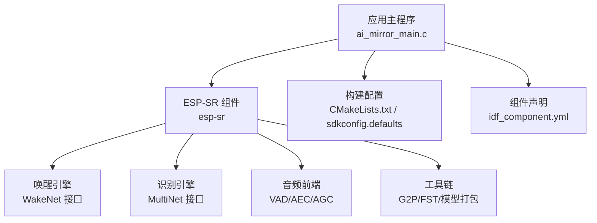
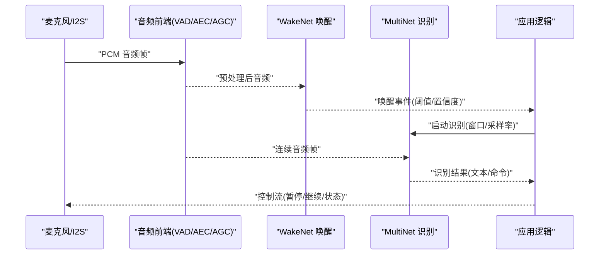
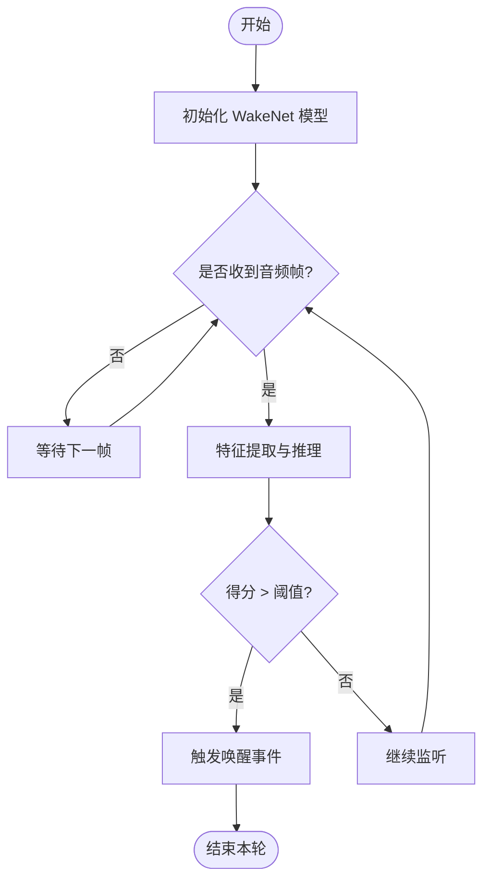
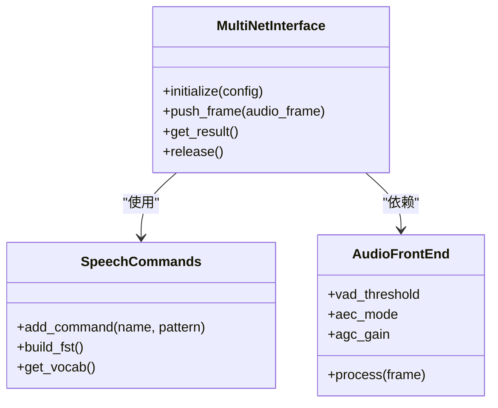
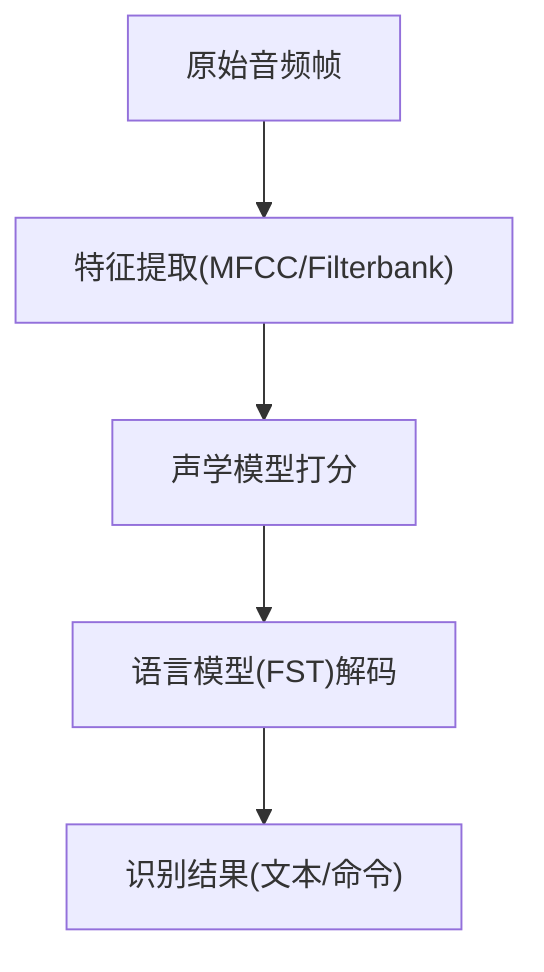
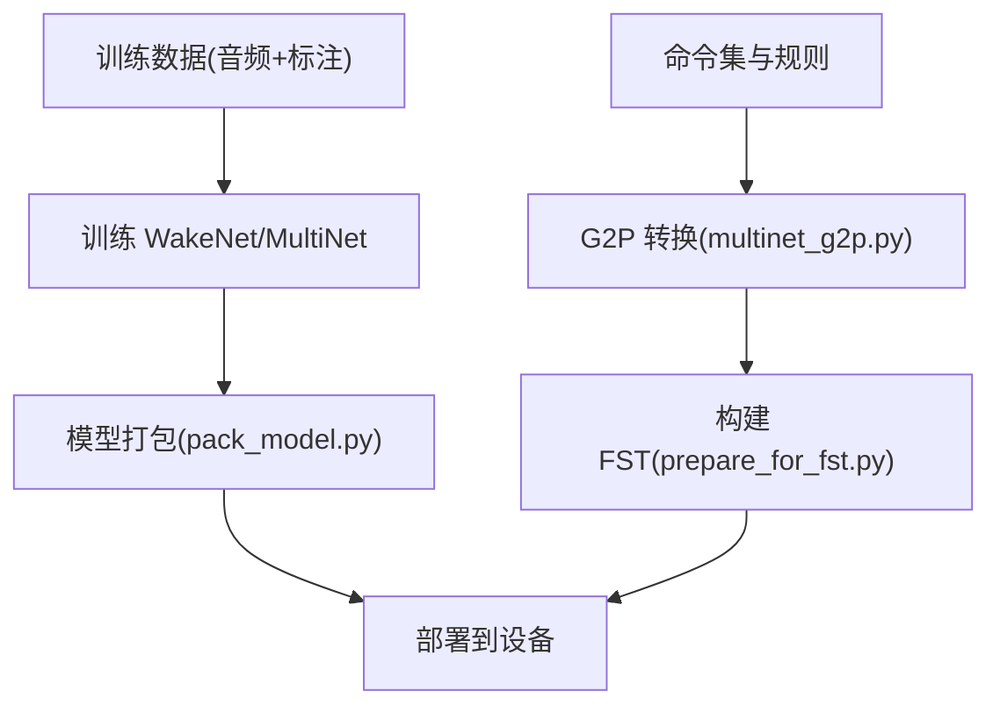
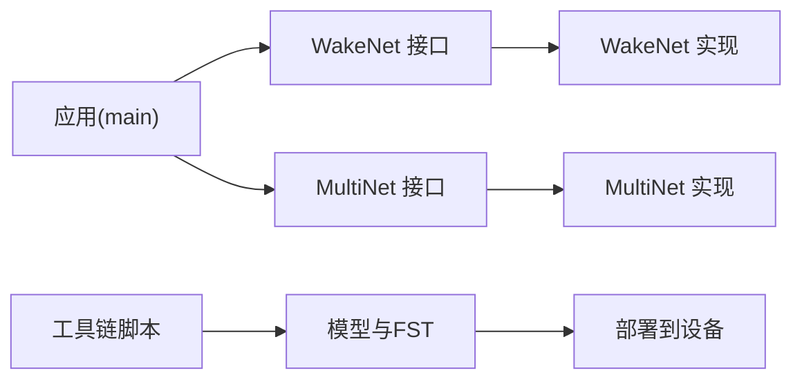

# 语音识别

<cite>
**本文引用的文件**   
- [ai_mirror_main.c](file://Firmware/esp32_ai_mirror/main/ai_mirror_main.c)
- [CMakeLists.txt](file://Firmware/esp32_ai_mirror/CMakeLists.txt)
- [idf_component.yml](file://Firmware/esp32_ai_mirror/main/idf_component.yml)
- [sdkconfig.defaults](file://Firmware/esp32_ai_mirror/sdkconfig.defaults)
- [esp_mn_speech_commands.c](file://Firmware/esp32_ai_mirror/components/espressif__esp-sr/src/esp_mn_speech_commands.c)
- [esp_mn_iface.h](file://Firmware/esp32_ai_mirror/components/espressif__esp-sr/include/esp32s3/esp_mn_iface.h)
- [esp_wn_iface.h](file://Firmware/esp32_ai_mirror/components/espressif__esp-sr/include/esp32s3/esp_wn_iface.h)
- [multinet_g2p.py](file://Firmware/esp32_ai_mirror/components/espressif__esp-sr/tool/multinet_g2p.py)
- [prepare_for_fst.py](file://Firmware/esp32_ai_mirror/components/espressif__esp-sr/tool/fst/prepare_for_fst.py)
- [movemodel.py](file://Firmware/esp32_ai_mirror/components/espressif__esp-sr/model/movemodel.py)
- [pack_model.py](file://Firmware/esp32_ai_mirror/components/espressif__esp-sr/model/pack_model.py)
- [unity_multinet.c](file://Firmware/esp32_ai_mirror/components/espressif__esp-sr/test/unity_multinet.c)
- [unity_wakenet.c](file://Firmware/esp32_ai_mirror/components/espressif__esp-sr/test/unity_wakenet.c)
</cite>

## 目录
1. [简介](#简介)
2. [项目结构](#项目结构)
3. [核心组件](#核心组件)
4. [架构总览](#架构总览)
5. [详细组件分析](#详细组件分析)
6. [依赖关系分析](#依赖关系分析)
7. [性能与优化](#性能与优化)
8. [故障排查指南](#故障排查指南)
9. [结论](#结论)
10. [附录](#附录)

## 简介
本文件面向基于 ESP-SR（ESP Speech Recognition）的语音识别系统，重点覆盖唤醒词检测与语音命令识别。文档深入解析 WakeNet 唤醒模型与 MultiNet 语音识别模型的部署与优化路径，说明音频特征提取、声学模型匹配与语言模型处理流程，并提供自定义唤醒词训练、命令集扩展与识别精度优化的实践方法。同时给出模型量化、内存优化与实时推理性能调优方案，以及与音频处理模块的集成方式和数据流控制要点。

## 项目结构
本项目以 ESP-IDF 工程为基础，核心语音能力由 espressif__esp-sr 组件提供，应用入口位于 main 目录。关键结构与职责如下：
- 应用层：main 目录包含主程序、UI、板级驱动等；通过 idf_component.yml 引入 esp-sr 组件。
- 语音组件：components/espressif__esp-sr 提供唤醒（WakeNet）、语音识别（MultiNet）、音频前端（AFE）、工具链（G2P、FST 构建）与示例测试。
- 配置与构建：CMakeLists.txt 与 sdkconfig.defaults 决定编译选项、模型打包与运行时开关。

图表来源
- [ai_mirror_main.c](file://Firmware/esp32_ai_mirror/main/ai_mirror_main.c)
- [CMakeLists.txt](file://Firmware/esp32_ai_mirror/CMakeLists.txt)
- [idf_component.yml](file://Firmware/esp32_ai_mirror/main/idf_component.yml)
- [sdkconfig.defaults](file://Firmware/esp32_ai_mirror/sdkconfig.defaults)

章节来源
- [CMakeLists.txt](file://Firmware/esp32_ai_mirror/CMakeLists.txt)
- [idf_component.yml](file://Firmware/esp32_ai_mirror/main/idf_component.yml)
- [sdkconfig.defaults](file://Firmware/esp32_ai_mirror/sdkconfig.defaults)

## 核心组件
- 唤醒引擎（WakeNet）
  - 负责在连续音频流中检测预设唤醒词，触发后续识别流程。
  - 通过 esp_wn_iface.h 暴露统一接口，支持多平台头文件适配。
- 语音识别引擎（MultiNet）
  - 对唤醒后的音频片段进行声学建模与语言模型解码，输出文本或命令。
  - 通过 esp_mn_iface.h 暴露统一接口，并配合命令集与 FST 语法图。
- 音频前端（AFE）
  - 提供 VAD、AEC、AGC 等预处理，提升鲁棒性与识别率。
- 工具链
  - G2P（多音字/拼音转换）、FST 构建脚本、模型移动与打包脚本，支撑离线部署。

章节来源
- [esp_wn_iface.h](file://Firmware/esp32_ai_mirror/components/espressif__esp-sr/include/esp32s3/esp_wn_iface.h)
- [esp_mn_iface.h](file://Firmware/esp32_ai_mirror/components/espressif__esp-sr/include/esp32s3/esp_mn_iface.h)
- [esp_mn_speech_commands.c](file://Firmware/esp32_ai_mirror/components/espressif__esp-sr/src/esp_mn_speech_commands.c)

## 架构总览
下图展示从音频采集到识别结果输出的端到端数据流与控制流。

图表来源
- [ai_mirror_main.c](file://Firmware/esp32_ai_mirror/main/ai_mirror_main.c)
- [esp_mn_iface.h](file://Firmware/esp32_ai_mirror/components/espressif__esp-sr/include/esp32s3/esp_mn_iface.h)
- [esp_wn_iface.h](file://Firmware/esp32_ai_mirror/components/espressif__esp-sr/include/esp32s3/esp_wn_iface.h)

## 详细组件分析

### 唤醒引擎（WakeNet）
- 功能要点
  - 持续监听音频流，计算唤醒词匹配得分，超过阈值即上报唤醒事件。
  - 支持不同硬件平台的头文件适配与模型加载。
- 关键接口与数据结构
  - 通过 esp_wn_iface.h 定义初始化、运行、释放等接口。
  - 典型流程：初始化模型 -> 循环推帧 -> 判断得分 -> 回调唤醒。
- 部署与优化
  - 选择合适量化位宽（如 Q8/Q16）平衡功耗与准确率。
  - 调整滑动窗口长度与步长，降低误报与延迟。
  - 结合 VAD 门限减少无效推理。

图表来源
- [esp_wn_iface.h](file://Firmware/esp32_ai_mirror/components/espressif__esp-sr/include/esp32s3/esp_wn_iface.h)
- [unity_wakenet.c](file://Firmware/esp32_ai_mirror/components/espressif__esp-sr/test/unity_wakenet.c)

章节来源
- [esp_wn_iface.h](file://Firmware/esp32_ai_mirror/components/espressif__esp-sr/include/esp32s3/esp_wn_iface.h)
- [unity_wakenet.c](file://Firmware/esp32_ai_mirror/components/espressif__esp-sr/test/unity_wakenet.c)

### 语音识别引擎（MultiNet）
- 功能要点
  - 接收唤醒后的音频片段，进行声学特征提取与序列建模，结合语言模型（FST）解码为文本或命令。
  - 通过 esp_mn_iface.h 暴露统一接口，支持命令集管理与结果回调。
- 关键接口与数据结构
  - 初始化命令集、加载语言模型（FST）、设置采样率与帧长。
  - 逐帧输入，内部维护上下文与解码状态，输出最终识别结果。
- 部署与优化
  - 使用 Q8 量化模型减小体积与内存占用。
  - 精简命令集与 FST 规模，降低解码复杂度。
  - 合理设置超时与静音检测，避免长时间推理。

图表来源
- [esp_mn_iface.h](file://Firmware/esp32_ai_mirror/components/espressif__esp-sr/include/esp32s3/esp_mn_iface.h)
- [esp_mn_speech_commands.c](file://Firmware/esp32_ai_mirror/components/espressif__esp-sr/src/esp_mn_speech_commands.c)

章节来源
- [esp_mn_iface.h](file://Firmware/esp32_ai_mirror/components/espressif__esp-sr/include/esp32s3/esp_mn_iface.h)
- [esp_mn_speech_commands.c](file://Firmware/esp32_ai_mirror/components/espressif__esp-sr/src/esp_mn_speech_commands.c)
- [unity_multinet.c](file://Firmware/esp32_ai_mirror/components/espressif__esp-sr/test/unity_multinet.c)

### 音频特征提取与处理流程
- 特征提取
  - 将 PCM 音频转换为频谱特征（如 MFCC/滤波器组），并进行归一化。
- 声学模型匹配
  - 使用预训练的声学模型对特征序列打分，得到音素或子词概率。
- 语言模型处理
  - 通过 FST 语法图约束解码路径，提高命令识别准确率与鲁棒性。
- 数据流控制
  - 由应用层协调 AFE、WakeNet、MultiNet 的状态机，确保唤醒与识别无缝衔接。

图表来源
- [prepare_for_fst.py](file://Firmware/esp32_ai_mirror/components/espressif__esp-sr/tool/fst/prepare_for_fst.py)
- [multinet_g2p.py](file://Firmware/esp32_ai_mirror/components/espressif__esp-sr/tool/multinet_g2p.py)

章节来源
- [prepare_for_fst.py](file://Firmware/esp32_ai_mirror/components/espressif__esp-sr/tool/fst/prepare_for_fst.py)
- [multinet_g2p.py](file://Firmware/esp32_ai_mirror/components/espressif__esp-sr/tool/multinet_g2p.py)

### 自定义唤醒词训练与命令集扩展
- 自定义唤醒词
  - 准备标注数据，使用训练脚本生成 WakeNet 模型，并通过 pack_model.py 打包为嵌入式格式。
  - 在应用中替换模型头文件并重新编译。
- 命令集扩展
  - 使用 multinet_g2p.py 进行拼音/多音字转换，prepare_for_fst.py 构建 FST 语法图。
  - 更新命令列表与语言模型，确保新命令可被正确解码。

图表来源
- [movemodel.py](file://Firmware/esp32_ai_mirror/components/espressif__esp-sr/model/movemodel.py)
- [pack_model.py](file://Firmware/esp32_ai_mirror/components/espressif__esp-sr/model/pack_model.py)
- [multinet_g2p.py](file://Firmware/esp32_ai_mirror/components/espressif__esp-sr/tool/multinet_g2p.py)
- [prepare_for_fst.py](file://Firmware/esp32_ai_mirror/components/espressif__esp-sr/tool/fst/prepare_for_fst.py)

章节来源
- [movemodel.py](file://Firmware/esp32_ai_mirror/components/espressif__esp-sr/model/movemodel.py)
- [pack_model.py](file://Firmware/esp32_ai_mirror/components/espressif__esp-sr/model/pack_model.py)
- [multinet_g2p.py](file://Firmware/esp32_ai_mirror/components/espressif__esp-sr/tool/multinet_g2p.py)
- [prepare_for_fst.py](file://Firmware/esp32_ai_mirror/components/espressif__esp-sr/tool/fst/prepare_for_fst.py)

## 依赖关系分析
- 组件耦合
  - 应用层依赖 esp-sr 提供的 WakeNet/MultiNet 接口与命令集管理。
  - 工具链脚本为模型与语言模型构建提供自动化支持。
- 外部依赖
  - ESP-IDF 框架、ESP-DSP（信号处理）、编解码器驱动（I2S/Codec）。
- 潜在循环依赖
  - 通过分层接口（iface.h）解耦，避免直接耦合实现细节。

图表来源
- [idf_component.yml](file://Firmware/esp32_ai_mirror/main/idf_component.yml)
- [CMakeLists.txt](file://Firmware/esp32_ai_mirror/CMakeLists.txt)

章节来源
- [idf_component.yml](file://Firmware/esp32_ai_mirror/main/idf_component.yml)
- [CMakeLists.txt](file://Firmware/esp32_ai_mirror/CMakeLists.txt)

## 性能与优化
- 模型量化
  - 优先使用 Q8 量化模型，显著降低内存与算力需求，保持较高准确率。
  - 针对热点路径（如卷积层）保留更高精度以减少误差累积。
- 内存优化
  - 分块加载模型权重，按需释放非活跃模块。
  - 复用音频缓冲区与特征缓存，减少动态分配。
- 实时推理调优
  - 调整帧长与步长，平衡延迟与稳定性。
  - 启用 VAD 门限与静音检测，减少无效推理。
  - 限制 FST 规模与命令数量，缩短解码时间。
- 功耗优化
  - 在非唤醒阶段降低采样率或关闭部分前端模块。
  - 使用低功耗 CPU 模式与任务调度策略。

[本节为通用指导，不直接分析具体文件]

## 故障排查指南
- 常见问题
  - 唤醒频繁误报：检查 VAD 阈值、噪声环境与唤醒词模型版本。
  - 识别率低：确认命令集与 FST 一致性，检查 G2P 转换是否正确。
  - 内存不足：减少模型大小、命令数量与缓冲大小。
  - 延迟过高：优化帧长、步长与解码深度。
- 调试建议
  - 使用单元测试用例验证接口行为（如 unity_multinet.c、unity_wakenet.c）。
  - 打印中间特征与得分，定位问题阶段。
  - 逐步简化命令集与模型，隔离问题范围。

章节来源
- [unity_multinet.c](file://Firmware/esp32_ai_mirror/components/espressif__esp-sr/test/unity_multinet.c)
- [unity_wakenet.c](file://Firmware/esp32_ai_mirror/components/espressif__esp-sr/test/unity_wakenet.c)

## 结论
本系统基于 ESP-SR 提供了完整的唤醒与语音识别能力。通过 WakeNet 与 MultiNet 的协同工作，结合音频前端与工具链，实现了从音频采集到命令识别的闭环。在实际部署中，应重点关注模型量化、内存占用与实时性能调优，并通过自定义训练与命令集扩展满足多样化场景需求。

[本节为总结性内容，不直接分析具体文件]

## 附录
- 术语表
  - WakeNet：唤醒词检测模型
  - MultiNet：语音识别模型
  - FST：有限状态机，用于语言模型约束解码
  - G2P：文字转拼音/多音字处理
- 参考路径
  - 接口定义：esp_wn_iface.h、esp_mn_iface.h
  - 命令集管理：esp_mn_speech_commands.c
  - 工具链：multinet_g2p.py、prepare_for_fst.py、pack_model.py、movemodel.py

[本节为补充信息，不直接分析具体文件]