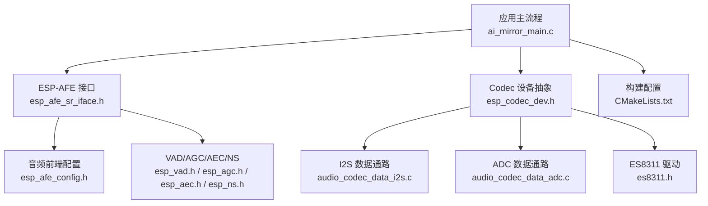
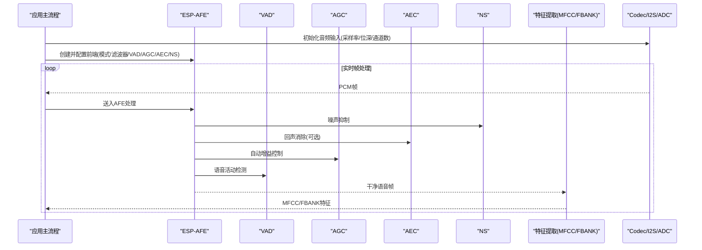
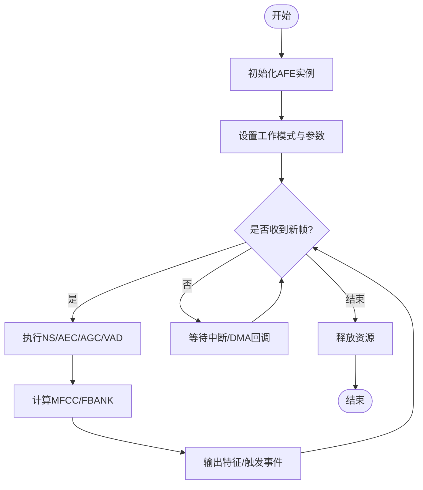
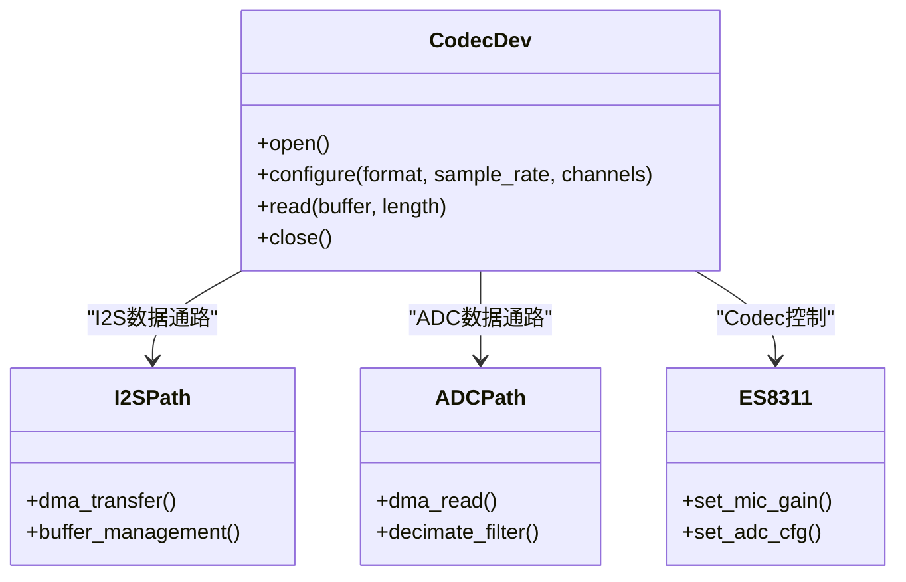
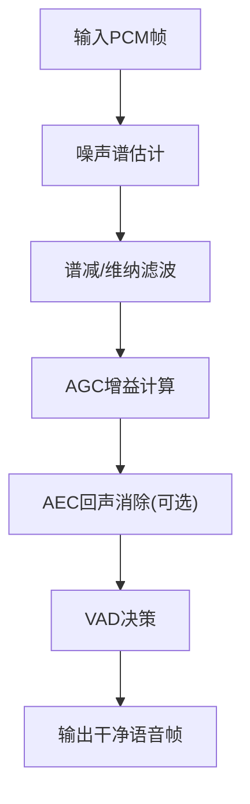
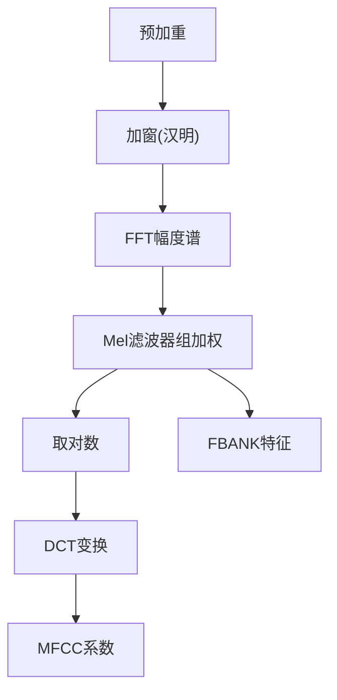
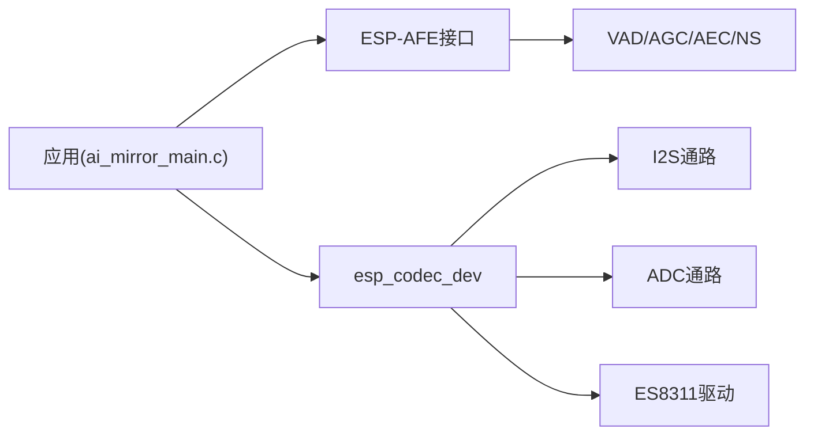

# 音频特征提取

<cite>
**本文引用的文件**   
- [ai_mirror_main.c](file://Firmware/esp32_ai_mirror/main/ai_mirror_main.c)
- [ai_mirror_config.h](file://Firmware/esp32_ai_mirror/main/ai_mirror_config.h)
- [esp_afe_sr_iface.h](file://Firmware/esp32_ai_mirror/components/espressif__esp-sr/include/esp_afe_sr_iface.h)
- [esp_afe_config.h](file://Firmware/esp32_ai_mirror/components/espressif__esp-sr/include/esp_afe_config.h)
- [esp_vad.h](file://Firmware/esp32_ai_mirror/components/espressif__esp-sr/include/esp_vad.h)
- [esp_agc.h](file://Firmware/esp32_ai_mirror/components/espressif__esp-sr/include/esp_agc.h)
- [esp_aec.h](file://Firmware/esp32_ai_mirror/components/espressif__esp-sr/include/esp_aec.h)
- [esp_ns.h](file://Firmware/esp32_ai_mirror/components/espressif__esp-sr/include/esp_ns.h)
- [es8311.h](file://Firmware/esp32_ai_mirror/managed_components/espressif__es8311/include/es8311.h)
- [esp_codec_dev.h](file://Firmware/esp32_ai_mirror/managed_components/espressif__esp_codec_dev/include/esp_codec_dev.h)
- [audio_codec_data_adc.c](file://Firmware/esp32_ai_mirror/managed_components/espressif__esp_codec_dev/platform/audio_codec_data_adc.c)
- [audio_codec_data_i2s.c](file://Firmware/esp32_ai_mirror/managed_components/espressif__esp_codec_dev/platform/audio_codec_data_i2s.c)
- [CMakeLists.txt](file://Firmware/esp32_ai_mirror/main/CMakeLists.txt)
</cite>

## 目录
1. [简介](#简介)
2. [项目结构](#项目结构)
3. [核心组件](#核心组件)
4. [架构总览](#架构总览)
5. [详细组件分析](#详细组件分析)
6. [依赖关系分析](#依赖关系分析)
7. [性能考量](#性能考量)
8. [故障排查指南](#故障排查指南)
9. [结论](#结论)
10. [附录](#附录)

## 简介
本文件面向ESP32平台上的音频前端与特征提取子系统，系统性阐述从音频采集、预处理（滤波降噪）、VAD/AGC/AEC到声学特征（MFCC、FBANK）提取的完整链路。文档同时覆盖音频格式转换、采样率适配、缓冲区管理策略，以及不同麦克风阵列配置的优化建议与质量评估指标，并给出与ESP-AFE（Audio Front End）组件的集成方式与最佳实践。

## 项目结构
本项目基于ESP-IDF构建，音频相关能力主要分布在以下位置：
- 应用入口与配置：main目录下的主程序与配置头文件
- ESP-SR组件：提供ESP-AFE接口、VAD、AGC、AEC、NS等模块的头文件与实现
- 编解码器驱动：ES8311驱动与ESP Codec Dev通用编解码框架
- I2S/ADC数据通路：通过I2S或ADC通道完成PCM数据读取

图表来源 
- [ai_mirror_main.c](file://Firmware/esp32_ai_mirror/main/ai_mirror_main.c)
- [esp_afe_sr_iface.h](file://Firmware/esp32_ai_mirror/components/espressif__esp-sr/include/esp_afe_sr_iface.h)
- [esp_afe_config.h](file://Firmware/esp32_ai_mirror/components/espressif__esp-sr/include/esp_afe_config.h)
- [esp_vad.h](file://Firmware/esp32_ai_mirror/components/espressif__esp-sr/include/esp_vad.h)
- [esp_agc.h](file://Firmware/esp32_ai_mirror/components/espressif__esp-sr/include/esp_agc.h)
- [esp_aec.h](file://Firmware/esp32_ai_mirror/components/espressif__esp-sr/include/esp_aec.h)
- [esp_ns.h](file://Firmware/esp32_ai_mirror/components/espressif__esp-sr/include/esp_ns.h)
- [esp_codec_dev.h](file://Firmware/esp32_ai_mirror/managed_components/espressif__esp_codec_dev/include/esp_codec_dev.h)
- [audio_codec_data_i2s.c](file://Firmware/esp32_ai_mirror/managed_components/espressif__esp_codec_dev/platform/audio_codec_data_i2s.c)
- [audio_codec_data_adc.c](file://Firmware/esp32_ai_mirror/managed_components/espressif__esp_codec_dev/platform/audio_codec_data_adc.c)
- [es8311.h](file://Firmware/esp32_ai_mirror/managed_components/espressif__es8311/include/es8311.h)
- [CMakeLists.txt](file://Firmware/esp32_ai_mirror/main/CMakeLists.txt)

章节来源
- [ai_mirror_main.c](file://Firmware/esp32_ai_mirror/main/ai_mirror_main.c)
- [CMakeLists.txt](file://Firmware/esp32_ai_mirror/main/CMakeLists.txt)

## 核心组件
- ESP-AFE 接口层：封装多通道/单通道语音前端的统一API，负责初始化、参数下发、帧级处理回调与资源释放
- 音频前端算法链：包含噪声抑制（NS）、自动增益控制（AGC）、回声消除（AEC）、语音活动检测（VAD）等模块
- 编解码设备抽象：通过esp_codec_dev统一访问I2S/ADC与具体Codec芯片（如ES8311），屏蔽底层差异
- 数据通路：I2S DMA或ADC DMA以块为单位传输PCM样本，配合环形缓冲与任务调度保证低时延
- 特征提取：在AFE输出端抽取MFCC/FBANK等声学特征，供下游识别模型使用

章节来源
- [esp_afe_sr_iface.h](file://Firmware/esp32_ai_mirror/components/espressif__esp-sr/include/esp_afe_sr_iface.h)
- [esp_afe_config.h](file://Firmware/esp32_ai_mirror/components/espressif__esp-sr/include/esp_afe_config.h)
- [esp_vad.h](file://Firmware/esp32_ai_mirror/components/espressif__esp-sr/include/esp_vad.h)
- [esp_agc.h](file://Firmware/esp32_ai_mirror/components/espressif__esp-sr/include/esp_agc.h)
- [esp_aec.h](file://Firmware/esp32_ai_mirror/components/espressif__esp-sr/include/esp_aec.h)
- [esp_ns.h](file://Firmware/esp32_ai_mirror/components/espressif__esp-sr/include/esp_ns.h)
- [esp_codec_dev.h](file://Firmware/esp32_ai_mirror/managed_components/espressif__esp_codec_dev/include/esp_codec_dev.h)

## 架构总览
下图展示从音频采集到特征输出的端到端数据流，强调各模块的职责边界与调用顺序。

图表来源 
- [esp_afe_sr_iface.h](file://Firmware/esp32_ai_mirror/components/espressif__esp-sr/include/esp_afe_sr_iface.h)
- [esp_afe_config.h](file://Firmware/esp32_ai_mirror/components/espressif__esp-sr/include/esp_afe_config.h)
- [esp_vad.h](file://Firmware/esp32_ai_mirror/components/espressif__esp-sr/include/esp_vad.h)
- [esp_agc.h](file://Firmware/esp32_ai_mirror/components/espressif__esp-sr/include/esp_agc.h)
- [esp_aec.h](file://Firmware/esp32_ai_mirror/components/espressif__esp-sr/include/esp_aec.h)
- [esp_ns.h](file://Firmware/esp32_ai_mirror/components/espressif__esp-sr/include/esp_ns.h)
- [esp_codec_dev.h](file://Firmware/esp32_ai_mirror/managed_components/espressif__esp_codec_dev/include/esp_codec_dev.h)

## 详细组件分析

### ESP-AFE 集成与参数配置
- 初始化与生命周期：通过AFE接口创建实例、设置工作模式（单麦/多麦）、分配内部缓冲、注册回调；结束时释放资源
- 关键配置项：采样率、帧长、窗口函数、FFT大小、滤波器组数量、归一化策略、VAD阈值、AGC目标电平、AEC参考路径、NS强度等
- 典型流程：配置→初始化→循环处理帧→按需动态调整参数→销毁

章节来源
- [esp_afe_sr_iface.h](file://Firmware/esp32_ai_mirror/components/espressif__esp-sr/include/esp_afe_sr_iface.h)
- [esp_afe_config.h](file://Firmware/esp32_ai_mirror/components/espressif__esp-sr/include/esp_afe_config.h)

### 音频采集与数据通路（I2S/ADC + ES8311）
- 设备抽象：esp_codec_dev统一封装音频设备的打开、配置、读写、关闭
- 数据源选择：I2S用于外部Codec（如ES8311），ADC用于板载MEMS麦克风直采
- 缓冲与DMA：采用块式DMA传输，结合环形缓冲降低CPU占用与抖动
- 格式与采样率：确保输入PCM为线性整型（通常为16bit），采样率与AFE一致（常见16kHz）

图表来源 
- [esp_codec_dev.h](file://Firmware/esp32_ai_mirror/managed_components/espressif__esp_codec_dev/include/esp_codec_dev.h)
- [audio_codec_data_i2s.c](file://Firmware/esp32_ai_mirror/managed_components/espressif__esp_codec_dev/platform/audio_codec_data_i2s.c)
- [audio_codec_data_adc.c](file://Firmware/esp32_ai_mirror/managed_components/espressif__esp_codec_dev/platform/audio_codec_data_adc.c)
- [es8311.h](file://Firmware/esp32_ai_mirror/managed_components/espressif__es8311/include/es8311.h)

章节来源
- [esp_codec_dev.h](file://Firmware/esp32_ai_mirror/managed_components/espressif__esp_codec_dev/include/esp_codec_dev.h)
- [audio_codec_data_i2s.c](file://Firmware/esp32_ai_mirror/managed_components/espressif__esp_codec_dev/platform/audio_codec_data_i2s.c)
- [audio_codec_data_adc.c](file://Firmware/esp32_ai_mirror/managed_components/espressif__esp_codec_dev/platform/audio_codec_data_adc.c)
- [es8311.h](file://Firmware/esp32_ai_mirror/managed_components/espressif__es8311/include/espressif es8311.h)

### 预处理与降噪（NS/AGC/AEC/VAD）
- 噪声抑制（NS）：估计背景噪声谱，进行谱减法或维纳滤波，抑制稳态/非稳态噪声
- 自动增益控制（AGC）：根据短时能量自适应调节增益，避免削波并保持语音响度稳定
- 回声消除（AEC）：利用扬声器参考信号，估计房间冲激响应并抵消回声
- 语音活动检测（VAD）：基于能量/过零率/频谱熵等统计量判断语音段，减少无效计算

章节来源
- [esp_ns.h](file://Firmware/esp32_ai_mirror/components/espressif__esp-sr/include/esp_ns.h)
- [esp_agc.h](file://Firmware/esp32_ai_mirror/components/espressif__esp-sr/include/esp_agc.h)
- [esp_aec.h](file://Firmware/esp32_ai_mirror/components/espressif__esp-sr/include/esp_aec.h)
- [esp_vad.h](file://Firmware/esp32_ai_mirror/components/espressif__esp-sr/include/esp_vad.h)

### 声学特征提取（MFCC/FBANK）
- FBANK（滤波器组）：对功率谱通过一组三角带通滤波器，得到对数能量向量，鲁棒性强
- MFCC（梅尔频率倒谱系数）：对FBANK做DCT，去除相关性，适合语音识别
- 关键参数：采样率、帧长、窗函数（汉明/汉宁）、FFT点数、滤波器组数量、Mel刻度范围、倒谱阶数、是否含能量/一阶/二阶差分
- 工程要点：保持与训练模型一致的参数；注意数值稳定性与溢出保护

章节来源
- [esp_afe_sr_iface.h](file://Firmware/esp32_ai_mirror/components/espressif__esp-sr/include/esp_afe_sr_iface.h)
- [esp_afe_config.h](file://Firmware/esp32_ai_mirror/components/espressif__esp-sr/include/esp_afe_config.h)

### 缓冲区管理与实时性
- 分帧策略：固定帧长（如20ms）+ 步长（如10ms），重叠相加保证连续性
- 环形缓冲：生产者（DMA回调）写入，消费者（特征计算）读取，避免拷贝开销
- 内存对齐与缓存友好：按CPU缓存行对齐，批量处理以降低上下文切换
- 背压与丢帧：当消费慢于生产时，优先丢弃旧帧或告警，保障实时性

章节来源
- [audio_codec_data_i2s.c](file://Firmware/esp32_ai_mirror/managed_components/espressif__esp_codec_dev/platform/audio_codec_data_i2s.c)
- [audio_codec_data_adc.c](file://Firmware/esp32_ai_mirror/managed_components/espressif__esp_codec_dev/platform/audio_codec_data_adc.c)

### 不同麦克风配置的优化方案
- 单麦：侧重NS与VAD，合理设置AGC防止环境噪声放大
- 双麦/线阵：启用波束形成（若可用）与AEC，提升远场拾音与抗噪能力
- 多麦全向：结合空间滤波与噪声定位，提高信噪比与鲁棒性
- 近场桌面：适当降低NS强度，保留更多高频细节

章节来源
- [esp_afe_sr_iface.h](file://Firmware/esp32_ai_mirror/components/espressif__esp-sr/include/esp_afe_sr_iface.h)
- [esp_afe_config.h](file://Firmware/esp32_ai_mirror/components/espressif__esp-sr/include/esp_afe_config.h)

### 与ESP-AFE的集成方式
- 初始化：创建AFE实例，设置工作模式（单麦/多麦）、采样率、帧长、窗口与FFT参数
- 算法链：按需开启NS、AEC、AGC、VAD，并配置阈值与目标电平
- 数据流：将I2S/ADC读出的PCM帧送入AFE，获取处理后帧并计算特征
- 资源管理：在任务中周期性处理，结束时释放AFE与Codec资源

章节来源
- [esp_afe_sr_iface.h](file://Firmware/esp32_ai_mirror/components/espressif__esp-sr/include/esp_afe_sr_iface.h)
- [esp_afe_config.h](file://Firmware/esp32_ai_mirror/components/espressif__esp-sr/include/esp_afe_config.h)
- [esp_codec_dev.h](file://Firmware/esp32_ai_mirror/managed_components/espressif__esp_codec_dev/include/esp_codec_dev.h)

## 依赖关系分析
- 应用层依赖ESP-AFE接口与Codec抽象，不直接耦合硬件细节
- ESP-AFE依赖VAD/AGC/AEC/NS等算法模块，参数由配置文件注入
- Codec抽象依赖具体数据通路（I2S/ADC）与Codec驱动（ES8311）
- 构建系统通过CMake链接上述组件，确保符号可见性与编译选项正确

图表来源 
- [ai_mirror_main.c](file://Firmware/esp32_ai_mirror/main/ai_mirror_main.c)
- [esp_afe_sr_iface.h](file://Firmware/esp32_ai_mirror/components/espressif__esp-sr/include/esp_afe_sr_iface.h)
- [esp_vad.h](file://Firmware/esp32_ai_mirror/components/espressif__esp-sr/include/esp_vad.h)
- [esp_agc.h](file://Firmware/esp32_ai_mirror/components/espressif__esp-sr/include/esp_agc.h)
- [esp_aec.h](file://Firmware/esp32_ai_mirror/components/espressif__esp-sr/include/esp_aec.h)
- [esp_ns.h](file://Firmware/esp32_ai_mirror/components/espressif__esp-sr/include/esp_ns.h)
- [esp_codec_dev.h](file://Firmware/esp32_ai_mirror/managed_components/espressif__esp_codec_dev/include/esp_codec_dev.h)
- [audio_codec_data_i2s.c](file://Firmware/esp32_ai_mirror/managed_components/espressif__esp_codec_dev/platform/audio_codec_data_i2s.c)
- [audio_codec_data_adc.c](file://Firmware/esp32_ai_mirror/managed_components/espressif__esp_codec_dev/platform/audio_codec_data_adc.c)
- [es8311.h](file://Firmware/esp32_ai_mirror/managed_components/espressif__es8311/include/es8311.h)

章节来源
- [CMakeLists.txt](file://Firmware/esp32_ai_mirror/main/CMakeLists.txt)

## 性能考量
- 帧长与FFT：增大帧长提升频域分辨率但增加时延；需权衡识别延迟与精度
- 浮点/定点：在资源受限MCU上可考虑定点化DSP运算以降低功耗
- 并行与流水线：将VAD/AGC/AEC/NS与特征计算拆分任务，利用空闲核或DMA减轻CPU负载
- 内存占用：控制环形缓冲大小，避免频繁分配；复用中间结果数组
- 功耗优化：在无语音时降低处理频率或进入低功耗模式

[本节为通用指导，不直接分析具体文件]

## 故障排查指南
- 无声音/声音过小：检查Mic增益、AGC目标电平、Codec配置与I2S/ADC通道
- 回声未消除：确认AEC参考信号路径、收敛参数与环境混响时间
- 误触发VAD：调高VAD阈值或引入更稳健的特征（如谱熵）
- 特征不稳定：检查窗函数、FFT对齐、归一化策略与数值溢出
- 卡顿/丢帧：增大DMA缓冲、优化消费任务优先级、减少拷贝

章节来源
- [esp_vad.h](file://Firmware/esp32_ai_mirror/components/espressif__esp-sr/include/esp_vad.h)
- [esp_agc.h](file://Firmware/esp32_ai_mirror/components/espressif__esp-sr/include/esp_agc.h)
- [esp_aec.h](file://Firmware/esp32_ai_mirror/components/espressif__esp-sr/include/esp_aec.h)
- [esp_ns.h](file://Firmware/esp32_ai_mirror/components/espressif__esp-sr/include/esp_ns.h)
- [esp_codec_dev.h](file://Firmware/esp32_ai_mirror/managed_components/espressif__esp_codec_dev/include/esp_codec_dev.h)

## 结论
通过ESP-AFE与ESP Codec Dev的统一抽象，本项目实现了从音频采集、预处理到声学特征提取的完整链路。合理配置NS/AGC/AEC/VAD与MFCC/FBANK参数，可在不同麦克风场景下获得稳定的语音质量与识别效果。工程中应重点关注实时性、内存与功耗平衡，并通过系统化测试与调参达到最优性能。

[本节为总结性内容，不直接分析具体文件]

## 附录
- 推荐参数起点（示例）：采样率16kHz，帧长20ms，步长10ms，汉明窗，FFT=512，FBANK=40，MFCC=13（可叠加Δ/ΔΔ），VAD阈值按环境噪声自适应
- 质量评估指标：SNR（信噪比）、PESQ/POLQA（主观语音质量）、WER（词错误率）、VAD准确率、AEC回损（ERLE）
- 调试工具：录制原始PCM与处理后PCM对比，频谱分析与可视化，VAD/AEC状态日志

[本节为补充信息，不直接分析具体文件]