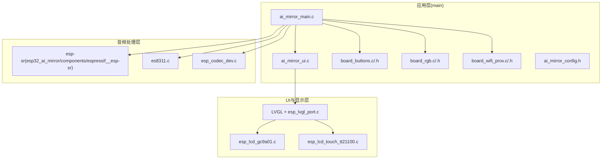
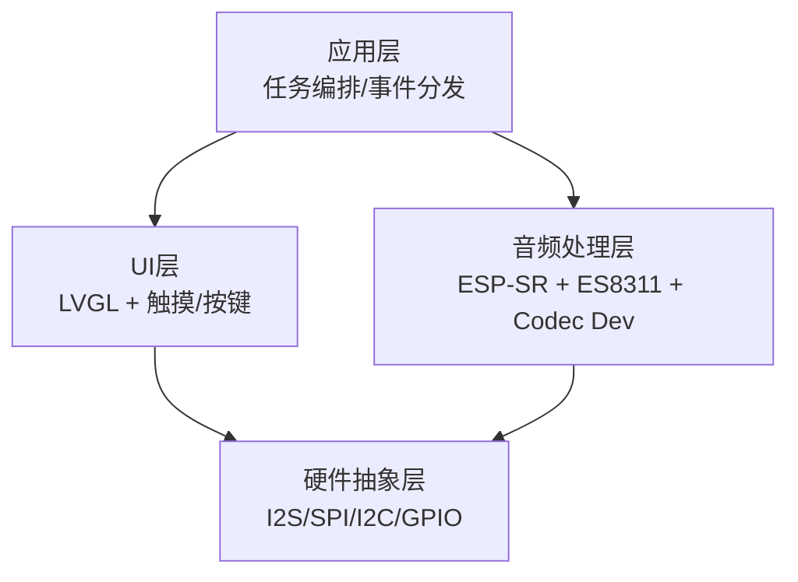
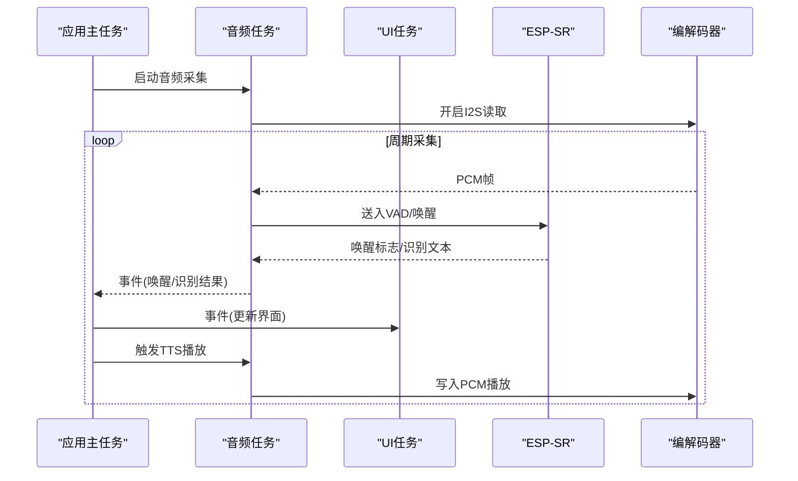
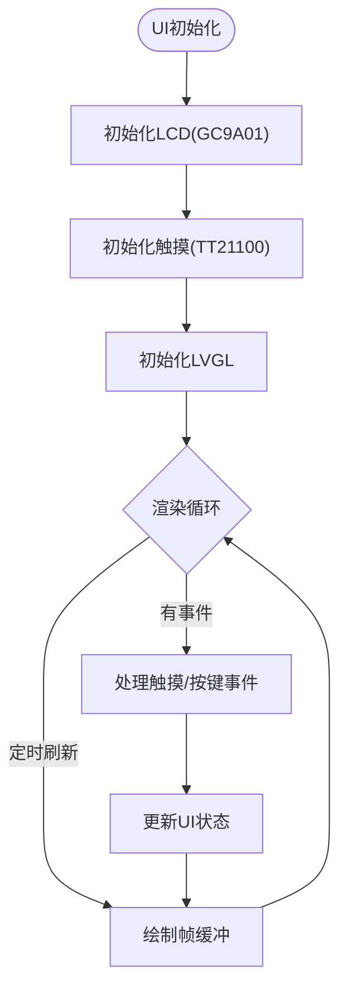
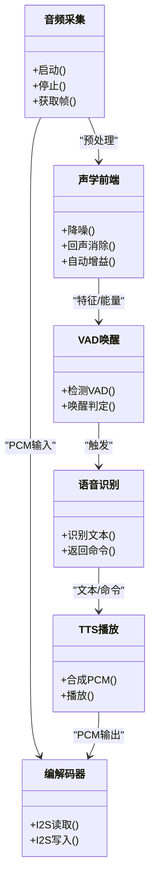
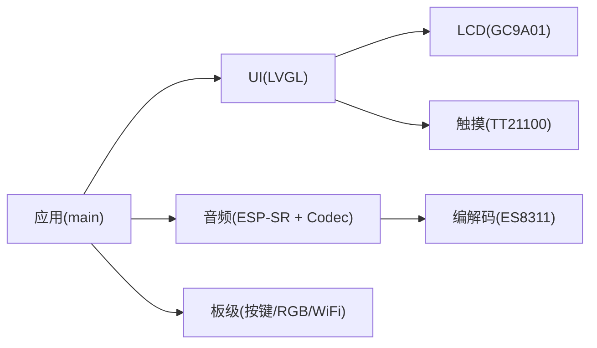

# 软件架构

<cite>
**本文引用的文件**   
- [ai_mirror_main.c](file://Firmware/esp32_ai_mirror/main/ai_mirror_main.c)
- [ai_mirror_ui.c](file://Firmware/esp32_ai_mirror/main/ai_mirror_ui.c)
- [board_buttons.c](file://Firmware/esp32_ai_mirror/main/board_buttons.c)
- [board_buttons.h](file://Firmware/esp32_ai_mirror/main/board_buttons.h)
- [board_rgb.c](file://Firmware/esp32_ai_mirror/main/board_rgb.c)
- [board_rgb.h](file://Firmware/esp32_ai_mirror/main/board_rgb.h)
- [board_wifi_prov.c](file://Firmware/esp32_ai_mirror/main/board_wifi_prov.c)
- [board_wifi_prov.h](file://Firmware/esp32_ai_mirror/main/board_wifi_prov.h)
- [ai_mirror_config.h](file://Firmware/esp32_ai_mirror/main/ai_mirror_config.h)
- [CMakeLists.txt](file://Firmware/esp32_ai_mirror/CMakeLists.txt)
- [idf_component.yml](file://Firmware/esp32_ai_mirror/components/espressif__esp-sr/idf_component.yml)
- [esp_lvgl_port.c](file://Firmware/esp32_ai_mirror/managed_components/espressif__esp-lvgl-port/esp_lvgl_port.c)
- [es8311.c](file://Firmware/esp32_ai_mirror/managed_components/espressif__es8311/es8311.c)
- [esp_codec_dev.c](file://Firmware/esp32_ai_mirror/managed_components/espressif__esp_codec_dev/esp_codec_dev.c)
- [esp_lcd_gc9a01.c](file://Firmware/esp32_ai_mirror/managed_components/espressif__esp_lcd_gc9a01/esp_lcd_gc9a01.c)
- [esp_lcd_touch_tt21100.c](file://Firmware/esp32_ai_mirror/managed_components/espressif__esp_lcd_touch_tt21100/esp_lcd_touch_tt21100.c)
- [README.md](file://Firmware/esp32_ai_mirror/README.md)
</cite>

## 目录
1. [简介](#简介)
2. [项目结构](#项目结构)
3. [核心组件](#核心组件)
4. [架构总览](#架构总览)
5. [详细组件分析](#详细组件分析)
6. [依赖关系分析](#依赖关系分析)
7. [性能考虑](#性能考虑)
8. [故障排查指南](#故障排查指南)
9. [结论](#结论)
10. [附录](#附录)

## 简介
本文件面向AI镜子（ESP-IDF）项目的软件架构，系统化阐述分层设计：应用层、UI层、音频处理层与硬件抽象层。重点说明各模块职责、数据流向与通信机制，解释事件驱动架构的实现方式与任务调度策略，并给出内存管理、资源分配与性能优化建议。文档同时涵盖第三方组件集成与自定义扩展点，提供架构图与数据流图，帮助开发者快速理解整体设计与实现路径。

## 项目结构
本项目基于ESP-IDF构建，采用“应用+组件”的组织方式：
- 应用代码位于 main 目录，负责业务编排、任务创建、事件分发与状态机管理。
- 组件通过 components 与 managed_components 引入，包括语音识别（esp-sr）、显示驱动（GC9A01）、触摸（TT21100）、LVGL端口、编解码器（ES8311）等。
- 构建系统由 CMakeLists.txt 与 idf_component.yml 管理，sdkconfig.defaults 提供默认配置。

图表来源
- [ai_mirror_main.c](file://Firmware/esp32_ai_mirror/main/ai_mirror_main.c)
- [ai_mirror_ui.c](file://Firmware/esp32_ai_mirror/main/ai_mirror_ui.c)
- [board_buttons.c](file://Firmware/esp32_ai_mirror/main/board_buttons.c)
- [board_rgb.c](file://Firmware/esp32_ai_mirror/main/board_rgb.c)
- [board_wifi_prov.c](file://Firmware/esp32_ai_mirror/main/board_wifi_prov.c)
- [ai_mirror_config.h](file://Firmware/esp32_ai_mirror/main/ai_mirror_config.h)
- [esp_lvgl_port.c](file://Firmware/esp32_ai_mirror/managed_components/espressif__esp-lvgl-port/esp_lvgl_port.c)
- [esp_lcd_gc9a01.c](file://Firmware/esp32_ai_mirror/managed_components/espressif__esp_lcd_gc9a01/esp_lcd_gc9a01.c)
- [esp_lcd_touch_tt21100.c](file://Firmware/esp32_ai_mirror/managed_components/espressif__esp_lcd_touch_tt21100/esp_lcd_touch_tt21100.c)
- [es8311.c](file://Firmware/esp32_ai_mirror/managed_components/espressif__es8311/es8311.c)
- [esp_codec_dev.c](file://Firmware/esp32_ai_mirror/managed_components/espressif__esp_codec_dev/esp_codec_dev.c)

章节来源
- [CMakeLists.txt](file://Firmware/esp32_ai_mirror/CMakeLists.txt)
- [idf_component.yml](file://Firmware/esp32_ai_mirror/components/espressif__esp-sr/idf_component.yml)
- [README.md](file://Firmware/esp32_ai_mirror/README.md)

## 核心组件
- 应用层（main）
  - 入口与任务编排：初始化系统、创建任务、注册事件回调、启动UI与音频管线。
  - UI层：基于LVGL的界面渲染与交互逻辑，封装显示刷新与触摸事件。
  - 板级抽象：按键、RGB指示灯、WiFi配网等板级功能。
  - 配置：集中管理编译期与运行期参数。
- 音频处理层
  - ESP-SR：唤醒词检测、语音识别、声学前端（降噪、回声消除、AGC）。
  - 编解码器：ES8311驱动与esp_codec_dev统一接口，I2S采集/播放。
- UI与显示层
  - LVGL图形库与esp_lvgl_port适配，GC9A01屏驱动，TT21100触摸驱动。
- 硬件抽象层
  - I2S、SPI、I2C、GPIO、定时器、中断等底层驱动的封装与统一访问。

章节来源
- [ai_mirror_main.c](file://Firmware/esp32_ai_mirror/main/ai_mirror_main.c)
- [ai_mirror_ui.c](file://Firmware/esp32_ai_mirror/main/ai_mirror_ui.c)
- [board_buttons.c](file://Firmware/esp32_ai_mirror/main/board_buttons.c)
- [board_buttons.h](file://Firmware/esp32_ai_mirror/main/board_buttons.h)
- [board_rgb.c](file://Firmware/esp32_ai_mirror/main/board_rgb.c)
- [board_rgb.h](file://Firmware/esp32_ai_mirror/main/board_rgb.h)
- [board_wifi_prov.c](file://Firmware/esp32_ai_mirror/main/board_wifi_prov.c)
- [board_wifi_prov.h](file://Firmware/esp32_ai_mirror/main/board_wifi_prov.h)
- [ai_mirror_config.h](file://Firmware/esp32_ai_mirror/main/ai_mirror_config.h)
- [esp_lvgl_port.c](file://Firmware/esp32_ai_mirror/managed_components/espressif__esp-lvgl-port/esp_lvgl_port.c)
- [esp_lcd_gc9a01.c](file://Firmware/esp32_ai_mirror/managed_components/espressif__esp_lcd_gc9a01/esp_lcd_gc9a01.c)
- [esp_lcd_touch_tt21100.c](file://Firmware/esp32_ai_mirror/managed_components/espressif__esp_lcd_touch_tt21100/esp_lcd_touch_tt21100.c)
- [es8311.c](file://Firmware/esp32_ai_mirror/managed_components/espressif__es8311/es8311.c)
- [esp_codec_dev.c](file://Firmware/esp32_ai_mirror/managed_components/espressif__esp_codec_dev/esp_codec_dev.c)

## 架构总览
系统采用分层与事件驱动相结合的设计：
- 应用层作为协调者，创建并管理多个任务（音频采集、唤醒识别、UI渲染、网络配网），通过队列/事件组进行解耦通信。
- UI层以LVGL为核心，周期性刷新显示，响应触摸与按键事件。
- 音频层以ESP-SR为智能核心，结合编解码器完成实时采集、VAD、唤醒、识别与TTS播放。
- 硬件抽象层屏蔽具体外设差异，向上提供稳定API。

图表来源
- [ai_mirror_main.c](file://Firmware/esp32_ai_mirror/main/ai_mirror_main.c)
- [ai_mirror_ui.c](file://Firmware/esp32_ai_mirror/main/ai_mirror_ui.c)
- [esp_lvgl_port.c](file://Firmware/esp32_ai_mirror/managed_components/espressif__esp-lvgl-port/esp_lvgl_port.c)
- [es8311.c](file://Firmware/esp32_ai_mirror/managed_components/espressif__es8311/es8311.c)
- [esp_codec_dev.c](file://Firmware/esp32_ai_mirror/managed_components/espressif__esp_codec_dev/esp_codec_dev.c)

## 详细组件分析

### 应用层与任务调度
- 任务划分
  - 音频任务：I2S采集、VAD/唤醒检测、识别结果上报。
  - UI任务：LVGL刷新、页面切换、动画与反馈。
  - 控制任务：按键扫描、RGB指示、WiFi配网流程。
- 事件驱动
  - 使用事件组/队列在任务间传递状态与数据，避免阻塞。
  - 典型事件：唤醒触发、识别完成、TTS播放开始/结束、屏幕刷新请求。
- 资源管理
  - 动态内存按块分配，关键缓冲区预分配以降低抖动。
  - 锁保护共享资源（如全局状态、显示缓冲区）。

图表来源
- [ai_mirror_main.c](file://Firmware/esp32_ai_mirror/main/ai_mirror_main.c)
- [ai_mirror_ui.c](file://Firmware/esp32_ai_mirror/main/ai_mirror_ui.c)
- [es8311.c](file://Firmware/esp32_ai_mirror/managed_components/espressif__es8311/es8311.c)
- [esp_codec_dev.c](file://Firmware/esp32_ai_mirror/managed_components/espressif__esp_codec_dev/esp_codec_dev.c)

章节来源
- [ai_mirror_main.c](file://Firmware/esp32_ai_mirror/main/ai_mirror_main.c)
- [ai_mirror_ui.c](file://Firmware/esp32_ai_mirror/main/ai_mirror_ui.c)

### UI层（LVGL与显示/触摸）
- 显示驱动：GC9A01通过SPI与MCU通信，LVGL绘制帧缓冲，esp_lvgl_port负责刷新与DMA传输。
- 触摸输入：TT21100通过I2C上报坐标，转换为LVGL事件。
- 界面状态：待机、唤醒中、对话中、播放中等状态机驱动页面切换。

图表来源
- [esp_lvgl_port.c](file://Firmware/esp32_ai_mirror/managed_components/espressif__esp-lvgl-port/esp_lvgl_port.c)
- [esp_lcd_gc9a01.c](file://Firmware/esp32_ai_mirror/managed_components/espressif__esp_lcd_gc9a01/esp_lcd_gc9a01.c)
- [esp_lcd_touch_tt21100.c](file://Firmware/esp32_ai_mirror/managed_components/espressif__esp_lcd_touch_tt21100/esp_lcd_touch_tt21100.c)
- [ai_mirror_ui.c](file://Firmware/esp32_ai_mirror/main/ai_mirror_ui.c)

章节来源
- [ai_mirror_ui.c](file://Firmware/esp32_ai_mirror/main/ai_mirror_ui.c)
- [esp_lvgl_port.c](file://Firmware/esp32_ai_mirror/managed_components/espressif__esp-lvgl-port/esp_lvgl_port.c)
- [esp_lcd_gc9a01.c](file://Firmware/esp32_ai_mirror/managed_components/espressif__esp_lcd_gc9a01/esp_lcd_gc9a01.c)
- [esp_lcd_touch_tt21100.c](file://Firmware/esp32_ai_mirror/managed_components/espressif__esp_lcd_touch_tt21100/esp_lcd_touch_tt21100.c)

### 音频处理层（ESP-SR与编解码器）
- 采集链路：I2S从ES8311读取PCM，经降噪/回声消除/AGC后送入VAD与唤醒模型。
- 识别链路：唤醒成功后进入连续识别，输出文本或命令。
- 播放链路：TTS生成PCM，经编解码器写入I2S播放。
- 同步策略：音频任务与UI任务通过事件/队列解耦，保证低延迟与稳定性。

图表来源
- [es8311.c](file://Firmware/esp32_ai_mirror/managed_components/espressif__es8311/es8311.c)
- [esp_codec_dev.c](file://Firmware/esp32_ai_mirror/managed_components/espressif__esp_codec_dev/esp_codec_dev.c)
- [idf_component.yml](file://Firmware/esp32_ai_mirror/components/espressif__esp-sr/idf_component.yml)

章节来源
- [es8311.c](file://Firmware/esp32_ai_mirror/managed_components/espressif__es8311/es8311.c)
- [esp_codec_dev.c](file://Firmware/esp32_ai_mirror/managed_components/espressif__esp_codec_dev/esp_codec_dev.c)
- [idf_component.yml](file://Firmware/esp32_ai_mirror/components/espressif__esp-sr/idf_component.yml)

### 硬件抽象层（HAL）
- I2S：音频采样与播放的核心通道，支持双工模式。
- SPI：用于LCD与Flash等高速外设。
- I2C：用于触摸、编解码器寄存器配置。
- GPIO/中断：按键、LED、外部事件接入。
- 时钟与定时器：用于UI刷新节拍与音频缓冲调度。

章节来源
- [esp_lvgl_port.c](file://Firmware/esp32_ai_mirror/managed_components/espressif__esp-lvgl-port/esp_lvgl_port.c)
- [esp_lcd_gc9a01.c](file://Firmware/esp32_ai_mirror/managed_components/espressif__esp_lcd_gc9a01/esp_lcd_gc9a01.c)
- [esp_lcd_touch_tt21100.c](file://Firmware/esp32_ai_mirror/managed_components/espressif__esp_lcd_touch_tt21100/esp_lcd_touch_tt21100.c)
- [es8311.c](file://Firmware/esp32_ai_mirror/managed_components/espressif__es8311/es8311.c)

### 板级功能（按键、RGB、WiFi配网）
- 按键：轮询或中断扫描，映射到系统事件。
- RGB：状态指示（待机/唤醒/播放/错误）。
- WiFi配网：通过软AP或BLE引导用户完成网络配置。

章节来源
- [board_buttons.c](file://Firmware/esp32_ai_mirror/main/board_buttons.c)
- [board_buttons.h](file://Firmware/esp32_ai_mirror/main/board_buttons.h)
- [board_rgb.c](file://Firmware/esp32_ai_mirror/main/board_rgb.c)
- [board_rgb.h](file://Firmware/esp32_ai_mirror/main/board_rgb.h)
- [board_wifi_prov.c](file://Firmware/esp32_ai_mirror/main/board_wifi_prov.c)
- [board_wifi_prov.h](file://Firmware/esp32_ai_mirror/main/board_wifi_prov.h)

## 依赖关系分析
- 组件依赖
  - 应用层依赖UI层、音频层与板级功能。
  - UI层依赖LVGL端口与显示/触摸驱动。
  - 音频层依赖ESP-SR与编解码器。
- 构建依赖
  - CMakeLists.txt定义目标与源文件集合。
  - idf_component.yml声明第三方组件版本与依赖。

图表来源
- [CMakeLists.txt](file://Firmware/esp32_ai_mirror/CMakeLists.txt)
- [idf_component.yml](file://Firmware/esp32_ai_mirror/components/espressif__esp-sr/idf_component.yml)
- [esp_lvgl_port.c](file://Firmware/esp32_ai_mirror/managed_components/espressif__esp-lvgl-port/esp_lvgl_port.c)
- [esp_lcd_gc9a01.c](file://Firmware/esp32_ai_mirror/managed_components/espressif__esp_lcd_gc9a01/esp_lcd_gc9a01.c)
- [esp_lcd_touch_tt21100.c](file://Firmware/esp32_ai_mirror/managed_components/espressif__esp_lcd_touch_tt21100/esp_lcd_touch_tt21100.c)
- [es8311.c](file://Firmware/esp32_ai_mirror/managed_components/espressif__es8311/es8311.c)

章节来源
- [CMakeLists.txt](file://Firmware/esp32_ai_mirror/CMakeLists.txt)
- [idf_component.yml](file://Firmware/esp32_ai_mirror/components/espressif__esp-sr/idf_component.yml)

## 性能考虑
- 内存管理
  - 关键缓冲区（音频帧、显示帧）静态分配，减少堆碎片与抖动。
  - 使用内存池管理短生命周期对象，降低频繁分配开销。
- 任务与调度
  - 音频任务高优先级，确保实时性；UI任务中优先级，避免卡顿。
  - 事件队列长度合理设置，防止溢出或过度等待。
- I/O与总线
  - I2S DMA传输，减少CPU占用。
  - SPI/LCD刷新批量操作，降低中断频率。
- 算法优化
  - 选择合适的VAD阈值与唤醒模型，平衡功耗与误触率。
  - 压缩TTS音频格式，按需加载模型，降低RAM压力。
- 功耗
  - 空闲时关闭非必要外设，降低时钟频率。
  - 按键中断唤醒，缩短活跃时间。

[本节为通用指导，不直接分析具体文件]

## 故障排查指南
- 常见问题定位
  - 无音频：检查I2S初始化、ES8311寄存器配置、编解码器路径。
  - 无法唤醒：调整VAD阈值，确认麦克风通路与环境噪声。
  - 显示异常：校验SPI时序、LVGL刷新回调与帧缓冲大小。
  - 触摸无效：检查I2C地址与中断引脚配置。
- 调试手段
  - 日志分级输出，区分任务边界。
  - 使用事件追踪记录关键路径耗时。
  - 对关键变量加断点与条件断言。

章节来源
- [es8311.c](file://Firmware/esp32_ai_mirror/managed_components/espressif__es8311/es8311.c)
- [esp_codec_dev.c](file://Firmware/esp32_ai_mirror/managed_components/espressif__esp_codec_dev/esp_codec_dev.c)
- [esp_lvgl_port.c](file://Firmware/esp32_ai_mirror/managed_components/espressif__esp-lvgl-port/esp_lvgl_port.c)
- [esp_lcd_gc9a01.c](file://Firmware/esp32_ai_mirror/managed_components/espressif__esp_lcd_gc9a01/esp_lcd_gc9a01.c)
- [esp_lcd_touch_tt21100.c](file://Firmware/esp32_ai_mirror/managed_components/espressif__esp_lcd_touch_tt21100/esp_lcd_touch_tt21100.c)

## 结论
本项目采用清晰的分层架构与事件驱动机制，将应用、UI、音频与硬件抽象解耦，便于扩展与维护。通过合理的任务调度、内存管理与I/O优化，系统在低功耗设备上实现了稳定的语音交互与流畅的UI体验。开发者可基于现有扩展点快速集成新能力，如更换显示/触摸驱动、替换音频前端或增加新的UI页面。

[本节为总结性内容，不直接分析具体文件]

## 附录
- 第三方组件集成要点
  - ESP-SR：通过idf_component.yml引入，配置模型路径与特性开关。
  - LVGL：使用esp_lvgl_port适配显示与触摸，配置刷新回调与帧缓冲。
  - 编解码器：ES8311通过I2C配置，I2S数据路径对接esp_codec_dev。
- 自定义扩展点
  - 新增UI页面：在UI层添加视图与事件处理，通过应用层事件触发。
  - 新增音频效果：在声学前端插入处理节点，保持接口一致。
  - 新增传感器：在HAL层封装驱动，向上暴露统一API。

章节来源
- [idf_component.yml](file://Firmware/esp32_ai_mirror/components/espressif__esp-sr/idf_component.yml)
- [esp_lvgl_port.c](file://Firmware/esp32_ai_mirror/managed_components/espressif__esp-lvgl-port/esp_lvgl_port.c)
- [es8311.c](file://Firmware/esp32_ai_mirror/managed_components/espressif__es8311/es8311.c)
- [esp_codec_dev.c](file://Firmware/esp32_ai_mirror/managed_components/espressif__esp_codec_dev/esp_codec_dev.c)