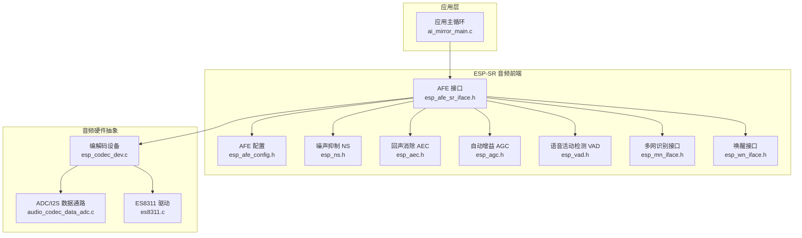
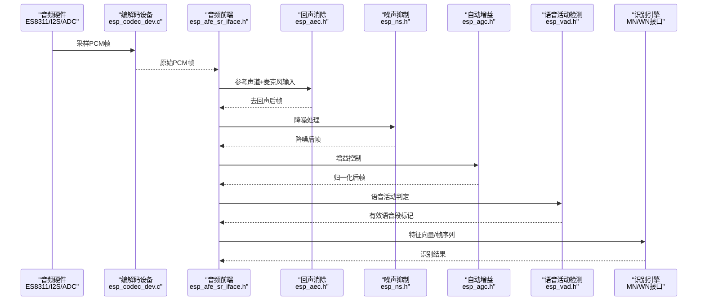
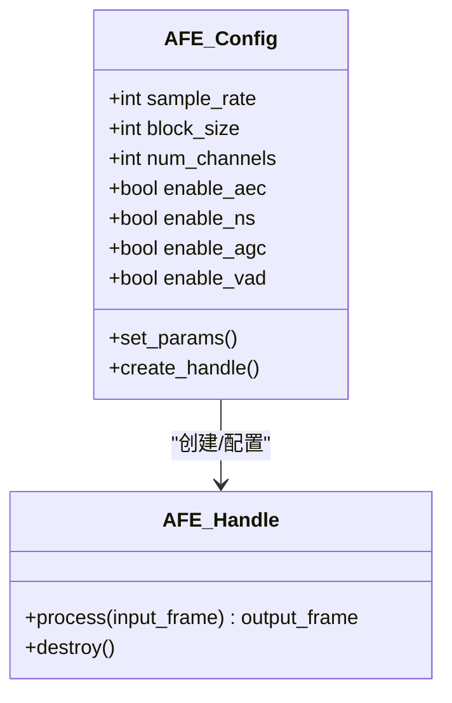
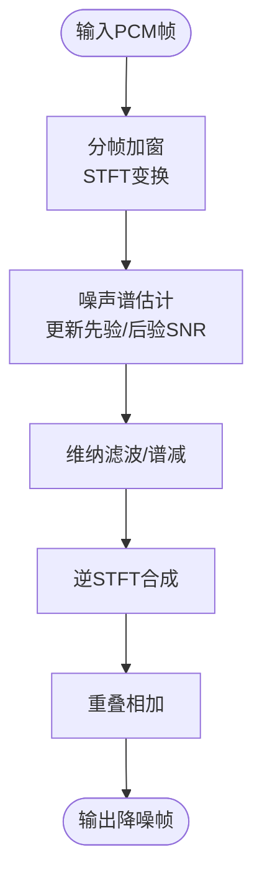
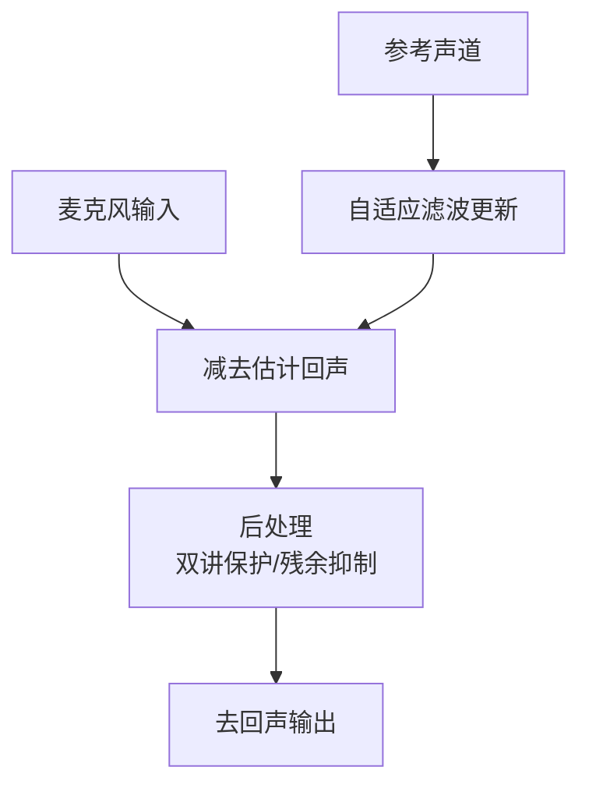
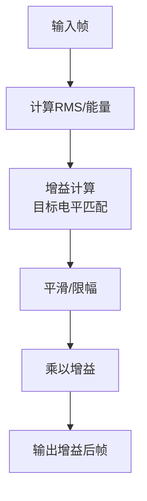
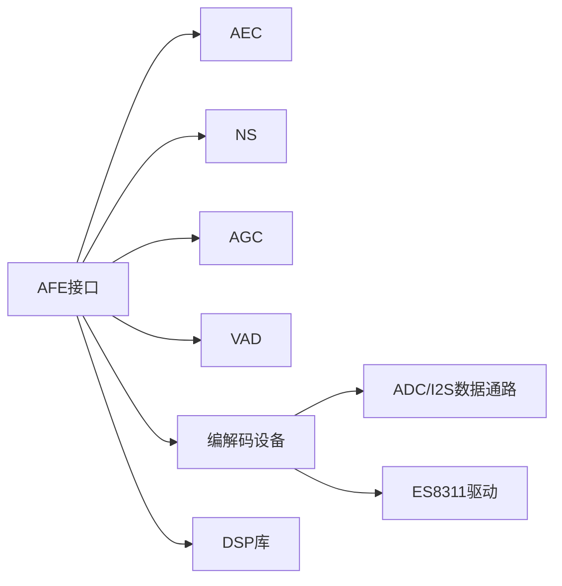

# 音频信号处理

<cite>
**本文引用的文件**   
- [esp_afe_sr_iface.h](file://Firmware/esp32_ai_mirror/components/espressif__esp-sr/include/esp32/esp_afe_sr_iface.h)
- [esp_afe_config.h](file://Firmware/esp32_ai_mirror/components/espressif__esp-sr/include/esp32/esp_afe_config.h)
- [esp_ns.h](file://Firmware/esp32_ai_mirror/components/espressif__esp-sr/include/esp32/esp_ns.h)
- [esp_agc.h](file://Firmware/esp32_ai_mirror/components/espressif__esp-sr/include/esp32/esp_agc.h)
- [esp_aec.h](file://Firmware/esp32_ai_mirror/components/espressif__esp-sr/include/esp32/esp_aec.h)
- [esp_vad.h](file://Firmware/esp32_ai_mirror/components/espressif__esp-sr/include/esp32/esp_vad.h)
- [esp_mn_iface.h](file://Firmware/esp32_ai_mirror/components/espressif__esp-sr/include/esp32/esp_mn_iface.h)
- [esp_wn_iface.h](file://Firmware/esp32_ai_mirror/components/espressif__esp-sr/include/esp32/esp_wn_iface.h)
- [dl_lib.h](file://Firmware/esp32_ai_mirror/components/espressif__esp-sr/include/esp32/dl_lib.h)
- [esp_codec_dev.c](file://Firmware/esp32_ai_mirror/managed_components/espressif__esp_codec_dev/esp_codec_dev.c)
- [audio_codec_data_adc.c](file://Firmware/esp32_ai_mirror/managed_components/espressif__esp_codec_dev/platform/audio_codec_data_adc.c)
- [es8311.c](file://Firmware/esp32_ai_mirror/managed_components/espressif__es8311/es8311.c)
- [ai_mirror_main.c](file://Firmware/esp32_ai_mirror/main/ai_mirror_main.c)
- [README.md](file://Firmware/esp32_ai_mirror/README.md)
</cite>

## 目录
1. [简介](#简介)
2. [项目结构](#项目结构)
3. [核心组件](#核心组件)
4. [架构总览](#架构总览)
5. [详细组件分析](#详细组件分析)
6. [依赖关系分析](#依赖关系分析)
7. [性能考量](#性能考量)
8. [故障排查指南](#故障排查指南)
9. [结论](#结论)
10. [附录](#附录)

## 简介
本文件面向ESP-SR框架中的音频信号处理模块，系统性阐述噪声抑制(NS)、回声消除(AEC)、自动增益控制(AGC)等音频增强算法的实现与集成方式；同时覆盖数字信号处理(DSP)关键优化（如FFT、滤波器设计、特征提取）、音频预处理流水线、实时延迟优化与内存管理策略。文档还给出音频质量评估指标、参数调优建议与基准测试方法，帮助开发者在ESP32/S3平台上构建低延迟、高鲁棒性的语音前端。

## 项目结构
本项目围绕ESP-IDF工程组织，音频相关能力主要分布在以下位置：
- ESP-SR组件：提供AEC/NS/AGC/VAD及唤醒/识别接口与配置模型
- ESP-Codec-Dev：I2S/ADC数据通路、编解码器驱动封装
- ES8311驱动：具体音频编解码芯片的寄存器配置与数据流控制
- 应用入口：main任务负责初始化音频链路、启动AEC/NS/AGC管线并对接识别引擎

图表来源
- [ai_mirror_main.c](file://Firmware/esp32_ai_mirror/main/ai_mirror_main.c)
- [esp_afe_sr_iface.h](file://Firmware/esp32_ai_mirror/components/espressif__esp-sr/include/esp32/esp_afe_sr_iface.h)
- [esp_afe_config.h](file://Firmware/esp32_ai_mirror/components/espressif__esp-sr/include/esp32/esp_afe_config.h)
- [esp_ns.h](file://Firmware/esp32_ai_mirror/components/espressif__esp-sr/include/esp32/esp_ns.h)
- [esp_aec.h](file://Firmware/esp32_ai_mirror/components/espressif__esp-sr/include/esp32/esp_aec.h)
- [esp_agc.h](file://Firmware/esp32_ai_mirror/components/espressif__esp-sr/include/esp32/esp_agc.h)
- [esp_vad.h](file://Firmware/esp32_ai_mirror/components/espressif__esp-sr/include/esp32/esp_vad.h)
- [esp_mn_iface.h](file://Firmware/esp32_ai_mirror/components/espressif__esp-sr/include/esp32/esp_mn_iface.h)
- [esp_wn_iface.h](file://Firmware/esp32_ai_mirror/components/espressif__esp-sr/include/esp32/esp_wn_iface.h)
- [esp_codec_dev.c](file://Firmware/esp32_ai_mirror/managed_components/espressif__esp_codec_dev/esp_codec_dev.c)
- [audio_codec_data_adc.c](file://Firmware/esp32_ai_mirror/managed_components/espressif__esp_codec_dev/platform/audio_codec_data_adc.c)
- [es8311.c](file://Firmware/esp32_ai_mirror/managed_components/espressif__es8311/es8311.c)

章节来源
- [README.md](file://Firmware/esp32_ai_mirror/README.md)

## 核心组件
- 音频前端接口(AFE)：统一封装AEC/NS/AGC/VAD等前处理模块，提供帧级输入输出接口与配置对象，屏蔽底层DSP细节
- 噪声抑制(NS)：基于频域/时域联合估计，抑制稳态与非稳态噪声，提升信噪比
- 回声消除(AEC)：自适应滤波估计声学路径，抵消扬声器到麦克风的回声
- 自动增益控制(AGC)：动态调整增益以稳定输出电平，避免削波或过低音量
- 语音活动检测(VAD)：快速判定语音段，降低后续识别计算负载
- 识别接口(MN/WN)：将预处理后的特征送入多网词识别或唤醒引擎

章节来源
- [esp_afe_sr_iface.h](file://Firmware/esp32_ai_mirror/components/espressif__esp-sr/include/esp32/esp_afe_sr_iface.h)
- [esp_afe_config.h](file://Firmware/esp32_ai_mirror/components/espressif__esp-sr/include/esp32/esp_afe_config.h)
- [esp_ns.h](file://Firmware/esp32_ai_mirror/components/espressif__esp-sr/include/esp32/esp_ns.h)
- [esp_aec.h](file://Firmware/esp32_ai_mirror/components/espressif__esp-sr/include/esp32/esp_aec.h)
- [esp_agc.h](file://Firmware/esp32_ai_mirror/components/espressif__esp-sr/include/esp32/esp_agc.h)
- [esp_vad.h](file://Firmware/esp32_ai_mirror/components/espressif__esp-sr/include/esp32/esp_vad.h)
- [esp_mn_iface.h](file://Firmware/esp32_ai_mirror/components/espressif__esp-sr/include/esp32/esp_mn_iface.h)
- [esp_wn_iface.h](file://Firmware/esp32_ai_mirror/components/espressif__esp-sr/include/esp32/esp_wn_iface.h)

## 架构总览
下图展示从音频采集到识别引擎的端到端数据流，强调AEC/NS/AGC/VAD的串联顺序与数据形态转换。

图表来源
- [esp_afe_sr_iface.h](file://Firmware/esp32_ai_mirror/components/espressif__esp-sr/include/esp32/esp_afe_sr_iface.h)
- [esp_aec.h](file://Firmware/esp32_ai_mirror/components/espressif__esp-sr/include/esp32/esp_aec.h)
- [esp_ns.h](file://Firmware/esp32_ai_mirror/components/espressif__esp-sr/include/esp32/esp_ns.h)
- [esp_agc.h](file://Firmware/esp32_ai_mirror/components/espressif__esp-sr/include/esp32/esp_agc.h)
- [esp_vad.h](file://Firmware/esp32_ai_mirror/components/espressif__esp-sr/include/esp32/esp_vad.h)
- [esp_mn_iface.h](file://Firmware/esp32_ai_mirror/components/espressif__esp-sr/include/esp32/esp_mn_iface.h)
- [esp_wn_iface.h](file://Firmware/esp32_ai_mirror/components/espressif__esp-sr/include/esp32/esp_wn_iface.h)
- [esp_codec_dev.c](file://Firmware/esp32_ai_mirror/managed_components/espressif__esp_codec_dev/esp_codec_dev.c)

## 详细组件分析

### 音频前端接口(AFE)与配置
- 职责：统一创建/销毁AEC/NS/AGC实例，管理帧缓冲、通道数、采样率、块大小等参数，提供统一的process回调
- 关键点：
  - 配置对象包含各子模块开关、步长、窗长、重叠率、目标输出格式
  - 支持单/双麦模式，AEC需要参考声道
  - 内部维护环形缓冲与DMA搬运，保证低延迟

图表来源
- [esp_afe_config.h](file://Firmware/esp32_ai_mirror/components/espressif__esp-sr/include/esp32/esp_afe_config.h)
- [esp_afe_sr_iface.h](file://Firmware/esp32_ai_mirror/components/espressif__esp-sr/include/esp32/esp_afe_sr_iface.h)

章节来源
- [esp_afe_sr_iface.h](file://Firmware/esp32_ai_mirror/components/espressif__esp-sr/include/esp32/esp_afe_sr_iface.h)
- [esp_afe_config.h](file://Firmware/esp32_ai_mirror/components/espressif__esp-sr/include/esp32/esp_afe_config.h)

### 噪声抑制(NS)
- 算法要点：
  - 频域谱估计（短时傅里叶变换STFT）结合维纳滤波或谱减法
  - 非平稳噪声跟踪与平滑因子调节
  - 可选时域辅助约束，减少音乐噪声
- 实现关注：
  - FFT窗口长度与重叠率决定频率分辨率与时间分辨率权衡
  - 固定点/浮点实现选择影响精度与速度
  - 内存复用与零拷贝策略降低峰值占用

图表来源
- [esp_ns.h](file://Firmware/esp32_ai_mirror/components/espressif__esp-sr/include/esp32/esp_ns.h)

章节来源
- [esp_ns.h](file://Firmware/esp32_ai_mirror/components/espressif__esp-sr/include/esp32/esp_ns.h)

### 回声消除(AEC)
- 算法要点：
  - 自适应滤波（NLMS/RLS变体）估计声学冲激响应
  - 双讲检测与保护机制防止发散
  - 残差回声抑制与泄漏补偿
- 实现关注：
  - 参考声道与麦克风通道的对齐与时延校准
  - 步长μ与滤波器阶数对收敛速度与稳定性影响
  - 内存中冲激响应缓存与增量更新

图表来源
- [esp_aec.h](file://Firmware/esp32_ai_mirror/components/espressif__esp-sr/include/esp32/esp_aec.h)

章节来源
- [esp_aec.h](file://Firmware/esp32_ai_mirror/components/espressif__esp-sr/include/esp32/esp_aec.h)

### 自动增益控制(AGC)
- 算法要点：
  - 基于帧能量或RMS的动态增益计算
  - 压缩/扩展曲线与目标电平设定
  - 防抖与平滑过渡避免增益跳变
- 实现关注：
  - 增益更新速率与滞后阈值设置
  - 限幅器防止削波
  - 定点量化下的数值稳定性

图表来源
- [esp_agc.h](file://Firmware/esp32_ai_mirror/components/espressif__esp-sr/include/esp32/esp_agc.h)

章节来源
- [esp_agc.h](file://Firmware/esp32_ai_mirror/components/espressif__esp-sr/include/esp32/esp_agc.h)

### 语音活动检测(VAD)
- 算法要点：
  - 基于能量、过零率、频谱熵等多特征融合
  - 状态机与迟滞门限抑制抖动
- 实现关注：
  - 低复杂度特征计算，适合嵌入式实时
  - 与AEC/NS联动，提高鲁棒性

章节来源
- [esp_vad.h](file://Firmware/esp32_ai_mirror/components/espressif__esp-sr/include/esp32/esp_vad.h)

### 识别接口(MN/WN)
- 多网词识别(MN)：将预处理后的特征送入多网词分类器，返回命令/意图
- 唤醒(WN)：低功耗关键词检测，触发后续流程

章节来源
- [esp_mn_iface.h](file://Firmware/esp32_ai_mirror/components/espressif__esp-sr/include/esp32/esp_mn_iface.h)
- [esp_wn_iface.h](file://Firmware/esp32_ai_mirror/components/espressif__esp-sr/include/esp32/esp_wn_iface.h)

### DSP基础与优化
- FFT/STFT：使用优化的实数FFT与窗函数库，支持不同点数与重叠率
- 滤波器：FIR/IIR设计与实现，注意定点化与系数缩放
- 矩阵运算：轻量矩阵库用于自适应滤波与特征计算
- 内存管理：预分配缓冲区、环形队列、零拷贝传递，减少堆分配

章节来源
- [dl_lib.h](file://Firmware/esp32_ai_mirror/components/espressif__esp-sr/include/esp32/dl_lib.h)

## 依赖关系分析
- 组件耦合：
  - AFE作为编排者，依赖AEC/NS/AGC/VAD的具体实现
  - 编解码设备与硬件驱动为数据源，需保证I2S/ADC时序稳定
- 外部依赖：
  - ESP-DSP库提供FFT/FIR/IIR等基础算子
  - 芯片特定驱动（如ES8311）完成寄存器配置与数据通路

图表来源
- [esp_afe_sr_iface.h](file://Firmware/esp32_ai_mirror/components/espressif__esp-sr/include/esp32/esp_afe_sr_iface.h)
- [esp_aec.h](file://Firmware/esp32_ai_mirror/components/espressif__esp-sr/include/esp32/esp_aec.h)
- [esp_ns.h](file://Firmware/esp32_ai_mirror/components/espressif__esp-sr/include/esp32/esp_ns.h)
- [esp_agc.h](file://Firmware/esp32_ai_mirror/components/espressif__esp-sr/include/esp32/esp_agc.h)
- [esp_vad.h](file://Firmware/esp32_ai_mirror/components/espressif__esp-sr/include/esp32/esp_vad.h)
- [esp_codec_dev.c](file://Firmware/esp32_ai_mirror/managed_components/espressif__esp_codec_dev/esp_codec_dev.c)
- [audio_codec_data_adc.c](file://Firmware/esp32_ai_mirror/managed_components/espressif__esp_codec_dev/platform/audio_codec_data_adc.c)
- [es8311.c](file://Firmware/esp32_ai_mirror/managed_components/espressif__es8311/es8311.c)
- [dl_lib.h](file://Firmware/esp32_ai_mirror/components/espressif__esp-sr/include/esp32/dl_lib.h)

章节来源
- [esp_afe_sr_iface.h](file://Firmware/esp32_ai_mirror/components/espressif__esp-sr/include/esp32/esp_afe_sr_iface.h)
- [esp_codec_dev.c](file://Firmware/esp32_ai_mirror/managed_components/espressif__esp_codec_dev/esp_codec_dev.c)
- [audio_codec_data_adc.c](file://Firmware/esp32_ai_mirror/managed_components/espressif__esp_codec_dev/platform/audio_codec_data_adc.c)
- [es8311.c](file://Firmware/esp32_ai_mirror/managed_components/espressif__es8311/es8311.c)
- [dl_lib.h](file://Firmware/esp32_ai_mirror/components/espressif__esp-sr/include/esp32/dl_lib.h)

## 性能考量
- 实时延迟优化：
  - 减小块大小以降低端到端延迟，但会增加CPU开销
  - 合理设置重叠率与窗口长度，平衡频域分辨率与时间分辨率
  - 使用环形缓冲与DMA搬运，避免阻塞式拷贝
- 内存管理策略：
  - 预分配AEC冲激响应、NS谱估计缓冲、AGC历史状态
  - 复用帧缓冲，减少频繁malloc/free
  - 根据目标平台（ESP32/ESP32-S3）选择合适的数据类型（定点/浮点）
- 计算优化：
  - 利用SIMD/加速库（如ESP-DSP）进行FFT与卷积
  - 针对VAD与AGC采用近似计算与查表法
  - 控制AEC步长与滤波器阶数，避免过度计算

[本节为通用指导，不直接分析具体文件]

## 故障排查指南
- 常见问题与定位：
  - 回声未消除：检查参考声道与麦克风通道是否对齐，AEC步长与阶数是否合适
  - 噪声抑制不足：调整NS谱估计平滑因子与窗长，确认输入信噪比范围
  - 增益不稳定：检查AGC目标电平与更新速率，增加平滑与限幅
  - 识别率低：验证VAD门限与特征提取参数，确保AEC/NS/AGC工作正常
- 调试手段：
  - 导出中间帧（去回声、降噪、增益后）进行离线分析
  - 监控CPU占用与内存峰值，定位瓶颈
  - 使用日志记录关键状态（AEC收敛度、NS增益曲线、AGC增益变化）

章节来源
- [esp_afe_sr_iface.h](file://Firmware/esp32_ai_mirror/components/espressif__esp-sr/include/esp32/esp_afe_sr_iface.h)
- [esp_aec.h](file://Firmware/esp32_ai_mirror/components/espressif__esp-sr/include/esp32/esp_aec.h)
- [esp_ns.h](file://Firmware/esp32_ai_mirror/components/espressif__esp-sr/include/esp32/esp_ns.h)
- [esp_agc.h](file://Firmware/esp32_ai_mirror/components/espressif__esp-sr/include/esp32/esp_agc.h)
- [esp_vad.h](file://Firmware/esp32_ai_mirror/components/espressif__esp-sr/include/esp32/esp_vad.h)

## 结论
ESP-SR框架在ESP32/S3平台上提供了完整的音频前端处理能力，涵盖AEC/NS/AGC/VAD与识别接口。通过合理的参数配置、内存管理与DSP优化，可实现低延迟、高质量的语音采集与预处理。开发者应结合实际应用场景（室内/室外、远场/近场、多声源/单声源）进行参数调优与基准测试，以获得最佳用户体验。

[本节为总结性内容，不直接分析具体文件]

## 附录
- 音频质量评估指标：
  - SNR改善量、PESQ、STOI、MOS主观评分
  - 回声衰减(ERLE)、噪声抑制比(NSR)
- 参数调优建议：
  - AEC：步长μ=1e-3~1e-2，滤波器阶数256~1024，双讲保护开启
  - NS：窗长256~512，重叠率75%，平滑因子0.9~0.99
  - AGC：目标电平-20~-10 dBFS，更新速率10~50 Hz，限幅阈值-1 dBFS
- 基准测试方法：
  - 使用标准语料库与噪声/回声数据集
  - 测量端到端延迟、CPU占用、内存峰值
  - 对比不同参数组合的客观指标与主观听感

[本节为通用指导，不直接分析具体文件]