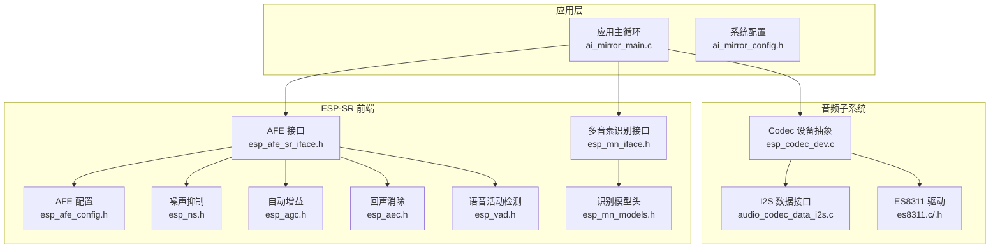
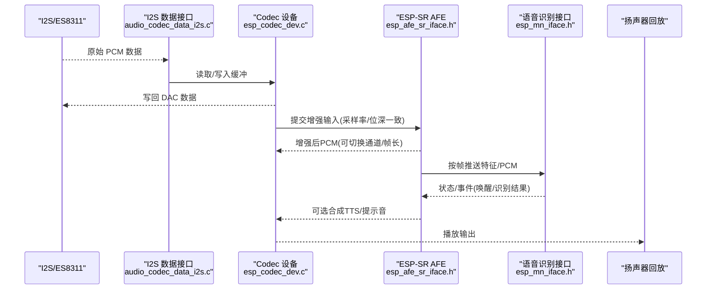
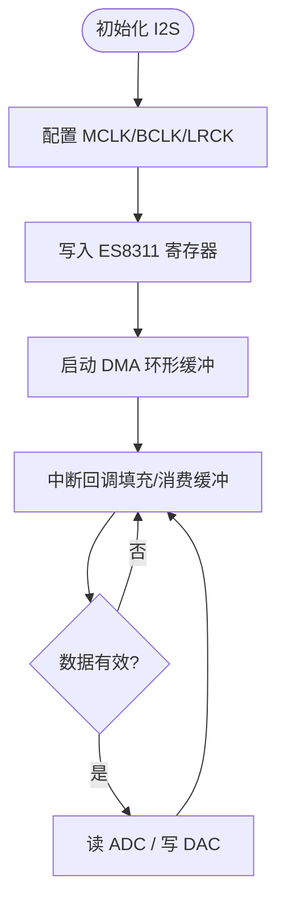
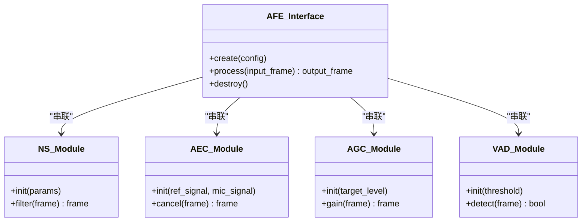
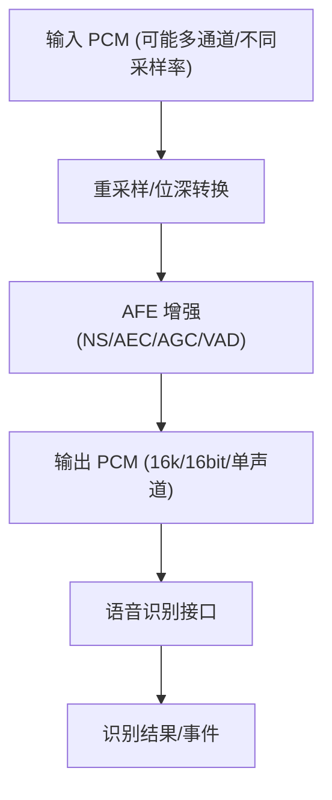
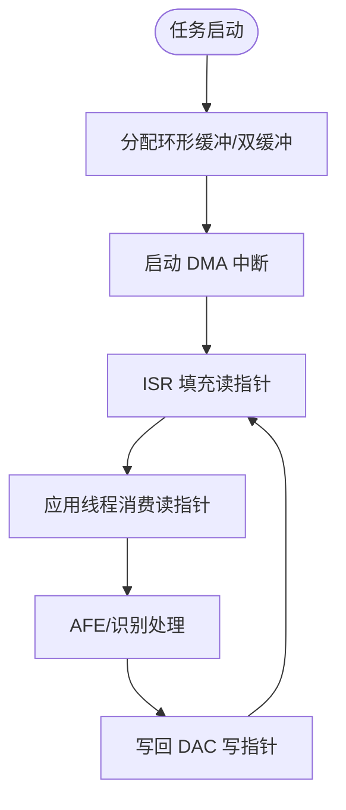
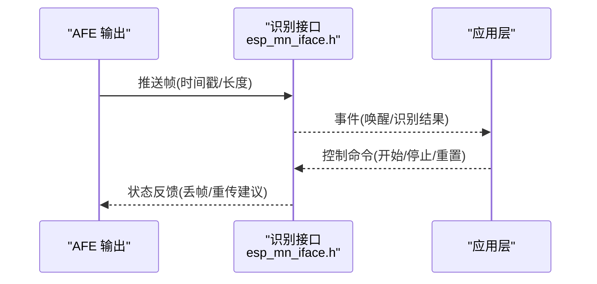
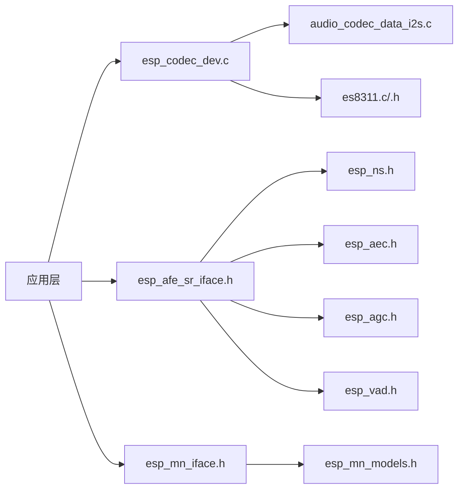

# 音频处理

<cite>
**本文引用的文件**   
- [ai_mirror_main.c](file://Firmware/esp32_ai_mirror/main/ai_mirror_main.c)
- [ai_mirror_config.h](file://Firmware/esp32_ai_mirror/main/ai_mirror_config.h)
- [es8311.c](file://Firmware/esp32_ai_mirror/managed_components/espressif__es8311/es8311.c)
- [es8311.h](file://Firmware/esp32_ai_mirror/managed_components/espressif__es8311/include/es8311.h)
- [audio_codec_data_i2s.c](file://Firmware/esp32_ai_mirror/managed_components/espressif__esp_codec_dev/platform/audio_codec_data_i2s.c)
- [esp_codec_dev.c](file://Firmware/esp32_ai_mirror/managed_components/espressif__esp_codec_dev/esp_codec_dev.c)
- [esp_afe_sr_1mic.ref](file://Firmware/esp32_ai_mirror/components/espressif__esp-sr/src/esp_afe_sr_1mic.ref)
- [esp_afe_config.h](file://Firmware/esp32_ai_mirror/components/espressif__esp-sr/include/esp_afe_config.h)
- [esp_afe_sr_iface.h](file://Firmware/esp32_ai_mirror/components/espressif__esp-sr/include/esp_afe_sr_iface.h)
- [esp_ns.h](file://Firmware/esp32_ai_mirror/components/espressif__esp-sr/include/esp_ns.h)
- [esp_agc.h](file://Firmware/esp32_ai_mirror/components/espressif__esp-sr/include/esp_agc.h)
- [esp_aec.h](file://Firmware/esp32_ai_mirror/components/espressif__esp-sr/include/esp_aec.h)
- [esp_vad.h](file://Firmware/esp32_ai_mirror/components/espressif__esp-sr/include/esp_vad.h)
- [esp_mn_iface.h](file://Firmware/esp32_ai_mirror/components/espressif__esp-sr/include/esp_mn_iface.h)
- [esp_mn_models.h](file://Firmware/esp32_ai_mirror/components/espressif__esp-sr/include/esp_mn_models.h)
- [esp_process_sdkconfig.c](file://Firmware/esp32_ai_mirror/components/espressif__esp-sr/src/esp_process_sdkconfig.c)
- [sdkconfig.defaults](file://Firmware/esp32_ai_mirror/sdkconfig.defaults)
</cite>

## 目录
1. [简介](#简介)
2. [项目结构](#项目结构)
3. [核心组件](#核心组件)
4. [架构总览](#架构总览)
5. [详细组件分析](#详细组件分析)
6. [依赖关系分析](#依赖关系分析)
7. [性能与功耗优化](#性能与功耗优化)
8. [故障排查指南](#故障排查指南)
9. [结论](#结论)
10. [附录](#附录)

## 简介
本文件系统性地梳理基于 ESP-SR 的音频采集、处理与播放架构，覆盖 I2S 接口配置、麦克风阵列前端（AEC/NS/AGC/VAD）、音频编解码流程、缓冲区与实时性优化、格式转换与质量优化策略，以及与语音识别模块的数据接口和同步机制。文档面向不同技术背景的读者，既提供高层概览，也给出代码级分析与图示，帮助快速定位问题与优化空间。

## 项目结构
本项目采用分层与模块化组织：
- 应用层：main 目录包含系统初始化、任务调度与业务逻辑入口。
- 硬件抽象与驱动：通过 esp_codec_dev 统一封装 I2S 数据路径与 codec 控制；es8311 作为具体编解码芯片驱动。
- 算法与前端：esp-sr 提供 AFE（声学前端）与语音识别模型接口，包括 NS、AEC、AGC、VAD 等增强能力。
- 配置与构建：sdkconfig.defaults 与 Kconfig 控制编译选项与运行时参数。

图表来源
- [ai_mirror_main.c](file://Firmware/esp32_ai_mirror/main/ai_mirror_main.c)
- [ai_mirror_config.h](file://Firmware/esp32_ai_mirror/main/ai_mirror_config.h)
- [esp_codec_dev.c](file://Firmware/esp32_ai_mirror/managed_components/espressif__esp_codec_dev/esp_codec_dev.c)
- [audio_codec_data_i2s.c](file://Firmware/esp32_ai_mirror/managed_components/espressif__esp_codec_dev/platform/audio_codec_data_i2s.c)
- [es8311.c](file://Firmware/esp32_ai_mirror/managed_components/espressif__es8311/es8311.c)
- [esp_afe_sr_iface.h](file://Firmware/esp32_ai_mirror/components/espressif__esp-sr/include/esp_afe_sr_iface.h)
- [esp_afe_config.h](file://Firmware/esp32_ai_mirror/components/espressif__esp-sr/include/esp_afe_config.h)
- [esp_ns.h](file://Firmware/esp32_ai_mirror/components/espressif__esp-sr/include/esp_ns.h)
- [esp_agc.h](file://Firmware/esp32_ai_mirror/components/espressif__esp-sr/include/esp_agc.h)
- [esp_aec.h](file://Firmware/esp32_ai_mirror/components/espressif__esp-sr/include/esp_aec.h)
- [esp_vad.h](file://Firmware/esp32_ai_mirror/components/espressif__esp-sr/include/esp_vad.h)
- [esp_mn_iface.h](file://Firmware/esp32_ai_mirror/components/espressif__esp-sr/include/esp_mn_iface.h)
- [esp_mn_models.h](file://Firmware/esp32_ai_mirror/components/espressif__esp-sr/include/esp_mn_models.h)

章节来源
- [ai_mirror_main.c](file://Firmware/esp32_ai_mirror/main/ai_mirror_main.c)
- [sdkconfig.defaults](file://Firmware/esp32_ai_mirror/sdkconfig.defaults)

## 核心组件
- 音频采集链路
  - I2S 数据路径由 esp_codec_dev 抽象，底层通过 audio_codec_data_i2s.c 实现 DMA 传输与中断回调，确保低延迟与稳定吞吐。
  - ES8311 驱动负责寄存器配置（采样率、位宽、时钟源、MCLK/BCLK/LRCK 极性与时序）。
- 声学前端（ESP-SR AFE）
  - 通过 esp_afe_sr_iface.h 暴露统一的 AFE API，内部组合 NS、AEC、AGC、VAD 等模块，输出增强后的单声道或立体声流。
  - esp_afe_config.h 定义通道数、帧长、采样率、模型选择等关键参数。
- 语音识别接口
  - esp_mn_iface.h 提供多音素识别接口，esp_mn_models.h 声明模型常量与加载方式。
- 配置与构建
  - sdkconfig.defaults 与 esp_process_sdkconfig.c 将编译期开关映射到运行时行为（如是否启用 AEC/NS、采样率、缓冲区大小等）。

章节来源
- [audio_codec_data_i2s.c](file://Firmware/esp32_ai_mirror/managed_components/espressif__esp_codec_dev/platform/audio_codec_data_i2s.c)
- [es8311.c](file://Firmware/esp32_ai_mirror/managed_components/espressif__es8311/es8311.c)
- [es8311.h](file://Firmware/esp32_ai_mirror/managed_components/espressif__es8311/include/es8311.h)
- [esp_codec_dev.c](file://Firmware/esp32_ai_mirror/managed_components/espressif__esp_codec_dev/esp_codec_dev.c)
- [esp_afe_sr_iface.h](file://Firmware/esp32_ai_mirror/components/espressif__esp-sr/include/esp_afe_sr_iface.h)
- [esp_afe_config.h](file://Firmware/esp32_ai_mirror/components/espressif__esp-sr/include/esp_afe_config.h)
- [esp_mn_iface.h](file://Firmware/esp32_ai_mirror/components/espressif__esp-sr/include/esp_mn_iface.h)
- [esp_mn_models.h](file://Firmware/esp32_ai_mirror/components/espressif__esp-sr/include/esp_mn_models.h)
- [esp_process_sdkconfig.c](file://Firmware/esp32_ai_mirror/components/espressif__esp-sr/src/esp_process_sdkconfig.c)
- [sdkconfig.defaults](file://Firmware/esp32_ai_mirror/sdkconfig.defaults)

## 架构总览
下图展示从 I2S 采集到 AFE 增强再到识别接口的端到端数据流，以及播放回路的反向路径。

图表来源
- [audio_codec_data_i2s.c](file://Firmware/esp32_ai_mirror/managed_components/espressif__esp_codec_dev/platform/audio_codec_data_i2s.c)
- [esp_codec_dev.c](file://Firmware/esp32_ai_mirror/managed_components/espressif__esp_codec_dev/esp_codec_dev.c)
- [esp_afe_sr_iface.h](file://Firmware/esp32_ai_mirror/components/espressif__esp-sr/include/esp_afe_sr_iface.h)
- [esp_mn_iface.h](file://Firmware/esp32_ai_mirror/components/espressif__esp-sr/include/esp_mn_iface.h)

## 详细组件分析

### I2S 与 ES8311 音频接口
- I2S 数据路径
  - 使用 DMA 环形缓冲与中断回调，保证连续稳定的音频流。
  - 支持双工模式（ADC/DAC 同时运行），注意时钟对齐与相位一致性。
- ES8311 驱动
  - 配置 MCLK/BCLK/LRCK 频率与极性，设置 ADC/DAC 通道、位宽、音量与静音控制。
  - 电源管理与待机模式可降低功耗。

图表来源
- [audio_codec_data_i2s.c](file://Firmware/esp32_ai_mirror/managed_components/espressif__esp_codec_dev/platform/audio_codec_data_i2s.c)
- [es8311.c](file://Firmware/esp32_ai_mirror/managed_components/espressif__es8311/es8311.c)
- [es8311.h](file://Firmware/esp32_ai_mirror/managed_components/espressif__es8311/include/es8311.h)

章节来源
- [audio_codec_data_i2s.c](file://Firmware/esp32_ai_mirror/managed_components/espressif__esp_codec_dev/platform/audio_codec_data_i2s.c)
- [es8311.c](file://Firmware/esp32_ai_mirror/managed_components/espressif__es8311/es8311.c)
- [es8311.h](file://Firmware/esp32_ai_mirror/managed_components/espressif__es8311/include/es8311.h)

### 声学前端（ESP-SR AFE）与增强模块
- AFE 接口
  - 通过 esp_afe_sr_iface.h 创建/销毁实例，设置输入通道、帧长、采样率与模型。
  - 内部管线通常包含：NS → AEC → AGC → VAD，输出干净语音片段。
- 各增强模块
  - NS（噪声抑制）：降低稳态/非稳态背景噪声。
  - AEC（回声消除）：消除扬声器播放对麦克风的回声。
  - AGC（自动增益）：自适应调整增益，保持语音幅度稳定。
  - VAD（语音活动检测）：判断语音起止，减少无效处理。

图表来源
- [esp_afe_sr_iface.h](file://Firmware/esp32_ai_mirror/components/espressif__esp-sr/include/esp_afe_sr_iface.h)
- [esp_ns.h](file://Firmware/esp32_ai_mirror/components/espressif__esp-sr/include/esp_ns.h)
- [esp_aec.h](file://Firmware/esp32_ai_mirror/components/espressif__esp-sr/include/esp_aec.h)
- [esp_agc.h](file://Firmware/esp32_ai_mirror/components/espressif__esp-sr/include/esp_agc.h)
- [esp_vad.h](file://Firmware/esp32_ai_mirror/components/espressif__esp-sr/include/esp_vad.h)

章节来源
- [esp_afe_sr_iface.h](file://Firmware/esp32_ai_mirror/components/espressif__esp-sr/include/esp_afe_sr_iface.h)
- [esp_afe_config.h](file://Firmware/esp32_ai_mirror/components/espressif__esp-sr/include/esp_afe_config.h)
- [esp_ns.h](file://Firmware/esp32_ai_mirror/components/espressif__esp-sr/include/esp_ns.h)
- [esp_aec.h](file://Firmware/esp32_ai_mirror/components/espressif__esp-sr/include/esp_aec.h)
- [esp_agc.h](file://Firmware/esp32_ai_mirror/components/espressif__esp-sr/include/esp_agc.h)
- [esp_vad.h](file://Firmware/esp32_ai_mirror/components/espressif__esp-sr/include/esp_vad.h)

### 音频编解码与格式转换
- 编解码器抽象
  - esp_codec_dev.c 统一 ADC/DAC 控制与数据读写，屏蔽 I2S 差异。
  - audio_codec_data_i2s.c 实现 I2S 数据搬运与缓冲管理。
- 格式转换
  - 在 AFE 前后进行必要的重采样与位深转换，确保与识别模型要求一致（通常为 16kHz/16bit 单声道）。
  - 播放侧根据目标设备特性进行上采样或下采样。

图表来源
- [esp_codec_dev.c](file://Firmware/esp32_ai_mirror/managed_components/espressif__esp_codec_dev/esp_codec_dev.c)
- [audio_codec_data_i2s.c](file://Firmware/esp32_ai_mirror/managed_components/espressif__esp_codec_dev/platform/audio_codec_data_i2s.c)
- [esp_mn_iface.h](file://Firmware/esp32_ai_mirror/components/espressif__esp-sr/include/esp_mn_iface.h)

章节来源
- [esp_codec_dev.c](file://Firmware/esp32_ai_mirror/managed_components/espressif__esp_codec_dev/esp_codec_dev.c)
- [audio_codec_data_i2s.c](file://Firmware/esp32_ai_mirror/managed_components/espressif__esp_codec_dev/platform/audio_codec_data_i2s.c)
- [esp_mn_iface.h](file://Firmware/esp32_ai_mirror/components/espressif__esp-sr/include/esp_mn_iface.h)

### 缓冲区管理与实时性优化
- 环形缓冲与双缓冲
  - I2S DMA 使用环形缓冲，避免拷贝开销；应用层采用双缓冲减少抖动。
- 队列与优先级
  - 音频线程高优先级，识别线程中优先级，UI 线程低优先级，防止阻塞。
- 延迟控制
  - 合理设置帧长与缓冲深度，平衡时延与稳定性；必要时启用零拷贝路径。

图表来源
- [audio_codec_data_i2s.c](file://Firmware/esp32_ai_mirror/managed_components/espressif__esp_codec_dev/platform/audio_codec_data_i2s.c)

章节来源
- [audio_codec_data_i2s.c](file://Firmware/esp32_ai_mirror/managed_components/espressif__esp_codec_dev/platform/audio_codec_data_i2s.c)

### 与语音识别模块的数据接口与同步
- 数据接口
  - 通过 esp_mn_iface.h 提供的接口向识别引擎推送帧，并接收事件（唤醒、识别结果、置信度）。
- 同步机制
  - 以帧为单位同步，确保 AFE 输出与识别输入一致；必要时插入时间戳用于对齐。
  - 若需要 TTS 回放，需与识别结果事件解耦，避免阻塞识别线程。

图表来源
- [esp_mn_iface.h](file://Firmware/esp32_ai_mirror/components/espressif__esp-sr/include/esp_mn_iface.h)
- [esp_mn_models.h](file://Firmware/esp32_ai_mirror/components/espressif__esp-sr/include/esp_mn_models.h)

章节来源
- [esp_mn_iface.h](file://Firmware/esp32_ai_mirror/components/espressif__esp-sr/include/esp_mn_iface.h)
- [esp_mn_models.h](file://Firmware/esp32_ai_mirror/components/espressif__esp-sr/include/esp_mn_models.h)

## 依赖关系分析
- 组件耦合
  - 应用层依赖 esp_codec_dev 与 AFE 接口；AFE 依赖 NS/AEC/AGC/VAD 模块。
  - I2S 数据路径与 ES8311 驱动紧密耦合，需保持一致的时钟与位深配置。
- 外部依赖
  - ESP-SR 库与模型头文件；ESP Codec Dev 平台抽象。
- 潜在循环依赖
  - 通过接口隔离（iface.h）避免直接循环；识别结果仅以事件形式回传。

图表来源
- [esp_codec_dev.c](file://Firmware/esp32_ai_mirror/managed_components/espressif__esp_codec_dev/esp_codec_dev.c)
- [audio_codec_data_i2s.c](file://Firmware/esp32_ai_mirror/managed_components/espressif__esp_codec_dev/platform/audio_codec_data_i2s.c)
- [es8311.c](file://Firmware/esp32_ai_mirror/managed_components/espressif__es8311/es8311.c)
- [esp_afe_sr_iface.h](file://Firmware/esp32_ai_mirror/components/espressif__esp-sr/include/esp_afe_sr_iface.h)
- [esp_ns.h](file://Firmware/esp32_ai_mirror/components/espressif__esp-sr/include/esp_ns.h)
- [esp_aec.h](file://Firmware/esp32_ai_mirror/components/espressif__esp-sr/include/esp_aec.h)
- [esp_agc.h](file://Firmware/esp32_ai_mirror/components/espressif__esp-sr/include/esp_agc.h)
- [esp_vad.h](file://Firmware/esp32_ai_mirror/components/espressif__esp-sr/include/esp_vad.h)
- [esp_mn_iface.h](file://Firmware/esp32_ai_mirror/components/espressif__esp-sr/include/esp_mn_iface.h)
- [esp_mn_models.h](file://Firmware/esp32_ai_mirror/components/espressif__esp-sr/include/esp_mn_models.h)

章节来源
- [esp_codec_dev.c](file://Firmware/esp32_ai_mirror/managed_components/espressif__esp_codec_dev/esp_codec_dev.c)
- [audio_codec_data_i2s.c](file://Firmware/esp32_ai_mirror/managed_components/espressif__esp_codec_dev/platform/audio_codec_data_i2s.c)
- [es8311.c](file://Firmware/esp32_ai_mirror/managed_components/espressif__es8311/es8311.c)
- [esp_afe_sr_iface.h](file://Firmware/esp32_ai_mirror/components/espressif__esp-sr/include/esp_afe_sr_iface.h)
- [esp_mn_iface.h](file://Firmware/esp32_ai_mirror/components/espressif__esp-sr/include/esp_mn_iface.h)

## 性能与功耗优化
- 实时性
  - 减小帧长以降低端到端延迟；使用零拷贝路径与内存池减少分配开销。
  - 合理划分线程优先级，避免 UI/网络任务抢占音频线程。
- 功耗控制
  - 在无语音活动时关闭 AEC/NS 或部分 DSP 模块；进入低功耗模式时暂停 I2S 时钟。
  - 动态调节采样率与位深，在满足识别精度的前提下降低带宽与计算量。
- 质量优化
  - 校准 ES8311 的 ADC 增益与限幅阈值，避免削波；AEC 收敛参数与环境自适应调优。
  - 针对房间混响与噪声场景，调整 NS 与 VAD 阈值。

[本节为通用指导，不直接分析具体文件]

## 故障排查指南
- 无声音或杂音
  - 检查 I2S 时钟与极性配置；确认 ES8311 寄存器设置与硬件连线一致。
  - 验证 DMA 缓冲是否溢出/欠载；观察 ISR 回调是否被频繁触发。
- 回声未消除
  - 检查参考信号与麦克风信号的同步与延迟补偿；调整 AEC 步长与滤波器长度。
- 识别率低
  - 确认 AFE 输出采样率与位深符合模型要求；检查 NS/AGC 参数是否过强导致失真。
  - 查看 VAD 阈值是否误判，导致语音片段丢失。
- 卡顿与延迟
  - 增大缓冲深度或降低处理复杂度；避免在音频线程中进行阻塞操作。

章节来源
- [audio_codec_data_i2s.c](file://Firmware/esp32_ai_mirror/managed_components/espressif__esp_codec_dev/platform/audio_codec_data_i2s.c)
- [es8311.c](file://Firmware/esp32_ai_mirror/managed_components/espressif__es8311/es8311.c)
- [esp_afe_sr_iface.h](file://Firmware/esp32_ai_mirror/components/espressif__esp-sr/include/esp_afe_sr_iface.h)
- [esp_afe_config.h](file://Firmware/esp32_ai_mirror/components/espressif__esp-sr/include/esp_afe_config.h)

## 结论
本方案以 ESP-SR 为核心，结合 esp_codec_dev 与 ES8311 驱动，构建了低延迟、高质量的音频采集与播放链路。通过 AFE 的 NS/AEC/AGC/VAD 增强，显著提升语音识别鲁棒性。合理的缓冲区管理、线程优先级与功耗策略保障了实时性与能效。后续可根据应用场景进一步调优 AEC 收敛、NS 强度与 VAD 阈值，以获得更佳体验。

[本节为总结，不直接分析具体文件]

## 附录
- 关键配置文件与参考
  - 系统默认配置：sdkconfig.defaults
  - 进程 SDK 配置映射：esp_process_sdkconfig.c
  - AFE 参考配置：esp_afe_sr_1mic.ref

章节来源
- [sdkconfig.defaults](file://Firmware/esp32_ai_mirror/sdkconfig.defaults)
- [esp_process_sdkconfig.c](file://Firmware/esp32_ai_mirror/components/espressif__esp-sr/src/esp_process_sdkconfig.c)
- [esp_afe_sr_1mic.ref](file://Firmware/esp32_ai_mirror/components/espressif__esp-sr/src/esp_afe_sr_1mic.ref)