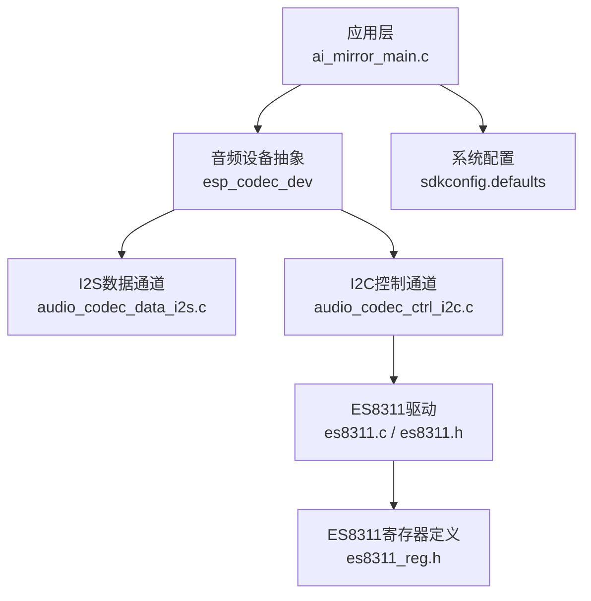
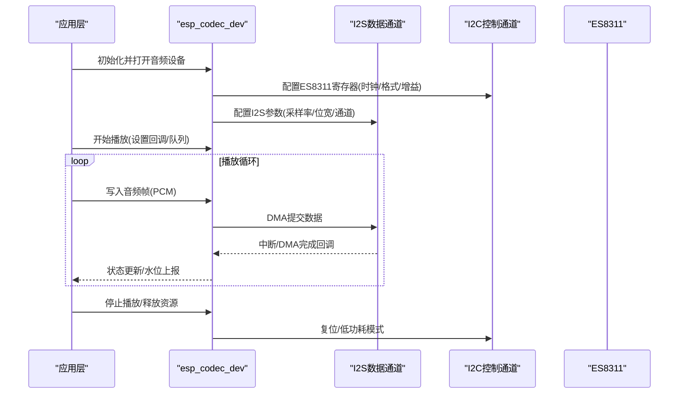
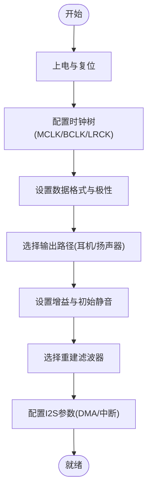
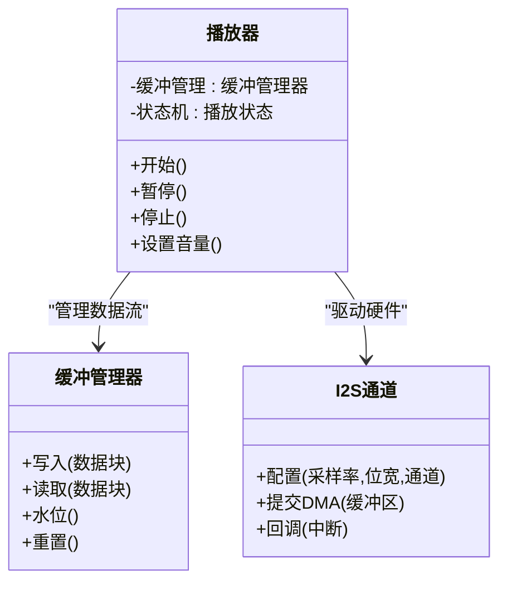
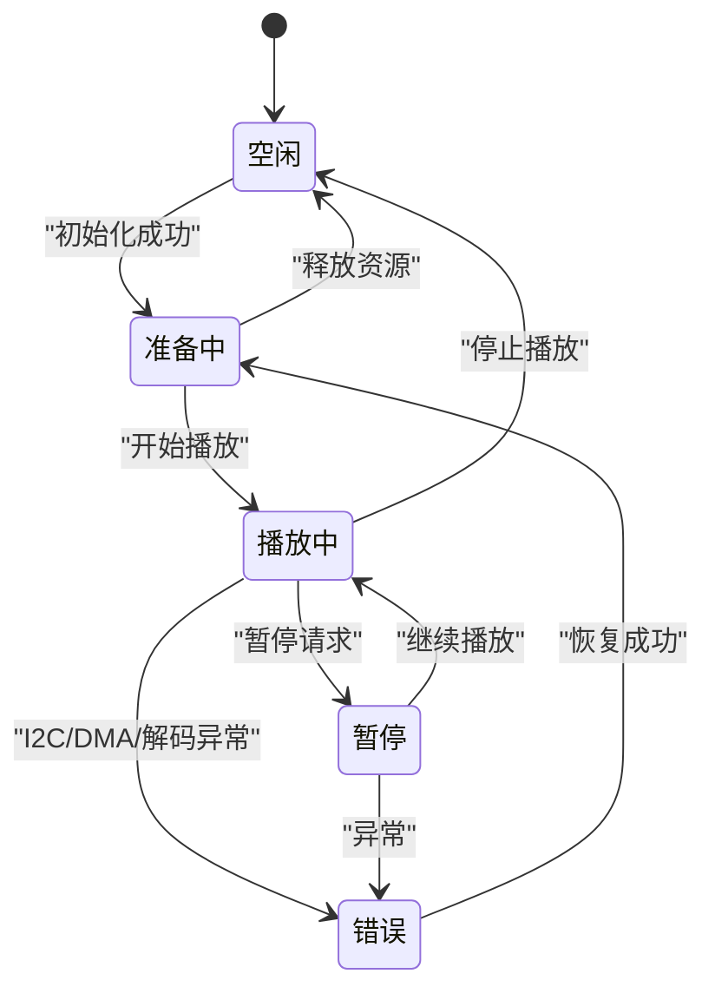
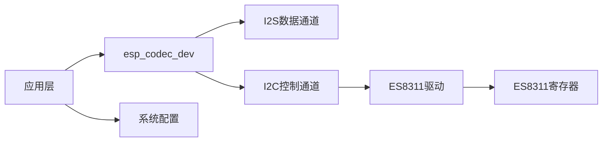

# 音频播放

<cite>
**本文引用的文件**   
- [ai_mirror_main.c](file://Firmware/esp32_ai_mirror/main/ai_mirror_main.c)
- [es8311.h](file://Firmware/esp32_ai_mirror/managed_components/espressif__es8311/include/es8311.h)
- [es8311.c](file://Firmware/esp32_ai_mirror/managed_components/espressif__es8311/es8311.c)
- [es8311_reg.h](file://Firmware/esp32_ai_mirror/managed_components/espressif__es8311/priv_include/es8311_reg.h)
- [esp_codec_dev.h](file://Firmware/esp32_ai_mirror/managed_components/espressif__esp_codec_dev/include/esp_codec_dev.h)
- [audio_codec_data_i2s.c](file://Firmware/esp32_ai_mirror/managed_components/espressif__esp_codec_dev/platform/audio_codec_data_i2s.c)
- [audio_codec_ctrl_i2c.c](file://Firmware/esp32_ai_mirror/managed_components/espressif__esp_codec_dev/platform/audio_codec_ctrl_i2c.c)
- [esp_codec_dev_defaults.h](file://Firmware/esp32_ai_mirror/managed_components/espressif__esp_codec_dev/include/esp_codec_dev_defaults.h)
- [esp_codec_dev_vol.h](file://Firmware/esp32_ai_mirror/managed_components/espressif__esp_codec_dev/include/esp_codec_dev_vol.h)
- [sdkconfig.defaults](file://Firmware/esp32_ai_mirror/sdkconfig.defaults)
</cite>

## 目录
1. [简介](#简介)
2. [项目结构](#项目结构)
3. [核心组件](#核心组件)
4. [架构总览](#架构总览)
5. [详细组件分析](#详细组件分析)
6. [依赖关系分析](#依赖关系分析)
7. [性能考量](#性能考量)
8. [故障排查指南](#故障排查指南)
9. [结论](#结论)
10. [附录](#附录)

## 简介
本文件面向ESP32平台的音频播放模块，聚焦于“解码—格式转换—I2S输出”的完整链路，重点说明ES8311 DAC配置、音频流缓冲管理、实时播放优化、同步与延迟控制、音质优化技术，以及状态管理、错误处理与异常恢复机制。同时给出性能监控、功耗优化与硬件兼容性处理的实现思路，帮助开发者在资源受限的嵌入式环境中获得稳定、低延迟、高保真的音频播放体验。

## 项目结构
本项目采用分层与组件化组织：
- 应用层：main入口负责系统初始化、任务调度与业务逻辑编排。
- 编解码与设备抽象层：esp_codec_dev提供统一的音频设备接口（I2S数据通道、I2C控制通道、音量控制等）。
- 具体DAC驱动：es8311组件封装寄存器操作与时序，向上暴露标准API。
- 平台适配：I2S数据路径与I2C控制路径由esp_codec_dev平台代码实现。
- 配置：sdkconfig.defaults集中管理编译期选项（如采样率、位宽、I2S引脚、I2C总线参数等）。

图表来源
- [ai_mirror_main.c](file://Firmware/esp32_ai_mirror/main/ai_mirror_main.c)
- [esp_codec_dev.h](file://Firmware/esp32_ai_mirror/managed_components/espressif__esp_codec_dev/include/esp_codec_dev.h)
- [audio_codec_data_i2s.c](file://Firmware/esp32_ai_mirror/managed_components/espressif__esp_codec_dev/platform/audio_codec_data_i2s.c)
- [audio_codec_ctrl_i2c.c](file://Firmware/esp32_ai_mirror/managed_components/espressif__esp_codec_dev/platform/audio_codec_ctrl_i2c.c)
- [es8311.c](file://Firmware/esp32_ai_mirror/managed_components/espressif__es8311/es8311.c)
- [es8311.h](file://Firmware/esp32_ai_mirror/managed_components/espressif__es8311/include/es8311.h)
- [es8311_reg.h](file://Firmware/esp32_ai_mirror/managed_components/espressif__es8311/priv_include/es8311_reg.h)
- [sdkconfig.defaults](file://Firmware/esp32_ai_mirror/sdkconfig.defaults)

章节来源
- [ai_mirror_main.c](file://Firmware/esp32_ai_mirror/main/ai_mirror_main.c)
- [sdkconfig.defaults](file://Firmware/esp32_ai_mirror/sdkconfig.defaults)

## 核心组件
- ES8311 DAC驱动：通过I2C写入寄存器，完成时钟、MCLK、BCLK、LRCK、数据格式、增益、静音、电源管理等配置。
- esp_codec_dev抽象层：统一音频设备生命周期（打开/关闭）、数据读写（I2S DMA）、音量控制、采样率/位宽协商。
- I2S数据通道：基于DMA的双缓冲或环形缓冲，保证CPU侧与硬件侧解耦，降低卡顿风险。
- I2C控制通道：用于ES8311寄存器访问，需确保总线稳定与重试策略。
- 配置项：采样率、位深、声道数、I2S引脚、I2C总线ID、缓冲区大小、是否启用硬件滤波等。

章节来源
- [es8311.h](file://Firmware/esp32_ai_mirror/managed_components/espressif__es8311/include/es8311.h)
- [es8311.c](file://Firmware/esp32_ai_mirror/managed_components/espressif__es8311/es8311.c)
- [es8311_reg.h](file://Firmware/esp32_ai_mirror/managed_components/espressif__es8311/priv_include/es8311_reg.h)
- [esp_codec_dev.h](file://Firmware/esp32_ai_mirror/managed_components/espressif__esp_codec_dev/include/esp_codec_dev.h)
- [audio_codec_data_i2s.c](file://Firmware/esp32_ai_mirror/managed_components/espressif__esp_codec_dev/platform/audio_codec_data_i2s.c)
- [audio_codec_ctrl_i2c.c](file://Firmware/esp32_ai_mirror/managed_components/espressif__esp_codec_dev/platform/audio_codec_ctrl_i2c.c)

## 架构总览
音频播放从上层到硬件的典型调用链如下：

图表来源
- [esp_codec_dev.h](file://Firmware/esp32_ai_mirror/managed_components/espressif__esp_codec_dev/include/esp_codec_dev.h)
- [audio_codec_data_i2s.c](file://Firmware/esp32_ai_mirror/managed_components/espressif__esp_codec_dev/platform/audio_codec_data_i2s.c)
- [audio_codec_ctrl_i2c.c](file://Firmware/esp32_ai_mirror/managed_components/espressif__esp_codec_dev/platform/audio_codec_ctrl_i2c.c)
- [es8311.c](file://Firmware/esp32_ai_mirror/managed_components/espressif__es8311/es8311.c)

## 详细组件分析

### ES8311 DAC配置与I2S输出流程
- 上电与复位：先使能电源域，再复位内部状态机，避免未知状态。
- 时钟树配置：设置MCLK/BCLK/LRCK分频，匹配目标采样率与位宽。
- 数据格式：选择I2S/TDM/左对齐等格式，确认相位与极性。
- 输出通道：启用右/左声道或立体声，配置HP/LSP/RSP输出路径。
- 增益与静音：设置数字/模拟增益，初始静音防止爆音。
- 滤波器与抗混叠：根据采样率选择合适的重建滤波器。
- I2S参数：位宽、通道数、DMA缓冲大小、中断阈值。

图表来源
- [es8311.c](file://Firmware/esp32_ai_mirror/managed_components/espressif__es8311/es8311.c)
- [es8311_reg.h](file://Firmware/esp32_ai_mirror/managed_components/espressif__es8311/priv_include/es8311_reg.h)
- [audio_codec_data_i2s.c](file://Firmware/esp32_ai_mirror/managed_components/espressif__esp_codec_dev/platform/audio_codec_data_i2s.c)

章节来源
- [es8311.c](file://Firmware/esp32_ai_mirror/managed_components/espressif__es8311/es8311.c)
- [es8311_reg.h](file://Firmware/esp32_ai_mirror/managed_components/espressif__es8311/priv_include/es8311_reg.h)
- [audio_codec_data_i2s.c](file://Firmware/esp32_ai_mirror/managed_components/espressif__esp_codec_dev/platform/audio_codec_data_i2s.c)

### 音频流缓冲管理与实时播放优化
- 双缓冲/环形缓冲：生产者（解码/网络）与消费者（I2S DMA）分离，减少抖动。
- 预填充策略：启动前填充至少N个周期数据，降低首包延迟。
- 动态水位控制：根据剩余缓冲量调整读取速率，避免欠载/溢出。
- 中断与回调：DMA半满/全满触发，及时补充数据。
- 内存分配：优先使用PSRAM或高速SRAM，避免频繁GC/碎片。

图表来源
- [esp_codec_dev.h](file://Firmware/esp32_ai_mirror/managed_components/espressif__esp_codec_dev/include/esp_codec_dev.h)
- [audio_codec_data_i2s.c](file://Firmware/esp32_ai_mirror/managed_components/espressif__esp_codec_dev/platform/audio_codec_data_i2s.c)

章节来源
- [esp_codec_dev.h](file://Firmware/esp32_ai_mirror/managed_components/espressif__esp_codec_dev/include/esp_codec_dev.h)
- [audio_codec_data_i2s.c](file://Firmware/esp32_ai_mirror/managed_components/espressif__esp_codec_dev/platform/audio_codec_data_i2s.c)

### 音频同步机制、延迟控制与音质优化
- 同步机制：以I2S硬件时钟为基准，解码器按固定时间片推送数据；必要时引入A/V同步或重采样对齐。
- 延迟控制：减小DMA缓冲、提高中断优先级、减少阻塞调用；测量端到端延迟并闭环调参。
- 音质优化：合理选择重建滤波器、限制最大增益、启用噪声门限、避免削波；对高频内容做适度平滑。
- 重采样：当源采样率与硬件不一致时，使用高质量插值算法，避免混叠。

章节来源
- [esp_codec_dev_defaults.h](file://Firmware/esp32_ai_mirror/managed_components/espressif__esp_codec_dev/include/esp_codec_dev_defaults.h)
- [audio_codec_data_i2s.c](file://Firmware/esp32_ai_mirror/managed_components/espressif__esp_codec_dev/platform/audio_codec_data_i2s.c)

### 音频播放状态管理、错误处理与异常恢复
- 状态机：空闲→准备中→播放中→暂停→停止→错误。
- 错误类型：I2C通信失败、DMA溢出/欠载、解码异常、资源不足。
- 恢复策略：自动重试、降级采样率/位宽、清空缓冲、重新初始化设备。
- 日志与指标：记录关键事件、水位、丢帧率、平均延迟。

章节来源
- [esp_codec_dev.h](file://Firmware/esp32_ai_mirror/managed_components/espressif__esp_codec_dev/include/esp_codec_dev.h)
- [audio_codec_ctrl_i2c.c](file://Firmware/esp32_ai_mirror/managed_components/espressif__esp_codec_dev/platform/audio_codec_ctrl_i2c.c)

### 音量控制与权限
- 软件音量：通过esp_codec_dev音量接口进行数字衰减，避免直接修改模拟增益造成失真。
- 硬件音量：ES8311支持数字/模拟两级音量，建议组合使用以获得最佳动态范围。
- 权限与安全：限制音量上限，防止损坏扬声器或伤害听力。

章节来源
- [esp_codec_dev_vol.h](file://Firmware/esp32_ai_mirror/managed_components/espressif__esp_codec_dev/include/esp_codec_dev_vol.h)
- [es8311.c](file://Firmware/esp32_ai_mirror/managed_components/espressif__es8311/es8311.c)

## 依赖关系分析
- 应用层依赖esp_codec_dev提供的统一接口，屏蔽底层I2S/I2C差异。
- esp_codec_dev依赖平台实现：I2S数据通道与I2C控制通道。
- ES8311驱动依赖寄存器定义与I2C总线稳定性。
- 配置项影响所有层级行为，需在编译期确定。

图表来源
- [esp_codec_dev.h](file://Firmware/esp32_ai_mirror/managed_components/espressif__esp_codec_dev/include/esp_codec_dev.h)
- [audio_codec_data_i2s.c](file://Firmware/esp32_ai_mirror/managed_components/espressif__esp_codec_dev/platform/audio_codec_data_i2s.c)
- [audio_codec_ctrl_i2c.c](file://Firmware/esp32_ai_mirror/managed_components/espressif__esp_codec_dev/platform/audio_codec_ctrl_i2c.c)
- [es8311.c](file://Firmware/esp32_ai_mirror/managed_components/espressif__es8311/es8311.c)
- [es8311_reg.h](file://Firmware/esp32_ai_mirror/managed_components/espressif__es8311/priv_include/es8311_reg.h)
- [sdkconfig.defaults](file://Firmware/esp32_ai_mirror/sdkconfig.defaults)

章节来源
- [esp_codec_dev.h](file://Firmware/esp32_ai_mirror/managed_components/espressif__esp_codec_dev/include/esp_codec_dev.h)
- [sdkconfig.defaults](file://Firmware/esp32_ai_mirror/sdkconfig.defaults)

## 性能考量
- 缓冲区大小：增大可降低卡顿概率但增加延迟；建议根据CPU负载与网络抖动动态调整。
- DMA与中断：合理设置半满/全满阈值，避免频繁中断导致CPU占用过高。
- 内存布局：将音频缓冲置于快速内存，减少拷贝与碎片。
- 解码效率：选择轻量解码器或预解码缓存，避免实时解码瓶颈。
- 功耗管理：空闲时进入低功耗模式，按需唤醒；降低不必要的I2C轮询。

[本节为通用指导，不直接分析具体文件]

## 故障排查指南
- I2C通信失败：检查总线连接、地址、上拉电阻、时钟频率；增加重试与超时。
- 无声音或杂音：确认输出路径、静音状态、增益设置、滤波器选择；验证I2S极性与时序。
- 卡顿与爆音：检查缓冲区水位、DMA提交频率、解码速度；适当增大缓冲或降低采样率。
- 重启或看门狗：定位阻塞调用与长耗时任务；拆分任务、添加看门狗喂狗。
- 日志与指标：采集水位、丢帧、延迟、错误码，辅助定位问题根因。

章节来源
- [audio_codec_ctrl_i2c.c](file://Firmware/esp32_ai_mirror/managed_components/espressif__esp_codec_dev/platform/audio_codec_ctrl_i2c.c)
- [audio_codec_data_i2s.c](file://Firmware/esp32_ai_mirror/managed_components/espressif__esp_codec_dev/platform/audio_codec_data_i2s.c)
- [es8311.c](file://Firmware/esp32_ai_mirror/managed_components/espressif__es8311/es8311.c)

## 结论
通过esp_codec_dev抽象层与ES8311驱动的协同，结合合理的I2S DMA缓冲、I2C控制时序与状态机管理，可在ESP32平台上实现稳定、低延迟、高保真的音频播放。建议在开发过程中持续监控水位与延迟，动态调优缓冲与采样参数，并在异常场景下提供自动恢复能力，以提升用户体验与系统鲁棒性。

[本节为总结，不直接分析具体文件]

## 附录
- 常用配置项参考：采样率、位宽、通道数、I2S引脚映射、I2C总线ID、缓冲区大小、滤波器类型。
- 调试工具：串口日志、示波器抓取I2S波形、逻辑分析仪监测I2C时序。
- 兼容性处理：不同板级引脚差异通过配置文件隔离；多DAC型号通过抽象层切换。

章节来源
- [sdkconfig.defaults](file://Firmware/esp32_ai_mirror/sdkconfig.defaults)