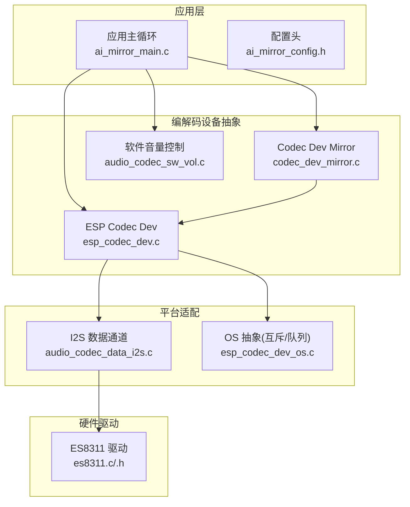
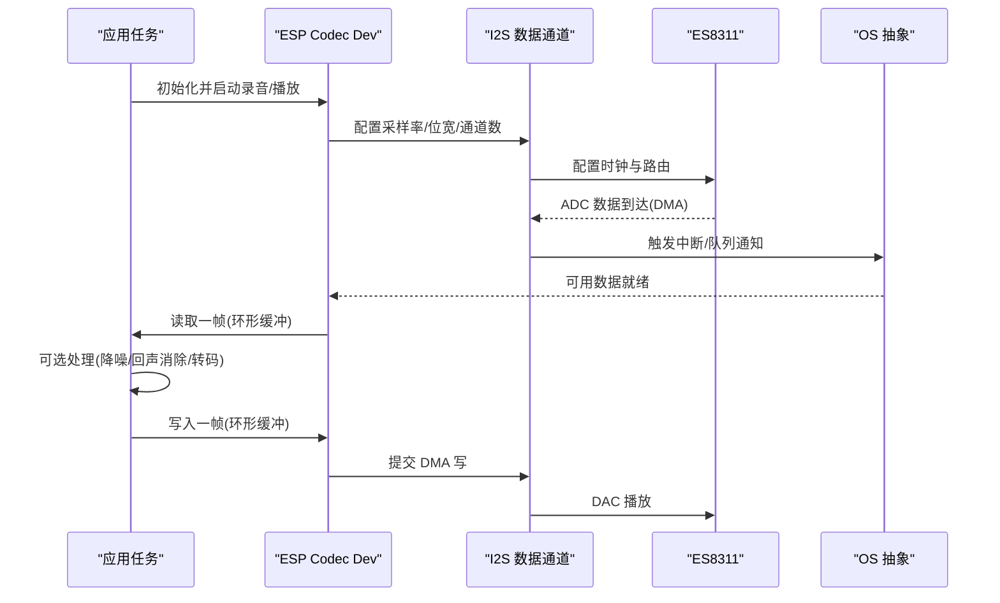
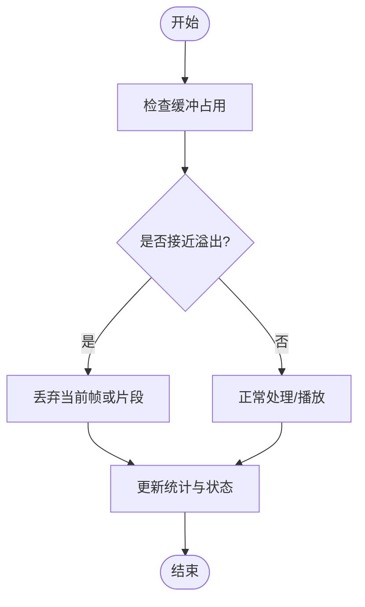
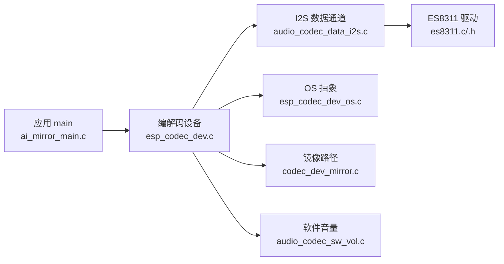

# 音频缓冲区管理

<cite>
**本文引用的文件**   
- [ai_mirror_main.c](file://Firmware/esp32_ai_mirror/main/ai_mirror_main.c)
- [ai_mirror_config.h](file://Firmware/esp32_ai_mirror/main/ai_mirror_config.h)
- [es8311.c](file://Firmware/esp32_ai_mirror/managed_components/espressif__es8311/es8311.c)
- [es8311.h](file://Firmware/esp32_ai_mirror/managed_components/espressif__es8311/include/es8311.h)
- [audio_codec_data_i2s.c](file://Firmware/esp32_ai_mirror/managed_components/espressif__esp_codec_dev/platform/audio_codec_data_i2s.c)
- [esp_codec_dev.c](file://Firmware/esp32_ai_mirror/managed_components/espressif__esp_codec_dev/esp_codec_dev.c)
- [codec_dev_mirror.c](file://Firmware/esp32_ai_mirror/managed_components/espressif__esp_codec_dev/codec_dev_mirror.c)
- [audio_codec_sw_vol.c](file://Firmware/esp32_ai_mirror/managed_components/espressif__esp_codec_dev/audio_codec_sw_vol.c)
- [esp_codec_dev_os.c](file://Firmware/esp32_ai_mirror/managed_components/espressif__esp_codec_dev/platform/esp_codec_dev_os.c)
- [README.md](file://Firmware/esp32_ai_mirror/README.md)
</cite>

## 目录
1. [简介](#简介)
2. [项目结构](#项目结构)
3. [核心组件](#核心组件)
4. [架构总览](#架构总览)
5. [详细组件分析](#详细组件分析)
6. [依赖关系分析](#依赖关系分析)
7. [性能考虑](#性能考虑)
8. [故障排查指南](#故障排查指南)
9. [结论](#结论)
10. [附录](#附录)

## 简介
本文件面向“音频缓冲区管理系统”的设计与实现，聚焦环形缓冲区、内存分配策略、数据同步机制、读写流程、溢出处理、内存泄漏防护、多任务共享与锁机制、优先级管理、缓冲区大小优化、延迟控制、内存使用监控、流连续性保证、丢帧处理与恢复策略。文档基于仓库中的 ESP32 AI 镜像工程及其 esp_codec_dev、es8311、I2S 平台适配等组件进行梳理，帮助读者在嵌入式环境下构建稳定低延迟的音频链路。

## 项目结构
本项目采用分层组织：应用层（main）、编解码设备抽象（esp_codec_dev）、硬件驱动（es8311）以及 I2S 数据通路（platform）。音频数据从 ADC/I2S 进入，经缓冲与处理，最终由 DAC 输出；同时存在回环/镜像路径用于调试或特殊用途。

图表来源
- [ai_mirror_main.c](file://Firmware/esp32_ai_mirror/main/ai_mirror_main.c)
- [ai_mirror_config.h](file://Firmware/esp32_ai_mirror/main/ai_mirror_config.h)
- [esp_codec_dev.c](file://Firmware/esp32_ai_mirror/managed_components/espressif__esp_codec_dev/esp_codec_dev.c)
- [codec_dev_mirror.c](file://Firmware/esp32_ai_mirror/managed_components/espressif__esp_codec_dev/codec_dev_mirror.c)
- [audio_codec_data_i2s.c](file://Firmware/esp32_ai_mirror/managed_components/espressif__esp_codec_dev/platform/audio_codec_data_i2s.c)
- [esp_codec_dev_os.c](file://Firmware/esp32_ai_mirror/managed_components/espressif__esp_codec_dev/platform/esp_codec_dev_os.c)
- [es8311.c](file://Firmware/esp32_ai_mirror/managed_components/espressif__es8311/es8311.c)
- [es8311.h](file://Firmware/esp32_ai_mirror/managed_components/espressif__es8311/include/es8311.h)

章节来源
- [README.md](file://Firmware/esp32_ai_mirror/README.md)

## 核心组件
- 应用入口与任务调度：负责初始化音频链路、创建任务/中断、启动播放/录制、协调 UI 与网络。
- 编解码设备抽象（esp_codec_dev）：统一 ADC/DAC 接口，封装 I2S 传输、DMA 缓冲、采样率/位深配置、音量控制、静音/唤醒。
- I2S 数据通道：底层 DMA 环形缓冲、中断回调、数据搬运至/自用户缓冲。
- OS 抽象：提供互斥量、信号量、队列等同步原语，确保多任务安全访问共享缓冲。
- 硬件驱动（es8311）：I2C 寄存器配置、MCLK/BCLK/LRCK 时钟、增益/滤波参数。
- 镜像/回环路径：将输入直接转发到输出，便于端到端时延测量与链路验证。

章节来源
- [ai_mirror_main.c](file://Firmware/esp32_ai_mirror/main/ai_mirror_main.c)
- [esp_codec_dev.c](file://Firmware/esp32_ai_mirror/managed_components/espressif__esp_codec_dev/esp_codec_dev.c)
- [audio_codec_data_i2s.c](file://Firmware/esp32_ai_mirror/managed_components/espressif__esp_codec_dev/platform/audio_codec_data_i2s.c)
- [esp_codec_dev_os.c](file://Firmware/esp32_ai_mirror/managed_components/espressif__esp_codec_dev/platform/esp_codec_dev_os.c)
- [es8311.c](file://Firmware/esp32_ai_mirror/managed_components/espressif__es8311/es8311.c)
- [es8311.h](file://Firmware/esp32_ai_mirror/managed_components/espressif__es8311/include/es8311.h)

## 架构总览
下图展示一次典型“录制→处理→播放”的数据流，强调环形缓冲、DMA 与任务间同步。

图表来源
- [esp_codec_dev.c](file://Firmware/esp32_ai_mirror/managed_components/espressif__esp_codec_dev/esp_codec_dev.c)
- [audio_codec_data_i2s.c](file://Firmware/esp32_ai_mirror/managed_components/espressif__esp_codec_dev/platform/audio_codec_data_i2s.c)
- [es8311.c](file://Firmware/esp32_ai_mirror/managed_components/espressif__es8311/es8311.c)
- [esp_codec_dev_os.c](file://Firmware/esp32_ai_mirror/managed_components/espressif__esp_codec_dev/platform/esp_codec_dev_os.c)

## 详细组件分析

### 环形缓冲区设计与实现
- 设计要点
  - 双缓冲或多缓冲：至少“生产者-消费者”各一个缓冲，避免频繁拷贝。
  - 索引与长度：使用无符号整型计数，配合模运算实现首尾相接。
  - 对齐与缓存：按 CPU 缓存行对齐，减少伪共享；必要时对 DMA 缓冲启用缓存一致性操作。
  - 幂等性：读/写指针更新需原子或受保护，防止竞争条件。
- 复杂度
  - 时间：O(1) 入队/出队（固定块大小），批量传输 O(N)。
  - 空间：N×块大小 + 元数据开销。
- 关键实现位置参考
  - 环形缓冲与 DMA 交互：[audio_codec_data_i2s.c](file://Firmware/esp32_ai_mirror/managed_components/espressif__esp_codec_dev/platform/audio_codec_data_i2s.c)
  - 编解码设备缓冲管理：[esp_codec_dev.c](file://Firmware/esp32_ai_mirror/managed_components/espressif__esp_codec_dev/esp_codec_dev.c)

章节来源
- [audio_codec_data_i2s.c](file://Firmware/esp32_ai_mirror/managed_components/espressif__esp_codec_dev/platform/audio_codec_data_i2s.c)
- [esp_codec_dev.c](file://Firmware/esp32_ai_mirror/managed_components/espressif__esp_codec_dev/esp_codec_dev.c)

### 内存分配策略
- 静态优先：音频路径尽量使用静态分配，避免运行时碎片化与抖动。
- 池化分配：为小块音频帧/描述符建立对象池，降低 malloc/free 频率。
- DMA 友好：缓冲地址对齐、连续物理内存（必要时映射）、避免跨页边界。
- 失败回退：分配失败时降级（减小帧长、丢弃非关键处理）并上报告警。
- 关键实现位置参考
  - 平台/设备初始化与资源申请：[esp_codec_dev.c](file://Firmware/esp32_ai_mirror/managed_components/espressif__esp_codec_dev/esp_codec_dev.c)
  - I2S 数据通道缓冲：[audio_codec_data_i2s.c](file://Firmware/esp32_ai_mirror/managed_components/espressif__esp_codec_dev/platform/audio_codec_data_i2s.c)

章节来源
- [esp_codec_dev.c](file://Firmware/esp32_ai_mirror/managed_components/espressif__esp_codec_dev/esp_codec_dev.c)
- [audio_codec_data_i2s.c](file://Firmware/esp32_ai_mirror/managed_components/espressif__esp_codec_dev/platform/audio_codec_data_i2s.c)

### 数据同步机制与多任务共享
- 同步原语
  - 互斥量：保护临界区（如缓冲元数据更新）。
  - 信号量：生产者-消费者计数，避免忙等。
  - 队列：传递帧指针/描述符，解耦生产与消费速率。
- 优先级
  - 音频 I/O 任务高优先级，处理任务中优先级，UI/网络低优先级。
  - 中断服务程序仅做最小工作（置标志/投递队列），避免阻塞。
- 关键实现位置参考
  - OS 抽象接口：[esp_codec_dev_os.c](file://Firmware/esp32_ai_mirror/managed_components/espressif__esp_codec_dev/platform/esp_codec_dev_os.c)
  - 编解码设备任务编排：[esp_codec_dev.c](file://Firmware/esp32_ai_mirror/managed_components/espressif__esp_codec_dev/esp_codec_dev.c)

章节来源
- [esp_codec_dev_os.c](file://Firmware/esp32_ai_mirror/managed_components/espressif__esp_codec_dev/platform/esp_codec_dev_os.c)
- [esp_codec_dev.c](file://Firmware/esp32_ai_mirror/managed_components/espressif__esp_codec_dev/esp_codec_dev.c)

### 音频数据的读写操作
- 读路径（ADC→环形缓冲→应用）
  - I2S DMA 填充缓冲 → 中断/回调 → 标记可用 → 应用取走固定帧。
- 写路径（应用→环形缓冲→DAC）
  - 应用填充帧 → 提交到 I2S DMA → 硬件播放。
- 关键实现位置参考
  - I2S 数据通道：[audio_codec_data_i2s.c](file://Firmware/esp32_ai_mirror/managed_components/espressif__esp_codec_dev/platform/audio_codec_data_i2s.c)
  - 编解码设备 API：[esp_codec_dev.c](file://Firmware/esp32_ai_mirror/managed_components/espressif__esp_codec_dev/esp_codec_dev.c)

章节来源
- [audio_codec_data_i2s.c](file://Firmware/esp32_ai_mirror/managed_components/espressif__esp_codec_dev/platform/audio_codec_data_i2s.c)
- [esp_codec_dev.c](file://Firmware/esp32_ai_mirror/managed_components/espressif__esp_codec_dev/esp_codec_dev.c)

### 缓冲区溢出处理与丢帧策略
- 检测
  - 记录“已用/空闲”计数，超过阈值判定近溢出；统计丢帧次数。
- 处理
  - 自适应丢弃：优先丢弃非关键帧（如静音段），或缩短处理链。
  - 动态调整：临时提高采样率或增大缓冲以吸收峰值。
  - 告警与恢复：上报事件，自动回退到更稳健模式。
- 流程图

章节来源
- [audio_codec_data_i2s.c](file://Firmware/esp32_ai_mirror/managed_components/espressif__esp_codec_dev/platform/audio_codec_data_i2s.c)
- [esp_codec_dev.c](file://Firmware/esp32_ai_mirror/managed_components/espressif__esp_codec_dev/esp_codec_dev.c)

### 内存泄漏防护
- 原则
  - 成对释放：所有分配必须有对应释放路径，异常分支也要释放。
  - 生命周期：明确对象创建/销毁点，集中管理。
  - 工具辅助：开启内存检测、堆栈快照、定期巡检。
- 关键点
  - 中断上下文不分配内存。
  - 错误路径统一 goto/cleanup 标签。
- 参考位置
  - 设备初始化/反初始化：[esp_codec_dev.c](file://Firmware/esp32_ai_mirror/managed_components/espressif__esp_codec_dev/esp_codec_dev.c)
  - I2S 数据通道资源管理：[audio_codec_data_i2s.c](file://Firmware/esp32_ai_mirror/managed_components/espressif__esp_codec_dev/platform/audio_codec_data_i2s.c)

章节来源
- [esp_codec_dev.c](file://Firmware/esp32_ai_mirror/managed_components/espressif__esp_codec_dev/esp_codec_dev.c)
- [audio_codec_data_i2s.c](file://Firmware/esp32_ai_mirror/managed_components/espressif__esp_codec_dev/platform/audio_codec_data_i2s.c)

### 多任务环境下的锁机制与优先级管理
- 锁粒度
  - 细粒度：仅保护缓冲元数据，数据体通过指针传递。
  - 粗粒度：简化实现但可能影响吞吐。
- 优先级
  - 音频 I/O > 实时处理 > 通用任务 > UI/网络。
  - 避免优先级反转：使用优先级继承或消息队列。
- 参考位置
  - OS 抽象：[esp_codec_dev_os.c](file://Firmware/esp32_ai_mirror/managed_components/espressif__esp_codec_dev/platform/esp_codec_dev_os.c)
  - 编解码设备任务编排：[esp_codec_dev.c](file://Firmware/esp32_ai_mirror/managed_components/espressif__esp_codec_dev/esp_codec_dev.c)

章节来源
- [esp_codec_dev_os.c](file://Firmware/esp32_ai_mirror/managed_components/espressif__esp_codec_dev/platform/esp_codec_dev_os.c)
- [esp_codec_dev.c](file://Firmware/esp32_ai_mirror/managed_components/espressif__esp_codec_dev/esp_codec_dev.c)

### 缓冲区大小优化与延迟控制
- 目标
  - 端到端延迟 = I2S 帧周期 + 缓冲延迟 + 处理耗时。
  - 缓冲大小应覆盖最大抖动与处理峰值。
- 方法
  - 根据采样率/位宽/通道计算帧大小，选择 2~4 倍帧周期的缓冲。
  - 动态调参：监测丢帧/欠载，自动微调缓冲大小。
- 参考位置
  - I2S 数据通道与帧配置：[audio_codec_data_i2s.c](file://Firmware/esp32_ai_mirror/managed_components/espressif__esp_codec_dev/platform/audio_codec_data_i2s.c)
  - 编解码设备参数设置：[esp_codec_dev.c](file://Firmware/esp32_ai_mirror/managed_components/espressif__esp_codec_dev/esp_codec_dev.c)

章节来源
- [audio_codec_data_i2s.c](file://Firmware/esp32_ai_mirror/managed_components/espressif__esp_codec_dev/platform/audio_codec_data_i2s.c)
- [esp_codec_dev.c](file://Firmware/esp32_ai_mirror/managed_components/espressif__esp_codec_dev/esp_codec_dev.c)

### 内存使用监控
- 指标
  - 剩余堆、最大单次分配、分配失败次数、缓冲占用率。
- 手段
  - 周期性采集并上报；超限告警；自动降级。
- 参考位置
  - 设备与平台初始化处可接入监控钩子：[esp_codec_dev.c](file://Firmware/esp32_ai_mirror/managed_components/espressif__esp_codec_dev/esp_codec_dev.c), [audio_codec_data_i2s.c](file://Firmware/esp32_ai_mirror/managed_components/espressif__esp_codec_dev/platform/audio_codec_data_i2s.c)

章节来源
- [esp_codec_dev.c](file://Firmware/esp32_ai_mirror/managed_components/espressif__esp_codec_dev/esp_codec_dev.c)
- [audio_codec_data_i2s.c](file://Firmware/esp32_ai_mirror/managed_components/espressif__esp_codec_dev/platform/audio_codec_data_i2s.c)

### 音频流连续性保证、丢帧处理与恢复策略
- 连续性
  - 预取与回填：保持缓冲水位线，避免空转。
  - 无缝切换：淡入淡出、零交叉拼接。
- 丢帧
  - 短时丢帧：插值/重复帧维持听感。
  - 长时丢帧：提示重连/重试。
- 恢复
  - 自动重建：重新握手、重置 I2S/DMA、清空缓冲。
- 参考位置
  - 编解码设备控制流：[esp_codec_dev.c](file://Firmware/esp32_ai_mirror/managed_components/espressif__esp_codec_dev/esp_codec_dev.c)
  - I2S 数据通道：[audio_codec_data_i2s.c](file://Firmware/esp32_ai_mirror/managed_components/espressif__esp_codec_dev/platform/audio_codec_data_i2s.c)

章节来源
- [esp_codec_dev.c](file://Firmware/esp32_ai_mirror/managed_components/espressif__esp_codec_dev/esp_codec_dev.c)
- [audio_codec_data_i2s.c](file://Firmware/esp32_ai_mirror/managed_components/espressif__esp_codec_dev/platform/audio_codec_data_i2s.c)

### 镜像/回环路径（调试与测距）
- 作用
  - 将输入直通输出，便于端到端时延测量、链路质量评估。
- 实现
  - 在编解码设备层插入镜像路径，绕过复杂处理链。
- 参考位置
  - 镜像模块：[codec_dev_mirror.c](file://Firmware/esp32_ai_mirror/managed_components/espressif__esp_codec_dev/codec_dev_mirror.c)

章节来源
- [codec_dev_mirror.c](file://Firmware/esp32_ai_mirror/managed_components/espressif__esp_codec_dev/codec_dev_mirror.c)

### 软件音量控制
- 功能
  - 数字域缩放，避免模拟增益带来的噪声放大。
- 实现
  - 在数据通路中插入缩放模块，支持动态调节。
- 参考位置
  - 软件音量：[audio_codec_sw_vol.c](file://Firmware/esp32_ai_mirror/managed_components/espressif__esp_codec_dev/audio_codec_sw_vol.c)

章节来源
- [audio_codec_sw_vol.c](file://Firmware/esp32_ai_mirror/managed_components/espressif__esp_codec_dev/audio_codec_sw_vol.c)

## 依赖关系分析

图表来源
- [ai_mirror_main.c](file://Firmware/esp32_ai_mirror/main/ai_mirror_main.c)
- [esp_codec_dev.c](file://Firmware/esp32_ai_mirror/managed_components/espressif__esp_codec_dev/esp_codec_dev.c)
- [audio_codec_data_i2s.c](file://Firmware/esp32_ai_mirror/managed_components/espressif__esp_codec_dev/platform/audio_codec_data_i2s.c)
- [esp_codec_dev_os.c](file://Firmware/esp32_ai_mirror/managed_components/espressif__esp_codec_dev/platform/esp_codec_dev_os.c)
- [es8311.c](file://Firmware/esp32_ai_mirror/managed_components/espressif__es8311/es8311.c)
- [es8311.h](file://Firmware/esp32_ai_mirror/managed_components/espressif__es8311/include/es8311.h)
- [codec_dev_mirror.c](file://Firmware/esp32_ai_mirror/managed_components/espressif__esp_codec_dev/codec_dev_mirror.c)
- [audio_codec_sw_vol.c](file://Firmware/esp32_ai_mirror/managed_components/espressif__esp_codec_dev/audio_codec_sw_vol.c)

章节来源
- [ai_mirror_main.c](file://Firmware/esp32_ai_mirror/main/ai_mirror_main.c)
- [esp_codec_dev.c](file://Firmware/esp32_ai_mirror/managed_components/espressif__esp_codec_dev/esp_codec_dev.c)
- [audio_codec_data_i2s.c](file://Firmware/esp32_ai_mirror/managed_components/espressif__esp_codec_dev/platform/audio_codec_data_i2s.c)
- [esp_codec_dev_os.c](file://Firmware/esp32_ai_mirror/managed_components/espressif__esp_codec_dev/platform/esp_codec_dev_os.c)
- [es8311.c](file://Firmware/esp32_ai_mirror/managed_components/espressif__es8311/es8311.c)
- [es8311.h](file://Firmware/esp32_ai_mirror/managed_components/espressif__es8311/include/es8311.h)
- [codec_dev_mirror.c](file://Firmware/esp32_ai_mirror/managed_components/espressif__esp_codec_dev/codec_dev_mirror.c)
- [audio_codec_sw_vol.c](file://Firmware/esp32_ai_mirror/managed_components/espressif__esp_codec_dev/audio_codec_sw_vol.c)

## 性能考虑
- 降低拷贝：使用零拷贝/指针传递，批量 DMA 传输。
- 中断最小化：中断只做必要登记，数据处理放入任务。
- 缓存一致性：对 DMA 缓冲执行必要的 Cache In/Out 操作。
- 线程亲和：音频任务绑定到高性能核，避免被抢占。
- 功耗与热：合理关闭未用外设，动态降频策略。

## 故障排查指南
- 常见问题
  - 爆音/卡顿：缓冲不足、CPU 过载、DMA 配置错误。
  - 无声：时钟未配置、路由错误、音量归零。
  - 内存泄漏：未释放、异常分支遗漏。
- 定位步骤
  - 启用镜像路径验证链路连通性。
  - 采集缓冲水位、丢帧计数、分配失败次数。
  - 逐步禁用处理链，隔离问题模块。
- 参考位置
  - 设备与平台初始化/错误处理：[esp_codec_dev.c](file://Firmware/esp32_ai_mirror/managed_components/espressif__esp_codec_dev/esp_codec_dev.c), [audio_codec_data_i2s.c](file://Firmware/esp32_ai_mirror/managed_components/espressif__esp_codec_dev/platform/audio_codec_data_i2s.c)
  - 镜像路径：[codec_dev_mirror.c](file://Firmware/esp32_ai_mirror/managed_components/espressif__esp_codec_dev/codec_dev_mirror.c)

章节来源
- [esp_codec_dev.c](file://Firmware/esp32_ai_mirror/managed_components/espressif__esp_codec_dev/esp_codec_dev.c)
- [audio_codec_data_i2s.c](file://Firmware/esp32_ai_mirror/managed_components/espressif__esp_codec_dev/platform/audio_codec_data_i2s.c)
- [codec_dev_mirror.c](file://Firmware/esp32_ai_mirror/managed_components/espressif__esp_codec_dev/codec_dev_mirror.c)

## 结论
本方案围绕环形缓冲、DMA 与 OS 同步原语，构建了低延迟、高可靠的音频数据通路。通过合理的内存分配、严格的同步与优先级管理、完善的溢出与恢复策略，可在资源受限的嵌入式平台上实现稳定的音频流。建议结合镜像路径与监控指标持续优化缓冲大小与处理链，以获得最佳时延与音质平衡。

## 附录
- 术语
  - 环形缓冲：首尾相连的固定大小数组，适合生产者-消费者模型。
  - DMA：直接内存访问，减轻 CPU 负担。
  - 端到端延迟：从采集到播放的总时延。
- 相关配置
  - 采样率/位宽/通道数：需在 I2S 与编解码设备中保持一致。
  - 缓冲大小：依据帧周期与处理峰值设定。
- 参考位置
  - 应用配置头：[ai_mirror_config.h](file://Firmware/esp32_ai_mirror/main/ai_mirror_config.h)
  - 硬件驱动接口：[es8311.h](file://Firmware/esp32_ai_mirror/managed_components/espressif__es8311/include/es8311.h)