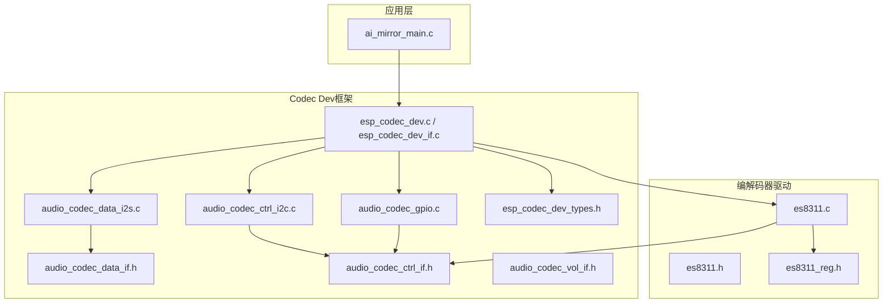
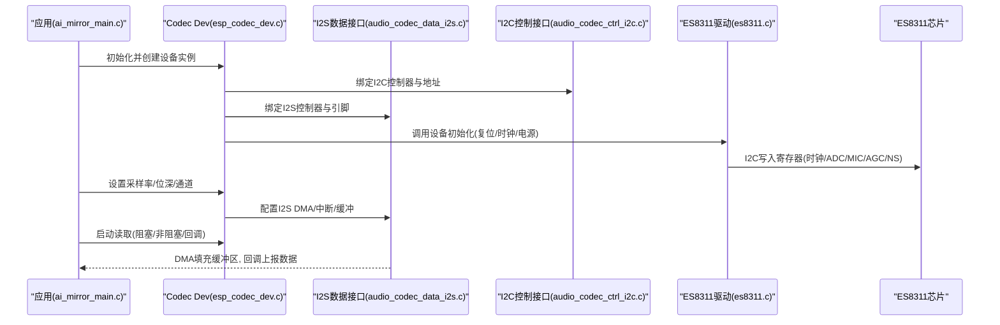
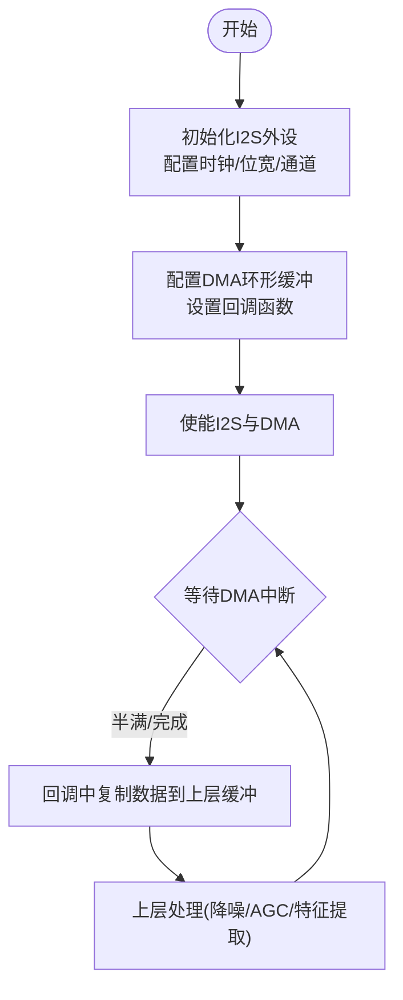
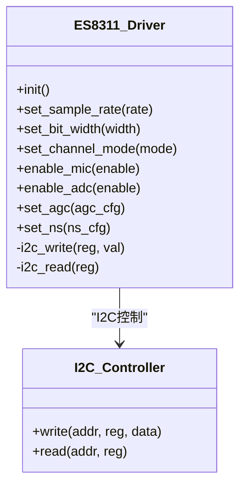
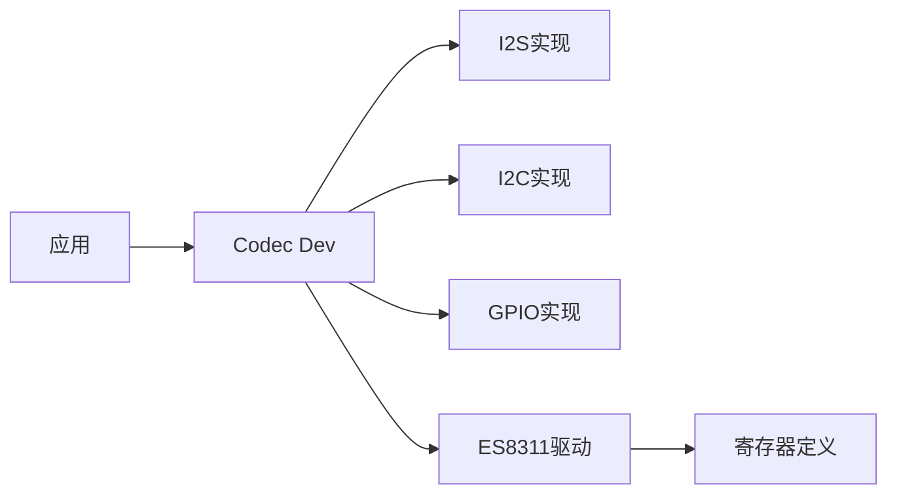

# 音频采集

<cite>
**本文引用的文件**   
- [es8311.c](file://managed_components/espressif__es8311/es8311.c)
- [es8311.h](file://managed_components/espressif__es8311/include/es8311.h)
- [es8311_reg.h](file://managed_components/espressif__es8311/priv_include/es8311_reg.h)
- [audio_codec_data_i2s.c](file://managed_components/espressif__esp_codec_dev/platform/audio_codec_data_i2s.c)
- [audio_codec_ctrl_i2c.c](file://managed_components/espressif__esp_codec_dev/platform/audio_codec_ctrl_i2c.c)
- [audio_codec_gpio.c](file://managed_components/espressif__esp_codec_dev/platform/audio_codec_gpio.c)
- [esp_codec_dev.c](file://managed_components/espressif__esp_codec_dev/esp_codec_dev.c)
- [esp_codec_dev_if.c](file://managed_components/espressif__esp_codec_dev/esp_codec_dev_if.c)
- [esp_codec_dev_types.h](file://managed_components/espressif__esp_codec_dev/include/esp_codec_dev_types.h)
- [audio_codec_data_if.h](file://managed_components/espressif__esp_codec_dev/interface/audio_codec_data_if.h)
- [audio_codec_ctrl_if.h](file://managed_components/espressif__esp_codec_dev/interface/audio_codec_ctrl_if.h)
- [audio_codec_vol_if.h](file://managed_components/espressif__esp_codec_dev/interface/audio_codec_vol_if.h)
- [ai_mirror_main.c](file://Firmware/esp32_ai_mirror/main/ai_mirror_main.c)
- [ai_mirror_config.h](file://Firmware/esp32_ai_mirror/main/ai_mirror_config.h)
</cite>

## 目录
1. [简介](#简介)
2. [项目结构](#项目结构)
3. [核心组件](#核心组件)
4. [架构总览](#架构总览)
5. [详细组件分析](#详细组件分析)
6. [依赖关系分析](#依赖关系分析)
7. [性能与功耗优化](#性能与功耗优化)
8. [故障排查指南](#故障排查指南)
9. [结论](#结论)
10. [附录：关键配置项速查](#附录关键配置项速查)

## 简介
本文件面向ESP32 AI镜像项目的音频采集模块，聚焦I2S接口配置、ES8311编解码器驱动实现与麦克风数据采集流程。文档覆盖采样率设置、位深度配置、通道选择、缓冲区管理、DMA传输机制与实时数据流处理；并给出音频质量优化（噪声抑制、自动增益控制）、性能调优与功耗控制的实践建议。内容基于仓库中的ES8311驱动与ESP Codec Dev框架源码进行梳理与总结，便于开发者快速定位与扩展。

## 项目结构
本项目在“managed_components”中集成了ES8311编解码器驱动与ESP Codec Dev框架，应用层位于“main”。音频采集相关的关键路径如下：
- ES8311驱动：提供寄存器访问、I2C控制、时钟与GPIO配置、ADC/MIC通路初始化等能力
- ESP Codec Dev平台层：抽象I2S数据通道、I2C控制通道、GPIO与音量控制接口，封装设备生命周期与参数设置
- 应用入口：初始化音频子系统、启动采集任务或回调

图表来源 
- [esp_codec_dev.c](file://managed_components/espressif__esp_codec_dev/esp_codec_dev.c)
- [esp_codec_dev_if.c](file://managed_components/espressif__esp_codec_dev/esp_codec_dev_if.c)
- [audio_codec_data_i2s.c](file://managed_components/espressif__esp_codec_dev/platform/audio_codec_data_i2s.c)
- [audio_codec_ctrl_i2c.c](file://managed_components/espressif__esp_codec_dev/platform/audio_codec_ctrl_i2c.c)
- [audio_codec_gpio.c](file://managed_components/espressif__esp_codec_dev/platform/audio_codec_gpio.c)
- [es8311.c](file://managed_components/espressif__es8311/es8311.c)
- [es8311.h](file://managed_components/espressif__es8311/include/es8311.h)
- [es8311_reg.h](file://managed_components/espressif__es8311/priv_include/es8311_reg.h)

章节来源
- [ai_mirror_main.c](file://Firmware/esp32_ai_mirror/main/ai_mirror_main.c)
- [ai_mirror_config.h](file://Firmware/esp32_ai_mirror/main/ai_mirror_config.h)

## 核心组件
- ES8311驱动：通过I2C对寄存器进行读写，完成MCLK/BCLK/LRCK时钟、MIC输入、ADC通道、AGC/NS等功能的配置
- ESP Codec Dev平台：统一I2S数据接口、I2C控制接口、GPIO控制接口，屏蔽底层差异，向上暴露设备打开/关闭、参数设置、读/写数据等API
- 应用集成：在应用初始化阶段创建并配置Codec Dev实例，绑定I2S/I2C/GPIO实现，启动采集任务或回调

章节来源
- [es8311.c](file://managed_components/espressif__es8311/es8311.c)
- [es8311.h](file://managed_components/espressif__es8311/include/es8311.h)
- [es8311_reg.h](file://managed_components/espressif__es8311/priv_include/es8311_reg.h)
- [esp_codec_dev.c](file://managed_components/espressif__esp_codec_dev/esp_codec_dev.c)
- [esp_codec_dev_if.c](file://managed_components/espressif__esp_codec_dev/esp_codec_dev_if.c)
- [audio_codec_data_i2s.c](file://managed_components/espressif__esp_codec_dev/platform/audio_codec_data_i2s.c)
- [audio_codec_ctrl_i2c.c](file://managed_components/espressif__esp_codec_dev/platform/audio_codec_ctrl_i2c.c)
- [audio_codec_gpio.c](file://managed_components/espressif__esp_codec_dev/platform/audio_codec_gpio.c)

## 架构总览
下图展示从应用到硬件的完整调用链：应用通过Codec Dev API配置并启动采集，平台层将I2S数据流与I2C控制流分别路由至对应实现，最终由ES8311驱动完成寄存器配置与MIC/ADC通路启用。

图表来源 
- [esp_codec_dev.c](file://managed_components/espressif__esp_codec_dev/esp_codec_dev.c)
- [audio_codec_data_i2s.c](file://managed_components/espressif__esp_codec_dev/platform/audio_codec_data_i2s.c)
- [audio_codec_ctrl_i2c.c](file://managed_components/espressif__esp_codec_dev/platform/audio_codec_ctrl_i2c.c)
- [es8311.c](file://managed_components/espressif__es8311/es8311.c)

## 详细组件分析

### I2S接口与DMA数据流
- 数据接口抽象：通过audio_codec_data_if.h定义统一的读/写接口，esp_codec_dev使用这些接口与具体I2S实现解耦
- I2S实现：audio_codec_data_i2s.c负责I2S外设初始化、DMA环形缓冲、中断回调与数据搬运，保证低延迟稳定采集
- 典型流程：
  - 配置I2S时钟（MCLK/BCLK/LRCK）与数据格式（位宽、对齐方式）
  - 分配DMA描述符与双缓冲/多缓冲，降低CPU占用
  - 在中断回调中将数据拷贝至用户队列或触发事件

章节来源
- [audio_codec_data_if.h](file://managed_components/espressif__esp_codec_dev/interface/audio_codec_data_if.h)
- [audio_codec_data_i2s.c](file://managed_components/espressif__esp_codec_dev/platform/audio_codec_data_i2s.c)

### ES8311编解码器驱动
- 控制接口：通过audio_codec_ctrl_if.h抽象I2C/SPI控制，es8311.c实现I2C寄存器读写与时序控制
- 初始化流程：
  - 复位与电源管理
  - 配置MCLK/BCLK/LRCK频率与分频
  - 启用MIC前置放大器、ADC通道、数字滤波器
  - 可选开启AGC、噪声抑制（NS）与回声消除（AEC）相关寄存器
- 关键寄存器：es8311_reg.h定义了各类功能寄存器映射，es8311.c根据配置表写入

图表来源 
- [es8311.c](file://managed_components/espressif__es8311/es8311.c)
- [es8311.h](file://managed_components/espressif__es8311/include/es8311.h)
- [es8311_reg.h](file://managed_components/espressif__es8311/priv_include/es8311_reg.h)
- [audio_codec_ctrl_if.h](file://managed_components/espressif__esp_codec_dev/interface/audio_codec_ctrl_if.h)

章节来源
- [es8311.c](file://managed_components/espressif__es8311/es8311.c)
- [es8311.h](file://managed_components/espressif__es8311/include/es8311.h)
- [es8311_reg.h](file://managed_components/espressif__es8311/priv_include/es8311_reg.h)
- [audio_codec_ctrl_if.h](file://managed_components/espressif__esp_codec_dev/interface/audio_codec_ctrl_if.h)

### 音频参数配置（采样率、位深度、通道）
- 采样率：通过Codec Dev接口设置目标采样率，底层I2S与ES8311时钟分频联动，确保BCLK/LRCK与采样率匹配
- 位深度：通常设置为16位，需与I2S数据格式与ES8311 ADC输出一致
- 通道：单声道（Mono）用于语音采集，立体声（Stereo）可用于双麦阵列；需与ES8311 ADC通道与I2S通道数一致

章节来源
- [esp_codec_dev_types.h](file://managed_components/espressif__esp_codec_dev/include/esp_codec_dev_types.h)
- [esp_codec_dev.c](file://managed_components/espressif__esp_codec_dev/esp_codec_dev.c)
- [audio_codec_data_i2s.c](file://managed_components/espressif__esp_codec_dev/platform/audio_codec_data_i2s.c)
- [es8311.c](file://managed_components/espressif__es8311/es8311.c)

### 缓冲区管理与实时数据流
- 双层缓冲：DMA缓冲与用户缓冲分离，避免竞争与卡顿
- 环形队列：上层消费数据时采用无锁或轻量锁队列，减少拷贝与延迟
- 背压策略：当上层处理慢于采集速率时，丢弃旧数据或暂停DMA，防止溢出

章节来源
- [audio_codec_data_i2s.c](file://managed_components/espressif__esp_codec_dev/platform/audio_codec_data_i2s.c)
- [esp_codec_dev_if.c](file://managed_components/espressif__esp_codec_dev/esp_codec_dev_if.c)

### 噪声抑制与自动增益控制（AGC）
- 噪声抑制（NS）：在ES8311内部或通过DSP链路实现，抑制背景噪声，提升信噪比
- AGC：动态调整增益以维持稳定的信号幅度，避免削波与过小信号
- 参数调节：根据环境噪声估计与信号能量自适应调整阈值与时间常数

章节来源
- [es8311.c](file://managed_components/espressif__es8311/es8311.c)
- [esp_codec_dev.c](file://managed_components/espressif__esp_codec_dev/esp_codec_dev.c)

## 依赖关系分析
- 应用层依赖Codec Dev抽象接口，不直接操作I2S/I2C寄存器
- Codec Dev依赖平台实现（I2S、I2C、GPIO），通过接口头文件解耦
- ES8311驱动依赖I2C控制器与寄存器定义，提供设备级配置能力

图表来源 
- [esp_codec_dev.c](file://managed_components/espressif__esp_codec_dev/esp_codec_dev.c)
- [audio_codec_data_i2s.c](file://managed_components/espressif__esp_codec_dev/platform/audio_codec_data_i2s.c)
- [audio_codec_ctrl_i2c.c](file://managed_components/espressif__esp_codec_dev/platform/audio_codec_ctrl_i2c.c)
- [audio_codec_gpio.c](file://managed_components/espressif__esp_codec_dev/platform/audio_codec_gpio.c)
- [es8311.c](file://managed_components/espressif__es8311/es8311.c)
- [es8311_reg.h](file://managed_components/espressif__es8311/priv_include/es8311_reg.h)

章节来源
- [esp_codec_dev_if.c](file://managed_components/espressif__esp_codec_dev/esp_codec_dev_if.c)
- [audio_codec_data_if.h](file://managed_components/espressif__esp_codec_dev/interface/audio_codec_data_if.h)
- [audio_codec_ctrl_if.h](file://managed_components/espressif__esp_codec_dev/interface/audio_codec_ctrl_if.h)
- [audio_codec_vol_if.h](file://managed_components/espressif__esp_codec_dev/interface/audio_codec_vol_if.h)

## 性能与功耗优化
- 采样率与位深度权衡：语音场景常用16kHz/16bit，兼顾清晰度与资源消耗
- DMA与中断策略：增大DMA块大小可降低中断频率，但会增加延迟；合理折中
- 缓冲设计：采用双缓冲或三缓冲，减少拷贝次数；必要时使用零拷贝队列
- 实时处理：将降噪/AGC放在独立线程或RTOS任务，避免阻塞采集回调
- 功耗控制：
  - 空闲时关闭MIC/ADC与I2S时钟
  - 降低MCLK频率或使用低功耗模式
  - 按需唤醒处理任务，减少CPU活跃时间
- 质量优化：
  - 合理设置AGC目标电平与压缩比，避免过激增益
  - NS参数与环境噪声估计结合，避免过度抑制导致语音失真
  - 校准MIC灵敏度与前端增益，避免削波

[本节为通用指导，不直接分析具体文件]

## 故障排查指南
- 无数据或数据异常：
  - 检查I2S引脚与ES8311连接（SDO/SDI、BCLK、LRCK、WS）
  - 确认I2C地址与通信正常，查看ES8311寄存器状态
  - 验证采样率与位深度配置是否一致
- 声音失真或削波：
  - 调整AGC目标电平与上限增益
  - 降低MIC前置放大增益或输入电平
- 高延迟或卡顿：
  - 增大DMA缓冲或提高中断优先级
  - 优化上层处理逻辑，避免阻塞
- 功耗过高：
  - 检查未关闭的外设时钟与电源域
  - 降低工作频率与采样率

章节来源
- [es8311.c](file://managed_components/espressif__es8311/es8311.c)
- [audio_codec_data_i2s.c](file://managed_components/espressif__esp_codec_dev/platform/audio_codec_data_i2s.c)
- [audio_codec_ctrl_i2c.c](file://managed_components/espressif__esp_codec_dev/platform/audio_codec_ctrl_i2c.c)

## 结论
本音频采集模块基于ESP Codec Dev框架与ES8311驱动，实现了I2S数据流与I2C控制流的清晰分层。通过合理的DMA缓冲、实时处理流水线与参数调优，可在语音采集场景中达到低延迟、高质量与低功耗的目标。建议在实际部署中结合环境噪声特性与算力限制，迭代优化AGC与NS参数，并持续监控CPU与内存占用。

[本节为总结性内容，不直接分析具体文件]

## 附录：关键配置项速查
- 采样率：16kHz（语音推荐）
- 位深度：16bit
- 通道：Mono（单麦）或Stereo（双麦）
- I2S格式：左对齐/右对齐/I2S标准，需与ES8311输出一致
- ES8311：启用MIC前置放大器、ADC通道、数字滤波器；按需开启AGC/NS
- DMA：双缓冲/三缓冲，块大小适中以降低中断开销
- 功耗：空闲关闭时钟与电源域，降低MCLK频率

[本节为配置参考，不直接分析具体文件]